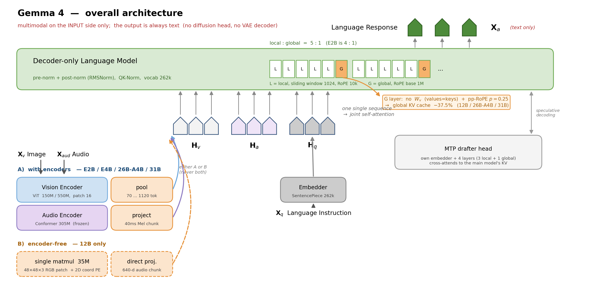

# Gemma 4 Technical Report

## 📋 메타 정보

| 항목 | 내용 |
|---|---|
| **제목** | Gemma 4 Technical Report |
| **저자** | Gemma Team (Sherif El Abd, Vaibhav Aggarwal, Robin Algayres, Alek Andreev, Olivier Bachem 외 295명) |
| **소속** | Google DeepMind |
| **공개일** | 2026-07-02 |
| **분야** | open-weight(공개 가중치) natively multimodal LLM — 텍스트 + 이미지 + 오디오 |
| **arXiv** | [abs](https://arxiv.org/abs/2607.02770) · [html](https://arxiv.org/html/2607.02770v1) |
| **라이선스** | **Apache 2.0** (Gemma 1~3의 커스텀 "Gemma Terms of Use"에서 전환) |
| **분류** | cs.CL, cs.AI |
| **선행 논문** | Gemma 3 / Gemma 3n (per-layer embeddings 계승) |
| **핵심 인용** | Barbero et al., ICLR 2025 — "Round and round we go! What makes rotary positional encodings useful?" (pp-RoPE의 출처) |

---

## 📖 주요 용어 사전 (Glossary)

### 아키텍처
- **dense(밀집) 모델**: 모든 파라미터가 매 토큰마다 전부 계산에 참여하는 표준 Transformer. Gemma 4의 E2B·E4B·12B·31B가 여기 해당.
- **MoE (Mixture-of-Experts, 전문가 혼합)**: 여러 개의 FFN "전문가" 중 일부만 골라 쓰는 구조. 총 파라미터는 크지만 실제 계산량(활성 파라미터)은 작음. Gemma 4의 26B-A4B가 유일한 MoE (26B 총 / 3.8B 활성).
- **PLE (per-layer embeddings, 레이어별 임베딩)**: Gemma 3n에서 가져온 기법. 임베딩 테이블을 레이어마다 따로 두되 실제 연산(matmul)에는 참여시키지 않아, **총 파라미터는 크지만 유효(effective) 파라미터는 작게** 만듦. E2B가 총 5B인데 유효 2.3B인 이유.
- **GQA / local-global attention(로컬-글로벌 어텐션)**: 대부분의 레이어는 가까운 토큰만 보는 sliding window(슬라이딩 윈도우) local attention으로, 소수 레이어만 전체를 보는 global attention으로 두는 설계. Gemma 4는 로컬:글로벌 = **4:1 (E2B)** / **5:1 (나머지 전부)**.
- **KV cache(키-값 캐시)**: autoregressive(자기회귀) 생성 시 이미 계산한 key·value 텐서를 저장해 두는 메모리. 컨텍스트가 길어질수록 이게 병목이 됨. 이 논문 효율 개선의 주 타깃.
- **encoder-free(인코더 없는)**: 이미지·오디오를 전용 인코더(ViT, Conformer)로 먼저 압축하지 않고, raw 패치를 곧장 LLM 임베딩 공간에 투영하는 설계. Gemma 4 **12B 전용**.
- **drafter head / MTP (multi-token prediction, 다중 토큰 예측)**: 본체 모델 옆에 붙인 작은 보조 모델. 다음 토큰 여러 개를 미리 "초안"으로 뽑아 본체가 한 번에 검증하게 함 → speculative decoding(추측 디코딩)으로 생성 속도 가속.

### 핵심 개념
- **RoPE (rotary positional embedding, 회전 위치 임베딩)**: 토큰의 위치 정보를, query·key 벡터를 위치에 비례한 각도만큼 "회전"시켜 넣는 방식. 차원 쌍마다 회전 주파수가 다름.
- **partial RoPE / pp-RoPE (부분 회전 RoPE)**: head 차원의 **일부만 회전**시키고 나머지는 회전 없이(NoPE) 두는 변형. Gemma 4는 global attention 레이어에 `p=0.25` (= 25%만 회전) 적용. 출처는 Barbero et al. 2025 — RoPE의 저주파 회전 성분은 위치 정보를 거의 나르지 않으면서 의미 채널만 갉아먹는다는 관찰.
- **values=keys (키를 값으로 재사용)**: global attention 레이어에서 value projection(값 투영 행렬)을 아예 두지 않고, key 텐서를 그대로 value로 사용. 원문 표현 그대로 `values=keys`.
- **thinking mode(사고 모드)**: 답변을 내놓기 전에 추론 과정(reasoning trace)을 먼저 출력하는 모드. 시스템 턴의 제어 토큰으로 켬.

### 평가
- **RULER**: 긴 컨텍스트에서 정보를 찾아내는 능력을 재는 벤치마크 (needle-in-a-haystack 계열의 확장판).
- **LOFT**: 긴 문맥 안에서 검색(retrieval) 성능을 재는 벤치마크. Recall@k로 측정.
- **Codeforces Elo**: 경쟁 프로그래밍 문제 풀이 실력을 Elo 점수로 환산한 지표.
- **LMArena Elo**: 사람이 두 모델의 답변을 블라인드 비교해 매기는 순위 점수.

---

## 🎯 논문 요약 (TL;DR)

> ⚠️ **먼저 짚을 것 — 이미지 생성 모델이 아니다.** Gemma 4는 이미지·오디오를 **입력으로만** 받고 **출력은 텍스트뿐**인 **VLM**(정확히는 omni-modal LLM)이다. diffusion head도 VAE decoder도 없다. 자세히는 §Q6·Q7. 이 문서를 이미지 생성 맥락에서 읽는 법은 §Q2·Q2-b.

**한 줄**: Gemma 4는 새 학습 알고리즘 논문이 아니라 **"메모리·추론 효율 설계 모음집"**이다. 성능 점프의 근거를 학습법이 아니라 세 가지 구조 선택 — (1) KV cache를 37.5% 줄이는 attention 설계, (2) 12B에서 vision/audio encoder를 통째로 없앤 encoder-free 구조, (3) thinking mode 추가 — 에 두고 있다.

**핵심 문제**: 공개 가중치 모델은 프론티어 모델과 성능으로 겨루면서도 **모바일·단일 GPU에서 돌아가야 한다**. 이때 실질적 병목은 파라미터 수가 아니라 긴 컨텍스트에서 폭증하는 KV cache 메모리, 그리고 멀티모달 인코더가 차지하는 별도 메모리 조각(memory fragmentation)이다.

**해결책**: 파라미터를 줄이는 대신 **캐시해야 할 텐서 자체를 줄인다**. global attention에서 value를 없애고(`values=keys`), RoPE를 25%만 걸어 회전 안 한 차원은 key와 value가 동일해지게 만든다 → global KV cache 37.5% 절감(§3.1). 멀티모달은 12B에서 550M ViT를 **35M 행렬곱 하나**로 대체(§3.2).

**검증**: LMArena 텍스트에서 31B가 Elo 1451(43위)로 "10배 큰 모델과 겨룬다"고 주장. thinking mode 기준 AIME 2026 89.2, Codeforces Elo 2150, MMLU-Pro 85.2. 128k 컨텍스트에서 RULER 96.4.

**⚠️ 다만**: 위 세 기법 중 **어느 것도 통제된 ablation(제거 실험)으로 격리 검증되지 않았다.** 학습 관련 정보(사전학습 토큰 수, distillation 여부, RL 알고리즘, MoE 라우팅 설계)는 리포트에 **아예 없다**. 자세한 검증 결과는 §6.

---

## 🏆 핵심 기여 (Contributions)

1. **pp-RoPE + values=keys 조합으로 global KV cache 37.5% 절감** — 도메인 무관하게 이식 가능한, 이 리포트에서 가장 재사용 가치 높은 아이디어.
2. **12B의 encoder-free 멀티모달** — 550M vision encoder를 35M matmul로, Conformer audio encoder를 직접 투영으로 대체.
3. **thinking mode 도입** — Gemma 3 대비 가장 큰 기능적 차이.
4. **모바일 겨냥 양자화 + MTP drafter head** — E2B를 0.8GB까지 압축, 262k vocab projection을 top-k 클러스터로 축소.
5. **Apache 2.0 라이선스로 전환** — 벤치마크 숫자보다 실무적으로 큰 뉴스.

---

## 🧱 모델 라인업

*모델마다 "어디에 배포할 것인가"가 다르고, 그에 따라 인코더 유무와 파라미터 배치가 갈리므로 먼저 전체 지형부터 본다.*

| 모델 | 형태 | 파라미터 | Vision Encoder | Audio Encoder | Drafter |
|---|---|---|---|---|---|
| **E2B** | Dense | 2.3B 유효 / 5B 총 | 150M ViT | 305M Conformer | 76M |
| **E4B** | Dense | 4.5B 유효 / 8B 총 | 150M ViT | 305M Conformer | 77M |
| **12B** | Dense | 12B | **없음 (35M matmul)** | **없음 (직접 투영)** | 400M |
| **26B-A4B** | MoE | 26B 총 / 3.8B 활성 | 550M ViT | — | 430M |
| **31B** | Dense | 31B | 550M ViT | — | 500M |

- 어휘(vocabulary)는 전 모델 **262k** 공유. SentencePiece tokenizer (split digits, preserved whitespace, byte-level encodings).
- E2B/E4B의 "유효 vs 총" 격차는 **PLE(per-layer embeddings)** 때문 — 5B 중 2.3B만 실제 연산에 참여하고, 나머지 임베딩 테이블은 메모리에만 얹혀 있음. 모바일에서 유리한 배치.
- 정규화는 RMSNorm 기반 **pre-norm + post-norm** 병용, 안정성을 위해 **QK-Norm** 사용.
- 오디오는 **E2B·E4B·12B에만** 존재 (26B-A4B·31B는 텍스트+비전).

### Table 1 (파라미터 분해, 리포트 원표)

| Model | Audio Enc | Vision Enc | Embedder | Einsums | Drafter |
|---|---|---|---|---|---|
| E2B | 305M | 150M | 400M + 2,340M | 1,870M | 76M |
| E4B | 305M | 150M | 670M + 2,820M | 3,940M | 77M |
| 12B | — | — | 1,000M | 10,890M | 400M |
| 26B-A4B | — | 550M | 740M | 24,500M / 2,800M (active) | 430M |
| 31B | — | 550M | 1,410M | 29,290M | 500M |

> E2B/E4B의 두 번째 embedder 숫자(2,340M / 2,820M)가 per-layer embeddings.
> ⚠️ 26B-A4B의 활성 파라미터가 본문에선 "3.8B activated", Table 1 einsums에선 "2,800M active"로 **불일치**한다. 전자는 embedder 포함, 후자는 einsum만 센 것으로 보이지만 리포트가 명시하지 않는다.

### Vision Encoder 스펙 (Table 10)

| 크기 | 적용 모델 | dim | MLP | heads | layers | patch |
|---|---|---|---|---|---|---|
| 550M | 26B-A4B, 31B | 1152 | 4304 | 16 | 27 | 16 |
| 150M | E2B, E4B | 768 | 3072 | 12 | 16 | 16 |

- 위치 정보: **axial 2D-RoPE + 2D absolute positional embeddings** 병용.
- 이미지 토큰 수는 **70 / 140 / 280 / 560 / 1120** 중에서 선택 (종횡비 보존 리사이즈 + 풀링).
- Audio encoder(305M, E2B/E4B): downsampling conv 2층 + **Conformer 12층**, 40ms 청크 Mel filterbank 입력. **사전학습 동안 동결(frozen)**. Gemma 3n의 680M에서 55% 감축.

---

## 🔬 주요 알고리즘 설명

### 3.1 KV cache 37.5% 절감 — 이 리포트에서 제일 예쁜 부분

*긴 컨텍스트에서 진짜 메모리를 잡아먹는 건 파라미터가 아니라 KV cache다. 그래서 "파라미터를 줄이자"가 아니라 "캐시해야 할 텐서 자체를 없애자"로 접근한다.*

리포트는 이걸 한 문단에 툭 던지고 지나가는데, 산수를 맞춰보면 설계 의도가 아주 깔끔하게 드러난다. 세 가지가 겹쳐 있다.

**리포트 원문 (Long-context efficiency 절)**:
> "Our local to global attention ratio patterns follow Gemma Team [2025a], that is, 4-to-1 local attention blocks for E2B and 5-to-1 for the rest. We improve memory efficiency by re-using keys as values in the global attention layers (except in E2B and E4B), i.e., values=keys. We encode position with pp-RoPE with p=0.25 on global attention layers and with RoPE on local attention layers, effectively reducing the global KV cache by 37.5%. The RoPE frequencies are set to 1M and 10k on global and local attention layers, respectively. Finally, we share the KV cache with ratios of 20/35 and 18/42 for the E2B and E4B model."

#### ① value를 아예 없앴다 (`values=keys`)

global attention 레이어에서 value projection(값 투영 행렬)을 두지 않고, key 텐서를 그대로 value로 쓴다. E2B/E4B는 제외 → 즉 **12B, 26B-A4B, 31B에 적용**.

##### 코드로 보면 — `W_v`라는 행렬이 모델에 아예 없다

*"value를 없앴다"는 건 계산 중에 뭘 지웠다는 게 아니라, 모델을 만들 때 **v를 만드는 부품을 안 달았다**는 뜻이다.*

원래 attention은 입력 x 하나에서 **서로 다른 행렬 세 개**를 통과시켜 세 역할을 뽑는다.

| | 역할 | 도서관 비유 |
|---|---|---|
| **q** (query) | 내가 뭘 찾는지 | "요리 관련 책 찾아줘" |
| **k** (key) | 나를 찾는 기준 (색인) | 책등에 붙은 **분류 라벨** |
| **v** (value) | 찾아지면 건넬 내용 | 책의 **본문** |

`values=keys`는 **본문을 따로 안 쓰고, 라벨에 적힌 걸 그대로 본문으로 건네주는 것**이다.

```python
# ══════════ 표준 attention ══════════
class Attention(nn.Module):
    def __init__(self, d, n_head, n_kv, hd):
        self.W_q = nn.Linear(d, n_head * hd, bias=False)
        self.W_k = nn.Linear(d, n_kv   * hd, bias=False)
        self.W_v = nn.Linear(d, n_kv   * hd, bias=False)   # ★ 이 줄이 있다
        self.W_o = nn.Linear(n_head * hd, d, bias=False)

    def forward(self, x, cache, pos):
        q = self.W_q(x)                 # matmul 1
        k = self.W_k(x)                 # matmul 2
        v = self.W_v(x)                 # matmul 3  ← 이것도 돈다
        q, k = rope(q, pos), rope(k, pos)          # k는 100% 회전
        cache.append(k=k, v=v)          # ★ 두 텐서를 각각 저장 → 2d
        k_all, v_all = cache.get()
        out = softmax(q @ k_all.T / sqrt(hd)) @ v_all
        return self.W_o(out)


# ══════════ Gemma 4 global layer ══════════
class GlobalAttention(nn.Module):
    def __init__(self, d, n_head, n_kv, hd, p=0.25):
        self.W_q = nn.Linear(d, n_head * hd, bias=False)
        self.W_k = nn.Linear(d, n_kv   * hd, bias=False)
        # self.W_v 가 아예 없다  ★ 파라미터도, 연산도, 캐시도 같이 사라짐
        self.W_o = nn.Linear(n_head * hd, d, bias=False)
        self.r = int(p * hd)            # 회전할 앞부분 크기

    def forward(self, x, cache, pos):
        q     = self.W_q(x)             # matmul 1
        k_raw = self.W_k(x)             # matmul 2
                                        # matmul 3 없음 ★
        q = cat([rope(q[..., :self.r], pos), q[..., self.r:]])
        k = cat([rope(k_raw[..., :self.r], pos), k_raw[..., self.r:]])
        v = k_raw                       # ★ 새로 만드는 게 아니라 재사용

        cache.append(base=k_raw,               # d
                     rot =k[..., :self.r])     # 0.25d  → 합 1.25d
        k_all, v_all = cache.get()
        out = softmax(q @ k_all.T / sqrt(hd)) @ v_all
        return self.W_o(out)
```

캐시 쪽을 들여다보면 이렇게 된다.

```python
# ══ 표준 캐시: 남남인 두 텐서 ══
class KVCache:
    def append(self, k, v):
        self.k.append(k)        # d
        self.v.append(v)        # d      → 총 2d
    def get(self):
        return cat(self.k), cat(self.v)

# ══ Gemma 4 캐시: 겹치는 부분을 공유 ══
class SharedKVCache:
    def append(self, base, rot):
        self.base.append(base)  # d      ← 회전 전 원본. 이게 곧 value
        self.rot.append(rot)    # 0.25d  ← key의 앞부분만
                                #          → 총 1.25d
    def get(self):
        base = cat(self.base)
        k = cat([cat(self.rot), base[..., self.r:]])   # 회전본 + 원본 뒤쪽
        v = base                                       # 원본 그대로
        return k, v
```

`v = base`. **v를 위해 따로 들고 있는 메모리가 한 칸도 없다.**

##### 없애서 얻는 것 세 가지 — 그런데 ①은 미미하다

```
W_v 삭제 ─┬─► ① 파라미터 감소   (행렬 하나가 통째로 사라짐)
          ├─► ② 연산 감소       (매 토큰마다 matmul 한 번 덜)
          └─► ③ KV cache 감소   ★ 이게 진짜 목적
```

31B를 d=5376, GQA로 kv 폭 1024라 놓으면 `W_v` 하나는 5376 × 1024 ≈ **5.5M**이다. global layer가 열 몇 개니 다 합쳐도 **60~70M, 31B의 0.2%**밖에 안 된다. **이건 "모델을 가볍게 하는 기법"이 아니다.** TL;DR의 표현대로 *"파라미터를 줄이는 대신 캐시해야 할 텐서 자체를 줄인다"* — ③이 목적이고 ①②는 부수입이다.

#### ①-b ⚠️ 그런데 이건 성능에는 손해 아닌가 — 맞다. 개선이 아니라 거래다

*여기서 반드시 짚어야 할 게 있다. "라벨을 본문으로 준다"는 건 **attention의 설계 원리를 거스르는 것**이다. 그럼 성능이 좋아졌다는 뜻인가? 아니다.*

리포트가 `values=keys`에 대해 한 말은 이 한 문장이 전부다.

> "We **improve memory efficiency** by re-using keys as values in the global attention layers"

**improve memory efficiency.** 성능이 좋아졌다는 말은 **어디에도 없다.** 품질 비교표도, ablation도 없다. 즉 *"value 쓸 때보다 더 좋았나"* 는 **리포트가 애초에 주장하지 않은 것**이다.

##### 왜 손해인가

attention의 설계 자체가 **"찾는 기준"과 "건네줄 내용"을 분리한 것**이다.

```
k = "나를 언제 불러야 하는가"    (검색 조건)
v = "불렸을 때 무엇을 줄 것인가"  (전달 내용)
```

"요리"라는 키워드로 찾아지지만 내용은 레시피여야 하는 책처럼, **찾히는 조건과 담긴 내용은 원래 다른 것**이다. 이걸 하나로 묶으면 `W_k`가 **겸직**하게 된다 — attention score도 맞춰야 하고 전달할 내용도 실어야 하니 둘 다 어중간해질 수밖에 없다. **표현력이 주는 게 맞다.**

뒤따르는 `W_o`가 `W_v`의 일을 어느 정도 흡수할 수는 있다. 하지만 `W_o`는 **모든 head가 공유하는 하나의 행렬**이라, head마다 다른 변환을 하던 `W_v`를 대신할 수 없다. 손실을 줄여줄 뿐 없애주지 못한다.

##### 결정적 정황: 작은 모델에서는 안 썼다

리포트 원문이 못 박는다 — **"except in E2B and E4B"**.

**공짜거나 더 좋은 기법이었다면 전 모델에 썼을 것이다.** 빼놨다는 건 저자들도 **대가가 있다는 걸 안다**는 뜻이다. 큰 모델은 파라미터 여유가 있어 겸직 부담을 흡수하지만, 작은 모델은 못 버티니 제외한 것으로 읽는 게 자연스럽다. (대신 E2B/E4B는 레이어 간 KV 공유라는 다른 방법을 쓴다 → ④)

##### 그리고 이런 거래는 이미 업계 표준이다

"attention 원리에 반한다"는 감각은 정확한데, **그 방향으로 이미 몇 년째 밀고 온 계보**가 있다.

| | 무엇을 깎았나 | 대가 |
|---|---|---|
| **MHA** (원조) | — | 캐시가 head 수만큼 |
| **MQA** (Shazeer 2019) | k·v를 head 하나로 통일 | 품질 저하 있음 — **원논문도 인정** |
| **GQA** (Ainslie 2023) | k·v head를 그룹당 하나로 | MQA보다 완화, 지금 사실상 표준 |
| **values=keys** (Gemma 4) | **v를 아예 삭제** | **측정된 바 없음** |

지금 거의 모든 대형 모델이 GQA를 쓴다. **"표현력을 조금 내주고 KV cache를 크게 사는" 거래는 이미 기본값**이고, `values=keys`는 그 선을 한 칸 더 민 것이다.

##### 왜 그 거래가 남는 장사인가

[[paper_gemma_3]] 에 이미 나온 사실이 배경이다 — **양자화를 밀어붙일수록 KV cache만 병목으로 남는다.** 가중치는 int4로 4배 줄지만 KV cache 몫은 양자화해도 그대로다. E2B를 0.8GB에 밀어넣는 게 목표인 모델에게는 벤치마크 0.몇 점보다 그쪽이 급하다.

**⚠️ 다만 근본 문제는 남는다 — 대가의 크기를 아무도 모른다.** 통제 비교가 없어서 "얼마를 내주고 37.5%를 샀는지" 알 수가 없다 (→ §이 리포트의 빈칸).

#### ② pp-RoPE with p=0.25

인용은 **Barbero et al., ICLR 2025 "Round and round we go! What makes rotary positional encodings useful?"**. 그 논문의 요지는 RoPE의 **저주파 회전 성분이 실은 위치 정보를 거의 안 나르고 오히려 의미 채널을 갉아먹는다**는 것이고, 처방이 **head 차원의 일부만 회전시키고 나머지는 회전 없이(NoPE) 두는 partial RoPE**다. `p=0.25`면 25%만 회전.

##### 왜 "일부만" 거는 게 말이 되는가 — 한 줄로: 어차피 일 안 하는 차원이 대부분이라서

RoPE는 차원 쌍마다 **회전 속도가 다르다.** 앞쪽 차원은 빠르게 돌고, 뒤로 갈수록 점점 느려진다.

```
앞쪽 차원  →  초침처럼 빠름   : 옆 토큰과도 각도가 확 달라짐 → 위치 구분 잘 됨
뒤쪽 차원  →  시침보다 느림   : 1번 토큰과 10만번 토큰의 각도가 거의 똑같음 → 위치 구분 못 함
```

느린 차원들은 문장 전체를 지나가도 바늘이 거의 안 움직인다. **위치 정보를 사실상 하나도 못 나른다.**

그런데 회전을 걸긴 걸었으니 그 차원의 **값은 살짝 뒤틀린다.** 원래 담고 있던 의미가 조금씩 어그러진다.

**즉 이득은 0인데 손해만 있는 차원들이다.** 그래서 뺀다. 이게 Barbero et al.의 관찰이고, 실제로 빼도 성능이 안 떨어졌다.

그리고 Gemma 4에서는 여기에 **덤이 하나 붙는다.** 회전을 안 건 차원은 key와 value가 같은 값이 되니 캐시에 한 번만 저장하면 된다.

```
일부만 회전 →  ① 쓸모없는 뒤틀림 제거   (원래 목적, Barbero et al.)
               ② 안 돌린 부분은 캐시 공짜 (Gemma 4의 덤)
```

⚠️ **25%라는 숫자 자체는 "이 정도면 위치 구분에 충분하더라"는 실험적인 값**이고 이론적 근거는 없다.

#### ③ 왜 정확히 37.5%인가 — 산수 재구성

리포트는 산수를 안 써놨지만 딱 맞아떨어진다.

기존엔 head 하나당 **key(차원 d) + value(차원 d) = 2d**를 캐시해야 한다.

그런데:
- value가 key와 같아졌고 (`values=keys`),
- key의 **75%는 회전조차 안 되니** value와 완전히 동일한 값이다.

그러면 저장할 것은:
```
회전 전 key 벡터 전체        →  d      (이게 곧 value)
회전된 25% 부분만 추가로      →  0.25d
──────────────────────────────────────
총                            1.25d
```

`1.25d / 2d = 0.625` → **정확히 37.5% 절감**.

> ⚠️ 이 유도는 **본 문서 작성 시 맞춘 재구성**이고 리포트에 명시되어 있지 않다. 다만 수치가 우연이라기엔 너무 정확하다.

#### ③-b 왜 "회전된 앞 25%"를 굳이 따로 저장하는가

*위 산수에서 제일 헷갈리는 게 이 줄이다. "value를 없앴다면서 왜 뭔가를 또 저장하지?" — 순서대로 풀어보면 답이 나온다.*

##### 전제 0. RoPE는 위치를 "더하는" 게 아니라 q·k를 "회전"시킨다

*여기서 흔한 오해 하나를 먼저 걷어야 한다 — "위치 벡터를 만들어 x에 더하는 것"으로 알고 있으면 이 절 전체가 안 읽힌다.*

"위치 벡터를 만들어 입력에 더한다"는 건 **원조 Transformer의 sinusoidal PE(absolute positional embedding)** 방식이다. RoPE는 그걸 **대체하려고** 나온 것이라 셋 다 다르다.

| | 원조 PE (더하는 방식) | **RoPE** |
|---|---|---|
| **무엇을 쓰나** | position (몇 번째인지) | position — **token id 아님** |
| **어디에 거나** | 입력 임베딩에 **딱 한 번** | **q와 k에, 매 층마다** |
| **어떻게** | **더한다** (add) | **회전시킨다** (곱) |
| **v에 영향** | **간다** (임베딩에 더했으니 v에도 섞임) | **안 간다** |

`token id`는 어휘 사전 번호다 — "cat"=1234 같은. 문장에서 몇 번째인지와는 아무 상관이 없다. RoPE가 쓰는 건 **position**(0, 1, 2, …)이다.

```python
# ══ 원조 방식: 위치 벡터를 만들어 더한다 ══
x = embed_table[token_ids] + pos_table[positions]   # ★ 더하기, 딱 한 번
for layer in layers:
    q, k, v = W_q(x), W_k(x), W_v(x)   # 셋 다 위치가 섞인 x에서 나옴
    ...                                 # → v에도 위치 정보가 들어가 있다

# ══ RoPE: q와 k를 매 층 회전시킨다 ══
x = embed_table[token_ids]              # ★ 위치 정보 없음. 순수 의미만
for layer in layers:
    q, k, v = W_q(x), W_k(x), W_v(x)
    q = rotate(q, positions)            # ★ 곱하기, 매 층마다
    k = rotate(k, positions)
    # v는 손 안 댐  ← 위치 정보가 끝까지 안 들어간다
```

회전이 실제로 하는 일:

```python
def rotate(t, pos):
    theta = pos * freq          # 위치 × 주파수 (차원 쌍마다 freq가 다름)
    a, b = t[..., 0::2], t[..., 1::2]      # 숫자를 둘씩 짝지어
    return interleave(a*cos(theta) - b*sin(theta),   # 2D 평면에서
                      a*sin(theta) + b*cos(theta))   # 그 각도만큼 돌림
```

**그리고 이게 이 절 전체의 전제다.** 만약 원조 방식이었다면 위치 정보가 애초에 x에 섞여 있으니 **v도 이미 위치에 오염된 상태**고, "v를 깨끗하게 유지한다"는 얘기 자체가 성립하지 않는다. **RoPE가 v를 건드리지 않기 때문에** `values=keys`에서 "회전 전 원본을 v로 쓴다"가 의미를 갖는다.

##### 전제 1. RoPE는 원래부터 q와 k에만 건다

먼저 오해를 걷어내야 한다. **RoPE를 v에 안 거는 건 Gemma 4가 새로 한 게 아니라 표준이 원래 그렇다.**

```
표준 Transformer + RoPE
   q  ──► RoPE 건다   ✓
   k  ──► RoPE 건다   ✓
   v  ──► 안 건다     ✗   ← 원래부터
```

회전은 **q와 k를 내적할 때 서로 맞물려 상쇄되라고** 넣은 장치다. 위치 i의 query와 위치 j의 key를 내적하면 각자의 회전이 맞물려 **위치 차이(j−i)에만 의존하는 값**이 남는다. 절대 위치는 소거되고 상대 위치만 남는 것 — 이게 RoPE가 작동하는 이유 전부다.

**그런데 v에는 상쇄해줄 짝이 없다.** v는 내적에 들어가는 게 아니라 attention 가중치로 평균 내어져 **그대로 다음 층으로 나가는 출력**이다. 걸면 그냥 오염이다.

그래서 Gemma 4가 실제로 바꾼 건 RoPE 적용 대상이 아니라 다른 두 가지다.

| | 표준 | Gemma 4 global layer |
|---|---|---|
| q | W_q로 만들고 RoPE **전체** | W_q로 만들고 pp-RoPE **앞 25%만** |
| k | W_k로 만들고 RoPE **전체** | W_k로 만들고 pp-RoPE **앞 25%만** |
| v | **W_v로 따로 만들고** RoPE 없음 | **W_v가 없음** → k_raw를 그대로, RoPE 없음 |

> 참고로 **q는 캐시 논의에 안 나온다.** q는 지금 생성 중인 토큰 것만 있으면 되고 과거 것을 쌓아둘 필요가 없다. KV cache라고 부르지 QKV cache라고 안 하는 이유다.

##### 전제 2. 표준에서도 k는 두 형태로 존재하고, 하나는 버려진다

잘 안 보이는 사실인데, 표준 구현에서도 k는 두 단계를 거친다.

```
x ─ W_k ─► k_raw ─ RoPE ─► k'
           ↑                ↑
      회전 전 원본       회전 후
      (쓰고 버림)      (이것만 캐시에 저장)
```

**표준은 k_raw를 쓰고 그냥 버린다.** v는 W_v로 따로 만들어 저장하니까.

**Gemma 4는 버려지던 그 k_raw를 v 자리에 앉힌 것**이다.

```
Gemma 4:  x ─ W_k ─► k_raw ─┬─ pp-RoPE ─► k'   (저장)
                            └───────────► v    (저장, = k_raw)
                            ↑
                    여기서 갈라진다 (RoPE 이전!)
```

반죽 하나로 빵 두 개를 만드는데 **하나만 오븐에 넣는** 셈이다. 오븐에 안 들어간 쪽이 value다. 재료가 같을 뿐 최종 결과물은 다른 텐서 두 개로 메모리에 존재한다.

코드로 보면 한 줄 차이다.

```python
k_raw = W_k(x)          # 여기까지가 공유

k = apply_rope(k_raw)   # key:   회전 O  ← 새 텐서
v = k_raw               # value: 회전 X  ← 원본 그대로
```

`v = apply_rope(k_raw)`가 **아니라** `v = k_raw`다.

##### 그래서 "앞 25%에서만 다르다"는 게 무슨 뜻인가

숫자로 보는 게 제일 빠르다. head_dim을 8이라 하고(실제론 128쯤), p=0.25니까 **앞 2칸만** 회전한다고 하자.

```
W_k를 통과한 원본 숫자 (8칸):
k_raw = [ 3.0 , 1.0 , 0.5 , -2.0 , 1.5 , 0.7 , -1.1 , 0.9 ]
         └─앞 2칸─┘  └──────── 뒤 6칸 (75%) ────────┘

앞 2칸에만 회전을 건다 → [3.0, 1.0] 을 돌려서 [2.1, 2.4] 가 됐다고 하자
뒤 6칸은 손 안 댐

key   = [ 2.1 , 2.4 , 0.5 , -2.0 , 1.5 , 0.7 , -1.1 , 0.9 ]
value = [ 3.0 , 1.0 , 0.5 , -2.0 , 1.5 , 0.7 , -1.1 , 0.9 ]
          ↑     ↑     ↑─────────── 여기부터 끝까지 ──────────↑
        다름  다름              전부 글자 하나까지 동일
```

이게 **"앞 25%에서만 다르다"**의 뜻이다. 두 배열을 위아래로 놓고 비교하면 앞 2칸에서만 숫자가 어긋나고, 나머지 6칸은 같은 값이 그대로 복사돼 있다.

> **RoPE의 "회전"이란**: 숫자를 두 개씩 짝지어 시계바늘처럼 돌리는 것. 위 예에서 `[3.0, 1.0]`이 `[2.1, 2.4]`가 된 게 그거다 — 길이는 그대로인데 방향만 틀어졌다. 그리고 **토큰이 문장에서 몇 번째냐에 따라 돌리는 각도가 다르다.** 이게 모델에 위치를 알려주는 방법이다.

##### 캐시 저장 계산

```
뒤 6칸  →  한 벌만 저장        (key도 value도 이걸 그대로 씀)
앞 2칸  →  [3.0, 1.0] 저장     (value용, 회전 전)
           [2.1, 2.4] 저장     (key용, 회전 후)
─────────────────────────────────
합계 = 6 + 2 + 2 = 10칸

원래대로면: key 8칸 + value 8칸 = 16칸
10 / 16 = 0.625  →  37.5% 절감
```

똑같은 숫자를 두 번 적어두는 낭비를 없앤 것뿐이다. **뒤 6칸은 어차피 같은 값이니 한 번만 적고 둘이 나눠 쓰고, 실제로 값이 갈라지는 앞 2칸만 두 벌 적는다.** head_dim 128이면 96칸 공유 + 32칸 두 벌 = 160칸, 역시 1.25 × 128이다.

##### 그럼 왜 value로 "회전 후 key"를 쓰지 않았나 — 그러면 50%인데

여기가 진짜 급소다. value를 그냥 `k'`(회전 후)로 쓰면 저장할 게 하나뿐이라 **50% 절감**이 된다. 왜 안 그랬을까.

**value에 위치 회전이 걸리면 출력이 망가지기 때문이다.**

```
같은 단어 "cat"이 위치 5와 위치 900에 있고, 둘 다 똑같이 주목받는다고 하자.

value에 회전이 걸린 경우:
   위치 5   → v를 각도 θ₅ 만큼 돌린 벡터
   위치 900 → v를 각도 θ₉₀₀ 만큼 돌린 벡터
   이 둘을 평균 → 서로 다른 방향이라 크기가 줄어듦
                  (각도 차가 180도에 가까우면 거의 0으로 소멸)

value가 원본인 경우:
   위치 5   → v
   위치 900 → v
   평균 → v            (그대로 살아남음)
```

**같은 내용의 토큰이 어디에 있었느냐에 따라 출력 벡터의 방향이 달라지고, 여러 위치의 것을 섞으면 서로 깎아먹는다.** 위치는 *"누구를 볼지"* 를 정하는 데 쓰여야지 *"무엇을 가져올지"* 를 뒤틀면 안 된다. `values=keys`를 하겠다고 이 원칙을 깰 수는 없다.

##### 그리고 37.5%라는 숫자 자체가 이 해석의 증거다

리포트 표현("re-using keys as values")만 보면 **회전 후 key를 재활용한다는 해석이 오히려 더 자연스럽다.** 리포트가 회전 전인지 후인지 말을 안 하기 때문이다. 그래서 해석이 둘 가능하다.

| 해석 | value로 쓰는 것 | 캐시에 저장할 것 | 절감률 |
|---|---|---|---|
| **A** | 회전 **후** key (`k'`) | key 하나면 끝 → d | **50%** |
| **B** | 회전 **전** 원본 (`k_raw`) | k_raw(d) + 회전된 앞 25%(0.25d) = 1.25d | **37.5%** |

**리포트가 말한 숫자는 37.5%다.** A라면 50%라고 썼어야 한다.

즉 **"37.5%"라는 수치 자체가 "value에는 회전이 안 걸려 있다"는 증거**다. 회전된 걸 그대로 재활용했다면 굳이 0.25d를 더 쓸 이유가 없다. **37.5%에서 멈춘 그 손해분이 정확히 "value를 깨끗하게 유지하는 값"** 이다.

##### 왜 "저장" 말고 "매번 다시 회전"이 아닌가

또 하나의 대안. 원본만 저장해두고(d) 필요할 때 앞 25%를 그때그때 회전시키면 이것도 50% 절감이다. 그런데 RoPE 회전은 **토큰의 절대 위치마다 각도가 다르므로**, 새 토큰 하나를 생성할 때마다 **캐시에 쌓인 과거 전 토큰의 앞 25%를 전부 다시 회전**시켜야 한다. 컨텍스트가 128k면 12만 8천 개를 매 스텝마다. 게다가 그 결과를 담을 임시 텐서가 결국 같은 크기로 잡히니 **메모리 피크는 별로 안 줄고 연산만 늘어난다.**

그래서 "37.5%에서 멈추고 저장하는 쪽"을 택한 것으로 보인다.

##### 왜 예전엔 이 재활용이 불가능했나

표준에는 두 겹의 벽이 있었다.

1. **v가 W_v로 만들어져 k와 완전히 남남** — 겹칠 숫자가 애초에 없음
2. **k는 100% 회전** — 설령 v를 k_raw로 바꿔도 `k'`와 `k_raw`가 전 차원에서 다름 → 2d 그대로, 절감 0

Gemma 4는 ①을 `values=keys`로, ②를 `pp-RoPE(p=0.25)`로 **동시에** 걷어냈다.

##### 덤 — p를 바꾸면 절감률이 바로 나온다

저장량이 `d + p·d`이고 원래가 `2d`니까, 절감률은 **(1 − p) / 2** 다.

| p (회전 비율) | 저장량 | 절감률 |
|---|---|---|
| 1.0 (표준 RoPE) | 2d | **0%** ← values=keys를 해도 소용없음 |
| 0.5 | 1.5d | 25% |
| **0.25 (Gemma 4)** | **1.25d** | **37.5%** |
| 0 (완전 NoPE) | d | 50% ← 대신 global층에 위치 정보가 사라짐 |

p=1이면 key는 전부 회전본, value는 전부 원본이라 **겹치는 차원이 하나도 없어서** 결국 2d를 저장해야 한다. **pp-RoPE가 "겹칠 구간"을 만들어줘야 비로소 `values=keys`가 돈이 되는 구조**다. 두 기법은 따로 떼면 각각 0인, **곱해져야 값이 나오는 조합**이다.

> ⚠️ 이 절 전체는 **37.5%에서 역산한 재구성**이다. 리포트는 저장 전략을 한 문장도 설명하지 않고 `values=keys`와 37.5%라는 결과 숫자만 던진다. 확정하려면 공개된 가중치에서 value projection 자리에 무엇이 들어가는지 확인해야 한다.

#### ④ 나머지 장치

- RoPE 주파수를 **global 1M / local 10k**로 갈라놨다.
- E2B/E4B는 추가로 레이어 간 **KV cache 공유** (비율 20/35, 18/42).
  ⚠️ 이 비율이 레이어 인덱스인지 head 인덱스인지 원문이 말해주지 않는다.
  → 다만 **분모를 총 레이어 수(E2B 35층 / E4B 42층)로 읽으면 앞뒤가 맞는다.** 근거는 §전체 구조 & 코드 플로우 > 6.

---

### 3.2 12B의 encoder 제거 (encoder-free)

*전용 인코더는 별도 메모리 조각(memory fragmentation)을 만들고 배포를 복잡하게 한다. 백본이 충분히 크다면 인코더가 하던 일을 직접 배울 수 있지 않을까 — 이게 12B의 도박이다.*

#### Vision

**550M vision encoder를 35M짜리 행렬곱(matmul) 하나로 대체**한다.

- 입력: **48×48×3 RGB 패치**
- 처리: 단일 large matmul (35M 파라미터)로 LLM 임베딩 공간에 직접 투영
- 공간 정보: **2D coordinate-based positional embeddings**를 패치 표현에 직접 더해서 챙김

원문:
> "Gemma 4 12B takes in 48×48×3 RGB patches, but replaces the 550M vision encoder by a single large matmul (35M parameters)."
> "Spatial awareness is maintained by adding 2D coordinate-based positional embeddings directly to the patch representations."

#### Audio

같은 철학. 16kHz raw 오디오를 **40ms 청크**로 잘라 **640차원 벡터**로 만든 뒤, **별도 위치 인코딩 없이** LLM 임베딩 공간에 직접 투영한다.

> "Raw audio is segmented into 40ms chunks at 16kHz, resulting in 640-dimensional vectors per chunk. These are projected directly into the LLM embedding space."

효과로 "별도 인코더가 필요 없어지고 memory fragmentation이 줄어든다"고 서술.

#### 이 흐름의 위치

이건 [[paper_tuna_2]] (raw RGB를 `Conv2d` 한 줄로 Qwen2.5-7B에 직접 주입), [[paper_sensenova_u1]] (2층 conv raw RGB 주입), [[paper_hidream_o1_image]] (VAE·별도 텍스트 인코더 없이 VLM backbone)와 **정확히 같은 가설** 위에 서 있다:

> *스케일이 충분하면 전용 인코더는 백본이 흡수할 수 있는 귀납 편향(inductive bias)에 불과하다.*

TUNA-2가 "scale에서 인코더 역전(crossover)"을 주장했는데, Gemma 4가 12B에서 이걸 **프로덕션 모델로 실행**했다는 게 의미가 있다.

#### ⚠️ 결정적인 게 빠졌다

리포트에 **인코더 있는 12B vs 없는 12B 통제 비교표가 없다.** 12B의 비전 성능 숫자(1120 토큰 기준 MMMU-Pro 69.1, MATH-Vision 79.7)는 있지만 대조군이 없으니, "인코더를 빼도 괜찮다"는 주장이 **논문 내부 증거로 지지되지 않는다**.

게다가 인코더를 뺀 게 하필 **12B 하나뿐**이고 26B-A4B/31B는 550M ViT를 그대로 유지한다. 스케일이 커질수록 인코더를 빼야 유리하다는 crossover 가설과는 **오히려 반대 방향의 배치**라, 왜 12B에서만 했는지 설명이 필요한데 없다.

---

### 3.3 Thinking mode

*수학·코딩처럼 중간 단계가 필요한 문제에서, 답을 바로 뱉게 하지 말고 생각을 먼저 적게 하면 정확도가 오른다.*

- 답변 전에 reasoning trace(추론 흔적)를 먼저 출력하는 모드.
- 시스템 턴(leading system turn)의 제어 토큰 `<|think|>`으로 토글, 출력 형식은 `<|channel>thought ...<channel|>` (Table 11).
- 원문: "By outputting a reasoning trace before the response, models demonstrate improved capabilities in reasoning-heavy domains such as mathematics and coding."
- Gemma 3 대비 "가장 큰 차이(A significant difference)"로 명시.

**⚠️ 그런데 이걸 어떻게 학습시켰는지가 리포트에 없다.** thinking budget 파라미터도, RLVR 같은 추론 전용 RL도 언급이 없다. 그냥 "Gemma 3와 유사한 post-training"이라고만 하고 넘어간다.

---

### 3.4 MTP drafter head (§2.6)

*생성 속도를 올리려면 본체를 매 토큰 한 번씩 돌리는 대신, 작은 모델이 여러 토큰을 미리 찍고 본체가 한 번에 검증하면 된다.*

MTP 쪽은 그래도 구체적이다.

- 구조: **별도 embedder + 4층 Transformer 블록**이 본체 모델의 KV에 **cross-attend** 한다.
  - 블록 구성: local attention 3층 + global attention 1층
  - 모델 차원: **256** (E2B/E4B), **1024** (26B-A4B/31B)
- E2B/E4B 최적화: 262k 전체 vocab projection을 **top-k 클러스터 연산**으로 대체
  → 최종 행렬곱이 `d×262,000`에서 `d×4,096`으로 축소, "preserving a similar acceptance rate".

원문:
> "The MTP head generates future tokens sequentially using a separate embedder and a 4-layer Transformer block that cross-attends to the KVs of the main model."

**⚠️ 구체적인 acceptance rate(%)도, speedup/latency 수치도 리포트에 없다.**

---

## 🏗️ 전체 구조 & 코드 플로우 (재구성)

*리포트에는 **구조 다이어그램도, 백본 하이퍼파라미터 표도 없다.** 그래서 §3의 서술 + Table 1 파라미터 분해 + Gemma 3에서 계승한 부분을 맞춰 "실제로 어떤 모양의 그래프인가"를 여기서 한 번 복원해 둔다. 추정 부분은 ⚠️로 표시한다.*

### 1. 전체 구조 — 입력 3갈래가 한 시퀀스로 합쳐진다



*(리포트에 구조도가 없어 본 문서에서 직접 그린 것. LLaVA 논문 Figure 1 형식에 맞췄다.)*

#### LLaVA와 대응시켜 보면

| LLaVA | Gemma 4 |
|---|---|
| Vision Encoder → Projection W | **A)** ViT 150M/550M → pool  /  **B)** 35M matmul 한 장 (12B) |
| — | **Audio 경로가 하나 더** (Conformer 305M 또는 직접 투영) |
| H_v + H_q | H_v + **H_a** + H_q |
| Language Model f_φ | 같은 자리인데 **내부가 L L L L L G 반복** ← 여기가 이 논문 |
| Language Response X_a | 동일 — **출력은 텍스트뿐** |

**LLaVA와 뼈대는 같다.** 인코더로 이미지를 토큰화해 텍스트 토큰 옆에 붙이고 LLM에 넣는 구조 그대로다. Gemma 4가 다른 건 세 곳 — ① 오디오 경로 추가, ② 12B는 인코더 자리가 행렬 한 장으로 대체(그림의 점선 박스), ③ **LLM 바 안쪽의 L/G 배치와 G 레이어의 KV 절감**(주황 콜아웃).

#### 텍스트 버전

```
 [텍스트]            [이미지]                    [오디오]
    │                   │                          │
    │        ┌──────────┴──────────┐    ┌──────────┴──────────┐
    │        │ A) 인코더 있음       │    │ A) 인코더 있음        │
    │        │  E2B/E4B: 150M ViT  │    │  E2B/E4B: 305M       │
    │        │  26B/31B: 550M ViT  │    │   Conformer(동결)     │
    │        │  patch 16, 2D-RoPE  │    │   conv2 + Conformer12 │
    │        │  + 2D abs PE        │    │   40ms Mel chunk      │
    │        │  → 70/140/280/      │    └──────────┬───────────┘
    │        │    560/1120 토큰    │               │
    │        ├─────────────────────┤    ┌──────────┴───────────┐
    │        │ B) encoder-free(12B)│    │ B) encoder-free(12B) │
    │        │  48×48×3 RGB 패치   │    │  16kHz raw → 40ms    │
    │        │  → 35M matmul 1장   │    │  → 640-dim 벡터      │
    │        │  + 2D 좌표 PE 더함  │    │  → 직접 투영(PE 없음) │
    │        └──────────┬──────────┘    └──────────┬───────────┘
    │                   │                          │
 [262k SentencePiece]   └──────────┬───────────────┘
    │                              │
    └──────────► [ 하나의 토큰 시퀀스로 concat ] ◄──────┘
                             │
              ╔══════════════▼══════════════╗
              ║   Decoder-only Transformer  ║
              ║   (local×N + global×1) 반복 ║   ← 여기가 §3.1
              ╚══════════════╤══════════════╝
                             │
                      RMSNorm → 262k logits ──► [텍스트만 출력]
                             │
                    (옆에) MTP drafter head ──► 초안 토큰 여러 개
```

출력은 **텍스트 한 갈래뿐**이다. 이미지·오디오로 돌아나가는 경로는 없다 (→ Q6).

### 2. 백본 반복 단위 — Gemma 3에서 그대로 계승

```
E2B (4:1)                     나머지 전부 (5:1)
┌──────────────┐              ┌──────────────┐
│ Local  sw=1024│ ×4          │ Local  sw=1024│ ×5
│ RoPE base 10k │             │ RoPE base 10k │
├──────────────┤              ├──────────────┤
│ Global        │ ×1          │ Global        │ ×1
│ pp-RoPE 1M    │             │ pp-RoPE 1M    │
│ values=keys   │             │ values=keys   │
└──────────────┘              └──────────────┘
   ↑ 이 5층 묶음 반복            ↑ 이 6층 묶음 반복
```

⚠️ E2B/E4B는 `values=keys`가 **적용 제외**다 (원문 "except in E2B and E4B"). 대신 레이어 간 KV cache 공유(20/35, 18/42)를 쓴다.

각 블록 내부 정규화는 **pre-norm + post-norm 병용(RMSNorm)** + **QK-Norm**:

```
x = x + post_norm( Attn( pre_norm(x) ) )
x = x + post_norm( MLP ( pre_norm(x) ) )
```

### 3. Global 블록 내부 — 이 논문의 유일한 알맹이

일반 attention과 뭐가 다른지 나란히 놓으면 이렇다.

```
【표준 (Gemma 3, 그리고 Local layer)】
 x ──┬─ W_q ─► q ─ RoPE(전체 회전) ─► q'
     ├─ W_k ─► k ─ RoPE(전체 회전) ─► k'  ──► 캐시 저장 (d)
     └─ W_v ─► v ────────────────────────► 캐시 저장 (d)
                                     캐시 합계 = 2d

【Gemma 4 Global layer】
 x ──┬─ W_q ─► q ─ pp-RoPE(앞 25%만) ─► q'
     └─ W_k ─► k ─┬─ 앞 25% 회전 ────► 캐시 저장 (0.25d)
                  └─ 뒤 75% 회전 안 함
                     k 원본 전체 ─────► 캐시 저장 (d)  ← 이게 곧 value
     (W_v 없음)                     캐시 합계 = 1.25d
                                     → 1.25d / 2d = 37.5% 절감
```

포인트는 두 개가 **맞물려야** 이득이 난다는 것이다.

- `values=keys` 하나만 하면: v를 안 저장하니 d, 하지만 k는 회전된 값이라 v로 못 씀 → 원본과 회전본 둘 다 필요해질 수 있음
- `pp-RoPE(p=0.25)` 하나만 하면: 캐시는 그대로 2d
- **둘을 겹치면**: 뒤 75%는 회전을 안 하니 key와 value가 비트 단위로 같은 값 → 한 번만 저장

왜 회전된 앞 25%를 굳이 따로 또 저장하는지, 그리고 p를 바꾸면 절감률이 어떻게 되는지는 §3.1 ③-b 참조.

### 4. 코드 플로우 (재구성 의사코드)

```python
# ── 입력단 ────────────────────────────────────────────────
def embed_inputs(text_ids, image, audio, cfg):
    tok = embed_table[text_ids]                    # 262k × d

    if image is not None:
        if cfg.encoder_free:                       # 12B
            p   = patchify(image, 48, 48)          # 48×48×3
            vis = p @ W_proj                       # 35M matmul 한 장
            vis = vis + coord_pe_2d(p.grid)        # 2D 좌표 PE를 "더함"
        else:                                      # E2B/E4B/26B/31B
            vis = vit(image)                       # 150M or 550M
            #  ↑ patch16, axial 2D-RoPE + 2D abs PE
            vis = pool_to(vis, n in {70,140,280,560,1120})

    if audio is not None:
        if cfg.encoder_free:                       # 12B
            ch  = chunk(audio_16k, ms=40)          # → 640-dim/chunk
            aud = ch @ W_audio                     # 직접 투영, PE 없음
        else:                                      # E2B/E4B
            aud = conformer12(conv_ds2(mel(audio)))   # 305M, 동결

    return concat([tok, vis, aud])                 # 한 시퀀스

# ── 백본 ──────────────────────────────────────────────────
def backbone(x, cache, cfg):
    ratio = 4 if cfg.name == "E2B" else 5          # local:global
    for i, layer in enumerate(layers):
        is_global = (i % (ratio + 1) == ratio)     # 묶음의 마지막이 global
        x = block(x, cache[i], is_global, cfg)
    return rms_norm(x) @ embed_table.T             # 262k logits

def block(x, kv, is_global, cfg):
    h = attn(pre_norm(x), kv, is_global, cfg)
    x = x + post_norm(h)
    h = mlp(pre_norm(x))                           # gated MLP
    return x + post_norm(h)

# ── attention: 여기가 갈린다 ───────────────────────────────
def attn(x, kv, is_global, cfg):
    q = qk_norm(W_q(x))

    if not is_global:                              # ── Local ──
        k, v = qk_norm(W_k(x)), W_v(x)
        q, k = rope(q, base=10_000), rope(k, base=10_000)
        kv.append(k, v)
        kv.trim(window=1024)                       # 캐시 1024개로 고정
        return sdpa(q, *kv.get(), mask="sliding")

    # ── Global ── (12B / 26B-A4B / 31B)
    k_raw = qk_norm(W_k(x))                        # W_v 자체가 없음
    d     = k_raw.shape[-1]
    r     = int(0.25 * d)                          # p = 0.25

    q = cat([rope(q[..., :r],     base=1_000_000), q[..., r:]])
    k = cat([rope(k_raw[..., :r], base=1_000_000), k_raw[..., r:]])
    v = k_raw                                      # values = keys (회전 전)

    kv.append_shared(base=k_raw,          # d      ← v이자 k의 뒤 75%
                     rotated=k[..., :r])  # 0.25d  ← k의 앞 25%만 추가
    #  저장 1.25d  vs  표준 2d
    return sdpa(q, k, v, mask="causal")

# ── MTP drafter (별도 모듈) ────────────────────────────────
def drafter(prev_tokens, main_kv, cfg):
    h = draft_embed[prev_tokens]                   # 별도 embedder
    for i in range(4):                             # local×3 + global×1
        h = self_attn(h)
        h = cross_attn(h, main_kv)                 # 본체 KV에 cross-attend
        h = mlp(h)
    if cfg.name in ("E2B", "E4B"):
        return h @ W_topk_cluster                  # d×4,096  (262k 대신)
    return h @ embed_table.T                       # d×262,000
```

### 5. 모델별 분기 한눈에

| | E2B | E4B | 12B | 26B-A4B | 31B |
|---|---|---|---|---|---|
| local:global | **4:1** | 5:1 | 5:1 | 5:1 | 5:1 |
| `values=keys` | ✗ | ✗ | **✓** | **✓** | **✓** |
| pp-RoPE p=0.25 | ✓ | ✓ | ✓ | ✓ | ✓ |
| KV 레이어 공유 | 20/35 | 18/42 | — | — | — |
| Vision | 150M ViT | 150M ViT | **35M matmul** | 550M ViT | 550M ViT |
| Audio | 305M Conf. | 305M Conf. | **직접 투영** | 없음 | 없음 |
| FFN | dense | dense | dense | **MoE** | dense |
| drafter d_model | 256 | 256 | ? | 1024 | 1024 |

### 6. Table 1에서 역산할 수 있는 것 ⚠️ (본 문서 재구성, 리포트에 없음)

*리포트가 백본 하이퍼파라미터를 안 줬다고 포기할 필요는 없다. 임베딩 테이블 크기는 "어휘 수 × 모델 차원"이므로, Table 1의 embedder 숫자를 262,144로 나누면 **모델 차원이 튀어나온다.***

| 모델 | embedder | ÷ 262,144 | 추정 d_model |
|---|---|---|---|
| E2B | 400M | 1,526 | **≈1,536** |
| E4B | 670M | 2,556 | **≈2,560** |
| 12B | 1,000M | 3,815 | **≈3,840** |
| 26B-A4B | 740M | 2,823 | **≈2,816** |
| 31B | 1,410M | 5,378 | **≈5,376** |

전부 128의 배수로 떨어지는 게 우연 같지 않다.

**그리고 §3.1 ④에서 "레이어 인덱스인지 head 인덱스인지 모르겠다"고 남겨둔 KV 공유 비율(20/35, 18/42)도, 분모를 총 레이어 수로 읽으면 앞뒤가 맞는다:**

- **E2B = 35층**, 4:1 → 5층 묶음 × **7** → global 7층
- **E4B = 42층**, 5:1 → 6층 묶음 × **7** → global 7층

둘 다 global이 정확히 **7층**으로 떨어진다. 검산도 된다 — E4B를 d=2560 · 42층으로 놓으면 층당 약 94M(gated MLP 3×2560×10240 = 78.6M + attention 약 15M)이고, 42층이면 3,940M. **Table 1의 einsums 3,940M과 사실상 정확히 일치한다.**

이 해석이 맞을 가능성이 높지만, ⚠️ **리포트에 명시된 건 아니다.**

### 7. 그래도 코드로 쓸 수 없는 부분

*위 의사코드에서 `???`로 남을 수밖에 없는 것들. (전체 목록은 §이 리포트의 빈칸 참조)*

- **MoE 블록 내부** — expert 개수, top-k, shared expert, load balancing, router 구조 전부 없음. 26B-A4B의 `mlp()`를 채울 수 없다.
- **총 레이어 수** — 12B/26B/31B는 역산 근거도 없다 (E2B/E4B만 위 방식으로 추정 가능).
- **head 개수 / head_dim / GQA group 수** — 없음. 위 코드의 `d`가 head_dim인데 그 값을 모른다.
- **MLP hidden 배율** — 없음 (위 계산은 4배 가정).
- **학습 쪽 전부** — distillation, 토큰 수, RL, thinking mode 학습법.

즉 **추론 그래프의 뼈대는 그릴 수 있지만, 실제로 돌릴 수 있는 config는 리포트만으로 못 만든다.** 가중치가 Apache 2.0으로 풀렸으니 `config.json`을 열어보는 게 이 빈칸을 메우는 가장 빠른 길이다.

---

## 📊 실험 요약

### 인간 선호 평가 (Table 4)

*"벤치마크 말고 실제 사람이 어느 답을 고르는가"를 보는 지표.*

| 모델 | LMArena Text Elo | 순위 |
|---|---|---|
| Gemma 4 31B | 1451 ± 8 | 43위 |
| Gemma 4 26B-A4B | 1438 ± 8 | — |

"10배 큰 모델과 겨루며, dense 오픈소스 카테고리에서 선두"라고 주장.

### 추론 벤치마크 (Table 5, thinking mode)

| 벤치마크 | 31B | E2B |
|---|---|---|
| MMLU-Pro | 85.2 | 60.0 |
| AIME 2026 | 89.2 | 37.5 |
| Codeforces Elo | 2150 | 633 |

### 멀티모달 비전 (Table 6, 최대 해상도)

| 벤치마크 | 31B | 12B (encoder-free, 1120 토큰) | E2B |
|---|---|---|---|
| MMMU-Pro | 76.9 | 69.1 | 44.2 |
| MATH-Vision | 85.6 | 79.7 | 52.4 |

### 오디오 (Table 7)

| 벤치마크 | Gemma 4 E2B | Gemma 3n 대비 |
|---|---|---|
| CoVoST 번역 (CorpusBLEU 평균) | 35.4 | +12% |
| FLEURS ASR (WER 평균) | 0.090 | −17% (개선) |

### 롱컨텍스트 (Table 9, 128k)

| 벤치마크 | 31B | E4B |
|---|---|---|
| RULER Accuracy | 96.4 | 89.8 |
| LOFT Text Retrieval Recall@k | 79.5 | 66.3 |

- E4B가 **32k RULER에서 Gemma 3 27B를 추월** (96.4 vs 91.1).
- ⚠️ 모델별 **최대 지원 컨텍스트 길이 선언이 리포트에 없다.** 128k까지 평가만 있고, Table 9에 "~128k (Half book)", "~256k (Full book)" 항목이 보인다.

### 메모리 & 양자화 (Table 3, 32k 컨텍스트, 텍스트 전용)

*모바일 배포를 진심으로 겨냥한 숫자들.*

| 모델 | bf16 | 양자화 후 |
|---|---|---|
| E2B | 4.6 GB | **0.8 GB** (int2/int4 혼합 weight + int8 activation) |
| 12B | 24.0 GB | 7.65 GB (Q4_0) |
| 31B | 64.0 GB | 19.2 GB |

- KV cache 추가 오버헤드는 0.05~1.10 GB로 미미.
- Audio encoder: 디스크 기준 390MB → 87MB (**78% 감축**, 양자화 후).
- Vision encoder: quantization-aware training으로 **latency 44% 감축**.

---

## 🕳️ 이 리포트의 빈칸 — 솔직히 말해서

*논문을 읽고 "무엇을 알 수 있는가"만큼 "무엇을 알 수 없는가"도 기록해 둬야 나중에 재현을 시도할 때 헛수고를 안 한다.*

읽으면서 반복적으로 걸리는 게, **학습에 관해 사실상 아무것도 말하지 않는다**는 점이다. 원문 문자열을 직접 검색해서 확인한 결과:

| 항목 | 확인 결과 |
|---|---|
| `distill`, `teacher` | **한 번도 안 나옴.** Gemma 2·3의 정체성이 대형 교사로부터의 **knowledge distillation(지식 증류)**이었는데, Gemma 4는 이 얘기를 아예 하지 않는다. 안 썼다는 건지 말 안 하겠다는 건지 알 수 없다. |
| 사전학습 토큰 수 | **없음.** "trillion"이라는 단어조차 안 나온다. 데이터 설명은 "웹/코드/이미지/오디오, 컷오프 2025년 1월"이 전부. |
| MoE 26B-A4B 설계 | **expert 개수, top-k, shared expert, load balancing loss, router 구조 전부 없음.** `router`라는 단어가 본문에 등장하지 않는다. **MoE 모델을 내놓으면서 MoE 설계를 안 썼다.** |
| RL 알고리즘 | RLHF/BOND/WARM/WARP/RLVR — **하나도 없음.** reward model 언급도 없음. "similar post-training approach as in Gemma 3"라는 포인터만 존재. |
| 통제된 ablation 표 | **없음.** pp-RoPE, key-as-value, encoder 제거 어느 것도 격리 검증되지 않음. |
| 최대 컨텍스트 길이 | **선언 없음.** 128k까지 평가만 존재. |
| MTP acceptance rate / speedup | **없음.** |
| 언어 백본 하이퍼파라미터 표 (layers/dim/heads/FFN) | **없음.** Table 1은 파라미터 총량만, Table 10은 vision encoder만. (단 **d_model과 E2B/E4B 층수는 Table 1에서 역산 가능** → §전체 구조 & 코드 플로우 > 6) |

확인된 post-training 정보는 데이터 필터링뿐이다:
> "We filter examples that show certain personal information, unsafe or toxic model outputs, mistaken self-identification data, and duplicated examples."
> + in-context attribution / hedging / refusals 데이터가 factuality를 개선했다는 서술.

**즉 이건 논문이 아니라 릴리즈 노트에 가깝다.** 재현 가능한 건 아키텍처뿐이고, 성능을 만든 요인은 공개되지 않았다. §3의 세 기법이 실제로 얼마나 기여했는지는 이 문서로는 알 수 없고, **가중치가 Apache 2.0으로 풀렸으니 검증은 커뮤니티 몫으로 넘어갔다.**

### 안전성 / 배포

- "Gemma 4 undergoes the same rigorous safety evaluations as Gemini models."
- CSAM / dangerous content / hate speech / harassment 정책. train-time mitigation + post-training eval.
- "major improvements in every category", "minimal policy violations".
- 라이선스: **Apache 2.0** — "empowering developers and researchers everywhere to build upon, customize, and extend these capabilities." 배포 플랫폼(HuggingFace/Kaggle/Vertex)은 리포트에 명시 없음.

---

## 💬 Q&A

### Q1. 왜 하필 37.5%인가? 산수가 맞는가?

맞는다. §3.1 ③의 유도 참조 — `values=keys`로 value를 없애고, pp-RoPE(p=0.25)로 75%의 차원이 회전조차 안 하니 그 부분은 key와 value가 동일한 값이 된다. 회전 전 key 전체(d) + 회전된 25%(0.25d) = 1.25d를 저장하면 되고, 원래 2d 대비 정확히 37.5% 절감이다.

단, 이 유도는 리포트에 명시되지 않은 **재구성**이다. 리포트는 결과 수치만 던진다.

### Q2. Gemma 4에서 이미지 생성 연구자가 가져갈 만한 게 있나? — 구조 아이디어 관점

**`pp-RoPE + values=keys` 조합**이다. 이건 LLM 전용 트릭이 아니라, 텍스트+이미지 토큰을 concat해서 joint self-attention을 돌리는 **single-stream 구조** — [[paper_lumina_image_2]] 의 Unified Next-DiT, [[paper_z_image]] 의 S3-DiT 계보 — 에도 원리상 이식 가능하다. *"회전 안 하는 차원은 key와 value가 같은 값이니 한 번만 저장한다"* 는 관찰 자체는 도메인 무관하다.

그리고 이 아이디어의 진짜 출처는 Gemma 4가 아니라 **Barbero et al., ICLR 2025**이므로, 파고들 거라면 그쪽을 봐야 한다.

#### ⚠️ 다만 한 톤 낮춰 잡아야 한다 — diffusion에는 KV cache가 없다

**diffusion에서 이득이 생각보다 작을 수 있다.** KV cache는 autoregressive(자기회귀) 생성처럼 *"이전 토큰의 key·value를 계속 재사용"* 할 때 쌓이는 비용인데, diffusion은 **매 denoising step마다 전체 시퀀스를 처음부터 다시 계산**하므로 캐시를 유지할 일이 거의 없다. 즉 "37.5% 절감"이라는 헤드라인 숫자는 diffusion에 그대로 옮겨오지 않는다.

diffusion에서 실제로 아픈 곳은 캐시가 아니라 **attention 자체의 메모리·연산량**(시퀀스 길이 제곱)이다. 그렇다면 정면 처방은 pp-RoPE가 아니라 [[paper_tread]] 의 token routing 쪽이 맞다.

그래도 남는 것: pp-RoPE의 **"저주파 회전 성분은 위치 정보를 거의 안 나른다"** 는 관찰 자체는 여전히 유효하고, DiT의 RoPE 설계(2D/3D mRoPE 등)에 시사점이 있다. KV 절감이 아니라 **위치 인코딩 설계** 쪽으로 읽는 게 정확하다.

### Q2-b. 그럼 님 연구에서 Gemma 4를 실제로 쓸 자리는 어디인가? — 도구 관점

Gemma 4는 **이미지를 생성하지 못한다**(→ Q6). 그러니 "생성 모델의 부품"이 아니라 **"파이프라인의 도구"** 로 쓰는 게 맞다. 세 자리가 있다.

**1. T2I의 텍스트 인코더 (가장 직접적)**
[[paper_i1]] 이 **T5Gemma를 동결(frozen) 텍스트 인코더**로 썼다. Gemma 계열이 이미 이 용도로 검증된 셈이고, Gemma 4는 Apache 2.0이라 라이선스 걸림돌도 없다. 다만 T2I 텍스트 인코더로 31B는 과하고, 실용 후보는 **E2B·E4B급**이다. 포지션상 [[paper_qwen_image]] 가 Qwen2.5-VL을 동결 인코더로 쓰는 자리의 **대체재**다.

**2. 데이터 파이프라인의 캡셔너(captioner) / 판정자(judge) — 사실 이게 더 현실적**
요즘 T2I 논문의 절반은 **recaption(재캡셔닝)** 이 성능의 핵심이다([[paper_i1]] 이 Qwen3-VL로 12종 데이터셋 재캡션). 그 캡셔너를 로컬에서 돌릴 수 있으면 비용 구조가 완전히 달라진다. 12B가 양자화 후 7.65GB니 GPU 한 장에 여러 개 띄워 수억 장 캡션을 뽑을 수 있다. 같은 이유로 [[paper_sana_1_5]] 의 **VILA-Judge 자리**(Best-of-N 판정자)나 RLHF **reward model(보상 모델) 백본**으로도 후보다.

**3. 구조 아이디어 이식** → Q2 참조 (단, 위 유보 포함).

### Q2-c. Gemma 4 자체는 무슨 용도의 모델인가? (일반)

- **텍스트 작업**: 챗봇, 코딩 보조, 수학. thinking mode 켜면 31B가 AIME 89.2 / Codeforces Elo 2150 — 크기 대비 강하다. 128k 컨텍스트로 긴 문서 요약·검색.
- **이미지를 "읽는" 작업**: 사진 설명, 문서·표·차트 읽기(OCR 포함), 도표 보고 수학 풀기(MATH-Vision). **그리는 건 안 된다.**
- **오디오를 "듣는" 작업**: ASR(음성 인식), 음성 번역. **E2B·E4B·12B만** 해당(26B·31B는 오디오 없음).
- **핵심 포지셔닝은 "작은 기기에서 돌아가는 것"**: E2B 양자화 후 0.8GB → 폰에 들어간다. 12B 7.65GB, 31B 19.2GB → 단일 GPU 범위. 프론티어를 이기려는 게 아니라 **로컬에서 돌면서 쓸 만한** 지점을 노린다. 여기에 Apache 2.0이 붙어 상업 제품 투입도 자유롭다.

### Q3. encoder-free 12B는 TUNA-2의 crossover 가설을 입증하는가?

**아니다. 오히려 증거로 삼기 어렵다.**

두 가지 이유:

1. **대조군이 없다.** 인코더 있는 12B와의 통제 비교표가 리포트에 없다. TUNA-2는 백본(Qwen2.5-7B)을 고정한 채 비전 입력단만 3가지(VAE+SigLIP / SigLIP만 / Conv2d만)로 바꾼 3-way ablation을 돌렸다. Gemma 4는 그걸 안 했다.

2. **배치 방향이 반대다.** crossover 가설은 "스케일이 커질수록 encoder-free가 유리해진다"인데, Gemma 4는 **가장 큰 26B-A4B·31B에 550M ViT를 유지**하고 중간 크기 12B에서만 인코더를 뺐다. 가설대로면 31B에서 뺐어야 한다.

가장 그럴듯한 해석은 **12B가 "단일 GPU 배포 타깃"이라 memory fragmentation 제거의 실익이 가장 컸다**는 엔지니어링 판단이지, 표현학습 우위 주장은 아니라는 것이다. 다만 이것도 리포트가 말해주지 않는다.

### Q4. Gemma 3n과 뭐가 다른가?

| 항목 | Gemma 3n | Gemma 4 |
|---|---|---|
| PLE (per-layer embeddings) | 도입 | **계승** (E2B/E4B) |
| MatFormer / nested / elastic | 사용 | **언급 없음** (리포트에서 확인 불가) |
| Audio encoder | 680M | **305M** (55% 감축) |
| Thinking mode | 없음 | **있음** |
| MoE | 없음 | **26B-A4B 추가** |
| 라이선스 | Gemma Terms | **Apache 2.0** |

### Q5. 26B-A4B는 활성 파라미터가 3.8B인가 2.8B인가?

**리포트가 스스로 모순된다.** 본문은 "3.8B activated", Table 1의 einsums 열은 "2,800M (active)"라고 쓴다. 차이 1B는 embedder(740M) + drafter(430M) 등을 포함했는지 여부로 설명될 여지가 있으나, 리포트가 명시하지 않는다. 인용할 때 주의.

### Q6. Gemma 4는 이미지 생성 모델인가?

**아니다. 이미지를 생성하지 못한다. 입력으로만 받는다.**

이미지와 오디오는 **들어가기만** 하고(vision/audio encoder는 전부 입력단), 나오는 건 **텍스트뿐**이다. 초록의 표현도 "natively multimodal **language** models"이고 "**ingests** raw audio and image patches"라고 쓴다 — ingest(받아들인다)이지 generate가 아니다. **디퓨전 헤드도, VAE 디코더도, 이미지 토큰 디코딩 경로도 리포트에 존재하지 않는다.**

혼동이 생길 지점 둘:

1. **"encoder-free"라는 단어.** [[paper_tuna_2]] · [[paper_sensenova_u1]] 도 encoder-free를 말하지만 그 둘은 **이해 + 생성을 한 모델에 합친 UMM**이다. 그래서 raw RGB 입력단도 있고 픽셀을 직접 뱉는 diffusion head도 있다. Gemma 4 12B는 그중 **입력단 절반만** 같다. 550M ViT를 35M matmul로 바꾼 건 *"이미지를 더 잘 읽기 위해"* 이지 *"이미지를 그리기 위해"* 가 아니다.
2. **벤치마크 이름.** MMMU-Pro, MATH-Vision은 전부 **이미지를 보고 텍스트로 답하는** 문제다. **GenEval이나 FID 같은 생성 지표는 리포트에 한 줄도 없다.**

### Q7. 그럼 VLM인가?

**맞다. 다만 VLM보다 한 칸 넓다** — 오디오까지 받으므로 "omni-modal LLM", 리포트 표현으로는 "natively multimodal language model"이다.

핵심은 **"멀티모달"이라는 말이 입력에만 걸린다**는 것. 출력은 어디까지나 텍스트 하나다.

| | 입력 | 출력 | 예시 |
|---|---|---|---|
| **VLM** (Vision-Language Model) | 텍스트 + 이미지 | 텍스트만 | Qwen2.5-VL, InternVL, LLaVA, **Gemma 4** |
| **T2I** (Text-to-Image) | 텍스트 | 이미지만 | FLUX, [[paper_qwen_image]], [[paper_z_image]] |
| **UMM** (Unified Multimodal Model) | 텍스트 + 이미지 | 텍스트 + **이미지** | [[paper_tuna_2]], [[paper_sensenova_u1]], [[paper_hidream_o1_image]] |

그런데 재밌는 건 **T2I 모델들이 VLM을 부품으로 쓴다**는 점이다. [[paper_qwen_image]] 가 Qwen2.5-VL을 동결 텍스트 인코더로 얹었고, [[paper_unicustom]] 도 Qwen2.5-VL을 쓴다. VLM이 *"텍스트와 이미지를 같은 의미 공간에 정렬해놓은 상태"* 라서 T2I 입장에선 프롬프트를 이해시키기에 좋은 재료다.

**그러니 Gemma 4는 "경쟁 모델"이 아니라 "가져다 쓸 수 있는 재료"** — 그것도 Apache 2.0인 (→ Q2-b).

### Q8. CLIP과 VLM(Gemma 4)의 차이는?

**한 줄**: CLIP은 **점수를 매기는 자(scorer)**, VLM은 **말을 하는 자(generator)**.

#### 구조가 다르다

**CLIP**은 인코더가 **두 개**다(**dual-encoder, 이중 인코더**). 이미지 인코더 하나, 텍스트 인코더 하나. 둘이 서로 대화하지 않는다. 각자 독립적으로 입력을 받아 벡터 하나씩을 뱉고, 마지막에 두 벡터의 **cosine similarity(코사인 유사도)**를 재는 게 전부다. 학습은 **contrastive learning(대조 학습)** — "이 사진과 이 캡션은 짝이 맞다, 저 캡션은 아니다"를 수억 쌍으로 배워 짝이 맞는 것끼리 벡터를 가깝게 만든다.

**Gemma 4**는 그냥 **LLM 하나**다. 이미지 패치를 토큰으로 바꿔 텍스트 토큰과 **같은 시퀀스에 섞어 넣고**, attention으로 서로 다 보게 한 뒤 **다음 토큰을 예측**한다. 이미지와 텍스트가 한 몸 안에서 상호작용한다.

#### 그래서 할 수 있는 일이 갈린다

| | CLIP | Gemma 4 (VLM) |
|---|---|---|
| 출력 | 벡터 (숫자 뭉치) | **문장** |
| "이 사진 설명해봐" | ❌ | ✅ |
| "이 사진 속 수식 풀어봐" | ❌ | ✅ |
| "이 사진과 이 문장, 얼마나 맞나?" | ✅ (이게 전부) | 가능하지만 비효율 |
| 이미지 10억 장에서 검색 | ✅ (벡터 미리 뽑아두면 초고속) | ❌ 너무 느림 |
| 크기 | 수억 (ViT-L 기준 ~400M) | 수십억 (2.3B~31B) |

CLIP이 **못 하는** 게 아니라 **애초에 다른 일을 하도록 만들어진** 것이다. 이미지 검색처럼 "10억 장을 훑어야 하는" 일에는 CLIP이 압도적 — 벡터를 미리 뽑아두고 내적만 하면 된다. VLM으로 그걸 하려면 10억 번 추론을 돌려야 한다.

#### T2I 연구에서 둘은 서로 다른 자리에 앉는다 (여기가 중요)

**CLIP의 자리**: Stable Diffusion 1.5/XL이 CLIP 텍스트 인코더를 프롬프트 인코더로 썼다. 그런데 CLIP 텍스트 인코더는 **77토큰 제한**이 있고 대조 학습으로 만든 거라 "빨간 공 위의 파란 상자" 같은 **구성 관계(compositionality)**를 잘 못 담는다. 그래서 요즘 T2I는 CLIP에서 도망치는 중이다 — [[paper_qwen_image]] 가 Qwen2.5-VL로, [[paper_i1]] 이 T5Gemma로 갈아탄 이유.

**VLM의 자리**: 바로 그 대체재. 긴 프롬프트를 이해하고 관계를 담을 수 있다. Gemma 4가 여기 후보로 들어온다.

**그리고 CLIP은 여전히 다른 곳에서 살아있다**: 평가 지표(CLIP Score), 데이터 필터링(캡션-이미지 매칭 점수로 저품질 쌍 걸러내기), 그리고 **VLM 안의 눈알** — 대부분의 VLM이 비전 인코더로 CLIP/SigLIP 계열을 쓴다. 즉 **CLIP이 VLM의 부품**이다.

...그런데 바로 그 부품을 없애자는 게 [[paper_tuna_2]] 의 주장이고, **Gemma 4 12B가 실제로 그렇게 했다**(550M ViT → 35M matmul). 그 흐름이 여기서 이어진다.

**정리**: CLIP은 **정렬된 벡터 공간을 만드는 도구**, VLM은 **이미지를 보고 사고하는 모델**. CLIP은 T2I의 텍스트 인코더 자리에서는 밀려나는 중이지만 평가·필터링·비전 인코더 자리에서는 건재하다 — 다만 그 마지막 자리마저 encoder-free 흐름의 표적이 되고 있다.

### Q9. 공개된 모델의 크기는? — "2.3B~31B"라는 표현의 함정

공개는 **5종**, 초록 표현으로 *"ranging from 2.3B to 31B parameters"*. 그런데 **이 범위 표현이 유효(effective) 파라미터 기준**이라 총 파라미터와 다르다. 크기 목록 자체는 §모델 라인업 표에 있고, 여기서는 **두 숫자가 벌어지는 이유**만 짚는다.

| 모델 | 계산에 참여하는 크기 | 총 파라미터 | 벌어지는 이유 |
|---|---|---|---|
| E2B | 2.3B | **5B** | PLE |
| E4B | 4.5B | **8B** | PLE |
| 12B | 12B | 12B | — |
| 26B-A4B | 3.8B (활성) | **26B** | MoE |
| 31B | 31B | 31B | — |

**E2B·E4B의 격차 = PLE(per-layer embeddings).** 임베딩 테이블을 레이어마다 따로 두되 **행렬곱(einsum)에는 참여시키지 않는다.** 그래서 메모리엔 5B가 얹히지만 실제 연산은 2.3B만큼만 한다. 이름의 **E가 effective**다.

**26B-A4B의 격차 = MoE.** 전문가를 26B어치 들고 있지만 토큰마다 일부만 켜서 3.8B만 쓴다. 이름의 **A4B가 "Active 4B"**.

#### 실무적으로 중요한 건 "몇 B냐"가 아니라 "몇 GB냐"

**MoE는 활성 파라미터가 작아도 전체를 메모리에 올려야 한다.** PLE도 마찬가지로 메모리는 차지한다. 그래서 배포 판단은 파라미터 수가 아니라 GB로 해야 하고, 그 숫자는 §실험 요약 > 메모리 & 양자화 표에 있다 (양자화 후 E2B 0.8GB / 12B 7.65GB / 31B 19.2GB).

#### 부가 사실

- 라이선스는 **전 모델 Apache 2.0**. 다만 리포트가 **배포처(HuggingFace/Kaggle/Vertex)를 명시하지 않는다.**
- ⚠️ 26B-A4B 활성 파라미터는 리포트 내부에서 모순 → Q5 참조.
- ⚠️ **학습 데이터 규모(토큰 수)는 리포트에 아예 없다.** "trillion"이라는 단어조차 안 나온다 → §이 리포트의 빈칸 참조.

---

## 🎬 한 줄 요약 (전체)

> **Gemma 4는 "무엇을 학습시켰는가"는 침묵하고 "무엇을 캐시하지 않을 것인가"만 말하는 리포트다.** `values=keys` + `pp-RoPE(p=0.25)`로 global KV cache를 정확히 37.5% 덜어내고, 12B에서는 550M vision encoder를 35M 행렬곱으로 갈아치웠다. 세 개의 구조 기법 중 어느 것도 ablation으로 검증되지 않았고 distillation·토큰 수·MoE 라우팅·RL은 한 글자도 없지만, **가중치가 Apache 2.0으로 풀렸으므로 검증은 이제 커뮤니티의 몫이다.**

---

## 🔗 관련 메모리 / 문서

- [[paper_tuna_2]] — encoder-free의 통제된 3-way ablation. Gemma 4에 없는 바로 그 실험.
- [[paper_sensenova_u1]] — 2층 conv로 raw RGB 직접 주입, native 통합 멀티모달.
- [[paper_hidream_o1_image]] — VAE·별도 텍스트 인코더 없이 VLM backbone 재사용.
- [[reference_pretrained_backbone_reuse_landscape]] — 백본 재사용 패러다임 분류.
- [[paper_lumina_image_2]], [[paper_z_image]] — single-stream joint self-attention 계보. §3.1의 KV 절감 기법 이식 후보(단 Q2의 유보 참조).
- [[paper_nucleus_image]] — MoE diffusion. Gemma 4가 침묵한 routing 설계를 정면으로 다룬 논문.
- [[paper_tread]] — diffusion에서 attention 비용을 실제로 줄이는 정면 처방(token routing). Q2에서 pp-RoPE의 대안으로 지목.
- [[paper_i1]] — T5Gemma를 동결 텍스트 인코더로 사용 + Qwen3-VL 재캡션. Gemma 4의 두 실용 용도(인코더·캡셔너)가 모두 등장하는 선례.
- [[paper_qwen_image]] — Qwen2.5-VL 동결 인코더. Gemma 4가 노릴 수 있는 그 자리.
- [[paper_sana_1_5]] — VILA-Judge(Best-of-N 판정자). Gemma 4가 대체 후보가 되는 자리.
