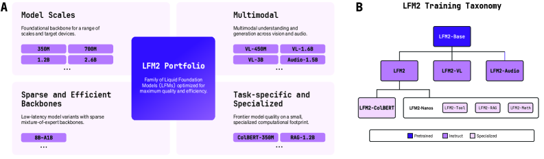
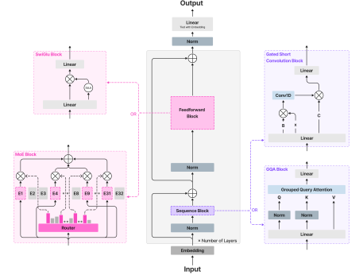
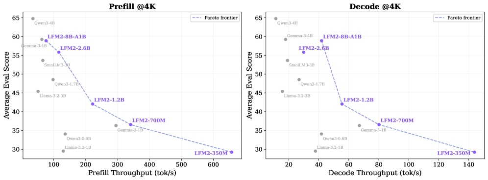
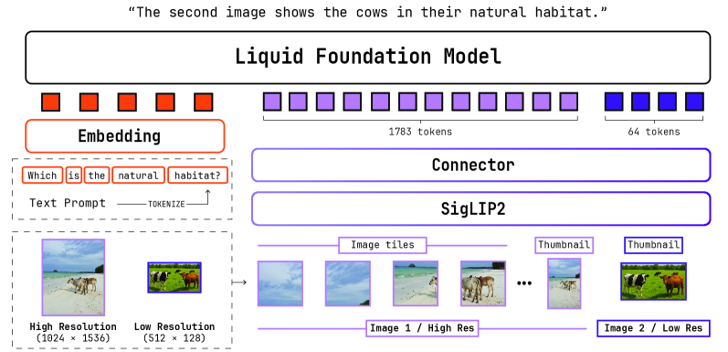
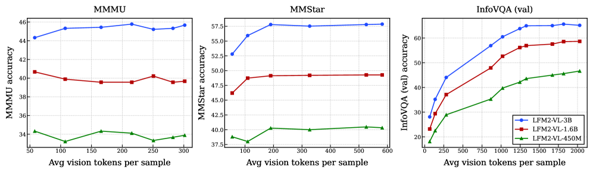
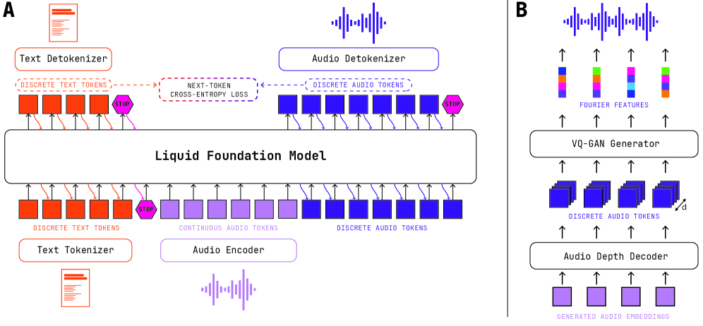

# LFM2 Technical Report

## 📋 메타 정보

| 항목 | 내용 |
|---|---|
| **제목** | LFM2 Technical Report |
| **저자** | Alexander Amini, Ramin Hasani, Maxime Labonne, Mathias Lechner, Rom N. Parnichkun, Jimmy T.H. Smith, Daniela Rus 외 33인 (알파벳순 공동 기여) |
| **소속** | **Liquid AI** (MIT CSAIL 스핀오프) |
| **공개일** | 2025-11-28 |
| **분야** | edge-first(엣지 우선) 소형 foundation model(파운데이션 모델) 패밀리 — 텍스트 + vision-language(시각-언어) + audio(음성) + retrieval(검색) |
| **arXiv** | [abs](https://arxiv.org/abs/2511.23404) · [html](https://arxiv.org/html/2511.23404v1) · [pdf](https://arxiv.org/pdf/2511.23404) |
| **공개 범위** | 모든 모델 **open weights**(공개 가중치) @ HuggingFace.co/LiquidAI + ExecuTorch / llama.cpp / vLLM 배포 패키지 |
| **선행 논문** | **STAR** (Thomas et al., 2024) — 같은 팀의 이전 NAS 논문. **이 리포트가 명시적으로 부정함** |
| **핵심 baseline** | Qwen3, Llama 3.2, Gemma 3, SmolLM3, Granite 4.0 (텍스트) / SmolVLM2, InternVL3.5, Qwen2.5-VL, Qwen3-VL (VL) |
| **⚠️ 이름 주의** | "Liquid"라는 이름과 달리 **LTC(Liquid Time-Constant) 네트워크가 아니다.** 실제로는 gated short convolution + GQA 하이브리드 (§Q1) |

---

## 📖 주요 용어 사전 (Glossary)

*본문에 들어가기 전에 용어부터 정리하는 이유: 이 리포트는 "구조 + 학습 + 배포"를 한꺼번에 다루는 릴리스 리포트라, 세 분야의 용어가 섞여 나온다. 여기서 한 번에 풀어두면 뒤가 쉬워진다.*

### 아키텍처 (Architecture)

- **edge-first(엣지 우선) 설계**: 데이터센터 GPU가 아니라 **스마트폰·노트북 CPU에서 돌아가는 것**을 1순위 목표로 삼는 설계 철학. 이 리포트 전체를 관통하는 축.
- **gated short convolution block(게이트 달린 짧은 컨볼루션 블록)**: LFM2의 주력 연산자. 입력에 따라 값이 달라지는 곱셈 게이트(input-dependent multiplicative gating)를 **커널 크기 3짜리 depthwise 1D convolution(채널별 1차원 컨볼루션)** 앞뒤에 하나씩 두른 블록. 게이트가 두 개라 double-gated(이중 게이트). 자세히는 §3.1.
- **depthwise convolution(채널별 컨볼루션)**: 채널을 섞지 않고 각 채널을 따로따로 컨볼루션하는 방식. 일반 컨볼루션보다 계산·파라미터가 훨씬 적다.
- **GQA (Grouped-Query Attention, 그룹 질의 어텐션)**: query(질의) 헤드는 여러 개 두되 key/value(키·값)는 몇 개 그룹이 나눠 쓰는 어텐션. KV cache(키-값 캐시)가 줄어 메모리 대역폭을 아낀다. LFM2에서는 **소수의 층에만** 들어간다.
- **KV cache(키-값 캐시)**: autoregressive(자기회귀) 생성 시 이미 계산한 key·value 텐서를 저장해 두는 메모리. 문맥이 길어질수록 폭증해 엣지 배포의 진짜 병목이 된다. **컨볼루션 층에는 이게 없다** — LFM2 속도 이득의 근원.
- **minimal hybrid(최소 하이브리드)**: 이 리포트의 결론을 요약하는 말. "SSM도 linear attention도 빼고, 짧은 컨볼루션 다수 + 소수의 softmax attention이면 충분하다".
- **SSM (State Space Model, 상태공간 모델)**: Mamba·S4·S5 계열. 고정 크기 상태를 순차적으로 갱신해 긴 문맥을 처리하는 어텐션 대체재. **LFM2는 탐색 공간에 넣었지만 최종 선택하지 않았다.**
- **linear attention(선형 어텐션)**: softmax를 근사해 계산량을 시퀀스 길이에 선형으로 만든 어텐션 변형. 역시 탐색 공간에 있었으나 탈락.
- **MoE (Mixture-of-Experts, 전문가 혼합)**: 여러 FFN "전문가" 중 일부만 골라 쓰는 구조. 총 파라미터는 크지만 토큰당 실제 계산량(active parameters, 활성 파라미터)은 작다. LFM2-8B-A1B가 유일한 MoE (8.3B 총 / 1.5B 활성).
- **SwiGLU**: 요즘 Transformer의 표준 feed-forward(전방향) 블록. 게이트가 달린 활성화 함수를 쓴다.
- **RMSNorm / pre-norm / QK-Norm / RoPE**: 각각 정규화 방식, 정규화를 블록 입력 쪽에 두는 배치, query·key에 추가로 거는 정규화, 회전 위치 임베딩. 전부 요즘 표준 부품.

### 학습 (Training)

- **knowledge distillation(지식 증류, KD)**: 크고 좋은 teacher model(교사 모델)의 출력 분포를 작은 student model(학생 모델)이 흉내 내게 하는 학습법. LFM2의 교사는 **LFM1-7B**.
- **DTK (Decoupled Top-K Distillation, 분리형 상위-K 증류)**: 이 논문의 증류 기법. 교사 로짓을 **상위 32개만** 저장하되, KL divergence(쿨백-라이블러 발산)를 두 조각으로 분해해 temperature(온도)를 한쪽에만 적용. 자세히는 §4.2.
- **support mismatch(지지집합 불일치)**: 확률분포를 상위 K개로 잘라낸 뒤 온도 스케일링을 적용하면, 잘린 꼬리 부분을 어떻게 취급할지가 정의되지 않아 손실이 불안정해지는 현상. DTK가 푸는 문제.
- **mid-training(중간 학습)**: 사전학습(pre-training)과 후처리(post-training) 사이에 끼워 넣는 단계. LFM2는 여기서 문맥 길이를 4K → 32K로 늘리고 고품질 데이터 1T 토큰을 태운다.
- **FIM (Fill-In-the-Middle, 가운데 채우기)**: 코드 데이터 학습 목표 중 하나. 앞뒤를 주고 가운데를 채우게 하는 방식 (코드 자동완성에 유리).
- **SFT (Supervised Fine-Tuning, 지도 미세조정)**: 질문-답변 쌍으로 대화 능력과 chat template(대화 형식)을 가르치는 단계.
- **curriculum learning(커리큘럼 학습)**: 쉬운 예제부터 어려운 예제 순으로 학습시키는 방법. LFM2는 **12개 모델 앙상블**로 난이도를 측정한다 (§4.3).
- **preference alignment(선호 정렬)**: "좋은 답 vs 나쁜 답" 쌍으로 모델을 사람 취향에 맞추는 단계. DPO 계열.
- **DPO / APO-zero / SimPO**: 보상 모델 없이 선호 쌍으로 바로 정렬하는 direct alignment(직접 정렬) 목적함수들. LFM2는 이들을 하나의 일반식으로 묶어 쓴다 (§4.4).
- **CLAIR (Contrastive Learning from AI Revisions, AI 수정본 대조 학습)**: "나쁜 답을 AI가 살짝 고쳐 좋은 답을 만드는" 방식으로 선호 쌍을 만드는 기법. 두 답의 차이가 정확히 "개선점"만 남아 학습 신호가 깨끗하다.
- **model merging(모델 병합)**: 여러 미세조정 체크포인트의 가중치를 산술적으로 합치는 후처리. Model Soup / Task Arithmetic / TIES / DARE / DELLA 등.

### 멀티모달 (Multimodal)

- **VLM (Vision-Language Model, 시각-언어 모델)**: 이미지 + 텍스트를 받아 텍스트를 출력하는 모델. LFM2-VL.
- **SigLIP2 / NaFlex**: 구글의 이미지 인코더. NaFlex 변종은 **가변 해상도·원본 종횡비**를 그대로 받는다 (정사각형으로 억지로 늘리지 않음).
- **connector(커넥터)**: 이미지 인코더의 출력을 언어 모델이 알아듣는 벡터 공간으로 옮기는 다리 역할 모듈. LFM2-VL은 PixelUnshuffle + MLP.
- **PixelUnshuffle(픽셀 언셔플)**: 공간 차원(가로·세로)의 정보를 채널 차원으로 접어 넣어 **토큰 수를 줄이는** 연산. LFM2-VL은 4배 압축.
- **dynamic tiling(동적 타일링)**: 고해상도 이미지를 512×512 타일 여러 장으로 쪼개 넣는 방식. 타일 2~10장 + 선택적 썸네일.
- **data annealing(데이터 어닐링)**: 학습 초반 데이터 비율을 시간에 따라 서서히 바꾸는 스케줄. LFM2-VL은 텍스트 100%에서 시작해 30%까지 떨어뜨린다.
- **RVQ (Residual Vector Quantization, 잔차 벡터 양자화)**: 음성 파형을 여러 겹(codebook, 코드북)의 이산 토큰으로 바꾸는 압축 기법. LFM2-Audio는 Mimi의 8-코드북 RVQ를 쓴다.
- **detokenizer(디토크나이저)**: 이산 오디오 코드를 다시 실제 파형으로 되돌리는 모듈. LFM2-Audio는 Vocos 구조의 35M짜리 자체 모델을 학습.
- **late interaction(늦은 상호작용) / ColBERT**: 질의와 문서를 각각 **토큰 단위 벡터들**로 인코딩해 두고, 검색 시점에 "질의 토큰마다 가장 잘 맞는 문서 토큰"을 찾아 점수를 매기는 방식 (MaxSim 연산자). bi-encoder(양방향 인코더)의 속도와 cross-encoder(교차 인코더)의 정밀도 사이 절충.

### 평가·측정 (Evaluation)

- **prefill throughput(프리필 처리량)**: 입력 프롬프트를 한 번에 읽어 들이는 속도 (tokens/s). 긴 문서를 넣는 RAG·요약 작업의 체감 속도.
- **decode throughput(디코드 처리량)**: 답변 토큰을 하나씩 뱉는 속도 (tokens/s). 대화의 체감 속도.
- **TTFT (Time To First Token, 첫 토큰까지 걸리는 시간)**: 사용자가 "반응이 왔다"고 느끼기까지의 지연.
- **RSS (Resident Set Size, 상주 메모리 크기)**: 프로세스가 실제로 점유한 물리 메모리. 폰에서 앱이 죽느냐 마느냐를 가르는 지표.
- **Q4_0 / 8da4w**: 각각 llama.cpp와 ExecuTorch의 4비트 quantization(양자화) 포맷.
- **IFEval / IFBench / Multi-IF**: 지시를 얼마나 정확히 따르는지 재는 벤치마크들 (단일턴 / 어려운 버전 / 멀티턴).
- **MMLU-Pro**: MMLU의 어려운 버전. 선택지가 10개이고 추론 단계가 길다. **소형 모델의 실력 차가 가장 잘 드러나는 지표.**
- **MGSM / MMMLU**: GSM8K·MMLU를 여러 언어로 번역한 다국어 버전.
- **NDCG@10**: 검색 결과 상위 10개의 순위 품질 지표. 1에 가까울수록 좋다.
- **WER (Word Error Rate, 단어 오류율)**: 음성 인식 정확도. **낮을수록** 좋다.
- **VoiceBench**: 음성으로 질문을 받아 답하는 능력을 9개 과제로 재는 벤치마크.

---

## 🎯 논문 요약 (TL;DR)

**한 줄**: **"실제 폰과 노트북에서 직접 재보면서 구조를 찾았더니, SSM도 linear attention도 필요 없고 '커널 3짜리 게이트 컨볼루션 다수 + 소수의 GQA'면 충분하더라"** — 350M~8.3B 엣지 모델 패밀리와 VL/음성/검색 확장을 묶은 릴리스 리포트.

**핵심 문제**: 소형 모델 논문은 보통 perplexity(당혹도)나 KV cache 크기 같은 **대리 지표(proxy)**로 효율을 재는데, 이 값들이 좋다고 실제 폰에서 빠르지 않다. 새 연산자(Mamba 같은 SSM)는 CPU·NPU에 최적화된 커널이 없어 이론상 이득이 실측에서 증발하기 때문이다.

**해결책**: 후보 구조를 **실제 배포 런타임 그대로(llama.cpp, ExecuTorch) 실제 기기(Galaxy S24 Ultra, AMD Ryzen HX 370)에 올려 측정**하는 hardware-in-the-loop search(하드웨어 인 더 루프 탐색)를 돌린다. 품질 / 지연 / 최대 메모리 3축 Pareto frontier(파레토 경계)로 후보를 거른다.

**결과**: 탐색이 반복적으로 고른 답이 **minimal hybrid** — 대부분 층은 gated short convolution, 소수만 GQA. SSM·linear attention·추가 컨볼루션을 더 얹어봤자 "품질은 안 오르고 기기 지표는 나빠진다".

**검증**: Galaxy S25에서 LFM2-350M이 prefill 1,067 tok/s (Granite-4.0-350M의 2.0배, 4K 프롬프트에선 3.1배). 품질은 LFM2-1.2B가 IFEval 74.89로 30% 더 큰 Qwen3-1.7B(73.98)를 넘고, LFM2-2.6B가 IFEval 79.56 / GSM8K 82.41.

**⚠️ 다만**: ① **통제된 ablation(제거 실험) 표가 하나도 없다** — 커널 3, 어텐션 6개, DTK의 이득이 각각 얼마인지 숫자로 제시되지 않는다. ② **어려운 추론 벤치는 크게 밀린다** (MMLU-Pro에서 1.2B가 19.71, Qwen3-1.7B는 43.04). ③ 속도 이득의 상당 부분은 "컨볼루션이 Mamba보다 낫다"가 아니라 "하이브리드가 순수 어텐션보다 낫다"에서 온다 (§Q3). 논문이라기보다 **잘 쓴 릴리스 리포트**에 가깝다.


*Fig. 1: LFM2 포트폴리오. (A) 규모·모달리티·엣지 능력별 모델 패밀리. (B) 공동 설계 아키텍처 → 사전학습 베이스 → 멀티모달 → 특화 다운스트림으로 이어지는 분류 체계.*

---

## 🏆 핵심 기여 (Contributions)

1. **Hardware-in-the-loop 아키텍처 탐색** — 대리 지표를 버리고 실제 기기·실제 런타임에서 품질/지연/메모리 3축 파레토를 잡는다. 자기들 이전 논문 STAR를 **명시적으로 부정**하며 "탐색 공간이나 탐색 휴리스틱의 세부보다 이게 훨씬 중요하다"고 못 박는다.
2. **Minimal hybrid 백본** — 동일 효율 예산 아래서 SSM·linear attention을 추가해도 품질이 안 오른다는 실증. CPU 배포에서 최대 **2배** 빠른 prefill/decode.
3. **DTK (분리형 상위-K 증류)** — 교사 로짓 상위 32개만 저장하면서 support mismatch 없이 temperature 증류의 이득을 유지.
4. **엣지 워크플로용 3단계 후처리** — SFT (12모델 앙상블 난이도 커리큘럼) → 길이 정규화 직접 정렬 (CLAIR) → 파라미터 공간 병합.
5. **멀티모달·검색 확장 3종** — LFM2-VL (SigLIP2 + 동적 타일링), LFM2-Audio (연속 입력 / 이산 출력 분리), LFM2-ColBERT-350M (다국어 late interaction 검색).

---

## 🧱 1. 모델 라인업

*먼저 전체 지형부터 봐야 뒤의 구조·학습 설명이 어느 모델 얘기인지 헷갈리지 않는다.*

| 모델 | 형태 | 파라미터 (총/활성) | 층 수 | 문맥 | 위치 |
|---|---|---|---|---|---|
| **LFM2-350M** | Dense | 350M | 16 | 32K | 초경량 (웨어러블·임베디드) |
| **LFM2-700M** | Dense | 700M | 16 | 32K | 경량 |
| **LFM2-1.2B** | Dense | 1.2B | 16 | 32K | **주력 폰 모델** |
| **LFM2-2.6B** | Dense | 2.6B | 30 | 32K | 고성능 폰·노트북 |
| **LFM2-8B-A1B** | **MoE** | 8.3B / **1.5B** | 24 | 32K | 메모리 여유 있는 노트북 |
| LFM2-VL-450M / 1.6B / 3B | VLM | 0.45B / 1.6B / 3B | — | 32K | 이미지 이해 |
| LFM2-Audio-1.5B | 음성 | 1.5B | — | — | 실시간 음성 대화 |
| LFM2-ColBERT-350M | 검색 | 353M | 17 | 32K (문서는 512로 제한) | 다국어 검색 |

---

## 🔬 2. Hardware-in-the-Loop 아키텍처 탐색

*이 절을 먼저 두는 이유: LFM2의 구조는 "설계했다"기보다 "탐색해서 나왔다". 어떻게 탐색했는지를 알아야 왜 그런 이상한(=단순한) 구조가 나왔는지 납득이 된다.*

### 2.1 자기 부정 — STAR가 틀렸다

Liquid AI의 이전 논문 **STAR**는 evolutionary search(진화 탐색)로 구조를 찾되, 두 개의 대리 지표를 썼다:
- 품질 대리 지표 = **perplexity(당혹도)**
- 효율 대리 지표 = **cache size(캐시 크기)**

이번 리포트의 판정:

> "실제로는 이 프록시들이 downstream task score(다운스트림 과제 점수)나 device-level latency/memory(기기 수준 지연·메모리)로 신뢰성 있게 전이되지 않는다."

그리고 결론:

> "우리는 **탐색 공간이나 탐색 휴리스틱의 세부사항보다 이것(목적함수를 실측으로 바꾼 것)이 훨씬 큰 영향을 준다**는 걸 발견했다."

이게 이 리포트에서 가장 재사용 가치 높은 교훈이다. **"무엇을 탐색했는가"보다 "무엇을 목적함수로 삼았는가"가 결과를 지배한다.**

### 2.2 3축 Pareto 최적화

| 축 | 구체적 측정 |
|---|---|
| **Quality (품질)** | 자체 **50개 이상**의 평가 모음 — 지식 회상, multi-hop reasoning(다단계 추론), 지시 따르기, 다국어 견고성, tool use(도구 사용), 수학, 롱컨텍스트 |
| **Latency (지연)** | TTFT, p50/p95 decode 지연 (ms/token), batch=1 기준 prefill 처리량 |
| **Peak memory (최대 메모리)** | prefill·decode 중 최대 RSS, 문맥 4K와 32K에서 각각 |

기기 예산을 어기는 후보는 **버린다**. 남은 후보를 파레토 경계의 hypervolume improvement(초부피 개선)로 순위 매긴다.

**측정 환경** (탐색 시점):
- CPU 경로: ExecuTorch(8da4w) + llama.cpp(Q4_0) on **Galaxy S24 Ultra (Snapdragon 8 Gen 3)** 와 **AMD Ryzen HX 370**
- 가속기 경로: vLLM (sanity check용, 주 타깃 아님)

> ⚠️ 탐색은 S24 Ultra에서, **최종 성능 보고는 S25 (Snapdragon 8 Elite)에서** 했다. 리포트도 이를 명시한다. 즉 발표된 속도표는 탐색이 최적화한 바로 그 기기가 아니다.

### 2.3 탐색 공간에 무엇이 있었나 (그리고 무엇이 탈락했나)

*여기가 이 리포트에서 가장 흥미로운 부분이다 — Liquid AI가 자기 간판 기술을 후보에 넣고 떨어뜨렸다.*

| 분류 | 후보 |
|---|---|
| **지역 문맥 / 준2차 블록** | gated short convolution(커널 크기 가변), sliding-window attention, linear attention 변종들, **S4, Liquid-S4, S5, RTF, Mamba, Mamba2**, **CfC (Liquid Time-Constant 계열)**, 내부 변종들 |
| **전역 문맥 블록** | GQA (그룹 수·헤드 차원 가변) + QK-Norm |
| **위치별 블록** | SwiGLU FFN (확장 비율 탐색) |
| **배치(layout)** | 지역/전역/위치별 블록의 인터리빙 패턴, 총 블록 수, 가중치 공유·캐시 재사용 옵션 |
| **MoE 옵션** | 층별 sparse FFN, 폭과 전문가 세분도 |

탐색 공간은 "짧은 컨볼루션 서브모듈만 남긴 변종"과 "전체 하이브리드 연산자를 유지한 변종"을 **둘 다** 포함했다. 리포트의 표현대로 이건 **"기기 환경에서의 하이브리드 ablation"** 역할을 한다.

**결과 (Outcomes)**:
> 모든 크기 목표에서 탐색은 반복적으로 minimal hybrid를 선택했다. 동일한 기기 성능 예산 아래에서 linear-attention, state-space, 추가 컨볼루션 연산자를 얹는 것은 **평가 모음의 종합 품질을 개선하지 않았고, 기기 지표는 대체로 나빠졌다.**

> 💡 **함의**: 최근 하이브리드 SSM/linear-attention 블록에 돌려진 이득의 **대부분은 그 안에 들어 있는 "짧은 컨볼루션 서브모듈"과 소수의 전역 어텐션 층으로 이미 확보된다.** Mamba의 selective scan(선택적 스캔) 같은 복잡한 부분은 온디바이스 환경에서 값을 못 한다는 주장.

> ⚠️ **하지만 이걸 뒷받침하는 수치 표가 없다.** "개선하지 않았다"는 서술만 있고, 어떤 후보가 몇 점이었는지는 공개되지 않는다. 탐색 비용(후보 개수, GPU-시간)도 비공개라 **재현이 불가능하다.**

---

## ⚙️ 3. 아키텍처

*구조를 알아야 왜 CPU에서 빠른지, 왜 어려운 추론에서 약한지가 동시에 설명된다.*


*Fig. 2: LFM2 아키텍처. dense와 MoE 변종을 모두 지원한다. MoE 전문가 역시 SwiGLU 블록이다.*

### 3.1 Gated Short Convolution 블록 — 핵심 연산자

*왜 이 블록인가: KV cache가 없어 문맥이 길어져도 메모리가 안 늘고, llama.cpp에 이미 있는 연산만 써서 배포 마찰이 0에 가깝기 때문.*

입력 hidden sequence(은닉 시퀀스) `h ∈ R^(L×d)` 에 대해 (배치 차원 생략):

```
(B, C, h̃) = Linear(h)          # d → 3d 로 늘린 뒤 세 덩어리로 분할, 각각 R^(L×d)
y = B ⊙ h̃                      # 첫 번째 게이트 (원소별 곱)
z = Conv_k(y)                   # 커널 크기 k=3 인 depthwise 1D convolution
o = Linear_out(C ⊙ z)           # 두 번째 게이트 후 출력 투영 (d → d)
```

한 줄 풀이: **입력을 3배 폭으로 늘려 세 갈래로 나눈 뒤, 하나(h̃)를 다른 하나(B)로 한 번 걸러서 아주 짧은 컨볼루션에 통과시키고, 나머지 하나(C)로 한 번 더 걸러서 내보낸다.** 게이트가 컨볼루션 앞뒤로 하나씩 있어 "double-gated".

**핵심은 커널 크기가 3이라는 점.** 한 토큰이 직전 2개 토큰만 본다. 대신:

| 성질 | 결과 |
|---|---|
| KV cache가 **없다** | 문맥 길이가 늘어도 메모리·대역폭이 안 늘어남 → 4K 프롬프트에서 격차가 벌어지는 이유 |
| 유지할 상태가 토큰 2개분 | 최대 RSS가 평평 |
| CPU 캐시 친화적 | 리포트 표현: "excellent cache behavior on CPUs" |
| 긴 문맥 정보는? | **소수의 GQA 층이 전담** |

리포트는 이 연산자가 H3·Hyena·Mamba 등 최신 효율 블록 **안에 들어 있는 단거리 성분과 거의 같다**고 명시한다. 즉 새 부품이 아니라, **기존 하이브리드에서 비싼 부분(장거리 SSM/linear attention)을 떼어내고 싼 부분만 남긴 것**이다.

### 3.2 모델 하이퍼파라미터 (Table 1)

| | 350M | 700M | 1.2B | 2.6B | 8B-A1B |
|---|---|---|---|---|---|
| **파라미터 (총/활성)** | 350M / — | 700M / — | 1.2B / — | 2.6B / — | **8.3B / 1.5B** |
| **층 수** | 16 | 16 | 16 | 30 | 24 |
| **d_model** | 1024 | 1536 | 2048 | 2048 | 2048 |
| **FF dim** | 4608 | 6912 | 8192 | 10752 | 7168 |
| **헤드/KV그룹/헤드크기** | 16/8/64 | 24/8/64 | 32/8/64 | 32/8/64 | 32/8/64 |
| **어텐션 블록 수** | **6** | **6** | **6** | **8** | **6** |
| **conv 커널 k** | 3 | 3 | 3 | 3 | 3 |
| **전문가 수 E / Top-k / FF_MoE** | — | — | — | — | **32 / 4 / 1792** |

공통: 문맥 **32,768** 토큰, SwiGLU MLP, pre-norm RMSNorm, RoPE + QK-Norm, byte-level BPE **65,536** vocab (영·일·아랍·한국어·스페인·프랑스·독일어 인코딩 효율 최적화 + JSON/코드 포함).

> 📌 **짚을 점 — 생각보다 어텐션이 많다.** 16층 중 6층 = **37.5%**, 2.6B는 30층 중 8층 = 27%. Granite-4.0-H 같은 Mamba 하이브리드의 1:9(=10%) 수준에 비하면 어텐션이 훨씬 많이 남아 있다. **"급진적 구조 논문"이 아니라 "어텐션 3분의 2를 컨볼루션으로 갈아끼운 보수적 트랜스포머"**로 읽는 게 정확하다.

### 3.3 MoE 변종 — LFM2-8B-A1B

*왜 MoE인가: 엣지에서 체감 지연을 지배하는 건 가중치 저장량이 아니라 **토큰당 계산량**이기 때문. 무게는 무거워도 매 토큰 계산은 가볍게 만들자는 발상.*

- 하이브리드 백본은 그대로 두고 **dense MLP만 sparse MoE MLP로 교체**
- **첫 2개 층은 dense로 유지** (안정성 목적)
- 층당 **32개 전문가**(SwiGLU MLP), 토큰당 **Top-4** 선택
- **normalized sigmoid router(정규화 시그모이드 라우터) + adaptive routing bias(적응적 라우팅 편향)** 로 load balancing(부하 분산) → DeepSeek-V3의 aux-loss-free(보조손실 없는) 부하 분산 계열
- 목표: **3~4B급 품질을 1.5B급 decode 비용으로**

> 📌 **MoE는 이 리포트의 주제가 아니다.** 핵심 주장은 하이브리드 백본이고, MoE는 그 위에 얹은 **직교하는 별개의 축**이다. "왜 엣지에서 MoE를 쓰나", "속도가 목적인가", 그리고 메모리·prefill로 치른 대가는 **§Q6**에서 자세히 다룬다.

---

## 🧪 4. 학습 파이프라인

*모델 크기가 작을수록 "무슨 데이터를 어떤 순서로 얼마나 태웠나"가 구조보다 성능을 더 좌우한다. 그래서 이 절이 분량상 가장 크다.*

### 4.1 사전학습 데이터와 단계

**데이터 혼합**

| | Dense (350M~2.6B) | MoE (8B-A1B) |
|---|---|---|
| 영어 | 75% | 60% |
| 다국어 | 20% | 25% |
| 코드 | 5% | **15%** |

다국어 우선순위: 일본어, 아랍어, **한국어**, 스페인어, 프랑스어, 독일어 (+ 중국어·이탈리아어·포르투갈어 기본 지원). 코드 데이터의 **50%는 FIM(가운데 채우기) 목적함수** 사용.

**2단계 스케줄**

| 단계 | Dense | MoE | 문맥 길이 | 비고 |
|---|---|---|---|---|
| **1단계 사전학습** | **10T 토큰** | **12T 토큰** | 4,096 | 표준 next-token prediction + DTK 증류 |
| **2단계 mid-training** | **+1T 토큰** | **+1T 토큰** | **32,768** | 고품질 + 자연산 롱컨텍스트 데이터, **가속된 LR 감쇠** |

> 📌 350M 모델에 11T 토큰은 Chinchilla 최적(약 7B 토큰)의 **1,500배**다. 요즘 소형 모델의 over-training(과잉 학습) 표준을 따른 것이지만, 그만큼 **"구조 덕분"과 "토큰 덕분"을 분리할 수 없게** 만든다.

### 4.2 DTK — 분리형 상위-K 지식 증류

*왜 필요한가: 교사(LFM1-7B)의 전체 어휘 로짓을 토큰마다 저장하면 저장 공간과 대역폭이 터진다. 상위 32개만 저장하고 싶은데, 잘라낸 분포에 그냥 온도를 씌우면 손실이 불안정해진다.*

**기호 정리**
- `A` = 전체 어휘, `T(x_c)` = 문맥 `x_c` 에서 교사의 상위-K(=32) 토큰 집합
- `P_T(T | x_c)` = 교사가 상위-K 집합 전체에 준 확률 질량의 합 (학생도 마찬가지로 `P_S`)
- `P_T(x | T, x_c)` = "상위-K 안이라고 치고" 그 안에서의 조건부 확률 (질량으로 나눠 정규화)
- 온도 τ 적용: `p^(τ)(x) = p(x)^(1/τ) / Σ_y p(y)^(1/τ)`, `D_KL^(τ)(p‖q) = τ² · D_KL(p^(τ) ‖ q^(τ))`

**목적함수 (토큰당)**

```
L_DTK(x_c) =  D_KL( Bern(P_T(T|x_c)) ‖ Bern(P_S(T|x_c)) )                    ← L_B (온도 없음)
            + P_T(T|x_c) · D_KL^(τ)( P_T(·|T,x_c) ‖ P_S(·|T,x_c) )           ← L_T (온도 적용)
```

한 줄 풀이:
1. **L_B (베르누이 항)** — "다음 토큰이 교사의 상위-32 안에 들어갈 확률" **그 하나만** 놓고 교사와 학생을 맞춘다. 동전 던지기(Bernoulli) 두 개의 KL. **온도를 걸지 않는다.**
2. **L_T (조건부 항)** — "상위-32 안이라고 가정하면, 그 안에서 어느 토큰이 얼마나 유력한가"의 상대 분포를 맞춘다. **여기에만 온도를 건다.** 앞에서 구한 질량 `P_T(T|x_c)` 로 가중.

**왜 이렇게 쪼개나**: 잘린 분포 전체에 온도를 걸면 잘린 꼬리를 어떻게 취급할지가 정의되지 않아 support mismatch가 생긴다. **멤버십(안에 드느냐)과 그 안의 순위 경쟁을 분리**하면, 온도는 "순위 경쟁"에만 걸리므로 이 문제가 사라진다.

- τ=1이면 `L_DTK`는 full forward KL의 **lower bound(하한)** — 로짓이 없는 교사 꼬리를 생략했기 때문.
- 최종 손실은 `L_DTK` + 하드 라벨에 대한 next-token cross-entropy 로 균형.

> ⚠️ **novelty(신규성) 주의**: 리포트가 스스로 밝힌다 — 동시기 연구 **SLS (Sparse Logit Sampling, Anshumann et al. 2025)** 의 "ghost token" 기법과 **τ=1에서 정확히 같다.** LFM2의 고유 기여는 "이 분해를 명시화한 것"과 **"온도를 조건부 항 안쪽에만 넣은 것"** 뿐이다. 그리고 **DTK 유무 ablation이 없어** 실제 이득 크기는 알 수 없다.

### 4.3 후처리 1단계 — SFT

*왜 이 단계: base model(기반 모델)에 chat template(대화 형식)을 가르쳐 대화형 어시스턴트로 만들고, RAG·function calling(함수 호출) 같은 실사용 능력을 심기 위해.*

전체 흐름 (Fig. 3): `Base Model → ① SFT → ② Alignment(정렬) → ③ Merging(병합) → Final Model`. 2단계에는 on-policy 표본과 off-policy + CLAIR 데이터가 함께 들어간다.

**데이터 규모**: dense는 **5.39M 샘플 / 67개 소스**, MoE는 **9.24M 샘플 / 79개 소스**.

| 카테고리 | Dense (%) | MoE 8B-A1B (%) |
|---|---|---|
| 수학 추론 | 7.4 | **26.2** |
| 범용 (general-purpose) | **26.6** | 16.3 |
| 지시 따르기 | 17.1 | 11.3 |
| 코드 | — | 10.2 |
| RAG | 13.2 | 8.3 |
| 실사용 대화 | 10.1 | 10.0 |
| 도구 사용 (tool use) | 10.1 | 7.3 |
| off-policy 선호 | 8.2 | 5.3 |
| 롱컨텍스트 | 6.7 | 3.2 |
| 기타 | 0.6 | 1.9 |

> 📌 **MoE의 수학 26.2%를 꼭 기억해 두자.** §6에서 8B-A1B가 MATH 벤치마크에서 크게 뛰는데, 그게 MoE 구조 덕인지 이 데이터 편중 덕인지 리포트는 분리하지 않는다.
>
> 그리고 **비율만 보면 오해한다** — MoE의 SFT 총량은 5.39M → **9.24M(1.71배)** 으로 늘었으므로, 비중이 줄어든 항목도 절대 개수로는 대부분 늘었다. **비율 vs 개수의 전체 분해는 §Q7.**

**다국어 처리 방식이 특이하다**: 다국어를 별도 카테고리로 두지 않고 **모든 과제 카테고리에 골고루 섞는다.** 전체의 80%가 영어, 나머지 20%를 아랍어·중국어·프랑스어·독일어·일본어·**한국어**·스페인어 7개에 균등 분배. 덕분에 "수학 추론"이나 "도구 사용" 같은 특화 능력이 **처음부터 다국어로** 형성된다.

**데이터 품질 파이프라인** (순서대로):
1. **사람이 직접 검수** — 각 후보 데이터셋의 표본을 사람이 보고 통과 여부 결정 (이걸 통과해야 자동 단계 진입)
2. 판정 LLM 앙상블로 사실성·관련성·유용성 점수화
3. 형식 오류 제거 → 거절(refusal) 패턴 제거
4. 규칙 기반 문체 필터 (상투어·클리셰 제거)
5. 정확 중복 제거 → **CMinHash LSH**로 근사 중복 제거 → **의미 기반 중복 제거** (문장 임베딩, 높은 유사도 임계값) — 리포트가 **"가장 영향이 컸다"**고 밝힌 단계
6. 평가 벤치마크와의 정확 n-gram 매칭 + 의역 탐지로 **decontamination(오염 제거)**

**커리큘럼 학습** — 이 리포트에서 가장 재사용 가치 높은 레시피 중 하나:

**12개 모델 앙상블**(350M~235B)에 각 문제를 풀려 보고, 맞으면 1 틀리면 0으로 기록해 경험적 성공확률 `p_i = (1/J) Σ_j r_ij` 를 계산한다. `p_i`가 높으면 쉬운 문제, 낮으면 어려운 문제. 그다음 **프롬프트 특징만 보고 `p_i`를 예측·정렬하는 모델을 따로 학습**해 전체 데이터셋에 난이도 순서를 매기고, 쉬운 것부터 학습시킨다.

> 앙상블 구성: LFM2-350M / 700M / 1.2B / 2.6B, Hunyuan-500M, Phi-4-Mini, Qwen3-4B-Instruct-2507, Qwen3-Klear-8B, ERNIE-4.5-21B-A3B, Qwen3-30B-A3B-Instruct-2507, Qwen3-30B-A3B-Coder-Instruct, Qwen3-235B-A22-Instruct-2507

**학습 프로토콜**: 3 epoch, 문맥 **32,768**, GPU당 micro-batch 1 + gradient accumulation, cosine decay `3e-5 → 1e-7`, linear warm-up 500 step, AdamW (β₁=0.9, β₂=0.95, weight decay λ=0.1), gradient clipping 1.0, ε=1e-8. **임베딩에만 10% input dropout** 적용 (내부 dropout은 추론 지연을 늘리므로 회피). bf16 활성/기울기 + fp32 master weight. **ZeRO-2 + strided activation checkpointing on 8× H100-80GB.**

### 4.4 후처리 2단계 — 선호 정렬

*왜 이 단계: SFT만으로는 "형식은 맞지만 별로인 답"을 걸러내지 못한다. 좋은 답과 나쁜 답을 대조시켜 취향을 잡는다.*

**데이터 만드는 법**:
1. 약 **100만** 대화(공개 + 자체 보유)로 시작
2. SFT 체크포인트에서 대화마다 **N=5개 응답을 샘플링** (on-policy, 자기 정책 표본)
3. **LLM jury(판정 LLM 배심)** 로 모든 응답을 점수화 → 최고점 = chosen, 최저점 = rejected
4. **동점이면 on-policy 응답을 우선** 선택 (distribution shift, 분포 이동 완화)
5. 지시 따르기 데이터는 chosen을 **CLAIR**로 한 번 더 다듬음
6. 점수 기반 정량 필터 + 정성 필터 + 문맥 초과 샘플 제거
7. 최종 **약 70만** 대화

**길이 정규화 직접 정렬 목적함수** — DPO·APO-zero·SimPO를 한 식으로 묶은 일반형:

```
L(π_θ; π_ref) = −E[ ω · f( Δ(x,y_w,y_l) − m ) + λ · g( δ(x,y_w,y_l) ) ]

  r_θ(x,y) = β · log( π_θ(y|x) / π_ref(y|x) )          # implicit reward(암묵 보상)
  Δ = r_θ(x,y_w)/|y_w| − r_θ(x,y_l)/|y_l|              # 상대 항 (토큰 수로 나눠 길이 정규화)
  δ = σ( r_θ(x,y_w)/|y_w| ) − σ( r_θ(x,y_l)/|y_l| )    # 절대 항
```

- `{ω=1, f=log σ, m=0, λ=0}` → **길이 정규화 DPO**
- `{ω=0, λ=1, g(x)=x}` → **APO-zero**
- `{ω=1, f=log σ, m=0.1, λ=0.2, g(x)=x}` → 둘의 장점을 합친 결합형. 마진 `m`은 **SimPO** 계열이고, 절대 항은 생성 확률을 붙잡아 두는 regularizer(정규화 항) 역할.

**하이퍼파라미터 (Table 5)**

| 항목 | 값 |
|---|---|
| KL 계수 β | **5.0** |
| LR 스케줄 | cosine, `8e-7 → 8e-8`, warm-up 0.01 |
| Global batch size | 2048 |
| **문맥 길이** | **1024** |
| Epoch | 2 |

> ⚠️ **32K 문맥 모델인데 정렬은 1024 문맥에서 했다.** 즉 긴 문맥에서의 정렬 품질(길게 읽고 답할 때의 취향·안전성)은 사실상 검증되지 않은 셈이다. 롱컨텍스트 전용 평가 표도 리포트에 없다.

### 4.5 후처리 3단계 — 모델 병합

*왜 이 단계: 병합은 추가 학습이 필요 없어 계산이 거의 공짜다. 그러니 여러 기법을 동시에 돌려보고 제일 좋은 걸 고르면 된다는 실용주의.*

Model Soup / Task Arithmetic / TIES-Merging / DARE / DELLA 를 **병렬로 전부 적용**한 뒤 자체 평가 하네스로 최고 체크포인트를 선택.

> ⚠️ 솔직한 서술이지만 원리라기보다 "여러 개 돌려서 골랐다"는 엔지니어링이다. 어떤 기법이 왜 이겼는지에 대한 분석은 없다.

---

## 📊 5. 추론 성능 — 이 리포트의 본론

*벤치 점수보다 이 표들이 LFM2의 존재 이유다. 품질 1등이 아니라 "같은 품질을 훨씬 싸게"가 세일즈 포인트이기 때문.*

**측정 조건**: batch size **1** (단일 스트림, 지연 민감 사용), **llama.cpp + Q4_0**, prefill은 1K/4K 프롬프트 처리 속도, decode는 1K/4K 접두사에서 100 토큰 생성 속도.

### 5.1 Samsung Galaxy S25 (Snapdragon 8 Elite) — Table 2

단위: tokens/s

| 모델 | prefill 1K | prefill 4K | decode 1K | decode 4K |
|---|---|---|---|---|
| **LFM2-350M** | **1,067** | **657** | **194.1** | **143.8** |
| Granite-4.0-350M | 528 | 210 | 132.9 | 70.7 |
| Granite-4.0-H-350M | 784 | 594 | 150.7 | 119.3 |
| **LFM2-700M** | 522 | 341 | 104.2 | 80.2 |
| Qwen3-0.6B | 318 | 136 | 76.7 | 41.8 |
| **LFM2-1.2B** | 335 | 222 | 69.8 | 55.5 |
| Llama-3.2-1B | 229 | 130 | 54.6 | 37.8 |
| Gemma-3-1B | 377 | 295 | 67.5 | 67.1 |
| Qwen3-1.7B | 140 | 98 | 39.7 | 26.9 |
| Granite-4.0-1B | 147 | 79 | 41.3 | 25.0 |
| Granite-4.0-H-1B | 186 | 159 | 46.1 | 44.1 |
| **LFM2-2.6B** | 143 | 116 | 33.8 | 30.0 |
| **LFM2-8B-A1B** | 85 | 76 | **48.6** | **41.9** |
| Llama-3.2-3B | 79 | 51 | 24.2 | 15.8 |
| SmolLM3-3B | 98 | 66 | 26.1 | 19.2 |
| Gemma-3-4B | 72 | 63 | 18.3 | 17.9 |
| Qwen3-4B | 57 | 35 | 17.2 | 11.4 |
| Granite-4.0-Micro | 65 | 38 | 20.2 | 12.1 |
| Granite-4.0-H-Micro | 83 | 77 | 24.9 | 23.5 |
| Granite-4.0-H-Tiny | 86 | 86 | 39.2 | 37.4 |

### 5.2 AMD Ryzen AI 9 HX 370 (노트북 CPU) — Table 3

| 모델 | prefill 1K | prefill 4K | decode 1K | decode 4K |
|---|---|---|---|---|
| **LFM2-350M** | **7,534** | **5,540** | 207.7 | **170.5** |
| Granite-4.0-350M | 5,499 | 2,938 | **225.0** | 166.2 |
| Granite-4.0-H-350M | 4,568 | 4,250 | 134.7 | 123.2 |
| **LFM2-700M** | 4,214 | 3,311 | 134.6 | 118.4 |
| Qwen3-0.6B | 3,594 | 2,204 | 116.0 | 53.4 |
| **LFM2-1.2B** | 2,784 | 2,302 | 99.7 | 89.0 |
| Llama-3.2-1B | 2,912 | 1,890 | 97.3 | 73.5 |
| Gemma-3-1B | 3,972 | 3,809 | 103.6 | 99.3 |
| Qwen3-1.7B | 2,019 | 1,491 | 60.8 | 38.5 |
| **LFM2-2.6B** | 1,335 | 1,171 | 50.3 | 46.8 |
| **LFM2-8B-A1B** | 1,320 | 1,185 | **74.9** | **69.1** |
| Llama-3.2-3B | 1,179 | 916 | 38.3 | 28.2 |
| SmolLM3-3B | 1,248 | 982 | 42.4 | 33.4 |
| Gemma-3-4B | 1,119 | 1,054 | 33.0 | 31.6 |
| Qwen3-4B | 861 | 628 | 31.0 | 22.2 |
| Granite-4.0-H-Tiny | 1,050 | 1,046 | 55.0 | 52.1 |

### 5.3 읽는 법 — 네 가지 관점

**① 4K에서 격차가 벌어진다 (KV cache가 없는 효과)**

| 비교 | 1K prefill | 4K prefill | 배율 변화 |
|---|---|---|---|
| LFM2-350M vs Granite-4.0-350M | 1,067 / 528 = **2.0×** | 657 / 210 = **3.1×** | 길수록 유리 |

decode의 1K→4K 낙폭도 LFM2-350M은 −26%인데 Granite-4.0-350M은 **−47%**다. 컨볼루션 층이 문맥 길이에 무관하게 동작하기 때문.

**② 하지만 이득의 대부분은 "conv vs Mamba"가 아니라 "하이브리드 vs 순수 어텐션"이다**

| 상대 | prefill 1K 배율 |
|---|---|
| vs Granite-4.0-350M (순수 어텐션) | **2.02×** |
| vs Granite-4.0-**H**-350M (Mamba 하이브리드) | **1.36×** |

Gemma-3-1B(sliding window 5:1)는 prefill 377로 **LFM2-1.2B(335)보다 오히려 빠르다.** 즉 "짧은 컨볼루션이 SSM/슬라이딩 윈도우보다 낫다"의 마진은 초록 배너가 시사하는 것만큼 크지 않다. 자세히는 §Q3.

**③ 리포트는 자기에게 불리한 수치도 실었다**

Ryzen에서 **decode 1K는 LFM2-350M(207.7)이 Granite-4.0-350M(225.0)에 진다.** 이런 걸 그대로 실은 건 신뢰가 가는 부분이다. 종합하면 **LFM2의 이점은 decode보다 prefill 쪽에 훨씬 크게 몰려 있다** → 문서 요약·RAG처럼 **입력이 긴** 엣지 워크로드에 특히 유리.

**④ MoE의 비대칭**

LFM2-8B-A1B는 S25에서 decode 48.6으로 **LFM2-2.6B(33.8)보다 빠르다** (활성 1.5B 덕). 그런데 prefill은 85로 **더 느리다** (전체 전문가 가중치를 읽어야 하므로). 그리고 **메모리는 8.3B 전체를 올려야 한다** — Q4_0이면 대략 4.5GB+로, 폰에서는 상당히 빡센 조건이다.

> ⚠️ **RSS(최대 메모리) 표가 리포트에 없다.** 탐색 목적함수의 3축 중 하나였고 본문에서 "peak RSS가 낮다"고 주장하는데, **정작 숫자 표는 게재되지 않았다.** 배포 판단에 가장 필요한 수치가 빠진 셈이다.


*Fig. 4: 평균 평가 점수 vs prefill(좌)·decode(우) 처리량의 파레토 경계. 모든 점은 Galaxy S25 실측. 4K 프롬프트/4K 접두사 기준.*

---

## 📈 6. 텍스트 벤치마크

*왜 이 절: 속도가 빨라도 품질이 무너지면 의미가 없다. 어디서 이기고 어디서 지는지의 패턴이 이 모델의 성격을 그대로 드러낸다.*

**평가 방식 주의**: Liquid AI는 **자체 평가 하네스**를 만들어 썼다. 이유가 설득력 있다 — *"소형 모델은 답을 몰라서가 아니라 기대한 형식으로 못 내놔서 평가에 실패하는 경우가 많다."* 그래서 LFM2, Qwen3, Llama 3.2, Gemma 3, Granite 4.0 각각의 출력 습관을 반영한 강건한 파싱 로직을 넣었다고 밝힌다. 다만 이 때문에 **다른 곳에 보고된 점수와 다를 수 있다**는 것도 리포트가 명시한다.

### 6.1 소형 (Table 6)

| Benchmark | LFM2-350M | LFM2-700M | **LFM2-1.2B** | Qwen3-0.6B | Llama-3.2-1B | Gemma-3-1B | Qwen3-1.7B |
|---|---|---|---|---|---|---|---|
| *총 파라미터* | 0.35B | 0.70B | 1.2B | 0.6B | 1.2B | 1B | 1.7B |
| *학습 토큰* | 11T | 11T | 11T | **36T** | 9T | 2T | **36T** |
| MMLU | 43.43 | 49.90 | **55.23** | 44.93 | 46.60 | 40.08 | 59.11 |
| MMLU-Pro | 15.85 | 18.65 | 19.71 | 27.02 | 19.37 | 13.72 | **43.04** |
| GPQA | 27.46 | 28.48 | **31.47** | 22.14 | 28.84 | 21.07 | 27.72 |
| IFEval | 65.12 | 72.23 | **74.89** | 64.24 | 52.39 | 62.90 | 73.98 |
| IFBench | 16.41 | 20.56 | 20.70 | 19.75 | 16.86 | 17.72 | **21.27** |
| Multi-IF | 32.85 | 40.92 | 45.28 | 45.13 | 29.43 | 44.49 | **56.28** |
| GSM8K | 30.10 | 46.40 | 58.30 | 36.47 | 35.71 | **59.59** | 51.40 |
| GSMPlus | 22.16 | 29.99 | 36.09 | 9.10 | 18.57 | **40.16** | 29.62 |
| MATH 500 | 24.20 | 31.80 | 42.40 | 48.60 | 25.00 | 43.40 | **70.00** |
| MATH Lvl 5 | 5.79 | 11.27 | 18.61 | 19.43 | 14.20 | 14.64 | **36.99** |
| MMMLU | 37.99 | 43.28 | **46.73** | 30.84 | 38.15 | 34.43 | 46.51 |
| MGSM | 29.52 | 45.36 | 55.04 | 41.28 | 29.12 | 43.60 | **66.56** |

### 6.2 중형 (Table 7)

| Benchmark | **LFM2-8B-A1B** | **LFM2-2.6B** | Llama-3.2-3B | SmolLM3-3B | Gemma-3-4B | Qwen3-4B | Granite-4.0-H |
|---|---|---|---|---|---|---|---|
| *총 / 활성* | 8.3B / **1.5B** | 2.6B | 3.2B | 3.1B | 4B | 4B | 7B / **1B** |
| *학습 토큰* | 13T | 11T | 9T | 11T | 4T | **36T** | 15T |
| MMLU | 64.84 | 64.42 | 60.35 | 59.84 | 58.35 | **72.25** | 66.79 |
| MMLU-Pro | 37.42 | 25.96 | 22.25 | 23.90 | 34.76 | **52.31** | 32.03 |
| GPQA | 29.29 | 26.57 | 30.60 | 26.31 | 29.51 | **34.85** | 26.46 |
| IFEval | 77.58 | 79.56 | 71.43 | 72.44 | 76.85 | **85.62** | 81.06 |
| IFBench | 25.85 | 22.19 | 20.78 | 17.93 | 23.53 | **30.28** | 18.37 |
| Multi-IF | 58.19 | 60.26 | 50.91 | 58.86 | 66.61 | **75.54** | 52.99 |
| GSM8K | 84.38 | 82.41 | 75.21 | 81.12 | **89.92** | 68.46 | 82.64 |
| GSMPlus | 64.76 | 60.75 | 38.68 | 58.91 | **68.38** | 56.16 | 59.14 |
| MATH 500 | 74.20 | 63.60 | 41.20 | 73.60 | 73.20 | **85.60** | 58.20 |
| MATH Lvl 5 | 62.38 | 54.38 | 24.06 | 51.93 | 52.18 | **73.62** | 36.11 |
| MMMLU | 55.26 | 55.39 | 47.92 | 50.02 | 50.14 | **60.67** | 56.13 |
| MGSM | 72.40 | 74.32 | 61.68 | 68.72 | **87.28** | 81.76 | 73.68 |

### 6.3 패턴 정리

| 축 | 판정 | 근거 |
|---|---|---|
| **지시 따르기** | ✅ **최강점** | LFM2-1.2B IFEval 74.89 > **30% 큰** Qwen3-1.7B 73.98. LFM2-2.6B 79.56 > Llama-3.2-3B 71.43, SmolLM3-3B 72.44 |
| **다국어 전이** | ✅ 강점 | LFM2-1.2B가 영어 GSM8K의 **94.4%**를 MGSM에서 유지 (58.30 → 55.04), MMLU의 **84.5%**를 MMMLU에서 유지 |
| **일반 지식** | 🟡 동급 | MMLU는 크기 대비 양호하나 Qwen3에는 밀림 |
| **어려운 추론** | ❌ **명백한 약점** | MMLU-Pro에서 1.2B 19.71 vs Qwen3-1.7B **43.04** (2.2배 차이), MATH Lvl5 18.61 vs 36.99 |

> 💡 **왜 이 패턴인가**: LFM2는 **non-reasoning(비추론) 모델**이다. Qwen3는 thinking mode(사고 모드)와 대량의 추론 데이터가 들어간 모델이고, 리포트는 **Qwen3를 어떤 모드로 평가했는지 밝히지 않는다.** 게다가 Qwen3는 **36T 토큰**을 봤고 LFM2는 11T다. 비교의 공정성에 물음표가 붙는다. 다만 반대로 보면, **엣지에서 실제로 쓰는 용도(지시 따르기, RAG, 도구 호출, 다국어)에는 LFM2의 프로파일이 오히려 맞다.**

**"쉬운 벤치는 잘, 어려운 벤치는 약함"이 크기와 무관하게 일관된다.** 소형에서만 나타나는 현상이 아니다 — LFM2-2.6B도 IFEval 79.56 / GSM8K 82.41로 잘하다가, **MMLU-Pro에서는 25.96으로 Gemma-3-4B(34.76)와 Granite-4.0-H(32.03)에 모두 밀린다.** 즉 "정답이 짧고 형식이 정해진 과제"에서 강하고, "여러 단계를 거쳐야 하는 과제"에서 약하다.

**8B-A1B의 수학 도약**: dense 2.6B 대비 MMLU-Pro **25.96 → 37.42 (+11.46)**, MATH 500 **+10.6**, MATH Lvl 5 **+8.0**. 리포트도 *"추론 데이터 배분을 늘린 결과"*라고 인정한다 (§4.3의 26.2%). **구조 이득과 데이터 조준이 분리되지 않는다.** 정직하게 보면 "MoE 구조 + 수학 샘플 6.1배 + 학습 토큰 2T 추가"의 합작이다 — **자세한 분해는 §Q7.**

> 그 대가도 표에 그대로 있다. **파라미터가 3배 넘게 많은 8B-A1B가 IFEval(77.58 vs 79.56)·Multi-IF(58.19 vs 60.26)·MGSM(72.40 vs 74.32)에서 LFM2-2.6B에게 진다.** 지시 따르기 데이터 비중을 17.1% → 11.3%로 깎은 결과로 읽힌다 (§Q7 ⑤).

> ⚠️ **잊지 말 것 — Qwen3-4B는 Table 7의 거의 모든 항목에서 여전히 위다.** GSM8K(68.46)와 MGSM(81.76) 정도만 예외다. **LFM2의 셀링 포인트는 "품질 1등"이 아니라 "같은 품질을 훨씬 싸게"** 이며, 이 표는 그 프레임으로 읽어야 한다. 품질만 놓고 고를 거라면 Qwen3-4B를 쓰면 된다 — 다만 그 모델은 S25에서 prefill 57 tok/s, decode 17.2 tok/s다 (LFM2-2.6B의 각각 1/2.5, 1/2).

---

## 👁️ 7. LFM2-VL (시각-언어)

*왜 이 절: 텍스트 백본이 좋아도 이미지를 붙이면 언어 능력이 무너지는 게 소형 VLM의 고질병이다. LFM2-VL은 그 문제를 데이터 스케줄로 푼다.*


*Fig. 5: SigLIP2 인코더가 작은 입력은 원본 해상도로, 고해상도 입력은 동적 타일링으로 처리. 경량 커넥터(PixelUnshuffle + MLP)가 비전 토큰 수를 줄이고 LFM2 언어 토큰 공간으로 투영한다.*

### 7.1 구성

| 모델 | 눈 (Vision Encoder) | 입 (Language Backbone) |
|---|---|---|
| **LFM2-VL-450M** | SigLIP2 **Base-86M** (NaFlex) | LFM2-350M |
| **LFM2-VL-1.6B** | SigLIP2 **So400M** (NaFlex) | LFM2-1.2B |
| **LFM2-VL-3B** | SigLIP2 **So400M** (NaFlex) | LFM2-2.6B |

**커넥터**: **PixelUnshuffle** (이미지 토큰 **4배** 감축) → **MLP** (LFM2 hidden dim으로 투영).
- 1.6B는 인코더의 **끝에서 두 번째** hidden state를 쓰는데, **이후 ablation에서 이득이 없다고 밝혀져** 450M·3B는 마지막 hidden state를 쓴다 (리포트가 밝힌 몇 안 되는 ablation 결과).

### 7.2 이미지 전처리 — 두 가지 방식

| 방식 | 조건 | 처리 | 토큰 수 |
|---|---|---|---|
| **single-frame(단일 프레임)** | 512×512 이하 (예: 1024×256, 380×680) | 인코더 패치 격자에 맞게 리사이즈 (인코더 패치 크기 × PixelUnshuffle 배수로 나눠떨어지게) → **패딩 불필요** | **128~256** |
| **dynamic tiling(동적 타일링)** | 그 이상 | 가장 가까운 지원 종횡비로 변형 후 **512×512 타일 2~10장**으로 분할 + 선택적 썸네일 1장 | 최대 **약 2,800** |

타일 사이에는 특수 위치 토큰이 끼워지고, 전체가 image start/end 토큰으로 감싸진다. 썸네일은 **전용 특수 토큰**을 따로 가져 "전역 맥락"과 "지역 타일"을 모델이 구분할 수 있다.

### 7.3 3단계 학습 — 여기 핵심 발견이 있다

| 단계 | 학습 대상 | 규모 | 핵심 |
|---|---|---|---|
| **1. Connector 사전학습** | 커넥터만 (인코더·백본 동결) | 캡션 코퍼스 | 커넥터에 더 높은 LR, 문맥 2,048, 최대 길이로 패딩 |
| **2. 멀티모달 mid-training** | **전부** (백본:커넥터:인코더 LR 비율 **5:5:1**) | **약 50B 토큰** | weight decay를 언어 학습보다 작게(1e-6), 문맥 32,768, 타일링 **끄고** 샘플 효율 극대화, LR 스케줄 재시작 |
| **3. 멀티모달 SFT** | 전부 | **약 50B 토큰** | 타일링 **켜고** 실배포 해상도 노출, 텍스트-이미지 비율 5~30% 변주, 문맥 32,768 |

**⭐ data annealing(데이터 어닐링) 발견**: 2단계에서 **텍스트 100%로 시작해 전체 스텝의 첫 5% 동안 30%까지 선형 감소**시킨 뒤 고정. 리포트의 결론:

> "Ablation 결과 이 어닐링 스케줄이 **connector 사전학습을 불필요하게 만든다.** (성능을 해치지 않아 1단계를 남겨두긴 했다.)"

즉 "커넥터만 먼저 학습" 관행이 실은 **데이터 비율 스케줄로 대체 가능**하다는 것. 소형 VLM 만드는 사람이 바로 써먹을 수 있는 결과다.

**체크포인트 병합**: 3B는 데이터 샘플링 비율·커리큘럼·OCR 편중·SFT 혼합이 조금씩 다른 여러 후보를 학습한 뒤, 상위 체크포인트를 **weight space 선형 병합**해 최종 모델로 삼았다.

**데이터 특징**: SFT의 약 5%가 multi-image(다중 이미지), 약 70%가 multi-turn(멀티턴). 다국어는 아랍어·중국어·프랑스어·독일어·이탈리아어·일본어·**한국어**·포르투갈어·스페인어로 번역해 전 단계에 통합. **⚠️ bounding box(경계 상자)·point coordinate(점 좌표) 같은 명시적 grounding(그라운딩) 지도학습은 하지 않는다** → 정밀한 위치 지정에 약할 수밖에 없다 (리포트도 한계로 인정).

### 7.4 성능 — sub-2B (Table 8)

| Benchmark | **LFM2-VL-450M** | **LFM2-VL-1.6B** | SmolVLM2-500M | InternVL3.5-1B |
|---|---|---|---|---|
| *총 파라미터* | 0.45B | 1.6B | 0.5B | 1.1B |
| MMStar | **40.87** | 49.87 | 37.73 | **50.27** |
| MMBench (dev) | **55.76** | 69.16 | 51.29 | **70.79** |
| RealWorldQA | **52.03** | **65.75** | 51.37 | 57.12 |
| MME | 1,230 | 1,757 | 1,456 | **1,894** |
| SEEDBench | **63.62** | 72.00 | 60.34 | **72.67** |
| POPE | 83.68 | **87.17** | 85.83 | 86.30 |
| MMMU | **34.44** | 39.67 | 33.89 | **41.89** |
| MathVista | **45.30** | 51.70 | 34.50 | **53.10** |
| BLINK | **42.61** | **44.50** | 40.45 | 44.19 |
| InfoVQA (val) | **44.56** | 58.35 | 24.64 | **60.99** |
| OCRBench | **657** | 729 | 562 | **790** |
| MM-IFEval | **33.09** | **46.35** | 11.56 | 36.17 |

### 7.5 성능 — 2~4B (Table 9)

| Benchmark | **LFM2-VL-3B** | SmolVLM2-2.2B | InternVL3.5-2B | Qwen3-VL-2B | Qwen2.5-VL-3B |
|---|---|---|---|---|---|
| MMStar | **57.73** | 46.00 | 57.67 | 49.00 | 56.13 |
| MMBench (dev) | 79.81 | 69.24 | 78.18 | 77.58 | **80.41** |
| RealWorldQA | **71.37** | 57.50 | 60.78 | 65.75 | 65.23 |
| MME | 2,051 | 1,793 | 2,129 | 2,045 | **2,163** |
| SEEDBench | **76.55** | 71.30 | 75.41 | 74.08 | 73.88 |
| POPE | 89.01 | 85.10 | 87.17 | **89.05** | 86.17 |
| MMMU | 45.33 | 41.60 | **51.78** | 45.78 | 51.67 |
| MathVista | 62.20 | 51.50 | 61.60 | **63.50** | 62.50 |
| BLINK | 51.03 | 42.30 | 50.97 | **54.87** | 48.97 |
| InfoVQA (val) | 67.37 | 37.75 | 69.29 | 71.68 | **76.12** |
| OCRBench | 822 | 725 | 834 | **864** | 824 |
| MM-IFEval | **51.83** | 19.42 | 47.31 | 51.35 | 38.62 |
| MMBench 다국어 | **75.84** | 44.07 | 70.03 | 69.52 | 74.33 |
| MMMB 다국어 | **81.52** | 57.82 | 75.86 | 74.11 | 77.60 |
| **MMLU (언어)** | **62.70** | **26.89** | 60.89 | 59.87 | 64.92 |
| **MMMLU (언어)** | 53.37 | 32.16 | 49.32 | 42.20 | **54.23** |

**패턴**: 텍스트 백본의 성격이 그대로 따라온다.
- ✅ **자연 이미지 이해**(RealWorldQA 71.37, SEEDBench 76.55 — 둘 다 4B 미만 전체 1위), **지시 따르기**(MM-IFEval 51.83), **다국어**(MMBench 75.84, MMMB 81.52 — 둘 다 1위)
- ❌ **문서/OCR**(InfoVQA 67.37 vs Qwen2.5-VL-3B 76.12, OCRBench 822 vs Qwen3-VL-2B 864), **지식 추론**(MMMU 45.33 vs InternVL3.5-2B 51.78)

리포트도 *"특히 MMMU 같은 복잡한 멀티모달 추론에는 RL을 통한 추가 개선 여지가 있다"*고 인정한다.

### 7.6 정확도 vs 지연 조절


*Fig. 6: 비전 토큰 예산을 바꿔가며 측정한 정확도. 토큰 수는 온디바이스 지연의 대리 지표다.*

전처리 파이프라인을 조정해(단일 프레임 축소 또는 타일 수 제한) 이미지당 최대 비전 토큰 수를 바꿀 수 있다. 결과: **일반 비전 벤치는 공격적으로 압축해도 성능 저하가 미미**하지만, **고해상도 지각이 필요한 과제는 뚜렷하게 떨어진다.** 배포자가 "이 앱은 정확도 vs 속도 중 뭐가 중요한가"에 따라 다이얼을 돌릴 수 있다는 뜻.

---

## 🔊 8. LFM2-Audio

*왜 이 절: 실시간 음성 대화를 엣지에서 하려면 "듣기"와 "말하기"를 하나의 모델에 넣되 지연을 밀리초 단위로 관리해야 한다. LFM2-Audio는 입력과 출력의 표현 방식을 아예 분리해서 이 문제를 푼다.*


*Fig. 7: (A) LFM2 백본이 텍스트와 오디오 토큰이 섞인 단일 임베딩 시퀀스를 처리해 다음 토큰을 예측한다. (B) 오디오 생성 파이프라인 — 연속 임베딩 → 이산 코드 → Fourier 기반 GAN 생성기로 파형 복원.*

### 8.1 핵심 설계 결정 — 입력은 연속, 출력은 이산

동시기 다른 audio-language model(오디오-언어 모델)과 달리 **입력 오디오는 이산 토큰으로 바꾸지 않는다.**

| 경로 | 표현 | 이유 |
|---|---|---|
| **입력** | log-mel 특징 → 인코더 → **연속 임베딩** | 토큰화 손실 없이 풍부한 표현 유지 → 음성 인식·이해 품질 |
| **출력** | **이산 RVQ 코드** (Mimi 8-codebook) | 자기회귀 생성이 가능하고 지연이 낮음 |

### 8.2 구성 요소

| 부품 | 사양 |
|---|---|
| **백본** | **LFM2-1.2B** (decoder-only) |
| **오디오 인코더** | 16kHz 파형 → **128차원 log-mel** (0.025s 창, 0.01s 스트라이드) → strided conv로 **8배** 시간 축소 → **17개 FastConformer 층**(512차원) → MLP 커넥터로 2048차원 투영 |
| **시간 해상도** | 임베딩 1개 = **0.08초** → **초당 12.5개** |
| **오디오 디코더** | **Mimi RVQ 8-codebook** (1개 semantic + 7개 acoustic), 코드북당 **2,049 토큰** (2048 + end-of-audio 특수 토큰) |
| **RQ-Transformer** | **115M** 짜리 소형 모델. 백본이 한 스텝에 임베딩 1개를 내면, 이 모델이 **8스텝 돌며 8개 코드를 생성**. 백본(1.2B)에 8번 물어보지 않아 지연이 낮음 |
| **Detokenizer** | Vocos 구조의 **35M LFM2 변종** — 8층(**컨볼루션 5 + sliding-window attention 3**), hidden 512. 코드 → STFT 계수 → inverse STFT → **24kHz 파형** |

> 💡 Mimi 자체 디코더는 **타깃 하드웨어에서 너무 느려서** 직접 만들었다. LFM2 블록이 음성 보코더에까지 재활용되는 셈.

### 8.3 두 가지 생성 모드

| 모드 | 동작 | 용도 |
|---|---|---|
| **Interleaved(교차)** | **텍스트 6토큰 → 오디오 12토큰**을 반복. 텍스트가 항상 오디오보다 앞서 나가 time-to-first-audio를 최소화. 텍스트 소진 시 `<\|end_of_text\|>` 후 남은 오디오를 마저 출력 | 추론이 필요하면서 저지연 음성이 필요한 **대화형 어시스턴트**. 텍스트가 일종의 chain-of-thought(사고 사슬) 역할 |
| **Sequential(순차)** | 기본은 텍스트 상태. `<\|start_of_audio\|>` 를 뱉으면 오디오 상태로 전환, `<\|end_of_audio\|>` 로 복귀 | **ASR**(오디오 입력→텍스트), **TTS**(텍스트→오디오), 비율이 유동적인 혼합 응답 |

6:12 비율을 **고정**하고 텍스트/오디오 어휘를 **분리**했기 때문에, 다른 interleaved 모델들이 필요로 하는 추가 제어 토큰이 필요 없다.

### 8.4 학습

- **손실**: 텍스트 어휘와 8개 Mimi 코드북 각각에 cross-entropy. **코드북 가중치는 L1에 100, 이후 지수 감쇠해 L8에 1** — 의미(semantic)와 저인덱스 acoustic 코드를 강조하면 체감 음질이 좋아진다는 경험적 발견. 최종 손실은 텍스트 손실과 오디오 손실을 배치 내 토큰 수로 가중 평균. **연속 오디오 입력 임베딩에는 손실을 걸지 않는다.**
- **3단계**: ① alignment(정렬) — ASR 데이터로 MLP 커넥터만 학습(백본·인코더 동결) → ② mid-training — 전체 해동, **약 1,000억 토큰** (텍스트 62% / 오디오 출력 프레임 25% / 오디오 입력 임베딩 13%) → ③ post-training
- **Detokenizer**: 별도 GAN 학습 (multi-period + multi-resolution discriminator), log-mel L1 + hinge discriminator + feature matching 손실. **16 × 2.4초 클립 배치로 100만 스텝.**

**데이터 (Table 10, epoch당)**

| 유형 | 텍스트 토큰 | 입력 오디오(시간) | 출력 오디오(시간) |
|---|---|---|---|
| Transcription (전사) | 1.5B | 69,163 | — |
| Text To Speech | 2.6B | — | 90,826 |
| Language classification | 175M | 4,728 | 851 |
| **Audio Chat Instruction Tuning** | **4.7B** | **72,130** | **234,113** |
| Text Chat Instruction Tuning | 3.7B | — | — |
| **합계** | **~13B** | **146,021** | **325,790** |

총 **약 472,000시간** — Whisper의 680,000시간과 견줄 만한 규모. 합성 대화 데이터를 크게 쓰는데, **paralinguistic(준언어적) 특징을 일부러 넣는다**: 억양 패턴, 멈춤, 필러("어", "있잖아"), 턴테이킹 신호, 맞장구("음-흠", "그렇지"). 사용자 목소리도 voice cloning(음성 복제)으로 다양하게 샘플링해 억양·음높이·음색·말투 분포를 넓힌다.

### 8.5 평가

**VoiceBench (Table 11)** — 음성 입력, 텍스트 출력 챗봇 9개 과제. AlpacaEval/CommonEval/WildVoice는 0~5점, 나머지는 0~100점.

| Benchmark | **LFM2-Audio-1.5B** | Qwen2.5-Omni-3B | Moshi | Ultravox-v0.5-Llama-3.2-1b | Mini-Omni2 |
|---|---|---|---|---|---|
| *총 파라미터* | **1.5B** | 5B | 7B | 0.7B | 0.6B |
| AlpacaEval | 3.78 | 3.72 | 2.01 | **4.02** | 2.32 |
| CommonEval | 3.48 | 3.51 | 1.60 | **3.53** | 2.18 |
| WildVoice | 3.12 | 3.42 | 1.30 | **3.48** | 1.79 |
| SD-QA | 34.81 | 44.94 | 15.64 | **46.38** | 9.31 |
| MMSU | 33.99 | **55.29** | 24.04 | 29.99 | 24.27 |
| OBQA | 45.49 | **76.26** | 25.93 | 33.41 | 26.59 |
| BBH | 51.2 | **61.3** | 47.4 | 51.4 | 46.4 |
| IFEval | 30.13 | 32.9 | 10.12 | **43.51** | 11.56 |
| AdvBench | **98.85** | 88.46 | 44.23 | 97.88 | 57.5 |

> 📌 Qwen2.5-Omni-3B는 실제로 **5B**(3B 백본 포함)다. LFM2-Audio는 그 1/3 크기로 대화 품질(AlpacaEval/CommonEval/WildVoice)은 대등하지만, **지식 계열(MMSU 33.99 vs 55.29, OBQA 45.49 vs 76.26)에서는 크게 밀린다.** 파라미터 수가 가장 가까운 Ultravox-v0.5-1b는 성능이 비슷하지만 **오디오 생성을 못 한다** (실시간 음성-음성 챗봇에는 필수).

**ASR (Table 12)** — WER, **낮을수록 좋음**

| Benchmark | **LFM2-Audio-1.5B** | Qwen2.5-Omni-3B | Whisper-large-v3-turbo |
|---|---|---|---|
| *총 파라미터* | 1.5B | 5B | 1.5B |
| AMI | 15.36 | **15.05** | 16.13 |
| Earnings22 | 19.75 | 14.81 | **11.63** |
| Gigaspeech | 10.63 | 11.76 | **10.14** |
| LS Clean | **2.03** | 2.14 | 2.10 |
| LS Other | **4.39** | 4.52 | 4.24 |
| SPGISpeech | 4.17 | 3.24 | **2.97** |
| Tedlium | **3.56** | 5.08 | 3.57 |
| Voxpopuli | 9.93 | **6.59** | 11.87 |

LibriSpeech Clean/Other와 Tedlium에서는 ASR 전용 모델 Whisper-large-v3-turbo를 **이긴다.** 다만 Earnings22·SPGISpeech(금융 전문 용어 다수)에서는 확연히 밀린다.

---

## 🔍 9. LFM2-ColBERT-350M (검색)

*왜 이 절: 온디바이스 RAG를 하려면 폰 안에서 검색까지 돌아가야 한다. 그런데 다국어 검색기는 보통 크고 느리다.*

### 9.1 구조

- **베이스**: LFM2-350M을 **25T 토큰까지 추가 사전학습**한 체크포인트 (기본 릴리스의 11T보다 훨씬 많다)
- **구조**: 16층 백본 + task-specific 층 추가 → 최종 **17층 = 컨볼루션 10 + 어텐션 6 + 선형 1**, 총 **353M**
- **투영**: 1024 → **128차원** (bias·활성화 없는 단순 선형층)
- **점수 계산 (MaxSim)**: `S(q,d) = Σ_i max_j sim(q_i, d_j)` — 질의 토큰 i마다 문서 토큰 전체에서 가장 잘 맞는 것을 찾아 코사인 유사도를 취하고, 모두 더한다
- **제약**: 문서 512 토큰, 질의 32 토큰 (백본 자체는 32K 지원)

> ⚠️ 리포트가 "9개의 task-specific 층 추가 → 17층"이라고 쓰는데, 16 + 9 = 25이지 17이 아니다. **본문 안의 산술이 맞지 않는다.** 최종 구성(10 conv + 6 attn + 1 linear = 17)만 신뢰하는 게 안전하다.

### 9.2 학습

- **PyLate** 프레임워크로 강력한 cross-encoder 교사의 사전계산 관련성 점수를 증류
- 손실: `L_distill = (1/m) Σ_i (s_i^T − S(q,d_i))²` — 교사 점수와 학생 MaxSim 점수의 MSE. 교사 점수는 min-max 정규화 (JaColBERTv2.5 관행)
- 인스턴스당 질의 1개 + 문서 8개(+교사 점수)
- AdamW, lr 3e-5 (β₁=0.9, β₂=0.999, wd 0.01), **20만 스텝**, global batch 128, **8× H100**, BF16, cosine + 10% warmup → 1e-7

### 9.3 성능 — 흥미로운 지점

**단일 언어 NDCG@10 (Fig. 8)**

| AR | DE | EN | ES | FR | IT | JA | KO | PT |
|---|---|---|---|---|---|---|---|---|
| 0.490 | 0.563 | **0.661** | 0.563 | 0.564 | 0.543 | 0.557 | **0.527** | 0.547 |

**비교 대상 GTE-ModernColBERT-v1 (149M)**: EN **0.680**, AR 0.309, JA 0.459, KO 0.368

> 📌 **핵심은 영어 점수가 아니라 격차다.** LFM2-ColBERT는 **영어에서 오히려 진다(0.661 < 0.680).** 이기는 건 *일관성*이다 — 영어 대비 아랍어 하락폭이 LFM2는 **26%**인데 baseline은 **55%**. 한국어는 0.527 vs 0.368로 크게 앞선다.

**⭐ 다국어 능력 상속 (multilingual capability inheritance)** — 이 절의 진짜 발견:

> **증류 학습은 영어 데이터로만 했다.** 그럼에도 다국어 검색이 되는 이유는 **사전학습(25T 토큰)에서 이미 다국어를 봤기 때문**이다. 즉 **zero-shot 다국어 검색이 병렬 학습 데이터 없이 가능하다.**

**NanoBEIR 과제별 (Table 15, 영어)**

| Dataset | NDCG@10 | | Dataset | NDCG@10 |
|---|---|---|---|---|
| NanoFEVER | **0.949** | | NanoTouche2020 | 0.630 |
| NanoHotpotQA | **0.895** | | NanoFiQA2018 | 0.591 |
| NanoQuoraRetrieval | 0.882 | | NanoArguAna | 0.551 |
| NanoSciFact | 0.804 | | NanoClimateFEVER | 0.387 |
| NanoNQ | 0.746 | | NanoSCIDOCS | 0.384 |
| NanoDBPedia | 0.714 | | NanoNFCorpus | 0.377 |
| NanoMSMARCO | 0.686 | | **Mean** | **0.661** |

**속도 (Fig. 9, H100 BF16)**: batch 32에서 질의 **1,350/s** vs GTE **1,300/s** (+3.8%), batch 64에서 1,420 vs 1,370 (+3.6%). 문서 인코딩은 거의 동일(batch 32에서 양쪽 ~1,100 docs/s).

> 즉 **2.37배 큰데 속도는 같거나 약간 빠르다.** 다만 이건 **H100 GPU 측정**이라 이 리포트의 주 무대인 CPU 실측이 아니다.

---

## 💬 Q&A

### Q1. "Liquid"라는 이름인데, Liquid Time-Constant 네트워크와 무슨 관계인가?

**결론: 거의 관계없다. 그리고 그게 이 리포트의 가장 솔직한 대목이다.**

Liquid AI는 MIT에서 나온 **LTC (Liquid Time-Constant) 네트워크** — 입력에 따라 시간 상수가 변하는 continuous-time neural ODE(연속시간 신경 상미분방정식) — 로 이름을 알린 회사다. Related Work에서도 *"우리 작업은 LTC 네트워크에서 영감을 받았다"*고 쓴다.

그런데 §2.3의 탐색 공간을 보면:
- **Liquid-S4** (Hasani et al., 2023) — 들어 있음
- **CfC (Closed-form Continuous-time)** — LTC 계열, 들어 있음

**둘 다 최종 선택되지 않았다.** 이긴 건 커널 3짜리 평범한 depthwise convolution이다.

즉 이 리포트는 **자기 회사 간판 기술을 자기 탐색에 넣고 떨어뜨린 결과**를 그대로 실었다. Related Work의 "영감을 받았다"는 표현은 계보상의 예우이지, 구조적 상속이 아니다. 실제 LFM2 블록은 H3·Hyena·Mamba의 **단거리 성분**과 사실상 같은 물건이다.

> 리포트 스스로도 최근 제안된 **Canon layers (Allen-Zhu, 2025)** 와의 연결을 언급한다.

### Q2. LFM2-VL과 SmolVLM2는 뭐가 다른가?

*둘 다 "엣지에서 돌리는 소형 VLM"이라는 같은 목표를 갖지만, **거의 모든 설계 선택이 반대**다.*

#### 설계 비교

| 축 | **LFM2-VL** (Liquid AI, 2025-11) | **SmolVLM2** (HuggingFace, 2025-02) |
|---|---|---|
| **언어 백본** | **LFM2** — gated short conv 다수 + 소수 GQA **하이브리드** | **SmolLM2** — 표준 Transformer (순수 어텐션) |
| **혈통** | 백지에서 하드웨어 탐색으로 설계 | **Idefics3의 소형화 개조판** (검증된 대형 레시피 축소) |
| **비전 인코더** | **SigLIP2 NaFlex** — 가변 해상도·원본 종횡비 그대로 | **SigLIP** (B/16 93M 또는 SO400M 428M) — 고정 해상도 |
| **토큰 압축** | PixelUnshuffle **4배** (128~256 토큰/이미지) | pixel shuffle **9~16배** (81~64 토큰/이미지) |
| **압축 철학** | 적당히 줄이고 **품질 확보**, 대신 타일링 다이얼 제공 | **극단적 다이어트**가 정체성 |
| **고해상도 처리** | **동적 타일링** 512² × 2~10장 + 선택 썸네일 → 최대 ~2,800 토큰 | image splitting(이미지 분할) 고정 방식 |
| **학습 스케줄** | 3단계 + **텍스트 100%→30% data annealing** | Idefics3 계열 표준 파이프라인 |
| **언어 능력 보존** | 텍스트 **30%** + **어닐링**(100%→30%)으로 진입 | 텍스트 **14%** 고정 (ablation으로 도출) — 둘 다 신경 썼으나 결과가 갈림, 아래 §"언어 능력 보존" 참조 |
| **비디오** | ❌ 미지원 (한계로 명시) | ✅ **지원 — SmolVLM2의 존재 이유** |
| **grounding** | ❌ bbox/좌표 지도학습 없음 | ❌ 없음 |
| **다국어** | ✅ 9개 언어 번역 데이터 전 단계 통합 | 🟡 약함 |
| **강점 요약** | 자연 이미지 이해 + 지시 따르기 + 다국어 + **언어 능력 유지** | **비디오** + 극단적 경량 + 브라우저(WebGPU) 실행 생태계 |

#### 성능 비교 — 정면 대결

**소형: LFM2-VL-450M (0.45B) vs SmolVLM2-500M (0.5B)**

| Benchmark | LFM2-VL-450M | SmolVLM2-500M | 차이 |
|---|---|---|---|
| MMStar | **40.87** | 37.73 | +3.14 |
| MMBench (dev) | **55.76** | 51.29 | +4.47 |
| RealWorldQA | **52.03** | 51.37 | +0.66 |
| MME | 1,230 | **1,456** | **−226** ❌ |
| SEEDBench | **63.62** | 60.34 | +3.28 |
| POPE | 83.68 | **85.83** | −2.15 ❌ |
| MMMU | **34.44** | 33.89 | +0.55 |
| MathVista | **45.30** | 34.50 | **+10.80** |
| BLINK | **42.61** | 40.45 | +2.16 |
| InfoVQA (val) | **44.56** | 24.64 | **+19.92** |
| OCRBench | **657** | 562 | **+95** |
| MM-IFEval | **33.09** | 11.56 | **+21.53** |

**중형: LFM2-VL-3B (3B) vs SmolVLM2-2.2B (2.2B)**

| Benchmark | LFM2-VL-3B | SmolVLM2-2.2B | 차이 |
|---|---|---|---|
| MMStar | **57.73** | 46.00 | +11.73 |
| MMBench (dev) | **79.81** | 69.24 | +10.57 |
| RealWorldQA | **71.37** | 57.50 | +13.87 |
| MME | **2,051** | 1,793 | +258 |
| SEEDBench | **76.55** | 71.30 | +5.25 |
| POPE | **89.01** | 85.10 | +3.91 |
| MMMU | **45.33** | 41.60 | +3.73 |
| MathVista | **62.20** | 51.50 | +10.70 |
| BLINK | **51.03** | 42.30 | +8.73 |
| InfoVQA (val) | **67.37** | 37.75 | **+29.62** |
| OCRBench | **822** | 725 | +97 |
| MM-IFEval | **51.83** | 19.42 | **+32.41** |
| MMBench 다국어 | **75.84** | 44.07 | **+31.77** |
| MMMB 다국어 | **81.52** | 57.82 | **+23.70** |
| **MMLU (언어)** | **62.70** | **26.89** | **+35.81** ⭐ |
| **MMMLU (언어)** | **53.37** | 32.16 | **+21.21** ⭐ |

#### 이 표에서 읽어야 할 세 가지

**① 격차가 가장 큰 곳은 "이미지를 얼마나 잘 보는가"가 아니라 "지시를 얼마나 잘 따르는가"다.**
MM-IFEval에서 450M은 33.09 vs 11.56 (약 3배), 3B는 51.83 vs 19.42 (약 2.7배). 이건 **LFM2 텍스트 백본의 IFEval 강점이 VLM으로 그대로 전이된 결과**다. 반대로 SmolVLM2는 백본(SmolLM2)의 지시 따르기가 약한 것이 그대로 노출된다.

**② SmolVLM2-2.2B의 MMLU 26.89는 사실상 붕괴 신호다.** (자세히는 바로 아래 §언어 능력 보존)
MMLU는 4지선다라 **찍어도 25점**이 나온다. 26.89는 언어 지식이 거의 남아 있지 않다는 뜻이다. LFM2-VL-3B는 62.70으로, 백본인 LFM2-2.6B(64.42)의 **97%를 유지**했다.

**③ 문서 이해(InfoVQA)의 +19.9 / +29.6 격차는 압축 철학의 대가다.**
SmolVLM은 이미지를 81토큰까지 다이어트시키는 게 정체성이다. 그 대가로 **작은 글씨가 촘촘한 문서 이미지에서 정보가 날아간다.** LFM2-VL은 4배 압축에 그치고 타일링으로 최대 2,800토큰까지 쓸 수 있게 해서 이 손실을 피한다. **"토큰을 줄여 싸게" vs "토큰을 좀 더 쓰되 다이얼로 조절"** 의 차이.

#### 언어 능력 보존 — 두 논문이 같은 문제에 낸 다른 답

*왜 이 절: 위 표에서 가장 극적인 숫자(MMLU 62.70 vs 26.89)가 나온 이유가 여기 있고, 소형 VLM을 직접 만들 때 가장 먼저 결정해야 할 항목이기도 하다.*

**문제의 정체 — catastrophic forgetting(파국적 망각)**

VLM은 **이미 학습된 언어모델에 눈을 달아** 만든다. 그런데 눈을 달려면 "이미지 + 설명" 데이터로 한참 더 학습시켜야 하고, 그 과정에서 **원래 갖고 있던 언어 지식이 씻겨 나간다.** 새 걸 배우느라 예전 걸 잊는 것이다.

> 비유: 한국에서 살던 사람이 미국에 가서 몇 년간 영어만 쓰면 한국어가 녹슨다.

**두 모델의 처방 — 둘 다 신경 썼다. 처방이 달랐을 뿐이다.**

| | **SmolVLM2** | **LFM2-VL** |
|---|---|---|
| 순수 텍스트 데이터 비율 | **약 14%** | **30%** |
| 진입 방식 | 처음부터 고정 비율 | **텍스트 100%에서 시작 → 첫 5% 스텝 동안 30%까지 선형 하강 → 이후 고정** (data annealing) |
| 부가 발견 | 원래 LM 만들 때 쓴 데이터(SmolTalk) **재활용은 오히려 해롭다**. **새로운** 텍스트여야 함 | 이 어닐링이 **connector 사전학습 단계 자체를 불필요하게 만든다** |
| 결과 MMLU | **26.89** (찍기 수준) | **62.70** (백본의 97% 유지) |

> ⚠️ **"SmolVLM은 언어 능력을 포기했다"는 서술은 부정확하다.** SmolVLM 논문은 이 문제를 정식 ablation으로 다뤄 "새 텍스트 14%"라는 규칙까지 도출했다 (→ [PAPER_SmolVLM.md](PAPER_SmolVLM.md) Findings). 정확한 대비는 **"신경 안 썼다 vs 썼다"가 아니라 "14%로는 부족했다 vs 30% + 어닐링이면 지켜진다"** 이다.

**⚠️ 다만 이 격차 전부를 어닐링 공으로 돌릴 수는 없다.** LFM2-VL-3B의 백본(LFM2-2.6B, MMLU 64.42)이 SmolVLM2-2.2B의 백본(SmolLM2-1.7B)보다 애초에 크고 강하다. **출발점 차이가 섞여 있다.** 통제된 비교는 두 논문 어디에도 없다.

#### 그럼에도 SmolVLM2를 골라야 하는 경우

| 상황 | 선택 |
|---|---|
| **비디오를 다뤄야 한다** | **SmolVLM2** — LFM2-VL은 아예 지원 안 함 (리포트가 한계로 명시) |
| 브라우저(WebGPU)에서 돌려야 한다 | **SmolVLM2** — 검증된 배포 생태계 |
| 이미지당 토큰 예산이 극단적으로 빡빡하다 | **SmolVLM2** — 81토큰까지 내려감 |
| 이미지 + 대화 + 다국어를 하나로 | **LFM2-VL** |
| 문서/OCR 이해가 중요하다 | **LFM2-VL** (단 Qwen계열보단 아래) |
| 언어 능력도 같이 써야 한다 | **LFM2-VL** (압도적) |

> 관련: [PAPER_SmolVLM.md](PAPER_SmolVLM.md) — SmolVLM 본체의 9가지 설계 규칙(Findings)과 pixel shuffle 압축 원리

### Q3. 속도 이득은 정말 "짧은 컨볼루션" 덕분인가?

**부분적으로만 그렇다.** 같은 350M급에서 비교 대상을 바꿔보면 마진이 확 달라진다.

| 비교 대상 | 구조 | prefill 1K 배율 | prefill 4K 배율 |
|---|---|---|---|
| Granite-4.0-350M | 순수 어텐션 | **2.02×** | **3.13×** |
| Granite-4.0-**H**-350M | **Mamba 하이브리드** | **1.36×** | **1.11×** |

4K에서는 Mamba 하이브리드와의 격차가 **1.11배**까지 좁혀진다. 게다가 Gemma-3-1B(sliding window local:global 5:1)는 prefill 377로 **더 큰 LFM2-1.2B(335)를 앞선다.**

**정직한 결론**: 이득의 대부분은 **"어텐션을 대부분 뭔가 싼 것으로 바꿨다"**에서 오고, **"그 싼 것이 SSM이 아니라 컨볼루션이어야 한다"**의 마진은 그보다 작다.

그렇다면 LFM2가 컨볼루션을 고른 진짜 이유는? 리포트 본문보다 §9.2 Limitations에서 더 잘 드러난다 — **배포 스택 호환성**이다. 커널 3 depthwise conv는 llama.cpp·ExecuTorch에 **이미 있는 연산**이라 새 커널을 짜거나 최적화를 기다릴 필요가 없다. Mamba의 selective scan은 그렇지 않다. **"이론상 최적"이 아니라 "오늘 당장 배포 가능"을 고른 것**이고, 이건 엣지 맥락에서 완전히 합리적인 선택이다.

### Q4. 이 리포트의 벤치마크 비교는 공정한가?

**세 군데에 물음표가 붙는다.**

| 쟁점 | 내용 |
|---|---|
| **학습 토큰 격차** | Qwen3는 **36T**, LFM2는 **11T**. 리포트가 이 열을 표에 실은 건 정직하지만, "우리가 3분의 1 토큰으로 이만큼 한다"는 유리한 해석과 "그래서 어려운 추론에서 진다"는 불리한 해석이 동시에 가능하다 |
| **추론 모드 불명** | Qwen3는 thinking mode(사고 모드)를 켤 수 있다. **어느 모드로 평가했는지 명시가 없다.** MATH 500에서 Qwen3-4B가 85.60인데 GSM8K는 68.46으로 역전되는 이상한 패턴이 나오는 것도 이와 관련 있을 수 있다 |
| **자체 평가 하네스** | 파싱 로직을 직접 만들었다. 근거("소형 모델은 형식 때문에 손해 본다")는 타당하지만, **자기 모델의 출력 습관에 가장 잘 맞춰졌을 가능성**을 배제할 수 없다. 리포트도 "다른 곳 보고 점수와 다를 수 있다"고 명시 |

### Q5. 이 리포트에서 실제로 훔쳐 쓸 수 있는 것은?

*"논문"이 아니라 "레시피 모음"으로 읽었을 때 남는 것들.*

| 기법 | 어디에 쓰나 | 재현 가능성 |
|---|---|---|
| ⭐ **목적함수를 실측으로 바꿔라** | NAS나 구조 선택을 할 때. "탐색 공간보다 목적함수가 결과를 지배한다" | 개념이라 즉시 적용 가능 |
| ⭐ **VL data annealing** (텍스트 100%→30%) | 소형 VLM 학습. **커넥터 사전학습 단계를 없앨 수 있다** | 높음 — 스케줄만 바꾸면 됨 |
| ⭐ **12모델 앙상블 난이도 커리큘럼** | SFT 데이터 정렬. 성공확률 `p_i`로 난이도를 매기고 예측 모델로 전체 정렬 | 중간 — 앙상블 추론 비용 필요 |
| **DTK 증류** | 교사 로짓 저장 공간이 문제일 때 | 높음 — 수식이 명시적. 단 SLS와 τ=1에서 동일 |
| **길이 정규화 정렬 일반식** | DPO/APO/SimPO를 하나로 묶어 하이퍼파라미터로 전환 | 높음 |
| **의미 기반 중복 제거 우선** | 데이터 파이프라인. 리포트가 "가장 영향이 컸다"고 밝힌 단계 | 높음 |
| **오디오 코드북 가중치 100→1 지수 감쇠** | RVQ 기반 음성 생성. 체감 음질 개선 | 높음 |
| **RQ-Transformer 분리** (115M vs 1.2B) | 다중 코드북 자기회귀 생성의 지연 감소 | 중간 |
| **LFM2 블록의 재활용성** | 35M 보코더까지 같은 블록으로 만든 사례 | 참고용 |

### Q6. LFM2는 MoE 구조인가? MoE를 쓴 이유가 속도인가?

**먼저 짚을 것 — 5개 텍스트 모델 중 1개만 MoE다.** 350M / 700M / 1.2B / 2.6B는 전부 dense이고, **LFM2-8B-A1B 하나만** MoE다. 멀티모달·검색 확장 3종(VL, Audio, ColBERT)도 **전부 dense 백본** 위에 올렸다. 이름의 `A1B`가 "**A**ctive **1B**", 즉 토큰당 실제 계산에 참여하는 파라미터가 1B급이라는 뜻이다.

그리고 **MoE는 이 리포트의 주제가 아니다.** 핵심 주장은 "짧은 게이트 컨볼루션 다수 + 소수 GQA"라는 하이브리드 백본이고, MoE는 그 위에 얹은 **직교하는 별개의 축**이다 (백본은 그대로 두고 MLP 자리만 sparse로 교체 — §3.3).

**"속도를 위해서"는 절반만 맞다.** 정확히는 **"같은 속도 예산에서 품질을 사려고"** 다. 순수하게 속도가 목적이었다면 그냥 작은 dense 모델을 쓰면 된다. 리포트의 문장이 의도를 그대로 담고 있다:

> "LFM2-8B-A1B는 **가중치 저장량이 아니라 토큰당 계산량이 체감 지연을 지배하는** 온디바이스 환경을 겨냥한다. 토큰마다 전문가의 희소한 일부만 활성화함으로써, **3~4B급 품질을 대략 1.5B급 decode 비용으로** 달성한다."

**진짜 비교 대상은 LFM2-2.6B가 아니라 "4B급 dense"다.** (Galaxy S25 기준)

| 모델 | decode 1K | MMLU-Pro | MATH 500 |
|---|---|---|---|
| **LFM2-8B-A1B** (MoE) | **48.6** | 37.42 | 74.20 |
| Gemma-3-4B (dense) | 18.3 | 34.76 | 73.20 |
| Qwen3-4B (dense) | 17.2 | 52.31 | 85.60 |

Gemma-3-4B와 **품질은 비슷한데 답변 생성이 2.7배 빠르다.** 이게 MoE를 쓴 이유다.

**대신 무엇을 내줬나 — 공짜가 아니다**

| 항목 | LFM2-2.6B (dense) | LFM2-8B-A1B (MoE) | 판정 |
|---|---|---|---|
| **메모리** | 약 1.5GB | **약 4.5GB+** | ❌ 3배 |
| **prefill** (프롬프트 읽기) | **143** | 85 | ❌ 40% 느림 |
| **decode** (답변 생성) | 33.8 | **48.6** | ✅ 1.4배 빠름 |
| **MMLU-Pro** | 25.96 | **37.42** | ✅ 크게 좋음 |

- **prefill이 느려지는 이유**: 프롬프트를 한꺼번에 읽을 때는 여러 토큰이 동시에 처리되는데, 토큰마다 고르는 전문가가 달라서 결국 **32개 전문가 가중치를 거의 다 메모리에서 읽어와야** 한다. 반면 decode는 한 번에 토큰 하나씩이라 top-4만 읽으면 된다. **MoE의 이득은 decode 쪽에만 몰려 있다.**
- **메모리가 3배인 이유**: 토큰당 1.5B만 계산하지만, **어떤 전문가가 뽑힐지 미리 알 수 없으니 8.3B 전부를 RAM에 올려둬야** 한다.

**한 줄 정리**: MoE는 **"메모리를 내주고 품질을 산" 거래**다. 속도는 그 거래에서 *지켜낸* 것이지 *얻어낸* 것이 아니다.

**배포 판단**

| 상황 | 선택 |
|---|---|
| RAM 여유 있는 노트북, 답변 품질 중요 | **8B-A1B** |
| 폰, RAM 빠듯함 | **2.6B 이하 dense** |
| 긴 문서를 자주 넣음 (RAG·요약) | **dense** — prefill이 2.6B 쪽이 1.7배 빠름 |

### Q7. "8B-A1B가 SFT 데이터의 26.2%를 수학에 몰아줬다"는 게 정확히 무슨 뜻인가?

*§6.3에서 8B-A1B의 MATH 도약을 "구조 이득과 데이터 조준이 분리되지 않는다"고 판정한 근거를 여기서 다 편다.*

**핵심은 "26.2%가 크다"가 아니라 "dense의 3.5배"이고, 배합표의 1위 카테고리가 뒤바뀌었다는 것이다.**

#### ① 비율로 보면 — 1위가 뒤바뀌었다

| 카테고리 | Dense (350M~2.6B) | **MoE (8B-A1B)** | 변화 |
|---|---|---|---|
| **수학 추론** | 7.4% | **26.2%** ⬅ 1위 | **3.5배 ↑** |
| 범용 | **26.6%** ⬅ 1위 | 16.3% | 10.3%p ↓ |
| 지시 따르기 | 17.1% | 11.3% | 5.8%p ↓ |
| **코드** | — | **10.2%** | 신규 |
| RAG | 13.2% | 8.3% | 4.9%p ↓ |
| 실사용 대화 | 10.1% | 10.0% | — |
| 도구 사용 | 10.1% | 7.3% | 2.8%p ↓ |
| off-policy 선호 | 8.2% | 5.3% | 2.9%p ↓ |
| 롱컨텍스트 | 6.7% | 3.2% | **절반 이하 ↓** |

#### ② 그런데 학습셋 총량 자체가 늘었다

| | Dense | MoE (8B-A1B) |
|---|---|---|
| **SFT 샘플 수** | **5.39M** | **9.24M** (1.71배) |
| 데이터 소스 수 | 67개 | 79개 |
| 사전학습 토큰 | 10T | **12T** |
| 총 학습 토큰 | 11T | **13T** |

그래서 **"수학을 넣으려고 다른 걸 깎았다"는 건 비율표에서만 맞는 말**이다. 실제 샘플 **개수**로 환산하면 그림이 달라진다.

#### ③ 개수로 환산 — 실제로 줄어든 건 롱컨텍스트 하나뿐

*(비율 × 총량으로 계산한 값. 리포트가 직접 제시한 표가 아니라 이 문서의 계산이다.)*

| 카테고리 | Dense 추정 | MoE 추정 | 실제 증감 |
|---|---|---|---|
| **수학 추론** | 약 40만 | 약 **242만** | **6.1배 ↑** |
| 코드 | — | 약 94만 | 신규 |
| 도구 사용 | 약 54만 | 약 67만 | 1.24배 ↑ |
| 지시 따르기 | 약 92만 | 약 104만 | 1.13배 ↑ |
| RAG | 약 71만 | 약 77만 | 1.08배 ↑ |
| 범용 | 약 143만 | 약 151만 | 1.05배 ↑ |
| **롱컨텍스트** | 약 36만 | 약 30만 | **0.82배 ↓** |

**나머지는 다 조금씩 늘었다.** 다만 **수학만 6배로 폭증**해서, 비율표에서는 다른 항목들이 쪼그라든 것처럼 보인 것이다.

#### ④ 그럼 IFEval은 왜 졌나 — 비율은 여전히 중요하다

지시 따르기 샘플은 92만 → 104만으로 **오히려 늘었는데도** 8B-A1B가 IFEval에서 2.6B에게 진다 (77.58 vs 79.56).

학습은 전체 혼합 데이터를 3 epoch 도는 방식이다. 모델이 받는 신호는 **"몇 개를 봤나"가 아니라 "전체 학습 스텝 중 몇 %가 그 과제였나"**에 가깝다. 지시 따르기의 스텝 비중이 17.1% → 11.3%로 줄고 그 자리를 수학이 채웠으니 상대적으로 밀린다.

> 비유: 공부 시간을 하루 8시간에서 12시간으로 늘렸는데, **늘어난 4시간을 전부 수학에 쓰고 영어는 1.5시간에서 1.7시간으로 찔끔 늘린** 상황. 영어 절대 시간은 늘었지만 전체에서 차지하는 비중이 줄었으니 수학만큼 늘지 않는다.

#### ⑤ 결정적 증거 — 깎인 쪽에서 3배 큰 모델이 지고 있다

| Benchmark | LFM2-8B-A1B | LFM2-2.6B | 승자 |
|---|---|---|---|
| **MATH 500** | **74.20** | 63.60 | MoE **+10.6** |
| **MATH Lvl 5** | **62.38** | 54.38 | MoE **+8.0** |
| **MMLU-Pro** | **37.42** | 25.96 | MoE **+11.5** |
| GSM8K | **84.38** | 82.41 | MoE +2.0 |
| MMLU | 64.84 | 64.42 | 무승부 |
| **IFEval** | 77.58 | **79.56** | **2.6B** −2.0 ❌ |
| **Multi-IF** | 58.19 | **60.26** | **2.6B** −2.1 ❌ |
| **MGSM** (다국어) | 72.40 | **74.32** | **2.6B** −1.9 ❌ |
| MMMLU (다국어) | 55.26 | **55.39** | 2.6B −0.1 ❌ |

**패턴이 배합표와 정확히 일치한다.** 수학을 3.5배 늘린 쪽은 MATH·MMLU-Pro에서 압승, 지시 따르기 비중을 깎은 쪽은 **파라미터가 3배 넘게 많은데도 더 작은 모델에게 진다.** 이건 구조로 설명하기 어렵고, 데이터 재배분의 대가로 보는 게 자연스럽다.

#### ⑥ 결론 — 최소 세 요인이 엉켜 있다

8B-A1B의 MATH 도약을 만든 요인:

1. **MoE 구조** (전문가 32개, top-4)
2. **수학 샘플 6.1배** (40만 → 242만)
3. **총 학습 토큰 11T → 13T**, 사전학습 코드 비중 5% → 15%

리포트는 이 셋을 분리하는 실험(같은 데이터 배합으로 dense와 MoE를 각각 학습)을 하지 않았다. **"MoE라서 수학이 늘었다"고 읽으면 안 되고, 셋의 합산 결과로 읽어야 한다.**

> 💡 **실무 함의**: 거꾸로 보면 **dense 2.6B에 수학 데이터를 6배 부어도 비슷한 도약이 나올 가능성이 있고, 그쪽이 메모리는 3분의 1이다.** 리포트가 답해주지 않을 뿐이다.

### Q8. 무엇이 빠져 있나?

*리포트를 읽고 나서도 답을 못 얻는 것들.*

| 빠진 것 | 왜 문제인가 |
|---|---|
| **통제된 ablation 표 전부** | 커널 3, 어텐션 6개, DTK, 커리큘럼 — **어느 것도 "있을 때 vs 없을 때" 숫자가 없다.** 유일한 ablation은 VL 커넥터의 hidden state 선택(이득 없음)과 data annealing(커넥터 사전학습 불필요) 두 개뿐 |
| **RSS(메모리) 표** | 탐색 목적함수 3축 중 하나였고 본문이 "낮다"고 주장하는데 **숫자 표가 없다.** 배포 판단에 가장 필요한 값 |
| **NAS 탐색 비용·후보 수** | 재현 불가능. "반복적으로 minimal hybrid를 선택했다"는 서술만 있음 |
| **MoE vs dense 통제 비교** | 8B-A1B는 구조·데이터·토큰이 **동시에** 바뀌었다. 같은 배합으로 dense와 MoE를 각각 학습한 실험이 없어 MoE 자체의 순수 이득을 알 수 없다 (§Q7 ⑥) |
| **롱컨텍스트 평가** | 32K를 표방하는데 전용 벤치(RULER, NIAH 등)가 **없다.** 게다가 정렬은 1024 문맥에서 했다 |
| **도구 사용 / 함수 호출 벤치** | SFT의 10.1%를 배정한 능력인데 **BFCL 같은 표가 없다.** 핵심 기여로 내세우면서 측정하지 않음 |
| **사전학습 데이터 출처** | "75% 영어" 같은 비율만 있고 어떤 코퍼스인지 없음 |
| **Liquid-Nanos 패밀리** | §9.4에서 릴리스 목록에만 등장하고 본문 설명이 전혀 없음 |

---

## ✅ 종합 평가

### 잘한 것

1. **엣지 모델 평가의 기준을 올렸다.** perplexity·KV cache 대리 지표를 버리고 실제 폰 + 실제 런타임으로 파레토를 잡은 것, 그리고 이를 위해 **자기들 이전 논문을 공개적으로 부정한 것**은 값어치가 있다.
2. **"복잡한 연산자 없이 충분하다"가 실전적이다.** 커널 3 conv는 llama.cpp/ExecuTorch에 이미 있어 배포 마찰이 0에 가깝다. SSM 하이브리드가 실제로 겪는 커널 문제를 정면으로 우회했다.
3. **자기에게 불리한 수치를 실었다.** Ryzen decode에서 Granite에 지는 것, 영어 검색에서 GTE에 지는 것, Liquid-S4/CfC가 자기 탐색에서 탈락한 것 — 전부 그대로 있다.
4. **재사용 가능한 레시피가 많다.** 특히 VL data annealing과 12모델 난이도 커리큘럼.

### 아쉬운 것

1. **ablation이 사실상 없다.** 주장은 강한데 격리 검증이 없어, 결론을 인용하려면 "리포트가 그렇게 말한다"는 단서를 달아야 한다.
2. **속도 이득의 귀속이 흐릿하다.** Mamba 하이브리드·sliding window와의 마진은 1.1~1.4배 수준이다.
3. **어려운 벤치의 열세가 구조적이다.** MMLU-Pro·MATH Lvl5에서 Qwen3에 큰 폭으로 밀리고, 8B-A1B의 수학 반등도 **구조·데이터·토큰 세 변수가 동시에 바뀐 결과**라 귀속이 불가능하다 (§Q7). 게다가 그 재배분의 대가로 **3배 큰 모델이 IFEval·Multi-IF·MGSM에서 2.6B에게 진다.**
4. **자기가 내세운 능력을 측정하지 않았다.** 도구 사용·롱컨텍스트·메모리 — 셋 다 기여로 주장하면서 표가 없다.
5. **논문이라기보다 잘 쓴 릴리스 노트다.** [PAPER_Gemma-4.md](PAPER_Gemma-4.md) 와 성격이 비슷하다 — 구조 선택은 흥미롭지만 왜 그게 최적인지의 과학은 빠져 있다.

### 누가 읽어야 하나

| 독자 | 판정 |
|---|---|
| **온디바이스 LLM 배포 담당** | ⭐ 필독. **Table 2·3만으로도 값어치가 있다.** 특히 prefill 위주 워크로드(RAG·문서 요약)라면 강력한 후보 |
| **하이브리드 아키텍처 설계자** | ⭐ "SSM 없이 conv로도 되나?"에 대한 가장 실증적인 답 (단, 근거 표는 없음) |
| **소형 VLM 학습자** | ⭐ §7.3의 data annealing 발견 하나만으로도 읽을 값어치 |
| **추론(reasoning) 성능이 필요한 사람** | ❌ 이 계열이 아니다. Qwen3 쪽을 보라 |
| **비디오가 필요한 사람** | ❌ LFM2-VL은 지원하지 않는다. SmolVLM2 쪽 |

---

## 📝 한 줄 요약 (전체)

**LFM2는 "무엇을 탐색했는가"보다 "무엇을 목적함수로 삼았는가"가 결과를 지배한다는 것을, 자기 회사 간판 기술(Liquid-S4/CfC)을 자기 탐색에서 떨어뜨리면서까지 보여준 엣지 우선 릴리스 리포트다 — 실제 폰에서 재보니 답은 커널 3짜리 게이트 컨볼루션 다수 + 소수의 GQA였고, 그 결과 CPU prefill이 최대 3배 빨라졌지만, 어려운 추론은 여전히 Qwen3에 크게 밀리고 주장을 뒷받침할 ablation 표는 하나도 없다.**

---

## 🔗 관련 문서

| 문서 | 연결 고리 |
|---|---|
| [PAPER_Gemma-3.md](PAPER_Gemma-3.md) | **KV cache를 줄이는 다른 길** — LFM2는 어텐션을 conv로 *교체*, Gemma 3는 어텐션을 sliding window로 *축소* (local:global 5:1). Gemma-3-1B가 prefill 377로 LFM2-1.2B(335)를 앞서는 이유 |
| [PAPER_Gemma-4.md](PAPER_Gemma-4.md) | 같은 성격의 릴리스 리포트 (ablation 없이 구조 선택만 나열). Gemma 4는 `values=keys` + pp-RoPE로 KV를 37.5% 줄이는 **세 번째 길** |
| [PAPER_SmolVLM.md](PAPER_SmolVLM.md) | **LFM2-VL의 직접 비교 대상** (§Q2). 소형 VLM 설계 9 Findings, pixel shuffle 압축 철학의 원본 |
| [PAPER_nanoVLM.md](PAPER_nanoVLM.md) | VLM 3부품(눈-다리-입) 구조의 최소 구현. LFM2-VL 커넥터 이해의 출발점 |
| [PAPER_PaliGemma.md](PAPER_PaliGemma.md) · [PAPER_PaliGemma-2.md](PAPER_PaliGemma-2.md) | "글자 읽기 = 해상도, 생각하기 = LM 크기" 분해. LFM2-VL의 타일링 다이얼(§7.6)이 왜 OCR에서 특히 중요한지 설명 |
| [PAPER_Qwen3-VL.md](PAPER_Qwen3-VL.md) | Table 9의 Qwen3-VL-2B — OCRBench 864로 LFM2-VL-3B(822)를 앞서는 상대 |
| [PAPER_Phi-4-Mini.md](PAPER_Phi-4-Mini.md) | 커리큘럼 앙상블 12모델 중 하나. 소형 모델에서 백본 동결 + LoRA로 멀티모달을 붙이는 **다른 접근** |
| [PAPER_BLIP-2.md](PAPER_BLIP-2.md) | 커넥터(Q-Former) 사전학습의 원조. LFM2-VL의 "annealing이 커넥터 사전학습을 대체한다"는 발견이 반박하는 계보 |

---

## 📌 관련 메모리

- [[reference_pretrained_backbone_reuse_landscape]] — LFM2-VL은 **분기 A(동결/사전학습 인코더 재사용)**, LFM2-Audio도 동일. 반면 텍스트 백본은 scratch 학습
- [[very_deep_models_landscape]] — LFM2는 정반대 극단(16~30층 초얕은 모델)
