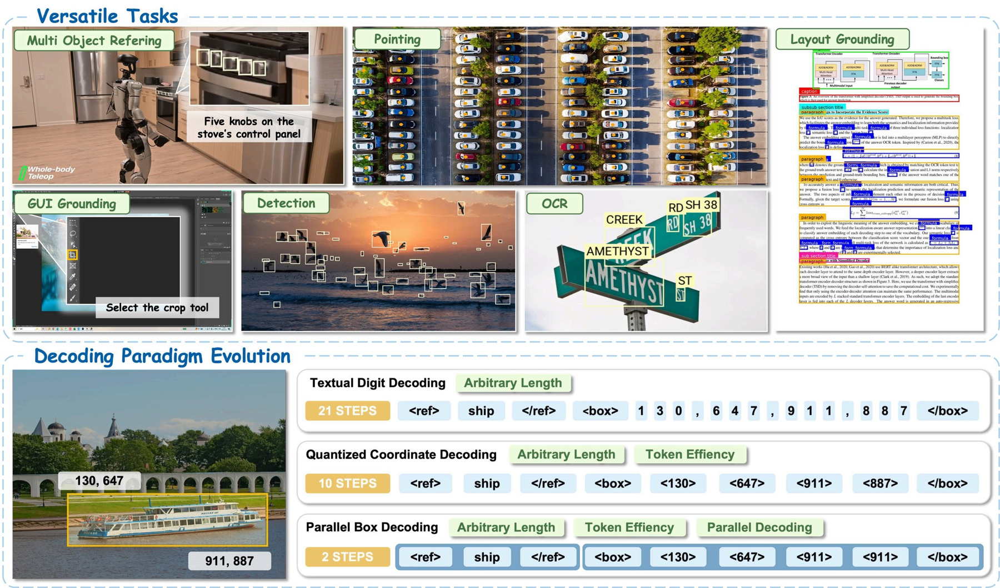
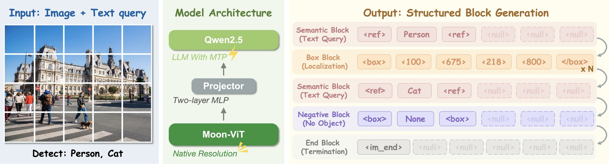
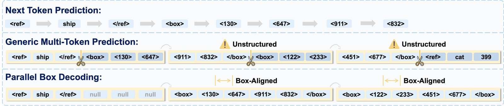
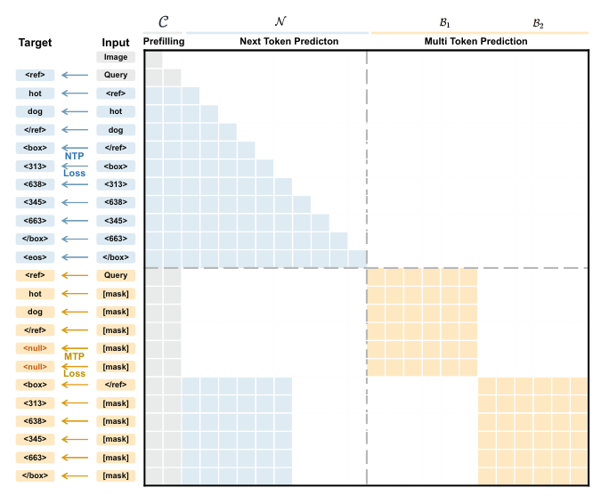
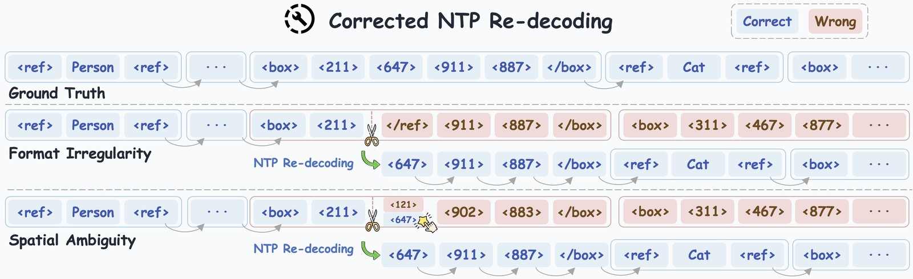
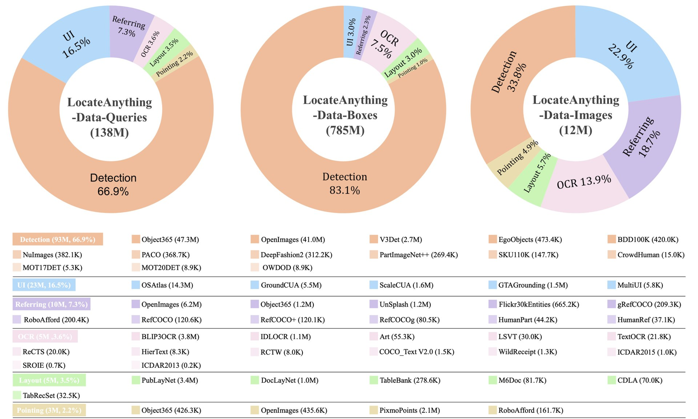
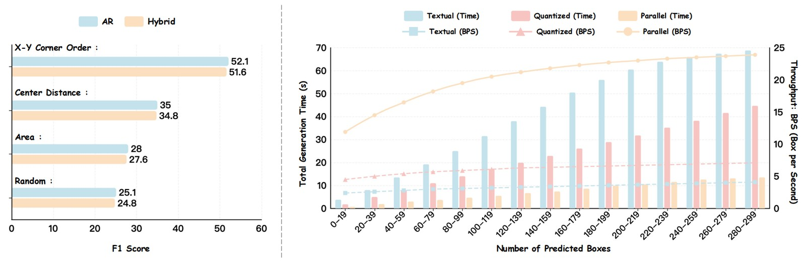

# LocateAnything: Fast and High-Quality Vision-Language Grounding with Parallel Box Decoding

> **LocateAnything은 "VLM이 박스 좌표를 한 토큰씩 뽑는다"는 관행을 "박스 하나 = 블록 하나를 한 번의 forward로 뽑는다(Parallel Box Decoding)"로 바꾼 3B급 그라운딩/검출 모델이다. 속도는 확실히 빨라졌다(12.7 BPS, Rex-Omni 대비 2.5배). 그러나 COCO ablation을 뜯어보면 정확도 향상(+2.0 F1)은 병렬 디코딩이 아니라 MTP 손실을 보조 손실로 얹은 효과이고, Fast 모드 단독은 기존 NTP보다 낮다. 강점은 높은 IoU(F1@0.95)에 집중되어 있고, IoU 0.5에서는 Rex-Omni에 진다. 본문 표와 부록 Table 12의 숫자가 7곳에서 어긋나며, 그중 RefCOCOg는 어긋난 숫자를 쓰면 SOTA가 아니게 된다. 코드에서는 Hybrid 판정 임계값이 논문과 다르고(0.7/80 → 0.9/60), 안전장치가 박스 블록에만 걸려 있어 OCR에서는 Hybrid가 무력하다.**

---

## 📋 메타 정보

| 항목 | 내용 |
|---|---|
| 제목 | LocateAnything: Fast and High-Quality Vision-Language Grounding with Parallel Box Decoding |
| 저자 | Shihao Wang*, Shilong Liu*, Yuanguo Kuang, Xinyu Wei, Yangzhou Liu, Zhiqi Li, Yunze Man, Guo Chen, Andrew Tao, Guilin Liu, Jan Kautz, Lei Zhang, Zhiding Yu† (NVIDIA + PolyU·Princeton·Nanjing·UIUC) |
| 공개 | 2026-05 (PDF 생성일 2026-05-27), **ECCV 2026 채택** (README 2026/06) |
| 분야 | VLM visual grounding(시각 그라운딩) / object detection(물체 검출) / 병렬 디코딩 |
| 논문 | https://research.nvidia.com/labs/lpr/locate-anything/LocateAnything.pdf (42쪽, arXiv 없음) |
| 프로젝트 | https://research.nvidia.com/labs/lpr/locate-anything/ |
| 코드 | https://github.com/NVlabs/Eagle/tree/main/Embodied (학습·추론·평가 전부 공개, Apache-2.0) |
| 가중치 | https://huggingface.co/nvidia/LocateAnything-3B (NVIDIA 모델 라이선스) |
| 백본 | MoonViT-SO-400M (Kimi) + Qwen2.5-3B-Instruct + 2층 MLP |
| 외부 모델(데이터 엔진) | Qwen3-VL(쿼리 생성·검증), Molmo(포인팅), SAM 3(점→박스), Rex-Omni(박스) |
| 학습 데이터 | LocateAnything-Data 138M 쿼리 / 785M 박스 / 12M 이미지 — **비공개** (형식 가이드만 공개) |

---

## 📖 주요 용어 사전 (Glossary)

### 문제 설정

| 용어 | 풀이 |
|---|---|
| **visual grounding(시각 그라운딩)** | "빨간 모자 쓴 사람"처럼 말로 지정한 대상을 이미지에서 박스로 찾아내는 일. REC(Referring Expression Comprehension, 지시 표현 이해)라고도 함 |
| **open-vocabulary detection(열린 어휘 검출)** | 학습 때 정해진 클래스 목록이 아니라, 질의로 들어온 아무 카테고리 이름이나 찾을 수 있는 검출 |
| **BPS (Boxes Per Second, 초당 박스 수)** | 이 논문의 속도 지표. H100 1장, batch 1, COCO에서 측정 |
| **F1@IoU** | 예측 박스가 정답과 IoU(겹침 비율) 임계값 이상 겹치면 정답으로 치고 precision·recall의 조화평균을 낸 값. @0.5는 "대충 맞으면 OK", @0.95는 "거의 딱 맞아야 OK", Mean은 0.5~0.95 평균 |

### 좌표 표현

| 용어 | 풀이 |
|---|---|
| **textual digits(숫자 글자)** | 좌표 1024를 "1","0","2","4" 글자로 쓰는 방식. Qwen-VL 계열. 박스 하나에 토큰 십수 개 |
| **quantized coordinate tokens(양자화 좌표 토큰)** | 0~1000을 전용 토큰 1001개(`<0>`…`<1000>`)로 만들어 좌표 하나 = 토큰 하나. Pix2Seq·Florence-2·Rex-Omni·본 논문 |
| **atomic unit(원자 단위)** | 더 쪼개지 않고 한 덩어리로 다루는 단위. 여기서는 박스 하나(`<box> x1 y1 x2 y2 </box>` 6토큰) |

### 디코딩

| 용어 | 풀이 |
|---|---|
| **NTP (Next-Token Prediction, 다음 토큰 예측)** | 일반 LLM처럼 한 번에 한 토큰씩 순서대로 생성 |
| **MTP (Multi-Token Prediction, 다중 토큰 예측)** | 한 번의 forward로 여러 토큰을 동시에 예측. LLM 가속용 |
| **structure-agnostic MTP(구조 무시형 MTP)** | 토큰 줄을 아무 데서나 k개씩 자르는 MTP. SDLM, Block Diffusion 등. 박스 경계를 가로지르는 블록이 생김 |
| **PBD (Parallel Box Decoding, 박스 단위 병렬 디코딩)** | 본 논문 핵심. MTP 블록 경계를 박스 경계에 맞춰 박스 하나를 한 스텝에 확정 |
| **block-causal attention(블록 인과 어텐션)** | 블록 사이는 앞 블록만 보고(causal), 블록 안은 서로 다 보는(bidirectional) 어텐션 패턴 |
| **speculative decoding(추측 디코딩)** | 작은 헤드가 초안을 쓰고 본체가 검증하는 가속법. 원리상 출력이 NTP와 같음(무손실). GLM-OCR의 MTP가 이 방식 — PBD는 검증 없이 바로 확정한다는 점이 다름 |
| **fallback(되돌아가기)** | 병렬 출력이 의심스러우면 그 블록만 NTP로 다시 생성하는 Hybrid 모드의 안전장치 |

### 학습 인프라

| 용어 | 풀이 |
|---|---|
| **stream packing(스트림 패킹)** | 길이 다른 샘플을 한 긴 시퀀스(예: 36,864토큰)에 빈틈없이 채워 넣어 GPU 낭비를 줄이는 기법 |
| **MagiAttention** | 샘플마다 모양이 다른 불규칙 어텐션 마스크를 range 목록으로 표현해 효율적으로 돌리는 커널. **Hopper/Blackwell 전용** → 학습에 H100급 필요 |

---

## 🎯 논문 요약 (TL;DR)

**한 줄**: 박스 좌표 4개를 한 토큰씩 뽑지 말고, 박스 하나를 블록 하나로 묶어 한 번에 뽑자 — 그리고 이상한 블록만 다시 한 토큰씩 뽑자.

**핵심 문제**
- VLM 그라운딩은 2D 박스를 1D 토큰 줄로 풀어 NTP로 하나씩 생성한다 → ① 느리다(박스 300개면 좌표만 1200+ 스텝) ② 기하적으로 묶인 4좌표를 따로 학습한다.
- LLM용 MTP를 그대로 가져오면 블록이 아무 데서나 잘려 "박스 뒷부분 + 다음 카테고리 이름 앞부분" 같은 의미 없는 조합을 학습한다.

**해결책**
1. 출력을 길이 6 블록 줄로 재구성(박스 = 블록 하나)
2. NTP 줄과 블록 줄을 한 시퀀스에 넣어 두 손실을 동시에 학습
3. Fast / Slow / Hybrid 세 추론 모드

**검증**: LVIS·COCO·Dense200·VisDrone·DocLayNet·M6Doc·TotalText·ScreenSpot-Pro·HumanRef·RefCOCOg·포인팅 7종. Hybrid 12.7 BPS(Rex-Omni 5.0, Qwen3-VL 1.1).

---

## 🏆 핵심 기여 (Contributions)

1. **PBD** — MTP 블록을 박스 경계에 정렬한 병렬 디코딩 (VLM 그라운딩에 MTP를 적용한 초기 시도)
2. **Hybrid 디코딩** — 형식 깨짐·공간 모호성을 감지해 해당 블록만 NTP로 재생성
3. **LocateAnything-Data** — 138M 쿼리 / 785M 박스 / negative 22M, 6개 도메인 데이터 엔진
4. **속도-정확도 전선 전진** — 최대 2.5배 속도, 높은 IoU 정확도 향상

---

## 1️⃣ 주요 알고리즘

*"무엇을 바꿨나"를 구조 → 출력 표현 → 학습 → 추론 순서로 따라가기 위한 장입니다.*

### 1.1 전체 구조

*구조 자체는 평범한 VLM이라 새 기여가 아니라는 점을 먼저 확인해 두기 위한 절입니다.*


*Figure 1. 위: 하나의 VLM으로 검출·REC·GUI·OCR·레이아웃·포인팅 수행. 아래: 숫자 글자 디코딩 / 양자화 좌표 순차 디코딩 / PBD 비교.*


*Figure 3. MoonViT(원본 해상도) → MLP → Qwen2.5 → 블록 줄 출력. 블록 4종(Semantic / Box / Negative / End).*

| 부품 | 내용 | 실측 |
|---|---|---|
| vision encoder | MoonViT-SO-400M, patch 14, 2×2 merge, native resolution(원본 해상도) | — |
| connector | 2층 MLP (`mlp1`) | — |
| LLM | Qwen2.5-3B-Instruct (36층, hidden 2048, GQA 16/2) | — |
| 어휘 확장 | 좌표 토큰 1001개(151677~152677) + `<null>`, `<text_mask>`, switch 등 → vocab 152,681 | — |
| **총 파라미터** | 논문 "3B" | **HF safetensors 3,830,665,968 (3.83B)**. `tie_word_embeddings: true`인데 `lm_head.weight`(152681×2048 = 312.7M)가 따로 저장 → 중복 제외 실질 약 3.52B |

### 1.2 블록 기반 출력 표현

*박스를 "쪼갤 수 없는 덩어리"로 만들어야 한 스텝에 통째로 뽑을 수 있으므로, 출력 줄 전체를 같은 길이 블록으로 재포장합니다.*


*Figure 2. NTP(한 토큰씩) / 일반 MTP(경계 무시, Unstructured) / PBD(Box-Aligned).*

- 좌표를 0~1000으로 정규화 후 전용 토큰으로 바꾸고, 출력을 블록 줄 B = (b1, …, bN)로 재구성: P(B | 이미지, 질의) = Π P(b_i | b_<i, 이미지, 질의)
- 블록 길이 **L = 6** = `<box>` + 좌표 4 + `</box>` → 박스가 정확히 한 블록
- 빈자리는 `<null>`로 채움

| 블록 종류 | 내용 | 예 |
|---|---|---|
| Semantic | 카테고리/문구. 6토큰 넘으면 여러 블록에 나눔 | `<ref> hot dog </ref> <null> <null>` |
| Box | 좌표 4개 | `<box> <313> <638> <345> <663> </box>` |
| Negative | 질의한 대상이 없음 | `<box> none </box> <null>×3` |
| End | 생성 종료 | `<|im_end|>` |

### 1.3 이중 스트림 학습 (Dual-formulation training)

*블록만으로 학습하면 LLM 본래의 순차 추론 능력이 망가질 수 있으므로, 같은 정답을 "토큰 줄"과 "블록 줄" 두 형식으로 동시에 학습합니다.*

```text
x_all = [이미지 + 질의] ⊕ [NTP 정답 줄] ⊕ [블록 줄]
블록 줄 입력 = [앵커 토큰, mask ×5]  →  다음 6토큰 동시 예측
L = L_ntp + L_mtp   (둘 다 cross-entropy)
```


*Figure 4. 파란색 = 공유 문맥+NTP 줄(causal). 주황색 = MTP 블록(블록 안 양방향). **B2(박스 블록) 행이 NTP 줄의 진짜 토큰(`<ref> hot dog </ref>`) 열을 보고 있음에 주목** — 앞 MTP 블록 B1(mask로 채워짐)은 보지 않는다.*

어텐션 규칙 3가지:

| 규칙 | 내용 | 이유 |
|---|---|---|
| NTP 줄은 causal | 앞 토큰만 봄, 블록 줄은 못 봄 | 정답 유출 방지 + 추론 KV cache와 일치 |
| 블록 간 causal | 현재 블록은 앞쪽 **확정된 진짜 토큰**만 봄, 뒤 블록은 못 봄 | 앞 박스들을 보고 중복·누락 방지 |
| 블록 내 bidirectional | 블록 안 6토큰이 서로 다 봄 | 4좌표를 서로 보며 동시에 결정 |

> ⚠️ **본문 서술 vs 그림/코드**: 본문은 "attend to … all previously committed blocks"라고 써서 블록 줄 안의 앞 블록(mask로 채워진)을 보는 것처럼 읽힌다. 그러나 **Fig. 4와 코드(`mask_magi_utils.py`의 `convert_mtp_mask_to_magi_plan`)는 모두 "자기 블록 + NTP 줄의 진짜 prefix"만 보게 되어 있다.** 추론 때 앞 이력은 진짜 토큰이므로 이쪽이 맞는 설계이고, 본문 문장만 모호하다.

**학습 인프라**: stream packing(목표 36,864토큰, best-fit buffer 32) + MagiAttention(불규칙 마스크).

### 1.4 세 가지 추론 모드

*병렬 디코딩은 복잡한 장면에서 틀리기 쉬우므로, 속도·정확도 요구에 따라 고를 수 있게 세 모드를 둡니다.*


*Figure 5. Format Irregularity / Spatial Ambiguity 발생 시 해당 블록만 NTP로 재생성.*

| 모드 | 동작 | COCO BPS (Table 12) |
|---|---|---|
| **Fast** | 블록 병렬만 | 15.3 |
| **Slow** | 순수 NTP | 4.3 |
| **Hybrid** (기본) | Fast로 가다가 이상한 블록만 NTP, `</box>` 나오면 다시 Fast | 12.7 |

Hybrid 판정 기준 (논문 기술):
- **Format Irregularity(형식 깨짐)**: 카테고리 경계에서 `<box><211></ref><911>…`처럼 박스 안에 구조 토큰이 섞임
- **Spatial Ambiguity(공간 모호성)**: 촘촘한 격자에서 두 물체 사이 좌표를 찍음. 판정 = top-1 좌표 확률 < 0.7 **그리고** top-5 좌표 후보 폭 > 80 (0~1000 스케일)
- → 코드는 다른 값을 쓴다 (§4.1 ①)

**추론 KV cache**: 매 스텝 후 확정 토큰까지만 남기고 mask·복제 앵커를 잘라냄 → 학습 때 본 causal prefix와 일치.

### 1.5 학습 4단계

*검출 데이터를 넣기 전에 일반 지식부터 정렬해 두기 위해 base VLM 학습을 앞에 둡니다.*

| | Stage 1 | Stage 2 | Stage 3 | Stage 4 |
|---|---|---|---|---|
| 목적 | 캡션 정렬 | 일반 멀티모달 | 검출·그라운딩 138M | 밀집 강화 |
| 데이터 | 캡션 | 전체 VQA(Tab.8) | LocateAnything-Data | 이전 20% + 밀집(MOT20Det, SKU110K) |
| LR | 2e-4 | 4e-5 | 4e-5 | 1e-5 |
| 학습 부품 | MLP만 | 전체 | 전체 | 전체 |
| GPU / step | 64 / 2K | 256 / 20K | 256 / 25K | 256 / 5K |
| max len | 32768 | 32768 | 25600 | 25600 |

> 본문은 Stage 3/4를 "Stage-1/Stage-2 SFT"로 부른다(번호 체계 불일치, 사소).

### 1.6 LocateAnything-Data

*박스 정확도는 데이터 다양성에 크게 좌우되므로, 공개 데이터 + 합성 엔진으로 규모와 도메인을 넓혔습니다.*



| 도메인 | 쿼리 | negative | 비고 |
|---|---|---|---|
| Detection | 93.4M (66.9%) | 21.0M | Objects365 47.3M, OpenImages 41.0M, V3Det … |
| GUI | 23.0M (16.5%) | 0 | OSAtlas 14.3M, GroundCUA 5.5M(Qwen3-VL로 외형/공간/기능 설명 증강) |
| Referring | 10.1M (7.3%) | 93K | 데이터 엔진 합성 |
| OCR | 5.1M (3.6%) | 0 | BLIP3OCR 3.8M … |
| Layout | 4.9M (3.5%) | 1.38M | PubLayNet 3.4M, DocLayNet 1.0M … |
| Pointing | 3.1M (2.2%) | 353K | PixmoPoints 2.1M … |

**Multi-target grounding data engine**
- 검출 데이터: 정답 박스 카테고리 → Qwen3-VL이 속성·공간·추론 쿼리 생성 → Molmo가 점 → **정답 박스 안에 떨어진 점만 채택**
- 라벨 없는 이미지(Unsplash, SA-1B): Qwen3-VL 쿼리 → (Molmo 점 → SAM 3 박스) 또는 Rex-Omni 박스 → Qwen3-VL 사후 검증

---

## 2️⃣ 실험 요약

*속도와 정확도가 정말 동시에 좋아졌는지, 어디서 좋아졌는지를 확인하는 장입니다.*

### 2.1 일반 검출 (LVIS / COCO, Hybrid)

*긴꼬리(LVIS)와 일반(COCO) 검출에서 VLM·전용 검출기와 비교하는 메인 표.*

| 모델 | BPS | LVIS @0.5 | LVIS @0.95 | LVIS Mean | COCO @0.5 | COCO @0.95 | COCO Mean |
|---|---|---|---|---|---|---|---|
| Grounding DINO-T | — | 47.7 | 22.7 | 38.8 | 69.8 | 23.0 | 56.6 |
| Qwen3-VL-8B | 1.0 | 61.5 | 20.2 | 44.8 | 62.8 | 14.0 | 45.7 |
| SEED1.5-VL | — | **65.6** | 19.5 | 46.7 | 71.3 | 14.3 | 51.4 |
| Rex-Omni-3B | 5.0 | 64.3 | 20.7 | 46.9 | **72.0** | 15.9 | 52.9 |
| **LocateAnything-3B** | **12.7** | 62.3 | **31.1** | **50.7** | 70.1 | 19.3 | 54.7 |

→ 이득은 **@0.95에 집중**(LVIS 31.1 vs 20.7). @0.5는 오히려 Rex-Omni·SEED에 짐.

### 2.2 밀집 / 문서 / OCR / GUI / REC

*박스가 많거나(밀집) 도메인이 다른(문서·GUI) 곳에서도 통하는지 확인.*

| 벤치 | LocateAnything | 주요 비교 | 비고 |
|---|---|---|---|
| Dense200 Mean | 58.7 | Rex-Omni 58.3 | @0.5는 74.0 vs **78.4**로 패 |
| VisDrone Mean | 39.9 | Rex-Omni 35.8 / G-DINO 38.5 | |
| DocLayNet Mean | 76.8 | Rex-Omni 70.7 / **DocLayout-YOLO 81.1** | 전용 검출기에 패 |
| M6Doc Mean | **70.1** | Rex-Omni 55.6 | 최대 격차 |
| TotalText Mean | 43.3 | Rex-Omni 40.6 | 절대값 낮음 |
| ScreenSpot-Pro Avg(Acc) | **60.3** | GUI-Owl-32B 58.0 / UI-Venus-1.5-2B 57.7 | 아이콘에서 강함(Office Icon 69.8 vs 39.6) |
| HumanRef Mean | 78.7 | Rex-Omni **79.9** / SEED **81.6** | 본문은 "competitive" |
| RefCOCOg val/test Mean | 76.7 / 77.6 | Qwen3-VL-8B 74.9 / 75.2 | ⚠️ §3.2 ② 참조 |
| 포인팅 7종 (Tab.11) | 전부 1위 | Rex-Omni | COCO 83.9, Dense200 87.6, RefCOCOg test 91.0 |

### 2.3 Ablation (COCO만으로 학습)

*138M 데이터 효과를 빼고 PBD 설계 자체의 효과만 보기 위해 COCO로만 학습한 통제 실험.*

| (a) 좌표 표현 | BPS | F1 |
|---|---|---|
| Textual (NTP) | 1.3 | 49.1 |
| Quantized (NTP) | 3.9 | 50.1 |
| PBD Slow | 3.9 | **52.1** |
| PBD Fast | **16.9** | 49.6 |
| PBD Hybrid | 13.2 | 51.6 |

| (b) MTP 방식 | BPS | F1 |
|---|---|---|
| SDLM-B4 / B6 / B8 | 5.2 / 5.5 / 6.7 | 46.5 / 46.1 / 45.8 |
| Block Diffusion-B6 | 4.7 | 44.8 |
| PBD Fast | **16.9** | **49.6** |

| (c) 손실 | 모드 | BPS | R / P / F1 |
|---|---|---|---|
| L_ntp만 | Slow | 3.9 | 48.2 / 52.2 / 50.1 |
| L_blk만 | Fast | 16.7 | 45.6 / 49.0 / 47.2 |
| 둘 다 | Slow | 3.9 | 49.4 / 55.2 / **52.1** |
| 둘 다 | Fast | 16.9 | 45.6 / 54.6 / 49.6 |
| 둘 다 | Hybrid | 13.2 | 48.7 / 54.8 / 51.6 |

- 박스 정렬 순서(Fig.7 왼쪽): **x-y 모서리 순 > 중심거리 > 면적 > 랜덤**
- 백본 일반화(Tab.13, Qwen3-VL-4B): NTP 50.8/2.8 → Slow 52.2/2.8, Fast 49.6/11.4, Hybrid 52.0/9.4


*Figure 7 (오른쪽). 박스 수 20→300으로 늘 때 NTP 계열은 시간이 선형 증가, Parallel은 거의 평평 → BPS 12 → ~25.*

### 2.4 모드별 상세 (Table 12)

*Hybrid가 정말 "Fast 속도 + Slow 정확도"를 주는지 도메인별로 확인.*

| 벤치 | Fast (15.3) | Hybrid (12.7) | Slow (4.3) |
|---|---|---|---|
| COCO F1 | 52.2 | 54.7 | 55.1 |
| LVIS F1 | 47.0 | 50.7 | 52.6 |
| Dense200 | 46.8 | 61.3 | 61.5 |
| DocLayNet | 67.2 | 77.7 | 80.4 |
| **HierText** | 28.8 | **29.1** | **43.2** |
| **SROIE** | 38.8 | **39.3** | **64.4** |
| TotalText | 44.4 | 44.6 | 47.5 |
| HumanRef | 66.8 | 78.5 | 79.1 |
| RefCOCOg val / test | 70.8 / 72.5 | **73.4 / 74.8** | 72.4 / 73.8 |

→ 검출·레이아웃에서는 Hybrid ≈ Slow. **OCR에서는 Hybrid ≈ Fast** (§4.2 ⑤).

---

## 3️⃣ 비판적 평가 — 논문의 급소

*헤드라인 주장을 논문 자신의 표로 다시 검산하기 위한 장입니다.*

### 3.1 ① "PBD가 속도와 정확도를 둘 다 올린다"는 반만 맞다

- Fast 단독은 기존 NTP보다 **낮다**: 50.1 → 49.6 (Qwen3-VL-4B에서도 50.8 → 49.6).
- Table 6(c)의 "L_ntp만 Slow" 행이 (a)의 Quantized 행과 **숫자가 완전히 같다**(48.2/52.2/50.1). 즉 정확도 +2.0은 **MTP 손실을 보조 손실로 얹은 정규화 효과**이고, 병렬 디코딩 자체에서 나온 게 아니다.
- 정리: 정확도는 보조 손실에서, 속도는 Fast 디코딩에서 **따로** 오고, Hybrid가 둘을 절충한다. "박스를 동시에 뽑아 기하 일관성이 좋아졌다"는 서사와 다르다.

### 3.2 ② 표끼리 숫자가 다르다 (같은 Hybrid인데)

| 벤치 | 본문 표 | Table 12 Hybrid |
|---|---|---|
| RefCOCOg val | 76.7 | **73.4** |
| RefCOCOg test | 77.6 | **74.8** |
| Dense200 | 58.7 | 61.3 |
| DocLayNet | 76.8 | 77.7 |
| TotalText | 43.3 | 44.6 |
| M6Doc | 70.1 | 70.5 |
| HumanRef | 78.7 | 78.5 |

- Table 12 숫자로 보면 RefCOCOg val 73.4는 **Rex-Omni(73.6)·Qwen3-VL-8B(74.9)보다 낮다** → README의 "RefCOCOg SOTA"는 어느 표를 믿느냐에 달림.
- 본문 C.4는 DocLayNet Slow를 "79.8"이라 쓰지만 표는 80.4. 평가가 확률적 샘플링(§4.3 ⑦)이라 실행마다 달라진 흔적일 가능성.

### 3.3 ③ IoU 0.5에서는 진다

LVIS 62.3 vs 64.3, COCO 70.1 vs 72.0, Dense200 74.0 vs 78.4, HumanRef 82.9 vs 85.4(모두 Rex-Omni). 강점은 **"더 많이 찾기"가 아니라 "찾은 것을 더 딱 맞게"**.

### 3.4 ④ 기타

- ScreenSpot-Pro를 본문은 "mean F1"이라 부르지만 실제 지표는 정확도(Acc) — Table 12는 Acc로 올바르게 표기.
- BPS는 COCO·H100·batch 1에서만 측정. 비교 모델 BPS를 같은 이미지에서 쟀는지 명시 없음.

---

## 4️⃣ 코드 분석 (NVlabs/Eagle/Embodied)

*논문 서술이 실제 구현과 맞는지, 쓰려면 무엇을 알아야 하는지 확인하는 장입니다.*

### 4.1 논문 ↔ 코드 불일치

| # | 항목 | 논문 | 코드 | 위치 |
|---|---|---|---|---|
| ① | Hybrid 모호성 임계값 | top-1 < 0.7, top-5 폭 > 80 | **top-1 < 0.9, 폭 > 60, + 유효 후보 ≥ 2**. 논문 값은 주석 처리됨 | `generate_utils.py` `decode_bbox_avg` |
| ② | 후보 개수 | top-5 | 호출부는 `keep_k=5`를 넘기지만 함수는 `keep_k_avg`(기본 **4**)를 읽음 → 5는 무시됨 | `sample_tokens` |
| ③ | 함수 이름 | — | `decode_bbox_avg`인데 평균 없이 top-1만 사용 | 同 |
| ④ | "블록 버리고 되돌림" | 블록 폐기 후 마지막 검증 prefix로 | 블록의 **유효 앞부분**(예: `<box><x1>`)은 남기고 그 뒤부터 NTP | `handle_pattern` → `error_box` |
| ⑤ | 박스 없는 샘플 | 언급 없음 | 일반 VQA 등은 **랜덤 offset으로 블록 절단** — 논문이 비판한 structure-agnostic MTP를 그대로 사용 | `locany_finetune_magi_stream.py:303` |

모호성 판정 트릭: 이상 좌표를 토큰 id **0**으로 바꿔 넣으면 `handle_pattern`이 "좌표 아님"으로 보고 `error_box` → NTP 전환. 판정과 전환을 한 경로로 합친 구현.

### 4.2 구조적 약점

- ⑤ **안전장치는 박스 블록에만**: `handle_pattern`에서 `ref_object`(텍스트 블록)는 절대 NTP로 되돌아가지 않는다. 텍스트 블록은 `decode_ref`가 top-k 중 "좌표가 아닌 토큰"을 강제로 고를 뿐. → **OCR에서 Hybrid가 Fast와 거의 같은 이유** (HierText 29.1 vs Slow 43.2, SROIE 39.3 vs 64.4). "Hybrid가 정확도 대부분 보존"은 OCR에 해당 안 됨.
- ⑥ **NTP 구간에서 예상 밖 토큰 → 조용한 종료**: Hybrid의 NTP 단계에서 좌표·`none`·`</box>`가 아닌 토큰(예: `<ref>`)이 나오면 `out_type='im_end'` → 전체 생성 종료. 남은 박스를 통째로 놓칠 수 있음.

### 4.3 평가 설정의 함정

- ⑦ `evaluation/inference_compat.py`: 모든 평가가 **temperature 0.7, top_p 0.9, repetition_penalty 1.1, do_sample=True**. 시드 고정·분산 보고 없음.
  - Fast/Hybrid의 박스 좌표는 top-1(사실상 **greedy**)로 고르고, Slow는 T=0.7로 **샘플링** → 모드 간 비교에 디코딩 방식 교란이 섞임.
  - repetition penalty가 좌표 토큰에도 걸림 → 밀집 장면에서 이미 쓴 좌표값이 불이익. 영향 분석 없음.

### 4.4 잘 된 부분

- 학습 위치 id(`pos_block = arange(anchor, anchor+6)`)와 추론 위치 id(마지막 6위치 −1 보정 → 복제 앵커가 원래 앵커 위치 공유)가 정확히 맞물림.
- 학습 마스크(블록 → 자기 블록 + NTP prefix, 앵커 원본 제외)와 추론 마스크(`build_magi_ranges`의 `blocked_k = kv_len − B − 1`)가 일치.
- KV cache를 매 스텝 확정 토큰까지만 자르고, 새로 확정된 토큰은 다음 forward에서 재인코딩 — 단순하고 일관됨.
- 학습(MagiAttention) + 추론 + LoRA + visual prompt 미세조정 스크립트 + non-Hopper용 `la_flash` 배치 런타임까지 공개.

### 4.5 쓰기 전에 알 것

| 항목 | 내용 |
|---|---|
| 학습 GPU | MagiAttention = Hopper/Blackwell 전용 |
| 추론 | batch 1만(`assert batch_size == 1`), A100 등은 `la_flash` 런타임 |
| visual prompt | 공개 체크포인트는 **미지원** (README 명시, 코드로 직접 미세조정해야 함) |
| 라이선스 | 코드 Apache-2.0 / 모델 NVIDIA 라이선스. 백본 Qwen2.5-3B는 Qwen Research 라이선스 → 상업 이용 시 확인 필요 |
| 데이터 | 138M 비공개. `document/DATA_PREPARATION.md`에 JSONL/recipe 형식만 |

---

## 💬 Q&A

### Q1. VLM에서 Detection은 어느 정도 해왔던 거로 아는데, VLM-OCR이나 MinerU 같은 것과 알고리즘적으로 특이한 점이나 차이점은 뭐야?

맞습니다. VLM으로 검출하는 것 자체는 새롭지 않습니다. Pix2Seq(2022), Shikra, Florence-2, PaliGemma, Qwen-VL, Rex-Omni가 이미 해왔고, VLM-OCR 쪽(MinerU2.5, DeepSeek-OCR, dots.ocr)도 박스를 출력합니다. LocateAnything이 새로운 점은 딱 하나, **좌표를 어떻게 디코딩하느냐**입니다.

#### ① 좌표를 토큰으로 바꾸는 방식

| 방식 | 대표 모델 | 박스 1개 비용 |
|---|---|---|
| 좌표를 숫자 글자로 씀 | MinerU2.5 (`<\|box_start\|>100 200 300 400<\|box_end\|>`), dots.ocr (JSON `"bbox": [120, 88, ...]`), Qwen-VL | Qwen 토크나이저는 숫자를 한 자리씩 쪼개므로 좌표 부분만 대략 15토큰 안팎 |
| 좌표 전용 토큰 (0~1000 bin) | Florence-2, PaliGemma(1024개), DeepSeek-OCR `<\|det\|>`, Rex-Omni, **LocateAnything** | 좌표 하나에 1토큰, 박스 하나에 4토큰 |

좌표 전용 토큰은 LocateAnything이 처음 쓴 게 아닙니다. Florence-2 계열에서 이미 쓰던 방식입니다.

#### ② 디코딩 방식 — 진짜 차이는 여기

**MinerU2.5와 DeepSeek-OCR**은 박스도 본문 텍스트도 전부 한 토큰씩 순서대로 생성합니다.

**GLM-OCR**도 여러 토큰을 동시에 예측(MTP)하지만, 원리가 LocateAnything과 완전히 다릅니다.

| | GLM-OCR의 MTP | LocateAnything의 PBD |
|---|---|---|
| 구조 | 본체 옆에 보조 예측기를 따로 붙임 (DeepSeek-V3 방식) | 같은 모델에 mask 토큰 5개를 넣고, 블록 안은 양방향 attention |
| 블록 경계 | 없음. 그냥 다음 k개 토큰 | 박스 경계에 맞춤 (6토큰 = `<box>`, 좌표 4개, `</box>`) |
| 검증 | 본체가 초안을 검증함 (speculative decoding). 원리상 출력이 한 토큰씩 생성할 때와 같음 | 검증 없이 바로 확정. 대신 휴리스틱으로 이상 블록만 한 토큰씩 다시 생성 |
| 결과 | 정확도 손해 없이 속도만 올림 (원리상) | Fast 모드만 쓰면 정확도가 떨어짐 (COCO 50.1 → 49.6) |

한 줄로 정리하면: GLM-OCR은 **초안을 빠르게 쓰고 본체가 검사**하는 방식, LocateAnything은 **박스 하나를 한 번에 확정하고 의심스러울 때만 다시 쓰는** 방식입니다. 그래서 LocateAnything은 손실이 있을 수 있는 대신 박스를 통째로 한 번에 뽑을 수 있습니다.

#### ③ 출력 순서의 의미

- **문서 파싱에서는 순서가 곧 정답입니다.** MinerU2.5는 요소가 나오는 순서 자체가 읽기 순서입니다. GLM-OCR과 PaddleOCR-VL은 레이아웃 검출기가 순서를 정해줍니다.
- **LocateAnything에서 순서는 임의입니다.** 박스를 x-y 모서리 순으로 정렬했을 때 F1이 가장 좋아서 그 순서를 골랐을 뿐입니다(Fig. 7).
- 그래서 LocateAnything을 문서 파서의 레이아웃 단계에 그대로 끼우면 **읽기 순서를 따로 해결해야 합니다.** (단 이는 학습된 모델의 문제이고, PBD라는 방법 자체는 읽기 순서와 충돌하지 않음 → Q2 ⑥)

#### ④ 무엇을 출력하는가

- **VLM-OCR**의 목적은 내용입니다. Markdown, LaTeX, HTML 표를 출력하고, 박스는 중간 산물입니다. 토큰 대부분이 본문 텍스트라서 **병목도 텍스트 길이**입니다.
- **LocateAnything**의 목적은 위치입니다. 텍스트는 카테고리 이름 정도만 출력하고, 토큰 대부분이 박스라서 **병목이 박스 개수**입니다.
- 그래서 PBD를 문서 파싱에 붙여도 빨라지는 부분은 **레이아웃 단계(페이지당 박스 수십 개)뿐**입니다. 본문 인식은 그대로입니다. (단 MinerU 구조에서는 레이아웃 단계가 가장 병렬화하기 어려운 구간 → Q2 ③)

#### ⑤ 그러면 OCR 쪽에 쓸모가 있는가

LocateAnything 자체 숫자로 보면 한계가 있습니다.

- **레이아웃**: DocLayNet 76.8로 전용 검출기 DocLayout-YOLO(81.1)에 아직 뒤집니다. 요즘 문서 파서들이 레이아웃을 VLM에 맡기지 않고 전용 검출기(PP-DocLayout)로 되돌아가는 흐름과 같은 결과입니다. MinerU도 최신 저장소에서는 레이아웃 단계를 PP-DocLayoutV2로 바꿨습니다.
- **글자 인식**: Hybrid의 안전장치는 박스 블록에만 걸려 있어서(§4.2 ⑤) 텍스트 인식에서 크게 약합니다. SROIE는 Hybrid 39.3, Slow 64.4입니다.
- **쓸 만한 틈새**: 고정된 카테고리가 아니라 **자유 문장 질의로 위치를 찾는 경우**입니다. 예를 들면 "이 표에서 합계 칸", "서명란", "두 번째 도장" 같은 질의입니다. 문서 파서들은 레이아웃 카테고리가 정해져 있어서 이런 질의를 처리하지 못합니다.

#### 요약

| 축 | VLM-OCR (MinerU2.5 등) | LocateAnything |
|---|---|---|
| 좌표 표현 | 숫자 글자 또는 전용 토큰 | 전용 토큰 (새롭지 않음) |
| 디코딩 | 한 토큰씩, GLM-OCR은 검증형 MTP | **박스 단위 병렬 + 휴리스틱으로 부분 재생성** ← 유일한 새 기여 |
| 출력 순서 | 읽기 순서 (의미 있음) | x-y 정렬 (임의) |
| 병목 | 본문 텍스트 길이 | 박스 개수 |
| 질의 | 고정 프롬프트, 고정 카테고리 | 자유 문장 질의 |

**결론**: 알고리즘상 새로운 것은 **"MTP 블록을 박스 단위로 자른다"** 한 가지입니다. OCR 파이프라인에 가져온다면 레이아웃·영역 검출 단계에만 해당하고, 본문 인식 속도에는 영향이 없습니다.

---

### Q2. MinerU2.5-Pro의 영역 감지(layout detection)와의 차이점은?

두 모델 모두 박스를 출력하지만 목적이 다릅니다. MinerU2.5-Pro는 **문서를 복원하기 위한 첫 단계**로 박스를 찍고, LocateAnything은 **질의받은 대상의 위치 자체가 최종 답**입니다. 대부분의 차이가 여기서 나옵니다. (MinerU2.5-Pro 상세 → [PAPER_MinerU2.5-Pro.md](PAPER_MinerU2.5-Pro.md) §6 GRPO 보상, §9 인터페이스)

#### ① 태스크 정의

| | MinerU2.5-Pro Stage I | LocateAnything |
|---|---|---|
| 프롬프트 | `Layout Detection:` 하나로 고정 | "다음 카테고리/문장에 맞는 것을 모두 찾아라: [질의]" |
| 무엇을 찾나 | 정해진 레이아웃 카테고리 전부 (닫힌 집합) | 질의한 것만 찾음 (열린 어휘). 없으면 `<box>none</box>` |
| 요소 하나당 출력 | 박스 + 카테고리 + **회전 방향** (+ Pro는 문단 병합 플래그) | 박스만 |
| 출력 순서 | **읽기 순서** (순서 자체가 정답) | 카테고리별로 묶은 뒤, 그 안에서 x-y 좌표순 |

출력 모양 비교:

```text
MinerU:  <box>좌표</box><ref>title</ref><rotate_up>  <box>좌표</box><ref>text</ref><rotate_up> ...
         (요소마다 박스 → 종류 → 회전 순서, 읽기 순서대로 나열)

LocateAnything:  <ref>title</ref><box>..</box>  <ref>text</ref><box>..</box><box>..</box><box>..</box> ...
                 (카테고리를 먼저 쓰고 그 박스들을 몰아서 나열)
```

LocateAnything 방식은 본문 블록끼리 한데 모이므로 **문서 흐름이 사라집니다.** 반면 MinerU의 출력은 그 자체가 다음 단계의 입력입니다. 크롭, 회전 보정, 수식 줄 분할, 잘린 문단 병합이 모두 이 출력을 기준으로 움직입니다. 레이아웃 결과가 파싱에 필요한 메타데이터까지 함께 들고 다니는 셈입니다.

#### ② 입력 해상도

- **MinerU**는 **1036×1036 정사각형으로 고정**된 축소판을 씁니다. 좌표계가 항상 같으니 박스를 안정적으로 찍을 수 있고 계산량도 일정합니다. 대신 작은 글자나 가는 선은 뭉개질 수 있는데, 그건 Stage II에서 원본 크롭으로 보완합니다.
- **LocateAnything**은 MoonViT로 **원본 해상도를 그대로** 넣습니다(부록 C.5: COCO/LVIS만 짧은 변 840, 나머지는 원본). 고해상도 문서 페이지면 시각 토큰이 많아지지만, 1단계에서 곧바로 촘촘한 박스를 찍을 수 있습니다.

#### ③ 좌표 표현과 디코딩 비용

- **MinerU**: 좌표를 `<|box_start|>x1 y1 x2 y2<|box_end|>`처럼 0~999 숫자 글자로 씁니다. Qwen 토크나이저는 숫자를 한 자리씩 자르므로, 요소 하나에 박스·카테고리·회전까지 합치면 **대략 20토큰 안팎**, 즉 forward 20번입니다. (토큰 수는 추정치, 실측 아님)
- **LocateAnything**: 좌표 전용 토큰 + PBD로 **박스 하나를 forward 1번**에 뽑습니다.

페이지에 요소가 40개라면 MinerU Stage I은 약 800스텝, LocateAnything 방식은 약 40스텝(카테고리 블록 제외)입니다.

**중요한 점**: MinerU 파이프라인에서 Stage II(크롭별 인식)는 여러 크롭을 배치로 병렬 처리할 수 있지만, **Stage I은 페이지당 한 줄로 순서대로 생성해야 하는 구간**입니다. 그래서 요소가 많은 페이지일수록 Stage I이 페이지 지연 시간에서 차지하는 비중이 커질 수 있습니다. Q1에서 "PBD는 본문 인식 속도와 무관"이라 했는데, 정확히는 **MinerU 구조에서 가장 병렬화하기 어려운 구간을 줄여줄 수 있다**는 뜻입니다.

#### ④ 높은 IoU를 얻는 방법 — 두 모델 모두 박스를 딱 맞게 치는 게 목표지만 방법이 반대

| | MinerU2.5-Pro | LocateAnything |
|---|---|---|
| 학습 | SFT → Hard SFT → **GRPO (보상 = category IoU)** | SFT만 (NTP 손실 + 블록 MTP 보조 손실). RL은 향후 과제 |
| 정확도의 출처 | **평가 지표 자체를 보상으로 직접 최적화** | 보조 손실이 정규화처럼 작용 (Slow 50.1 → 52.1) |
| 레이아웃 데이터 | 1400만 건. 난이도 분류(CMCV)로 Medium/Hard 비중 상향, 전문가 주석 Hard 사용 (레이아웃 Hard:replay = 6:1) | 약 500만 쿼리, 대부분 공개 데이터 (PubLayNet 3.4M, DocLayNet 1M 등). PubLayNet은 자동 라벨이라 쉬운 논문 레이아웃 위주 |

레이아웃 품질에 관해서는 MinerU 쪽이 데이터와 학습 목표 모두에서 훨씬 공을 들였습니다.

#### ⑤ 평가 방식

- **MinerU**: OmniDocBench 종단간 점수 + 박스 매칭 대신 픽셀 커버리지로 재는 **PageIoU**. 문서에서는 박스를 어떻게 쪼개느냐(세분도)가 모델마다 달라 1:1 매칭이 불공정하기 때문입니다.
- **LocateAnything**: DocLayNet/M6Doc에서 **F1@IoU(박스 1:1 매칭)**.

지표가 달라 숫자를 직접 비교할 수 없고, LocateAnything 논문에도 MinerU 비교는 없습니다. 참고 기준선은 DocLayNet에서 DocLayout-YOLO 81.1 대 LocateAnything 76.8 정도입니다.

#### ⑥ 두 방식을 합칠 수 있는가

PBD라는 방법 자체는 읽기 순서와 충돌하지 않습니다. 블록끼리는 앞 블록을 보고 순서대로 생성되기 때문에, 순서는 학습 데이터가 정하는 것이지 PBD가 강제하는 게 아닙니다. LocateAnything이 x-y 순서를 쓴 건 자연 이미지 검출에서 F1이 가장 좋았기 때문일 뿐입니다.

그래서 이런 이식을 생각해볼 수 있습니다.

- MinerU Stage I 출력의 요소 하나를 블록 하나로 정의: 박스 4토큰 + 카테고리 1토큰 + 회전 1토큰 + 구분자 → 블록 크기 약 8
- 순서는 읽기 순서 그대로
- 좌표는 전용 토큰으로, 카테고리와 회전도 각각 1토큰으로 맞춤

다만 이건 **가설이고 실험된 적 없습니다.** 예상 걸림돌 두 가지:

1. 블록 안에서 박스와 카테고리를 동시에 정하면, 카테고리를 먼저 정하고 박스를 찍는 순차 방식보다 헷갈릴 수 있습니다. LocateAnything이 보고한 "카테고리 경계에서 형식이 깨진다" 실패 유형과 같은 종류입니다.
2. 문서는 격자처럼 촘촘한 영역(표 셀, 다단 문단)이 많아 "공간 모호성" fallback이 잦아질 수 있습니다.

#### 한 줄 정리

- **MinerU2.5-Pro 레이아웃**: 정해진 카테고리, 고정 1036 해상도, 읽기 순서, 회전·병합 정보까지 출력, IoU를 RL 보상으로 직접 최적화 → **문서 복원용 설계도**
- **LocateAnything**: 질의 기반 열린 어휘, 원본 해상도, 순서 임의, 박스만 출력, 박스 병렬 디코딩 → **"어디 있나"에 빨리 답하는 검색기**

문서를 파싱하려면 MinerU, 문서 안에서 "서명란", "합계 칸"처럼 특정 대상을 질의로 찾아야 하면 LocateAnything. 옮겨볼 만한 것은 **PBD를 MinerU Stage I에 적용하는 아이디어** 하나입니다.

---

## 📌 한 줄 요약 (전체)

**LocateAnything은 "MTP 블록을 박스 경계에 맞춘다"는 한 줄 아이디어(PBD)로 VLM 그라운딩을 2.5배 빠르게 만들고 높은 IoU 정확도를 올린 3.83B 모델이다. 다만 정확도 향상은 병렬 디코딩이 아니라 보조 손실에서 오고(Fast 단독은 NTP보다 낮음), IoU 0.5에서는 Rex-Omni에 지며, 본문·부록 표가 7곳에서 어긋나 RefCOCOg SOTA가 흔들린다. 코드는 학습까지 공개됐지만 Hybrid 임계값이 논문과 다르고(0.9/60), 안전장치가 박스 블록에만 있어 OCR에서는 무력하다. "모든 면에서 SOTA"가 아니라 "더 빠르고 박스를 더 딱 맞게 치는 그라운딩 모델"로 읽어야 한다.**

---

## 🔗 관련 문서

- [PAPER_MinerU2.5-Pro.md](PAPER_MinerU2.5-Pro.md) — Q2 비교 대상. 레이아웃을 IoU 보상 GRPO로 최적화
- [PAPER_MinerU2.5.md](PAPER_MinerU2.5.md) — 1036 축소판 layout → crop 인식 2단계, 숫자 글자 좌표
- [PAPER_GLM-OCR.md](PAPER_GLM-OCR.md) — 검증형 MTP(speculative) — PBD와 대비
- [PAPER_Florence-2.md](PAPER_Florence-2.md) — 좌표 1000-bin 위치 토큰의 원조
- [PAPER_PaliGemma.md](PAPER_PaliGemma.md) — loc 토큰 1024개
- [PAPER_DeepSeek-OCR.md](PAPER_DeepSeek-OCR.md) — `<|det|>` 1000-bin 좌표
- [PAPER_Qwen3-VL.md](PAPER_Qwen3-VL.md) — 비교 baseline(숫자 글자 NTP), 데이터 엔진 쿼리 생성기
