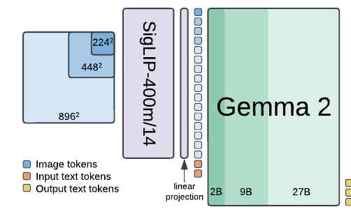
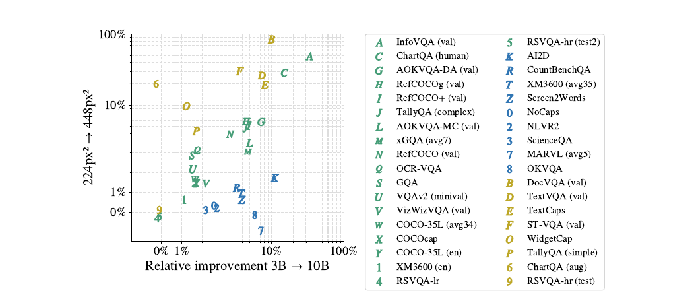
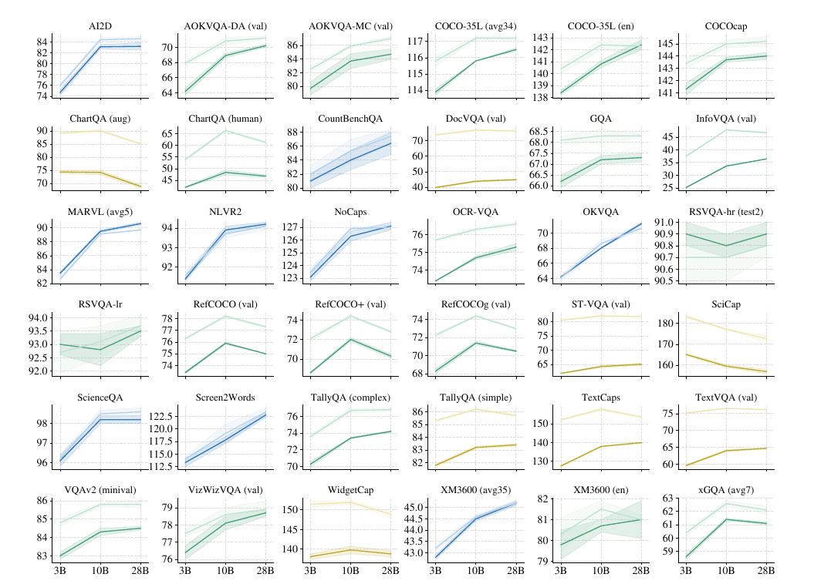
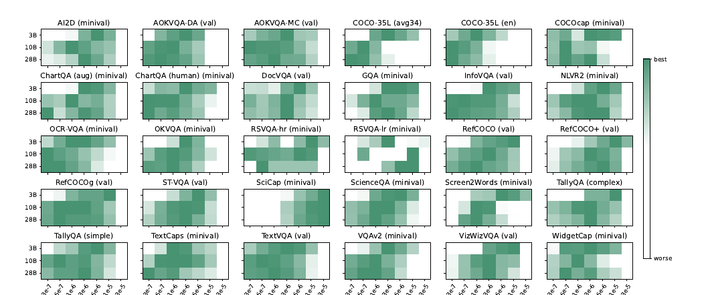

# PaliGemma 2: A Family of Versatile VLMs for Transfer

## 📋 메타 정보

| 항목 | 내용 |
|---|---|
| **논문 제목** | PaliGemma 2: A Family of Versatile VLMs for Transfer |
| **저자** | Andreas Steiner, André Susano Pinto, Michael Tschannen 외 (총 18명, Google DeepMind) |
| **공개일** | 2024-12-04 |
| **분야** | Vision-Language Model (VLM), 전이학습(transfer learning), 스케일링 분석 |
| **논문 링크** | [arXiv abstract](https://arxiv.org/abs/2412.03555) · [PDF](https://arxiv.org/pdf/2412.03555) |
| **코드/모델** | [big_vision](https://github.com/google-research/big_vision) (학습) · HF `google/paligemma2-{3b,10b,28b}-pt-{224,448,896}` · [gemma.cpp](https://github.com/google/gemma.cpp) (CPU 추론) |
| **사용한 외부 재료** | SigLIP-So400m (비전 인코더, 1편과 동일) + Gemma 2 raw 체크포인트 (2B/9B/27B, 사후 튜닝 전) |
| **전편** | [PAPER_PaliGemma.md](PAPER_PaliGemma.md) (2407.07726) — 구조·용어·레시피의 기반 |

---

## 📖 주요 용어 사전 (Glossary)

> 아키텍처 기본 용어(soft token, image token, Prefix-LM, Stage 0~3 등)는 전편과 100% 동일하므로 [PAPER_PaliGemma.md의 Glossary](PAPER_PaliGemma.md) 참조. 여기는 **2편에서 새로 등장한 용어만** 정리.

### 학습
- **logits soft-capping(로짓 소프트캐핑)**: Gemma 2의 안정화 장치. attention/출력 로짓이 너무 커지지 않게 tanh로 부드럽게 눌러주는 것. 2편에서는 Stage 1·2에서만 켜고 **Stage 3(전이)에서는 끈다** — 켜두면 일부 전이 태스크 성능이 떨어졌기 때문.
- **transfer learning rate(전이 학습률)**: Stage 3 미세조정 때 쓰는 학습률. 이 논문의 발견: **모델이 클수록 최적값이 낮아진다**.
- **distilled vs from-scratch(증류 vs 밑바닥 학습)**: Gemma 2의 2B/9B는 27B로부터 **증류**(큰 모델의 출력을 흉내 내며 학습)된 모델이고, 27B만 밑바닥부터 학습됨. 28B의 전이 부진을 설명하는 가설의 근거.
- **FSDP(Fully-Sharded Data Parallel)**: 모델 파라미터를 여러 칩에 쪼개 얹는 분산 학습 방식. TPUv5e 256~1024칩 사용.

### 평가 지표 (신규 태스크용)
- **HierText protocol**: OCR 평가 규약. 예측 박스와 정답 박스의 IoU ≥ 0.5이고 글자까지 일치해야 정답. 대소문자·구두점 정규화 없이 그대로 비교하는 엄격한 방식.
- **TEDS / GriTS**: 표 구조 인식 지표. 셀 텍스트 내용, 셀 위상(topology, 행·열 구조), 바운딩 박스 품질을 측정하는 두 지표 계열.
- **CER / SER / LER**: 악보 인식 에러율. 각각 문자(Character)/기호(Symbol)/줄(Line) 단위 에러율. 낮을수록 좋음.
- **NES(Non-Entailment Sentences)**: 긴 캡션 평가 지표. 생성 문장 중 이미지 내용과 **사실이 안 맞는 문장의 비율**(사람이 평가). 낮을수록 사실적.
- **RadGraph F1**: X-ray 판독문 평가용 임상 지표. 정답 판독문과 생성 판독문에서 각각 의학적 개체(entity)·관계를 추출해 F1으로 비교. 소견의 유무까지 반영.
- **exact match (SMILES)**: 분자 구조 인식 지표. 예측한 SMILES 문자열이 정답과 완전히 일치하는 비율.

### 신규 태스크의 표현 형식
- **SMILES**: 분자 그래프 구조를 한 줄 텍스트로 쓰는 표기법 (예: 아스피린 = `CC(=O)OC1=CC=CC=C1C(=O)O`). 분자 그림 → SMILES 변환이 태스크.
- **kern**: 악보를 텍스트로 쓰는 디지털 표기법(음높이·길이·연결·마디선 포함). 피아노 악보 이미지 → kern 변환이 태스크.
- **VSR(Visual Spatial Reasoning)**: "컵이 테이블 **왼쪽**에 있다" 같은 공간 관계 문장이 참/거짓인지 판별하는 벤치마크. 기계 생성 주석의 맹점(부정문 등)을 피하도록 설계됨.
- **DOCCI**: 이미지당 평균 7.1문장(639자)의 사람 작성 상세 묘사 데이터셋 1.5만 장. 긴 캡션 학습용.
- **MIMIC-CXR**: 흉부 X-ray 37.7만 장 + 자유 서술 판독문 데이터셋 (보스턴 Beth Israel 병원).

### 배포
- **gemma.cpp**: 구글의 경량 C++ 추론 엔진. 8비트 switched-floating-point 양자화 지원. GPU 없이 CPU만으로 추론할 때 사용.

---

## 🎯 논문 요약 (TL;DR)

**한 줄**: PaliGemma 1에서 언어모델만 Gemma 1 → Gemma 2로 갈아끼우고, 크기 3종(3B/10B/28B) × 해상도 3종(224/448/896)의 **9개 조합 모델 패밀리**를 만든 뒤 — "모델 크기를 키우는 것과 해상도를 올리는 것 중 어느 쪽이 어떤 태스크에 효과적인가?"를 통제된 환경에서 처음으로 분리 분석한 논문.

**핵심 문제**: 기존 VLM 스케일링 연구들은 서로 다른 랩의 서로 다른 아키텍처·레시피 모델을 비교했기 때문에 "크기 효과"와 "레시피 효과"가 뒤섞여 있었다. 순수하게 "LM 크기 vs 이미지 해상도"의 효과를 갈라 본 연구가 없었다.

**해결책**: 같은 재료(SigLIP-So400m + Gemma 2), 같은 레시피(1편의 3단계)로 크기·해상도만 다른 9개 모델을 만들어 30개+ 벤치마크에서 학습률만 스윕하며 비교. 마침 **해상도 한 단계 올리는 비용 ≈ LM 한 단계 키우는 비용**이라 공정한 비교가 성립.

**검증**: 태스크가 "해상도 민감(글자 읽기)" / "LM 크기 민감(추론·다국어)" / "둘 다"의 3부류로 깔끔하게 갈림을 확인. 추가로 전용 아키텍처가 지배하던 OCR·표 구조·분자·악보·X-ray 판독문에서 범용 VLM 미세조정만으로 SOTA 달성.

---

## 🔑 핵심 기여 (Contributions)

1. **모델 패밀리화**: 검증된 1편 레시피를 3크기 × 3해상도 = 9종 오픈웨이트로 확장. 1편의 drop-in replacement(그대로 갈아끼우는 대체품).
2. **통제된 스케일링 분석**: 크기·해상도만 다르고 나머지가 전부 동일한 패밀리로, 태스크 유형별 "어디에 컴퓨트를 쓸 것인가" 가이드를 최초로 제시 (§4.1).
3. **최적 전이 학습률 발견**: 모델이 클수록 최적 transfer 학습률이 낮다 — 큰 모델 미세조정 시 스윕 범위를 아래로 잡으라는 실전 팁.
4. **신규 태스크 8종 SOTA**: OCR 검출·인식, 표 구조, 분자 SMILES, 악보, 긴 캡션, 공간 추론, X-ray 판독문에서 전용 아키텍처 없이 미세조정만으로 SOTA — "복잡한 트릭 불필요" 철학의 확장 증명.
5. **온디바이스 검증**: gemma.cpp 8비트 양자화로 품질 손실 사실상 0(99.9~100.2%) 확인.

---

## 🧩 모델 구조와 학습 레시피

*왜 보나: 새로운 기술은 사실상 없고 "같은 요리, 다른 재료 하나"다. 무엇이 그대로이고 무엇이 2편 고유의 디테일인지만 구분하면 된다.*

### 0️⃣ 구조 — 1편 그대로, 입만 교체

- **눈**: SigLIP-So400m (동일) — 224/448/896px → 이미지 토큰 256/1024/4096개
- **다리**: linear projection 한 장 (동일)
- **입**: Gemma 1 (2B) → **Gemma 2 계열** ← 유일한 교체
- Prefix-LM 입력 설계, 비전 인코더 unfreeze, 데이터 믹스처(상용 VLM 출력물 미사용) 전부 동일 → 상세는 [PAPER_PaliGemma.md](PAPER_PaliGemma.md)

| 모델 | LLM | 총 파라미터 |
|---|---|---|
| PaliGemma 2 3B | Gemma 2 2B | 3.0B |
| PaliGemma 2 10B | Gemma 2 9B | 9.7B |
| PaliGemma 2 28B | Gemma 2 27B | 27.7B |

### 1️⃣ 3단계 학습 + 2편 고유 디테일

*왜 보나: 레시피 골격은 1편과 같지만, Gemma 2로 바꾸면서 생긴 조정 두 가지(soft-capping 취급, 학습률 스케일링)가 실전 미세조정에 바로 쓰이는 정보다.*

| 단계 | 내용 | 1편과의 차이 |
|---|---|---|
| **Stage 1** | SigLIP + Gemma 2 **raw 체크포인트**(사후 튜닝 전)를 붙여 10억 예제 공동 학습, 224px, 아무것도 동결 안 함 | 동일 |
| **Stage 2** | 448px 5천만 예제 → 896px 1천만 예제. 고해상도 민감 태스크(긴 OCR 등) up-weight + 출력 길이 증가 | 동일 |
| **Stage 3** | 목표 태스크 미세조정 | 동일 |

**2편 고유 디테일 두 가지**:
1. **logits soft-capping은 Stage 1·2에서만**: Gemma 2의 안정화 장치인데 Stage 3까지 켜두면 일부 전이 태스크 성적이 나빠져서 전이 시에는 끈다.
2. **학습률을 모델 크기에 반비례로**: 1편 Stage 1·2 학습률(2e-5)에 3B는 ×0.5, 10B/28B는 ×0.25.

### 2️⃣ 학습 비용 — "해상도 ↑ 비용 ≈ 크기 ↑ 비용"

*왜 보나: 이 우연한 등가성 덕분에 §4.1의 "같은 돈으로 어느 축에 투자할까?"라는 질문이 실질적 의미를 갖는다.*

예제당 상대 학습 비용 (3B@224 = 1.0 기준):

| | 224px² | 448px² | 896px² |
|---|---|---|---|
| **3B** | 1.0 | 4.6 | 23.5 |
| **10B** | 3.7 | 18.3 | 67.7 |
| **28B** | 18.9 | 63.5 | ~155.6 |

3B에서 해상도 한 단계(224→448)가 **4.6배**, 크기 한 단계(3B→10B)가 **3.7배** — 거의 같은 값이다. 하드웨어는 TPUv5e Pod (28B@896만 TPUv5p), FSDP 샤딩. 3B의 Stage 1은 256칩으로 3일(1편과 동일한 비용).

---

## 🧪 실험 1 — 핵심 분석: 모델 크기 vs 해상도, 어디에 컴퓨트를 쓸 것인가 (§4.1)

*왜 보나: 이 논문의 진짜 기여. 백본 교체보다 이 분석이 지금도 유효한 실용 가이드다.*

30개+ 벤치마크에서 3크기 × 2해상도(224/448)를 미세조정하되, 하이퍼파라미터는 1편의 최적값을 재사용하고 **학습률만** {0.03, 0.06, 0.1, 0.3, 0.6, 1.0, 3.0}·1e-5 스윕. 3B@224 기준으로 "10B로 키우기(FLOPs 3.7배)"와 "448px로 올리기(FLOPs 4.6배)"의 개선 폭을 비교했다.

### 결과: 태스크가 3부류로 갈린다

| 부류 | 대표 태스크 | 병목 |
|---|---|---|
| 🟡 **해상도 민감** | DocVQA, InfoVQA, TextVQA, ST-VQA, ChartQA, Screen2Words, WidgetCap | 원본 이미지가 애초에 224px보다 훨씬 큼 — 픽셀이 부족 |
| 🔵 **LM 크기 민감** | XM3600(다국어), AI2D, CountBenchQA, NLVR2 | 언어 이해력·세계 지식이 부족 |
| 🟢 **둘 다 도움** | 대부분의 일반 캡셔닝·VQA | — |

패턴 한 줄 요약: **"글자를 읽는" 태스크는 해상도, "생각하는" 태스크는 LM 크기.**

### 크기별 스케일링 곡선

- **3B→10B는 크게 늘지만, 10B→28B는 정체거나 미미**. 최고 성능이 목표이고 컴퓨트·지연 제약이 없을 때만 28B가 의미 있음.
- 저자들의 가설: Gemma 2의 2B/9B는 27B로부터 **증류**된 모델이고 27B만 밑바닥부터(from scratch) 학습됐기 때문에, 27B의 전이 특성이 다를 수 있다. (검증은 없이 추측으로만 남김)

### 모델이 클수록 최적 전이 학습률이 낮다 (§4.1.2)

히트맵에서 진한 색(좋은 성능)이 **대각선 패턴** — 3B → 10B → 28B로 갈수록 최적 학습률이 왼쪽(낮은 값)으로 이동한다. 또한 PaliGemma 2 3B는 1편 3B보다도 최적 전이 학습률이 낮다. **큰 모델을 미세조정할 때는 학습률 스윕 범위를 아래로 잡을 것.**

### Gemma 1 → Gemma 2 교체 자체의 효과 (§4.1.3)

같은 3B 크기·같은 해상도로 직접 비교하면 30여 개 벤치마크 평균 **+0.65점(224px) / +0.85점(448px)** — 솔직히 소폭. 이 논문의 가치는 백본 교체보다 **패밀리화 + 분석**에 있다.

---

## 🧪 실험 2 — 신규 태스크 8종: "범용 VLM 미세조정만으로 전문 모델을 이긴다"

*왜 보나: 1편의 30여 개 학술 벤치마크를 넘어, 전용 아키텍처가 지배하던 특수 도메인들에서도 같은 인터페이스("이미지 주고 텍스트 뽑기")로 통하는지 시험한 것. 전부 Stage 3 미세조정 결과다.*

| 태스크 | 데이터 | 결과 | 크기 vs 해상도 |
|---|---|---|---|
| OCR (검출+인식) | ICDAR'15, Total-Text | 3B@896이 전용 SOTA(HTS) 추월 (F1 75.9 vs 74.5 / 74.2 vs 72.4) | 해상도가 결정적, 크기는 무의미 |
| 표 구조 인식 | PubTabNet 51.6만 + FinTabNet 11.3만 | TEDS/GriTS 대부분 SOTA (FinTabNet TEDS 98.9 vs 98.2) | 해상도만 중요 |
| 분자 구조 인식 | PubChem 100만 분자 → SMILES | 정확 일치 94.8 vs MolScribe 93.8 (10B@448) | 448이면 충분 |
| 악보 인식 | GrandStaff 5.4만 장 → kern | 에러율 전 지표 절반 수준: CER 1.6 vs 3.9, SER 2.3 vs 5.1, LER 6.7 vs 13.1 (3B@896) | 해상도가 결정적 |
| 긴 캡션 생성 | DOCCI (평균 7.1문장) | 사실 불일치 문장 비율(NES) 20.3%(10B) — 10~100배 큰 데이터로 튜닝된 LLaVA-1.5(40.6%)·VILA(28.6%)보다 사실적 | 둘 다 도움 |
| 공간 추론 | VSR (참/거짓 판별) | 10B@224: zeroshot split 79.8 / random split 86.8 (인간 95.4) | 크기가 결정적, 224면 충분 |
| 흉부 X-ray 판독문 | MIMIC-CXR 37.7만 장 | RadGraph F1 29.5 SOTA (10B@896, Med-Gemini-2D 24.4 대비) | 둘 다 소폭 도움 |

§4.1의 3부류 패턴이 신규 태스크에서도 그대로 재현된다 — OCR·표·악보(글자 읽기)는 해상도, 공간 추론(생각하기)은 크기.

**기록해둘 디테일들**:
- **OCR**: 출력은 {글자, 바운딩 박스} 쌍. OCR 문헌의 태스크 전용 구조물 없이 범용 VLM 미세조정만으로 SOTA — Stage 2·3의 OCR 사전학습 덕.
- **의료 데이터 정합성 처리**: MIMIC-CXR 판독문에는 "이전 촬영 대비 호전됨" 같은 표현이 있는데 모델은 이전 X-ray를 볼 수 없다. 그래서 Gemini 1.5 Pro로 이런 언급을 **미리 제거**하고 학습 — 데이터와 모델 능력의 정합성을 맞춘 좋은 사례.
- **긴 캡션 평가**: perplexity로 후보를 고른 뒤 **사람 평가**(문장별 이미지 내용 함의 여부)를 두 라운드 돌려 선택 — NES라는 지표 자체가 사람 기반.

---

## 🧪 실험 3 — CPU 추론과 양자화 (§4.9)

*왜 보나: 온디바이스 배포까지 염두에 둔 릴리즈라는 뜻이고, "양자화 손실 사실상 0"은 배포 결정에 바로 쓰이는 수치다.*

gemma.cpp로 8비트 mixed 양자화(12.1GB → 4.0GB)한 3B@224를 5개 태스크에서 비교:

| | COCOcap | TextCaps | AI2D | OKVQA | DocVQA(val) |
|---|---|---|---|---|---|
| Jax f32 (TPU) | 140.0 | 126.3 | 75.4 | 64.0 | 39.8 |
| gemma.cpp 양자화 (CPU) | 139.8 | 126.6 | 75.6 | 64.1 | 39.8 |
| 상대 품질 | 99.9% | 100.2% | 100.1% | 100.1% | 99.9% |

속도(3B@224, 260토큰 prefill): AMD Genoa 32스레드 기준 **prefill 323 토큰/초, 디코딩 41 토큰/초**. Apple M1 Max 4스레드로도 prefill 32 토큰/초.

---

## 🧭 평가와 한계

**강점**
- 진짜 기여는 "controlled scaling 분석". 같은 레시피로 크기·해상도만 바꾼 모델 패밀리는 이 논문 이전에 없었고, "해상도 비용 ≈ 크기 비용이니 태스크 유형 보고 골라라"는 실용 가이드는 지금도 유효.
- 전용 아키텍처 없이 미세조정만으로 OCR·표·악보·의료 SOTA — 1편의 "복잡한 트릭 불필요" 철학의 확장 증명.

**한계**
- 신규 태스크 결과는 전부 태스크별 미세조정 — 요즘 기준의 범용 instruction-tuned 모델(제로샷으로 다 하는)과는 사용 방식이 다르다. 어디까지나 **transfer용 베이스 모델**.
- 28B의 전이 부진 원인(distilled vs from-scratch 가설)은 검증 없이 추측으로만 남음.
- Gemma 2 교체 자체의 이득(+0.65~0.85점)은 미미 — "업그레이드"라기보다 "패밀리화"가 본질.

**계보**: PaliGemma 1 (transfer 베이스 철학 검증) → **PaliGemma 2 (패밀리화 + 크기/해상도 분해 분석)** → Gemma 3의 비전 파트가 이 계열의 인코더 구성을 계승. "어떤 태스크가 해상도에 민감한가"라는 질문 프레임은 이후 Qwen2.5-VL류 native-resolution VLM들이 등장한 배경 문제이기도 하다.

---

## 💬 Q&A 섹션

### Q1. PaliGemma 1과의 차이점을 비교 테이블로 보여줘

**먼저, 안 바뀐 것 (공통 뼈대)** — 두 세대는 "같은 요리, 다른 재료 하나":

- **눈**: SigLIP-So400m (ViT, 14×14 패치)
- **다리**: linear projection 한 장
- **입력 설계**: Prefix-LM (이미지+질문은 서로 자유롭게 보고, 손실은 정답에만)
- **학습 레시피**: Stage 0(공개 체크포인트 재사용) → Stage 1(10억 예제, 224px) → Stage 2(448px 5천만 → 896px 1천만) → Stage 3(과제별 전이)
- **비전 인코더 unfreeze** + 데이터 믹스처(상용 VLM 출력물 미사용)
- **이미지 토큰 수**: 224px→256개, 448px→1024개, 896px→4096개
- **위치**: 챗봇이 아닌 transfer용 베이스 모델
- HF에서도 `PaliGemmaForConditionalGeneration` 공통 클래스로 두 세대 모두 지원

**차이점 비교표**:

| 항목 | PaliGemma 1 (2407.07726) | PaliGemma 2 (2412.03555) |
|---|---|---|
| **언어 백본 (입)** | Gemma 1 (2B) | **Gemma 2 (2B / 9B / 27B)** |
| **모델 크기** | 3B 단일 | **3B / 10B / 28B 패밀리** |
| **배포 조합** | 1 크기 × 3 해상도 = 3종 | **3 크기 × 3 해상도 = 9종** |
| **logits soft-capping** | 해당 없음 (Gemma 1에 없는 장치) | Stage 1·2에서만 켜고 **Stage 3에서는 끔** |
| **학습률 조정** | 기준 학습률 (Stage 1·2에서 2e-5) | 크기에 반비례: 1편 대비 **3B ×0.5, 10B/28B ×0.25** |
| **논문의 핵심 기여** | "선형 프로젝션+Prefix-LM+unfreeze면 충분" — 설계 검증 | **크기 vs 해상도 효과 분리 분석** — 통제된 스케일링 연구 |
| **커버 태스크** | 학술 벤치마크 30여 개 | 30여 개 + **신규 8종** (→ 실험 2 참조) |
| **하드웨어** | TPUv5e | TPUv5e (28B@896만 TPUv5p) |
| **온디바이스** | 다루지 않음 | **gemma.cpp 8비트 양자화** — 품질 손실 사실상 0 (→ 실험 3 참조) |

**성능은 얼마나 좋아졌나**:

| 비교 | 결과 |
|---|---|
| 같은 크기(3B)·같은 해상도 직접 비교 | 평균 +0.65점(224px) / +0.85점(448px) — 소폭 (→ 실험 1의 §4.1.3) |
| 크기를 키웠을 때 (3B→10B) | 대부분 태스크에서 뚜렷한 향상 |
| 더 키웠을 때 (10B→28B) | 정체 또는 미미 (→ 실험 1의 distill 가설) |

즉 **백본 교체 자체의 이득은 작고**, 진짜 가치는 (1) 10B라는 실용적인 상위 옵션이 생긴 것, (2) "글자 읽는 태스크는 해상도에, 생각하는 태스크는 LM 크기에 투자하라"는 태스크별 가이드가 생긴 것.

**실전 선택 기준으로 요약하면**:
- **1편 3B를 쓰던 자리** → 2편 3B로 그대로 교체 (drop-in, 약간 이득 + 최적 학습률이 더 낮아졌으니 스윕 범위만 아래로)
- **컴퓨트 여유가 있고 추론·다국어가 병목** → 10B로 상향 (28B는 가성비 낮음)
- **OCR·문서·표처럼 밀집 텍스트가 병목** → 크기 말고 해상도를 448→896으로 상향

---

## 🧾 한 줄 요약 (전체)

PaliGemma 2는 검증된 1편 레시피에서 입(LM)만 Gemma 2로 바꿔 3크기 × 3해상도 패밀리를 만든 뒤, "글자를 읽는 태스크는 해상도에, 생각하는 태스크는 LM 크기에 컴퓨트를 써라"는 태스크별 스케일링 가이드를 통제 실험으로 처음 제시하고, 그 김에 OCR·표·분자·악보·X-ray 판독문까지 미세조정만으로 SOTA를 찍은 "패밀리화 + 분석" 논문이다.

---

## 🔗 관련 메모리 링크

- [[paper-paligemma]] — 전편. 구조·용어·레시피·HF 사용법의 기반 문서 ([PAPER_PaliGemma.md](PAPER_PaliGemma.md))
- [[paper-gemma-3]] — 후속 세대. 비전 파트가 PaliGemma 계열 구성을 계승
- [[reference-pretrained-backbone-reuse-landscape]] — 사전학습 백본 재사용 분기 분류
