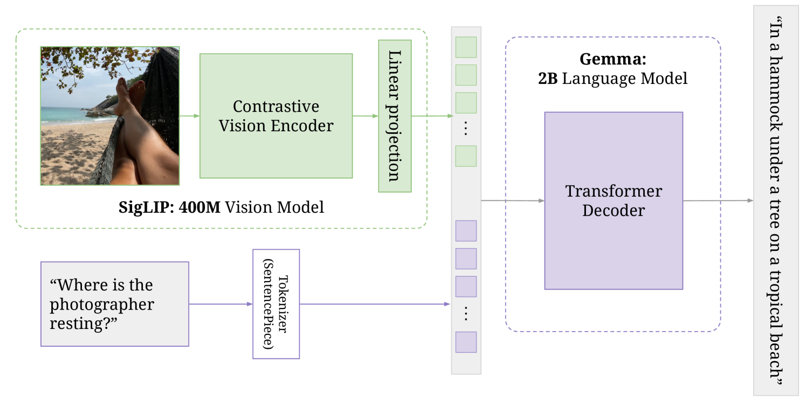
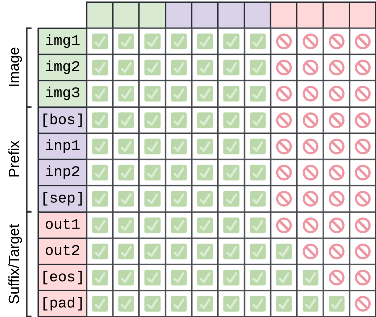

# PaliGemma: A versatile 3B VLM for transfer

## 📋 메타 정보

| 항목 | 내용 |
|---|---|
| **제목** | PaliGemma: A versatile 3B VLM for transfer |
| **소속** | Google Research / Google DeepMind (Lucas Beyer, Andreas Steiner, André Susano Pinto, Alexander Kolesnikov 외 다수) |
| **공개일** | 2024-07-10 (v1) · 2024-10-10 (v2, Appendix H·I 추가) |
| **분야** | VLM(Vision-Language Model, 비전-언어 모델) — 이미지+텍스트를 받아 텍스트를 뱉는 **미세조정(transfer)용 베이스 모델** |
| **arXiv** | [abs](https://arxiv.org/abs/2407.07726) · [html](https://arxiv.org/html/2407.07726v2) |
| **공식 자료** | [HF 블로그](https://huggingface.co/blog/paligemma) · [Google 아키텍처 해설](https://developers.googleblog.com/ko/gemma-explained-paligemma-architecture/) · [HF transformers 문서](https://huggingface.co/docs/transformers/ko/model_doc/paligemma) |
| **선행 논문** | PaLI-3 (구조·학습 레시피 계승), SigLIP, Gemma |
| **외부 모델/데이터** | SigLIP-So400m(비전 인코더) · Gemma-2B(언어 모델) · WebLI·CC3M-35L 등 사전학습 데이터 |

---

## 📖 주요 용어 사전 (Glossary)

### 아키텍처
- **VLM (Vision-Language Model, 비전-언어 모델)**: 이미지와 텍스트를 함께 입력받아 텍스트를 출력하는 모델. PaliGemma는 그중에서도 **챗봇이 아니라 "베이스 모델"** — 그대로 쓰기보다 특정 과제에 미세조정(fine-tune)해서 쓰도록 설계됨.
- **SigLIP-So400m**: 구글이 공개한 이미지 인코더(image encoder). 이미지를 14×14 픽셀 조각(patch, 패치)으로 잘라 각 조각을 "의미 있는 벡터"로 바꿈. `So400m`은 약 4억 파라미터짜리 shape-optimized ViT라는 뜻. PaliGemma의 "눈".
- **Gemma-2B**: 구글이 공개한 20억 파라미터 언어 모델(language model). decoder 18층. PaliGemma의 "입".
- **linear projection(선형 프로젝션)**: SigLIP이 뱉은 이미지 벡터를 Gemma가 알아듣는 차원(2048)으로 바꿔주는 **행렬 곱 한 번짜리 연결부**. PaliGemma의 눈과 입을 잇는 유일한 다리 — 복잡한 융합 장치를 일부러 안 씀.
- **soft token(소프트 토큰)**: 사전(vocabulary)에 있는 딱 떨어지는 단어 토큰이 아니라, 인코더가 만든 **연속 벡터** 형태의 토큰. 이미지 패치들이 이 형태로 언어 모델에 들어감.
- **image token(이미지 토큰)**: 이미지가 변환된 soft token들. 해상도에 따라 **224px→256개, 448px→1024개, 896px→4096개**로 개수가 고정됨.

### 핵심 개념
- **transfer(전이, 미세조정)**: 사전학습된 베이스 모델을 특정 downstream 과제(캡셔닝·VQA·검출 등)에 맞게 다시 학습시키는 것. PaliGemma의 존재 이유가 "어떤 과제로든 transfer가 잘 되는 것".
- **prefix / suffix(프리픽스 / 서픽스)**: 입력을 두 부분으로 나눈 이름. **prefix = 이미지 + 질문(모델에게 주어지는 부분)**, **suffix = 정답(모델이 생성해야 하는 부분)**.
- **Prefix-LM(프리픽스 언어모델)**: prefix에는 양방향(bidirectional) 어텐션을, suffix에는 한 방향(autoregressive) 어텐션을 쓰는 방식. 아래 [2️⃣](#2️⃣-입력-배열과-어텐션--이-논문의-핵심-설계) 참조.
- **full/bidirectional attention(전체·양방향 어텐션)**: 토큰이 앞뒤 가리지 않고 시퀀스의 모든 토큰을 볼 수 있는 것. 이미지·질문에 적용.
- **causal/autoregressive attention(인과·자기회귀 어텐션)**: 각 토큰이 자기보다 앞에 있는 토큰만 볼 수 있는 것. 일반 LLM의 "다음 단어 예측" 방식. 정답(suffix) 생성에 적용.
- **loc / seg token(위치·분할 토큰)**: Gemma 사전에 **추가로 붙인** 특수 토큰. `<loc0000>`~`<loc1023>`(1024개)는 바운딩 박스 좌표, `<seg000>`~`<seg127>`(128개)는 분할 마스크 코드. 덕분에 객체 검출·분할을 **별도 헤드 없이 "글자 뱉듯" 텍스트 생성**으로 처리.

### 학습 단계
- **Stage 0 (unimodal pretraining, 단일모달 사전학습)**: 눈(SigLIP)과 입(Gemma)을 **따로따로** 사전학습하는 단계. PaliGemma는 이미 공개된 것을 그대로 가져다 씀(새로 안 함).
- **Stage 1 (multimodal pretraining, 멀티모달 사전학습)**: 눈+입을 붙여 대규모 vision-language 데이터로 통째 학습. 가장 긴 단계(10억 예제).
- **Stage 2 (resolution increase, 해상도 올리기)**: 224px 모델을 448px·896px로 이어서 학습.
- **Stage 3 (transfer, 전이)**: 특정 과제에 미세조정. 사용자가 실제로 하는 단계.

### 비교/평가
- **frozen vs unfrozen(얼림 vs 안 얼림)**: 학습 중 비전 인코더의 가중치를 고정(frozen)하느냐 같이 학습(unfrozen)하느냐. PaliGemma는 관례를 깨고 **안 얼림**.
- **perplexity(펄플렉시티)**: 언어 모델이 정답을 얼마나 헷갈려 하는지 나타내는 지표. 낮을수록 좋음. ablation에서 성능 대용치로 자주 쓰임.

---

## 🎯 논문 요약 (TL;DR)

**한 줄**: 이미 잘 만들어진 **눈(SigLIP)과 입(Gemma)을 선형 레이어 한 장**으로만 붙인 3B VLM. 자체 성능 자랑이 아니라 **"어떤 시각 과제로든 미세조정하면 잘 옮겨 붙는(transfer) 베이스 모델"**을 목표로, 40여 종 과제에서 이를 실증.

**핵심 문제**: 많은 VLM이 복잡한 융합 구조·거대한 규모·상용 모델 증류 데이터에 의존한다. 그런데 무엇이 정말 중요한지는 불투명하다. 저자들은 "**검증된 부품 + 최소 연결 + 정직한 레시피**"만으로 얼마나 갈 수 있는지를 묻는다.

**해결책**: (1) 연결부는 **선형 프로젝션 한 장**. (2) 입력 전체(이미지+질문)는 서로 자유롭게 보게 하고(Prefix-LM), 손실은 **정답 부분에만** 건다. (3) 관례와 달리 비전 인코더를 **안 얼리되**, 초반엔 인코더 학습률만 천천히 워밍업해 망가짐을 막는다. (4) 사전학습에 **상용 VLM 출력물을 쓰지 않는다**.

**검증**: 캡셔닝·VQA·객체 검출·분할·문서 이해·원격탐사 등 거의 40개 과제로 transfer해 강한 성능. 더 중요한 건 "무엇이 중요하고 무엇이 안 중요한지"를 **대규모 ablation 표**로 정직하게 정리한 것.

---

## 🔑 핵심 기여 (Contributions)

1. **미니멀 레시피 실증**: SigLIP + 선형 프로젝션 + Gemma라는 극단적으로 단순한 구조로도 3B급에서 40여 과제 강한 transfer가 가능함을 보임.
2. **"복잡한 트릭이 사실 불필요"의 ablation 증명**: 선형 vs MLP 연결부, 똑똑한 토큰 초기화, 마스킹 전략 등에서 **복잡한 쪽이 이득 없음**을 실험으로 못박음(아래 [4️⃣](#4️⃣-핵심-ablation-발견)).
3. **비전 인코더 unfreeze**: 관례(얼리기)를 깨고 인코더를 같이 학습시키되 학습률 워밍업으로 안정화. 공간 추론 과제에서 이득.
4. **detection·segmentation을 텍스트 생성으로 통합**: loc/seg 토큰을 사전에 추가해 별도 헤드 없이 좌표·마스크를 생성.
5. **오염 없는 사전학습**: 어떤 사전학습 과제도 더 큰 상용 VLM의 출력이 아님 — 증류(distillation) 없이 만든 정직한 베이스.

---

## 🧩 주요 알고리즘 설명

### 0️⃣ 전체 구조 — 눈 + 다리 한 장 + 입

*왜 보나: PaliGemma의 모든 설계 판단은 "부품은 검증된 것을 쓰고, 연결은 최대한 단순하게"라는 한 문장에서 나온다. 이 그림을 먼저 머리에 넣어야 나머지가 다 따라온다.*



> **논문 Fig 1** — "SigLIP 이미지 인코더가 Gemma 디코더 LM으로 흘러들어간다." 위쪽 초록 경로가 이미지, 아래쪽 보라 경로가 텍스트다. 구체 예시로 흐름을 따라가면:
> - **위(눈)**: 해먹 사진 → `SigLIP: 400M Vision Model`의 Contrastive Vision Encoder → `Linear projection` → 초록 토큰들(이미지 토큰).
> - **아래(질문)**: "Where is the photographer resting?" → `Tokenizer(SentencePiece)` → 보라 토큰들(텍스트 토큰).
> - **합류**: 초록(이미지) + 보라(텍스트) 토큰을 한 줄로 이어 `Gemma: 2B Language Model`의 Transformer Decoder에 통째로 넣음 → 정답 생성: *"In a hammock under a tree on a tropical beach"*.

데이터 흐름은 왼쪽에서 오른쪽으로 딱 세 단계다.

1. **눈**: 입력 이미지를 **SigLIP-So400m(ViT)**에 넣는다. 이미지는 14×14 픽셀 패치로 잘려(224px면 16×16=256조각) 각 조각이 soft token 벡터가 된다.
2. **다리**: 그 벡터들을 **linear projection(선형 프로젝션)** 한 장으로 Gemma 차원(2048)에 맞춘다. — 이게 눈과 입을 잇는 유일한 장치다. (Fig 1에서 초록 인코더와 보라 디코더를 잇는 유일한 초록 블록)
3. **입**: 이미지 토큰 뒤에 텍스트 프롬프트 토큰을 이어 붙여 **Gemma-2B**에 통째로 넣고, 정답 텍스트를 생성한다.

사전(vocabulary)은 Gemma 원본 256,000개에 loc 토큰 1,024개 + seg 토큰 128개를 더해 **257,152개**로 확장했다(문서에 따라 257,216 표기도 있음 — VQ-VAE 코드 토큰 포함 여부 차이).

### 1️⃣ 입력 배열과 어텐션 — 이 논문의 핵심 설계

*왜 보나: 이미지는 글자와 달리 "순서"가 없다. 왼쪽 위 패치가 오른쪽 아래 패치를 못 보게 막을 이유가 없는데, 일반 LLM처럼 causal하게 처리하면 이 자유를 스스로 버리는 셈이다. PaliGemma는 이 지점을 정확히 건드린다.*

**토큰이 들어가는 순서**:

```
[이미지 토큰들] → BOS → [prefix: 질문] → SEP → [suffix: 정답] → EOS → PAD...
```

**어텐션 마스크를 두 구역으로 나눈다 (Prefix-LM 방식)**:

| 구역 | 무엇 | 어텐션 | 이유 |
|---|---|---|---|
| **이미지 + prefix(질문)** | 모델에게 주어지는 입력 | **full/bidirectional(전체·양방향)** | 이미지엔 순서가 없고, 질문도 이미지 전체를 봐야 하므로 서로 자유롭게 보게 풂 |
| **suffix(정답)** | 모델이 생성하는 출력 | **causal/autoregressive(앞쪽만)** | 실제 생성은 한 토큰씩 앞만 보고 진행해야 하므로 |

그리고 **손실(loss)은 suffix(정답)에만** 건다.

> **쉬운 비유**: 시험 문제(이미지+질문)는 학생이 이리저리 훑어봐도 되지만, 답안(정답)은 앞 글자부터 한 자씩 채워 나가야 하고, 채점(loss)도 답안에만 한다.

이 마스킹을 논문 Fig 2가 행렬로 보여준다.



> **논문 Fig 2 읽는 법** — **행 = "누가 본다(query)", 열 = "무엇을 본다(key)"**. 초록 체크 = 볼 수 있음, 빨강 금지 = 못 봄. 위쪽 색띠가 구역을 표시(초록=Image, 보라=Prefix, 분홍=Suffix/Target). 토큰 순서는 `img1·img2·img3`(이미지) → `[bos]·inp1·inp2·[sep]`(프리픽스) → `out1·out2·[eos]·[pad]`(서픽스).
>
> 두 덩어리로 나뉜다:
> - **위 7행 (이미지 + 프리픽스)**: 앞 7열(이미지+프리픽스)이 **전부 초록 체크** = 서로 자유롭게 봄(양방향). 반면 뒤 4열(서픽스)은 **전부 빨강 금지** = 아직 안 만들어진 정답은 못 봄. → 입력끼리는 **block/bidirectional attention**.
> - **아래 4행 (서픽스/정답)**: 앞 7열(이미지+프리픽스)은 다 보고, 서픽스 안에서는 **자기 자신까지만 보고 그 뒤는 빨강** = 계단식 대각선. → 정답은 **autoregressive attention**(한 토큰씩 앞만).
>
> 즉 왼쪽 위 7×7 블록은 꽉 찬 사각형(양방향), 오른쪽 아래 서픽스는 삼각형(인과). 이 한 장이 Prefix-LM의 정의다.

ablation 결론: **Prefix-LM > 완전 autoregressive**, **loss를 정답에만 거는 것 > prefix에까지 거는 것**.

### 2️⃣ 4단계 학습 레시피

*왜 보나: PaliGemma의 "versatile(범용성)"은 구조가 아니라 이 학습 순서에서 나온다. 특히 해상도를 나중에 따로 올리는 게 핵심.*

| 단계 | 무엇을 | 규모/설정 |
|---|---|---|
| **Stage 0** 단일모달 사전학습 | 눈·입을 따로 사전학습 | 공개된 SigLIP·Gemma **그대로 사용**(새로 안 함) |
| **Stage 1** 멀티모달 사전학습 | 붙여서 통째 학습 (가장 긴 단계) | **10억 예제**, 224px, 시퀀스 길이 128 |
| **Stage 2** 해상도 올리기 | 224 체크포인트를 이어 고해상도로 | 448px(**5천만** 예제) / 896px(**1천만** 예제), 시퀀스 512, OCR·검출·분할 등 고해상도 민감 과제 up-weight |
| **Stage 3** 전이(transfer) | 특정 과제에 미세조정 | 과제별 1~100 에폭, 전 파라미터 학습 |

**Stage 3 하이퍼파라미터 중요도 순서**(논문 명시): 해상도(224/448/896) > 에폭 수 > 학습률(3e-5~3e-6) > label smoothing > dropout > weight decay > 비전 인코더 freeze 여부.

### 3️⃣ 비전 인코더를 안 얼린다(unfreeze)

*왜 이렇게 하나: 대부분의 VLM은 눈을 얼려 안정성을 챙기는데, PaliGemma는 "눈도 언어 목적으로 더 배울 게 있다"고 봤다.*

- 처음부터 **모든 부품을 함께 학습**. 단, 초반에 그래디언트가 어긋나 눈이 망가지지 않도록 **비전 인코더만 학습률을 천천히 워밍업**.
- ablation 결과: 전이 후 **최종 점수는 얼리든 안 얼리든 큰 차이 없음**. 그러나 **공간 추론(위치·관계) 과제의 perplexity는 눈을 학습시킬 때 확실히 좋아짐**.
- 해석: captioning 목적이 인코더에게 "관계 이해"를 가르친다는 최근 연구와 맞물림.

---

## 4️⃣ 핵심 ablation 발견

*왜 보나: 이 논문의 진짜 기여는 새 구조가 아니라 "무엇이 중요하고 무엇이 안 중요한지"의 정직한 실험표다. 아래는 그중 실무에 바로 쓸 수 있는 것들.*

| 실험 | 발견 | 실무 시사점 |
|---|---|---|
| **연결부: Linear vs MLP** | 평균 전이 점수 **77.2 vs 77.1** — 사실상 동일 | 연결부를 복잡하게 만들 이유 없음. 선형이면 충분 |
| **새 토큰 초기화** | AvgEmb(기존 임베딩 평균+노이즈)는 **시작 perplexity만 좋고 1000 step 뒤 이점 소멸**. 표준 초기화(σ=0.02)가 Stage1 종료 시 더 좋음 | loc/seg 토큰은 그냥 랜덤 초기화 |
| **마스킹 전략** | Prefix-LM > 완전 autoregressive. loss는 정답에만 | [1️⃣](#1️⃣-입력-배열과-어텐션--이-논문의-핵심-설계) 참조 |
| **Stage 1 길이** | 통째 생략은 **재앙**. 단 ablation용으론 1억 예제(10배 단축)면 큰 손해 없음 | 멀티모달 사전학습은 필수, 길이는 타협 가능 |
| **해상도의 효과** | 좋아지는 이유가 "이미지 정보량" 절반 + "토큰이 길어져 모델 용량↑" 절반 | 해상도↑는 순수 화질만의 문제가 아님 |
| **해상도별 체크포인트** | 448 모델을 224로 억지 전이하면 성능 급락 | **224/448/896을 각각 배포**하는 이유 |
| **windowing** | 이미지를 창으로 쪼개 처리하면 학습 최대 5%만 빨라지고 성능은 더 나쁨 | 고해상도 체크포인트 없을 때만 차선책 |
| **인코더 자체 제거** | raw 패치만 쓰면 현재는 크게 뒤지나 **사전학습 길이 스케일링은 유망** | 인코더 없는 방향의 가능성 언급 |
| **상용 VLM 증류 데이터** | **일절 안 씀** — 사전학습 과제 중 어느 것도 큰 상용 VLM 출력이 아님 | 재현·라이선스 면에서 깨끗 |

**transfer 안정성**: 5회 전이 표준편차 대부분 0.5 미만. 소량 데이터로도 강함 — **4,000개 예제로 풀데이터 점수의 10% 이내, 256개로 20% 이내** 도달.

---

## 🧪 실험 요약

*왜 보나: "그래서 얼마나 범용적인가"를 한눈에.*

- **평가 범위**: 표준 VLM 벤치마크(캡셔닝·VQA·문서/차트 이해 등) + **원격탐사(remote-sensing)·분할(segmentation)** 같은 특수 과제 포함 **거의 40개**.
- **핵심 메시지**: 3B라는 작은 규모로 다양한 과제에서 강한 transfer 달성. "큰 모델만이 답은 아니다"의 실증.
- **후속**: PaliGemma 2(2024-12)는 언어 백본을 Gemma 2(2B/9B/27B)로 확장하고 해상도/규모 조합을 넓힘. HF `PaliGemmaForConditionalGeneration`은 두 세대를 공통 클래스로 지원.

---

## 💬 Q&A 섹션

### Q1. 왜 "챗봇"이 아니라 "베이스 모델"이라고 강조하나?

PaliGemma는 대화형으로 튜닝돼 있지 않다. 그대로 던지면 어정쩡하지만, **내 과제(캡셔닝·VQA·검출·분할·문서 이해 등)에 미세조정하면 진짜 성능이 나온다**. 그래서 논문 부제도 "for **transfer**". 그나마 범용으로 쓰려면 `mix` 체크포인트를 쓰되, 최고 성능은 언제나 파인튜닝 후에 나온다.

### Q2. 이미지 토큰은 몇 개고, 왜 해상도별로 모델을 따로 배포하나?

이미지 토큰 개수는 **해상도에 따라 고정**: 224px→256, 448px→1024, 896px→4096. ablation에서 448 체크포인트를 224로 억지 전이하면 성능이 급락했기 때문에(§4), 해상도마다 **네이티브로 학습한 별도 체크포인트**를 제공한다. HF에서도 `-224`/`-448`/`-896`으로 나뉜다.

### Q3. detection·segmentation을 어떻게 텍스트 생성만으로 하나?

Gemma 사전에 좌표용 loc 토큰 1,024개와 마스크용 seg 토큰 128개를 추가했다. 그래서 "고양이 위치"를 물으면 모델이 `<loc0512><loc0128>...` 같은 **토큰을 글자처럼 뱉고**, 이를 좌표/마스크로 되돌린다. 별도 검출 헤드가 필요 없다.

### Q4. HuggingFace로 파인튜닝할 때 정답은 어떻게 넣나?

프로세서에 정답을 `suffix` 인자로 넘기면 된다. 그러면 프로세서가 알아서 `labels`를 만들어 주고(정답 부분에만 loss가 걸리는 §1️⃣ 설계와 정확히 대응), 이미지·질문(prefix)에는 loss가 안 걸린다.

```python
from transformers import AutoProcessor, PaliGemmaForConditionalGeneration

processor = AutoProcessor.from_pretrained("google/paligemma-3b-mix-224")
inputs = processor(images=raw_image, text="What is on the flower?",
                   suffix="a bee", return_tensors="pt")  # suffix=정답 → labels 자동 생성
```

### Q5. 우리 메모리에 있는 다른 논문들과 어떤 관계인가?

같은 "미니멀·정직한 baseline" 계열이다. **[[paper_tuna_2]]**(TUNA-2)의 "인코더 유무가 scale에서 갈린다(crossover)"는 관찰은 PaliGemma의 "인코더 제거는 지금은 뒤지나 스케일링은 유망"과 직접 연결된다. **[[paper_i1]]**·**[[paper_minit2i]]**의 "복잡한 트릭 없이 공개 재료로 정직하게"라는 철학, 그리고 연결부·초기화 복잡도가 무의미하다는 결론도 겹친다. 백본은 **[[paper_gemma_3]]**·**[[paper_gemma_4]]** 계열 Gemma를 언어부로 쓴다.

### Q6. Gemma 3 · Gemma 4와는 뭐가 다른가?

먼저 헷갈리기 쉬운 **큰 틀**부터. 셋은 "같은 급"이 아니다.

- **PaliGemma**는 눈(SigLIP)을 **Gemma "1"에 붙인 VLM**이다. 언어부가 구세대다.
- **Gemma 3 / Gemma 4**는 애초에 **base LLM 자체가 세대를 거듭하며 멀티모달로 진화**한 계보다.

즉 PaliGemma는 "Gemma를 **재료로 쓴** 응용 모델"이고, Gemma 3/4는 "그 재료의 **다음 세대**"다. 방향도 정반대 — PaliGemma는 *성능보다 "잘 옮겨 붙는(transfer) 베이스"*가 목표라 일부러 덜어냈고, Gemma 3/4는 *범용 LLM으로서 효율·성능*을 파고들었다.

| 항목 | **PaliGemma** | **Gemma 3** | **Gemma 4** |
|---|---|---|---|
| **정체성** | VLM (transfer용 베이스) | 범용 멀티모달 LLM | 범용 멀티모달 LLM |
| **공개** | 2024-07 (2407.07726) | 2025-03 (2503.19786) | 2026-07 (2607.02770) |
| **규모** | 3B 고정 | 1B·4B·12B·27B | 다중 크기(멀티모달) |
| **언어 백본** | **Gemma 1 (2B)** | Gemma 3 자체 | Gemma 4 자체 |
| **비전 처리** | **별도 인코더**(SigLIP-So400m) + 선형 다리 | 별도 인코더(SigLIP 계열) | **12B는 encoder-free**(인코더 없이 직접, 단 ablation 없음) |
| **주력 설계 목표** | "복잡한 트릭 불필요"의 **미니멀·transfer** | **KV 캐시 절감**(local:global 5:1, sw=1024 → 오버헤드 60%→15%) | **KV 캐시 추가 절감**(values=keys + pp-RoPE p=0.25 → global KV −37.5%) |
| **어텐션 특이점** | **Prefix-LM**(이미지+질문=양방향, 정답=causal, loss는 정답에만) | local/global 층 5:1 교대 | key와 value 공유 + 부분 회전 RoPE |
| **채팅** | ❌ (파인튜닝 전제) | ✅ instruction-tuned 제공 | ✅ instruction-tuned 제공 |
| **학습 공개도** | 레시피·ablation 매우 상세 | distillation 등 상당 공개 | **distillation·토큰수·RL 침묵**(릴리즈 노트 성격) |
| **라이선스** | Gemma 라이선스 | Gemma 라이선스 | **Apache 2.0로 전환** |

**한눈에 정리**:

- **비전 붙이는 철학이 정반대로 수렴**: PaliGemma는 "검증된 인코더를 그냥 붙이자"(SigLIP + 선형), Gemma 4의 12B는 반대로 "인코더를 아예 없애자"(encoder-free). [[paper_tuna_2]]의 crossover 논쟁과 같은 축.
- **PaliGemma만 어텐션이 "품질용", Gemma 3/4는 "효율용"**: PaliGemma의 Prefix-LM은 이미지 이해를 위한 설계이고, Gemma 3/4의 어텐션 트릭(local:global, values=keys)은 순전히 **KV 캐시 메모리 줄이기**가 목적. 노리는 게 다르다.
- **투명성 곡선이 거꾸로**: PaliGemma·Gemma 3는 실험을 상세히 공개했는데, Gemma 4는 핵심 학습 디테일에 침묵(릴리즈 노트 성격) 대신 라이선스만 Apache 2.0으로 개방.

### Q7. 파인튜닝할 때 Gemma 3 소형 모델이 PaliGemma보다 낫지 않나?

반은 맞고 반은 아니다 — "무조건 낫다"는 아니고 **과제 종류가 갈림길**이다. Gemma 3가 더 최신·강한 백본이라 유리해 보이지만, 함정은 **PaliGemma는 처음부터 "파인튜닝 잘 되라고" 만든 베이스**이고 Gemma 3는 **범용 챗봇으로 튜닝된** 모델이라는 점. 좁은 과제에 붙일 때 이 차이가 크게 작용한다.

| 파인튜닝 대상 과제 | 어느 쪽이 유리 | 이유 |
|---|---|---|
| **객체 검출 / 분할 / 참조 표현** | **PaliGemma** ✅ | loc/seg 토큰 내장 + 검출·분할 사전학습. Gemma 3엔 이 장치가 없음 |
| **OCR / 문서·차트 이해 (밀집 텍스트)** | **PaliGemma** ✅ | 896px 고해상도 네이티브 + OCR 사전학습 |
| **좁고 반복적인 프로덕션 과제** (영수증→JSON 등) | **PaliGemma** ✅ | 단일 과제 워크호스로 설계, 3B로 효율적, transfer 안정성 높음 |
| **일반 시각 QA / 추론 / 세상 지식** | **Gemma 3** ✅ | 언어 백본이 Gemma 1보다 압도적으로 강함 |
| **다중 턴 대화 / instruction following** | **Gemma 3** ✅ | 이미 챗 튜닝됨. PaliGemma는 챗 아님 |
| **"모델 하나로 여러 잡무" 범용** | **Gemma 3** ✅ | 범용성이 목적 |

**결론**: 좌표·마스크·OCR·문서처럼 "위치와 밀집 픽셀"이 핵심인 특화 과제 → **PaliGemma가 여전히 유리하거나 대등**(최신 백본이라고 이길 수 있는 영역이 아님). 추론·지식·대화·범용성 → **Gemma 3 소형(1B/4B)**. 한 가지 더, 공정한 비교는 **PaliGemma 2**(후속작이 백본을 Gemma 2로 올려 "백본 낡음" 약점을 상당 부분 해소).

### Q8. 챗봇과 instruct용은 다른가?

개념적으로는 층위가 다르지만, **요즘 실무에선 거의 같은 걸 가리킨다.**

| 단계 | 뭘 배웠나 | 던지면 나오는 반응 |
|---|---|---|
| **Base (pretrained, 사전학습)** | "다음 단어 맞히기"만 함 | "대한민국의 수도는?" → 질문을 이어 쓰기만 하고 답을 안 함 |
| **Instruct (지시 튜닝, SFT)** | "명령→답" 쌍으로 학습 | "대한민국의 수도는?" → "서울입니다." (시키면 함) |
| **Chat (대화 튜닝)** | 위 + 여러 턴 대화 + 사람 선호 학습(RLHF/DPO) | 앞 대화 기억, 말투·거절·안전까지 챙김 |

- **Instruct** = "한 번의 명령을 잘 따르기"가 초점.
- **Chat** = 거기에 "여러 턴 대화 + 페르소나 + 안전성"까지 얹음(system/user/assistant 역할 템플릿).

**하지만 실무에선 안 나눈다**: instruct 모델을 만들 때 대화·선호 학습을 같이 넣어서 "instruct = chat"으로 나오는 경우가 대부분. **Gemma의 `-it`(instruction tuned) = 그게 곧 챗 모델**이다(별도 chat 버전 없음). Llama `Instruct`, Qwen `Instruct`도 마찬가지.

이 대화 맥락 대입: PaliGemma = **Base에 가까운 transfer 베이스**(instruct도 chat도 아님 → 파인튜닝 필수), Gemma 3/4의 `-it` = instruct(=chat) 버전. 그래서 파인튜닝 관점의 진짜 갈림은 "챗이냐 instruct냐"가 아니라 → **"이미 지시/대화 튜닝된 걸 쓸 거냐(Gemma 3-it) vs 튜닝 안 된 깨끗한 베이스에 내 과제만 새길 거냐(PaliGemma)"**. 좁은 특화 과제일수록 후자가 유리한 건 챗 튜닝이 방해되지 않아서다.

### Q9. 프롬프트를 거의 단일화(예: "이미지 보고 옷 속성 추출")해서 쓸 때 어떤 모델이 좋나?

이 경우는 비교적 명확하게 **PaliGemma(정확히는 PaliGemma 2)가 정답에 가깝다.** 사실상 교과서적 사용 사례. 과제 특징을 대입하면 전부 PaliGemma로 기운다.

| 과제 특징 | 함의 |
|---|---|
| **프롬프트가 거의 고정** (항상 "속성 추출") | 지시 따르기·대화 유연성 불필요. 챗 튜닝은 오히려 죽은 무게 → 깨끗한 베이스에 그 한 과제만 새기는 게 유리 |
| **구조화된 속성 출력** (색·카테고리·소매·패턴·핏) | 정해진 스키마를 늘 같은 형식으로 → transfer 베이스가 가장 안정적. "정답에만 loss + 단일 턴" 설계와 일치 |
| **세밀한 시각 디테일** (패턴·소재·질감·넥라인) | fine-grained 인지 → 해상도 중요. 448/896 네이티브 제공 |
| **대량 프로덕션 추론** | 3B로 가볍고 저렴 |
| **학습 데이터 적어도 됨** | 4천 개 예제로 풀데이터의 10% 이내 도달 |

**실전 세팅**: 변종은 **PaliGemma 2**(백본 Gemma 2로 최신화), 해상도는 **448로 시작**하되 단추·자수·원단 짜임처럼 아주 작은 디테일까지 뽑아야 하면 **896**. 출력은 항상 같은 JSON/키-값 스키마로 만들어 `suffix`로 학습.

**Gemma 3 소형이 나은 예외**: ① 닫힌 스키마가 아니라 애매한 케이스를 패션 지식으로 추론·자유서술해야 할 때, ② 라벨을 거의 못 만들어 few-shot/zero-shot으로 바로 굴리고 싶을 때, ③ 프롬프트/스키마를 자주 바꾸며 재학습은 피하고 싶을 때.

### Q10. 프롬프트를 ChatGPT/Gemini API처럼 아주 길게 할 수 있나?

기술적으로 조금 넣을 순 있지만 **"그렇게 쓰는 모델이 아니다."** 여기가 PaliGemma와 API의 근본적으로 다른 지점.

**1) 기술적 한계 — 애초에 짧게 학습됨**: 텍스트 시퀀스가 Stage 1에서 128 토큰, Stage 2에서 512 토큰으로 학습됨(이미지 토큰 256~4096개는 별도로 자리 차지). 백본(Gemma 1) 최대 창은 8192지만 **긴 텍스트 프롬프트로는 학습된 적이 없어**, 몇 문단씩 지시·예시를 채우면 학습 분포 밖(out-of-distribution)이라 성능이 무너진다.

**2) 더 본질적 문제 — 조종 방식이 다르다**:

| | ChatGPT / Gemini API | PaliGemma |
|---|---|---|
| 행동을 어디에 심나 | **프롬프트(문맥)에** — 매 호출마다 긴 지시·예시 | **가중치(학습)에** — 파인튜닝으로 한 번 각인 |
| 프롬프트 | 길고 상세 | **짧고 고정** (심지어 키워드 한 줄) |
| 지시 따르는 능력 | 있음(instruct/chat 튜닝됨) | 없음(transfer 베이스, 튜닝 안 됨) |

PaliGemma는 instruct/chat 튜닝이 안 돼 있어 긴 프롬프트에 "이런 규칙으로 뽑아줘"라고 써도 그 지시를 이해·수행하지 못한다. 대신 "속성 추출"이라는 **행동 자체를 파인튜닝 데이터로 가르쳐 가중치에 새긴다**. 그래서 프롬프트는 짧게 고정이 정석.

**3) 사실 이건 모델 선택의 갈림길**: "긴 프롬프트로 조종하고 싶다"는 욕구 자체가 신호다.
- 긴 프롬프트로 조종 + 파인튜닝은 싫다 → PaliGemma **부적합**. **Gemma 3 `-it`** 나 **Gemini/GPT API**가 맞음(지시를 알아들으니까).
- 파인튜닝 가능 → **PaliGemma가 맞고 프롬프트를 길게 할 필요가 없어짐.** 긴 프롬프트에 담고 싶던 규칙·스키마·예외처리를 전부 **학습 데이터의 정답(라벨)로** 넣으면 됨. 프롬프트는 "extract clothing attributes" 한 줄이면 끝.

**한마디로**: PaliGemma에서 "긴 프롬프트"는 불필요할 뿐 아니라 잘 작동하지도 않는다. 그 긴 지시는 프롬프트가 아니라 **학습 데이터**로 들어가야 한다. 긴 프롬프트 방식을 꼭 유지하고 싶으면 그건 PaliGemma를 쓰지 말라는 신호다.

---

## 🧾 한 줄 요약 (전체)

**PaliGemma = 검증된 눈(SigLIP) + 다리 한 장(linear) + 입(Gemma) 3B VLM.** 새 기술이 아니라 **"복잡한 트릭은 대체로 불필요하다"를 대규모 ablation으로 증명하고, 어떤 시각 과제로든 잘 옮겨 붙는(transfer) 정직한 베이스 모델**을 만든 것이 진짜 기여다. 핵심 판단 넷 — 선형 연결, Prefix-LM(정답에만 loss), 눈 안 얼리기, 증류 데이터 배제 — 이 모두 "덜어냄"의 방향이다.

---

## 🔗 관련 메모리 링크

- [[paper_tuna_2]] — encoder-free native UMM, crossover 관찰 (인코더 유무 논쟁의 후속)
- [[paper_i1]] · [[paper_minit2i]] — 미니멀·정직한 공개 baseline 계열
- [[paper_gemma_3]] · [[paper_gemma_4]] — 언어 백본 Gemma 계보
- [[reference_pretrained_backbone_reuse_landscape]] — 사전학습 백본 재사용 패러다임(PaliGemma는 눈·입을 모두 재사용하는 대표 사례)
