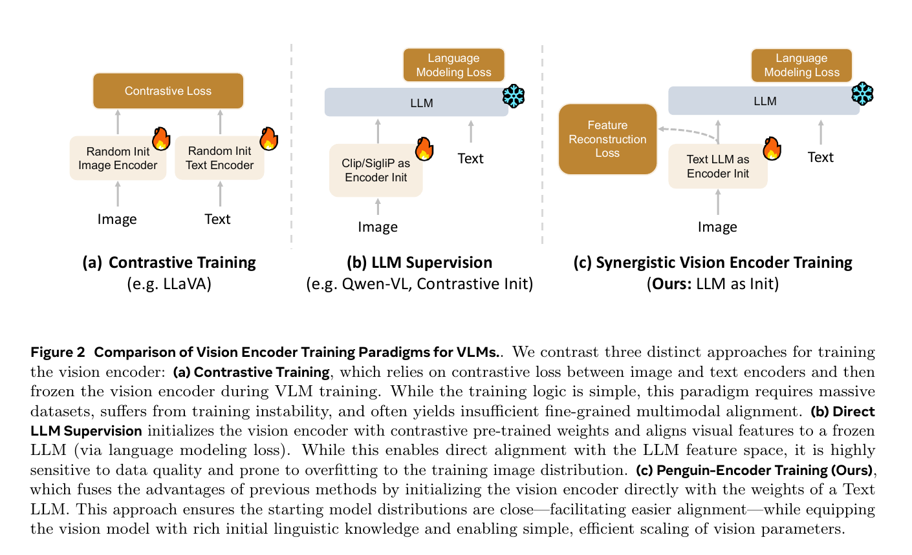
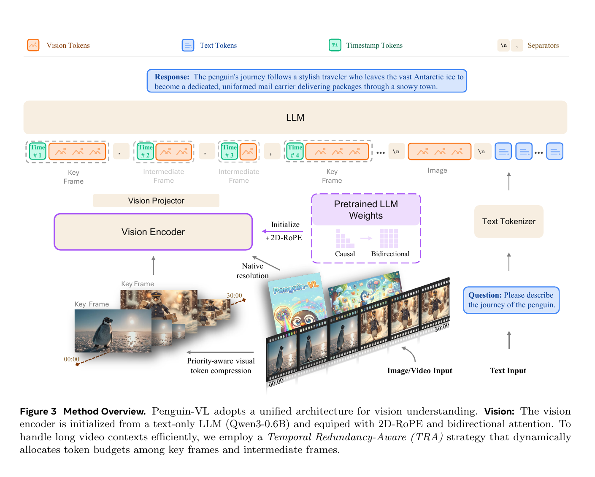

# Penguin-VL: Exploring the Efficiency Limits of VLM with LLM-based Vision Encoders

> VLM의 "눈"을 CLIP/SigLIP 같은 contrastive learning(대조학습) 모델이 아니라, **텍스트 전용 LLM(Qwen3-0.6B)을 개조해서** 만든 논문.

---

## 1️⃣ 메타 정보

| 항목 | 내용 |
|---|---|
| **논문 제목** | Penguin-VL: Exploring the Efficiency Limits of VLM with LLM-based Vision Encoders |
| **저자** | Boqiang Zhang\*, Lei Ke\*†, Ruihan Yang\*, Qi Gao\*, Tianyuan Qu\*§, Rossell Chen, Dong Yu‡, Leoweiliang‡ (\*Core contributors, †Proj Lead, ‡Senior Leads, §인턴 기간 중 수행) |
| **소속** | **Penguin-VL team at Tencent AI Lab** |
| **공개일** | arXiv v1 2026-03-06 / v2 2026-03-14 (문서 표기 날짜 2026-03-17) |
| **분야** | Vision-Language Model(비전-언어 모델, VLM), vision encoder(시각 인코더) 설계, 소형·엣지 배포 |
| **논문 링크** | [abs](https://arxiv.org/abs/2603.06569) · [PDF](https://arxiv.org/pdf/2603.06569v2) · arXiv:2603.06569v2 [cs.CV] |
| **코드** | https://github.com/tencent-ailab/Penguin-VL (Apache 2.0, ~8,000 LOC Python) |
| **모델** | [Penguin-VL-2B](https://huggingface.co/tencent/Penguin-VL-2B) · [Penguin-VL-8B](https://huggingface.co/tencent/Penguin-VL-8B) · [Penguin-Encoder](https://huggingface.co/tencent/Penguin-Encoder) (인코더 단독 공개) |
| **데이터** | [Penguin-Recap-I](https://huggingface.co/datasets/tencent/Penguin-Recap-I) (이미지 57.2M) · Penguin-Recap-V (비디오 3.7M) |
| **사용한 외부 모델** | 인코더 초기화 = **Qwen3-0.6B** / LLM backbone(백본) = **Qwen3-1.7B**(2B용), **Qwen3-8B**(8B용) / distillation teacher(증류 교사) = **VL3-SigLIP-NaViT**(VideoLLaMA3의 시각 인코더) |
| **사용한 외부 데이터** | COYO-700M, DataComp-1B, OpenImages, SA-1B, ChartGalaxy, M-Paper, ChartGen, UniChart, Ego4D, YouCook2, ShareGPT4Video, LLaVA-Video-178K, VIDAL-10M, Koala-36M, Moments in Time, Kinetics-710, Moment-10M, CLEVRER 등 |
| **평가 도구** | lmms-eval (2026-03-26부터 Penguin-VL 공식 지원) |
| **비고** | HuggingFace Daily Paper **#1 Paper of the day** (2026-03-09) |

---

## 2️⃣ 주요 용어 사전 (Glossary)

*본문을 읽기 전에 이 논문에서 반복되는 낯선 용어들을 먼저 풀어둔다. 여기만 읽어도 논문의 골격이 잡히도록 정리했다.*

### 🔹 기본 구조 용어

| 용어 | 쉬운 설명 |
|---|---|
| **VLM (Vision-Language Model, 비전-언어 모델)** | 이미지나 영상을 "보고" 텍스트로 답하는 모델. 보통 **눈(vision encoder) + 다리(projector) + 뇌(LLM)** 세 부분으로 나뉜다. |
| **vision encoder(시각 인코더)** | 이미지를 잘게 쪼갠 조각(patch, 패치)들을 벡터(숫자 묶음)로 바꿔주는 부분. 이 논문의 주인공. |
| **projector / merger(투영기)** | 인코더가 뱉은 벡터의 차원을 LLM이 알아듣는 차원으로 맞춰주는 작은 다리 역할 모듈. Penguin-VL은 2층 MLP(다층 퍼셉트론) + GELU 활성화만 쓴다. |
| **LLM backbone(언어 모델 백본)** | 실제로 문장을 생성하는 뇌. Penguin-VL은 Qwen3-1.7B / Qwen3-8B를 씀. |
| **ViT (Vision Transformer)** | 이미지를 패치로 잘라 Transformer로 처리하는, 지금까지의 표준 시각 인코더 구조. CLIP·SigLIP이 모두 ViT 기반. |

### 🔹 이 논문의 핵심 개념

| 용어 | 쉬운 설명 |
|---|---|
| **contrastive learning(대조학습)** | "이 이미지와 이 캡션은 짝, 저건 아님"을 맞히도록 학습하는 방식. CLIP/SigLIP의 학습법. **이 논문이 문제 삼는 대상.** |
| **objective mismatch(목적함수 불일치)** | 눈이 배운 목적(판별)과 뇌가 쓰는 목적(다음 토큰 예측)이 서로 다른 상태. 논문의 문제 제기 그 자체. |
| **category-level invariance(범주 수준 불변성)** | "이건 개, 저건 고양이" 수준까지만 구분하고 그 안의 세부 차이는 뭉개버리는 성질. 대조학습이 만드는 부작용. |
| **fine-grained visual cues(세밀한 시각 단서)** | 작은 글씨, 표의 칸 경계, 차트 눈금 같은 미세 정보. OCR·문서 이해에 필수. |
| **Penguin-Encoder** | 텍스트 전용 LLM(Qwen3-0.6B)을 개조해 만든 이 논문의 시각 인코더. |
| **native alignment(태생적 정렬)** | 눈과 뇌를 같은 계열 LLM에서 뽑아 **처음부터 같은 표현 공간(representation space)에서 출발**시키는 것. modality gap(모달리티 간극)을 학습으로 메우는 대신 애초에 안 만드는 접근. |
| **semantic prior(의미 사전지식)** | LLM이 이미 언어로 학습해둔 세상 지식. 인코더가 이걸 물려받아 시각 개념을 더 빨리 붙잡는다는 논리. |
| **TRA (Temporal Redundancy-Aware token compression, 시간 중복 인지 토큰 압축)** | 영상에서 변화가 큰 프레임(key frame)에 토큰을 많이 주고, 비슷비슷한 프레임(intermediate frame)에는 적게 주는 압축 전략. |

### 🔹 학습 기법 용어

| 용어 | 쉬운 설명 |
|---|---|
| **causal attention(인과 주의집중)** | 앞쪽 토큰만 볼 수 있는 방식. 문장 생성용 LLM의 기본. |
| **bidirectional full attention(양방향 전체 주의집중)** | 앞뒤 좌우 모두 볼 수 있는 방식. 이미지 패치는 상하좌우가 다 보여야 하므로 이걸로 바꿔야 한다. |
| **2D-RoPE (2D Rotary Positional Embedding, 2차원 회전 위치 인코딩)** | 토큰의 가로·세로 좌표를 회전 각도로 인코딩하는 위치 정보 방식. 가변 해상도(native resolution) 입력을 지원한다. |
| **QK normalization(QK 정규화)** | attention의 Query와 Key를 정규화해 학습을 안정시키는 최신 LLM 기법. Qwen3에 들어 있고, 그대로 물려받는다. |
| **reconstruction / distillation loss(재구성·증류 손실)** | 잘 학습된 다른 인코더(teacher, 교사)의 출력을 흉내 내도록 학습시키는 보조 목표. Penguin은 amplitude·direction·relation 세 종류를 쓴다. |
| **relation loss(관계 손실)** | 개별 토큰의 값이 아니라 **토큰끼리의 관계(자기상관, self-correlation)** 를 교사와 맞추는 손실. 이 논문 ablation에서 가장 효과가 큰 항목. |
| **mixed supervision(혼합 감독)** | 캡션 텍스트(교차엔트로피)와 교사 특징(재구성 손실)을 **동시에** 감독 신호로 쓰는 것. 캡션이 부실한 차트·다이어그램 데이터를 활용하기 위한 장치. |
| **SFT (Supervised Fine-Tuning, 지도 미세조정)** | 지시문-정답 쌍으로 모델을 사용자 의도에 맞추는 마지막 학습 단계. |
| **grounding(그라운딩)** | "빨간 컵이 어디 있어?" → 바운딩 박스 좌표를 답하는 능력. |

### 🔹 평가 벤치마크

| 벤치마크 | 무엇을 재나 |
|---|---|
| **DocVQA / InfoVQA / ChartQA / CharXiv / OCRBench** | 문서·인포그래픽·차트·장면 텍스트를 읽고 추론하는 능력 |
| **AI2D / RealWorldQA / V-star** | 교과서 다이어그램 / 일상 시각 추론 / 고해상도 미세 지각 |
| **MMMU-Pro / BLINK** | 전문가급 다분야 추론 / 멀티 이미지·순차 추론 |
| **MathVista / MathVerse / LogicVista** | 시각 수학 / 다단계 시각 수학 / 시각 논리 퍼즐 |
| **MVBench / VideoMME / EgoSchema / Perception Test / ActivityNetQA / MMVU** | 일반 영상 이해 (객관식·주관식) |
| **LongVideoBench / NextQA** | 장문 영상 이해 / 시간 인과 추론 |
| **Charades-STA** | **temporal grounding(시간 위치 찾기)** — "그 행동이 몇 초~몇 초에 나오나" |

---

## 3️⃣ 논문 요약 (TL;DR)

**한 줄:** VLM의 시각 인코더를 CLIP/SigLIP으로 초기화하는 관습을 버리고 **텍스트 전용 LLM(Qwen3-0.6B)에서 초기화**했더니, 400억 샘플 대조학습을 거친 SigLIP2를 같은 데이터·같은 레시피에서 **평균 3.4점 앞섰다.**

**핵심 문제:**
지금까지 거의 모든 VLM은 "대조학습으로 미리 학습된 ViT를 눈으로 붙인다"를 당연하게 여겨왔다. 그런데 대조학습은 **판별(discrimination)** 을 위한 목적이고, 감독 신호가 전체 이미지를 요약한 토큰 하나(CLS 토큰이나 attention pooling)에만 걸린다. 그 결과 "개 vs 고양이" 수준의 거친 범주 불변성만 배우고, 작은 글씨나 표의 칸 경계 같은 세밀한 단서는 눌려버린다. **정작 VLM이 하는 일은 다음 토큰 예측인데, 눈이 배운 목적과 뇌가 쓰는 목적이 근본적으로 어긋나 있다.**

**해결책:**
1. **Penguin-Encoder** — Qwen3-0.6B에서 텍스트 임베딩을 떼어내고, causal attention을 bidirectional full attention으로 바꾸고, 2D-RoPE를 붙여 시각 인코더로 개조 (약 440M 파라미터, SigLIP-so400m급).
2. **혼합 감독(mixed supervision)** — 캡션 감독만으로는 차트·다이어그램이 안 붙으니, 교사 인코더 특징을 흉내 내는 재구성 손실 3종(amplitude/direction/**relation**)을 함께 건다.
3. **TRA** — 영상에서 변화가 큰 프레임에 토큰을 몰아주는 압축 전략.

**검증:**
2B/8B 두 크기에서 문서·차트·OCR·고해상도 지각·영상 temporal grounding을 압도. 특히 **동일 데이터·동일 레시피로 추가 학습한 SigLIP2(240M 샘플)를 45.9 대 49.3으로 앞섬** — "우리 데이터가 좋아서"가 아니라 구조/초기화 자체의 이득임을 보인 통제 실험이 이 논문의 최고 증거.

---

## 4️⃣ 핵심 기여 (Contributions)

논문이 스스로 정리한 4가지:

1. **Encoder** — 텍스트 전용 LLM 구조에서 직접 개조한 새 시각 인코더 Penguin-Encoder. 주류 시각 인코더와 근본적으로 결별하고, LLM 백본 가중치 재사용으로 더 촘촘한 modality alignment(모달리티 정렬)를 얻는다.
2. **Mixed Supervision Encoder Pretraining** — 이 인코더에 맞춘 보조 목표를 도입해, 라벨 있는 데이터와 **라벨 없는 구조적 데이터(차트 등)** 를 동시에 활용. 초기 사전학습 단계의 데이터 효율과 표현 품질을 크게 개선.
3. **Unified Training Recipe** — 저해상도→고해상도 커리큘럼 + 우선순위 기반 비디오 토큰 압축 + 2단계 instruction tuning(지시문 조율)을 묶은 전체 파이프라인.
4. **Strong Performance at Compact Scale** — 2B/8B의 작은 크기로 이미지·영상 벤치마크에서 일관되게 강한 성능.

---

## 5️⃣ 주요 알고리즘 설명

*이 장을 두는 이유: 이 논문의 기여는 "새 모델" 하나가 아니라 인코더 개조 → 손실 설계 → 영상 압축으로 이어지는 세 갈래 장치이므로, 각각을 수식과 실제 코드에 붙여 확인해야 무엇이 진짜인지 판별할 수 있다.*

### 5.0 세 가지 학습 패러다임 비교 (Figure 2)

*본격 설명 전에, 이 논문이 기존 방식과 정확히 어디서 갈라지는지 그림 한 장으로 잡아둔다.*



| | (a) Contrastive Training | (b) LLM Supervision | **(c) Penguin (Ours)** |
|---|---|---|---|
| 예시 | LLaVA 계열 | Qwen-VL 계열 | **Penguin-VL** |
| 인코더 초기화 | 랜덤 → 대조학습 | **CLIP/SigLIP 가중치** | **텍스트 LLM 가중치** |
| 감독 신호 | contrastive loss | language modeling loss | LM loss **+ feature reconstruction loss** |
| LLM 상태 | (인코더 학습 후 동결) | frozen(동결) | frozen(동결) — *단, 코드는 다름 → §8 Q5* |
| 약점 | 방대한 데이터 필요, 학습 불안정, 세밀 정렬 부족 | 데이터 품질에 민감, 학습 이미지 분포에 overfitting(과적합) | — |

> ⚠️ **긴장 지점:** (c)의 교사 인코더가 **VL3-SigLIP-NaViT, 즉 대조학습 인코더**다. "대조학습이 문제다"로 시작해놓고 대조학습 인코더에서 증류를 받는다. 2단계에서 재구성 브랜치를 떼긴 하지만 논리적으로 깔끔하진 않다.

### 5.1 Penguin-Encoder — 텍스트 LLM을 눈으로 개조하는 3단계

*"LLM을 인코더로 쓴다"는 말은 쉽지만, 실제로는 attention 방향부터 위치 인코딩까지 다 뜯어고쳐야 한다. 무엇을 바꿨는지가 곧 기여의 실체다.*



#### 5.1.0 쉽게 이해하기 — 텍스트 LLM이 어떻게 "눈"이 되는가

*표와 수식으로 들어가기 전에, 이 개조가 왜 성립하는지를 비유로 먼저 잡아둔다. 이 절만 읽어도 5.1의 나머지가 자명해진다.*

**먼저 알아야 할 사실 하나 — Transformer는 자기가 무엇을 읽고 있는지 모른다.**

우리는 "LLM은 글을 읽는 모델"이라고 생각하지만, 실제로 LLM 내부에서 벌어지는 일은 이것뿐이다.

> 벡터(숫자 묶음)가 줄줄이 들어온다 → 서로 어떤 게 어떤 거랑 관련 있는지 계산한다 → 새 벡터를 뱉는다

"단어"라는 개념은 **입구에서만** 존재한다. 단어가 벡터로 바뀌는 순간, 그 뒤 28개 층은 그게 단어에서 왔는지 그림에서 왔는지 알지도 못하고 신경 쓰지도 않는다. **그러면 입구에 단어 대신 그림 조각을 넣으면 어떻게 될까?** — 이것이 Penguin-Encoder의 전부다.

**비유: 숙련된 독해 전문가에게 그림을 보여주기**

Qwen3-0.6B는 수조 개의 문장을 읽으며 훈련된 **"관계 파악 전문가"** 다. "이 문장의 '그것'은 세 문장 앞의 '고양이'를 가리키는군" 같은 걸 기가 막히게 한다. 이 사람에게 이렇게 말하는 것이다.

> "당신이 훈련한 건 **글자**가 아니라 **관계 파악**입니다. 이제 글자 대신 그림 조각 500개를 드릴 테니, 조각들끼리 어떤 관계인지 파악해주세요."

훈련된 근육(28개 층의 가중치)은 그대로 두고 **눈앞에 놓이는 재료만 바꾸는** 것. 피아니스트를 오르간 앞에 앉히는 것과 비슷하다 — 악기는 다르지만 음악성은 그대로 옮겨간다.

**개조 ① 입구 — 단어 사전을 떼고, 가위를 단다**

원래 LLM의 입구는 이렇게 생겼다.

```
"고양이" → 사전에서 12,345번 → 12,345번 칸의 벡터(1024개 숫자)를 꺼냄
```

이 사전(embedding table)은 **15만 1,936개 단어 × 1024** 크기의 거대한 표다. 이미지에는 "몇 번 단어"라는 게 없으니 이 표가 통째로 쓸모없다. 그래서 삭제하고(`del self.embed_tokens`), 대신 **가위**를 단다.

```python
Conv2d(3 → 1024, kernel=14, stride=14)
```

말로 풀면: **이미지를 가로세로 14픽셀짜리 정사각형으로 촘촘히 자르고, 각 조각(패치)을 숫자 1024개짜리 벡터로 바꾼다.**

| | 원래 LLM | Penguin-Encoder |
|---|---|---|
| 입구 | 사전 표에서 찾기 | 이미지를 14×14로 잘라 벡터화 |
| 나오는 것 | 단어 벡터 여러 개 | **패치 벡터 여러 개** |

여기가 포인트다. **둘 다 결과물이 "1024짜리 벡터의 줄"** 이다. 형태가 같으니 뒤쪽 28개 층은 아무것도 안 바꿔도 그대로 돌아간다. (그리고 이 사전 삭제가 아래 파라미터 산수의 전부다.)

**개조 ② 읽는 방향 — 앞만 보기 → 사방 다 보기**

글을 쓸 때는 앞 단어만 봐야 한다. 다음 단어를 미리 보면 반칙이니까(정답을 베끼는 셈). 이것이 causal attention이고, 모든 문장 생성 LLM의 기본이다. *소설을 읽을 때 뒷장을 미리 보면 안 되는 것과 같다.*

**그런데 그림은 정반대다.** 사진 한가운데 있는 조각이 "내 왼쪽엔 뭐가 있지? 오른쪽은? 위는?"을 다 봐야 한다. 앞만 보게 하면 왼쪽 위 조각은 오른쪽 아래를 영원히 못 보는 반쪽짜리가 된다. *그림은 뒷장을 미리 보는 게 아니라 **한눈에 전체를 봐야** 하는 것이다.*

그래서 이 규칙을 끈다 (`is_causal = False`). 코드에서 확인한 디테일 하나 — 이미지 여러 장을 넣어도 **한 이미지 안에서만 사방이 열리고 이미지끼리는 격리**된다(`cu_seqlens`로 경계를 끊음). 사진 1번의 조각이 사진 2번의 조각을 보진 못한다.

**개조 ③ 위치 표시 — 1차원 번호 → 2차원 좌표**

LLM은 각 단어에 "너는 몇 번째야"를 알려준다. 1차원 숫자 하나면 충분하다. 그런데 이미지 조각에 "너는 137번째야"라고만 하면 정보가 망가진다. 137번째가 **몇 행 몇 열인지**를 모르면 "이 글자 바로 위에 있는 게 뭐지?" 같은 걸 못 한다. 그래서 좌표를 두 개로 준다: **"너는 5행 3열이야"**(2D-RoPE).

구현도 단순하다 — 위치 정보를 담는 채널을 절반으로 갈라 **짝수 번 채널은 세로 좌표, 홀수 번 채널은 가로 좌표**를 담당하게 한다. 보너스로 좌표 기반이라 **이미지 크기가 제각각이어도 된다**(native resolution). 문서나 차트처럼 세로로 긴 이미지에서 이게 크다.

**바뀐 것과 남은 것**

| 부품 | 처리 |
|---|---|
| 단어 사전 (155.6M) | ❌ **삭제** |
| 패치 자르는 Conv2d | ➕ **새로 추가** (약 0.6M, 아주 작음) |
| 앞만 보기 규칙 | 🔄 **사방 보기로 변경** |
| 위치 표시 방식 | 🔄 **1차원 → 2차원** |
| **Transformer 28개 층 전부** | ✅ **그대로 유지** |
| — attention 가중치 | ✅ 유지 |
| — FFN 가중치 | ✅ 유지 |
| — QK normalization 등 최신 안정화 장치 | ✅ 유지 |

**바꾼 건 입구와 규칙 두 가지뿐이고, 실제 "생각하는 부분"은 손도 안 댔다.** 그 손대지 않은 28개 층에 수조 개 텍스트 토큰으로 다져진 실력이 들어 있다.

**이미지 한 장이 들어가서 나오기까지**

```
사진 (예: 448 × 448 픽셀, RGB 3채널)
  ↓  ① Conv2d 가위질 (14×14씩 자르기)
32 × 32 = 1,024개 조각, 각각 1024짜리 벡터
  ↓  ③ 각 조각에 "몇 행 몇 열" 좌표 부착 (2D-RoPE)
  ↓  ② 28개 층 통과 — 조각들이 서로 사방을 보며 관계 계산
1,024개의 "의미가 담긴" 벡터
  ↓  다리(projector): 2층 MLP + GELU
LLM(Qwen3-1.7B)이 알아듣는 차원으로 변환
  ↓
"이 사진에는 ..." 문장 생성 시작
```

**이렇게 하면 뭐가 좋은가 — native alignment를 비유로**

- **기존 방식(CLIP/SigLIP을 눈으로):** 눈은 미국에서 태어났고 뇌는 한국에서 태어났다. 서로 말이 안 통하니 **통역사(projector)가 열심히 배워야** 겨우 소통한다. 이 언어 차이가 modality gap이다.
- **Penguin-VL 방식:** 눈(Qwen3-0.6B)과 뇌(Qwen3-1.7B)가 **같은 집안 형제**다. 처음부터 같은 말을 쓰니 통역이 거의 필요 없다.

간극을 학습으로 메우는 대신 **애초에 안 만드는** 접근이다.

> ⚠️ 다만 이건 **논문의 이야기**이고, 실제로 이 세 가지 개조를 수행하는 변환 스크립트는 공개 저장소에 없다 → §8 Q5-1. 그리고 "왜 텍스트 가중치가 시각에 도움이 되는가"의 메커니즘은 → §8 **Q12**.


| 개조 | 내용 | 코드 위치 |
|---|---|---|
| **① attention 방향 전환** | causal self-attention(앞만 보기) → **bidirectional full attention**(양방향 전체 보기). 이미지 패치는 좌우 상하가 다 보여야 하므로 필수 | `PenguinVLAttention.__init__`: `self.is_causal = False` → `flash_attn_varlen_func(..., causal=False)` |
| **② 위치 인코딩 교체** | 1D RoPE → **2D-RoPE**. 가변 해상도(native resolution) 입력 지원. 토큰 예산이 허용하면 원본 해상도 그대로, 아니면 적절히 리사이즈 | `get_rope_index()`가 h/w 좌표 생성, `apply_multimodal_rotary_pos_emb()`가 채널을 절반씩 갈라 짝수=h, 홀수=w 배정 |
| **③ 불필요 파라미터 제거** | 텍스트 전용 부분 삭제 후 **약 400M**만 남김 (논문 표현) | `del self.embed_tokens` + `Conv2d(3 → 1024, kernel=14, stride=14)` 패치 임베딩 추가 |

**파라미터 산수 (검증됨):**
```
Qwen3-0.6B 총 파라미터              596M
− 텍스트 임베딩 151,936 × 1,024  = 155.6M
──────────────────────────────────────────
= 약 440M  (+ 패치 임베딩 3×14×14×1024 ≈ 0.6M)
```
논문의 "approximately 400M, SigLIP과 broadly consistent"는 살짝 후한 반올림이지만 사실이다. (SigLIP-so400m = 약 400M)

**공개 체크포인트 config (`tencent/Penguin-Encoder/config.json`) — Qwen3-0.6B와 완전 동일:**
```json
{ "hidden_size": 1024, "num_hidden_layers": 28, "intermediate_size": 3072,
  "num_attention_heads": 16, "num_key_value_heads": 8, "head_dim": 128,
  "rope_theta": 1000000, "max_position_embeddings": 40960,
  "patch_size": 14, "num_channels": 3, "vocab_size": 151936 }
```
> `vocab_size: 151936`이 남아 있는 건 임베딩을 지웠는데도 안 지운 흔적(vestigial 필드).

**저자들이 주장하는 이점 4가지:**
1. **Architectural Expressivity(구조 표현력)** — SigLIP에 없는 QK normalization 등 최신 설계 요소를 그대로 물려받아 안정성·표현력이 좋다.
2. **Native Alignment(태생적 정렬)** — 인코더의 출발점이 이미 다운스트림 LLM과 호환되는 표현 공간이라 modality gap이 최소.
3. **Semantic Priors(의미 사전지식)** — 언어로 배운 세상 지식을 처음부터 갖고 시작해 시각 개념의 의미적 발판이 된다.
4. **Scalability(확장성)** — 확립된 LLM 설계 원칙을 그대로 쓰므로 1.5B 인코더 등으로 키우는 것도 예측 가능. 대조학습 방식보다 스케일업이 쉽다.

### 5.2 혼합 감독(mixed supervision) — 재구성 손실 3종

*캡션 감독만 쓰면 차트·다이어그램처럼 자연어 설명이 희소하거나 부정확한 도메인이 안 붙는다. 그래서 교사 인코더의 특징을 흉내 내는 보조 목표를 함께 건다.*

학생(Penguin-Encoder) 특징을 `F_s`, 교사(VL3-SigLIP-NaViT) 특징을 `F_t`라 할 때 — **논문 수식:**

```
(1) Amplitude Loss  (크기 맞추기)
    L_A = (1/N) · Σ_N ( |F_s − F_t| )

(2) Direction Loss  (방향 맞추기)
    L_D = (1/N) · Σ_N ( tr( F_s F_tᵀ / (‖F_s‖₂ ‖F_t‖₂) ) )

(3) Relation Loss  (토큰끼리의 관계 맞추기)
    L_R = (1/N) · Σ_N ( | F_s F_sᵀ/‖F_s‖₂²  −  F_t F_tᵀ/‖F_t‖₂² | )
```

**각 손실이 왜 필요한가:**
- **L_A** 단독은 overfitting(과적합)과 **representation collapse(표현 붕괴 — 모든 토큰이 비슷한 값으로 뭉개지는 현상)** 위험이 있어 크기만으로는 부족하다.
- **L_D**로 특징 분포의 방향을 시각 특징 공간에 정렬한다.
- **L_R**의 논리: attention 기반 모델에서 중요한 건 개별 토큰의 크기나 방향 같은 **절대 속성**이 아니라 **패치 사이의 상호작용**이다. 그래서 자기상관(self-correlation) 유사도로 패치 간 관계를 명시적으로 감독한다.

**실제 코드 매핑** — `penguinvl/model/penguinvl_qwen3.py:305-317`:
```python
student_features = self.vision_distill_layer(student_features)   # ← 논문에 없는 어댑터 (§8 Q4)
student_norm = F.normalize(student_features, p=2, dim=-1)
teacher_norm = F.normalize(teacher_features, p=2, dim=-1)

# L_D + L_A 가 하나로 융합됨
teacher_loss = 1 - F.cosine_similarity(student_features, teacher_features, dim=-1).mean()
teacher_loss = teacher_loss + F.smooth_l1_loss(student_features, teacher_features, beta=0.001)

# L_R
relation_loss = F.smooth_l1_loss(
    torch.einsum('id,jd->ij', student_norm, student_norm),
    torch.einsum('id,jd->ij', teacher_norm, teacher_norm),
    beta=0.001
)

loss = loss + (teacher_loss + relation_loss) \
       * (3 - kwargs.get("current_epoch", 0)) / kwargs.get("num_items_in_batch", 1)
```

| 항목 | 논문 | 코드 |
|---|---|---|
| Amplitude | 절댓값 평균 (L1) | `smooth_l1_loss(beta=0.001)` — 실질 동등 |
| Direction | 코사인 유사도 trace | `1 − cosine_similarity().mean()` |
| **합산 구조** | **L_A, L_D 별개 항** | **둘을 더해 `teacher_loss` 하나로 융합** |
| Relation | 정규화 Gram 행렬 L1 차이 | `smooth_l1_loss` (구조 동일) |
| 학생→교사 차원 변환 | 언급 없음 | **`nn.Linear(1024 → 1152, bias=True)`** |
| 가중치 | 언급 없음 | **`(3 − current_epoch) / num_items_in_batch`** |

> amplitude와 direction이 코드에서 한 변수로 융합돼 있어서, 논문 Table 3에 "amplitude만 뺀" 행이 없는 이유가 여기서 설명된다 — 구조상 분리 ablation이 불가능하다. 나머지 함의는 §8 Q4 참조.

**2단계에서는 재구성 브랜치를 완전히 제거**하고 고해상도 정렬에만 집중한다.

### 5.3 TRA — 영상 토큰을 어디에 몰아줄 것인가

*긴 영상을 그대로 넣으면 토큰이 폭발한다. Qwen3-VL은 "모든 프레임에 동일 해상도"를 유지하지만, Penguin은 내용에 따라 세밀도를 다르게 주는 **content-adaptive granularity(내용 적응형 세밀도)** 를 택한다.*

**프레임 분류:** 시간적 유사도로 두 종류로 나눈다.
- **key frame(핵심 프레임)** — 급격한 시간적 변화를 담은 프레임
- **intermediate frame(중간 프레임)** — 안정적인 맥락을 제공하는 프레임

코드(`mm_utils.py:265`)에서는 첫 프레임을 항상 key로 잡고, **직전 key frame과의 유사도가 `MIN_FRAME_SIMILARITY = 0.95` 미만이면 새 key frame**으로 지정한다.

**논문의 3단계 캐스케이드** (`T_max` = 전체 토큰 예산, `T_min` = 프레임당 최소 토큰, `T_k` = key 토큰 수, `T_i` = intermediate 토큰 수):

| 단계 | 조건 | 동작 |
|---|---|---|
| **Stage 1** 해상도 보존 | `Σ T_k + Σ T_i ≤ T_max` | 아무 압축 없이 원본 해상도 그대로. 짧고 빠른 영상에서 미세 동작과 장면 디테일 보존에 결정적 |
| **Stage 2** 동기 축소 | 예산 초과 | key:intermediate를 **면적 비율 16:1 고정**(`T_k ≈ 16·T_i`)으로 유지하며 bilinear 보간으로 **동시** 축소. 시간축 화질이 고르게 저하되도록 |
| **Stage 3** 포화 인지 축소 | `T_i = T_min` 도달 | intermediate를 하한에 고정(clamp)하고, 남은 압축 압력을 **key frame에만 전가**. 중간 프레임이 과압축돼 맥락이 사라지는 걸 방지 |

**코드에는 4번째 단계가 더 있다** (`image_processing_penguinvl.py:182-184`):
```python
# --- Stage 4: Key-frame hard floor ---
if target_key_area < min_pixels:
    target_key_area = min_pixels
```
논문은 *"T_max 설정상 key frame이 T_min을 절대 뚫지 않음을 보장한다"* 고 썼는데, 코드는 그 상황을 방어하는 clamp를 명시적으로 넣어놨다. **보장이 아니라 방어 코드다.**

**설계상 강점:** 인코더와 VLM이 넓은 해상도 범위에서 함께 사전학습되므로 **연속적 해상도 적응(continuous resolution adaptation)** 이 가능하다. 즉 공격적으로 압축해도 프레임 간 공간 연속성이 부드럽게 유지된다.

### 5.4 데이터 포맷과 Projector

*모델에 이미지·영상·텍스트를 어떤 순서로 넣는지가 시간 정보 학습에 직결되므로 포맷 자체가 설계 요소다.*

**특수 토큰**
- 구분자: `"\n"` = 서로 다른 입력(이미지끼리, 또는 마지막 텍스트)을 구분 / `","` = 연속 스트림 내 항목(프레임) 구분
- 타임스탬프: `⟨t⟩` = 절대 시각 문자열, 형식 `"Time: xxs"`

**이미지 시퀀스** (N장):
```
I₁ \n I₂ \n ··· \n I_N \n X          (X = 텍스트 토큰)
```

**비디오 시퀀스** (M프레임): 각 프레임 블록 바로 앞에 타임스탬프를 붙인다.
```
(⟨t₁⟩V₁) , (⟨t₂⟩V₂) , ··· , (⟨t_M⟩V_M) \n X
```
→ 이 명시적 타임스탬프가 Charades-STA 같은 temporal grounding에서의 압도적 우위(§7)의 직접적 원인으로 보인다.

**Projector:** `mlp2x_gelu` = `Linear(vision_hidden → llm_hidden)` → `GELU` → `Linear(llm_hidden → llm_hidden)`.
Q-Former나 resampler류와 달리 **공간 토큰 압축을 전혀 하지 않는다**. 단순성과 효율 우선. 대신 비디오만 인코더 직후 **bilinear 2배 공간 다운샘플**을 적용한다.

---

## 6️⃣ 학습 파이프라인 (3단계)

*이 장을 두는 이유: 이 논문의 성능은 인코더 아이디어만큼이나 데이터 물량에서 나오므로, 규모를 봐야 결과를 제대로 해석할 수 있다.*

| 단계 | 학습 대상 | 데이터량 | 핵심 |
|---|---|---|---|
| **Stage 1-1** 저해상도 | 인코더 + projector (LLM 동결) | **~223M** (COYO-700M/DataComp-1B 220M + 무라벨 차트 2.8M) | 2,048 visual token (약 600×600). 재구성 손실 3종 **ON**. 논문 LR 1e-3 |
| **Stage 1-2** 고해상도 | 인코더 + projector | **~47M** (OpenImages/SA-1B/COYO/DataComp 45M + 비디오 프레임 2M) | 10,240 visual token. **재구성 손실 제거**, 세밀 정렬에만 집중. 논문 LR 5e-4 |
| **Stage 2** 사전학습 | **전체** (LLM 포함) | **121M** | 일반 캡션 64%, 문서 14.45%, grounding 6.31%(총 7.7M), region caption 1.5M, OCR·수학·코드·순수 텍스트. 좌표는 **[0,1000] 정수** 공간 |
| **Stage 3** SFT | 전체 | **이미지 39M + 비디오 3.7M** | 2단계 SFT: 이미지+영상 일반 지시문 → 영상 중심 복합 추론 |

### 6.1 왜 좌표를 정수로 쓰나

*grounding은 좌표를 텍스트로 뱉는 작업이라, 숫자 표현 방식이 성능에 직결된다.*

모든 bounding box(경계 상자)를 `[0, 1000]` **정수** 상대 좌표로 통일한다. `(0,0)` = 좌상단, `(1000,1000)` = 우하단.
→ 이유: **autoregressive(자기회귀) 언어 모델에게는 고정밀 소수를 회귀하는 것보다 이산 정수를 예측하는 게 경험적으로 더 안정적이고 쉽다.** LLM tokenization(토큰화)과도 잘 맞는다.

grounding 7.7M + region caption QA 1.5M을 **양방향(region→text 캡셔닝 + text→region 그라운딩)** 으로 함께 학습해 공간 위치와 의미 내용의 쌍방향 정렬을 만든다.

### 6.2 SFT 데이터 구성

**이미지 39M**

| 범주 | 비율 | 목적 |
|---|---|---|
| General & Caption, Text | 32.6% | 일반 이해력·언어 추론·개방형 대화의 뼈대 |
| Document, Chart & Table | 20.9% | 복잡한 레이아웃 추론, 수치·관계 추론 |
| OCR, Text QA | 16.6% | 장면 텍스트·문서 판독, 미세 의미 해석 |
| Grounding & Counting | 10.1% | 공간 인지, 객체 다중성 |
| Mathematics | 8.9% | 구조적 논리·기호 조작 |
| Multi-image, Science | 3.71% | 교차 이미지 비교, 과학 도메인 지식 |

**비디오 3.7M**

| 범주 | 비율 | 대표 데이터 |
|---|---|---|
| General Video Understanding | 77.6% | LLaVA-Video-178K, VIDAL-10M |
| Action Recognition & Reasoning | 12.7% | Moments in Time, Kinetics-710 |
| Temporal Grounding & Reasoning | 6.9% | Moment-10M, CLEVRER |
| Ego Video Understanding | 2.8% | Ego4D, EgoQA |

### 6.3 자체 구축 데이터

*공개 데이터만으로는 캡션 밀도와 도메인 균형이 부족해, 직접 재캡션·재주석한 코퍼스를 만들었다.*

| 데이터셋 | 규모 | 구축 방식 |
|---|---|---|
| **Penguin-Recap-I** | 이미지 57.2M | COYO-700M/DataComp-1B에서 ① 해상도·종횡비·손상 지표로 저품질 제거 ② CLIP 임베딩 기반 **계층적 k-means**(전체 클러스터링 비용을 피하려 표본으로 거친 중심 → 재귀적 세분화) ③ 클러스터 내 **최대 이격 greedy 선택**으로 다양성 확보. 이후 10개 항목(전역 의미/주체/행동/공간 관계/장면 속성/주요 객체/OCR 텍스트/화질/분위기/지식 기반 해석)을 구조적으로 주석한 뒤 하나의 긴 캡션으로 합성 |
| **Penguin-Recap-V** | 비디오 3.7M | 29개 공개 데이터셋에서 수집. 16프레임 샘플 특징으로 클러스터링 중복 제거 + **optical flow(광학 흐름)** 로 움직임 없는 정적 클립 폐기. VIDAL-10M(대부분 20초 미만)은 랜덤 샘플링, Koala-36M은 **duration-aware(길이 인지) 샘플링**으로 길이 분포 균형 |
| **Penguin-QA** | — | Recap 결과에서 파생. **temporal ordering(시간 순서 맞히기)** 과 **temporal grounding(정확한 시작·종료 시각 찾기)** 두 과제 중심. 애매한 겹침 이벤트와 자명한 샘플은 명시적으로 배제 |

**비디오 주석은 3계층 구조**로, 각 층이 앞 층에서 합성된다:
1. **Event-level atomic descriptions** — 타임스탬프가 붙은 세밀한 사실 캡션 (사실적 토대)
2. **Chapter-level narrative syntheses** — 원자 이벤트들을 서사 챕터로 묶고 핵심 사건·전환점을 서술
3. **Holistic video summaries** — 중심 주제, 인물 전개 등 전체 해석

### 6.4 구현 세부 (논문 기준)

- 전 단계 **cosine LR decay + warmup ratio 3%**
- 최대 시퀀스 **16,384 토큰** (그중 시각 최대 **10,240**)
- 인코더 초기화 = Qwen3-0.6B, LLM = Qwen3-1.7B / Qwen3-8B
- Stage 1 페이즈1: 인코더·projector 모두 **1.0e-3**, 재구성 교사 = VL3-SigLIP-NaViT
- Stage 1 페이즈2: 재구성 손실 제거, 인코더 **5.0e-4**, projector **1.0e-3**
- Stage 2 사전학습: 인코더 **1.0e-4**
- Stage 3 SFT: 전체 통합 **1.0e-5**
- 비디오는 인코더 직후 bilinear 2배 공간 다운샘플
- 프레임 추출 FFmpeg 1 FPS, 초과 시 균등 시간 서브샘플링, `max_frames` = **180** (3분 미만 영상 대부분 커버)
- **추론:** 이미지는 greedy 또는 near-greedy (temperature 0.0/0.1, top_p 1.0, top_k 50). 영상은 최대 **300프레임 · 최대 3 FPS**, 샘플링 전략 2종 — ① **TRA**(학습과 동일) ② **TRA-codec**(인코딩된 비디오의 I-frame을 key frame으로 사용)

---

## 7️⃣ 실험 요약

*이 장을 두는 이유: "어디서 이기고 어디서 지는가"의 패턴이 이 논문의 주장이 어디까지 참인지를 그대로 드러낸다.*

### 7.1 Table 1 — 2B 모델

*온디바이스급 소형 VLM 경쟁. 볼드=1위, 밑줄 대신 괄호로 2위 표기.*

| 벤치마크 | **Penguin-VL 2B** | Qwen3-VL 2B | InternVL3.5 2B | Gemma3n E2B-it | SmolVLM2 2.2B |
|---|---|---|---|---|---|
| InfoVQA | **77.8** | (72.4) | 70.8 | 51.9 | 43.0 |
| ChartQA | **86.6** | 76.9 | (80.7) | 65.8 | 68.7 |
| DocVQA | **94.1** | (93.3) | 89.4 | 78.4 | 80.0 |
| CharXiv (DQ/RQ) | **66.4**/35.8 | 62.3/26.8 | (65.0)/**31.6** | 60.1/27.0 | 36.9/15.5 |
| OCRBench | 810 | **858** | (836) | 700 | 729 |
| AI2D | **80.7** | 76.9 | (78.8) | 74.6 | 70.0 |
| RealWorldQA | **70.2** | (63.9) | 62.0 | 59.9 | 58.3 |
| V-star | **83.8** | (74.9) | 69.1 | 46.0 | 51.8 |
| MMMU-Pro | 31.4 | **36.5** | (31.6) | 28.0 | 20.1 |
| BLINK | (51.7) | **53.8** | 36.6 | 44.1 | 44.0 |
| MathVista | **67.3** | (61.3) | 60.8 | 50.4 | 51.5 |
| MathVerse | 35.9 | **52.1** | (39.6) | 22.5 | 21.5 |
| LogicVista | (41.3) | 35.8 | **47.7** | 33.9 | 24.8 |
| MVBench | (65.5) | 61.7 | **65.9** | 46.8 | 46.3 |
| LongVideoBench | **59.5** | 52.1 | (57.4) | 43.0 | 49.7 |
| VideoMME | 57.4 | **61.9** | (58.4) | 47.0 | 52.1 |
| EgoSchema | **57.6** | (55.7) | 50.5 | 48.0 | 34 |
| MMVU | **42.7** | (41.7) | (42.7) | 34.5 | 33.5 |
| **Charades-STA** | **56.2** | (54.5) | 21.9 | 5.5 | 9.5 |
| NextQA | **79.9** | (76.9) | 76.1 | 65.4 | 62.4 |
| ActivityNetQA | **61.5** | (59.7) | 58.3 | 51.5 | 52.6 |
| Perception Test | **70.4** | 64.5 | (64.7) | 48.6 | 51.6 |

### 7.2 Table 2 — 8B 모델

*같은 패턴이 더 큰 규모에서도 유지되는지, 그리고 폐쇄형 모델과 어디쯤인지 확인.*

| 벤치마크 | **Penguin-VL 8B** | Qwen3-VL 8B | InternVL-3.5 8B | GPT-5 nano |
|---|---|---|---|---|
| InfoVQA | **86.8** | (83.1) | 79.1 | 49.2 |
| ChartQA | **90.5** | (89.6) | 86.7 | 48.6 |
| DocVQA | **96.2** | (96.1) | 92.3 | 78.3 |
| CharXiv (DQ/RQ) | 75.7/40.0 | **83.0/46.4** | 72.2/(44.4) | 64.4/31.7 |
| OCRBench | (852) | **896** | 840 | 701 |
| AI2D | **86.1** | (85.7) | 84.0 | 65.7 |
| RealWorldQA | **75.8** | (71.5) | 67.5 | 60.7 |
| V-star | **90.2** | (90.1) | 70.7 | 63.4 |
| MMMU-Pro | 40.2 | **55.9** | 39.7 | 36.5 |
| BLINK | 58.2 | **69.1** | (59.5) | 42.2 |
| MathVista | **77.4** | (77.2) | 74.2 | 40.9 |
| MathVerse | 50.8 | **62.1** | (55.8) | 27.0 |
| LogicVista | 53.8 | (55.3) | **57.3** | 40.5 |
| MVBench | (71.7) | 68.7 | **72.1** | 52.9 |
| LongVideoBench | **67.0** | (62.6) | 62.1 | 38.1 |
| VideoMME | (66.2) | **71.4** | 66.0 | 49.4 |
| EgoSchema | (67.0) | **70.2** | 61 | 34.8 |
| MMVU | (53.9) | **58.7** | 51.5 | 51.0 |
| **Charades-STA** | **61.4** | (56.0) | 32.8 | 5.0 |
| NextQA | **85.4** | 82.3 | (81.3) | 59.3 |
| ActivityNetQA | **65.2** | (63.7) | 60.1 | – |
| Perception Test | **78.0** | (72.7) | (72.7) | – |

### 7.3 결과 패턴 — 지각은 이기고 추론은 진다

**✅ 압도적 강점**
- 문서/차트/인포그래픽 이해 (DocVQA, ChartQA, InfoVQA, AI2D)
- 고해상도 세밀 지각 (V-star: 2B에서 InternVL 대비 +14.7)
- 영상 temporal grounding — **Charades-STA에서 InternVL 대비 2B에서 +34.3, 8B에서 +28.6**
- 장문 영상 (LongVideoBench 2B +7.4 / 8B +4.4)

**❌ 일관된 약점** — 추상 추론 계열 (MMMU-Pro, MathVerse, LogicVista, BLINK)

**그리고 이 격차가 8B에서 오히려 더 벌어진다:**

| | 2B 격차 (vs Qwen3-VL) | 8B 격차 (vs Qwen3-VL) |
|---|---|---|
| MMMU-Pro | −5.1 | **−15.7** |
| BLINK | −2.1 | **−10.9** |
| MathVerse | −16.2 | −11.3 |

→ 논문 초록의 *"improved visual representation rather than model scaling is the primary driver of performance"* 가 자기 결과로 부분 반박된다. 자세한 해석은 §8 Q1-⑤.

### 7.4 Table 3 — Ablation (이 논문의 핵심 증거)

*주장의 진짜 검증은 이 한 표에 다 들어 있다. 전체 Stage 1의 10%(약 24M: 저해상도 20M + 고해상도 4M)로 축소 학습 → DenseFusion-1M 정렬 → LLaVA-665k SFT.*

**(A) 인코더 사전학습 요소 분해**

| 설정 | **Avg** | AI2D | MathVista | ChartQA | MMMU-Pro | RealWorldQA |
|---|---|---|---|---|---|---|
| Penguin-Encoder (랜덤 초기화) | 31.3 | 57.2 | 22.0 | 12.4 | 18.8 | 46.0 |
| Penguin-Encoder (w/o reconstruction) | 32.6 | 55.6 | 29.9 | 11.6 | 18.9 | 46.9 |
| Penguin-Encoder (w/o relation loss) | 33.3 | 56.3 | 29.5 | 17.4 | 18.2 | 45.0 |
| **Penguin-Encoder (전체)** | **34.6** | 56.4 | 29.0 | 17.4 | 19.3 | 51.0 |

논문 해석: 랜덤 31.3 → 전체 34.6 = **+3.3**이 LLM 초기화의 이점. 성숙한 LLM 가중치가 잘 조절된(well-conditioned) 출발점을 제공해, 인코더가 강건한 시퀀스 모델링 능력을 직접 물려받는다. 그리고 relation loss가 33.3 → 34.6으로 **+1.3**을 추가 — attention 모델이 절대 속성보다 토큰 간 관계를 우선한다는 본질과 부합.

**(B) 기존 인코더와의 직접 비교** — 백본을 Qwen3-1.7B로 통일, 모든 인코더를 새 MLP projector로 연결, DenseFusion-1M 정렬 + LLaVA-665k SFT 동일 적용

| 비전 인코더 | Stage 0 대조학습 | Stage 1 데이터 | **Avg** | AI2D | MathVista | ChartQA | MMMU-Pro | RealWorldQA |
|---|---|---|---|---|---|---|---|---|
| SigLIP2 (원본 해상도, Stage 1 없음) | >40B | – | 36.7 | 59.4 | 30.4 | 19.9 | 21.2 | 52.4 |
| SigLIP2 (원본 해상도) | >40B | 24M | 39.2 | 61.5 | 32.4 | 25.5 | 22.0 | 54.6 |
| VL3-SigLIP-NaViT | >40B | >37M | 43.0 | 60.9 | 32.2 | 40.4 | 21.1 | 60.3 |
| SigLIP2 (가변 해상도, 1024 max token) | >40B | 240M | 45.3 | 65.3 | 33.6 | 46.7 | 22.3 | 58.6 |
| SigLIP2 (가변 해상도, 10240 max token) | >40B | 240M | 45.9 | 64.3 | 33.5 | 48.8 | 21.4 | 61.6 |
| Qwen3VL-32B ViT | >40B | >1B* | 47.3 | 64.6 | 34.2 | 53.6 | 22.3 | 62.0 |
| **Penguin-Encoder** | **없음** | ~240M | **49.3** | **65.5** | **36.3** | **55.0** | **24.9** | **65.0** |

<sub>*Qwen3-VL 리포트가 총 토큰 수만 제공해 저자들이 추정한 값. 모든 SigLIP2 변형은 `siglip2-so400m-patch16-naflex`.</sub>

**이게 가장 설득력 있는 결과다.** 마지막 두 SigLIP2 행은 *똑같은 240M 데이터, 똑같은 레시피*로 추가 학습한 통제 실험인데, 400억 샘플 대조학습이라는 어마어마한 사전 이점을 갖고도 45.9로 49.3에 **3.4점 뒤진다.** 즉 "우리 데이터가 좋아서"가 아니라 **구조/초기화 자체의 이득**이라는 주장이 데이터로 받쳐진다. 1B+ 샘플을 본 Qwen3VL-32B ViT도 넘어선다.

논문의 3가지 해석:
1. **Overall performance advantage** — contrastive 인코더는 판별에 최적화됐지 추론 중심 생성에 맞춰진 게 아니다. Penguin의 **generation-aligned(생성 정렬)** 설계는 세밀한 시각 특징을 LLM의 고수준 의미 공간으로 직접 매핑해 autoregressive decoding에 본질적으로 적합하다.
2. **Scalability** — 데이터가 적을 땐 contrastive 인코더가 더 빨리 수렴할 수 있다. 그러나 데이터 규모와 과제 복잡도가 커질수록 Penguin-Encoder의 이득이 점점 커진다 = 더 높은 성능 천장.
3. **Comparison under Matched Data** — 사전학습 데이터와 평가 벤치마크의 도메인 겹침으로 인한 불공정 이점을 배제하기 위해, SigLIP2에 Penguin과 정확히 동일한 데이터·레시피(Stage 1)를 추가 적용. 그래도 Penguin이 명확히 우월 → 구조적 이점.

### 7.5 Case Study (Figures 9-14)

*정성 결과는 "이 모델이 실제로 뭘 하는지"를 벤치마크 점수보다 빠르게 보여준다.*

| 그림 | 과제 | 관찰 |
|---|---|---|
| Fig 9 | LeetCode Hard(#44 Wildcard Matching) 스크린샷 → 코드 | 텍스트를 옮겨 적는 수준이 아니라 DP(동적 계획법) 정식화 + 와일드카드 엣지 케이스 처리 + 문법적으로 올바른 Python |
| Fig 10 | 1776년 미국 독립선언서 원본 이미지 파싱 | 심한 시각 열화·고문체 활자·복잡한 공간 배치에서도 좌→우, 상→하 읽기 순서를 유지한 고충실도 텍스트 추출 |
| Fig 11 | 50년치 다변량 라인 차트 | 특정 시간 구간의 전역 최저점 식별 + 세 계열의 변동성/안정성 비교 (고차 비교 분석) |
| Fig 12 | 전통 회화(말을 잡은 남자) → 시 | 붉은 안장 술, 시선 교환 같은 구체적 시각 디테일을 다연 시로 변환 |
| Fig 13-14 | 300초 베이징 영상 / 유리공예 영상 | "장안대로가 몇 초에 언급되나?" → 206.66–209.34초로 정확히 지목. 짧은 영상은 10초 단위 타임스탬프 캡션 생성 |

---

## 8️⃣ 💬 Q&A

### Q1. 이 논문을 비판적으로 볼 지점은 어디인가?

*테크니컬 리포트라 자기 검증이 느슨한 부분이 꽤 있다. 여덟 가지로 정리한다.*

**① "efficiency limits"를 표방하는데 효율 수치가 하나도 없다.**
동기가 "스마트폰과 로봇 같은 compute 제약 기기 배포"인데, GPU 시간, 처리량(throughput), 지연시간(latency), 온디바이스 측정치가 **전부 없다.** 결국 "작은 파라미터로 점수가 높다"는 것 외엔 효율 주장을 뒷받침할 게 없다. 제목이 과하다.

**② TRA는 ablation이 0건이다.**
4대 기여 중 하나로 내세우고 3단계 캐스케이드를 상세히 설계했지만, "TRA를 끄면 얼마나 떨어지는가"를 보여주는 실험이 없다. 비디오 성능이 TRA 덕인지, Moment-10M/CLEVRER 같은 temporal grounding 학습 데이터 덕인지 분리 불가다. Charades-STA에서 InternVL을 34점 이기는 건 **인코더보다 데이터(그리고 §5.4의 명시적 타임스탬프 토큰) 때문일 가능성이 크다.**

**③ 추론 설정 체리피킹 우려.**
*"Table 1의 결과는 위에서 설명한 모든 설정과 샘플링 전략 중 **최고 성능 구성**에 해당한다"* 고 논문이 명시한다. 즉 벤치마크마다 TRA / TRA-codec 중 잘 나온 걸 골랐다는 뜻인데, 베이스라인은 lmms-eval 기본 설정이다. 공정성이 흔들린다.

**④ Ablation (A)의 절대 점수가 노이즈 바닥에 가깝다.**
ChartQA가 11.6~17.4 구간이다. 이 정도면 모델이 차트를 거의 못 읽는 상태이고, 여기서 나온 손실 함수 순위가 240M 규모 본 학습에서도 유지된다는 보장이 없다. 또 "랜덤 초기화" 행이 재구성 손실을 포함한 상태인지 아닌지가 표에 명시되지 않아, "+3.3은 LLM 초기화 덕"이라는 서술의 귀속(attribution)이 애매하다. 확실히 읽히는 건 **"재구성 손실 없음(32.6) → 전체(34.6) = 재구성+relation 손실이 +2.0"** 뿐이고, 이건 LLM 초기화 자체의 기여보다 클 수도 있다.

**⑤ 추론 약점이 8B에서 오히려 커진 게 논문의 핵심 주장과 충돌한다.**
초록은 "모델 스케일링이 아니라 **개선된 시각 표현**이 성능의 주요 동인"이라고 못 박는다. 그런데 §7.3의 표대로 8B에서 MMMU-Pro가 −15.7, BLINK가 −10.9로 벌어진다. 이건 "시각 표현이 좋으면 다 해결된다"가 아니라 **"시각 표현으로 되는 건 지각(perception)이고, 추론은 별개 축"** 이라는 반증에 가깝다.

**⑥ RL 후처리(post-training)가 전혀 없다.**
Qwen3-VL은 SAPO 같은 RL 단계가 있고 InternVL3.5는 Cascade RL이 있다. Penguin-VL은 SFT에서 끝난다. ⑤의 추론 격차 상당 부분이 인코더가 아니라 **RL 부재** 때문일 개연성이 높은데, 논문은 이 가능성을 언급조차 하지 않고 "수학 SFT 데이터가 상대적으로 적어서"라고만 넘어간다.

**⑦ OCRBench는 두 스케일 모두 진다.**
DocVQA 94.1/96.2로 문서를 압도하면서 OCRBench는 지는 건 흥미롭다. OCRBench는 짧은 텍스트 **인식** 중심이고, 이들이 이기는 건 레이아웃·문서 **이해**다. "세밀한 시각 단서를 보존한다"는 주장의 가장 순수한 시험대에서 밀리는 셈이라, 실제로 개선된 건 글자 인식 정밀도가 아니라 **의미·레이아웃 통합 능력**일 가능성이 크다.

**⑧ 완전한 신규 아이디어는 아니다.**
관련 연구에서 **DeepSeek-OCR이 이미 causal LLM 기반 인코더를 썼다**고 스스로 밝히고, "일반 비전 태스크에서 미검증이고 permutation 메커니즘이 공간 관계를 훼손할 위험이 있다"고 차별화한다. 정당한 구분이지만, 기여는 "최초 발상"이 아니라 **"일반 VLM 규모에서 제대로 검증하고 레시피를 완성"** 쪽으로 읽는 게 맞다.

### Q2. 공식 저장소는 어떤 상태인가? (무엇이 공개되고 무엇이 안 됐나)

*"무엇이 공개됐고 무엇이 안 됐는지"가 이 저장소 평가의 8할이다.*

**tencent-ailab/Penguin-VL · Apache 2.0 · ~8,000 LOC Python · 206 stars / 13 forks / open issue 4**

| 구성 | 상태 |
|---|---|
| 2B / 8B 체크포인트 | ✅ HF 공개 |
| **Penguin-Encoder 단독 가중치** | ✅ 공개 (드롭인 교체 실험 가능) |
| 추론 코드 (transformers / vLLM 0.11.0 플러그인 / Gradio) | ✅ |
| **학습 코드 4단계 전부** | ✅ (2026-03-17 공개) |
| Penguin-Recap-I (이미지) / Recap-V (비디오) | ✅ |
| 평가 코드 | ❌ (lmms-eval 외부 통합만) |
| **Qwen3-0.6B → 인코더 변환 스크립트** | ❌ **없음** |
| 데이터 큐레이션 파이프라인 (계층 k-means, 필터, 캡션 프롬프트) | ❌ |
| Penguin-QA | ❌ |
| ablation(Table 3) 재현 스크립트 | ❌ |
| 효율/지연시간 측정 코드 | ❌ |

**저장소 구조**
```
penguinvl/
├── model/           encoder.py, projector.py, vlm_arch.py, loss.py, penguinvl_qwen3.py
│   └── penguinvl_encoder/   modeling·configuration·image_processing (TRA)
├── train/           launcher.py (665줄), trainer.py (585줄)
├── plugin/vllm/v0_11_0/     vLLM 0.11.0 전용 플러그인 + api_server/serving_chat
└── tools/           calculate_seqlen.py
scripts/train/       vision_encoder_pretrain.sh, ..._hres.sh, pretrain.sh, sft.sh
inference/           example, gradio, notebooks, plain_server
```

vLLM 플러그인을 직접 제공하는 건 이례적으로 성실하다. 반면 **논문 제목이 "efficiency limits"인데 저장소에도 속도 측정이 한 줄도 없다.**

### Q3. 논문 주장 중 코드로 확인된 것은?

*리뷰의 신뢰도는 "무엇이 사실인지"를 먼저 확정한 뒤에 생긴다.*

| # | 주장 | 검증 결과 |
|---|---|---|
| ① | 인코더가 Qwen3-0.6B | ✅ 공개 config가 Qwen3-0.6B와 **완전 동일 형상** (§5.1). `del self.embed_tokens` + Conv2d 패치 임베딩 |
| ② | 약 400M 파라미터 | ✅ 실제 약 440M. 살짝 후한 반올림이지만 사실 (§5.1 산수) |
| ③ | bidirectional attention | ✅ `is_causal=False` + `flash_attn_varlen_func(causal=False)`. `cu_seqlens`가 이미지/프레임 단위로 끊겨 **한 이미지 안에서만 양방향, 이미지끼리는 격리** |
| ④ | 2D-RoPE | ✅ `get_rope_index`가 h/w 좌표 생성, 채널을 절반씩 갈라 짝수=h·홀수=w 배정 |
| ⑤ | Projector가 2층 MLP+GELU, 공간 압축 없음 | ✅ `mlp2x_gelu` 그대로 |
| ⑥ | 재구성 손실 3종 | ✅ 구현돼 있음 — 단 `loss.py`가 아니라 `penguinvl_qwen3.py:305-317` (§5.2) |
| ⑦ | TRA | ✅ `image_processing_penguinvl.py`의 `simple_batched_resize`. 1:16 면적 비율, min_pixels 하한 모두 존재 |
| ⑧ | 하이퍼파라미터 | ✅ `image_merge_size 1` / `video_merge_size 2` / `fps 1` / `max_frames 180` / `model_max_length 16384` / `mm_max_length 10240` 전부 논문과 일치 |

### Q4. 논문에 없는데 코드에만 있는 것은?

*여기가 코드 리뷰의 핵심 수확이다.*

**4-1. 숨은 어댑터 `vision_distill_layer`**
```python
# penguinvl_qwen3.py:213
self.vision_distill_layer = nn.Linear(
    vision_encoder.hidden_size,          # 1024 (Qwen3-0.6B)
    vision_encoder_teacher.hidden_size,  # 1152 (SigLIP-so400m)
    bias=True
)
```
논문 수식(§5.2)은 `F_s`와 `F_t`를 **직접** 비교하는 것처럼 쓰여 있다. 실제로는 그 사이에 **학습되는 선형 어댑터가 하나 끼어 있다.** 차원이 1024 대 1152로 다르니 뭔가 필요한 건 당연한데, 논문이 이걸 통째로 생략했다. **"재구성 손실이 인코더를 직접 구속한다"는 인상과, "어댑터가 흡수해줄 여지가 있다"는 실제는 해석이 꽤 다르다.**

**4-2. 정체불명의 손실 가중치 공식**
```python
loss = loss + (teacher_loss + relation_loss) * (3 - current_epoch) / num_items_in_batch
```
논문 어디에도 없는 식이며, 두 가지 문제가 있다.

- **`(3 - current_epoch)`** — 재구성 가중치가 epoch마다 3 → 2 → 1 → 0으로 줄고, **epoch 4부터는 음수**가 된다. 음수면 모델이 교사에서 *멀어지도록* 밀린다. 공개 스크립트가 전부 `num_train_epochs 1`이라 실제로는 항상 3으로 고정되지만, **누가 다중 epoch로 돌리면 조용히 터지는 함정.**
- **`/ num_items_in_batch`** — 이건 배치 내 라벨 토큰 수(보통 수천)다. 교차엔트로피는 sum을 이 값으로 나누므로 크기가 1 근처로 유지되지만, 재구성 손실은 **이미 평균**인 상태에서 또 나눠진다. 결과적으로 재구성 항이 CE 대비 **수백~수천 배 눌린 채** 들어간다. 논문은 손실 가중치를 아예 언급하지 않아 의도인지 사고인지 알 길이 없다.

**4-3. 수식과 다른 손실 구현** → §5.2의 대조 표 참조. 핵심은 amplitude와 direction이 코드에서 한 변수로 융합돼 분리 ablation이 구조상 불가능하다는 점.

**4-4. TRA가 3단계가 아니라 4단계** → §5.3의 Stage 4 clamp. **보장이 아니라 방어 코드.**

**4-5. 코드베이스가 VideoLLaMA3 포크**
`projector.py` 헤더에 "Adapted from 2024 Alibaba DAMO Academy", 교사 인코더가 `DAMO-NLP-SG/VL3-SigLIP-NaViT`, 그리고 쓰이지도 않는 `SimSpatialConv` / `MlpGeluDownsampleProjector` / `IdentityProjector` 클래스가 VideoLLaMA3 잔재로 남아 있다. 파일 헤더로 라이선스 credit은 제대로 했지만, **논문에는 "학습 프레임워크가 VideoLLaMA3 기반"이라는 말이 없다.**

### Q5. 논문과 코드가 어긋난 것은?

*논문 숫자를 재현하려는 사람이 가장 먼저 부딪힐 벽이다.*

**5-1. 학습 시작점이 Qwen3-0.6B가 아니다 — 가장 큰 문제**
```bash
# scripts/train/vision_encoder_pretrain.sh
--vision_encoder Cyril666/SFL-Encoder-Pretrained-Qwen3
```
논문의 핵심 주장은 "**텍스트 전용 LLM Qwen3-0.6B에서 직접 초기화한다**"이다. 그런데 공개된 Stage 1 스크립트는 Qwen3-0.6B를 가리키지 않고, **개인 계정(`Cyril666`)의 이미 변환된 체크포인트**를 가리킨다. 이름도 `SFL-Encoder-**Pretrained**-Qwen3`으로, 이미 뭔가 사전학습이 끝난 상태를 시사한다.

그리고 **Qwen3-0.6B를 인코더로 바꾸는 변환 스크립트가 저장소에 없다.** causal → bidirectional 전환, `embed_tokens` 제거, Conv2d 패치 임베딩 삽입, 2D-RoPE 부착 — 논문 기여의 전부인 이 과정을 재현할 수단이 없다. 모델 정의 코드로 역산은 가능하지만, "여기서 시작하면 논문 결과가 나온다"는 보장은 사라진다.

**5-2. 학습률이 거의 전부 불일치**

| 단계 | 논문 | 코드 |
|---|---|---|
| Stage1 저해상도 · 인코더 | 1.0e-3 | **3e-4** |
| Stage1 저해상도 · projector | 1.0e-3 | 1e-3 ✅ |
| Stage1 저해상도 · embedding | 언급 없음 | 1e-3 |
| Stage1 고해상도 · 인코더 | 5.0e-4 | **1e-4** |
| Stage1 고해상도 · projector | 1.0e-3 | **1e-4** |
| Stage2 사전학습 · 인코더 | 1.0e-4 | **1e-5** |
| Stage3 SFT · 전체 | 1.0e-5 | 1e-5 ✅ |

6개 중 4개가 다르다. 게다가 코드에서는 사전학습과 SFT의 학습률이 완전히 동일해져, 논문이 말한 "단계별 점진적 감쇠"라는 그림이 사라진다.

**5-3. "LLM은 두 단계 내내 동결" 위배**
논문 §3.2.1: *"Throughout both stages, the language decoder remains frozen."* Figure 2(c)에도 LLM에 눈사람(frozen) 아이콘이 그려져 있다 (§5.0 그림 참조).

그런데 `launcher.py:581`의 동결 로직은 **`llm_lr`가 None일 때만** LLM을 얼린다:
```python
if model.config.llm_lr is None:
    for p in model.get_model().parameters():
        p.requires_grad = False
    for p in model.get_model().vision_encoder.parameters():
        p.requires_grad = True
    ...
```
그리고 고해상도 스크립트(`vision_encoder_pretrain_hres.sh`)에는 **`--llm_lr 1e-5`가 들어 있다.** 즉 Stage 1의 두 번째 단계에서 **LLM이 같이 학습된다.** 저해상도 단계만 진짜 동결이다.

이건 사소한 차이가 아니다. **"인코더가 LLM에 맞춰간다"와 "둘이 서로 맞춰간다"는 논문의 native alignment 논리 자체를 흔든다.**

### Q6. 코드 품질과 잠재 버그는?

*실제로 돌려보려는 사람이 걸려 넘어질 지점들.*

**① FlashAttention 2가 필수인데 "optional"이라고 적혀 있다.**
`PenguinVLAttention.forward`는 조건 분기 없이 `flash_attn_varlen_func`를 호출한다. `_supports_sdpa = True` 선언은 인코더에 관한 한 사실이 아니고, flash-attn 미설치 시 `NameError`로 죽는다. README의 "Optional: Flash Attention 2.8.3 for faster inference"는 오해를 부른다.

**② 죽은 코드가 눈에 띈다.**
- `_prepare_4d_causal_attention_mask_with_cache_position` — 30줄짜리 full-attention 마스크 생성 함수인데, 519행에서 `causal_mask = None`이 하드코딩돼 **절대 호출되지 않는다.** 양방향성은 전부 FlashAttention의 `causal=False`에서 나온다.
- `penguinvl_qwen3.py:302-304` — 픽셀 RGB 재구성 실험(`vision_head`, `l1_loss(pixel_values, rgb_pred)`, 가중치 ×2)이 주석 처리돼 있다. **"픽셀 복원도 시도했다가 특징 증류로 선회했다"는 흥미로운 정보인데 논문엔 없다.**

**③ 기본 config가 Qwen3-0.6B가 아니다.**
`PenguinVLVisionEncoderConfig` 기본값은 hidden 1536 / 12층 / intermediate 8960 / 12 heads / 2 KV — **Qwen2-1.5B 형상**이다. 체크포인트의 config.json이 덮어써서 실사용엔 문제없지만, config를 직접 만들면 엉뚱한 모델이 나오고 Qwen3-0.6B 가중치를 못 싣는다.

**④ 토큰 병합이 bilinear 보간(=평균)이다.**
`modeling_penguinvl_encoder.py:627`에서 2×2 병합을 pixel-unshuffle 방식 concat이 아니라 `F.interpolate(mode='bilinear')`로 한다. Qwen2-VL 계열이 4개 토큰을 이어붙여 정보를 보존하는 것과 달리, 이건 평균이라 **정보를 실제로 버린다.** 게다가 바로 아래 634-637행에 "수학적으로 동등한 단순화 버전"이 주석으로 있고 *"merge_size가 1이나 2일 때만 동등하며 결과가 약간 다를 수 있다"* 고 스스로 적어놨다. 비디오는 merge 2를 쓰므로 이 경로를 탄다.

**⑤ 키프레임 검출이 직렬 파이썬 루프다.**
```python
# mm_utils.py:275
def _keyframe_indices(f):
    indices = [0]; key = f[0]
    for i in range(1, f.size(0)):
        if get_frame_sim(key, f[i]) < threshold: ...
```
300프레임이면 300회 순차 비교다. 이 전처리 비용을 논문은 측정하지 않았고, "efficiency" 주장에 들어가야 할 항목이다.

**⑥ TRA가 최악의 경우 완전히 무력화된다.**
모든 프레임이 유사도 0.95 미만이면 **전부 key frame**이 되어 `num_intermediate = 0` → 압축 이득이 정확히 0이다. 즉 **움직임이 격렬한 영상, 압축이 가장 필요한 상황에서 압축이 안 된다.** 반대로 정적인 영상에서는 압축이 잘 되지만 원래 낭비도 적다. **설계 방향이 뒤집혀 있다.**

**⑦ TRA가 첫 프레임 해상도만 본다.**
`first_image`에서 `aspect_ratio`와 `raw_area`를 잡아 전 프레임에 적용한다. 해상도가 바뀌는 편집 영상이나 letterbox 전환에서 어긋난다.

**⑧ 학습 스크립트가 데모 수준이다.**
`GLOBAL_BATCH_SIZE=128`, 8 GPU, `DATA_DIR=xxx`, DeepSpeed **ZeRO-1**, `save_steps 1000`. 121M/47M 샘플 실제 학습에 쓴 노드 수·글로벌 배치·총 스텝은 어디에도 없다. 4개 스크립트는 서로 몇 줄 차이 나는 복붙이다.

### Q7. 재현 가능성 판정과 실무 권고는?

| 무엇을 | 가능? |
|---|---|
| 2B/8B 모델 추론·서빙 | ✅ 문제없음. vLLM 플러그인까지 있어 오히려 상급 |
| Penguin-Encoder를 다른 VLM에 이식 | ✅ 인코더 단독 공개라 Table 3식 비교 직접 가능 |
| Stage 2·3 (사전학습·SFT) 재현 | 🔶 코드는 있으나 데이터 혼합비·실제 배치/스텝 미공개, LR 논문과 불일치 |
| **Stage 1 (인코더 제작) 재현** | ❌ **변환 스크립트 없음 + 시작 체크포인트가 제3자 계정 + LLM 동결 여부가 논문과 불일치** |
| Table 3 ablation 재현 | ❌ 스크립트·데이터 서브셋 미공개 |
| 논문 벤치마크 숫자 재현 | 🔶 lmms-eval은 있으나 벤치마크별 샘플링 전략 선택(TRA/TRA-codec) 미공개 |

**실무 권고**
- **문서/차트/비디오 temporal grounding용 소형 VLM이 필요하다** → 2B/8B 그냥 쓰면 된다. 추론 스택 완성도가 좋다.
- **"LLM 초기화 인코더" 아이디어를 내 모델에 적용하고 싶다** → `tencent/Penguin-Encoder`를 드롭인으로 붙여 A/B 하라. 처음부터 만들려 하지 마라, **경로가 막혀 있다.**
- **재구성 손실을 직접 구현한다면** → 논문 수식이 아니라 `penguinvl_qwen3.py:305-317`을 보라. 다만 `/num_items_in_batch` 정규화는 그대로 베끼지 말고 스케일을 직접 확인할 것.
- **비디오 압축이 목적이라면** → TRA는 정적 영상 전용이라고 보는 게 안전하다. 고속 움직임에선 압축이 걸리지 않는다.
- **MMMU/수학 추론이 주 목적이라면** → Qwen3-VL이 여전히 확실히 낫다.

### Q8. 그래서 이 논문에서 실제로 가져갈 교훈은 무엇인가?

**받아들일 만한 것:** Table 3(B)의 통제 실험은 진짜다. 동일 데이터·동일 레시피에서 400억 샘플 대조학습 인코더를 3.4점 앞선 건 반박하기 어려운 결과이고, **"CLIP 초기화는 관성이지 최적이 아니다"** 라는 메시지는 유효하다. 특히 눈과 뇌를 같은 계열 LLM에서 뽑아 표현 공간을 처음부터 붙여놓는 native alignment 발상은, modality gap을 학습으로 메우는 대신 **애초에 안 만드는** 접근이라 우아하다. 2B/8B와 인코더 단독 가중치가 모두 공개된 것도 크다.

**깎아야 할 것:** 효율 측정 부재, TRA 미검증, 추론 벤치 전면 열세, RL 단계 부재에 대한 침묵. 그리고 논문↔코드 불일치가 **장식이 아니라 핵심에 걸쳐 있다** — ⓐ 고해상도 단계에서 LLM이 실제로는 학습된다는 점, ⓑ 논문에 없는 어댑터와 정체불명의 가중치 스케줄, ⓒ Qwen3-0.6B → 인코더 변환 경로 부재. 이 셋은 논문의 중심 주장을 검증하려는 사람을 정확히 막는다. 저장소만 보면 **"모델은 쓰라고 냈지만, 인코더를 처음부터 만드는 법은 안 알려준다"** 로 읽힌다.

**새 VLM을 설계 중이라면 실질적 교훈은 두 줄이다:**
1. 인코더를 백본 LLM과 **같은 계열에서 초기화**하라.
2. 증류에 **relation loss(토큰 간 관계 손실)를 넣어라.**

**계보 위치:** 사전학습 백본 재사용 흐름 안에서, 지금까지 "LLM 재사용 = 뇌(디코더)"였던 걸 **"눈(인코더)까지 LLM으로"** 밀어붙인 사례. → 다른 VLM 논문들과의 전체 비교는 **Q9** 참조.

### Q9. 이전에 정리한 VLM 논문들과 비교하면 무엇이 다른가?

*이 논문의 위치는 단독으로는 잘 안 보인다. 같은 축(눈을 어디서 가져오나) 위에 기존 VLM 논문들을 세워야 무엇이 새롭고 무엇이 관성인지 드러난다.*

#### 9-1. 한 축으로 세우면: **"눈(vision encoder)을 어디서 가져오나"**

| 세대 | 논문 | 눈의 출처 | 핵심 발상 |
|---|---|---|---|
| **0세대** | **Florence-2** (2023-11, MS) | DaViT를 **직접 학습** | 눈도 뇌도 내가 만든다. 대신 좌표까지 토큰화해 모든 과제를 seq2seq로 통일 |
| **1세대** | **BLIP-2** (2023-01, Salesforce) | CLIP ViT **동결** | 얼린 두 거인 사이에 다리(Q-Former 188M)만 학습. 학습 파라미터 54배 절감 |
| **2세대** | **PaliGemma** (2024-07, Google) | SigLIP-So400m **동결 해제** | 다리를 선형 한 장까지 줄이고 눈을 같이 학습. "복잡한 트릭 불필요" |
| **2.5세대** | **SmolVLM / nanoVLM** (2024~25, HF) | SigLIP 계열, **크기를 줄임** | 소형 전용 규칙. 인코더는 LM 크기에 비례해 **작게**, 토큰은 pixel shuffle로 **세게 압축** |
| **3세대** | **Qwen3-VL** (2025-11, Alibaba) | SigLIP-2 초기화 후 **대규모 재학습** | 대조학습 인코더를 인정하고, 위에 DeepStack·Interleaved-MRoPE를 쌓아 극대화 |
| **⭐ 분기 A** | **Penguin-VL** (2026-03, Tencent) | **텍스트 LLM (Qwen3-0.6B)** | 눈의 **정체를 바꾼다.** 대조학습 자체가 잘못된 목적함수 |
| **분기 B** | **TUNA-2** (2026-04, Meta) | **없음 (0개)** | 눈을 **없앤다.** raw RGB를 Conv2d 한 줄로 LLM에 직접 |
| **직교 축** | **Phi-4-Mini** (2025-03, MS) | (모달리티별 LoRA) | 눈이 아니라 **뇌를 얼리는** 문제. 텍스트 성능 무손실이 목표 |

**핵심 관찰:** BLIP-2부터 Qwen3-VL까지 5년 동안 아무도 **"CLIP/SigLIP을 쓴다"** 는 전제 자체는 건드리지 않았다. 다리를 줄이고(Q-Former → MLP → linear), 인코더를 얼렸다 녹였다 하고, 크기를 조절했을 뿐이다. Penguin-VL과 TUNA-2가 처음으로 그 전제를 공격했고, **한쪽은 정체를 바꾸고 한쪽은 아예 없앴다.**

#### 9-2. 스펙 정면 비교

| | **Penguin-VL** | Qwen3-VL | SmolVLM | PaliGemma 2 | BLIP-2 | TUNA-2 |
|---|---|---|---|---|---|---|
| **소속/연도** | Tencent 2026-03 | Alibaba 2025-11 | HuggingFace 2025-04 | Google 2024-12 | Salesforce 2023-01 | Meta 2026-04 |
| **눈** | **Qwen3-0.6B 개조** (~440M) | SigLIP-2 초기화 ViT | SigLIP-B/16 93M 또는 SO400M | SigLIP-So400m | CLIP ViT (동결) | **없음** (Conv2d 1줄) |
| **다리** | 2층 MLP+GELU, **압축 없음** | 2층 MLP, 2×2 → 1토큰 압축 | pixel shuffle r=3/4 (9~16배) | **선형 1장** | Q-Former 188M | 없음 |
| **뇌** | Qwen3-1.7B / 8B | Qwen3 2B~235B-A22B | SmolLM2 135M/360M/1.7B | Gemma 2 (2B/9B/27B) | OPT / FlanT5 (동결) | Qwen2.5-7B |
| **총 크기** | 2B / 8B | 2B ~ 235B-A22B | 256M / 500M / 2.2B | 3B / 10B / 28B | ~12B (학습은 188M) | 7B급 |
| **학습 시 동결** | LLM 동결(1단계) → 전체 학습 | 전체 | 전체 | 눈까지 unfreeze | **눈·뇌 모두 동결** | 백본 고정 ablation |
| **위치 인코딩** | 2D-RoPE | Interleaved-MRoPE | 학습된 위치 토큰 | 표준 | — | — |
| **영상 지원** | ✅ TRA 압축 + 타임스탬프 토큰 | ✅ 강함 | ✅ (frame averaging 금지) | ❌ | ❌ | ❌ |
| **RL 후처리** | ❌ **없음** | ✅ SAPO | DPO 어댑터 | ❌ | ❌ | ❌ |
| **공개 수준** | 모델+인코더+학습코드, **변환 스크립트 없음** | Apache 2.0 전면 | 완전 공개 (데이터 포함) | big_vision + HF 9종 | LAVIS 공개 | 공개 |

#### 9-3. **논문의 성격**이 다르다 — 이게 제일 큰 차이

같은 "VLM 논문"이라도 무엇을 증명하려 했는지가 전혀 다르다.

| 논문 | 논문 유형 | 진짜 기여 | 검증 방식 |
|---|---|---|---|
| **Penguin-VL** | **가설 검증 + 릴리스 혼합** | "대조학습 초기화는 관성이지 최적이 아니다" | ⭐ **동일 데이터·동일 레시피 통제 실험** (SigLIP2 240M 추가학습 45.9 vs Penguin 49.3) |
| Qwen3-VL | **릴리스 레시피** (42쪽 중 ablation 2개) | 스케일·데이터·엔지니어링 총동원 | 벤치마크 우승. 3대 기여 중 2개는 ablation 없음 |
| SmolVLM | **설계 규칙 논문** | 소형 VLM 전용 규칙 9개 (Findings) | 체계적 ablation 다수 |
| PaliGemma | **베이스 모델 + 대규모 ablation** | "복잡한 트릭은 대체로 불필요" 증명 | 40여 과제 전이 실험 |
| PaliGemma 2 | **분해 분석** | 크기 vs 해상도를 처음으로 분리 | 3×3 = 9개 조합 통제 실험 |
| BLIP-2 | **패러다임 논문** | "얼린 거인 + 학습 가능한 다리" | Flamingo-80B 대비 +8.7%p, 파라미터 54배↓ |
| TUNA-2 | **도발적 가설 검증** | 인코더 없이도 scale에서 역전 | 백본 고정 3-way ablation |
| Florence-2 | **데이터 엔진 논문** | 구조가 아니라 FLD-5B(54억 라벨)가 본체 | 0.77B로 대형 특화 모델급 |
| Phi-4-Mini | **직교 기법** | 백본 동결 + 모달리티별 LoRA = 텍스트 무손실 | ⚠️ 핵심 주장의 직접 비교 ablation 없음 |

**Penguin-VL이 유독 강한 점:** Table 3(B)의 통제 실험은 이 목록에서 **PaliGemma 2, TUNA-2와 같은 급**이다. Qwen3-VL 같은 릴리스 문서와는 성격이 완전히 다르다.
**Penguin-VL이 유독 약한 점:** TRA를 4대 기여로 내세우고 ablation을 0건 한 것은 Qwen3-VL·Phi-4-Mini와 같은 실수다.

#### 9-4. 소형 VLM끼리 붙이면 — 철학이 정반대

Penguin-VL과 SmolVLM은 둘 다 "작은 VLM"인데, **처방이 정확히 반대 방향**이다.

| | **SmolVLM의 처방** | **Penguin-VL의 처방** |
|---|---|---|
| 인코더 크기 | "**작게 써라.** LM 크기에 비례" (256M 모델엔 SigLIP-B/16 93M) | 인코더 440M **고정**. 2B든 8B든 동일 |
| 토큰 압축 | "**세게 압축하라.**" pixel shuffle r=4 = 16배 | **압축 안 함.** projector에 공간 압축 없음, 이미지 `merge_size=1` |
| 성능의 열쇠 | **데이터 혼합과 압축률** | **인코더의 정체(초기화)** |
| 근거 | 9개 Findings ablation | Table 3 통제 실험 |

→ SmolVLM은 **"예산을 아껴 쓰는 법"**, Penguin-VL은 **"예산을 다르게 쓰는 법"** 이다. 둘은 충돌하지 않고 합칠 여지가 있다 — **Penguin-Encoder에 pixel shuffle을 붙이면 어떻게 되는지는 아무도 안 해봤다.**

#### 9-5. Qwen3-VL과의 직접 대결 — 승부가 갈리는 지점

두 모델은 **같은 Qwen3 백본을 쓰면서 눈만 다르다.** 사실상 통제된 비교라 가장 정보량이 많다.

| 영역 | 승자 | 격차 (8B 기준) | 해석 |
|---|---|---|---|
| 문서·차트 (DocVQA/ChartQA/InfoVQA) | 🐧 Penguin | +0.1 ~ +3.7 | LLM 초기화 인코더가 세밀 단서를 실제로 더 보존 |
| 고해상도 지각 (V-star) | 🐧 Penguin | +0.1 | — |
| 영상 시간 위치 찾기 (Charades-STA) | 🐧 **Penguin 압승** | **+5.4** (InternVL 대비 +28.6) | 단 인코더보다 **타임스탬프 토큰(§5.4) + Moment-10M 데이터** 기여로 보임 |
| 짧은 텍스트 인식 (OCRBench) | Qwen3-VL | **−44** | 세밀 인식 자체는 오히려 밀림 → Q1-⑦ |
| 전문가 추론 (MMMU-Pro) | Qwen3-VL | **−15.7** | Penguin은 **RL 후처리가 없음** → Q1-⑥ |
| 멀티이미지 추론 (BLINK) | Qwen3-VL | **−10.9** | 같은 이유 |
| 시각 수학 (MathVerse) | Qwen3-VL | −11.3 | 같은 이유 |

**결론:** 눈을 바꾸면 **지각(perception)** 이 좋아지고, **추론(reasoning)** 은 안 좋아진다. 추론은 RL 후처리와 SFT 데이터의 영역인데 Penguin-VL은 SFT에서 끝냈다. 그런데 논문 초록은 "시각 표현이 성능의 주요 동인"이라고 못 박아서, 자기 결과에 부분 반박당한다.

#### 9-6. 한 줄 정리

> 기존 VLM 논문들이 **다리를 줄이고(BLIP-2 → PaliGemma), 부품을 다이어트하고(SmolVLM), 스케일로 밀어붙이는(Qwen3-VL)** 동안 아무도 "눈은 CLIP 계열"이라는 전제를 안 건드렸는데, **Penguin-VL은 눈의 정체를 텍스트 LLM으로 바꿨고 TUNA-2는 눈을 아예 없앴다.** Penguin-VL의 기여는 그 전환이 **동일 데이터 통제 실험으로 뒷받침된다**는 점이고, 한계는 **그 이득이 지각에만 한정되고 추론에는 전이되지 않는다**는 점이다.

### Q10. 대조학습을 안 쓴다면, 이 연구의 목적함수(loss)는 정확히 무엇인가?

*§5.2가 보조 손실의 수식을 다뤘다면, 여기서는 "그래서 메인 목적함수가 무엇이고 단계마다 무엇이 켜지는가"를 정리한다.*

**한 줄 답**

> **메인 = language modeling loss (다음 토큰 예측 교차엔트로피)**
> **보조 = 교사 특징 증류 3종 (amplitude / direction / relation)**

CLIP처럼 "인코더만 떼서 학습시키는 별도 목적함수"가 **아예 없다.** 인코더는 VLM 전체에 붙은 채로, LLM이 캡션을 생성하다가 역전파로 흘려보낸 gradient만 받아서 학습된다.

**왜 이게 핵심인가 — 감독 신호가 걸리는 "위치"가 다르다**

| | **CLIP / SigLIP (대조학습)** | **Penguin-VL** |
|---|---|---|
| 손실이 걸리는 곳 | 이미지 전체를 요약한 **토큰 하나** (CLS 또는 attention pooling) | **모든 출력 텍스트 토큰** |
| 학습 과제 | "이 이미지와 이 캡션은 짝인가?" (판별) | "이 이미지를 보고 다음 단어를 맞혀라" (생성) |
| 인코더가 받는 신호 | 직접, 대조 손실에서 | **간접, LLM을 거쳐 역전파로** |
| 배우는 것 | 개 vs 고양이 수준의 범주 구분 | 캡션에 등장하는 **모든 세부사항** |

대조학습은 감독 신호가 요약 토큰 하나에만 걸리니 **"작은 글씨 3번째 줄에 뭐라고 써 있나"는 압축 과정에서 버려도 손해가 없다.** 반면 다음 토큰 예측은 캡션에 그 글씨가 적혀 있으면 그걸 못 맞히는 만큼 손실이 커지므로 **버릴 수가 없다.** 이것이 논문이 말하는 generation-aligned(생성 정렬) 설계이고, 문서·차트·OCR에서 이기는 직접적 이유다.

**그런데 다음 토큰 예측만으로는 안 되는 문제**

캡션 감독에는 약점이 하나 있다. **캡션이 부실한 데이터는 학습이 안 된다.** 차트·다이어그램·표는 웹에서 긁어봐야 alt 텍스트가 "chart.png" 수준이거나 아예 없다. 데이터는 널려 있는데 감독 신호를 못 만드는 상황.

그래서 **라벨 없는 구조적 데이터도 쓸 수 있게** 보조 손실을 단다. 잘 학습된 다른 인코더(교사 = VL3-SigLIP-NaViT)를 데려다 "너는 이 차트를 이렇게 봤구나, 나도 그렇게 볼게"를 시킨다. 캡션이 없어도 교사 출력은 항상 만들 수 있으니 데이터가 살아난다. 이것이 mixed supervision(혼합 감독)이다.

**보조 손실 3종이 각각 무엇을 맞추나** (수식은 §5.2)

| 손실 | 무엇을 맞추나 | 왜 필요한가 |
|---|---|---|
| **Amplitude (크기)** | 벡터 값의 절대 크기 | 가장 기본. 다만 **이것만 쓰면 과적합 + representation collapse(모든 토큰이 비슷한 값으로 뭉개짐) 위험** |
| **Direction (방향)** | 벡터가 가리키는 방향 (코사인 유사도) | 크기가 아니라 분포의 방향을 시각 특징 공간에 정렬 |
| **Relation (관계)** ⭐ | **토큰끼리의 관계** (자기상관 행렬) | attention 모델에서 중요한 건 개별 토큰의 절대 속성이 아니라 **패치 사이의 상호작용**이라는 논리 |

**relation loss가 이 논문에서 가장 값진 부분이다.** "나 혼자 교사와 똑같이 생겼는지"가 아니라 **"패치 A와 패치 B의 관계가 교사에서와 같은지"** 를 맞춘다. Transformer는 결국 토큰 간 관계로 동작하니, 관계를 맞추는 게 값을 맞추는 것보다 본질에 가깝다는 것. Table 3(A)에서도 이게 제일 큰 기여다(33.3 → 34.6, **+1.3**).

**단계별로 어떤 손실이 켜지나 — 증류는 계속 켜져 있지 않다**

| 단계 | 학습 대상 | 손실 구성 |
|---|---|---|
| **Stage 1-1** 저해상도 | 인코더 + projector (LLM 동결) | 다음 토큰 예측 **+ 증류 3종 ON** |
| **Stage 1-2** 고해상도 | 인코더 + projector | 다음 토큰 예측 **만** (증류 브랜치 완전 제거) |
| **Stage 2** 사전학습 | 전체 (LLM 포함) | 다음 토큰 예측만 |
| **Stage 3** SFT | 전체 | 다음 토큰 예측만 |

즉 증류는 **초반 부트스트랩용 보조바퀴**다. 인코더가 "이미지를 어떻게 봐야 하는지" 감을 잡을 때까지만 교사를 따라 하게 하고, 그다음부터는 떼어내고 생성 목적 하나로만 간다.

**전체 손실을 한 줄로**

```
전체 손실 = 다음 토큰 예측 CE
          + (Amplitude + Direction + Relation) × 가중치     ← Stage 1-1 에서만
```

§5.2의 코드에서 `loss = loss + ...`의 첫 `loss`가 **이미 계산된 다음 토큰 예측 교차엔트로피**다. 보조 손실은 거기에 더해지는 구조다. 코드상 주의점 3가지(숨은 어댑터 / amplitude·direction 융합 / 정체불명 가중치)는 §8 Q4 참조.

> ⚠️ **남는 아이러니:** 교사가 SigLIP 계열, 즉 **대조학습 인코더**다. "대조학습이 잘못된 목적함수"로 시작해놓고 대조학습 인코더에서 증류를 받는다. Stage 1-2에서 떼어내긴 하지만 초기 부트스트랩을 대조학습 표현에 의존한다는 사실은 남는다. 게다가 Table 3(A)에서 "재구성 손실 없음(32.6) → 전체(34.6)"의 **+2.0이 LLM 초기화 자체의 기여(+3.3이라 주장)보다 클 수도 있는** 크기라, 이 의존이 생각보다 클 가능성도 배제되지 않는다.

### Q11. 다음 토큰 예측이 맞는 목적함수라면, 그동안 왜 CLIP 같은 대조학습을 썼나?

*이 논문의 문제 제기가 타당하다면 "왜 5년 동안 아무도 안 했나"에 답할 수 있어야 한다. 답은 "대조학습이 틀렸던 게 아니라 그때는 그것 말고 선택지가 없었다"이다.*

**① 시간 순서가 제일 큰 이유 — CLIP은 VLM 부품으로 태어나지 않았다**

| 연도 | 사건 |
|---|---|
| 2021-01 | **CLIP** 공개 |
| 2022-09 | SigLIP 계열 등장 |
| 2023-02 | LLaMA 공개 — **처음으로 붙일 만한 오픈 LLM이 생김** |
| 2023-04 | LLaVA — "CLIP + LLaMA를 MLP로 잇자" |

CLIP이 나온 2021년엔 **붙일 LLM 자체가 없었다.** GPT-3는 닫혀 있었고 오픈 모델은 쓸 만한 게 없었다. CLIP은 애초에 VLM의 눈으로 설계된 게 아니라 **zero-shot 분류기이자 검색 엔진**으로 만들어졌다. 2023년 VLM 시대가 열렸을 때 사람들은 "어떤 인코더를 붙일까"를 고민한 게 아니라 **"이미 존재하는 가장 좋은 이미지 인코더가 뭐지? → CLIP이네"** 하고 갖다 썼다. 설계 선택이 아니라 **가용성**의 문제였다.

**② 그때는 다음 토큰 예측이 물리적으로 불가능했다**

이미지 1장당 비용 비교:

| | 대조학습 | LLM 통한 생성 감독 |
|---|---|---|
| 텍스트 쪽 계산 | 텍스트 인코더 63M 한 번 | **LLM 7B forward + backward** |
| 배치 N에서 나오는 감독 신호 | **N × N 쌍** (모든 조합이 positive/negative) | 캡션 토큰 수만큼 (수십 개) |
| 40억 장 학습 | 가능했음 | 당시 완전히 불가능 |

대조학습의 진짜 강점은 **감독 신호의 밀도**다. 배치에 쌍 32,768개를 넣으면 "이 조합은 짝, 나머지 32,767개는 아님"이 이미지마다 생기니 한 번의 forward로 **N제곱 개의 학습 신호**가 공짜로 나온다. CLIP이 4억 쌍, SigLIP2가 **400억 샘플**을 볼 수 있었던 건 이 효율 덕분이다. 같은 컴퓨트로 LLM 감독을 했다면 그 1% 미만밖에 못 봤을 것이다.

**③ 웹 캡션이 생성 타깃으로 쓰기엔 너무 더러웠다**

웹 alt-text는 이런 식이다: `"IMG_20190312.jpg"`, `"클릭하세요"`, `"스톡 사진 - 여성"`.

- **판별 과제("이 둘이 짝인가?")** → 캡션이 대충이어도 괜찮다. 전체 의미만 맞으면 되고 틀린 단어가 섞여도 **노이즈에 강건(robust)** 하다.
- **생성 과제("이 캡션을 정확히 뱉어라")** → 노이즈를 그대로 학습한다. 쓰레기 캡션을 타깃으로 주면 쓰레기를 생성하도록 배운다.

**재캡셔닝(recaptioning)이 대규모로 가능해진 건 최근이다.** 좋은 VLM이 있어야 수천만 장을 다시 설명할 수 있는데, 그 VLM을 만들려면 인코더가 필요하다는 닭-달걀 문제였다. Penguin-VL이 **Penguin-Recap-I 5,720만 장**을 직접 재캡션해서 쓴 게 우연이 아니다. **이 논문의 접근은 2021년엔 데이터 측면에서도 불가능했다.**

**④ 적은 데이터에서는 대조학습이 실제로 더 낫다**

| 인코더 | Stage1 데이터 | 평균 |
|---|---|---|
| SigLIP2 (Stage1 추가학습 **없음**) | 0 | **36.7** |
| Penguin-Encoder (랜덤 초기화, 24M) | 24M | **31.3** |
| Penguin-Encoder | ~240M | **49.3** |

**Penguin 방식은 240M 규모를 부어야 비로소 이긴다.** 논문 스스로 "데이터가 적을 땐 contrastive가 더 빨리 수렴하지만, 규모가 커질수록 Penguin의 이득이 커진다(= 성능 천장이 더 높다)"고 쓴다. [[paper_tuna_2]]의 crossover(교차점) 이야기와 정확히 같은 구조 — 작은 규모에선 기존 방식이 이기고 어느 규모를 넘으면 역전된다. 그 규모에 도달할 컴퓨트가 없던 시절엔 대조학습이 그냥 옳은 선택이었다.

**⑤ CLIP 임베딩 공간 자체가 자산이었다**

이미지와 텍스트가 같은 공간에 있다는 성질 하나로 이 모든 게 가능하다 — zero-shot 분류·검색, **데이터 큐레이션**(LAION·DataComp 필터링이 전부 CLIP 점수 기반, Penguin이 쓴 COYO/DataComp도 마찬가지), 생성 모델 조건 입력(Stable Diffusion), 평가 지표(CLIP score), **클러스터링**(Penguin이 Recap-I 만들 때 쓴 계층적 k-means도 CLIP 임베딩 기반).

반면 생성 감독으로 학습한 Penguin-Encoder는 **이 공간이 없다.** LLM에 붙이지 않으면 아무것도 못 한다. 범용 부품으로서의 가치가 떨어진다.

**⑥ 개발 속도 — 인코더 품질을 즉시 잴 수 있느냐**

| | 대조학습 인코더 | 생성 감독 인코더 |
|---|---|---|
| 품질 확인 방법 | **ImageNet zero-shot 정확도 한 줄** | 전체 VLM 학습 → 벤치마크 20개 실행 |
| 걸리는 시간 | 몇 분 | 며칠~몇 주 |

대조학습은 **빠른 피드백 루프**를 제공했다. Penguin-VL의 ablation이 부실한 것도 어느 정도 여기서 온다 — 실험 한 번이 너무 비싸다.

**⑦ 그리고 관성 — 아무도 되돌아가지 않았다**

LLaVA가 CLIP ViT-L/14로 성공하자 모두가 복제했고, 연구의 관심은 다리(Q-Former → MLP → linear), 해상도(AnyRes·NaViT), 토큰 압축(pixel shuffle), 데이터 혼합으로 옮겨갔다. **"인코더는 이미 풀린 문제"로 취급됐고 아무도 전제로 돌아가 재검토하지 않았다.** Penguin-VL의 가치가 대단한 발명이라기보다 **"당연하다고 믿던 걸 실제로 통제 실험으로 확인해본 것"** 에 가까운 이유다.

**조건표로 정리**

| 조건 | 2021년 (CLIP 시대) | 2026년 (Penguin 시대) |
|---|---|---|
| 붙일 오픈 LLM | ❌ 없음 | ✅ Qwen3, LLaMA 등 |
| 재캡션 파이프라인 | ❌ 불가능 | ✅ 5,720만 장 재캡션 |
| 필요 컴퓨트 | ❌ 감당 불가 | ✅ 감당 가능 |
| 데이터 규모 240M 확보 | 🔶 어려움 | ✅ 쉬움 |
| **합리적 선택** | **대조학습** | **생성 감독** |

> 대조학습은 **틀린 답이 아니라 주어진 제약 아래의 정답**이었다. 그리고 그 대조학습이 만들어준 좋은 VLM 덕분에 재캡션이 가능해졌고 컴퓨트가 늘어 생성 감독이 감당 가능해졌다. **대조학습이 자기를 밀어낼 조건을 스스로 만들어준 셈이다.** 그래서 Penguin-VL이 여전히 SigLIP 계열 교사에서 증류를 받는다는 아이러니는 그냥 흠집이 아니라 상징적이다 — 대조학습 인코더는 "값싸게 의미를 정리해주는 신호"로서 아직 유효하고, [[paper_repa]]가 DINOv2 표현 정렬을 보조손실로 쓰는 것과 정확히 같은 구조다.

### Q12. LLM은 이미지 정보를 처리한 적이 없는데, 그 가중치가 어떻게 시각에 도움이 되나?

*이 논문에서 가장 이상해 보이는 지점. Qwen3-0.6B 가중치 안에는 고양이가 어떻게 생겼는지에 대한 정보가 단 하나도 없다. 그런데 왜 도움이 되는가.*

**① 착각의 출발점 — "LLM 가중치 = 언어 지식"이 아니다**

지식이 **어디에** 저장돼 있는지를 나눠 봐야 한다.

| LLM의 부품 | 여기 담긴 것 | 이미지에 쓸모? |
|---|---|---|
| **단어 사전 (embedding table)** | "고양이"라는 글자 ↔ 벡터의 대응. **가장 언어 특화된 부분** | ❌ 전혀 없음 |
| **28개 층의 attention·FFN 가중치** | **입력들 사이의 관계를 처리하는 방법** | ⭕ 여기가 핵심 |
| **출력 head** | 벡터 → 다음 단어 확률 | ❌ (인코더는 안 씀) |

그리고 결정적인 사실 — **Penguin-Encoder는 단어 사전을 통째로 지웠다**(`del self.embed_tokens`, 155.6M). **언어 지식이 가장 진하게 뭉쳐 있는 부분을 버렸다.** 그러니 "언어 지식이 시각에 도움이 된다"는 설명은 애초에 성립하기 어렵고, 남은 28개 층의 **다른 무언가**가 도움이 되는 것이다.

**② 그 "다른 무언가" — Transformer는 언어 기계가 아니라 관계 기계다**

attention이 실제로 수행하는 계산을 말로 풀면:

> 지금 이 위치가 **"나는 이런 걸 찾고 있다"** 는 질의를 낸다 → 다른 모든 위치가 **"나는 이런 걸 갖고 있다"** 는 명찰을 든다 → 질의와 명찰이 잘 맞는 곳의 정보를 골라서 가져온다

여기 어디에도 **"단어"라는 말이 안 나온다.** 이건 그냥 **내용 기반 검색(content-based lookup)** 알고리즘이고, 검색 대상이 단어든 픽셀 조각이든 소리 조각이든 동작 방식이 똑같다. FFN도 마찬가지로 재료 무관한 특징 변환기다.

*비유:* 도서관 사서가 20년간 익힌 게 "책의 내용"이 아니라 **"관련 있는 것끼리 찾아 연결하는 능력"** 인 것과 같다. 그 사서를 사진 아카이브에 데려다 놓으면, 사진에 대해 아는 건 없어도 **정리하고 연결하는 실력은 그대로 발휘**한다.

**③ 이건 이미 알려진 현상이다**

Penguin-VL이 처음 발견한 게 아니다. **2021년 "Pretrained Transformers as Universal Computation Engines"** 가 이걸 극단적으로 보여줬다.

> GPT-2의 attention·FFN 가중치를 **완전히 얼려놓고** 입력부와 출력부만 새로 학습시켰더니 — 이미지 분류(CIFAR-10), 비트 연산, **단백질 접힘 예측**까지 해냈다.

단백질에 언어 지식이 있을 리 없다. 그런데도 됐다. **텍스트로 학습된 Transformer 층은 시퀀스 처리 범용 엔진에 가깝다**는 게 이때 밝혀진 사실이다. 논문 스스로도 [[paper_deepseek_ocr]]이 이미 causal LLM 인코더를 썼다고 인정한다.

**④ 그래도 "텍스트라서" 전이되는 것 두 가지**

완전히 재료 무관은 아니다. 텍스트와 이미지가 **구조적으로 닮은** 부분에서 오는 전이가 있다.

- **계층적 구성(hierarchical composition)** — 텍스트: 글자 → 단어 → 구 → 문장 → 문단 / 이미지: 픽셀 → 엣지 → 질감 → 부품 → 물체 → 장면. 둘 다 **작은 조각을 층층이 쌓아 큰 의미를 만드는** 구조이고, 28개 층은 이 "층층이 쌓기"를 하도록 훈련돼 있다.
- **장거리 참조(long-range dependency)** — 텍스트: "**그것**은 위험했다" → 세 문단 앞의 "화재"를 찾아감 / 차트: 왼쪽 아래 **축 눈금 라벨**이 오른쪽 위 **막대 높이**와 짝을 이룸. **완전히 같은 연산이다.** LLM은 이걸 수조 토큰으로 단련했고, 대조학습 인코더는 이 훈련을 훨씬 덜 받았다.

**⑤ 그리고 이 설명이 실제 결과와 맞아떨어진다 ← 가장 중요한 관찰**

| 압승 | 열세 |
|---|---|
| DocVQA (문서) 96.2 | MMMU-Pro (전문가 추론) −15.7 |
| ChartQA (차트) 90.5 | MathVerse (시각 수학) −11.3 |
| InfoVQA (인포그래픽) 86.8 | BLINK (멀티이미지 추론) −10.9 |
| AI2D (다이어그램) 86.1 | |

**이기는 쪽이 전부 "가장 텍스트를 닮은 이미지"다.** 문서 사진은 사실상 2차원으로 배치된 글이고, 차트는 숫자와 라벨의 구조적 배열이며, 다이어그램은 도형으로 그린 문장이다. LLM에서 물려받은 게 **"구조를 읽고 멀리 있는 요소를 연결하는 능력"** 이라면, **그 능력이 가장 잘 먹히는 곳에서 정확히 이기고 있는 것이다.** 우연이라기엔 패턴이 너무 깔끔하다. 반대로 지는 쪽은 시각 처리와 별개인 **추론 능력**의 영역이고, 그건 인코더가 아니라 뇌와 RL 후처리의 몫이다(§8 Q1-⑥).

**⑥ 다만 논문이 주장하는 이유와 실제로 증명된 것은 다르다**

왜 되는지에 대해 **두 가지 가설**이 가능한데, 논문은 하나만 주장하고 구분 실험은 안 했다.

| | 가설 (a) **의미 사전지식** | 가설 (b) **잘 조절된 출발점** |
|---|---|---|
| 주장 | LLM이 아는 세상 지식("고양이는 동물")이 시각 개념의 발판이 된다 | 의미는 아무것도 안 넘어간다. 단지 가중치 크기·attention head 다양성·정규화 상태가 **수치적으로 훌륭한 초기값**일 뿐 |
| 논문 입장 | ⭕ 이걸 주장 (Semantic Priors, §5.1) | 언급 없음 |
| 근거 | Table 3(A): 랜덤 초기화 31.3 → LLM 초기화 34.6 | 같은 숫자로 똑같이 설명 가능 |

**Table 3(A)의 +3.3점은 두 가설 중 어느 쪽인지 전혀 구분하지 못한다.** 구분하려면 "Qwen3-0.6B 가중치를 **레이어 순서만 무작위로 섞어서**" 넣거나 "**가중치 분포 통계만 흉내 낸 가짜 초기값**"과 비교하는 실험이 필요한데 하나도 없다.

판단하자면 **(b)의 기여가 상당할 것으로 보인다.** 단어 사전을 지운 마당에 의미가 얼마나 남아 있겠느냐는 점과, 440M짜리 Transformer를 밑바닥부터 안정적으로 학습시키는 게 원래 매우 까다롭다는 점 때문이다.

**⑦ 마지막으로 — 공짜가 절대 아니다**

**"LLM 가중치를 넣었더니 이미지가 보였다"가 아니다.**

| | 데이터 | 결과 |
|---|---|---|
| Penguin-Encoder, 24M만 학습 | 24M | 31.3 (SigLIP2에 크게 밀림) |
| Penguin-Encoder, 240M 학습 | **240M** | 49.3 (SigLIP2 45.9 추월) |

**2억 4천만 장을 부어야 비로소 이긴다.** 시각적 근거(무엇이 개고 무엇이 글자인지)는 전부 밑바닥부터 새로 배운다. LLM에서 물려받는 건 지식이 아니라 **"시퀀스를 잘 처리하는 몸"** 이고, 그 몸에 시각을 가르치는 건 여전히 처음부터 해야 하는 일이다.

**한 줄 정리**

> LLM 가중치에는 이미지 지식이 없는 게 맞다. 넘어오는 건 **지식이 아니라 처리 능력** — "무엇을 보고 있는지 몰라도, 줄지어 들어온 조각들 사이의 관계를 층층이 쌓아 파악하는 절차"다. 이 절차는 재료가 글이든 그림 조각이든 동일하게 작동하고, 특히 **문서·차트처럼 구조적이고 장거리 참조가 많은 이미지**에서 강하게 발휘된다. 다만 그게 **의미가 전이돼서인지, 단지 좋은 초기값이라서인지**는 이 논문이 구분하지 않았다.


---

## 9️⃣ 한 줄 요약 (전체)

> **Penguin-VL은 VLM의 눈을 CLIP/SigLIP이 아니라 텍스트 전용 LLM(Qwen3-0.6B)에서 초기화하고(bidirectional attention + 2D-RoPE 개조), 교사 특징의 amplitude/direction/relation을 흉내 내는 혼합 감독으로 학습해, 동일 데이터·동일 레시피에서 400억 샘플 대조학습 SigLIP2를 3.4점 앞섬을 통제 실험으로 보인 소형 VLM 레시피다 — 문서·차트·고해상도 지각·영상 temporal grounding은 압도하지만 추상 추론(MMMU-Pro·MathVerse·BLINK)은 8B에서 오히려 격차가 벌어지고, 제목의 "efficiency"를 뒷받침할 속도 측정은 논문에도 코드에도 없으며, 정작 핵심인 Qwen3-0.6B → 인코더 변환 경로는 공개 저장소에 존재하지 않는다.**

---

## 🔟 관련 문서 / 메모리 링크

**같은 계열 — 사전학습 백본 재사용 / 인코더 관습 해체**
- [[reference_pretrained_backbone_reuse_landscape]] — VLM/Diffusion/LLM 가중치 재사용 3분기 지도
- [PAPER_TUNA-2.md](PAPER_TUNA-2.md) — 인코더 **0개** native UMM (raw RGB를 Conv2d 한 줄로 LLM에 직접). Penguin은 인코더를 없애는 대신 정체를 바꾼 중간 노선
- [PAPER_SenseNova-U1.md](PAPER_SenseNova-U1.md) — MoT로 모달리티별 가중치 분리, 2층 conv raw RGB 주입
- [PAPER_HiDream-O1-Image.md](PAPER_HiDream-O1-Image.md) — 백본 완전 공유(별도 텍스트 인코더·VAE 없음)

**소형 VLM 설계 — 직접 비교 대상**
- [PAPER_SmolVLM.md](PAPER_SmolVLM.md) — Table 1의 SmolVLM2 2.2B 베이스라인. 소형 VLM 설계 9 Findings
- [PAPER_nanoVLM.md](PAPER_nanoVLM.md) — VLM 최소 구성(눈+다리+입) 교육용 baseline
- [PAPER_Qwen3-VL.md](PAPER_Qwen3-VL.md) — **가장 중요한 비교 대상.** SigLIP2-style ViT + DeepStack + Interleaved-MRoPE. 추론 벤치에서 Penguin을 앞서는 이유(SAPO RL 등) 참조
- [PAPER_Phi-4-Mini.md](PAPER_Phi-4-Mini.md) — Mixture-of-LoRAs로 백본 동결 멀티모달 확장
- [PAPER_LFM2.md](PAPER_LFM2.md) — 엣지 우선 설계 철학 비교
- [PAPER_PaliGemma.md](PAPER_PaliGemma.md) / [PAPER_PaliGemma-2.md](PAPER_PaliGemma-2.md) — "크기 vs 해상도" 분해 분석. Penguin이 하지 않은 종류의 ablation
- [PAPER_BLIP-2.md](PAPER_BLIP-2.md) — 얼린 백본 재사용의 원조, Q-Former 계보(Penguin은 단순 MLP 노선)
- [PAPER_Florence-2.md](PAPER_Florence-2.md) — 좌표를 위치 토큰으로 텍스트화 (Penguin의 [0,1000] 정수 좌표와 같은 발상)
