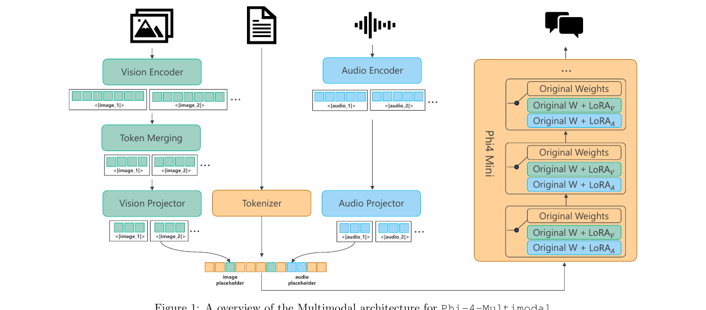

# Phi-4-Mini / Phi-4-Multimodal — Mixture-of-LoRAs 로 만든 작은 멀티모달 모델

## 0. 메타 정보

| 항목 | 내용 |
|---|---|
| **논문 제목** | Phi-4-Mini Technical Report: Compact yet Powerful Multimodal Language Models via Mixture-of-LoRAs |
| **저자** | Microsoft (저자 74명, 대표 연락: hanyh@microsoft.com, youki@microsoft.com) |
| **공개일** | 2025-03-03 (v1) / 2025-03-07 (v2) |
| **분야** | 소형 언어 모델(SLM), 멀티모달(비전+음성), 파라미터 효율적 확장 |
| **논문 링크** | [arXiv abstract](https://arxiv.org/abs/2503.01743) · [PDF](https://arxiv.org/pdf/2503.01743) |
| **공식 블로그** | [Azure Blog — Empowering innovation: The next generation of the Phi family](https://azure.microsoft.com/en-us/blog/empowering-innovation-the-next-generation-of-the-phi-family/) |
| **모델 공개** | Azure AI Foundry / HuggingFace / NVIDIA API Catalog (가중치 공개, 학습 데이터·코드 비공개) |
| **재사용한 외부 모델** | SigLIP-400M(비전 인코더, LLM2CLIP 으로 재조정), 사내 AED ASR 모델(오디오 인코더 초기화), o200k_base tiktoken(토크나이저), Phi-4 합성 데이터 |
| **평가에 쓴 외부 도구** | GPT-4 / GPT-4-0613 (요약·오디오 이해 채점 심판), 사내 TTS(음성 데이터 합성), 사내 ASR(합성 음성 품질 필터링) |

> ⚠️ **시점 주의**: 2025년 3월 자료입니다. 이후 Phi-4-mini-reasoning, Phi-4-mini-flash-reasoning 이 별도 모델로 공개되었으므로, 본 문서의 "추론 강화 버전은 미출시 프리뷰"라는 서술은 발표 당시 기준입니다.

---

## 1. 주요 용어 사전 (Glossary)

> 왜 여기부터? 이 논문은 익숙한 용어(LoRA, GQA)를 조금씩 비틀어 쓰기 때문에, 용어를 먼저 정확히 못 박아두지 않으면 뒤의 수치가 오독되기 쉽습니다.

### 아키텍처 용어

| 용어 | 뜻 |
|---|---|
| **SLM** (Small Language Model) | 작은 언어 모델. 여기선 3.8B 정도. "폰·자동차·엣지에서 돌릴 수 있는 크기"가 목표 |
| **GQA** (Grouped Query Attention) | 질의(query) 헤드는 많이, 키/값(key/value) 헤드는 적게 두고 여러 질의 헤드가 하나의 키/값을 공유하는 attention. **KV 캐시 메모리를 줄이는 게 목적** |
| **KV 캐시** | 생성 중 이미 계산한 key/value 를 저장해두는 메모리. 문맥이 길수록 폭발적으로 커져서 긴 문맥 생성의 병목이 됨 |
| **tied embedding** (입출력 임베딩 공유) | 입력 토큰 임베딩 행렬과 출력 예측층(softmax) 행렬을 같은 파라미터로 씀. 어휘를 크게 키워도 메모리가 두 배로 안 늘어남 |
| **LongRoPE** | RoPE 위치 인코딩을 확장해 문맥 길이를 2M 토큰까지 늘리는 기법. 여기선 128K 문맥 확보에 사용 |
| **fractional RoPE** | RoPE 차원 중 일부(여기선 25%)를 **위치 정보 없이(position-agnostic)** 남겨두는 변형. 긴 문맥에서 위치 외삽을 부드럽게 만듦 |
| **conformer** | convolution + transformer 를 합친 음성 특화 블록. 지역적 음향 패턴(conv)과 장거리 문맥(attention)을 동시에 잡음 |
| **projector** | 인코더가 뽑은 이미지/오디오 특징을 언어 모델의 임베딩 차원(3,072)으로 맞춰주는 작은 MLP. **번역기 역할** |
| **log-Mel filter-bank** | 오디오 파형을 사람 귀의 주파수 감각에 맞춰 변환한 특징. 여기선 80차원, 10ms 프레임 |

### 핵심 개념

| 용어 | 뜻 |
|---|---|
| **LoRA** (Low-Rank Adaptation) | 원본 가중치 W 를 얼려두고, 옆에 작은 저랭크 보정 행렬을 붙여 그것만 학습하는 미세조정 기법 |
| **Mixture-of-LoRAs** | **이 논문의 간판 기법.** 모달리티(비전/오디오)마다 별도 LoRA 를 학습해두고, 입력에 무엇이 들어왔느냐에 따라 해당 LoRA 만 켜서 쓰는 구조 |
| **rank** (LoRA 랭크) | LoRA 보정 행렬의 크기. 클수록 표현력↑ 파라미터↑. **여기선 오디오 LoRA 랭크가 320 으로 이례적으로 큼** (일반적으론 8~64) |
| **frozen backbone** (동결 백본) | 언어 모델 가중치를 학습 내내 건드리지 않음. 텍스트 성능이 **정의상** 100% 보존되는 이유 |
| **dynamic multi-crop** | 이미지를 여러 조각(crop)으로 잘라 해상도를 살리되, 조각 수를 이미지 크기에 맞춰 동적으로 정하는 전략 |
| **token merging** | 이미지 토큰 수를 줄여 언어 모델에 넘기는 압축 단계 |

### 비교 대상 기법

| 기법 | 대표 모델 | 특징 |
|---|---|---|
| **full fine-tuning** (완전 미세조정) | LLaVA, InternVL, Qwen-VL | 언어 모델까지 다 학습. 멀티모달은 강하지만 **원래 텍스트 실력이 손상** |
| **cross-attention 삽입** | Flamingo, Llama-3.2-Vision | 언어 모델은 얼리고 교차 어텐션 층을 추가. **텍스트는 지키지만 비전 성능이 떨어짐** |
| **hybrid joint SFT** | NVLM | 고품질 텍스트 SFT 를 섞어 학습. 제한된 언어 벤치마크만 검증, 후속 학습 단계 미검토 |

### 태스크 약어 (음성)

| 약어 | 태스크 | 지표 |
|---|---|---|
| **ASR** | 음성 인식(받아쓰기) | WER / CER (낮을수록 좋음) |
| **AST** | 음성 번역 | BLEU (높을수록 좋음) |
| **SQA / SQQA** | 음성 문맥 QA / **음성으로 물어보는** QA | 정확도, GPT-4 점수 |
| **SSUM** | 음성 요약(회의록 등) | GPT-4 채점 (일관성/환각) |
| **AU** | 오디오 이해(음악·소리 포함) | 정확도, GPT-4 점수 |

### 학습 기법

| 용어 | 뜻 |
|---|---|
| **rejection sampling** | 여러 개 생성해보고 **틀린 답은 버리고** 맞은 것만 학습 데이터로 씀 |
| **DPO** (Direct Preference Optimization) | "이 답이 저 답보다 낫다"는 선호쌍으로 직접 최적화하는 RLHF 대안 |
| **Roll-Out DPO** | 이 논문의 변형. 모델이 실제로 뱉은 틀린 답을 dis-preferred, 고친 답을 preferred 로 삼아 선호쌍을 만듦 |
| **CoT** (Chain-of-Thought) | 생각의 사슬. 중간 추론 과정을 글로 풀어쓰게 하는 것 |

---

## 2. 논문 요약 (TL;DR)

> 왜 이 절? 논문 전체를 한 문장으로 압축해두면, 뒤의 수치들이 "무엇을 뒷받침하는 증거인지" 헷갈리지 않습니다.

**한 줄**: 3.8B 언어 모델을 **완전히 얼려둔 채**, 모달리티마다 LoRA 어댑터 하나씩만 붙여서 비전·음성을 확장한다 (총 5.6B).

- **핵심 문제**: 작은 모델에 멀티모달을 붙이면 반드시 대가가 따른다. 언어 모델을 통째로 미세조정하면 **원래 텍스트 실력이 망가지고**, cross-attention 을 덧붙이면 텍스트는 지키지만 **비전 성능이 떨어진다.** 자원이 빠듯한 기기에 모달리티별로 모델을 여러 개 띄우는 것도 불가능하다.
- **해결책**: **Mixture-of-LoRAs.** 베이스 언어 모델은 동결하고, 비전용 LoRA(LoRA_V)와 오디오용 LoRA(LoRA_A)를 각각 학습해둔다. 텍스트만 들어오면 LoRA 를 끄고 원본 가중치로 동작 → 텍스트 성능 **정의상 무손실**. 이미지가 오면 LoRA_V, 오디오가 오면 LoRA_A 를 얹는다. 서로의 가중치를 밟지 않으니 **모달리티 간 간섭이 없고**, 새 모달리티 추가도 기존 것을 안 건드린다.
- **검증**:
  - 음성 — **OpenASR 리더보드 WER 6.14 로 1위** (전용 ASR 모델 Whisper-v3, nvidia/canary-1B 를 이김). **최초의 오픈소스 음성 요약 모델**(30분 회의록 통째 처리)
  - 비전 — 13개 벤치마크 평균 72.0 (GPT-4o 72.4 와 대등, 다만 Qwen2.5-VL-7B 73.3 보다는 낮음)
  - vision-speech(이미지+음성 질문) — 평균 72.2 로 InternOmni(62.6)·Gemini-2.0-Flash(66.2)를 큰 폭으로 앞섬
  - 언어 — Phi-4-Mini 3.8B 가 평균 64.9 로 동급 및 2배 크기 모델 대부분을 능가 (Qwen2.5-7B 67.9 제외)

---

## 3. 핵심 기여 (Contributions)

> 왜 이 절? 논문이 스스로 내세우는 것과, 실제로 값진 것이 다를 수 있어서 둘을 구분해 적습니다.

1. **Mixture-of-LoRAs 로 모달리티 확장** — 베이스 언어 모델 완전 동결 + 모달리티별 LoRA. 텍스트 성능 무손실, 모달리티 간 간섭 없음, 확장 용이. **이 논문의 정체성.**
2. **단일 체크포인트로 다중 모달 조합 지원** — text / text+image / speech+audio / speech+image 를 모델 하나로 처리. 기존처럼 모달리티마다 별도 모델을 배포할 필요 없음.
3. **소형 모델의 SOTA급 음성 능력** — 460M LoRA 로 전용 ASR/AST 모델을 추월. 8개 언어 지원.
4. **최초 오픈소스 음성 요약** — 30분 길이 회의 오디오를 자르지 않고 한 번에 넣어 요약 (Qwen2-Audio 는 30초 제한이라 이 태스크 자체가 불가).
5. **소형 모델용 추론(reasoning) 학습 레시피** — "고품질 소량이면 충분"(LIMO/S1)이라는 통념을 반박. **작은 모델은 대규모 CoT 사전학습이 먼저 필요**하다는 증거 제시 (→ 5장 Table 9).
6. **3.8B 언어 모델의 수학·코딩 강세** — MATH 64.0, HumanEval 74.4 로 8B급 모델 대부분을 능가.

**실제로 값진 것 vs 홍보 문구**

| 논문 주장 | 실제 |
|---|---|
| "modality-specific **routers**" | MoE 처럼 학습된 라우터가 아니라, 입력에 이미지/오디오 토큰이 있는지에 따른 **결정적 스위치**. 과장된 표현 |
| "cross-attention 방식보다 우수, full-FT 에 준함" | **같은 조건의 직접 비교 ablation 표가 없음.** 본문 서술로만 주장 |
| "LoRA 라 가볍다" | 오디오 LoRA rank **320** = 460M. 추가 파라미터 총 1.7B(전체의 30%). "저랭크 보정"이라기보다 **병렬로 붙인 두 번째 모델**에 가까움 |

---

## 4. 아키텍처와 알고리즘

> 왜 이 절? 이 논문의 값어치는 아이디어보다 **구체적 수치 선택**(랭크 320, 80ms 토큰, crop 상한 16/36)에 있습니다. 그대로 따라 하려면 숫자를 알아야 합니다.



*Figure 1: 이미지/오디오는 각자의 인코더 → 프로젝터를 거쳐 텍스트 토큰 사이의 placeholder 자리에 끼워 넣어진다. 오른쪽 Phi-4-Mini 블록에서 원본 가중치(Original Weights)는 그대로 두고, 입력 모달리티에 따라 `W + LoRA_V` 또는 `W + LoRA_A` 로 스위치된다.*

### 4.1 언어 백본 (Phi-4-Mini, 3.8B)

| 항목 | 값 | 왜 이렇게? |
|---|---|---|
| 층 수 | 32 | — |
| hidden size | 3,072 | — |
| attention | **GQA: query head 24 / KV head 8** | KV 캐시가 표준 대비 **1/3** → 긴 문맥 생성 비용 절감 |
| 임베딩 | **tied** (입출력 공유) | 어휘를 3배 키우면서도 메모리 절약 |
| 토크나이저 / 어휘 | o200k_base, **200,064** | 다국어·멀티모달 입출력을 토큰 적게 표현 |
| 문맥 길이 | **128K** (LongRoPE) | — |
| RoPE | **fractional RoPE — 헤드 차원의 25% 를 위치 무관(position-agnostic) 으로 남김** | 긴 문맥을 부드럽게 처리 |
| 학습률 결정 | `LR* (D) = B · D^(-0.32)` 스케일링 법칙 (B 는 튜닝 상수, D 는 총 학습 토큰 수) | D = 12.5B / 25B / 37.5B / 50B 에서 B 를 피팅해 최적 peak LR 추정 |

### 4.2 비전 모듈 (추가 810M)

```
이미지 → SigLIP-400M (448×448, LLM2CLIP 재조정)
       → Token Merging (토큰 수 압축)
       → 2-layer MLP Projector (→ 3,072차원)
       → 텍스트 시퀀스의 <image> placeholder 자리에 삽입
```

- **파라미터**: 인코더+프로젝터 **440M**, `LoRA_V` **370M** (언어 디코더의 **모든 linear 층**에 부착)
- `LoRA_V` 는 **SFT 단계에서만** 붙임 (사전학습 땐 없음)
- **dynamic multi-crop**: 조각 수 = `ceil(H/C) × ceil(W/C)` (H,W = 이미지 높이·너비, C = crop 크기)
  - 총 조각 수가 상한(**사전학습 16, SFT 36**) 이내면 → 그 조각 수에 맞게 이미지를 살짝만 리사이즈
  - 상한을 넘으면 → InternVL2 방식(가장 잘 맞는 종횡비 찾기)으로 폴백
  - **InternVL2 대비 이점**: 28×448 같은 **극단적으로 가로로 긴 작은 이미지를 억지로 크게 늘리지 않음**
- 최대 이미지 해상도 상한: 1344×1344 (사전학습 데이터 대부분이 이보다 작음)

### 4.3 음성/오디오 모듈 (추가 920M)

```
오디오 → 80-dim log-Mel (10ms 프레임)
       → conv 3층 + conformer 24블록 (attention 1024, FFN 1536, head 16)
         └ conv 가 8배 서브샘플링 → 토큰 1개 = 80ms
       → 2-layer MLP Projector (1024 → 3,072)
       → <audio> placeholder 자리에 삽입
```

- **파라미터**: 인코더+프로젝터 **460M**, `LoRA_A` **460M** (rank **320**, 모든 attention + MLP 층)
- **토큰 레이트**: 80ms/토큰 → **1분 오디오 = 750 토큰**
  - 30초 = 375 토큰 (일반 태스크 학습 상한)
  - 30분 = 22.5K 토큰 (요약 태스크 학습 상한)
  - 128K 문맥 → 이론상 **2.8시간** 오디오 (단, 저자들이 직접 "그 길이로 미세조정한 적 없어 실사용엔 추가 학습 필요"라고 인정)
- **오디오 인코더 초기화**: 사내 AED(attention-based encoder-decoder) ASR 모델의 사전학습 인코더

### 4.4 전체 파라미터 회계 (왜 5.6B 인가)

| 구성 | 파라미터 |
|---|---|
| Phi-4-Mini 백본 (동결) | 3.8B |
| 비전 인코더 + 프로젝터 | 0.44B |
| `LoRA_V` | 0.37B |
| 오디오 인코더 + 프로젝터 | 0.46B |
| `LoRA_A` | 0.46B |
| **합계** | **≈ 5.6B** |

**주목**: 추가된 1.73B 중 **0.83B(절반)가 LoRA** 입니다. rank 320 은 흔한 LoRA rank(8~64)의 5~40배로, "저랭크(low-rank) 보정"이라는 이름값과 실제 파라미터 예산 사이에 괴리가 큽니다.

### 4.5 학습 파이프라인

**① 언어 (Phi-4-Mini)**
- 사전학습: **5T 토큰** (Phi-3.5-Mini 대비 개선점 4가지 — ① 품질 분류기 강화 ② 수학/코딩 데이터 증강 ③ Phi-4 합성 데이터 투입 ④ 데이터 혼합비 재조정, 특히 **추론 데이터 비중 상향**)
- 후처리 학습: 함수 호출(function calling)·요약 데이터 대폭 확대, 지시 따르기 합성 데이터, **코드 중간 채우기(fill-in-the-middle)** 데이터

**② 비전 — 4단계**

| 단계 | 학습하는 것 | 동결하는 것 | 목적 |
|---|---|---|---|
| 1. Projector Alignment | 프로젝터만 | 인코더, LM | 캡션 데이터로 비전-텍스트 임베딩 정렬 (인코더 표현 보존) |
| 2. Joint Vision Training | 프로젝터 + 비전 인코더 | LM | OCR·조밀(dense) 이해 능력 강화 |
| 3. Generative VL Training | + **`LoRA_V` 부착** | LM 원본 | 단일 프레임 SFT 로 생성 능력 부여 |
| 4. Multi-Frame Training | `LoRA_V` 등 | **비전 인코더** | 멀티 이미지·시간적 이해, **문맥 64K 로 확장** |

- 데이터: 사전학습 **0.5T 토큰**(인터리브 문서, 이미지-텍스트 쌍, grounding, PDF OCR 합성, 차트 합성) — 이때 **이미지 토큰에는 loss 를 걸지 않고 다음 텍스트 토큰 예측만** 함. SFT **0.3T 토큰**

**③ 음성 — 2단계**

| 단계 | 학습 | 동결 | 설정 |
|---|---|---|---|
| 사전학습 | 오디오 인코더 + 프로젝터 | **LM** | ASR 데이터 **200만 시간**, LR 4e-5, 50k step |
| 후처리 학습 | 오디오 프로젝터 + **`LoRA_A`** | **오디오 인코더**, LM | SFT **100M 샘플**(가중치 적용), LR 1e-4, 50k step |

> **왜 2단계가 필요한가**: 사전학습만 끝낸 모델은 **받아쓰기(ASR)밖에 못 합니다.** 지시 따르기 능력을 여는 게 2단계의 역할입니다.

- SFT 포맷: `<|user|><audio>{task prompt}<|end|><|assistant|>{label}<|end|>` — task prompt 는 자연어 태스크 설명이며, **SQQA(음성으로 물어보는 QA)에서는 null**(음성 자체가 질문이므로)

**④ vision-speech 결합 학습** (비전·음성 후처리 학습 이후 수행)
- **동결**: LM, 오디오 인코더, 오디오 프로젝터
- **학습**: `LoRA_V`, 비전 인코더, 비전 프로젝터
- 데이터: vision-language SFT 의 텍스트 질문을 **사내 TTS 로 음성 변환**해 합성. 만든 음성을 다시 **사내 ASR 로 받아써 WER 를 재고, WER 기준으로 품질 필터링**. 소리 내어 읽기 부적절한 데이터셋은 사전 배제
- 성능 유지를 위해 언어·비전 후처리 데이터도 일부 섞음

**⑤ 추론(reasoning) 강화 — 3단계** (별도 실험 모델, 공식 Phi-4-Mini 체크포인트에는 미적용)

| 단계 | 내용 |
|---|---|
| 1. CoT 사전학습 | 프론티어 추론 LLM 이 생성한 **CoT 토큰 약 60B**. rejection sampling(규칙 기반 + 모델 기반)으로 틀린 생성 폐기 후 재샘플링 |
| 2. 큐레이션 SFT | **200K 고품질 CoT 샘플** (다양한 도메인·난이도 커버) |
| 3. **Roll-Out DPO** | 걸러낸 오답을 dis-preferred, 고친 답을 preferred 로 삼아 **300K 선호쌍** 구성 후 DPO |

---

## 5. 실험 요약

> 왜 이 절? 표가 많지만 실제로 결론을 바꾸는 건 몇 개뿐입니다. 그것만 골라 배치했습니다.

### 5.1 비전-언어 (Table 1, 13개 벤치마크 평균)

| 모델 | 크기 | 평균 |
|---|---|---|
| **Phi-4-Multimodal** | **5.6B** | **72.0** |
| Phi-3.5-Vision (직전 모델) | 4.2B | 60.9 |
| Qwen2.5-VL-3B | 3.8B | 68.7 |
| InternVL2.5-4B | 3.7B | 68.8 |
| **Qwen2.5-VL-7B** | 8.3B | **73.3** ← 여전히 더 높음 |
| Gemini-2.0-Flash | — | 74.3 |
| Claude-3.5-Sonnet | — | 69.1 |
| GPT-4o | — | 72.4 |

- **강한 곳**: ScienceQA 97.5, DocVQA 93.2, OCRBench 84.4, ChartQA 81.4 — 차트·문서·과학 추론
- **읽는 법**: "GPT-4o 와 대등"은 사실이나, 같은 표에서 **Qwen2.5-VL-7B 가 더 높다**는 점도 같이 봐야 합니다. 5.6B 치고 훌륭한 것이지 오픈소스를 압도하는 게 아닙니다.

### 5.2 vision-speech (Table 2) — 여기가 진짜 격차

이미지 + **음성으로 된 질문**을 함께 처리하는 태스크. InternOmni 벤치마크 4종.

| 모델 | 크기 | 평균 |
|---|---|---|
| **Phi-4-Multimodal** | **5.6B** | **72.2** |
| InternOmni | 8.7B | 62.6 |
| Gemini-2.0-Flash-Lite | — | 58.2 |
| Gemini-2.0-Flash | — | 66.2 |

ShareGPT4o_AI2D 68.9 vs InternOmni 53.9, ChartQA 69.0 vs 56.1 — **10점 이상 격차.** 두 모달리티를 동시에 다루는 능력이 이 논문의 가장 뚜렷한 우위입니다.

### 5.3 음성 (Table 3, 4)

| 태스크 | 지표 | Phi-4-MM (5.6B) | Whisper-v3 | Qwen2-audio (8B) | Gemini-2.0-Flash | GPT-4o |
|---|---|---|---|---|---|---|
| ASR (OpenASR) | WER ↓ | **6.14** | 7.44 | 7.43 | 8.56 | 15.76 |
| ASR (FLEURS) | WER ↓ | **4.00** | 4.58 | 8.28 | 4.73 | 5.42 |
| AST (CoVoST2 X-EN) | BLEU ↑ | **39.33 (CoT 40.76)** | 33.26 | 34.8 | 36.62 | 37.09 |
| **SQQA (MMMLU)** | ACC ↑ | **38.50** | N/A | 15.53 | **72.31** | **72.56** |
| SSUM (AMI) | 1–7 ↑ | **6.29** | N/A | 1.34 | 5.97 | 6.53 |
| AU (MMAU) | ACC ↑ | 55.56 | N/A | 52.50 | **61.23** | 53.29 |

- **OpenASR 리더보드 1위** (2025-01-14 기준). 당시 1위 nvidia/canary-1B(6.50) 대비 **상대 WER 5.5% 개선**
- **ASR 프롬프트가 언어 불문 단순**: "Transcribe the audio clip into text." — 언어 정보를 안 줘도 됨. 반면 Qwen2-audio·Gemini 는 목표 언어를 프롬프트에 명시해야 최적 성능이 나오고, **GPT-4o 는 프롬프트에 극도로 민감**(저자들이 여러 프롬프트를 시도해야 했음)
- **AST 에서 CoT 디코딩(먼저 받아쓰고 → 번역)이 BLEU 1~2점 개선**
- ❌ **SQQA MMMLU 38.5 vs Gemini/GPT-4o 72+** — **거의 두 배 차이.** 논문도 인정: 대화형 잡담(MT-Bench 7.05)은 되지만 **지식·추론이 필요한 음성 질문은 3.8B 백본의 한계**가 그대로 드러남
- SSUM(음성 요약)은 학습 데이터의 **1%** 만 썼는데 GPT-4o 에 근접 — 데이터 더 넣으면 격차가 쉽게 줄 거라는 게 저자 주장

### 5.4 언어 (Table 7, 8)

| 모델 | 크기 | 언어 평균 | 코딩 평균 |
|---|---|---|---|
| **Phi-4-Mini** | **3.8B** | **64.9** | **49.0** |
| Phi-3.5-Mini | 3.8B | 62.3 | 44.7 |
| Llama-3.2-3B-Ins | 3B | 58.0 | 39.5 |
| Qwen2.5-3B-Ins | 3B | 61.4 | 42.6 |
| Qwen2.5-7B-Ins | 7B | **67.9** | **52.2** |
| Llama-3.1-8B | 8B | 63.9 | 41.2 |
| Gemma2-It | 9B | 66.0 | 45.3 |

- **수학이 압도적**: MATH 64.0 (Llama-3.1-8B 47.6, Gemma2-9B 51.3), GSM-8K 88.6
- 코딩 9개 벤치마크에서 **Qwen2.5-7B 를 제외한 모든 3B·8B 모델을 평균으로 능가**
- 약점: Multilingual-MMLU 49.3 — 8B·9B 모델(56~64)에 뒤짐 (→ 6장 한계)

### 5.5 ⭐ 추론 학습 ablation (Table 9) — 논문에서 가장 값진 표

| 단계 | AIME | MATH-500 | GPQA Diamond |
|---|---|---|---|
| Phi-4-Mini 원본 | 10.0 | 71.8 | 36.9 |
| + CoT 60B 토큰 증류 **사전학습** | 30.0 | 82.9 | 42.6 |
| + 200K 큐레이션 **SFT** | 43.3 | 89.3 | 48.3 |
| + **Roll-Out DPO** (최종) | **50.0** | **90.4** | **49.0** |

비교군: DeepSeek-R1-Distill-Qwen-7B **53.3** / DeepSeek-R1-Distill-Llama-8B **43.3** / Bespoke-Stratos-7B 20.0 / OpenThinker-7B 31.3 / o1-mini 63.6

**이 표가 말하는 것**:
1. **3.8B 가 R1-Distill-Llama-8B(8B)를 능가하고, R1-Distill-Qwen-7B 에 근접.**
2. 더 중요한 건 **1단계의 기여**: AIME 10.0 → 30.0. **LIMO·S1 의 "고품질 소량 SFT 면 충분" 주장과 정면 충돌.** 저자 반론은 명확합니다 — **작은 모델(SLM)은 일반적인 추론 사슬을 몸에 익히는 대규모 사전학습이 먼저 필요하고, 소량 SFT 는 그 위에서만 작동한다.**

### 5.6 안전성 (Table 10~15)

| 항목 | 결과 |
|---|---|
| 유해 콘텐츠 결함률 (텍스트) | Phi-4-Mini **3.75%** / Phi-4-MM 4% — GPT-4o-mini(4.25%), Qwen2.5-3B(4.25%), Llama-3.2-3B(5%) 대비 양호 |
| **탈옥(jailbreak) 시 결함률** | Phi-4-Mini **1.25%** / Phi-4-MM 2.25% — Phi-3.5-mini(7.5%), **Qwen2.5-3B(14%)** 대비 크게 견고 |
| 유해 프롬프트 거절률 (IPRR ↑) | 93.5% / 92% — 양호 |
| 무해 프롬프트 오거절률 (VPRR ↓) | 20.8% / **26.4%** — 멀티모달 쪽이 **과도하게 조심스러움** |
| ⚠️ **음성 민감 속성 추론 (ISA)** | **목소리만 듣고 인종·성적 지향·정치성향 등을 추론한 비율 27%** (Qwen2-Audio 49%). 시스템 프롬프트로 0.4%까지 억제 가능 |

> **ISA 27% 를 어떻게 읽어야 하나**: "시스템 프롬프트로 0.4% 로 낮출 수 있다"를 뒤집으면 **프롬프트를 안 걸면 기본값이 위험하다**는 뜻입니다. 저자들도 오디오 안전 데이터가 **음성만 있고 비음성 소리는 없으며, 오디오 전용 탈옥에 대해선 학습하지 않았다**고 인정합니다.

---

## 6. 한계와 비판적 검토

> 왜 이 절? 가중치가 공개된 모델이라 실제로 쓸 사람이 많습니다. 쓰기 전에 알아야 할 함정을 모았습니다.

### 논문이 스스로 밝힌 한계
1. **사실 암기 부족** — 모델 크기 탓에 올림픽 결과 같은 구체적 사실을 기억 못 함
2. **다국어 성능 저하** — **코딩 데이터를 강조하느라 다국어 데이터 비중을 줄였고, 그 결과 영어 외 언어 성능이 떨어졌다**고 직접 인정
3. **음성은 8개 언어만** (중국어, 영어, 프랑스어, 독일어, 이탈리아어, 일본어, 포르투갈어, 스페인어)
4. **2.8시간 오디오는 미검증** — 128K 문맥으로 계산상 가능하지만 그 길이로 학습한 적 없음
5. 생체 정보로 개인을 분류하는 용도로 설계되지 않음

### 문서 작성자의 비판
1. **⭐ 핵심 주장의 증거가 없다** — "LoRA 가 cross-attention 보다 낫고 full-FT 에 준한다"가 이 논문의 존재 이유인데, **같은 조건에서 셋을 비교한 ablation 표가 없습니다.** 본문 서술로만 주장합니다. 리뷰어라면 가장 먼저 찌를 지점.
2. **"저비용 어댑터" 서사의 균열** — rank 320, 추가 파라미터 1.7B(전체의 30%). 이게 full-FT 대비 정말 싼 건지, 아니면 "텍스트 가중치를 안 덮어쓰는 병렬 모델"인지 논문은 구분해주지 않습니다.
3. **"router" 라는 이름의 과장** — 학습된 라우팅이 아니라 결정적 스위치입니다 (→ 3장).
4. **재현 불가** — 사전학습 5T 토큰, 음성 200만 시간, SFT 100M 샘플 대부분이 사내(in-house) 데이터. 가중치는 열었지만 레시피는 못 따라 합니다.
5. **비전+음성 동시 입력 시 LoRA 합성 방식이 모호** — vision-speech 결합 학습에서 `LoRA_V` 만 갱신했는데, 추론 시 두 LoRA 를 동시에 어떻게 합치는지(합산? 순차 적용?) 명시가 없습니다.
6. **추론 강화 버전은 당시 미출시 프리뷰** — Table 9 를 발표 시점엔 독립 검증할 수 없었습니다.

---

## 7. 💬 Q&A

### Q1. 왜 하필 LoRA 인가? 다른 방법은 왜 안 되나?

세 방법의 트레이드오프를 한 장으로 정리하면:

| 방식 | 텍스트 성능 | 멀티모달 성능 | 모달리티 간 간섭 | 확장성 |
|---|---|---|---|---|
| full fine-tuning | ❌ **손상됨** | ✅ 최고 | ❌ 있음 (한 몸에 다 넣으므로) | ❌ 새 모달리티 = 재학습 |
| cross-attention | ✅ 보존 | ❌ **떨어짐** | 🔶 | 🔶 |
| **Mixture-of-LoRAs** | ✅ **정의상 무손실** | ✅ 준수 | ✅ **없음** (가중치 분리) | ✅ **LoRA 추가만 하면 됨** |

핵심은 **"텍스트만 들어오면 LoRA 를 끈다"**는 한 줄입니다. 원본 가중치로 그대로 돌아가니 텍스트 성능은 검증할 필요조차 없이 100% 보존됩니다. 이건 논증이 아니라 **구조적 보장**입니다.

### Q2. 오디오 LoRA 랭크가 320 이면 그냥 모델 하나 더 붙인 거 아닌가?

거의 맞습니다. 파라미터로 보면 `LoRA_A` 460M = 오디오 인코더(460M)와 **같은 크기**입니다. 흔한 LoRA rank 가 8~64 인 걸 생각하면 5~40배죠.

다만 **저랭크냐 아니냐는 사실 부차적**이고, LoRA 를 쓴 진짜 이유는 파라미터 절약이 아니라 **"원본 가중치를 물리적으로 안 건드린다"**는 점입니다. 즉 이 논문에서 LoRA 는 *압축 기법*이 아니라 **격리(isolation) 기법**입니다. 그렇게 읽으면 rank 320 도 앞뒤가 맞습니다 — 성능을 위해 표현력은 충분히 주되, 텍스트 경로만은 절대 오염시키지 않겠다는 선택이니까요.

논문이 "LoRA 라서 가볍다"는 뉘앙스를 풍기는 건 그래서 다소 기만적입니다.

### Q3. 음성이 비전보다 훨씬 인상적인 이유는?

| | 비전 | 음성 |
|---|---|---|
| 결과 | 평균 72.0 — 좋지만 Qwen2.5-VL-7B(73.3)에 밀림 | **OpenASR 1위**, 전용 모델(Whisper-v3, canary-1B) 추월 |
| 왜? | 비전-언어는 이미 경쟁이 치열하고 오픈소스 수준이 높음 | ASR **200만 시간** 정렬 사전학습 + conformer 인코더의 조합이 전용 모델급 |
| 배울 점 | 5.6B 로 GPT-4o 급이면 충분히 쓸 만함 | **어댑터만으로 전용 태스크 모델을 이길 수 있다**는 실증 |

**교훈**: 음성은 "인코더를 대규모 ASR 로 제대로 정렬해두면, 언어 모델 쪽은 어댑터로 충분하다"는 구조가 성립합니다. 비전은 그만큼 극적이지 않습니다.

### Q4. SQQA 점수가 왜 그렇게 낮나? (38.5 vs GPT-4o 72.6)

SQQA(Spoken Query QA)는 **음성으로 물어보는 지식 질문**입니다. 여기서 필요한 건 음성 처리 능력이 아니라 **백본의 지식과 추론력**이고, 3.8B 는 거기서 GPT-4o 를 이길 방법이 없습니다.

증거가 깔끔합니다:
- MT-Bench(대화형 잡담): 7.05 vs GPT-4o 8.11 → **격차 작음**
- MMMLU(지식·추론): 38.5 vs GPT-4o 72.56 → **격차 거의 2배**

즉 **음성 인터페이스는 훌륭한데 그 뒤의 두뇌가 작다**는 뜻입니다. 논문 자신도 "SQQA 대화 데이터를 더 많이 가중했기 때문"이라고 설명하지만, 근본 원인은 모델 크기입니다.

### Q5. 실제로 이 모델을 쓴다면 어디에?

**잘 맞는 곳**
- **온디바이스 음성 처리** — 회의 녹음 받아쓰기·요약·번역. 30분 오디오 통째 처리가 되는 오픈소스는 당시 이것뿐
- 문서·차트·OCR 이해 (DocVQA 93.2, OCRBench 84.4)
- 텍스트 성능을 절대 희생하면 안 되는 제품 — LoRA 를 끄면 순수 Phi-4-Mini 로 돌아옴
- 수학·코딩 보조 (MATH 64.0, HumanEval 74.4)

**피해야 할 곳**
- 음성으로 지식을 묻는 어시스턴트 (SQQA 참사)
- 영어·8개 지원 언어 밖의 다국어
- 사실 암기가 중요한 태스크
- **음성 입력 서비스라면 시스템 프롬프트로 민감 속성 추론(ISA)을 반드시 막아야 함** (→ 5.6절)

---

## 8. 한 줄 요약 (전체)

> **언어 모델을 통째로 얼려두고 모달리티마다 LoRA 하나씩만 붙이면(Mixture-of-LoRAs), 텍스트 성능을 한 점도 잃지 않고 비전·음성을 확장할 수 있다** — 3.8B 백본 + 1.7B 어댑터로 OpenASR 1위와 GPT-4o급 비전을 동시에 달성한 5.6B 모델. 다만 핵심 주장(LoRA > cross-attention ≈ full-FT)의 직접 비교 ablation 이 없고, 백본이 작아 지식형 음성 QA 에서는 무너진다.

---

## 9. 관련 문서

- [[reference_pretrained_backbone_reuse_landscape]] — 사전학습 백본 재사용 패러다임. 이 논문은 **"백본 동결 + 어댑터 확장"** 분기의 대표 사례
- [PAPER_Gemma-4.md](PAPER_Gemma-4.md) — 오픈웨이트 멀티모달 LLM. Gemma 는 encoder-free 방향, Phi-4-MM 은 인코더+어댑터 방향으로 대비됨
- [PAPER_HiDream-O1-Image.md](PAPER_HiDream-O1-Image.md) — 가중치 **완전 공유** 통합 모델. Phi-4-MM 의 **완전 분리(LoRA)** 와 정반대 극단
- [PAPER_SenseNova-U1.md](PAPER_SenseNova-U1.md) — MoT(모달리티별 가중치 완전 분리 + attention 공유). Phi-4-MM 과 같은 "분리" 철학이지만 훨씬 무거움
