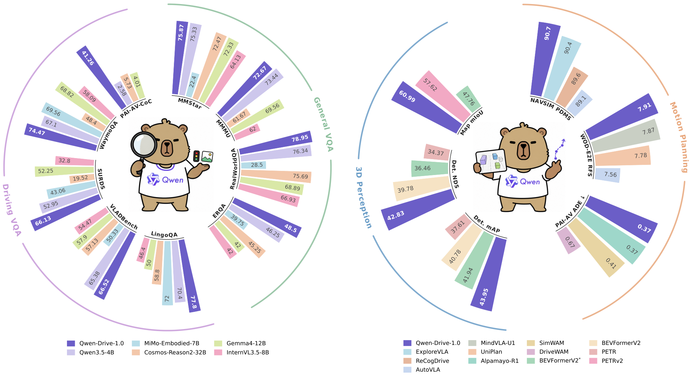
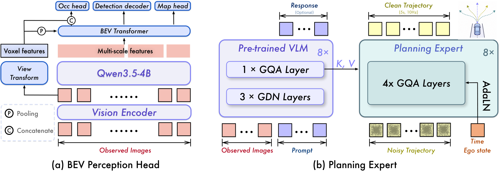
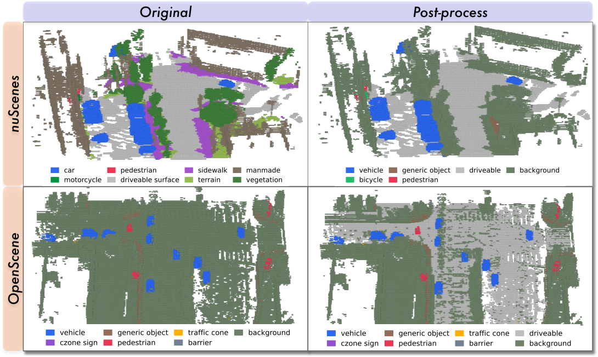
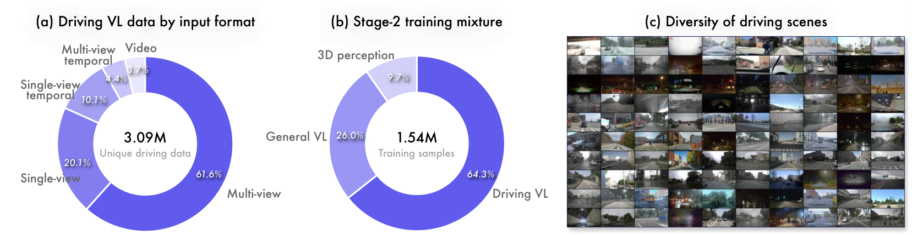
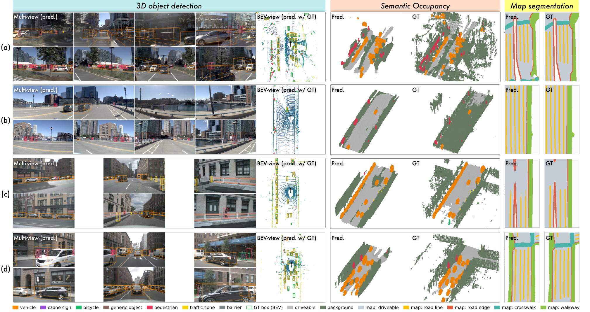
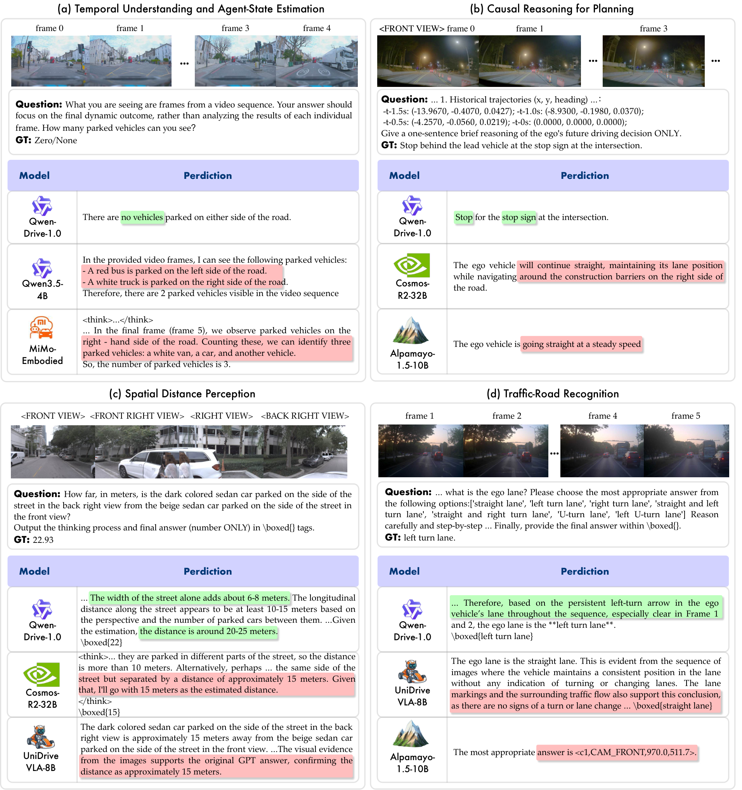
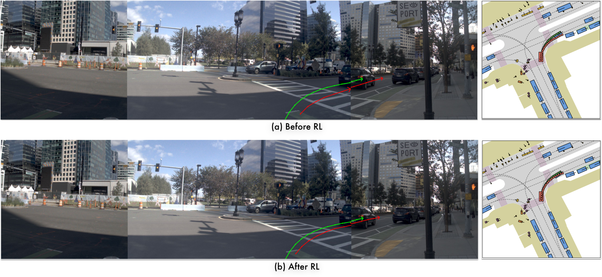
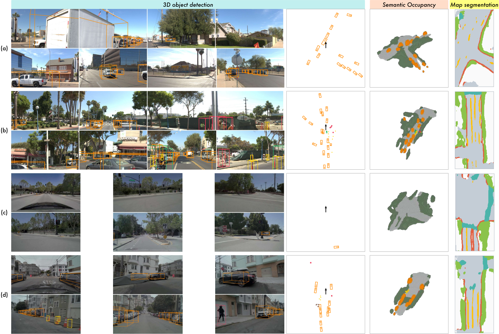

# Qwen-Drive-1.0: An Initial Step towards a Vision-Language Foundation Model for Autonomous Driving

## 📋 메타 정보

| 항목 | 내용 |
|---|---|
| **논문 제목** | Qwen-Drive-1.0: An Initial Step towards a Vision-Language Foundation Model for Autonomous Driving |
| **저자** | Qwen Team (Alibaba) + 화중과학기술대(HUST). 핵심 기여자: Xin Zhou, Zongchuang Zhao, Zhibo Yang†, Mingsheng Li, Humen Zhong, Shuai Bai, Dingkang Liang✉, Xiang Bai✉, Dayiheng Liu† (†Project Leader, ✉교신저자) |
| **공개일** | 2026-08-31 (arXiv v1), cs.CV |
| **분야** | 자율주행(autonomous driving) VLA, BEV 3D perception(3D 인식), motion planning(경로 계획), flow matching, RL |
| **논문 링크** | [arXiv abstract](https://arxiv.org/abs/2609.00111) · [PDF](https://arxiv.org/pdf/2609.00111) · [HTML](https://arxiv.org/html/2609.00111v1) |
| **코드/모델** | [GitHub](https://github.com/QwenLM/Qwen-Drive-1.0) · [HuggingFace](https://huggingface.co/Qwen/Qwen-Drive-1.0-4B) · [ModelScope](https://modelscope.cn/models/Qwen/Qwen-Drive-1.0-4B) · **Apache 2.0** |
| **공개 범위** | ⚠️ **추론(inference) 코드만**. 학습 코드·데이터 파이프라인·RL 전부 미공개 |
| **사용한 외부 재료** | Qwen3.5-4B (공유 VLM 백본) · Qwen3.5-Plus / Qwen3.7-Plus / Qwen3.5-Flash (데이터 재작성·필터·심판, 전부 **비공개 API**) · nuScenes / nuScenes-OccNet / OpenScene(nuPlan) (인식 학습) · NAVSIM / WOD-E2E / PhysicalAI-AV (계획 학습) · 공개 주행 VQA 24종 |
| **가중치 구성** | VLM 9.1GB + planner-sft 2.1GB + planner-rl 2.1GB + perception 0.5GB |
| **문서 성격** | ⚠️ **Related Work 절이 아예 없는 릴리스 리포트**. 참고문헌 105편은 전부 본문 인라인. 자체 설계 요소 대부분에 ablation 없음 |


*Figure 1 — 주행 VQA·일반 VQA·3D 인식·경로 계획 4축 성능 개요*

---

## 📖 주요 용어 사전 (Glossary)

### 자율주행 기본 개념

- **BEV (Bird's Eye View, 새가 위에서 내려다본 시점)**: 차를 중심으로 한 평평한 지도 형태의 좌표계. **촬영하는 것이 아니라 계산해서 만드는 것** — 차 위 10m에 카메라는 없다. 원근 이미지에서는 같은 차가 거리에 따라 크기가 변하지만, BEV에서는 4.5m 차가 어디 있든 4.5m다. 자세한 설명은 §Q&A Q2.
- **rig(리그, 카메라 배치)**: 차량에 카메라가 몇 대, 어느 위치에, 어떤 각도로 달렸는지의 구성. nuScenes는 6대, OpenScene은 8대라서 두 데이터셋을 한 모델로 다루는 것이 이 논문의 숙제 중 하나.
- **calibration(캘리브레이션)**: 픽셀 하나를 3D 광선(ray)으로 바꾸기 위한 정보. **intrinsic(내부 파라미터)** = 초점거리 fx, fy와 광학중심 cx, cy(렌즈가 세상을 어떻게 찌그러뜨리는가), **extrinsic(외부 파라미터)** = 카메라가 차체 기준 어디에 어떤 각도로 붙었는가.
- **ego frame(자차 좌표계)**: 자기 차를 원점으로 하는 좌표계. x는 앞, y는 왼쪽, heading은 왼쪽으로 돌면 양수.
- **occupancy(점유, 의미론적 점유격자)**: 공간을 복셀(voxel, 3D 격자칸)로 쪼개서 "이 칸이 차 있나 비었나, 차 있다면 무엇인가"를 답하는 표현. 검출(detection)이 아는 물체만 잡는 데 반해, occupancy는 **정체를 몰라도 "저기 뭔가 있으니 피해라"**를 말해준다.
- **open-loop / closed-loop(개루프 / 폐루프)**: 개루프는 한 장면에 한 번만 예측하고 기록된 정답과 비교. 폐루프는 예측한 대로 차를 움직여서 **바뀐 장면을 다시 보고 또 예측** — 오차가 누적되므로 훨씬 어렵다. 그 중간이 pseudo-closed-loop(유사 폐루프).

### 아키텍처

- **VLM (Vision-Language Model, 시각-언어 모델)**: 이미지와 텍스트를 같이 받아 텍스트를 뱉는 모델. 여기선 Qwen3.5-4B.
- **VLA (Vision-Language-Action)**: VLM에 "행동(궤적·제어)" 출력을 얹은 계열. 이 논문이 속한 갈래.
- **GQA (Grouped-Query Attention, 그룹 질의 어텐션)**: 여러 query head가 Key/Value head 하나를 나눠 쓰는 어텐션. Qwen3.5는 **gated linear attention과 GQA softmax attention을 번갈아** 쓰고, 이 논문은 그중 **GQA softmax 층 8개의 KV 캐시만** 가져다 쓴다.
- **KV cache(키·밸류 캐시)**: 모델이 프롬프트를 읽으면서 이미 계산해둔 Key/Value. 원래는 생성 속도를 위한 재활용 장치인데, 이 논문은 이걸 **"장면 요약본"으로 재해석해 궤적 생성기에 먹인다**.
- **joint attention(합동 어텐션)**: cross-attention처럼 분리하지 않고, 자기 Key/Value와 상대 Key/Value를 **이어붙여 한 번에** attention하는 방식.
- **RoPE (Rotary Position Embedding) / mRoPE**: 토큰 위치를 회전 각도로 주입하는 방식. m은 multimodal — 시간·세로·가로 축을 나눠 배정. 이 논문은 궤적 토큰을 **프롬프트 마지막 토큰 바로 다음 번호**에 꽂아 "말이 이어지는" 것처럼 만든다.
- **adaLN (adaptive Layer Normalization, 적응형 층 정규화)**: 조건(시간·명령 등)으로부터 shift·scale·gate를 만들어 정규화에 주입하는 방식. Diffusion Transformer의 표준 조건 주입법.
- **DETR-style decoder(집합 예측 디코더)**: 정해진 개수의 object query가 특징을 반복해서 긁어와 박스를 뽑는 방식. NMS(중복 제거 후처리)가 필요 없고, 정답 매칭은 Hungarian algorithm(헝가리안 알고리즘)으로 1:1 대응시킨다.
- **deformable attention(변형 가능 어텐션)**: 전체 특징맵을 다 보지 않고, 각 query가 **몇 개 지점만 골라서** 샘플링하는 어텐션. 고해상도 특징에서 계산량을 줄이는 표준 수단.
- **FPN (Feature Pyramid Network, 특징 피라미드)**: 한 해상도의 특징을 여러 배율로 펼쳐 다중 스케일을 만드는 구조. 여기선 4.0/2.0/1.0/0.5배.

### 인식(perception) 관련

- **depth-based view transform(깊이 기반 시점 변환, Lift-Splat 계열)**: 픽셀마다 깊이 확률분포를 예측해서, 그 확률만큼 특징을 광선을 따라 3D에 뿌리는(splat) 방식. **깊이 정답 없이(without depth supervision)** 학습하는 것이 이 논문의 선택.
- **ASPP (Atrous Spatial Pyramid Pooling)**: 여러 팽창률(dilation)의 컨볼루션을 병렬로 걸어 넓은 수용영역을 얻는 모듈. DepthNet 내부에 들어감.
- **UVTR / voxel pooling(복셀 풀링)**: 광선 위에 뿌린 특징들을 3D 복셀 격자에 누적하는 연산. 이 저장소는 전용 CUDA 커널로 구현.
- **Lovász-softmax loss**: IoU(교집합/합집합)를 직접 최적화하기 위한 대리 손실. 분할(segmentation)에서 표준.
- **Scene-Class Affinity loss (MonoScene)**: 기하(geo)와 의미(sem) 각각에 대해 precision/recall/specificity를 동시에 밀어주는 손실.
- **RayIoU**: occupancy 평가 지표. 라이다처럼 광선을 쏘아 처음 부딪히는 복셀을 비교. **광선 원점 높이가 결과를 좌우**한다(§인식 데이터 참조).
- **mAP / NDS**: 3D 검출 지표. NDS(nuScenes Detection Score)는 mAP에 위치·크기·방향·속도·속성 오차를 섞은 종합 점수. 이 논문은 통합 라벨에 속성이 없어 **mAAE(속성 오차)를 0으로 두고 재정의**해 씀.

### 계획(planning)·생성 관련

- **flow matching(흐름 매칭)**: 노이즈에서 데이터로 가는 직선 경로를 정의하고, 그 경로 위 속도장(velocity field)을 배우는 생성 기법. Diffusion의 사촌.
- **x-prediction / endpoint parameterization(끝점 파라미터화)**: 속도나 노이즈가 아니라 **깨끗한 정답 자체**를 예측하는 방식. 속도는 (예측 끝점 − 현재) / (1−t)로 유도.
- **Euler solver(오일러 적분기)**: 속도장을 따라 조금씩 전진하며 노이즈를 데이터로 바꾸는 가장 단순한 수치 적분. 이 논문은 10스텝.
- **waypoint(경유점)**: 궤적을 이루는 개별 시점의 위치·방향. 여기선 5초를 10Hz로 쪼갠 50개.
- **ADE / minADE / FDE**: Average Displacement Error(평균 변위 오차) = 예측과 정답의 시점별 거리 평균. min은 여러 후보 중 최선 — **정답을 봐야 고를 수 있으니 oracle(신탁) 상한선**. FDE는 마지막 시점 오차.
- **PDMS (Predictive Driver Model Score)**: NAVSIM의 종합 점수. 무충돌(NC)·주행가능영역 준수(DAC)를 곱셈 인자로, 진행도(EP)·충돌예상시간(TTC)·승차감(Comf.)을 가중합.
- **RFS (Rater Feedback Score)**: WOD-E2E 지표. 기록된 실제 주행 대신 **사람이 매긴 여러 후보 궤적**과 비교해 가장 가까운 것의 점수를 준다. "실제와 달라도 괜찮은 주행"을 인정할 수 있는 지표.
- **CoC (Chain-of-Causation, 인과 사슬)**: "무엇 때문에 이 결정을 내렸는가"를 밝히는 추론 형식. Alpamayo-R1에서 영감을 받았다고 밝힘.

### 강화학습(RL) 관련

- **GRPO 계열 group-relative advantage(그룹 상대 우위)**: 같은 장면에서 여러 번 굴려 얻은 보상들의 평균을 기준선으로 삼아 우위를 계산. 별도 value network(가치망)가 필요 없다.
- **rollout(롤아웃)**: 정책을 한 번 굴려 하나의 결과를 뽑는 것.
- **on-policy(온폴리시)**: 방금 자기가 만든 데이터로만 갱신하는 방식. 중요도 보정(importance correction)이 필요 없다.
- **catastrophic forgetting(파국적 망각)**: 새 과제를 배우면서 원래 능력을 잃는 현상. 이 논문의 핵심 방어 대상.

---

## 🎯 논문 요약 (TL;DR)

**한 줄**: 사전학습된 Qwen3.5-4B VLM의 **구조를 한 글자도 바꾸지 않은 채**, 옆에 3D 인식 머리(BEV perception head, 125M)와 궤적 생성기(Planning Expert, 1.04B)를 붙여 "3D 인식 + 주행 VQA + 경로 계획"을 한 모델로 처리한 릴리스.

**핵심 문제**: (1) 주행 VLA 대부분이 텍스트 VQA로만 도메인 적응을 하는데, **텍스트 감독(supervision)은 3D 배치·깊이·점유를 직접 구속하지 못한다** — 말은 유창한데 3차원은 엉망일 수 있고, 그걸 검증할 방법도 없다. (2) 대규모 도메인 적응은 사전학습으로 얻은 일반 지식을 잃게 만든다(catastrophic forgetting). 그런데 양산차는 **cockpit(인포테인먼트)과 주행 시스템이 칩 하나를 공유**하는 방향으로 가고 있어서, 일반 능력을 잃으면 cockpit용 모델을 따로 실어야 하고 그만큼 원가가 오른다.

**해결책**: (1) 명시적이고 검사 가능한(explicit, inspectable) 3D 출력을 내는 **BEV perception head를 외부 모듈로 부착**해 "사전학습 표현에 3D가 얼마나 들어있는지" 재는 탐침(probe)으로 삼는다. (2) 궤적은 **VLM의 KV 캐시를 그대로 조건으로 읽는 Planning Expert**가 flow matching으로 생성한다. (3) 4단계 학습 중 **VLM 본체가 움직이는 구간을 Stage 2 하나로 좁히고**, 그 안에서도 일반 데이터를 31% 계속 섞어 먹인다. (4) 이종 데이터셋의 라벨 체계·복셀 격자·궤적 표현을 강제 통합하는 데이터 파이프라인.

**검증**: nuScenes 43.95 mAP / 지도 60.99 mIoU, 주행 VQA 평균 63.52 → 69.43, 일반 VLM 능력 67.40 → 66.41(−0.99), NAVSIM PDMS 90.7, WOD-E2E test RFS 7.91. **다만 occupancy는 ResNet-50 베이스라인에도 지고, 유일한 진짜 폐루프 평가(AlpaSim)에서는 Alpamayo에 크게 진다.**

---

## 🔑 핵심 기여 (Contributions)

논문이 스스로 주장하는 4가지:

1. **사전학습 VLM 구조를 바꾸지 않고** 3D 인식 + 주행 VQA + 경로 계획을 통합한 첫 주행 파운데이션 모델 (저자들 주장 기준).
2. **외부 BEV perception head** — 3D 검출·의미론적 occupancy·BEV 지도 분할을 함께 학습하는 3D 탐침(probe). 명시적·검사 가능한 인식 출력을 더하면서 시각-언어 성능을 유지.
3. **단계적 학습 + 데이터 레시피** — 데이터셋 간 라벨 통합, 응답 재작성, 일관성 필터, 일반 데이터 혼합. 도메인 적응과 망각 완화를 동시에.
4. **Planning Expert** — 사전학습 VLM 표현에 맞춘 flow matching 궤적 생성기. 통일된 궤적 표기로 여러 공개 데이터셋 합동 학습 가능.

실제로 재사용 가치가 큰 것을 골라 다시 매기면:

- ⭐ **KV 캐시를 궤적 생성기의 조건으로 직접 재활용하는 인터페이스** (별도 projection 없음, RoPE 위치까지 이어붙임)
- ⭐ **RL에서 저주파(low-frequency) 코사인 부분공간으로만 탐색을 제한**하는 아이디어
- ⭐ **"VLM 사전학습 특징에는 주행용 3D가 안 들어있다"는 음성 결과**를 자기 논문에 남긴 것 (§실험 Table 1)
- ⭐ 이종 복셀 격자를 라벨이 아니라 **예측 특징 쪽에서 정렬**하는 처리

---

## 🏗 아키텍처 — 몸통 하나 + 팔 두 개

*왜 이 장을 두나: 이 논문에서 헷갈리는 지점은 "구조를 안 바꿨다면 3D는 대체 어디서 나오는가"이다. 답은 몸통에서 세 종류의 특징을 뽑아 밖에 붙인 두 팔에 나눠주는 구조에 있다.*


*Figure 2 — 공유 vision encoder + VLM 위에 BEV perception head와 Planning Expert가 얹힌 통합 구조*

### 그림 1 — 전체 조감도

```
                        ┌─────────────────────────────────────┐
                        │   입력: 카메라 이미지 (과제마다 다름)  │
                        │   인식 = 서라운드 6~8대 (현재 1프레임) │
                        │   계획 = 전방 3대 × 4프레임 (1.5초)   │
                        └──────────────────┬──────────────────┘
                                           │
╔══════════════════════════════════════════▼══════════════════════════════════════════╗
║                         공유 몸통 (Qwen3.5-4B, 구조 무수정)                            ║
║                                                                                      ║
║   ┌────────────────┐                    ┌──────────────────────────────────┐        ║
║   │  ViT 비전 인코더 │ ──── 토큰 ────────▶ │  LLM 디코더                       │        ║
║   │  (SigLIP 계열)  │                    │  gated linear attn ↔ GQA softmax │        ║
║   │   차원 1024     │                    │  번갈아 배치, 차원 2560            │        ║
║   └───────┬────────┘                    └────┬──────────────────┬──────────┘        ║
║           │                                   │                  │                   ║
║      ┌────▼────┐                        ┌─────▼─────┐      ┌────▼─────┐             ║
║      │ 탭 ①    │                        │  탭 ②     │      │  탭 ③    │             ║
║      │ F^v     │                        │  F^m      │      │ KV 캐시  │             ║
║      └────┬────┘                        └─────┬─────┘      └────┬─────┘             ║
╚═══════════╪═══════════════════════════════════╪═════════════════╪═══════════════════╝
            │                                   │                 │
            └──────────────┬────────────────────┘                 │
                           ▼                                      ▼
              ┌────────────────────────┐              ┌────────────────────────┐
              │   팔 A: BEV 인식 head   │              │  팔 B: Planning Expert │
              │        125M            │              │        1.04B           │
              └────────────┬───────────┘              └───────────┬────────────┘
                           │                                      │
         ┌─────────────────┼─────────────────┐                    ▼
         ▼                 ▼                 ▼            궤적 50점 (5초 10Hz)
      3D 박스          occupancy         지도 분할              (x, y, heading)
    최대 300개       200×200×16        400×200
     7클래스          10클래스           6클래스

                    그리고 LLM은 원래대로 텍스트도 그냥 뱉음 ──▶ 주행 VQA / 일반 VQA
```

### 그림 2 — 세 개의 "탭(tap)"이 각각 무엇인가 (핵심)

몸통 하나에서 **성격이 다른 세 가지**를 뽑아 씁니다. 이게 가장 헷갈리는 부분입니다.

```
이미지 ──▶ [ ViT ] ──▶ [ merger ] ──▶ [ LLM 1층 ] ──▶ ... ──▶ [ LLM 마지막층 ] ──▶ 텍스트
              │                            │                          │
              │                            │                          │
        ┌─────▼──────┐              ┌──────▼───────┐          ┌───────▼────────┐
        │  탭 ① F^v  │              │  탭 ③ KV캐시  │          │   탭 ② F^m     │
        └────────────┘              └──────────────┘          └────────────────┘

  ① F^v  = ViT의 patch 특징 (merger에 들어가기 직전)
           "LLM에 아직 안 들어간 날것의 외형 정보"
           → 픽셀 위치가 안 뭉개져 있어서 기하(geometry)에 유리
           → 코드에선 merger에 forward hook 걸어서 가로챔
           크기: [카메라 수, H, W, 1024]

  ② F^m  = LLM을 끝까지 통과한 뒤, 이미지 토큰 자리의 hidden state
           "문맥과 의미가 스며든 정보" (앞차인지 주차된 차인지 등)
           → 대신 2×2 merge를 거쳐 해상도는 F^v의 절반
           크기: [카메라 수, H/2, W/2, 2560]

  ③ KV캐시 = LLM의 GQA softmax attention 층 8개가 이미 계산해둔 Key/Value
           (RoPE 적용된 뒤 상태)
           "프롬프트를 읽으면서 만들어놓은 장면 요약본"
           → 새로 계산할 필요 없이 재활용. 별도 projection 없음
```

**왜 굳이 ①과 ②를 둘 다 쓰나?** 분업입니다. 깊이를 추정해서 3D로 밀어 올리는 일은 **위치가 정확한** F^v이 낫고, "저 덩어리가 무엇인지"는 **의미를 아는** F^m이 낫습니다. 또한 학습 중 인식 손실이 F^m 경로를 타고 흐르면서 **vision encoder에 F^v 직결 경로 말고 두 번째 gradient 경로**가 생깁니다.

### 그림 3 — 팔 A: BEV perception head (125M) 상세


*Figure 3 — (a) BEV perception head: 복셀화한 ViT 특징 + VLM 출력 피라미드 융합. (b) Planning Expert: 캐시된 KV에 노이즈 낀 궤적 토큰을 조건화*

```
탭 ① F^v [N카메라, H, W, 1024]              탭 ② F^m [N카메라, H/2, W/2, 2560]
        │                                              │
        ▼                                              ▼
  vit_neck (FPN, 1스케일)                      adaptor (FPN, 4스케일)
  1024 ──▶ 256채널                             2560 ──▶ 256채널
        │                                       ×4.0  ×2.0  ×1.0  ×0.5 배율
        ▼                                              │
  ┌──────────────┐                                     │
  │  DepthNet    │  residual블록 + ASPP                 │
  │  깊이 118칸  │  1m~60m, 0.5m 간격                   │
  │  확률분포     │  ★ 깊이 정답 없이 학습               │
  └──────┬───────┘                                     │
         │                                             │
         ▼  광선 따라 특징 뿌리기 (voxel_pool CUDA)      │
  ┌──────────────────────┐                             │
  │  3D 볼륨 V           │  ← 높이 축이 살아있음         │
  │  [256, 16, 200, 200] │                             │
  └──┬────────────────┬──┘                             │
     │                │                                │
     │ 높이 눌러 평탄화 │  (occupancy용으로 원본 보관)     │
     ▼                │                                │
  BEV 질의 초기값       │                                │
  200×200개            │                                │
     │                │                                │
     ▼                │                                │
  ┌───────────────────┼────────────────────────────────▼─────┐
  │        BEV 트랜스포머 인코더 (층마다 반복)                  │
  │                                                          │
  │   ① BEV 격자끼리 self-attention                          │
  │   ② F^m 피라미드로 deformable cross-attention  ◀─────────┘
  │                                                          │
  │   → BEV 특징 B  [200×200, 256], 한 칸 0.512m, ±51.2m     │
  └────┬──────────────────┬──────────────────┬───────────────┘
       │                  │                  │
       ▼                  ▼                  ▼
 ┌───────────┐     ┌─────────────┐    ┌────────────┐
 │ 검출 브랜치 │     │ occ 브랜치   │    │ 지도 브랜치 │
 │           │     │             │    │            │
 │ DETR 디코더│     │ B를 높이로   │    │ resnet18   │
 │ 질의 900개 │     │ 다시 펴고    │    │ + UNet 업  │
 │ deformable│     │ V와 융합     │    │            │
 │ attention │     │ → 3D UNet    │    │            │
 └─────┬─────┘     └──────┬──────┘    └─────┬──────┘
       ▼                  ▼                  ▼
   박스 300개        200×200×16          400×200
    7클래스           10클래스            6클래스
```

**포인트**: 볼륨 V가 **두 번** 쓰입니다. 한 번은 높이를 눌러 BEV 질의의 **기하 사전정보(geometric prior)**로, 한 번은 원본 그대로 occupancy 브랜치에서 **수직 구조 복원**용으로. 논문 표현으로 "This fusion restores the vertical structure retained in V".

**추론은 엄격히 단일 프레임(single-frame)**입니다. 저장소 문서에 따르면 시간축 self-attention은 평범한 BEV self-attention으로 퇴화하며, 평가 때와 동일합니다.

### 그림 4 — 팔 B: Planning Expert (1.04B) 상세

```
탭 ③ KV 캐시 (GQA softmax 층 8개)
   층0  층1  층2  층3  층4  층5  층6  층7
    │    │    │    │    │    │    │    │
    │    │    │    │    │    │    │    └──▶ Expert 층 28~31
    │    │    │    │    │    │    └───────▶ Expert 층 24~27
    │    │    │    │    │    └────────────▶ Expert 층 20~23
    │    │    │    │    └─────────────────▶ Expert 층 16~19
    │    │    │    └──────────────────────▶ Expert 층 12~15
    │    │    └───────────────────────────▶ Expert 층  8~11
    │    └────────────────────────────────▶ Expert 층  4~7
    └─────────────────────────────────────▶ Expert 층  0~3
                                              ★ 캐시 1개가 연속 4층 담당


궤적 토큰은 어떻게 만들어지나 (waypoint 50개, 각각 하나씩):

  ┌─ 노이즈 낀 현재 waypoint ──┐
  ├─ 그 waypoint의 Fourier 특징 ┤
  ├─ flow time t              ┤
  ├─ 과거 궤적 15점 인코딩      ├──▶ MLP 융합 ──▶ 토큰 [50, 1024]
  ├─ waypoint 순번 임베딩      ┤     (7개 concat)
  ├─ 과거 속도 인코딩          ┤
  └─ 과거 가속도 인코딩         ┘


각 층(32층) 내부:

     궤적 토큰 [50, 1024]
           │
    ┌──────▼──────┐   ┌── adaLN 조건 ──┐
    │ RMSNorm     │◀──┤ flow time      │
    │ + shift/scale│   │ + 네비 명령     │  ★ 이 변조층만 201M (전체의 19.4%)
    └──────┬──────┘   │ + 자차 상태     │
           │          └────────────────┘
    ┌──────▼───────────────────────────────────┐
    │  joint attention                          │
    │                                           │
    │   Q = 궤적 토큰만                          │
    │   K = [ 씬 K(캐시) ; 궤적 K ]  ◀── 이어붙임 │
    │   V = [ 씬 V(캐시) ; 궤적 V ]              │
    │                                           │
    │   → waypoint가 "장면"과 "다른 waypoint"를  │
    │      한 번의 attention으로 동시에 봄        │
    └──────┬───────────────────────────────────┘
           │
      SwiGLU FFN
           │
           ▼  (32층 반복)

    out_proj ──▶ 깨끗한 궤적 예측 (endpoint, x-예측)
                        │
                        ▼
              오일러 10스텝 반복 ──▶ 최종 궤적
                        │
                        ▼
              스케일 곱하기 (165m, 25m, π/2)
                        │
                        ▼
                  50점 × (x, y, heading)
```

**RoPE 트릭**: 궤적 토큰의 위치를 VLM 프롬프트 **마지막 토큰 바로 다음 번호**에 꽂습니다. LLM 입장에서는 "말이 계속 이어지는" 것처럼 보이고, 궤적 토큰은 캐시 안의 텍스트·이미지 토큰과 자연스러운 상대거리를 갖게 됩니다. 프리픽스 마지막 토큰이 항상 텍스트라서 mRoPE 세 축이 같은 anchor를 공유합니다.

**블록 구조는 VLM의 것을 그대로 흉내**냅니다 — fused QKV projection에 head별 출력 gate, query/key의 head별 RMSNorm, GQA, SwiGLU FFN.

### 그림 5 — 계획의 두 가지 모드

```
[direct planning]                        [reasoning planning]

프롬프트 읽기                             프롬프트 읽기
    │                                        │
    ▼                                        ▼
 KV 캐시 확보                          LLM이 이유를 한 문장 생성
    │                                   "정지 신호가 있으므로 감속"
    │                                        │
    │                                   그 문장까지 포함된 KV 캐시
    │                                        │
    ▼                                        ▼
Planning Expert                        Planning Expert
    │                                        │
    ▼                                        ▼
  궤적                                  궤적 (자기 추론에 조건화됨)

NAVSIM PDMS 87.8                        NAVSIM PDMS 88.2  (+0.4)
```

추론 코드에는 디테일이 하나 더 있습니다. 생성이 `<|im_end|>`로 끝나면 캐시에는 턴을 닫는 토큰이 빠져 있으므로, **일부러 그 토큰들을 캐시에 더 밀어넣어** 궤적 토큰이 학습 때와 같은 RoPE 위치에 놓이게 맞춥니다.

### 입력 직렬화 — 과제마다 순서가 다르다

*왜 필요한가: 시각 토큰 나열만으로는 "이게 몇 번 카메라의 몇 번째 시각인지" 알 수 없다.*

view tag 8종(`<FRONT VIEW>`, `<FRONT RIGHT VIEW>`, `<RIGHT VIEW>`, `<BACK RIGHT VIEW>`, `<BACK VIEW>`, `<BACK LEFT VIEW>`, `<LEFT VIEW>`, `<FRONT LEFT VIEW>`)과 frame tag(`frame: k`)로 알려줍니다. **둘 다 평범한 어휘 토큰이라 특수 토큰 추가나 구조 변경이 없습니다.**

| 과제 | 직렬화 순서 | 이유 |
|---|---|---|
| **VQA** | frame-major (한 시각의 모든 뷰 → 다음 시각) | 한 시점의 장면 전체를 붙여서 봄 |
| **계획** | view-major (한 뷰의 모든 시각 → 다음 뷰) | 같은 뷰의 연속 관측이 인접해 **시간 변화가 드러남** — 동적 환경 제어에 중요 |

### 손실 함수 정리

인식(perception):

```
L_perc = L_det + L_occ + L_map

L_det = Σ_l ( 2·L_focal^(l) + 0.75·L_l1^(l) )      ← 디코더 층마다 deep supervision, Hungarian 매칭
L_occ = 100·L_focal + L_geo + L_sem + L_lov        ← FlashOcc 방식, MonoScene의 geo/sem affinity
L_map = 100·L_focal + L_lov
```

계획(planning):

```
τ_t = (1−t)·τ_0 + t·τ_1        (노이즈 τ_0와 정답 궤적 τ_1을 t 비율로 섞음)

네트워크는 τ_1̂(깨끗한 궤적)을 예측 → 속도는 (τ_1̂ − τ_t)/(1−t)로 유도
t ~ Beta(1.5, 1.0), t = min(t, 0.9)  → 1−t ≥ 0.1 보장 (나눗셈이 폭발하지 않게)

L_plan = L_fm + 2e−4·L_Δ1 + 2e−5·L_Δ2
         ↑ 유도된 속도 vs 목표 속도(τ_1 − τ_0)의 제곱오차
                    ↑ 1차·2차 시간 차분(Huber) — waypoint 떨림과 급격한 가속도 변화 억제
```

궤적 정규화 스케일은 채널마다 고정: **x = 165m, y = 25m, heading = π/2 rad**. (코드에서는 heading 스케일이 bfloat16으로 반올림된 1.5703125로 하드코딩 — 학습 때 본 값을 그대로 재현하려는 것)

---

## 🏋️ 학습 레시피 — 4단계

*왜 단계를 나누나: VLM 본체가 움직이는 구간을 최소화해야 일반 능력이 안 깎이고, 궤적 학습을 표현 변화로부터 분리해야 원인 추적이 가능하기 때문.*


*Figure 4 — 🔥는 학습, ❄️는 동결*

| 단계 | ViT | LLM | BEV head | Planner | 손실 | 목적 |
|---|---|---|---|---|---|---|
| **1** | ❄️ | ❄️ | 🔥 | — | L_perc | 새로 초기화한 head를 먼저 안정시킴 |
| **2** | 🔥 | 🔥 | 🔥 (**학습률 20배**) | — | L_perc + L_ntp | 인식 + VQA 합동. **여기서만 몸통이 움직임** |
| **3** | ❄️ | ❄️ | ❄️ | 🔥 | L_plan | 궤적 모방학습 → **Qwen-Drive-1.0-SFT** |
| **4** | ❄️ | ❄️ | ❄️ | 🔥 | L_rl | 보상 최적화 → **Qwen-Drive-1.0-RL** |

**Stage 1의 존재 이유**: 나중에 §실험에서 보듯 head만 학습해서는 성능이 제한적입니다. 즉 사전학습 표현이 3D 구조를 직접 노출하지 않는다는 뜻이고, 이 단계는 **탐침으로서의 측정값**을 얻는 동시에 Stage 2 전 초기화 역할을 합니다.

**Stage 2의 실무 디테일**: 미니배치에 인식 샘플과 언어 샘플이 섞이는데, 두 종류가 다른 경로를 활성화하므로 분산 학습 워커들 사이에 계산 그래프를 일치시키려고 **비활성 브랜치에 더미(dummy) 입력을 넣고, 그 출력은 손실에서 제외**합니다. BEV head의 학습률을 VLM의 20배로 둔 것은 "새 과제를 빠르게 배우는 일은 head가, 몸통은 살살"이라는 용량 배분입니다.

**Stage 3에서 VLM을 얼리는 이유**: 조건 표현을 고정해야 **궤적 학습과 시각-언어 표현 변화가 뒤섞이지 않기** 때문. 이 단계의 손실은 궤적뿐이고, 텍스트 생성 목적함수는 아예 없습니다.

---

## 📦 데이터 레시피

*왜 이 장이 사실상 논문의 노동량 본체인가: 이 논문이 손댄 데이터셋은 라벨 체계도, 복셀 격자도, 좌표계도, 궤적 표기도 전부 다르다. 그걸 맞추는 작업이 모델 설계보다 분량이 많다.*

### 인식 데이터 — 두 겹의 통합


*Figure 5(b) — nuScenes(위)와 OpenScene(아래)의 원본 occupancy 라벨과 처리 후*

**출처**: nuScenes(공식 split, 학습 28K / 검증 6K 키프레임, occupancy는 nuScenes-OccNet), OpenScene(trainval에서 도시·시간대 균형 맞춰 16개 log를 hold-out → 학습 607K / 검증 9K). 카메라는 각각 6대와 8대.

#### (가) 라벨 통합 (label unification)

가장 거친 공통 분모(coarsest mutually compatible granularity)로 맞춥니다.

| 과제 | 처리 | 클래스 수 |
|---|---|---|
| 3D 검출 | 차량 5종 병합, 자전거+오토바이 병합, OpenScene 전용 czone_sign 유지 | **7** |
| 의미론적 occupancy | 데이터셋별 lookup table 적용. generic_object는 박스에서, driveable은 지도에서 오프라인 보완 | **10** |
| BEV 지도 분할 | 두 벡터 지도를 공통 스키마로 **온라인 래스터화** | **6** |

- **검출 7클래스**: vehicle, bicycle, generic_object, pedestrian, traffic_cone, barrier, czone_sign. nuScenes는 car/truck/trailer/bus/construction vehicle → vehicle, bicycle/motorcycle → bicycle, debris·pushable/pullable·bicycle rack·animal 등 → generic_object. **czone_sign은 OpenScene 샘플만 감독**합니다(한쪽에만 있는 클래스는 그 소스 샘플에서만 손실 계산).
- **occupancy 10클래스** = 검출 7 + driveable + background + empty. nuScenes 17클래스는 lookup으로 접고, 대응 없는 것(기타 평면·인도·지형·인공물·초목)은 전부 background.
- **오프라인 라벨 보완(offline label completion)**: OpenScene 원본 occupancy에는 driveable 구분이 없어서, nuPlan 벡터 지도를 래스터화해 **"지면 복셀이면서 주행가능 영역 안이고 원래 background였던" 복셀만** driveable로 재라벨. nuScenes에는 generic_object occupancy가 없어서 3D 박스로 pseudo-label(가짜 라벨)을 만들되 **박스 안에서 이미 의미 라벨이 있는 복셀만** 바꿉니다. 이후 통합 라벨 공간에서 클래스 빈도를 다시 세어 class-balanced focal loss에 반영.
- ⚠️ **한계 명시**: nuScenes는 사람이 라벨링했지만 OpenScene은 라이다 스윕을 누적한 자동 파이프라인 산물이라 정합 오차로 **노면 위에 떠 있는 복셀(floating voxel)** 같은 아티팩트가 남습니다. 라벨 보완은 빠진 의미를 채울 뿐 이 아티팩트를 없애지 못합니다. → 이것이 뒤에서 occupancy 성적이 안 나오는 원인.

#### (나) 공간 통합 (spatial unification)

두 데이터셋 모두 200×200×16 복셀이지만 **같은 인덱스가 물리적으로 다른 위치**를 가리킵니다.

| | 수평 범위 | 수직 범위 | 복셀 크기 | LiDAR→ego 변환 |
|---|---|---|---|---|
| nuScenes-OccNet | ±40m | z ∈ [−1.0, 5.4]m | 0.4m | **non-identity, 수직 오프셋 약 1.84m** |
| OpenScene | ±50m | z ∈ [−4.0, 4.0]m | 0.5m | identity |

**해법**: 라벨을 리샘플링하면 범주형(categorical) 감독이 왜곡되므로 **각 소스의 원래 격자를 그대로 두고, 예측 특징 쪽을 옮깁니다.** depth-based view transform이 만든 볼륨을 occupancy 디코딩 직전에 **미분 가능한 trilinear 샘플링 한 번**으로 데이터셋별 격자에 매핑. nuScenes는 목표 복셀 중심을 ego frame에서 정의한 뒤 LiDAR frame으로 되돌려 샘플링하고, 라이다 장착 오프셋을 덮으려고 **수직 소스 범위를 [−5.0, 5.4]m로 확장**합니다. OpenScene은 항등이라 변환이 필요 없습니다. 덕분에 **데이터셋별 분기(branch) 없이 같은 head가 두 격자를 다 예측**합니다.

BEV 지도는 별도로 통합 — 두 소스 모두 자차 중심 x ∈ [−30, 30]m, y ∈ [−15, 15]m를 0.15m 해상도로 온라인 래스터화해 **400×200** 타깃을 만듭니다(도시 전체 지도를 래스터화하지 않음).

### 시각-언어(VL) 데이터


*Figure 6 — (a) 필터링된 공개 주행 데이터 3.09M의 입력 형식 분포, (b) Stage 2 학습셋 1.54M 구성, (c) 대표 장면들*

#### 공개 주행 데이터 24종 → 반토막

집계한 24종: CODA-LM, DRAMA, DriveAction, DriveGPT4, DriveLM, DrivingVQA, Impromptu VLA, LingoQA, MapLM, MM-AU, NAVSIM-ReCogDrive, NuInstruct, NuPlanQA, nuScenes-MQA, nuScenes-QA, PhysicalAI-AV의 OOD 추론 라벨 부분집합, OmniDrive, ROADWork, Senna, STSBench, SURDS, SUTD-TrafficQA, Talk2Car, WaymoQA. **모두 학습 split만** 사용(누출 방지).

처리 순서:
1. **재작성(rewriting)** — Qwen3.5-Plus로 프롬프트·응답을 공통 대화 스키마로 통일. 객관식 대부분을 개방형으로 바꾸되 **일부는 객관식으로 남겨** 그 지시 유형을 보존. 박스 좌표는 **[0, 1000) 정규화**(= Qwen이 원래 쓰던 그라운딩 규약), view/frame tag 삽입, 본문의 뷰 지칭 표현도 태그에 맞게 수정.
2. **일관성 필터(consistency filter)** — 재작성이 형식만 통일할 뿐 원본 라벨의 진위를 보증하지 못하므로, Qwen3.5-Flash가 재작성 응답이 원본 주석과 의미상 일치하는지 판정. **5.53M → 3.09M, 생존율 55.9%**.

살아남은 3.09M의 입력 형식 분포: 다중뷰 61.6%, 단일뷰 20.1%, 단일뷰 시계열 10.1%, 다중뷰 시계열 4.4%, 비디오 3.7%.

#### 자체 제작 데이터 3종

1. **Planning reasoning (계획 추론)** — Alpamayo-R1에서 영감받은 CoC 형식. NAVSIM·Waymo·PAI-AV의 미래 자차 궤적에서 **규칙 기반 분류기**가 종/횡방향 기동 성분(motion prior)을 뽑고, Qwen3.7-Plus가 다중뷰 이미지 + 과거 궤적 + motion prior + 네비 명령을 조건으로 추론 트레이스를 생성. 이후 **다단계 감사(multistage audit)** — 심판 모델에게 점수를 매기라 하지 않고 **분류 질문에 답하게 해서 결과를 프로그램으로 집계**합니다. 예측한 기동이 실제 궤적과 맞는지 확인하고, 인용된 각 요인의 인과적 역할을 분류하고, **미래 정보를 누설한 트레이스를 기각**. Qwen3.5-Flash가 장면 희귀도(rarity) 점수를 매겨 희귀 장면에 샘플링 우선권. 채택된 트레이스마다 두 가지 응답 형식(추론만 / 추론 + JSON 궤적)을 만듭니다.
2. **Camera ordering (카메라 순서 맞추기)** — 서라운드 이미지를 섞고 view tag를 전부 제거한 뒤, 시각 단서만으로 전방을 찾고 시계방향 순서를 복원하게 하는 과제.
3. **In-house perception QA** — 중국 도로 장면 **30K**. 신호등 그라운딩과 3D 검출. 3D 검출 예제는 카메라 pose를 텍스트로 주고 **전역 좌표계 3D 박스**를 응답으로 받습니다.

#### Stage 2 혼합비

필터링된 공개 데이터가 예산을 넘어서, **소스별로 과제·질문 유형 층화 추출(stratified)로 약 20%씩** 뽑아 자체 제작 데이터 + 일반 VL 데이터와 합칩니다.

| | 반복(repetition) 전 (1.54M) | 반복 후 (실효) |
|---|---|---|
| 3D 인식 | 9.7% | **12.7%** |
| 일반 VL | 26.0% | **31.0%** |
| 주행 VL | 64.3% | 56.3% |

그룹별 반복 계수를 달리 줘서 인식 예제는 더 크게(BEV head 갱신 횟수를 늘리려고), VL 예제는 2~3 에폭 반복.

### 계획(planning) 데이터 — 2.83M

*왜 따로 다루나: 궤적은 데이터셋마다 주기(Hz)도, 표기도, 노이즈 성격도 달라서 표준화 없이는 합동 학습이 불가능하다.*

| 소스 | 샘플 | 클립 | 추론 트레이스 포함 |
|---|---|---|---|
| NAVSIM + OpenScene | 890K | 2.5K | 78K (NAVSIM) |
| WOD-E2E | 557K | 2K | 142K |
| PAI-AV | 1.38M | 156K | 465K |
| **합계** | **2.83M** | | **685K (24.2%)** |

나머지 75.8%는 추론 조건 없이(r = ∅) 학습합니다. NAVSIM과 OpenScene은 둘 다 nuPlan 파생이지만 **자차 움직임 분포가 달라서 별도 소스로 취급**합니다.

**표준화 처리**:
- 모든 미래 궤적을 현재 자차 좌표계로 표현하고 50 waypoint로 변환.
- NAVSIM·OpenScene: nuPlan DB에서 10Hz 위치·방향 직독.
- PAI-AV: 클립별 egomotion 주석에서 복원 후 같은 시간축으로 리샘플. **소스가 너무 커서 클립당 균등 간격 소수 프레임만** 유지.
- WOD-E2E: 원본이 4Hz. 현재 위치를 앞에 붙이고 **natural cubic spline(자연 3차 스플라인)**을 시간 파라미터로 적합해 10Hz로 평가. 1·2차 미분이 속도·가속도. **원시 accel_x/accel_y 메타데이터에는 4배 스케일 보정을 적용**(원본 데이터의 버그로 보임). 속도 0.3 m/s 이상에서 yaw rate = (v_x·a_y − v_y·a_x) / ‖v‖², 그 미만은 0으로 두고 적분. 과거·미래 가속도 크기가 **1g(9.8 m/s²)를 넘으면 폐기**하고, 미래 heading은 미분 기반 검사와 인접 스텝 검사를 **둘 다** 적용해 **1.2 rad/s** 기준으로 걸러냅니다.

**이미지 구성**: 전방·좌전방·우전방 **3대 × 4시각**(현재 + 0.5s 간격 과거 3개). **과거는 320p, 현재는 720p로 리사이즈** — 현재 관측에 공간 디테일을 몰아주고 움직임 이력은 적은 토큰으로 표현하려는 배분. (저장소 데모 실측: 과거 384×416, 현재 720×799)

---

## 🎲 Stage 4 — 강화학습 상세

*왜 RL이 필요한가: Stage 3는 장면당 기록된 미래 하나를 복제하도록 배운다. 그런데 실제로 허용되는 미래는 여럿이고, 네 개 학습 소스는 자차 움직임 분포가 서로 달라서 안전한 다른 행동이 오히려 벌점을 받는다. 게다가 궤적 회귀는 충돌 회피·주행가능영역 준수·진행도·사람 선호를 명시적으로 담지 못한다.*

### 문제: 결정론적 샘플러에는 정책 경사를 걸 수 없다

추론 샘플러는 가우시안 노이즈를 뽑은 뒤 **결정론적 오일러 적분**을 합니다. 초기 노이즈가 정해지면 나머지 경로는 확률이 정의되지 않아서, policy gradient가 미분할 전이 확률(transition probability)이 없습니다.

### 처방 1 — 마지막 3스텝만 확률적으로

K=10 오일러 스텝을 0부터 인덱싱하고 t_k = k/K, Δt = 1/K일 때, **W = {7, 8, 9}** 세 전이에만 요동을 넣습니다.

> 왜 뒤쪽인가: 끝점 파라미터화에서는 t=1 근처의 교란이 최종 출력에 직접 반영되고, 앞쪽 교란은 이후 적분 스텝들이 점점 감쇠시킨다. 출력 가까이에 탐색을 집중하면 **효과적인 궤적 다양성은 얻으면서 사전학습된 흐름에서의 이탈은 제한**된다.

### 처방 2 — 복원 점수(restoring score)

교란이 중간 궤적을 사전학습 흐름이 좋아하는 영역 밖으로 밀어낼 수 있으므로, 보간 경로가 유도하는 가우시안 조건분포에서 근사 복원 항을 만듭니다. 미지의 정답 대신 예측 끝점을 대입:

```
s_θ(τ^(k), t_k) = ∇ log p_{t_k}( τ^(k) | τ̂_1^(k) ) = − ( τ^(k) − t_k·τ̂_1^(k) ) / (1 − t_k)²
```

(경로가 τ_t = (1−t)τ_0 + t·τ_1 이고 τ_0 ~ N(0, I)이므로, τ_1을 조건으로 τ_t ~ N(t·τ_1, (1−t)²I) — 위 식은 그 정규분포의 score 그대로입니다.)

전이 평균:

```
μ^(k) = τ^(k) + v_θ(τ^(k), t_k)·Δt + (σ_k²/2)·s_θ(τ^(k), t_k)
```

σ_k는 **이산 전이의 표준편차**이므로 σ_k²에 이미 적분 간격이 들어 있어 score 보정에 Δt를 또 곱하지 않습니다. 구현상 1−t_k는 ε=0.1로 하한을 두고, τ̂_1은 정규화 좌표에서 [−1, 1]로 클립한 뒤 속도와 score를 계산합니다.

### 처방 3 — ⭐ 저주파 부분공간으로만 탐색 (가장 좋은 아이디어)

> waypoint마다 독립 노이즈를 주면 **고주파 떨림(jitter)**만 생기고 의미 있는 기동 다양성이 안 나온다. 그런 샘플들은 주행 품질을 비교하기에 부적합하다.

그래서 50개 waypoint 위의 **직교정규 코사인 모드 6개(M=6)**로 이루어진 부분공간에서만 교란합니다.

```
τ^(k+1) = μ^(k) + σ_k · Φ · Z_k        (Φ ∈ R^{50×6}, Φᵀ Φ = I_6, Z_k ∈ R^{6×3} 표준정규)
```

저주파 모드는 예측 지평선 위에서 부드럽게 변하므로, 그 조합은 **점별 진동이 아니라 궤적 전체가 일관되게 밀리거나 휘는** 변화를 만듭니다.

- σ = 0.03 (k ∈ W), 그 외 0.
- Φ가 직교정규라 waypoint 하나의 교란은 평균 표준편차 **σ·√(M/N) = 0.03 × √(6/50) ≈ 0.010**.
- 실제 스케일로 환산하면 스텝당 **종방향 약 1.7m(0.0104 × 165), 횡방향 약 0.26m(0.0104 × 25)**.
- 교란이 3N=150차원 전체가 아니라 3M=18차원 부분공간에 있으므로, 가우시안 우도도 **그 저차원 기저 좌표에서** 계산합니다:

```
log π_θ( τ^(k+1) | τ^(k) ) = − (1 / 2σ_k²) ‖ Φᵀ ( τ^(k+1) − μ^(k) ) ‖_F² + const
```

구현은 3M개 모드 계수에 대해 합이 아니라 **평균**을 취해서 손실이 1/(3M)배 되지만, 학습률에 흡수됩니다. 논문은 정직하게 덧붙입니다 — score 보정은 등방성(isotropic) 확산을 가정해 유도했는데 교란은 저차원으로 제한했으므로, **정확한 marginal 보존 변환이 아니라 근사 복원 보정으로 해석**해야 한다고.

### 처방 4 — 그룹 상대 우위

장면마다 **동결된 VLM이 추론 트레이스 G=8개를 샘플링**하고, 각각의 KV 캐시가 8개 궤적 롤아웃을 독립적으로 조건화합니다. 그룹 롤아웃은 **초기 노이즈 τ^(0)를 공유**하고 W 안의 저주파 교란만 독립적으로 뽑습니다 — 즉 그룹 내 다양성의 출처는 **확률적 전이 + 샘플링된 추론** 둘뿐입니다.

```
A_i = (R_i − R̄) / (σ_R + 1e−8)            ← 가치망 없는 기준선

L_rl = − (1/GW) Σ_i Σ_w  γ^(W−1−w) · A_i · log π_θ( τ_i^(k_w+1) | τ_i^(k_w) )     (γ = 0.6)
```

γ = 0.6으로 **출력에 가까운 스텝에 더 큰 공로**를 배정. 각 롤아웃 그룹은 **단일 on-policy 업데이트에 한 번만** 소비되므로 off-policy 중요도 보정이 필요 없습니다.

### 보상 정의 (Appendix A)

ADE_n은 앞 n개 waypoint의 평균 변위 오차(위치만, heading 제외, 단위 m). 변위 항은 Δ(n; δ, κ) = (δ − ADE_n)/κ. 그룹 상대 우위가 보상을 표준화하므로 **상수 오프셋 δ는 로그 출력용이고, 실제 영향은 w/κ 비율이 결정**합니다.

| 소스 | 보상 | 파라미터 |
|---|---|---|
| **NAVSIM** | w_pdms·PDMS + w_ade·Δ(50; δ, κ) | w_pdms=1, w_ade=2, δ=2, **κ=10** |
| **WOD-E2E** | w_rfs·RFS + w_ade·Δ(50; δ, κ) | w_rfs=1, w_ade=2, δ=2, **κ=1** |
| **PAI-AV** | w_0·Δ(50; δ, κ_0) + Σ_{h=1..4} w_h·Δ(10h; δ, κ_h) | δ=2, w_0=1, κ_0=1, (w_1..w_4)=(5,4,3,2), (κ_1..κ_4)=(2,4,6,8) |

- RFS는 [0, 10] 범위, PDMS는 [0, 1] 범위라 **κ를 다르게 줘서 변위 항의 스케일을 과제 보상에 맞춥니다.**
- PAI-AV는 과제 수준 점수가 없어서 변위만 씁니다. 계수 w_h/κ_h가 1초~4초 지평선에 각각 **2.5 / 1 / 0.5 / 0.25**, 전체 5초에 1 — **첫 1초 오차에 가장 큰 가중치**. 즉각적 제어 결정을 지배하는 것이 근시일 정확도이기 때문.
- NAVSIM 보상 내부의 하위 점수 가중치는 EP/TTC/Comf = **6/4/2**로, §실험의 공식 프로토콜과 **다릅니다**. 롤아웃은 스코어러가 기대하는 4초 지평선 2Hz 8개 pose로 서브샘플링.

**RL 학습 데이터**: navtrain에서 네비 명령별로 균형 잡아 뽑은 NAVSIM 15K, PAI-AV 15K, 그리고 rater 선호 주석이 있는 WOD-E2E **479개** 시나리오.

⚠️ **인용 공백**: "결정론적 ODE 샘플러를 SDE로 바꿔 정책 경사를 만든다"는 골격은 DDPO / Flow-GRPO / DanceGRPO 계열이 이미 확립한 것인데, 이 논문은 **그 계보를 전혀 인용하지 않고** DeepSeekMath(Shao et al. 2024) 한 편만 인용합니다. 저주파 부분공간과 마지막 3스텝 제한은 새롭지만 프레임 자체는 새롭지 않습니다.

---

## 📊 실험 요약

### 3D 인식 (Table 1) — 절반의 성공

*왜 이 표가 논문에서 가장 정보량이 많은가: "VLM 특징에 3D가 들어있는가"라는 질문에 대한 유일한 정량 답이 여기 있다.*

비교군은 BEVFormerV2 / PETR / PETRv2를 **remapped nuScenes에서 단일 프레임 변형으로 재현**했고, BEVFormerV2\*는 검출+지도+occupancy 3과제를 함께 하는 통합 변형입니다. 각각 ResNet-50과 **SigLIP-Qwen**(Qwen-Drive와 같은 사전학습 가중치로 초기화한 비전 인코더) 두 가지로 평가. 전부 24 에폭, 입력 896×512.

| Method | Encoder | nuS mAP | nuS NDS | nuS Map | nuS Occ | nuS RayIoU | OS mAP | OS NDS | OS Map | OS Occ | OS RayIoU |
|---|---|---|---|---|---|---|---|---|---|---|---|
| BEVFormerV2 | ResNet-50 | 33.04 | 33.02 | – | – | – | – | – | – | – | – |
| PETR | ResNet-50-DCN | 29.77 | 26.65 | – | – | – | – | – | – | – | – |
| PETRv2 | ResNet-50-DCN | 25.98 | 23.90 | 52.52 | – | – | – | – | – | – | – |
| BEVFormerV2\* | ResNet-50 | 35.34 | 30.76 | 48.49 | **23.39** | **40.69** | – | – | – | – | – |
| BEVFormerV2 | SigLIP-Qwen | 40.78 | 39.78 | – | – | – | – | – | – | – | – |
| PETR | SigLIP-Qwen | 37.61 | 34.37 | – | – | – | – | – | – | – | – |
| PETRv2 | SigLIP-Qwen | 36.10 | 33.28 | 57.62 | – | – | – | – | – | – | – |
| BEVFormerV2\* | SigLIP-Qwen | 41.94 | 36.46 | 47.76 | **25.72** | **43.89** | – | – | – | – | – |
| Head-only (nuScenes) | SigLIP-Qwen | 35.60 | 34.13 | 55.55 | 20.21 | 36.98 | 16.14 | 16.50 | 40.45 | 11.50 | 17.43 |
| Head-only (joint) | SigLIP-Qwen | 33.49 | 33.37 | 51.15 | 14.83 | 29.54 | 40.57 | 41.86 | 66.34 | 20.13 | 25.36 |
| **Qwen-Drive-1.0-SFT** | SigLIP-Qwen | **43.95** | **42.83** | **60.99** | 19.82 | 37.02 | **43.45** | **44.16** | **71.27** | 19.84 | 25.17 |

읽는 법:

1. ⭐ **head만 학습하면 35.60 mAP**로 같은 특징을 쓴 전용 검출기(41.94)에 **6.34 mAP, 6.91 RayIoU 뒤집니다.** 즉 **시각-언어 사전학습 특징은 visual-text alignment(시각-텍스트 정렬)를 지원할 뿐 주행 인식에 필요한 3D 구조를 직접 노출하지 않습니다.** 이 논문에서 가장 유용한 사실.
2. **ResNet-50 → 사전학습 ViT 교체는 전용 검출기에 일관되게 이득**(33.04 → 40.78 등). 시각-언어 사전학습이 좋은 시각 초기화라는 것은 확인됨.
3. **교차 데이터셋 전이는 별개 문제.** 더 좋은 nuScenes 주석으로 학습한 head가 OpenScene에서 16.50 NDS — 자기 nuScenes 점수(34.13)의 절반도 안 됩니다. 혼합 학습이 41.86으로 끌어올리지만, 그 대가로 **nuScenes에 음의 전이(negative transfer)**가 발생하고 **occupancy에서 26.6% 하락(20.21 → 14.83)**으로 가장 두드러집니다.
4. **Stage 2가 진짜로 하는 일**: head는 이미 수렴한 상태였으므로, 인식 목적함수가 ViT와 VLM을 갱신하게 허용한 뒤의 향상(**nuScenes mAP +10.46, 지도 mIoU +9.84, OpenScene 지도 +4.93**)은 head의 추가 최적화로 설명되지 않습니다. → **공동 적응(joint adaptation)이 외부 head의 3D 능력을 실현시키는 핵심**.
5. ⚠️ **occupancy는 진다.** 19.82 mIoU / 37.02 RayIoU로, 4B VLM 백본을 쓴 이 모델이 **ResNet-50짜리 BEVFormerV2\*(23.39 / 40.69)에도 집니다.** Stage 2가 nuScenes occupancy를 상당히 회복시켰지만 OpenScene occupancy 두 지표는 0.3점 미만으로밖에 안 움직였습니다. 박스나 래스터 지도와 달리 **기계 생성 OpenScene 복셀 라벨은 소스 고유의 의미·구성 아티팩트를 유지**하기 때문. 초록의 "strong 3D perception"이 가리는 부분입니다.

**지표 정의의 특이사항**:
- NDS는 통합 라벨에 속성이 없어 **mAAE를 모든 방법에 대해 0으로** 둔 수정판. AP는 정밀도·재현율 10% 미만 동작점을 버린 뒤의 PR 곡선 면적, 중심거리 임계 {0.5, 1, 2, 4}m 평균.
- **RayIoU에서 OpenScene 광선 원점을 1.84m 올렸습니다.** OpenScene은 occupancy를 identity LiDAR→ego 변환으로 뒷차축 좌표계에 저장하므로, 그대로 광선을 쏘면 노면 높이에서 출발해 즉시 도로 복셀에 부딪히기 때문. nuScenes 라이다 장착 높이에 맞춘 것.
- Qwen-Drive의 head는 **rig 전용 카메라 임베딩을 쓰지 않아** 6대 nuScenes와 8대 OpenScene을 한 모델이 학습·평가합니다. 비교군은 rig 전용 임베딩 때문에 OpenScene 평가가 아예 불가능합니다(표의 대시).


*Figure 7 — OpenScene(a,b)과 nuScenes(c,d) 정성 결과. (b)에서 전처리가 못 없앤 노면 위 floating voxel을 예측은 오히려 억제하고 노면 의미를 올바로 복원한다*

### 주행 VQA (Table 2)

*왜 벤치를 새로 골랐나: 기존 주행 VQA 벤치는 (1) 주석 품질이 고르지 않고 시각 입력만으로 답을 추론할 수 없는 정답이 많으며, (2) 텍스트 유사도 점수는 표현 일치를 보상해 학습 분포 적합도를 잴 뿐이고, (3) 질문이 너무 세밀하거나(정확한 보행자 수) 너무 일반적이라(장면 서술) 실제 이해도를 못 잰다.*

전 방법을 공통 프로토콜로 재평가 — 거의 결정론적 디코딩(top-k=1, top-p=0.001, temperature 0.01, 반복/존재 페널티 없음), 같은 심판.

| Method | Lingo | Ego3D Acc | Ego3D RMSE↓ | VLAD | SURDS | WaymoQA Safety | WaymoQA All | **Avg.** | CoC Key | CoC Plan | CoC All | IH | **Avg.** |
|---|---|---|---|---|---|---|---|---|---|---|---|---|---|
| InternVL3.5-8B-Inst. | 46.40 | 47.38 | 23.01 | 54.47 | 32.80 | 54.47 | 58.09 | 48.94 | – | – | – | 47.50 | 11.88 |
| LLaVA-OV2-8B | 41.20 | 42.07 | 24.97 | 58.71 | 38.60 | 49.65 | 55.23 | 47.58 | 0.86 | 12.32 | 0.57 | 54.00 | 16.94 |
| Gemma4-12B | 50.00 | 56.31 | 27.30 | 57.90 | 52.25 | 63.59 | 68.82 | 58.15 | 12.89 | 10.32 | 4.01 | 61.00 | 22.05 |
| **Qwen3.5-4B (베이스)** | 70.40 | **62.82** | 13.17 | 65.38 | 52.95 | 62.46 | 67.10 | 63.52 | 8.88 | 9.17 | 2.58 | 59.00 | 19.91 |
| Cosmos-Reason1-7B | 45.20 | 44.17 | 26.71 | 33.64 | 8.49 | 39.53 | 43.90 | 35.82 | 14.61 | 11.75 | 3.15 | 30.50 | 15.00 |
| Cosmos-Reason2-2B | 38.60 | 44.42 | 12.03 | 53.90 | 29.46 | 63.71 | 59.65 | 48.29 | 9.17 | 5.44 | 2.01 | 42.50 | 14.78 |
| Cosmos-Reason2-8B | 59.60 | 48.35 | 12.62 | 56.37 | 19.54 | 57.68 | 57.93 | 49.91 | 7.74 | 5.44 | 1.72 | 56.00 | 17.73 |
| Cosmos-Reason2-32B | 58.80 | 47.31 | 20.32 | 57.13 | 19.52 | 48.56 | 48.40 | 46.62 | 18.34 | 15.47 | 5.73 | 29.50 | 17.26 |
| Cosmos3-nano | 65.00 | 44.02 | 22.41 | 57.73 | 39.72 | 56.93 | 58.36 | 53.63 | 12.89 | 10.60 | 4.01 | 2.00 | 7.38 |
| MiMo-Embodied-7B | 72.00 | 60.41 | 9.85 | 50.33 | 43.06 | 66.54 | 69.56 | 60.32 | – | – | – | 61.00 | 15.25 |
| UniDriveVLA-8B | 62.00 | 44.11 | 8.45 | 53.09 | 20.06 | 49.19 | 49.28 | 46.29 | 0.86 | 12.89 | 0.86 | 48.50 | 15.78 |
| Alpamayo-1.5-10B | 64.00 | 36.79 | 25.31 | 9.13 | 3.10 | 42.61 | 44.37 | 33.33 | 9.46 | 8.31 | 3.44 | 3.00 | 6.05 |
| **Qwen-Drive-1.0-SFT** | **77.80** | 60.98 | **7.78** | **66.52** | **66.13** | **70.70** | **74.47** | **69.43** | **65.33** | **55.59** | **41.26** | **71.00** | **58.30** |

- 첫 Avg.는 왼쪽 그룹의 **높을수록 좋은 6개 지표** 평균(Ego3D RMSE 제외). 둘째 Avg.는 CoC 3개 + IH 평균. "–"는 **무효/파싱 불가 응답이며 평균에서 0으로 계산**됩니다.
- 베이스 대비 주행 QA 평균 **+5.91**(63.52 → 69.43). LingoQA +7.40, SURDS +13.18(**상대 24.9%**).
- **Ego3D 거리 RMSE 13.17 → 7.78 (−40.9%)**, UniDriveVLA-8B의 8.45보다 7.9% 낮음. 논문은 이를 "VLM이 기하학적으로 정밀한 표현을 배웠기 때문이 아니라, 주행 장면에 대한 풍부한 물리적 이해 + 유지된 정량 추론" 덕분이라고 해석합니다 — 길가 주차 차량 간격이나 점선 차선·가로등 간격 같은 **실세계 스케일이 안정된 의미 단서**가 암묵적 기준자 역할을 한다는 것.
- ⚠️ **놓치기 쉬운 반전**: Ego3D **객관식 정확도는 62.82 → 60.98로 오히려 1.84 하락**했습니다. 거리 수치는 좋아졌는데 범주형 공간 추론은 약간 나빠진 것. README 표에는 이 열이 빠져 있습니다.
- **인과 추론 58.30 vs 2위 Gemma4-12B 22.05.** 베이스 대비 key-object +56.45, decision +46.42, overall +38.68. overall 41.26은 훨씬 큰 Cosmos-Reason2-32B(5.73)의 7배 이상.
- ⚠️ **단, 인과 추론 4개 열 중 3개가 자체 제작 PAI-AV-CoC이고 나머지 하나도 자체 사내 벤치**입니다. 학습 데이터 465K CoC 트레이스를 Qwen3.7-Plus가 생성했고 심판은 Qwen3.5-Plus 계열입니다. **"Qwen이 쓴 문체로 학습한 모델을 Qwen이 채점"** 구도라 이 격차를 순수 능력 차로 읽으면 안 됩니다. 논문 자신도 Alpamayo-1.5에 대해서는 "지시 따르기 오류와 입력 형식 차이 때문일 수 있으니 인과 추론이 약하다는 증거로 해석하면 안 된다"고 방어해 줍니다 — 그 잣대는 양방향으로 적용되어야 합니다.
- LingoQA는 공식 LingoJudge 대신 **Qwen-Plus로 채점**했습니다(공식 판정관이 관대하고 장면별로 일관되지 않다는 이유). **공식 프로토콜로는 79.4**라고 각주에 밝힘 — 정직한 편.
- 사내 중국어 도시 주행 결정 벤치 71.00에 대해 "학습 혼합에 비슷한 데이터가 없고 중국어 응답을 요구하므로 학습 분포에 국한되지 않는다"고 주장하는데, **자체 제작 데이터에 중국 도로 30K가 있습니다**(과제는 다르지만 도메인은 같음). 이 주장은 약합니다.


*Figure 8 — (a) 시간 범위 준수 (b) 정지 신호 인과 귀속 (c) 교차 뷰 거리 분해 (d) 차선 식별. 초록=정답, 빨강=오답*

### 일반 시각-언어 능력 (Table 3)

*왜 재나: 주행 능력을 얻으면서 개방형 추론과 cockpit 응용에 필요한 폭넓은 지식을 잃지 않았는지 확인.*

**(a) 지식·추론·인식 10종**

| Method | MMBench | MMStar | MMMU | MMMU-Pro Std | Pro Vis | CharXiv | OCRBench | RealWorldQA | SimpleVQA | CountQA | **Avg.** |
|---|---|---|---|---|---|---|---|---|---|---|---|
| Qwen3.5-4B | **87.07** | 75.33 | **73.44** | **64.86** | **61.27** | **65.10** | 86.90 | 76.34 | **47.84** | 35.86 | **67.40** |
| Cosmos-Reason2-32B | **88.70** | 72.47 | 61.67 | 41.45 | 52.77 | 53.20 | 88.20 | 75.69 | 48.44 | 26.70 | 60.93 |
| Gemma4-12B | 85.53 | 72.33 | 69.56 | 59.94 | 49.25 | 64.10 | 77.80 | 68.89 | 40.82 | 39.46 | 62.77 |
| MiMo-Embodied-7B | – | 22.40 | – | 27.40 | 28.09 | 57.50 | 78.80 | 28.50 | – | 22.64 | 26.53 |
| Alpamayo-1.5-10B | 7.51 | 26.13 | 27.44 | 15.61 | 13.47 | 1.50 | 3.20 | 46.93 | – | 4.71 | 14.65 |
| **Qwen-Drive-1.0-SFT** | 85.53 | **75.87** | 72.67 | 62.72 | 59.71 | 64.40 | 86.40 | **78.95** | 46.12 | 31.74 | **66.41** |

**(b) 공간 이해·그라운딩 5종**

| Method | EmbSpatial | ERQA | RefSpatial | Omni3D | ODinW13 | **Avg.** |
|---|---|---|---|---|---|---|
| Qwen3.5-4B | 75.99 | 46.25 | **54.51** | **47.40** | 40.78 | 52.99 |
| Cosmos-Reason2-32B | 79.26 | 45.25 | **57.76** | 31.70 | 28.47 | 48.49 |
| **Qwen-Drive-1.0-SFT** | **78.85** | **48.50** | 50.78 | 45.79 | **45.87** | **53.96** |

- 그룹 (a) **66.41 vs 67.40 = −0.99**. 10개 설정 중 6개에서 1·2위, MMStar와 RealWorldQA는 최고점.
- 그룹 (b) **53.96 vs 52.99 = +0.97로 오히려 상승.** ERQA와 ODinW13(개방형 객체 그라운딩)에서 최고점.
- ⚠️ 세부로 보면 **CountQA −4.12(상대 11% 하락)**, MMBench −1.54, MMMU-Pro Vis −1.56, RefSpatial −3.73, Omni3D −1.61. **"평균으로는 보존, 세부로는 세는 능력이 깎였다"**가 정확한 서술입니다.
- Cosmos-Reason2-32B 대비 15개 설정 중 10개에서 동등 이상, 평균 5.48점 우위. 그런데 **32B가 4B에게 지는 게 요점이 아니라, 전문화된 모델들이 지시 따르기 인터페이스를 깨먹는다는 것이 요점**입니다 — MiMo-Embodied와 Alpamayo-1.5의 "–"들이 그 증거.

### 경로 계획

*왜 네 종류나 재나: 상호작용 수준이 다르기 때문. 개루프 2종 → 유사 폐루프 1종 → 진짜 폐루프 1종의 사다리.*

#### 개루프 1: WOD-E2E (Table 4)

**(a) validation split** — RL이 이 split의 rater 주석을 보상으로 썼으므로 in-sample

| Method | RL | ADE 3s↓ | ADE 5s↓ | RFS↑ |
|---|---|---|---|---|
| Human Driver | – | – | – | 8.13 |
| VAD | – | 3.19 | 5.81 | 4.45 |
| UniAD | – | 6.50 | 10.81 | 5.78 |
| RAP-DINO | – | 0.97 | 2.20 | 7.91 |
| MindVLA-U1 | – | 0.89 | 2.11 | 7.92 |
| MindVLA-U1 | ✓ | 1.01 | 2.28 | 8.20 |
| Qwen-Drive-1.0-SFT w/o reasoning | – | 0.99 | 2.33 | 7.95 |
| Qwen-Drive-1.0-SFT w/ reasoning | – | 0.99 | 2.31 | 7.95 |
| **Qwen-Drive-1.0-RL** | ✓ | **0.62** | **1.27** | **8.45** |

**(b) test split** — 일반화를 보는 쪽

| Method | RL | ADE 3s↓ | ADE 5s↓ | RFS↑ |
|---|---|---|---|---|
| Swin-Trajectory | – | 1.21 | 2.81 | 7.54 |
| DiffusionLTF | – | 1.36 | 2.89 | 7.72 |
| UniPlan | – | 1.31 | 2.99 | 7.78 |
| LightEMMA | – | 1.71 | 3.74 | 6.52 |
| NaiveEMMA | – | 1.32 | 3.02 | 7.53 |
| dVLM-AD | – | 1.29 | 3.02 | 7.63 |
| HMVLM | – | 1.33 | 3.07 | 7.74 |
| MindVLA-U1 | – | 1.16 | 2.67 | 7.77 |
| AutoVLA | ✓ | 1.35 | 2.96 | 7.56 |
| NoRD | ✓ | 1.25 | – | 7.71 |
| MindVLA-U1 | ✓ | 1.09 | 2.66 | 7.87 |
| Qwen-Drive-1.0-SFT w/o reasoning | – | 1.20 | 2.66 | 7.76 |
| Qwen-Drive-1.0-SFT w/ reasoning | – | 1.19 | 2.65 | 7.78 |
| **Qwen-Drive-1.0-RL** | ✓ | 1.19 | 2.67 | **7.91** |

- val RFS 8.45가 **인간 운전자 8.13을 넘지만**, 논문은 "이 주석이 보상을 감독했으므로 인간 주행을 넘어선 일반화가 아니라 학습 장면에서의 선호 정렬 최적화가 잘 됐다는 뜻"이라고 명시합니다. **정직합니다.**
- test에서도 7.78 → 7.91로 전이되고 RL MindVLA-U1(7.87)을 넘습니다. **다만 격차가 0.04.**
- reasoning은 7.76 → 7.78(+0.02). WOD-E2E 557K 중 **142K만** 추론 조건 감독을 받았는데도 오름.

#### 개루프 2: PAI-AV (Table 5) — ⚠️ 다양성 붕괴

644개 표준 split은 **공식 구성상 공개 학습 데이터와 겹칩니다.** 그래서 hold-out 테스트 클립에서 큐레이션한 **누출 없는 700프레임 부분집합**도 함께 보고. 6개 후보 필수.

| Method | 644 Avg ADE 3s | 5s | 644 minADE 3s | 5s | 700 Avg ADE 3s | 5s | 700 minADE 3s | 5s |
|---|---|---|---|---|---|---|---|---|
| Alpamayo-R1-10B | 0.37 | 1.13 | 0.16 | 0.48 | 0.41 | 1.22 | 0.18 | 0.51 |
| Alpamayo-1.5-10B | **0.35** | **1.05** | **0.16** | **0.50** | **0.36** | **1.06** | **0.17** | **0.49** |
| DriveWAM | 0.67 | – | 0.37 | – | 0.69 | – | 0.38 | – |
| SimWAM | 0.41 | – | 0.38 | – | 0.43 | – | 0.40 | – |
| Qwen-Drive-1.0-SFT w/o reasoning | 0.38 | 1.07 | 0.34 | 0.96 | 0.43 | 1.24 | 0.39 | 1.11 |
| Qwen-Drive-1.0-SFT w/ reasoning | 0.37 | 1.07 | 0.34 | 0.97 | 0.42 | 1.23 | 0.39 | 1.11 |
| Qwen-Drive-1.0-RL | 0.42 | 1.11 | 0.38 | 1.00 | 0.47 | 1.27 | 0.43 | 1.15 |

- 누출 없는 부분집합에서 평균 ADE 3s는 0.42 vs Alpamayo-1.5 0.36으로 근소한 열세인데, **minADE는 0.39 vs 0.17로 두 배 이상 차이**입니다. 즉 **6개 후보가 거의 같은 궤적**이라는 뜻(평균과 최소의 간격이 0.03).
- 논문은 학습 규모 차이를 부분 원인으로 지목 — Alpamayo-1.5는 **80,000시간 궤적 + 3M CoC 트레이스**, PAI-AV는 156K 클립 ≈ **원시 900시간**(그마저 희소 프레임 샘플링 전).
- **RL이 다양성을 더 악화**시킵니다(0.39 → 0.43). 그룹 롤아웃이 초기 노이즈를 공유하고 교란이 6차원 저주파 부분공간에 갇혀 있으니 구조적으로 예상되는 결과입니다.
- DriveWAM은 minADE가 평균보다 훨씬 낮아 후보 커버리지는 넓지만 전형 궤적 정확도가 낮고, SimWAM은 반대로 평균은 좋은데 다양성이 제한적 — 즉 **세 모델이 다양성-정확도 축에서 서로 다른 지점**에 있습니다.

#### 유사 폐루프: NAVSIM v1.1 navtest (Table 6)

한 번만 질의하고 주변 에이전트는 기록된 움직임을 재생(반응하지 않음). ‡ = **최고 PDMS 후보를 고른 best-of-6, 정답을 봐야 고를 수 있는 oracle 상한선.**

| Method | RL | NC↑ | DAC↑ | EP↑ | TTC↑ | Comf.↑ | **PDMS↑** |
|---|---|---|---|---|---|---|---|
| TransFuser | - | 97.7 | 92.8 | 79.2 | 92.8 | 100.0 | 84.0 |
| DRAMA | - | 98.0 | 93.1 | 80.1 | 94.8 | 100.0 | 85.5 |
| Hydra-MDP | - | 98.3 | 96.0 | 78.7 | 94.6 | 100.0 | 86.5 |
| **DiffusionDrive** | - | 98.2 | 96.2 | 82.2 | 94.7 | 100.0 | **88.1** |
| Epona | - | 97.9 | 95.1 | 80.4 | 93.8 | 99.9 | 86.2 |
| ReCogDrive | - | 98.3 | 95.1 | 81.1 | 94.3 | 100.0 | 86.8 |
| AutoVLA | - | 96.9 | 92.4 | 75.8 | 88.1 | 99.9 | 80.5 |
| SpanVLA | - | 97.5 | 90.8 | 76.9 | 93.7 | 99.5 | 82.1 |
| Qwen-Drive-1.0-SFT w/o reasoning | - | 98.2 | 96.4 | 82.0 | 94.4 | 100.0 | 87.8 |
| **Qwen-Drive-1.0-SFT w/ reasoning** | - | 98.4 | 96.6 | 82.4 | 94.7 | 100.0 | **88.2** |
| Qwen-Drive-1.0-SFT‡ w/o reasoning | - | 98.6 | 97.1 | 82.9 | 95.1 | 100.0 | 88.9 |
| Qwen-Drive-1.0-SFT‡ w/ reasoning | - | 98.7 | 97.2 | 83.2 | 95.5 | 100.0 | 89.3 |
| ReCogDrive | ✓ | 98.2 | 97.8 | 83.5 | 95.2 | 99.8 | 89.6 |
| AutoVLA | ✓ | 98.4 | 95.6 | 81.9 | 98.0 | 99.9 | 89.1 |
| SpanVLA | ✓ | 99.1 | 97.1 | 86.3 | 95.2 | 100.0 | 90.3 |
| ExploreVLA | ✓ | 98.8 | 98.4 | 83.5 | 96.5 | 99.9 | 90.4 |
| EponaV2 | ✓ | 98.6 | 97.9 | 84.8 | 95.7 | 100.0 | 90.4 |
| **Qwen-Drive-1.0-RL** | ✓ | 98.6 | 98.2 | 84.8 | 95.9 | 100.0 | **90.7** |
| Qwen-Drive-1.0-RL‡ | ✓ | 98.8 | 98.4 | 85.5 | 96.5 | 100.0 | **91.4** |

- SFT 단계에서 이미 88.2로 모방학습만 한 방법들(DiffusionDrive 88.1) 추월. reasoning이 +0.4인데, **NAVSIM 78K 샘플만 추론 조건**을 가졌는데도 오름.
- RL이 +2.5로 90.7. 논문 해석: **"NAVSIM에서의 RL은 보수적·저진행 행동을 줄이는 데 특히 효과적"** — 실제로 EP가 82.4 → 84.8, DAC가 96.6 → 98.2로 오릅니다.
- ⚠️ 논문 자신이 경고: **"PDMS를 상호작용 주행 품질의 직접 대리 지표로 봐서는 안 된다."** 벤치 상단부에서의 추가 이득은 점점 **채점 함수에 대한 적응**을 반영할 수 있고, 비반응 프로토콜로는 상호작용 중 오차 누적을 볼 수 없기 때문.
- best-of-6가 단일 출력보다 1.1점 높다는 것은 **샘플 집합 안에 이미 더 나은 궤적이 있다**는 뜻 — 추론 시점 선택기(inference-time selection)를 개선할 여지가 있다는 신호.


*Figure 10 — 같은 NAVSIM 좌회전 장면. (a) RL 전 (b) RL 후. 큰 기동은 같고 작은 횡방향 편차가 줄어듦*

#### 폐루프: AlpaSim (Table 7) — ⚠️ 진짜 약점

PAI-AV-NuRec v26.02로 **916개 시나리오**를 자차가 기록에서 벗어날 때 새 시점을 생성하며 시뮬레이션. Params.는 LLM 토큰 임베딩을 제외한 전체.

| Method | Params. | 접근 전체↓ | 접근 자기과실↓ | 이탈률↓ | 진행률↑ | 점수 전체↑ | 점수 자기과실↑ |
|---|---|---|---|---|---|---|---|
| Alpamayo-R1 | 9.8B | 19.0 | 6.0 | 17.0 | **67.0** | **0.36** | **0.58** |
| Alpamayo-1.5 | 9.8B | 37.0 | 11.0 | 16.0 | 59.0 | 0.23 | 0.45 |
| DriveWAM | 15.0B | 56.0 | 5.0 | 8.0 | 35.0 | 0.10 | 0.53 |
| SimWAM | 6.0B | 35.0 | 22.0 | 19.0 | 62.0 | 0.22 | 0.30 |
| Qwen-Drive-1.0-SFT w/ reasoning | **5.0B** | 38.0 | 12.0 | 24.0 | 54.0 | 0.16 | 0.27 |
| **Qwen-Drive-1.0-RL** | **5.0B** | 41.0 | 11.0 | **12.0** | 48.0 | 0.16 | 0.37 |

- RL이 **이탈률을 24% → 12%로 반토막** 내고 자기과실 점수를 0.27 → 0.37로 올립니다. 자기과실 접근율 11.0%는 Alpamayo-1.5와 동률.
- ⚠️ **그런데 진행률이 54% → 48%로 떨어지고, 종합 점수는 Alpamayo-R1의 절반 수준**(0.16/0.37 vs 0.36/0.58)입니다. 논문 표현대로 **"더 안전하지만 더 보수적인 행동으로의 이동"**.
- 논문이 제시하는 가능한 원인: AlpaSim은 짧은 간격으로 반복 재계획하므로 **최근 시각 변화에 대한 빠른 반응**이 중요한데, Alpamayo-1.5는 **조밀한 0.4초 시각 이력**을 보는 반면 Qwen-Drive는 **1.5초를 0.5초 간격 4장**으로 봅니다. 넓지만 성긴 이력이 짧은 재계획 지평선에서 반응성을 제한했을 수 있음.
- **점수를 단독으로 읽지 말라는 논문의 훈계**: DriveWAM은 자기과실 점수 0.53인데 진행률이 35%뿐이며 자주 멈춰 서 있습니다. 안 움직이면 자기과실·이탈 사건이 줄어들고, 점수가 "사건당 주행거리"라서 오히려 올라갑니다. 그런데 정지한 차는 뒤따르는 교통에 노출되므로 **전체 접근율이 56%**가 되고 전체 점수는 0.10으로 추락합니다. SimWAM은 반대로 공격적이어서 진행률 62%인데 자기과실 22%, 이탈 19%. → **진행률·안전 사건·점수를 함께 봐야 한다는 것이 논문의 결론이고, 그 잣대는 Qwen-Drive 자신에게도 적용되어야 합니다.**


*Figure 9 — (a) WOD-E2E test·PAI-AV 개루프 예측 (b) AlpaSim 폐루프 롤아웃 2건*

### Ablation

#### Stage 2 혼합 (Table 8) — 이 논문의 유일한 구조 ablation

각 변형마다 같은 WOD-E2E 데이터로 Planning Expert를 15 에폭 학습해 validation RFS를 잽니다.

| ID | 일반 VL | 3D 인식 | 주행 QA Avg↑ | CoC Overall↑ | 일반 VQA Avg↑ | WOD-E2E RFS↑ |
|---|---|---|---|---|---|---|
| i (베이스 Qwen3.5-4B) | ✗ | ✗ | 63.52 | 2.58 | **62.60** | 7.88 |
| ii | ✓ | ✗ | 70.07 | 40.97 | **63.18** | 7.91 |
| iii (최종) | ✓ | ✓ | 69.43 | 41.26 | **62.26** | **7.96** |

⚠️ **캡션에 안 적혀 있는 사실**: 여기의 "일반 VQA Avg"는 Table 3의 **15개 벤치 통합 평균**입니다. 검산하면 (67.40×10 + 52.99×5)/15 = 62.60, (66.41×10 + 53.96×5)/15 = 62.26으로 정확히 맞습니다.

이 표에서 읽어야 할 것 (§Q&A Q1에서 더 자세히):
- **언어 도메인 적응만으로는 일반 능력이 안 떨어집니다. 오히려 오릅니다**(62.60 → 63.18).
- **떨어뜨리는 것은 3D 인식 감독**입니다(63.18 → 62.26, −0.92). 최종 −0.99점은 사실상 여기서 나온 값.
- 계획 RFS 차이는 7.88 / 7.91 / 7.96으로 **사실상 무의미**하며, 논문 자신도 **"계획 결과는 Stage 2 혼합이 이후 Planning Expert 학습과 호환된다는 것을 뒷받침할 뿐, 명시적 3D 감독이 개선의 원인임을 확립하지는 못한다"**고 씁니다.

#### RL 보상 ablation (Figure 11)

*(원본은 SVG 그래프. 본문 수치를 표로 옮김)*

| 설정 | NAVSIM PDMS | WOD-E2E val RFS | WOD-E2E val 5s ADE |
|---|---|---|---|
| NAVSIM 단독, PDMS만 | 90.4 | – | – |
| NAVSIM 단독, PDMS + ADE | 90.8 | – | – |
| 3소스 합동, 소스별 보상만 | 90.6 | **8.68** | 2.24 m |
| **3소스 합동, + 공통 ADE (최종)** | **90.7** | 8.45 | **1.27 m** |

- 단일 소스와 합동 학습의 NAVSIM 점수 차이가 작다는 것은 **교차 데이터셋 간섭이 제한적**임을 시사(특히 각 소스가 과제 정렬된 보상을 가질 때).
- 공통 ADE 항은 **RFS를 8.68에서 8.45로 낮추지만 5초 ADE를 2.24m → 1.27m로 크게 줄입니다.** 즉 변위 보상이 선호 최적화를 기록된 움직임에 **닻 내려(anchor)** 과도한 이탈을 막습니다. 이 절충을 근거로 최종 레시피는 3소스 합동 + 모든 소스에 공통 ADE를 채택.

#### 계획 데이터 규모 (Figure 12)

*교차 데이터셋 혼합 효과를 배제하려고 PAI-AV만으로 Stage 3 학습, 0.17M → 0.35M → 0.69M → 1.04M → 1.38M.*

| | 5s Avg ADE | 5s Avg FDE |
|---|---|---|
| 0.17M (표준 split) | 1.34 m | 4.18 m |
| 1.38M (표준 split) | **1.05 m** | **3.24 m** |

**단조 감소하며 1.38M에서도 포화 조짐이 없습니다.** 누출 없는 부분집합은 더 어렵지만 같은 추세 — 즉 이득이 표준 split에 국한되지 않음.

#### 미지 rig 전이 (Figure 13, 정성만)

WOD-E2E 8대 링 rig와 PAI-AV 6대 rig — **인식 학습 데이터에 전혀 없는 서라운드 구성**. 렌즈 왜곡을 핀홀 모델로 보정한 뒤 데이터셋별 적응 없이 그대로 실행.

투영된 박스가 뷰 전반에서 그럴듯하고 BEV 배치와 정성적으로 일관되며, occupancy·지도 출력도 노면·물체 영역·주행가능영역·차선·도로 경계를 일관되게 냅니다. ⚠️ **다만 두 데이터셋 모두 통합 정답이 없어 3D 정확도를 확인할 수 없고**, 논문도 "대상 차량 플랫폼의 고품질 주석으로 정량 평가와 적응을 해야 한다"고 명시합니다. 저장소 문서는 더 단호합니다 — **"다른 카메라 배치나 해상도는 릴리즈 가중치가 커버하지 않으며 성능이 떨어질 것"**.


*Figure 13 — WOD-E2E(a,b)와 PAI-AV(c,d)의 미지 rig에서의 인식 출력. 정답이 없어 예측만 표시*

---

## 🔬 코드 저장소 실측

*왜 따로 재나: 논문이 적지 않은 숫자(head 크기)와 논문↔코드가 어긋나는 숫자(expert 크기), 그리고 논문에 없는 평가 프로토콜 선택이 저장소에 있기 때문.*

### 파라미터 실측 (설정 기본값으로 모듈을 인스턴스화해 확인)

| 모듈 | 실측 | 논문/문서 표기 |
|---|---|---|
| **Planning Expert** | **1,039.8 M** | 논문 "~1.1B", 저장소 문서 "1.0B" |
| └ 32개 층 합계 | 1,023.7 M | |
| └ **adaLN 변조층만** | **201.5 M (전체의 19.4%)** | 언급 없음 |
| └ query_fusion | 8.39 M | |
| └ 기타 인코더 MLP 6종 | 각 1.0~1.2 M | |
| **BEV perception head** | **125.05 M** | **논문에 크기 표기 없음** |
| └ adaptor (LLM 스트림 FPN) | 33.66 M | |
| └ head.transformer | 61.61 M | |
| └ bev_embedding | 10.24 M | |
| └ depth_net | 5.00 M | |
| └ view_trans | 5.31 M | |
| └ seg_decoder | 5.20 M | |
| └ uvtr_query_proj | 1.05 M | |
| └ vit_neck | 0.85 M | |
| └ cls/reg branches, query_embedding, pos enc | 2.12 M | |

- 체크포인트 크기와 교차검증: planner 2.1GB ÷ 2바이트(bf16) ≈ 1.05B ✓, perception 0.5GB ÷ 4바이트(fp32) ≈ 125M ✓.
- Table 7의 "5.0B"는 VLM(임베딩 제외) + Expert 1.04B로 정합.
- ⚠️ **논문 "~1.1B"는 실측 1.04B보다 5.8% 큽니다.** 저장소 문서의 "1.0B"가 정확합니다.
- ⚠️ **adaLN이 expert의 5분의 1**(층당 32.0M 중 6.29M)입니다. 폭 1024짜리 모델에서 조건 주입에 이만큼 쓰는 것은 꽤 비싼 선택인데, 논문에 언급도 ablation도 없습니다.

### 주요 하드코딩 상수

| 항목 | 값 |
|---|---|
| LLM hidden / ViT 채널 / BEV embed | 2560 / 1024 / 256 |
| Expert 기하 | hidden 1024, FFN 3584, 32층, query head 16 × head_dim 256, KV head 4, **layers_per_kv 4** |
| Expert RoPE | rope_theta 1e7, partial_rotary_factor 0.25, mrope_section (11, 11, 10) |
| 궤적 | future 50, history 16(→ 15), 10Hz, scale (165.0, 25.0, **1.5703125**) |
| 샘플러 | 10 스텝, noise_seed 42(샘플 k는 42+k), min_one_minus_t 0.1, max_reasoning_tokens 256 |
| 검출 범위 | ±51.2m, BEV 200×200 → 한 칸 **0.512m**, query 900개, 최대 300박스 |
| 깊이 절두체 | 이미지 896×512, 셀 16×16px, 깊이 1.0~60.0m를 0.5m 간격 = **118칸** |
| occupancy 격자 | nuScenes ±40m / z[−1.0, 5.4] / 0.4m, OpenScene ±50m / z[−4, 4] / 0.5m, 둘 다 200×200×16 |
| 지도 | x[−30, 30], y[−15, 15], 0.15m → 400×200, 6클래스 |
| 이미지 예산 | history 174,080px(≈320p), current 921,600px(=720p). 데모 실측 384×416 / 720×799 |
| VQA 디코딩 | do_sample=True, temperature 0.01, top_k 1, top_p 0.001, seed 3407, max_new_tokens 32768 |

### 저장소에 없는 것 (재현성)

| 없는 것 | 결과 |
|---|---|
| **학습 코드 전체** (optimizer / backward / loss 어느 것도 없음) | 4단계 레시피·라벨 통합·VQA 재작성·CoC 생성·RL **전부 재현 불가** |
| 인식 평가 스크립트 | **Table 1 재현 불가**. 데모의 gt.npz는 "이미 라벨 매핑된" 상태로만 제공 |
| PAI-AV-CoC 벤치 / 사내 중국어 벤치 / VQA 채점 | **Table 2 재현 불가** |
| PAI-AV 누출 없는 700프레임 부분집합 | 그 비교 재현 불가 |
| 4개 벤치마크 씬 파일 | 직접 만들어야 함. **README 저장소 구조도에는 `data/benchmarks/`가 있는데 실제로는 없습니다** (docs/data.md에는 "제공하지 않는다"고 정확히 적혀 있어 README 쪽이 틀림) |
| 데이터 파이프라인이 의존하는 Qwen3.5-Plus / 3.7-Plus / 3.5-Flash | **비공개 API** |

### 코드를 읽다 발견한 것들

1. ⚠️ **WOD-E2E 리샘플링이 공식 시간 격자가 아닙니다.** 모델은 0.1~5.0초를 10Hz로 뱉고 벤치는 0.25~5.0초 4Hz를 요구하는데, 기본 경로(`resample_to_4hz`, `official_grid=False`)는 **양쪽을 0~1 인덱스 램프로 정규화 매핑**합니다. 그러면 벤치의 0.25초 자리에 모델의 **0.1초 pose**가 들어가고(인덱스 j → 소스 인덱스 j×49/19), 어긋남이 초반 최대 0.15초에서 5초에 0으로 수렴합니다.
   - ADE는 정답도 같은 격자로 왜곡하므로 상쇄되지만, **RFS는 공식 rater 궤적의 절대 시각과 비교되므로 편향이 남습니다** — 제출 궤적이 체계적으로 "일정보다 뒤처진(= 더 느린)" 것처럼 보입니다.
   - 문서에는 "이것이 보고된 숫자를 만든 규약"이라고 정직하게 적혀 있고 `--official-4hz-grid` 플래그도 있지만 **기본값이 아니고, 논문에는 이 얘기가 전혀 없습니다.** 경쟁자와의 격차가 0.01~0.14점인 상황에서 무시할 수 없는 규약 차이입니다.
2. ⚠️ **평가 스크립트의 기본 동작이 oracle 선택입니다.** `eval_navsim.py`는 항상 PDMS 최고 후보를, `eval_waymo.py`는 rater 라벨에 가장 가까운 후보를 고릅니다. 문서는 이를 "oracle bound"라고 명시하지만, docs/evaluation.md의 권장 명령줄이 `--num-samples 6`이라 **그대로 따라 하면 논문의 단일 궤적 행이 아니라 best-of-6이 나옵니다.** 논문 Table 4(WOD-E2E)에는 샘플 개수 표기가 아예 없습니다(NAVSIM만 ‡로 표기).
3. **추론 시 reasoning 생성은 `do_sample=False`(그리디)입니다.** RL 학습 때는 추론 트레이스 8개를 샘플링해 다양성 소스로 썼는데, 추론에서는 그 소스가 사라지고 초기 노이즈만 남습니다 — PAI-AV 다양성 붕괴와 맞물립니다.
4. ⚠️ **인용 오류**: Table 4(b)의 "UniPlan"과 Table 6의 "DiffusionDrive"가 **둘 다 `Liao et al., 2025` 한 항목(DiffusionDrive 논문)**을 가리킵니다.
5. 평가 프롬프트에 **중국어 전각 콜론**이 그대로 박혀 있습니다(`"...indicates a left turn："`). 사소하지만 프롬프트가 축자 그대로 고정돼 있다는 증거이기도 합니다.
6. 환경 안내 불일치 — requirements 주석은 Python 3.12 / CUDA 12.8인데 README는 conda python=3.10. `transformers==5.14.1`, flash-attn 2.8.3, causal-conv1d, flash-linear-attention 0.5.1 필요, CUDA 커널 2종(ms_deform_attn_bf16, voxel_pool) 첫 사용 시 컴파일.
7. 코드 주석에 **bfloat16 반올림까지 재현하려는 노력**이 보입니다 — Fourier 주파수 테이블과 RoPE 역주파수 테이블을 float32가 아니라 **계산 dtype으로 다시 만들어** 학습 때 본 위상을 그대로 맞춥니다("training held the inverse-frequency table in bfloat16... The weights were fitted against those exact phases").

### 저장소 문서 품질에 대한 평가

이 분야에서 본 것 중 **최상위권**입니다. best-of-N을 먼저 oracle이라고 밝히고, WOD 가속도 메타데이터의 4배 스케일 오류 보정을 적어놓고, 리샘플링 규약이 비공식임을 스스로 밝힙니다. **논문보다 저장소 문서가 더 솔직합니다.**

---

## 🚨 급소·냉정한 평가

*왜 이 장을 두나: 초록의 표현과 표의 숫자 사이에 간격이 있고, 그 간격을 정리해두지 않으면 이 논문을 인용할 때 과장을 물려받는다.*

### 진짜 기여

1. **KV 캐시를 궤적 생성기의 조건으로 직접 재활용하는 인터페이스.** 별도 projection 없이, VLM 구조 무수정으로, RoPE 위치까지 이어붙이는 구현은 깔끔하고 재사용 가치가 큽니다.
2. **RL의 저주파 코사인 부분공간 탐색.** "waypoint별 독립 노이즈는 떨림만 만든다"는 진단과 처방이 정확합니다.
3. **"VLM 사전학습 특징에는 주행용 3D가 안 들어있다"는 음성 결과**(35.60 vs 41.94)를 자기 논문 안에 남긴 것.
4. **이종 데이터셋 복셀 격자를 라벨이 아니라 예측 특징 쪽에서 정렬**하는 처리 + rig 전용 임베딩 제거로 6대/8대를 한 모델로.
5. **일반 능력 보존 + 원가(cockpit-driving 통합)라는, 논문치고 드물게 배포 현실에 뿌리박은 동기.**

### 과대 포장된 곳

| 초록/본문 표현 | 실제 |
|---|---|
| "strong 3D perception" | occupancy에서 **ResNet-50 BEVFormerV2\*에도 짐**(19.82 vs 23.39) |
| "highly competitive motion planning" | 개루프·유사 폐루프 1위지만 **격차 0.04~0.3점**. 유일한 진짜 폐루프에서는 Alpamayo-R1의 **절반 수준** |
| 인과 추론 압도적 우위 (58.30 vs 22.05) | 4개 열 중 **3개가 자체 제작 벤치**, 학습 데이터와 심판이 같은 모델 계열 |
| "본 적 없는 카메라 rig로 전이" | **정성 그림뿐**, 저자들도 정량 근거 없음을 인정 |
| "일반 능력 보존" | 평균 −0.99는 맞지만 CountQA −4.12(상대 11%), RefSpatial −3.73 |
| Table 1 비교 우위 | 비교군은 **nuScenes 24에폭**, Qwen-Drive는 **nuScenes+OpenScene(20배 프레임) + 4B 백본**. 연산·데이터 비매칭 |

### 방법론적 공백

- **자체 설계 요소 중 ablation이 있는 것이 거의 없습니다.** KV 캐시 조건화 vs cross-attention, x-예측 vs v-예측, 저주파 부분공간, W={7,8,9}, σ=0.03, γ=0.6, adaLN 201M — **전부 근거 실험 없음.** 검증된 건 RL 보상 혼합(Fig 11)과 데이터 규모(Fig 12)뿐.
- **Related Work 절이 아예 없습니다.** 참고문헌 105편이 전부 본문 인라인이고, RL의 SDE 전환 계보(DDPO / Flow-GRPO / DanceGRPO)는 인용되지 않습니다.
- Table 1의 Stage 2 이득을 head-only **joint** 행(33.49/51.15) 기준으로 계산해 +10.46/+9.84로 제시하는데, head-only **nuScenes** 행(35.60/55.55) 기준이면 +8.35/+5.44입니다. 같은 데이터끼리 비교한다는 점에서 joint 기준이 타당하긴 하나, 프레이밍은 유리한 쪽을 골랐습니다.

### 논문이 스스로 밝힌 한계

1. **다중 시간척도 인과 혼동** — 20m 앞 적신호는 이른 완만한 감속을, 5m 앞 튀어나온 아이는 즉각 반응을 요구합니다. 둘이 공존할 때 **어느 원인이 지배하는지와 그 시간 범위를 안정적으로 식별하지 못합니다.** 제시한 경향이 맞더라도 향후 1~2초 안에 실행되는 결정이 진술한 즉각 원인과 안 맞을 수 있음.
2. **생성된 궤적이 텍스트 근거를 항상 따르지는 않습니다.** reasoning이 계획 성능을 올리긴 하지만, 그 이득의 일부는 **자기 생성 트레이스가 조건 문맥에 더해주는 모델 내부 정보** 때문일 수 있습니다. → 다중 시간척도 인과 모델링과 **근거-궤적 일관성 명시적 감독**이 필요.
3. **과제 간 전이가 약합니다.** 세 과제가 입력 형식·시간 문맥·이미지 해상도를 다 다르게 쓰기 때문. 설정을 정렬하고 합동 최적화를 강화하면 서로를 더 보강할 수 있을 것.

### 한 줄 평

**훌륭한 시스템 논문이자 정직한 문서를 갖춘 릴리스이지만, 주장의 무게중심이 "성능"이 아니라 "인터페이스와 보존"에 있어야 맞는 논문**입니다. 학습 코드가 없어 기여의 본체(4단계 레시피, 데이터 파이프라인, RL)는 검증할 수 없고, 실제로 쓸 수 있는 것은 잘 만들어진 추론 스택과 가중치입니다.

**누가 쓰면 좋은가**: (1) VLM에 연속값 action head를 붙이려는 사람 — Planning Expert의 KV 캐시 조건화와 RoPE 정렬 구현이 그대로 참고서. (2) diffusion/flow 정책에 RL을 걸려는 사람 — 저주파 탐색 부분공간. (3) 주행 VQA 데이터를 정제하려는 사람 — 생존율 55.9%가 말해주는 것.

---

## 💬 Q&A

### Q1. 왜 일반 VLM 능력을 안 잊어버리나? (망각 방지 메커니즘)

망각 방지는 하나의 트릭이 아니라 **네 겹의 구조적 방어**이고, 그중 결정적인 것은 1번과 4번입니다.

#### (1) 새 능력을 LLM 안에 안 넣고 밖에 붙였다 — 제일 큰 이유

망각은 보통 **"기존 출력 분포를 새 출력 분포로 덮어쓸 때"** 일어납니다. 3D 박스를 텍스트로 뱉게 학습시키면 LLM의 다음 토큰 분포 자체가 좌표 숫자 쪽으로 쏠리고, 그게 일반 대화 능력을 갉아먹습니다.

Qwen-Drive는 그 부담을 **전부 외부 모듈로 우회**시킵니다.
- 3D 검출/occupancy/지도 → BEV head(125M)가 뱉음. LLM은 텍스트로 박스를 쓸 필요가 없음.
- 궤적 50개 → Planning Expert(1.04B)가 뱉음. LLM은 좌표를 생성하지 않음.
- 특수 토큰 추가 없음, 어휘 확장 없음, 구조 변경 없음 → **LLM forward path 안에 새로 초기화된 파라미터가 0개.**

비교군인 Alpamayo-1.5(일반 평균 14.65)나 MiMo-Embodied(26.53)가 폭락한 것은 지식을 잃어서라기보다 **출력 형식과 지시 따르기(instruction-following) 인터페이스가 깨져서**입니다. Table 3에서 이들이 여러 벤치에 "–"(파싱 불가)를 찍는 것이 그 증거입니다. Qwen-Drive는 애초에 그 인터페이스에 손을 안 댔습니다.

#### (2) 망각이 일어날 수 있는 구간이 Stage 2 하나뿐

궤적 모방학습(Stage 3)과 보상 최적화(Stage 4) — 즉 목표 분포가 일반 언어에서 가장 멀리 떨어진 두 단계 — 에서 VLM은 아예 안 움직입니다. RL이 아무리 공격적으로 정책을 바꿔도 일반 능력은 **정의상** 못 건드립니다.

그리고 Stage 2에서도 BEV head의 학습률이 **VLM의 20배**입니다. 즉 "새 과제를 배우는 일"은 head가 빠르게 담당하고 VLM 본체는 낮은 학습률로 살살 밀리기만 합니다. **용량(capacity)을 어디에 둘지 명시적으로 정해놓은 셈.**

#### (3) 일반 데이터를 계속 섞어 먹임 (rehearsal)

Stage 2 혼합비가 반복 후 기준 **인식 12.7% / 일반 VL 31.0% / 주행 VL 56.3%**. 주행 특화 학습을 하면서도 **전체의 3분의 1을 일반 데이터로 계속 리허설**시킵니다. 논문이 직접 내세우는 메커니즘이고, 가장 고전적인 망각 방지법입니다.

#### (4) 주행 데이터를 "베이스 모델이 이미 쓰는 말투"로 바꿔놓고 학습시켰다

저평가된 포인트인데, (3)만큼 중요합니다. 공개 주행 VQA 24종은 템플릿·자동 파이프라인 산물이라 문체·형식·좌표 규약이 제각각입니다. 그걸 그대로 먹이면 모델이 그 이질적 분포로 끌려갑니다. 저자들은 대신:

- **Qwen3.5-Plus로 전부 재작성**해 공통 대화 스키마로 통일 — 즉 학습 타깃이 **같은 계열 모델의 출력 분포**가 됩니다. 자기가 이미 낼 법한 문장을 배우는 것이라 가중치 이동 폭이 작습니다(사실상 자기 계열 distillation).
- 원본과 의미가 어긋나는 샘플은 Qwen3.5-Flash로 걸러 **5.53M → 3.09M(55.9%)만 생존**. 노이즈 라벨이 표현을 망가뜨릴 여지를 절반 잘라냄.
- 객관식을 개방형으로 바꾸되 **일부는 객관식으로 남겨** 그 지시 유형을 잃지 않게 함.
- 박스 좌표를 **[0, 1000) 정규화 — Qwen이 원래 쓰던 그라운딩 규약을 그대로 재사용.** 새 규약을 발명하지 않았으니 새 방향으로 가중치가 움직일 이유가 없음.

#### 그래서 실제로는 뭘 잃었나 — Table 8이 범인을 지목한다

| | 일반 15벤치 평균 |
|---|---|
| i. 원본 Qwen3.5-4B | 62.60 |
| ii. + 언어(VQA) 학습만 | **63.18** (↑0.58) |
| iii. + 3D 인식 감독까지 | 62.26 (↓0.92) |

- **언어 쪽 도메인 적응만으로는 일반 능력이 안 떨어집니다. 오히려 올라갑니다.** 위 (1)~(4) 장치가 제대로 작동했다는 뜻.
- **떨어뜨린 것은 3D 인식 손실입니다.** BEV head의 perception loss가 F^m 경로를 타고 LLM과 ViT까지 역전파되는데, 이것은 next-token 목적함수가 아니라 **기하 회귀 손실**이라 표현을 다른 방향으로 잡아당깁니다. 최종 −0.99점은 사실상 여기서 나온 값입니다.

세부 방향성:
- **오른 것**: 공간·그라운딩군 전체 +0.97 (ODinW13 +5.09, EmbSpatial +2.86, ERQA +2.25). 주행 데이터가 공간 감각에는 **양의 전이(positive transfer)**를 줍니다. 보존이 아니라 이득.
- **떨어진 것**: CountQA −4.12(상대 11%), MMBench −1.54, RefSpatial −3.73. 특히 세는 능력이 깎인 것은 CoC 스타일 학습이 "장면을 빠짐없이 열거"보다 **"결정에 중요한 것만 짚기"**를 보상하기 때문으로 보입니다 — 실제로 Figure 8의 정성 예시도 "무엇이 결정을 지배하는가"를 고르는 능력을 자랑합니다.

#### 한 줄

**새 능력을 LLM 밖에 두고, 학습 창구를 한 단계로 좁히고, 그 한 단계에서도 일반 데이터 3분의 1을 계속 먹이면서, 주행 텍스트를 자기 계열 모델의 말투로 미리 번역해 먹였기 때문**입니다. 그렇게 해도 남은 −0.99점은 언어 적응이 아니라 **3D 인식 손실을 백본까지 흘려보낸 대가**입니다.

**부작용**: VLM을 Stage 3·4 내내 얼려둔 것은 망각을 막는 대신 **계획 성능의 천장**이 됩니다. 논문 스스로 한계 절에서 세 과제의 입력 형식·시간 문맥·해상도 차이로 표현 전이가 제한된다고 적고, 폐루프 반응성 저하의 원인으로 시각 입력 샘플링(0.5초 간격 4장)을 지목합니다. **안 잊는 것과 잘 하는 것 사이의 교환이 여기 있습니다.**

---

### Q2. BEV가 정확히 뭔가?

**BEV = Bird's Eye View, 새가 위에서 내려다본 시점.** 카메라가 찍은 원근(perspective) 이미지를 **차를 중심으로 한 평평한 지도**로 옮겨놓은 것.

```
카메라가 보는 것 (perspective)        BEV로 옮긴 것
┌─────────────────┐                  ┌─────────────────┐
│      ☁          │                  │   ▭   ▭         │  ← 앞차들
│   ▭▭  ← 멀면작음 │                  │      🚗         │  ← 자차(항상 중앙)
│  ▭▭▭▭ ← 가까우면 │       ⇒          │   ▭       ▭     │
│  ═══════════    │                  │  ─────────────  │  ← 차선
└─────────────────┘                  └─────────────────┘
 크기가 거리에 따라 변함              크기가 실제 미터 그대로
 앞차가 뒷차를 가림                   겹치지 않음 (차는 안 포개짐)
 6~8대 카메라가 따로 놈               한 장으로 합쳐짐
```

#### 왜 굳이 BEV로 바꾸나 — 세 가지

1. **원근 이미지에서는 "크기 = 거리"라서 학습이 어렵습니다.** 같은 승용차가 10m 앞에선 300픽셀, 50m 앞에선 60픽셀. BEV에서는 어디 있든 **4.5m는 4.5m**입니다. 컨볼루션이나 어텐션이 위치에 상관없이 같은 규칙을 쓸 수 있게 됩니다.
2. **카메라 6~8대를 하나로 합칠 자리가 필요합니다.** 전방·좌전방·우전방이 같은 차를 각각 다르게 찍는데, BEV 격자 위에서는 **같은 칸**에 떨어집니다. 중복 제거와 융합이 자연스럽게 됩니다.
3. **결국 계획(planning)이 BEV에서 일어납니다.** "왼쪽 차선으로 3m 옮긴다", "앞차와 12m 간격 유지" — 전부 위에서 본 평면 위의 이야기. 인식 출력과 제어 입력의 좌표계를 맞추려면 BEV가 자연스러운 접점입니다.

#### 세 가지 출력이 뭐가 다른가

| | 무엇을 답하나 | 형태 |
|---|---|---|
| **3D 검출** | "차/보행자가 **어디에 몇 대** 있나" | 박스 목록 (최대 300개) |
| **Occupancy** | "이 공간이 **차 있나 비었나**, 차 있다면 뭐로" | 200×200×16 복셀 |
| **지도 분할** | "차선·횡단보도·주행가능영역이 **어디까지**" | 400×200 래스터 |

검출은 아는 물체만 잡고 모르는 물체는 놓칩니다(길에 떨어진 이상한 물체). Occupancy는 정체를 몰라도 **"저기 뭔가 있으니 피해라"**를 말해줍니다. 그래서 둘이 상호보완이고, 최근 논문들이 셋을 같이 내놓는 이유입니다.

#### 이 논문에서 BEV head의 역할

저자들이 말하는 **"탐침(probe)"**의 의미가 여기 있습니다. 언어 답변만으로는 "이 모델이 3D를 진짜 아나?"를 검증할 방법이 없습니다 — 말은 그럴듯한데 공간은 엉망일 수 있으니까요. BEV head를 붙이면 **mAP, mIoU 같은 숫자로 직접 잴 수 있는 창구**가 생깁니다.

즉 BEV head는 이 논문에서 성능 자랑거리라기보다 **"VLM에 3D를 심을 수 있나"를 측정하는 계기(instrument)**로 쓰인 셈이고, 그 측정 결과가 절반은 긍정(검출·지도 승) 절반은 부정(occupancy 패)이었다는 게 정직한 요약입니다. 구조 상세는 §아키텍처 그림 3, 수치는 §실험 Table 1 참조.

---

### Q3. 대부분 멋대로 뷰인 동영상일 텐데 BEV 전환은 어떻게 하나? BEV 전용 동영상만 쓰나?

#### 먼저 오해 하나: **BEV 영상이라는 건 존재하지 않는다**

차 위 10m에 드론처럼 떠 있는 카메라는 없습니다. BEV는 **촬영하는 게 아니라 계산해내는 것**입니다. 입력은 여전히 차에 달린 평범한 카메라 6~8대의 "멋대로 뷰" 영상이고, BEV는 그것들을 기하학으로 접어서 만든 결과물입니다.

질문을 정확히 바꾸면: **"멋대로 뷰를 어떤 정보가 있어야 BEV로 접을 수 있나?"**

#### 답: 캘리브레이션(calibration). 이게 전부다

- **intrinsic(내부 파라미터)** — 이 렌즈가 세상을 어떻게 찌그러뜨리는가. fx, fy, cx, cy. 이게 있어야 "이미지 (u, v) 픽셀 = 카메라 좌표계에서 이런 방향의 광선"이 정의됩니다.
- **extrinsic(외부 파라미터)** — 이 카메라가 차 어디에 어떤 각도로 붙어 있는가. 이게 있어야 카메라 좌표계 광선을 **자차 좌표계(ego frame)**로 옮길 수 있습니다.

저장소 데모 데이터를 열어보면 프레임마다 `calib.npz`가 있고 안에 정확히 이것들이 있습니다 — `cam_intrinsic`, `sensor2lidar_*`, `lidar2ego`. 코드는 이걸 미리 하나로 합쳐 `lidar2img` 행렬을 만드는데, **896×512 리사이즈까지 행렬에 접어 넣어서** 라이다 3D 점을 모델 해상도 이미지 평면으로 한 번에 투영합니다.

#### 실제 변환 흐름

```
이미지 픽셀 (u, v)
   │  intrinsic 역변환
   ▼
카메라 좌표계의 광선 하나  ← "이 방향 어딘가에 뭔가 있다. 근데 몇 m인지 모름"
   │  DepthNet이 깊이 확률 118칸 예측 (1m~60m, 0.5m 간격)
   ▼
광선 위에 확률만큼 특징을 뿌림  ← 확실하면 한 점에 뭉치고, 애매하면 옅게 퍼짐
   │  extrinsic (sensor2lidar → lidar2ego)
   ▼
차 중심 3D 좌표의 복셀 격자에 누적  ← 카메라 6~8대가 같은 격자에 겹쳐 쌓임
   │  높이 축 눌러 평평하게
   ▼
BEV 특징 (200×200, 한 칸 0.512m, ±51.2m)
```

**깊이를 모른다는 문제**를 확률분포로 얼버무리고, 여러 카메라가 같은 복셀에 표를 던지게 해서 자연스럽게 융합되게 만드는 것이 요령입니다.

#### 정답(GT)은 어디서 오나 — 여기가 진짜 병목

BEV 정답은 카메라에서 안 나옵니다. **라이다 + HD맵 + 사람 라벨**에서 옵니다.

| BEV 출력 | 정답 출처 |
|---|---|
| 3D 박스 | 라이다 점군 위에 **사람이 직접** 그린 박스 (nuScenes) |
| Occupancy | 라이다 스윕 여러 장을 **누적·정합**해서 자동 생성 (OpenScene) |
| 지도 분할 | **벡터 HD맵**을 자차 위치 기준으로 그때그때 래스터화 |

이 논문에서 occupancy 성능이 유독 안 나온 이유도 여기 있습니다 — OpenScene은 자동 파이프라인 산물이라 정합 오차로 **노면 위에 붕 떠 있는 복셀(floating voxel)** 같은 아티팩트가 남아 있습니다.

#### 그래서 유튜브 대시캠 영상은 못 쓰나?

**BEV 인식 학습용으로는 못 씁니다.** 네 겹으로 막힙니다.

1. intrinsic 모름 (어떤 렌즈인지)
2. extrinsic 모름 (차 어디에 어떤 각도로 달렸는지)
3. **스케일 모호성(scale ambiguity)** — 단안 카메라는 "작은 차가 가까이"인지 "큰 차가 멀리"인지 원리적으로 구분 못 함
4. **정답이 없음** — 라이다도 HD맵도 없음

그래서 BEV 인식은 **캘리브레이션된 멀티카메라 + 라이다 + HD맵 + 자차 pose가 동기화된 데이터셋**이 필수이고, 이게 nuScenes / nuPlan / Waymo 같은 데이터셋이 비싼 이유입니다.

#### 캘리브가 있어도 rig가 다르면 또 문제 — 이 논문의 실제 사례

- **문제 1: 카메라 대수.** nuScenes 6대, OpenScene 8대. 보통 방법들은 카메라마다 전용 임베딩을 학습해서 rig가 바뀌면 못 씁니다 — **논문의 비교군이 OpenScene에서 평가조차 불가능한 이유가 정확히 이것.** Qwen-Drive는 rig 전용 임베딩을 안 쓰고 **8방향 텍스트 태그**로 방향을 알려줘서 6대·8대를 한 모델이 처리합니다.
- **문제 2: 좌표계 원점.** nuScenes는 라이다→차체 변환이 항등이 아니고 **수직 약 1.84m** 차이(라이다가 지붕에 있으니까), OpenScene은 항등. 복셀 인덱스를 그냥 공유하면 물리적으로 다른 곳을 가리킵니다. → **예측 특징 쪽을 trilinear로 각 격자에 맞춰 샘플링**해 해결. RayIoU 계산도 OpenScene 광선 원점을 1.84m 올려서 잽니다.
- **문제 3: 처음 보는 rig.** WOD-E2E(8대)·PAI-AV(6대)에 렌즈 왜곡을 핀홀로 보정한 뒤 그냥 돌려봤더니 "그림은 그럴듯하다"까지만 확인. 정답이 없어 정량 평가 불가.

#### 핵심: **경로 계획은 BEV를 안 쓴다**

세 과제의 입력 요구사항이 완전히 다릅니다.

| 과제 | 캘리브 필요? | 실제 입력 |
|---|---|---|
| **BEV 인식** | **필수** | 서라운드 6~8대 + intrinsic/extrinsic + 라이다 GT |
| 주행 VQA | 불필요 | 그냥 이미지 + 질문 (단일뷰 20.1%, 비디오 3.7% 등 섞임) |
| **경로 계획** | **불필요** | 전방·좌전방·우전방 **3대**만, 4프레임 |

계획 씬 파일을 실제로 열어보면 **캘리브레이션 필드가 아예 없습니다.** 들어있는 것은 이미지 12장(3뷰 × 4프레임), 과거 궤적, 속도·가속도, 네비 명령뿐입니다. 궤적 정답은 카메라가 아니라 **GPS/IMU/odometry에서 나온 자차 pose**입니다.

즉 **Planning Expert는 BEV 특징을 한 번도 안 봅니다.** VLM의 KV 캐시만 읽습니다. 그래서 Table 8에서 3D 인식 감독을 추가해도 계획 RFS가 7.91 → 7.96으로 거의 안 움직였고, 논문도 "3D 감독이 계획 개선의 원인임을 확립하지 못한다"고 적은 것입니다.

**정리하면**: 캘리브레이션이 있는 정식 데이터셋이 필요한 것은 **BEV 인식 갈래뿐**이고, 이 논문의 실제 제품인 주행 QA와 경로 계획은 캘리브 없이 굴러갑니다.

#### 캘리브 없이 BEV를 만들려는 시도들

- **단안 깊이 추정** ([[paper_depth_anything_v2]], [[paper_depth_anything_v1]]) — 깊이를 통째로 추정. 다만 **상대 깊이(relative depth)**라서 미터 스케일이 없고, BEV에 쓰려면 스케일을 어디선가 고정해야 함.
- **pose·구조 직접 회귀** ([[paper_dust3r]], [[paper_r3]], [[paper_abot_recon]]) — intrinsic·extrinsic을 몰라도 두 이미지에서 pointmap이나 상대 pose를 뽑아냄. DUSt3R가 "SfM 파이프라인 삭제"를 한 것처럼 캘리브 요구를 없애는 흐름.
- **희소 점군으로 조건 주입** ([[paper_murre]]) — SfM 점군을 깊이 추정의 조건으로 넣어 스케일을 잡는 방식.

다만 이걸 붙여도 **정답 라벨 문제는 그대로 남습니다.** 깊이를 추정할 수 있게 되는 것과 3D 박스·occupancy 정답을 얻는 것은 다른 문제입니다. 현실적으로는 여전히 "캘리브+라이다 있는 데이터셋으로 학습하고, 배포 차량에서 캘리브를 한 번 재서 쓴다"가 표준 경로입니다.

---

## 🔗 다른 논문들과의 연결

*왜 두나: 이 논문의 각 부품은 이미 정리해둔 다른 논문들의 직계 후손이라, 계보를 붙여두면 재사용 지점이 보인다.*

| 축 | 연결 | 관계 |
|---|---|---|
| **백본 재사용 패러다임** | [[reference_pretrained_backbone_reuse_landscape]] | 사전학습 VLM을 **구조 무수정 + 외부 head**로 확장하는 분기의 대표 사례 |
| **Qwen 계열 VLM** | [[paper_qwen3_vl]] | Qwen3.5-4B의 직계 조상. Interleaved-MRoPE·DeepStack·[0,1000) 그라운딩 규약이 이 논문의 전제 |
| **동결 백본 + 어댑터** | [[paper_blip2]], [[paper_phi4_mini]] | "얼린 백본에 작은 다리를 붙인다"의 원조. Qwen-Drive는 반대로 **Stage 2에서 백본을 푸는** 선택을 했고, Table 1이 그 이유(3D가 안 들어있음) |
| **깊이 추정** | [[paper_depth_anything_v2]], [[paper_depthlab]], [[paper_murre]] | BEV의 병목인 "카메라에 깊이가 없다"를 다루는 다른 갈래. 이 논문은 **깊이 감독 없이** 확률분포로 우회 |
| **캘리브 없는 3D** | [[paper_dust3r]], [[paper_r3]], [[paper_abot_recon]] | rig·캘리브 의존을 없애려는 흐름. Q3 참조 |
| **flow matching / 증류** | [[paper_dmd]], [[paper_dmd2]], [[paper_asymflow]] | Planning Expert의 x-예측 flow matching은 이미지 생성 쪽 기법의 이식. 10스텝 오일러 |
| **RLHF / GRPO** | [[paper_z_image]], [[paper_qwen_image_2_rl]], [[paper_uniref_image_edit]] | 생성 모델에 그룹 상대 우위를 거는 계열. UniRef의 MSGRPO가 flow matching용 closed-form KL을 쓴 것과 대비 — Qwen-Drive는 **KL 없이 순수 on-policy REINFORCE + 저주파 부분공간 탐색** |
| **평가 프로토콜 검증** | [[paper_glm_ocr]], [[paper_deepseek_ocr]], [[paper_paddleocr_vl_1_6]] | "공식 지표를 자기 규약으로 바꿔 재는" 패턴의 또 다른 사례. 여기선 LingoJudge 교체 + 비공식 4Hz 리샘플링 |

---

## 📌 한 줄 요약 (전체)

> **사전학습 VLM(Qwen3.5-4B)의 구조를 전혀 건드리지 않고 옆에 BEV 인식 head(125M)와 KV 캐시를 읽는 flow matching 궤적 생성기(1.04B)를 붙여, 3D 인식·주행 VQA·경로 계획을 한 몸에 담으면서 일반 시각-언어 능력을 −0.99점만 잃은 릴리스.**
>
> **진짜 기여는 성능이 아니라 세 가지다** — (1) VLM의 KV 캐시를 별도 projection 없이 action head의 조건으로 재활용하는 인터페이스, (2) RL 탐색을 저주파 코사인 6모드 부분공간으로 제한해 "떨림 대신 기동 다양성"을 만드는 아이디어, (3) **"VLM 사전학습 특징에는 주행용 3D 구조가 들어있지 않다"**(head-only 35.60 vs 전용 검출기 41.94)는 음성 결과를 자기 논문에 남긴 것.
>
> **약점도 셋이다** — occupancy는 ResNet-50 베이스라인에도 지고(19.82 vs 23.39), 유일한 진짜 폐루프(AlpaSim)에서는 Alpamayo-R1의 절반 점수이며, **학습 코드가 통째로 없어 기여의 본체(4단계 레시피·데이터 파이프라인·RL)는 재현 불가**다. 자체 설계 요소 중 ablation이 있는 것은 사실상 없다.

---

## 🧠 관련 메모리

- [[paper_qwen3_vl]] — 백본 계보
- [[reference_pretrained_backbone_reuse_landscape]] — 백본 재사용 분기 분류
- [[paper_dust3r]] · [[paper_r3]] · [[paper_abot_recon]] · [[paper_murre]] · [[paper_depth_anything_v2]] — 캘리브·깊이 갈래
- [[paper_uniref_image_edit]] · [[paper_z_image]] · [[paper_qwen_image_2_rl]] — flow matching + RL 계열
