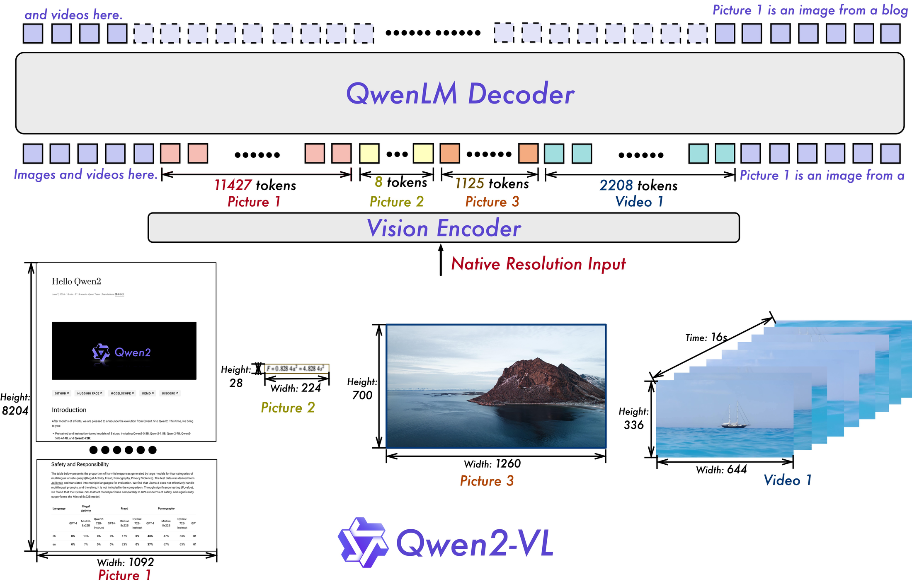
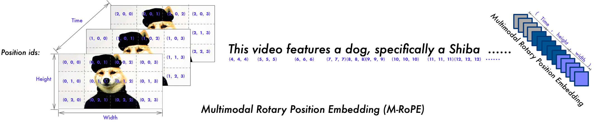
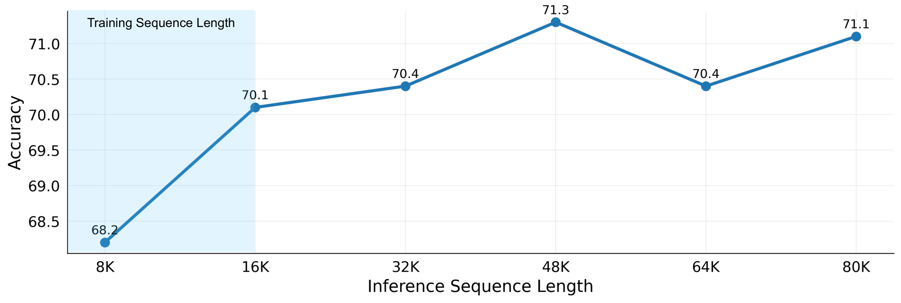
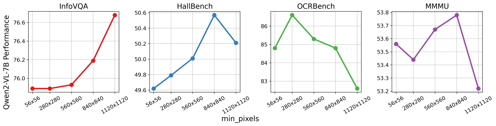
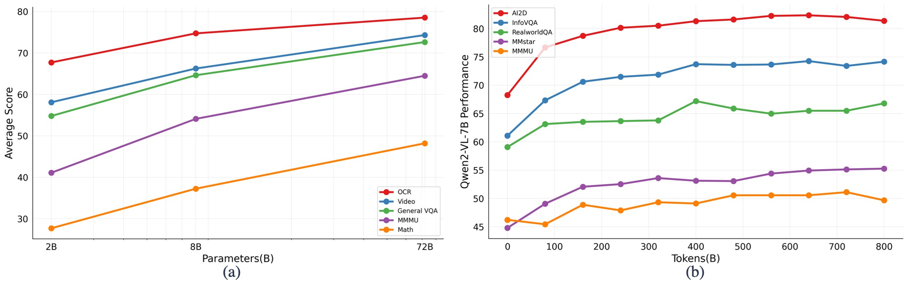

# Qwen2-VL: Enhancing Vision-Language Model's Perception of the World at Any Resolution

## 📋 메타 정보

| 항목 | 내용 |
|---|---|
| **논문 제목** | Qwen2-VL: Enhancing Vision-Language Model's Perception of the World at Any Resolution |
| **저자** | Peng Wang·Shuai Bai·Sinan Tan·Shijie Wang·Zhihao Fan·Jinze Bai (공동 1저자 6명) 외 13명, **Qwen Team, Alibaba Group** |
| **공개일** | 2024-09-18 (v1) → **2024-10-03 (v2, 현재 판)** |
| **분야** | Vision-Language Model(VLM, 시각-언어 모델), native resolution(네이티브 해상도) 입력, positional encoding(위치 인코딩), video understanding(비디오 이해), visual agent(시각 에이전트) |
| **논문 링크** | [arXiv abstract](https://arxiv.org/abs/2409.12191) · [PDF](https://arxiv.org/pdf/2409.12191) · [HTML v2](https://arxiv.org/html/2409.12191v2) |
| **코드/모델** | [GitHub](https://github.com/QwenLM/Qwen2-VL) · [HuggingFace](https://huggingface.co/Qwen) · 공식 구현체는 `transformers`의 `models/qwen2_vl/` 에 병합됨 |
| **라이선스** | **2B·7B = Apache 2.0** / **72B = tongyi-qianwen 라이선스**(상용 제약 있음) |
| **라인업** | Qwen2-VL-2B / 7B / 72B (각각 Base + Instruct) |
| **사용한 외부 재료** | **Qwen2** LLM(언어 백본 초기화) · **DFN**(Data Filtering Networks)의 CLIP ViT(비전 인코더 초기화) · ChatML(대화 포맷) |
| **문서 성격** | ⚠️ **릴리스 리포트에 가깝다.** ablation은 2건(해상도·M-RoPE)뿐이고 **learning rate(학습률)·batch size(배치 크기)·epoch·GPU 대수·학습 시간이 전부 0건**. 데이터셋도 비공개 |

> 📌 이 문서는 **논문 본문 + 공식 구현체(transformers 4.57.6의 `qwen2_vl`) + HuggingFace config 실측**을 대조해서 쓴 것이다. 논문에 없는 내용은 "코드 실측" 표시를 달았다.

---

## 📖 주요 용어 사전 (Glossary)

*왜 먼저 두나: 이 논문의 기여 2개가 전부 "위치 인코딩(position encoding)"과 "토큰 개수" 얘기라, 용어를 먼저 깔지 않으면 본문이 안 읽힌다.*

### 입력 처리
- **patch(패치)**: 이미지를 잘게 자른 정사각형 조각. 여기선 **14×14 픽셀**이 한 패치이고, 패치 하나가 Transformer의 토큰 하나가 된다.
- **fixed resolution(고정 해상도) 입력**: 어떤 이미지가 들어오든 224×224 같은 정해진 크기로 강제 리사이즈해서 넣는 기존 방식. 토큰 개수가 항상 같다.
- **native / dynamic resolution(네이티브·가변 해상도) 입력**: 이미지를 원본 비율·크기 그대로 넣어 **토큰 개수가 이미지마다 달라지는** 방식. 이 논문의 기여 ①.
- **scale-then-padding(리사이즈 후 여백 채우기)**: 비율을 유지한 채 크기를 맞추고 남는 자리를 회색으로 메우는 기존 우회책. 여백만큼 계산이 낭비된다.
- **`smart_resize`**: Qwen 전처리기의 리사이즈 규칙. 가로·세로를 **28의 배수**(= 패치 14 × 머지 2)로 맞추면서 총 픽셀 수를 `min_pixels` ~ `max_pixels` 사이에 넣고 비율은 최대한 보존한다.
- **`min_pixels` / `max_pixels`**: 이미지 하나가 가질 수 있는 최소·최대 픽셀 수. 결국 **토큰 개수의 하한·상한**을 정하는 손잡이다.

### 구조
- **ViT (Vision Transformer, 비전 트랜스포머)**: 이미지를 패치 토큰으로 바꿔 Transformer에 넣는 시각 인코더. 이 모델의 "눈".
- **ViT-H/14**: ViT 크기 규격 중 하나(hidden 1280 / 32층 / 16 head / 패치 14). 코드 실측상 Qwen2-VL의 인코더 백본이 정확히 이 규격이다.
- **merger(머저, vision-language projection)**: ViT가 뽑은 시각 특징을 LLM이 알아들을 크기·형식으로 바꿔주는 "다리". 여기선 **붙어 있는 2×2 토큰 4개를 1개로 압축**하는 MLP.
- **DFN (Data Filtering Networks)**: 좋은 학습 데이터를 걸러내는 방법으로 만든 CLIP 계열 모델·데이터셋(Fang et al., 2023). Qwen2-VL의 ViT 초기 가중치 출처.
- **3D convolution(3차원 합성곱) / tube(튜브)**: 가로·세로뿐 아니라 **시간축까지 묶어서** 한 번에 훑는 합성곱. 여기선 깊이 2 → **연속 2프레임이 토큰 한 줄**이 된다.

### 위치 인코딩
- **RoPE (Rotary Position Embedding, 회전 위치 임베딩)**: 토큰의 위치를 "회전 각도"로 바꿔 attention(어텐션)에 주입하는 방식. Transformer는 원래 순서 개념이 없어서 이런 장치가 필요하다.
- **inverse frequency(역주파수) / 주파수 대역**: RoPE는 채널(차원)마다 회전 속도가 다르다. 앞쪽 채널은 **빠르게 회전(고주파, 짧은 파장)** 해서 가까운 거리를 세밀히 구분하고, 뒤쪽 채널은 **느리게 회전(저주파, 긴 파장)** 해서 먼 거리를 구분한다.
- **2D-RoPE**: 이미지에서는 위치가 (세로, 가로) 두 개라 회전 각도를 두 축으로 나눠 주는 것. **ViT 내부**에서 사용.
- **M-RoPE (Multimodal RoPE, 멀티모달 RoPE)**: 이 논문의 기여 ②. 위치를 **시간(temporal, t) / 세로(height, h) / 가로(width, w)** 세 축으로 쪼개 각각 다른 채널 구간에 배정. **LLM 내부**에서 사용.
- **`mrope_section`**: t·h·w에 채널을 몇 개씩 줄지 정한 값. 7B는 `[16, 24, 24]`.
- **position id(위치 번호)**: 각 토큰에 붙는 위치 숫자. 시퀀스 길이(토큰 개수)와 **같지 않을 수 있다** — 이 차이가 이 논문의 "긴 입력 외삽" 주장의 핵심이다.
- **length extrapolation(길이 외삽)**: 학습할 때 본 것보다 긴 입력을 추론에서 넣어도 성능이 유지되는 성질.

### 학습·평가
- **3-stage training(3단계 학습)**: ① ViT만 학습 → ② 전체 해제 → ③ ViT 동결하고 LLM만 지시 미세조정.
- **ChatML**: `<|im_start|>` / `<|im_end|>` 로 발화를 감싸는 대화 데이터 포맷.
- **visual grounding(시각 그라운딩)**: "기린의 눈"처럼 말로 가리킨 대상의 bounding box(경계 상자) 좌표를 찍는 능력.
- **REC (Referring Expression Comprehension)**: 지시 표현을 듣고 박스를 찍는 과제. RefCOCO 계열 벤치마크.
- **cu_seqlens (cumulative sequence lengths, 누적 시퀀스 길이)**: 여러 이미지를 한 줄로 이어 붙였을 때 **어디부터 어디까지가 한 덩어리인지** 표시하는 경계값. attention이 덩어리를 넘어가지 못하게 막는 역할.
- **1F1B pipeline parallelism**: 파이프라인 병렬에서 forward 한 번, backward 한 번씩 번갈아 돌려 메모리를 아끼는 스케줄.

---

## 🎯 논문 요약 (TL;DR)

**한 줄**: 이미지를 **정해진 크기로 우겨넣지 말고 원본 해상도 그대로** 넣고(가변 토큰), **위치 인코딩을 시간/세로/가로 3축으로 쪼개서**(M-RoPE) 이미지·비디오를 한 경로로 처리한 VLM. **지각·OCR 계열에서는 GPT-4o를 실제로 이기고, 추론 계열에서는 진다.**

**핵심 문제 2가지**
1. 기존 VLM은 입력 해상도가 고정이라, 고해상도 문서의 잔글씨는 뭉개져 사라지고 작은 아이콘에는 토큰을 낭비한다. 사람 눈처럼 "대상에 따라 들여다보는 정밀도"를 못 바꾼다.
2. LLM의 RoPE는 1차원이다. 이미지를 한 줄로 쭉 편 뒤 번호를 매기면 **세로로 바로 위에 있는 패치와 가로로 한참 떨어진 패치가 같은 거리로 보인다**. 비디오의 시간축은 아예 표현할 방법이 없다.

**해결책 3가지**
1. **Naive Dynamic Resolution** — ViT의 절대 위치 임베딩을 지우고 2D-RoPE로 교체 + MLP 머저로 2×2 토큰을 1개로 압축 → 어떤 해상도든 들어온다.
2. **M-RoPE** — 회전 위치 임베딩을 t/h/w 세 성분으로 분해. 텍스트는 세 값이 같아서 **기존 1D RoPE와 수학적으로 완전히 동일**해진다(= 기존 LLM 가중치를 그대로 물려받을 수 있다).
3. **이미지·비디오 통합 경로** — 비디오는 초당 2프레임 샘플링 + 깊이 2 3D 합성곱으로 2프레임을 한 토큰 줄로 묶고, **이미지는 "똑같은 프레임 2장"으로 취급**해 같은 코드로 처리.

**검증**: DocVQA 96.5 / OCRBench 877 / MTVQA 30.9 등 문서·OCR·다국어에서 GPT-4o와 Claude 3.5 Sonnet을 앞선다. **단 MMMU 64.5(GPT-4o 69.1), MathVision 25.9(30.4), MMMU-Pro 46.2(이전 SoTA 46.9)로 추론 계열은 명확히 패배.**

---

## 🔑 핵심 기여 (Contributions)

1. **Naive Dynamic Resolution** — 어떤 해상도든 원본 그대로 받아 **토큰 개수를 가변**으로 만든 것 (§아키텍처 1)
2. **M-RoPE** — 위치 인코딩을 시간·세로·가로 3축으로 분해 (§아키텍처 2)
3. **이미지·비디오 단일 경로 처리** — 이미지를 "동일 프레임 2장"으로 보아 비디오 코드로 통일 (§아키텍처 3)
4. **2B / 7B / 72B 3종 공개 + 스케일링 관찰** — 같은 레시피가 크기별로 어떻게 변하는지 (§실험 Figure 6)
5. **VL-Agent 데이터 포맷 정의** — UI 조작·게임·로봇·내비게이션을 전부 "관찰 → 추론 → function call(함수 호출) → 결과 관찰" 반복으로 통일 (§학습 데이터 포맷)

---

## 🏗 아키텍처 — 무엇을 바꿨나



*Figure 2. 아래쪽 원본 이미지들이 크기·비율이 제각각인 채로 Vision Encoder에 들어가고(Native Resolution Input), 그 결과 이미지마다 토큰 개수가 다르게(11427 / 8 / 1125 / 2208) 나와 QwenLM Decoder의 한 시퀀스에 이어 붙는 그림이다.*

### 1️⃣ Naive Dynamic Resolution (순수 가변 해상도)

*왜 이 방법이 필요한가: 문서 사진처럼 잔글씨가 촘촘한 이미지는 강제로 224×224로 줄이면 글자가 아예 사라지고, 반대로 아이콘 한 개짜리 그림에까지 같은 토큰을 쓰면 낭비다. 이미지가 담은 정보량에 비례해서 토큰을 쓰자는 것.*

한 일은 세 가지다.

| # | 변경 | 왜 필요한가 |
|---|---|---|
| 1 | ViT의 **absolute position embedding(절대 위치 임베딩) 삭제 → 2D-RoPE로 교체** | 학습된 위치 표(table)는 패치 개수가 고정일 때만 쓸 수 있다. RoPE는 **계산으로 만들어지므로** 패치가 몇 개든 대응 가능 |
| 2 | ViT 뒤에 **MLP 머저** — 붙어 있는 2×2 토큰 4개 → 1개 | 가변 해상도로 풀어주면 토큰이 폭증한다. **4배 압축**으로 LLM 부담을 줄임 |
| 3 | 압축된 시각 토큰 앞뒤에 `<\|vision_start\|>` / `<\|vision_end\|>` 삽입 | LLM이 "여기부터 여기까지가 그림"임을 알게 함 |

**논문의 예시 — 224×224 이미지**
```
224 ÷ 14 = 16       → 16 × 16 = 256 패치
256 ÷ 4 (2×2 머지)  → 64 시각 토큰
+ vision_start/end   → 논문이 말하는 "66 tokens"
```
> ⚠️ 논문은 "66 토큰으로 압축된다"고 쓰지만, 66 = **시각 토큰 64 + 특수 토큰 2**다. 시각 정보 자체는 64개다.

**실제 전처리 규칙 (코드 실측 — `smart_resize`)**: 가로·세로를 **28의 배수로 반올림**하고, 총 픽셀 수가 `max_pixels`를 넘으면 비율 유지한 채 축소, `min_pixels`보다 작으면 확대. 종횡비가 200배를 넘으면 아예 에러를 낸다.

**추론 시**: 해상도가 제각각인 이미지들을 **한 시퀀스로 packing(팩킹, 이어 붙이기)** 하고, 팩킹 길이로 GPU 메모리를 통제한다.

---

### 2️⃣ M-RoPE (Multimodal Rotary Position Embedding)

*왜 이 방법이 필요한가: 이미지를 한 줄로 펴서 1차원 번호를 매기면 "바로 위 패치"와 "가로로 멀리 있는 패치"가 구분이 안 되고, 비디오의 시간 순서는 표현할 자리조차 없다.*



*Figure 3. 위치를 (t, h, w) 세 쌍으로 표현하는 그림. 텍스트 구간은 (1,1,1),(2,2,2)... 처럼 세 값이 같고, 이미지 구간은 t가 고정된 채 h·w만 격자를 따라 움직이며, 비디오는 프레임마다 t가 1씩 올라간다.*

**position id 배정 규칙**

| 입력 종류 | temporal(t) | height(h) | width(w) |
|---|---|---|---|
| **텍스트** | 0, 1, 2, 3 … | t와 동일 | t와 동일 |
| **이미지** | 고정 (한 값) | 격자 행 번호 | 격자 열 번호 |
| **비디오** | 프레임 그룹마다 +1 | 격자 행 번호 | 격자 열 번호 |

**핵심 성질 2가지**

1. **텍스트에서는 1D RoPE와 완전히 동일하다.** 세 축 position id가 전부 같으므로, 채널을 t/h/w로 나눠 각각 회전시켜도 결국 원래 1D RoPE와 같은 각도가 나온다. → **Qwen2 LLM의 사전학습 가중치를 손대지 않고 그대로 물려받을 수 있다.** 이게 이 설계의 진짜 미덕이다.
2. **여러 모달리티가 섞이면** 앞 모달리티의 최대 position id + 1 에서 다음 것이 시작한다.

**논문이 명시한 부수 효과**: "이미지·비디오의 position id 값 자체를 줄여서(reduces the value of position IDs) 추론 시 더 긴 시퀀스로 외삽할 수 있게 한다." → 이 문장의 실제 크기가 얼마인지는 **§코드 실측 4번**에서 계산한다.

---

### 3️⃣ 이미지·비디오 통합 처리

*왜 이 방법을 쓰나: 이미지 경로와 비디오 경로를 따로 만들면 코드도 학습도 두 벌이 된다. 이미지를 "정지한 2프레임짜리 비디오"로 보면 한 벌로 끝난다.*

| 항목 | 값 |
|---|---|
| 비디오 샘플링 | **초당 2프레임 (2 fps)** |
| 시간축 묶음 | 깊이 2 **3D convolution** → 연속 2프레임 = 토큰 1줄 (토큰 수 증가 없이 프레임 2배) |
| 이미지 취급 | **동일한 프레임 2장**으로 복제 |
| 비디오 토큰 상한 | **16384 토큰/비디오** (넘치면 프레임 해상도를 낮춤) |

**코드 실측**: "이미지는 동일 프레임 2장"은 비유가 아니라 **전처리에서 마지막 프레임을 실제로 복사해 붙이는 코드**로 구현돼 있다. 그래서 이미지 패치 벡터 1176차원(= 2 × 3 × 14 × 14)은 앞뒤 절반이 완전히 같은 값이다.

---

## 🔬 코드 실측 검증 — 논문이 말하지 않은 것들

*왜 이 절을 두나: 이 논문은 하이퍼파라미터를 하나도 안 적었지만 구현체가 공개돼 있다. 코드에서만 확인되는 사실이 설계 해석을 몇 군데 바꾼다.*

### 1. "675M ViT"는 맞지만, "세 모델 공통"은 아니다

논문 Table 1은 2B/7B/72B 모두 Vision Encoder를 **675M**으로 적었다. 구조만 생성해 파라미터를 직접 세어보면:

| 모델 | LLM hidden 폭 | **ViT 총합** | 백본 | 머저 |
|---|---|---|---|---|
| Qwen2-VL-2B | 1536 | **665.27M** | 631.18M | 34.09M |
| Qwen2-VL-7B | 3584 | **675.76M** | 631.18M | 44.58M |
| Qwen2-VL-72B | 8192 | **699.36M** | 631.18M | 68.17M |

- 백본 631.18M은 **정확히 ViT-H/14 규격**이다 (hidden 1280 / 32층 / 16 head / 패치 14).
- **머저가 LLM 폭에 비례**하므로(2×2 압축 후 5120차원 → LLM 폭) 세 모델의 ViT는 실제로 같은 크기가 아니다. 675M이 정확히 맞는 건 **7B 하나뿐**. (편차 최대 5%라 큰 흠은 아니지만 "동일"은 부정확하다.)
- `patch_embed`가 1.505M인데 이건 2D 합성곱이었을 때(752,640)의 **정확히 2배**다 → DFN ViT의 2D conv를 **시간축 2칸짜리 3D conv로 개조**했다는 뜻. 논문은 "고정 위치 임베딩을 RoPE-2D로 바꿨다"만 말하고 **이 수술은 언급하지 않는다.**

> 🤔 **작은 자기모순**: 서론은 "대부분의 VLM이 정적인 **동결된 CLIP 계열** 인코더에 의존하는 게 문제"라고 비판하는데, 자기 인코더도 CLIP 계열(DFN)에서 초기화한다. config의 활성화 함수가 `quick_gelu`이고 정규화 상수가 OpenAI CLIP 평균/표준편차인 것이 증거다. 실제 차이는 "CLIP이 아니다"가 아니라 **"동결하지 않는다"**이다.

### 2. ViT 안에는 프레임 간 attention이 아예 없다

ViT의 attention 범위를 정하는 `cu_seqlens`가 `(h × w)를 t번 반복`으로 계산된다. 즉 **attention 덩어리 = 한 프레임 그룹**이고, **서로 다른 프레임끼리는 ViT 안에서 절대 서로 보지 못한다.**

비디오의 시간적 연결은 오직 두 곳에서만 일어난다:
1. 깊이 2 3D 합성곱 (연속 2프레임 묶기)
2. LLM 안에서 M-RoPE의 t축

논문은 이 사실을 어디에도 쓰지 않았다. "ViT가 비디오를 이해한다"고 오해하기 쉬운 대목이다.

### 3. M-RoPE의 채널 분할은 축마다 "주파수 편식"을 만든다

7B config: `mrope_section = [16, 24, 24]`, head_dim = 3584 ÷ 28 = 128 → 회전 쌍 64개가 t=16 / h=24 / w=24로 **잘려서** 배정된다.

RoPE는 앞 인덱스일수록 빠르게 돌고(고주파·짧은 파장) 뒤로 갈수록 느리게 돈다(저주파·긴 파장). 그러므로:

| 축 | 받는 채널 | 성질 |
|---|---|---|
| **t (시간)** | 앞 16개 | **가장 빠르게 도는 대역만** — 파장이 짧아 먼 프레임끼리 각도가 한 바퀴 돌아 구분이 흐려짐 |
| **h (세로)** | 가운데 24개 | 중간 대역 |
| **w (가로)** | 뒤 24개 | **가장 느린(긴 파장) 대역 독차지** |

**얼마나 심한지 직접 계산해봤다** (rope_theta = 1,000,000, head_dim 128 기준. "한 바퀴" = 각도가 2π를 돌아 위치가 되감기는 지점):

| 채널 | 1스텝당 회전 | **한 바퀴 도는 데 걸리는 거리** |
|---|---|---|
| t 중 가장 빠른 것 (i=0) | 1 rad | 6.3 스텝 |
| **t 중 가장 느린 것 (i=15)** | 0.0392 rad | **약 160 스텝** |
| h 중 가장 느린 것 (i=39) | 0.00022 rad | 약 28,000 스텝 |
| **w 중 가장 느린 것 (i=63)** | 0.0000012 rad | **약 506만 스텝** |

시간축은 **가장 느린 채널조차 160 스텝이면 한 바퀴를 돈다.** 2 fps에 깊이 2 튜브이므로 1 스텝 = 1초 → **약 160초(2.7분)를 넘어가면 시간축을 표현할 "긴 파장" 채널이 하나도 남지 않는다.** 반면 가로축은 506만 스텝짜리 채널을 갖고 있다. 논문이 "20분 넘는 비디오를 이해한다"고 결론에 쓴 것과 이 숫자는 긴장 관계에 있다.

논문 Figure 3은 이 채널 분할을 그림으로만 보여주고, 주파수 편식이 생긴다는 얘기는 한 줄도 없다.

> 💡 이게 정확히 **Qwen3-VL이 Interleaved-MRoPE로 고친 지점**이다 — t·h·w를 덩어리로 자르지 말고 **번갈아 끼워** 모든 축이 고주파·저주파를 고루 갖게 한 것. [PAPER_Qwen3-VL.md](PAPER_Qwen3-VL.md)의 "축별 주파수 편식"의 원인이 바로 이 `[16,24,24]` 한 줄이다.

### 4. Figure 5의 "16K 학습 → 80K 추론"은 절반이 착시다



position id 배정 코드를 보면, 이미지가 끝난 뒤 다음 텍스트는 **max(t, h, w) + 1** 에서 시작한다. 즉:

```
1024×1024 이미지 → 격자 73×73 → 머지 후 36×36 = 1296 토큰
그런데 position id는 36칸만 전진한다  (1296이 아니라 36!)
```

이미지가 먹는 **위치 번호는 토큰 수의 제곱근 수준**으로만 늘어난다. 그래서 80K 토큰짜리 비디오를 넣어도 **LLM이 실제로 보는 최대 position id는 수백 수준**이다.

> ✅ 정직한 해석: 학습 최대치 16K를 넘겼다는 건 **시퀀스 길이**를 넘긴 것이지 **위치 번호 범위**를 넘긴 게 아니다. Figure 5가 보여주는 건 "RoPE의 외삽 능력"이라기보다 **"위치 번호를 애초에 안 키우는 구조 덕분에 외삽 문제가 발생하지 않는다"**에 가깝다. 논문 본문도 position id가 작아진다는 언급은 하지만, Figure 5를 M-RoPE의 능력 증거로 제시하면서 이 둘을 분리하지 않는다.

### 5. 배포된 기본값과 논문 실험 설정이 다르다 (재현 함정)

| 값 | 논문 ablation (§3.3.1) | **배포 프로세서 기본값** |
|---|---|---|
| `max_pixels` | 16384 × 28 × 28 (= 최대 16384 토큰) | **1280 × 28 × 28 (= 최대 1280 토큰)** |
| `min_pixels` | 100 × 28 × 28 (= 최소 100 토큰) | **56 × 56 (= 최소 4 토큰)** |

기본 설정으로 돌리면 **이미지당 1280 토큰에서 잘린다.** 논문의 "평균 1924 토큰" 결과를 재현하려면 `max_pixels`를 직접 올려야 한다.

### 6. Figure 2의 토큰 개수를 직접 검산해봤다

*왜: 이 그림이 "가변 해상도"의 유일한 구체 수치라 산수가 맞는지 확인할 가치가 있다.*

| 대상 | 원본 크기 | 그림의 토큰 수 | 검산 결과 |
|---|---|---|---|
| Picture 1 (블로그 캡처) | 1092 × 8204 | 11427 | ✅ **정확히 일치** (78 × 586 ÷ 4) |
| Picture 2 (수식 한 줄) | 224 × 28 | 8 | ✅ 일치 (기본 `min_pixels` 기준) |
| Picture 3 (풍경 사진) | 1260 × 700 | 1125 | ✅ **정확히 일치** (90 × 50 ÷ 4) |
| Video 1 (16초) | 644 × 336 | 2208 | ⚠️ **2 fps면 4416이 나와야 한다** |

비디오 검산: 프레임당 46 × 24 = 1104 패치 → 2×2 머지 → 276 토큰. **2208 ÷ 276 = 8 그룹**이고, 깊이 2 튜브이므로 **총 16프레임 = 16초 ÷ 16프레임 = 1 fps**다. 본문이 못 박은 "2 fps"대로면 32프레임 → 16그룹 → 4416 토큰이어야 한다.

> ⚠️ **Figure 2의 비디오 토큰 수는 본문의 2 fps 서술과 어긋난다** (1 fps 기준 값). 성능에 영향을 주는 오류는 아니지만, 이 그림을 근거로 토큰 예산을 계산하면 2배 틀린다.

---

## 🏋️ 학습 파이프라인

*왜 이 절을 두나: 이 논문에서 재현 가능성을 판단할 수 있는 유일한 정보가 여기 있고, 동시에 "무엇이 빠졌는지"도 여기서 드러난다.*

### 3단계 학습

| 단계 | 학습 대상 | 데이터 초점 | 규모 |
|---|---|---|---|
| **1단계** | **ViT만** (LLM 동결) | 이미지-텍스트 쌍, OCR, 이미지 분류 | **600B 토큰** |
| **2단계** | **전체 파라미터 해제** | + VQA, 멀티태스크, interleaved(이미지-텍스트 교차) 문서, 순수 텍스트 | **+800B 토큰** |
| **3단계** | **ViT 동결, LLM만** | ChatML 지시 데이터(문서 파싱·다중 이미지 비교·비디오·에이전트) | 미공개 |

- **초기화**: LLM ← Qwen2 / ViT ← DFN의 CLIP ViT (단 고정 위치 임베딩만 RoPE-2D로 교체)
- **감독 신호**: **텍스트 토큰에만 loss를 건다.** 시각 토큰에는 감독이 없다
- **데이터 컷오프**: 2023년 6월
- **총 1.4T 토큰**은 텍스트 + 이미지 토큰을 합산한 값 → **LLM 사전학습의 토큰 수와 직접 비교하면 안 된다**

### 데이터 포맷 (§2.2.1)

*왜 중요한가: 좌표를 어떻게 적느냐가 세대마다 바뀌면서 마이그레이션 이슈를 만들기 때문.*

- **시각 구간**: `<|vision_start|>` … `<|vision_end|>`
- **대화**: ChatML — `<|im_start|>` / `<|im_end|>`
- **그라운딩**: bounding box를 **[0, 1000) 범위로 정규화**하고 `(x1,y1),(x2,y2)` 텍스트로 씀. 박스가 가리키는 대상은 `<|object_ref_start|>` … `<|object_ref_end|>` 로 따로 표시
  ```
  <|object_ref_start|>the eyes on a giraffe<|object_ref_end|><|box_start|>(176,106),(232,160)<|box_end|>
  ```
- **에이전트**: 모든 과제(UI 조작·게임·로봇·내비게이션)를 `*FUNCTION*` / `*ARGS*` / `*RESULT*` / `*RETURN*` 의 반복 사이클로 통일. 화면 좌표도 0~1000 정규화

### 인프라 (§2.3) — 이 논문에서 가장 실무적인 부분

*왜 읽을 가치가 있나: 다른 VLM 논문이 잘 안 쓰는 "실제로 뭐가 터졌는지"가 적혀 있다.*

| 항목 | 내용 |
|---|---|
| 플랫폼 | Alibaba Cloud **PAI-Lingjun** (자동 재시작·straggler 감지) |
| 스토리지 | 텍스트는 **CPFS + mmap**, 영상은 **OSS 객체 스토리지**로 분리 저장 |
| 병렬화 | **DP + TP + PP 3D 병렬** + DeepSpeed ZeRO-1 + sequence parallelism + selective checkpointing |
| 72B 파이프라인 | **1F1B** (인터리브드 1F1B는 **오히려 느려서 폐기**). ViT + 어댑터 + 일부 decoder 층을 한 스테이지로 묶음 |
| 소프트웨어 | PyTorch 2.1.2 + CUDA 11.8 + flash-attention + fused LayerNorm/RMSNorm/Adam |

**실전 디테일 3가지**
1. **비디오 디코딩이 최대 병목**이었고, FFmpeg와 사내 소프트웨어가 다 실패해서 **캐싱 디코딩**을 자체 구현했다.
2. **합성곱의 비결정성(non-deterministic)** 때문에 TP 랭크 간 공유 가중치가 어긋나는 문제가 생겼고, all-reduce 통신을 추가하는 대신 **오프라인 리듀스**로 우회했다.
3. **머저는 TP 샤딩에서 제외**했다 (파라미터가 적어서 나누는 이득보다 통신 비용이 큼).

> ❌ **없는 것**: 학습률·배치 크기·시퀀스 길이·에폭·GPU 대수·학습 시간·데이터 혼합 비율·이미지 장수. **재현은 불가능하다.**

---

## 📊 실험 요약

*왜 나눠서 보나: "GPT-4o와 대등"이라는 초록의 주장은 과제 종류에 따라 참이기도 하고 거짓이기도 하다. 섞어 놓으면 판단이 왜곡된다.*

### 이기는 곳 — 지각·문서·OCR·다국어

| 벤치마크 | 이전 SoTA | Claude-3.5 Sonnet | GPT-4o | **Qwen2-VL-72B** | 7B | 2B |
|---|---|---|---|---|---|---|
| DocVQA (test) | 94.1 | 95.2 | 92.8 | **96.5** | 94.5 | 90.1 |
| InfoVQA (test) | 82.0 | – | – | **84.5** | 76.5 | 65.5 |
| OCRBench | 852 | 788 | 736 | **877** | 866 | 809 |
| TextVQA (val) | 84.4 | – | – | **85.5** | 84.3 | 79.7 |
| AI2D | 87.6 | 80.2 | 84.6 | **88.1** | 83.0 | 74.7 |
| MTVQA (다국어 텍스트) | 23.2 | 25.7 | 27.8 | **30.9** | 25.6 | 18.1 |
| RealWorldQA | 72.2 | 60.1 | 75.4 | **77.8** | 70.1 | 62.9 |
| MMVet | 67.5 | 66.0 | 69.1 | **74.0** | 62.0 | 49.5 |
| MMBench-CN | 86.3 | 80.7 | 82.1 | **86.6** | 80.5 | 73.5 |
| MMStar | 67.1 | 62.2 | 63.9 | **68.3** | 60.7 | 48.0 |
| HallBench (avg) | 55.2 | 49.9 | 55.0 | **58.1** | 50.6 | 41.7 |
| MathVista (testmini) | 69.0 | 67.7 | 63.8 | **70.5** | 58.2 | 43.0 |
| VCR 영문 easy | 84.7 | 63.9 | 91.6 | **91.9** | 89.7 | 81.5 |
| **VCR 중문 easy** | 22.1 | 1.0 | 14.9 | **65.4** | 59.9 | 46.2 |

VCR 중문 65.4 대 GPT-4o 14.9는 사실상 다른 리그다. 그리고 **7B가 OCRBench 866으로 72B(877)에 거의 붙는다** — OCR은 모델 크기를 별로 안 탄다.

### 지는 곳 — 추론·롱비디오·내비게이션

| 벤치마크 | 이전 SoTA | GPT-4o | Qwen2-VL-72B | 판정 |
|---|---|---|---|---|
| MMMU (val) | 66.1 | **69.1** | 64.5 | ❌ |
| MMMU-Pro | 46.9 | **51.9** | 46.2 | ❌ 이전 SoTA에도 패 |
| MathVision | 30.3 | **30.4** | 25.9 | ❌ |
| Video-MME (자막 없음) | 66.3 | 71.9 / **Gemini 1.5 Pro 75.0** | 71.2 | ❌ |
| R2R 내비게이션 SR | **79.0** | 43.7 | 51.7 | ❌ 전문 모델에 큰 차이로 패 |
| REVERIE SR | **61.0** | 31.6 | 31.0 | ❌ |

> 📌 초록의 "GPT-4o·Claude 3.5 Sonnet과 대등"은 **지각·OCR 한정으로 읽어야 한다.** 논문도 한계 절에서 MMMU와 내비게이션 열세를 인정한다(내비게이션은 여러 장의 이미지로는 지도 정보가 불완전하기 때문이라고 설명).

### 비디오 (Table 4)

| 벤치마크 | 이전 SoTA | Gemini 1.5-Pro | GPT-4o | 72B | 7B | 2B |
|---|---|---|---|---|---|---|
| MVBench | 69.6 | – | – | **73.6** | 67.0 | 63.2 |
| PerceptionTest (test) | 66.9 | – | – | **68.0** | 62.3 | 53.9 |
| EgoSchema (test) | 62.0 | 63.2 | 72.2 | **77.9** | 66.7 | 54.9 |
| Video-MME (자막 없음/있음) | 66.3 / 69.6 | **75.0** / **81.3** | 71.9 / 77.2 | 71.2 / 77.8 | 63.3 / 69.0 | 55.6 / 60.4 |

⚠️ Video-MME 평가는 **비디오당 최대 768프레임**으로 제한했다고 논문이 밝힌다 — 긴 영상에서 불리하게 작용했을 수 있다는 자기 진술.

### 다국어 OCR (Table 3) — ⚠️ 자체 비공개 벤치마크

| | 한국어 | 일본어 | 프랑스어 | 독일어 | 이탈리아어 | 러시아어 | 베트남어 | 아랍어 |
|---|---|---|---|---|---|---|---|---|
| GPT-4o | 87.8 | 88.3 | 89.7 | 88.3 | 74.1 | 96.8 | 72.0 | **75.9** |
| Qwen2-VL-72B | **94.5** | **93.4** | **94.1** | **91.5** | **89.8** | **97.2** | **73.0** | 70.7 |

대부분 압승이지만 **아랍어는 패배**. 그리고 이 표는 논문이 직접 "internal multilingual OCR benchmarks"라고 밝힌 **자체 비공개 벤치마크**라 제3자 검증이 불가능하다.

### 에이전트 (Table 5)

| 영역 | 지표 | 이전 SoTA | GPT-4o | Qwen2-VL-72B |
|---|---|---|---|---|
| Function Calling | TM / EM | – | 90.2 / 50.0 | **93.1 / 53.2** |
| UI 조작 (AITZ) | TM / EM | 83.0 / 47.7 | 70.0 / 35.3 | **89.6 / 72.1** |
| 카드게임 Number Line | SR | 89.4 | 91.5 | **100.0** |
| 카드게임 EZPoint | SR | 50.0 | 85.5 | **100.0** |
| 카드게임 BlackJack | SR | 40.2 | 34.5 | **42.6** |
| 카드게임 Point24 | SR | 2.6 | 3.0 | **4.5** |
| 로봇 ALFRED | SR / GC | 67.7 / 75.3 | – | **67.8 / 75.8** |

UI 조작 EM 47.7 → 72.1은 큰 폭의 개선이다. 반면 **Point24는 4.5%로 사실상 못 푼다** (조합 탐색이 필요한 과제).

### REC (Table 6)

RefCOCO val 93.2 / RefCOCO+ val 90.1 / RefCOCOg 89.9 — generalist(범용) 모델 중 최상위이며 specialist(전용) 모델과도 경쟁 가능한 수준.

---

## 🧪 Ablation 해부 — 2건뿐이고, 둘 다 주장보다 약하다

*왜 따로 파나: 이 논문이 내세운 기여 3개 중 검증 실험이 붙은 건 2개뿐이고, 그 2개도 표를 자세히 보면 논문 본문의 서술과 온도차가 있다.*

### 3.3.1 가변 해상도 (Table 7, Qwen2-VL-7B)

| 전략 | 평균 이미지 토큰 | InfoVQA(val) | RealWorldQA | OCRBench | MMMU |
|---|---|---|---|---|---|
| 고정 64 | 64 | 28.85 | 56.47 | 572 | 53.33 |
| 고정 576 | 576 | 65.72 | 65.88 | 828 | 52.78 |
| 고정 1600 | 1600 | 74.99 | 69.54 | 824 | 52.89 |
| 고정 3136 | 3136 | **77.27** | **70.59** | 786 | **53.44** |
| **가변** | **1924** | 75.89 | 70.07 | **866** | **53.44** |

**논문 주장**: "고정 해상도 중 어떤 것도 모든 벤치마크에서 최고가 아니다. 반면 가변은 더 적은 토큰으로 일관되게 최상위권을 유지한다."

**정직하게 읽으면**:
- 가변이 **실제로 이기는 건 OCRBench(866) 하나뿐**이다. InfoVQA는 −1.38, RealWorldQA는 −0.52로 고정 3136에 진다.
- "더 적은 토큰"은 맞지만 **평균 1924는 고정 576의 3.3배**다. 효율 주장으로서는 어정쩡하다.
- 오히려 이 표의 진짜 발견은 **비단조성(non-monotonicity)** 이다: OCRBench가 576(828) → 1600(824) → 3136(**786**)로 **토큰을 늘릴수록 떨어진다.** 해상도를 키우는 게 능사가 아니라는 증거.
- MMMU는 53 근처에서 거의 움직이지 않는다 → **MMMU의 병목은 해상도가 아니라 추론력**이다 (논문도 같은 해석).

### 3.3.1 보조 — `min_pixels` 스윕 (Figure 4)



*작은 이미지를 일정 크기 이상으로 강제 확대했을 때의 변화. 왜 보나: "무조건 키우면 좋은가"에 대한 답이다.*

- InfoVQA·HallusionBench·OCRBench는 **어느 구간까지는** 확대할수록 좋아진다 (계산량 증가 덕).
- 그런데 **OCRBench는 너무 키우면 급락한다.** OCRBench에 극히 작은 이미지가 많은데, 과하게 확대하면 학습 데이터 분포를 벗어나 **out-of-distribution(분포 밖) 샘플**이 되기 때문.
- MMMU는 거의 반응 없음.

> 💡 **실무 교훈**: `min_pixels`를 올리는 건 무료 성능 향상이 아니다. 대상 이미지의 원본 크기 분포를 보고 정해야 한다.

### 3.3.2 M-RoPE (Table 8)

백본은 **Qwen2-1.5B + ViT-L** (본 라인업과 다름), 사전학습 모델 기준.

| | MathVista | MMB | MMStar | RWQ | DocVQA | ChartQA | InfoVQA | TextVQA | PerceptionTest | NextQA | STAR |
|---|---|---|---|---|---|---|---|---|---|---|---|
| 1D-RoPE | 39.2 | 58.6 | 36.7 | **54.5** | 82.5 | 68.0 | **50.8** | 71.3 | 46.6 | 43.9 | 55.5 |
| **M-RoPE** | **43.4** | **60.6** | 36.7 | 53.7 | **82.8** | **68.4** | 50.3 | **71.8** | **47.4** | **46.0** | **57.9** |

**정직하게 읽으면**:
- 이미지 벤치 8개 중 **MMStar 동률, RWQ·InfoVQA는 오히려 M-RoPE가 진다.**
- DocVQA +0.3 / ChartQA +0.4 / TextVQA +0.5는 사실상 노이즈 수준.
- 실질 이득은 **비디오 3종 (+0.8 / +2.1 / +2.4)** 과 정체불명의 **MathVista +4.2** 두 곳뿐이다.
- 비디오에서 이기는 건 t축을 따로 뒀으니 납득이 간다. 그런데 **MathVista +4.2가 왜 나오는지는 논문에 설명이 없다.** (가로·세로를 분리한 게 도형 문제에 도움이 된다는 가설은 가능하지만 검증은 없다.)
- **단일 시드(seed)** 결과이고, **백본이 본 모델과 다르다.** 규모를 키웠을 때도 이 이득이 남는지는 확인되지 않았다.

### 3.3.3 스케일링 (Figure 6)



*왜 보나: "같은 레시피를 키우면 뭐가 먼저 좋아지는가"를 능력 축별로 분해한 유일한 그림이다.*

능력 축은 5개로 묶었다 — 대학 수준 문제(MMMU) / 수학(MathVista+MathVision) / 문서·표(DocVQA·InfoVQA·ChartQA·TextVQA·OCRBench·MTVQA) / 일반 QA(RealWorldQA·MMBench-V1.1·MMT-Bench·HallBench·MMVet·MMStar) / 비디오(MVBench·PerceptionTest·EgoSchema·Video-MME).

- (a) 모델 크기 축: **수학 능력이 파라미터 수와 가장 강하게 연동**된다. 반대로 **OCR은 작은 모델도 꽤 잘한다.**
- (b) 2단계 사전학습 토큰 수 축(7B): 토큰이 늘수록 좋아지지만 **VQA 계열은 출렁인다.** 반면 AI2D·InfoVQA처럼 **그림 속 글자와 도해를 같이 읽어야 하는 과제는 꾸준히 상승**한다.

---

## 🚨 급소 정리

*왜 모아 두나: 위 절들에 흩어진 문제를 한 화면에서 보고 이 논문을 얼마나 믿을지 정하기 위해.*

| # | 문제 | 근거 |
|---|---|---|
| 1 | **재현 불가** | 학습률·배치·에폭·GPU 시간·데이터 구성 전부 미공개 |
| 2 | **ablation 2건** | 기여 3개 중 "이미지·비디오 통합"은 검증 실험 자체가 없음 |
| 3 | **M-RoPE 이득이 이미지에선 사실상 무승부** | Table 8에서 2개 패, 1개 동률 (→ §Ablation) |
| 4 | **가변 해상도의 효율 주장이 약함** | 고정 3136에 정확도 패, 고정 576의 3.3배 토큰 (→ §Ablation) |
| 5 | **"80K 외삽"이 position id 압축 효과와 뒤섞임** | 이미지 1296토큰 = 위치 36칸 (→ §코드 실측 4) |
| 6 | **다국어 OCR이 자체 비공개 벤치** | Table 3 "internal benchmarks" |
| 7 | **파라미터 표기 부정확** | 675M은 7B에서만 정확 (2B 665M / 72B 699M) (→ §코드 실측 1) |
| 8 | **초록·결론은 "8B", 표는 "7B"** | 8B = 7.6B LLM + 0.68B ViT의 합. 두 표기가 혼용됨 |
| 9 | **ViT 출처 미기술** | ViT-H/14 + DFN CLIP인데 "약 675M ViT"로만 서술 |
| 10 | **ViT에 프레임 간 attention 없음** | 코드에서 확인. 논문 미언급 (→ §코드 실측 2) |
| 11 | **M-RoPE 채널 분할의 주파수 편식** | t의 최장 파장 ≈ 160스텝 vs w ≈ 506만 스텝 (→ §코드 실측 3) |
| 12 | **Figure 2의 비디오 토큰 수 ↔ 2 fps 서술 불일치** | 2208은 1 fps 기준 값 (→ §코드 실측 6) |
| 13 | **배포 기본값 ≠ 논문 실험 설정** | `max_pixels` 1280 vs 16384 토큰 (→ §코드 실측 5) |
| 14 | **72B는 Apache 2.0 아님** | tongyi-qianwen 라이선스 |

---

## 💬 Q&A

### Q1. ViT 안의 2D-RoPE와 LLM 안의 M-RoPE는 같은 건가?

*왜 헷갈리나: 둘 다 "RoPE를 축별로 쪼갠다"는 같은 말로 설명되지만, 사는 곳도 목적도 다르다.*

| | **2D-RoPE** | **M-RoPE** |
|---|---|---|
| 어디에 있나 | **ViT 내부** (32개 블록 전부) | **LLM 내부** (Qwen2 decoder 층) |
| 축 개수 | 2개 (h, w) | 3개 (t, h, w) |
| 대상 토큰 | 머지 **전** 패치 (2×2 압축 이전) | 머지 **후** 시각 토큰 + 텍스트 토큰 |
| 채널 분배 | head_dim 80 → h 20쌍 / w 20쌍 | head_dim 128 → t 16쌍 / h 24쌍 / w 24쌍 |
| rope_theta | **10,000** | **1,000,000** |
| 대체한 것 | ViT의 학습된 절대 위치 임베딩 | LLM의 1D RoPE |

**둘 다 필요한 이유**: ViT는 이미지 내부의 기하 구조를 알아야 하고, LLM은 "텍스트 → 그림 → 텍스트 → 영상"이 섞인 시퀀스 전체의 배치를 알아야 한다. 층위가 다르다.

### Q2. 왜 OCR은 모델 크기를 안 타는데 수학은 타나?

*이 논문의 Figure 6이 보여주는 가장 실무적인 관찰이다.*

**OCR/문서 이해는 "입력에 이미 답이 있는" 과제다.** 이미지 안에 글자가 물리적으로 존재하고, 모델이 할 일은 그걸 정확히 옮겨 적는 것이다. 병목은 **해상도(정보가 이미지에 남아 있는가)** 와 **인코더 품질**이지 언어 모델의 크기가 아니다. 그래서 2B도 OCRBench 809를 찍고, 7B(866)와 72B(877)의 격차가 좁다.

**수학·대학 수준 문제는 "입력에 답이 없는" 과제다.** 그림에서 조건을 읽어낸 뒤 **여러 단계를 추론**해야 하고, 그 능력은 언어 백본의 크기에 직결된다. 그래서 MathVista가 2B 43.0 → 7B 58.2 → 72B 70.5로 계단식으로 오른다.

> 💡 **실무 함의**: 문서 파싱·OCR 파이프라인을 만든다면 **작은 모델 + 높은 해상도**가 큰 모델보다 가성비가 좋다. 반대로 차트 해석·수식 풀이가 목적이면 모델 크기를 줄이면 안 된다.

### Q3. 이 논문을 지금(2026년) 읽어야 할 이유가 있나?

| 관점 | 판단 |
|---|---|
| **실제로 쓸 모델로서** | ❌ 후속작 Qwen2.5-VL / Qwen3-VL이 이미 있다. 신규 프로젝트에 Qwen2-VL을 고를 이유는 거의 없다 |
| **원점 문헌으로서** | ✅ **"네이티브 해상도가 어떻게 업계 표준이 되었나"의 출발점**이다. 지금 거의 모든 VLM이 쓰는 가변 토큰 방식이 여기서 정착했다 |
| **M-RoPE 계보 이해용** | ✅ Qwen2.5-VL의 T-RoPE도, Qwen3-VL의 Interleaved-MRoPE도 **이 논문의 `[16,24,24]` 채널 분할을 고치려는 시도**다. 원본을 봐야 왜 두 번이나 뜯어고쳤는지 이해된다 |
| **인프라 참고서로서** | ✅ 비디오 디코딩 병목, TP 하의 conv 비결정성, 인터리브드 1F1B가 더 느렸다는 등 다른 논문에 잘 없는 실전 기록 |

### Q4. 재현하려면 뭐부터 막히나?

*왜 정리하나: "코드가 공개됐다"와 "재현 가능하다"는 다른 말이다.*

| 단계 | 가능 여부 |
|---|---|
| 추론 (inference) | ✅ **완전 가능.** 가중치·구현체 모두 공개 |
| 미세조정 (fine-tuning) | ✅ 가능. 다만 3단계 지시 데이터는 비공개라 자체 데이터 필요 |
| 2단계 사전학습 재현 | ❌ **불가.** 800B 토큰의 구성·비율·출처가 전부 미공개 |
| 1단계 ViT 학습 재현 | ❌ **불가.** 600B 토큰 미공개 + 학습률/배치 없음 |
| ablation 재현 | ⚠️ 부분 가능. Table 7은 `min_pixels`/`max_pixels`만 바꾸면 되지만, **Table 8(M-RoPE)은 Qwen2-1.5B + ViT-L을 처음부터 사전학습해야 해서 사실상 불가** |

---

## 🧬 계보 — 이 논문의 것 중 뭐가 살아남았나

*왜 이 절이 필요한가: 기여를 평가하는 가장 확실한 방법은 "같은 팀이 다음 모델에서도 그걸 유지했는가"를 보는 것이다.*

```
Qwen-VL (2023)       고정 해상도 · 리샘플러 · 1D RoPE
      ↓
Qwen2-VL (2024-09)   가변 해상도 + ViT 2D-RoPE · M-RoPE · 2×2 MLP 머저 · [0,1000] 정규화 좌표 · 프레임번호 시간 id
      ↓
Qwen2.5-VL (2025-02) ViT 윈도우 어텐션 · 절대시각 T-RoPE · 절대픽셀 좌표 · 4.1T 토큰
      ↓
Qwen3-VL (2025-11)   Interleaved-MRoPE · DeepStack · 텍스트 타임스탬프 · [0,1000] 좌표 복귀 · SigLIP-2 인코더
```

| Qwen2-VL이 도입한 것 | 두 세대 뒤 판정 |
|---|---|
| **가변 해상도(네이티브 해상도)** | ✅ **완전 정착.** 이후 모든 Qwen-VL은 물론 업계 표준이 됨 |
| **2×2 MLP 머저** | ✅ **그대로 유지.** Qwen3-VL까지 동일한 압축 방식 |
| **M-RoPE (t/h/w 분해)** | ✅ 골격 유지 / ❗ **채널을 덩어리로 자른 것은 Qwen3-VL이 interleave로 교정** |
| **프레임 번호 기반 시간 id** | ❌ Qwen2.5-VL이 절대 시각으로 교체 → Qwen3-VL이 **텍스트 타임스탬프로 재교체** |
| **[0,1000] 정규화 좌표** | 🔁 Qwen2.5-VL이 절대 픽셀로 바꿨다가 **Qwen3-VL이 다시 이 방식으로 복귀** |
| **DFN CLIP ViT-H 백본** | ❌ Qwen3-VL에서 SigLIP-2 기반으로 교체 |
| **ViT 전면 full attention** | ❌ Qwen2.5-VL이 윈도우 어텐션으로 교체 (계산량 문제) |

> 💡 **가장 큰 교훈 두 가지**
> 1. 이 논문의 두 기여 중 **오래 살아남은 건 "가변 해상도"**다. M-RoPE는 *방향은 맞았지만 구현 디테일(채널을 덩어리로 자른 것)이 나중에 문제로 드러난* 사례다.
> 2. **좌표 표기는 한 바퀴 돌아 제자리로 왔다** (Qwen2-VL 정규화 → 2.5 절대픽셀 → 3 정규화). 중간 세대의 "개선"이 항상 개선은 아니라는 좋은 사례이고, 이 왕복 때문에 마이그레이션 시 breaking change가 두 번 발생했다.

---

## 🔗 다른 논문들과의 연결

- **[PAPER_Qwen2.5-VL.md](PAPER_Qwen2.5-VL.md)**: 직계 후속. 이 논문의 **프레임 번호 시간 id**를 절대 시각(T-RoPE)으로, **[0,1000] 좌표**를 절대 픽셀로 바꿨고, **ViT full attention**을 윈도우 어텐션으로 바꿨다. 셋 중 둘은 Qwen3-VL이 되돌린다.
- **[PAPER_Qwen3-VL.md](PAPER_Qwen3-VL.md)**: 이 논문의 `mrope_section` 덩어리 분할이 낳은 **축별 주파수 편식**을 Interleaved-MRoPE로 정면 교정. 좌표계도 이 논문 방식으로 복귀.
- **[PAPER_PaliGemma.md](PAPER_PaliGemma.md) / [PAPER_PaliGemma-2.md](PAPER_PaliGemma-2.md)**: 같은 시기의 대조군. PaliGemma는 **해상도별로 체크포인트를 따로 내는** 정반대 노선을 택했다(224/448/896). PaliGemma 2의 "글자 읽기 = 해상도, 생각하기 = LM 크기"라는 분해 분석은 이 논문 Figure 6의 관찰과 정확히 같은 결론이다.
- **[PAPER_Florence-2.md](PAPER_Florence-2.md)**: 좌표를 텍스트 토큰으로 표현하는 계보의 원류(1000-bin 위치 토큰). Qwen2-VL의 [0,1000) 정규화 좌표와 같은 발상이다.
- **[PAPER_nanoVLM.md](PAPER_nanoVLM.md) / [PAPER_SmolVLM.md](PAPER_SmolVLM.md)**: 같은 "눈(ViT) + 다리(머저) + 입(LLM)" 3모듈 골격을 최소 규모로 벌거벗긴 버전. SmolVLM의 pixel shuffle은 이 논문의 2×2 머저와 목적이 같다(시각 토큰 압축).
- **[PAPER_BLIP-2.md](PAPER_BLIP-2.md)**: "동결 백본 + 학습 가능한 다리" 패러다임의 원조. Qwen2-VL은 2단계에서 **전부 해제**한다는 점에서 정확히 반대 노선이며, 그 선택이 옳았음을 성능으로 보여준 사례다.
- **[PAPER_DeepSeek-OCR.md](PAPER_DeepSeek-OCR.md) / [PAPER_MinerU2.5.md](PAPER_MinerU2.5.md) / [PAPER_PaddleOCR-VL-1.6.md](PAPER_PaddleOCR-VL-1.6.md)**: 문서 OCR 전용 VLM 계열. 이들이 "토큰을 얼마나 줄이면서 글자를 읽을 수 있나"를 파고드는 출발점이 바로 이 논문의 가변 해상도 + 4배 압축이다.
- **[PAPER_Qwen-Image.md](PAPER_Qwen-Image.md) / [PAPER_UniCustom.md](PAPER_UniCustom.md)**: Qwen2.5-VL을 동결 텍스트 인코더로 쓰는 생성 모델들. 그 계보의 첫 세대가 이 논문이다.
- **사전학습 백본 재사용 풍경**: 분기 A(동결 → 해동 후 전체 미세조정)의 전형. 1단계 LLM 동결 → 2단계 전면 해제 → 3단계 ViT 재동결이라는 **세 번 스위치를 뒤집는** 구성이 특징이다.

---

## 📌 한 줄 요약 (전체)

**Qwen2-VL은 "이미지를 정해진 크기로 우겨넣지 말고 원본 해상도 그대로 넣어 토큰 수를 가변으로 만들자(Naive Dynamic Resolution)"와 "위치 인코딩을 시간·세로·가로 3축으로 쪼개자(M-RoPE)" 두 줄로 Qwen-VL을 갈아엎고, 그 결과 문서·OCR·다국어에서 GPT-4o를 실제로 앞선 릴리스 리포트다 — 다만 학습 하이퍼파라미터가 전무하고 ablation은 2건뿐이며, 그 2건마저 표를 자세히 보면 "가변 해상도는 OCRBench에서만 이기고" "M-RoPE는 이미지에서 사실상 무승부"다.**

**받아들일 것**: 가변 해상도가 업계 표준이 된 출발점이라는 역사적 위치 · OCR은 모델 크기를 안 타고 수학은 탄다는 분해 관찰(Figure 6) · 해상도를 무작정 키우면 오히려 나빠진다는 비단조성 발견(Table 7 / Figure 4) · 비디오 디코딩 병목·TP conv 비결정성 같은 실전 인프라 기록.

**걸러 볼 것**: "GPT-4o 대등"(추론 계열은 명확히 패) · Figure 5의 80K 외삽(위치 id 압축 효과와 뒤섞임) · 다국어 OCR 표(자체 비공개 벤치) · Table 1의 "ViT 675M 공통"(7B에서만 정확) · Figure 2의 비디오 토큰 수(1 fps 기준).

---

## 🧠 관련 메모리

- `paper_qwen2_vl` (본 문서 포인터)
- `paper_qwen2_5_vl` — 직계 후속, 이 논문 설계 3개를 교체
- `paper_qwen3_vl` — `mrope_section` 주파수 편식을 Interleaved-MRoPE로 교정
- `paper_paligemma`, `paper_paligemma_2` — 해상도 vs 모델 크기 분해의 대조군
- `reference_pretrained_backbone_reuse_landscape` — 백본 재사용 분기 분류
