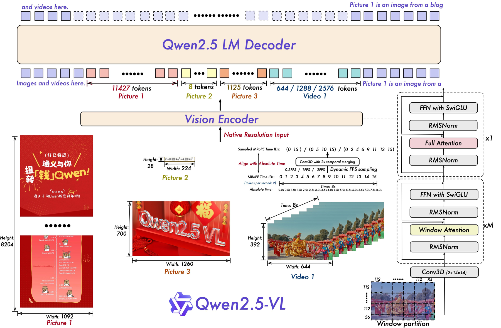

# Qwen2.5-VL Technical Report

## 📋 메타 정보

| 항목 | 내용 |
|---|---|
| **논문 제목** | Qwen2.5-VL Technical Report |
| **저자** | Qwen Team, Alibaba Group — 코어 기여자 27명 + 기여자 29명 |
| **공개일** | 2025-02-19 (v1), **본문 15쪽** (참고문헌 제외) |
| **분야** | Vision-Language Model(VLM, 시각-언어 모델), 문서 파싱(document parsing), 비디오 이해, GUI 에이전트 |
| **논문 링크** | [arXiv abstract](https://arxiv.org/abs/2502.13923v1) · [PDF](https://arxiv.org/pdf/2502.13923v1) |
| **코드/모델** | [GitHub](https://github.com/QwenLM/Qwen2.5-VL) · [HuggingFace](https://huggingface.co/Qwen) · **Apache 2.0** (72B는 별도 라이선스) |
| **라인업** | 3B / 7B / 72B × Instruct |
| **사용한 외부 재료** | Qwen2.5 LLM (언어 백본 초기화) · DataComp (ViT의 CLIP 사전학습 데이터) · Grounding DINO + SAM (grounding 데이터 합성) · PixMo (pointing·counting 데이터) · Qwen2-VL-Instag (SFT 데이터 분류기) |
| **문서 성격** | ⚠️ **가설 검증 논문이 아니라 릴리스 노트**. ablation 0건 · FLOPs 측정 0건 · 학습 하이퍼파라미터 0건 |

> 📌 본문 15쪽 전체에서 "ablation", "FLOPs", "latency", "throughput", "learning rate", "batch size", "epoch"이라는 단어가 **한 번도 등장하지 않는다**. "GPU"는 "GPU 간 부하 분산" 문맥에서 딱 한 번. 이 사실이 이 논문을 읽는 태도를 결정한다.

---

## 📖 주요 용어 사전 (Glossary)

*왜 먼저 두나: 이 논문의 기여 4개 중 3개가 위치 인코딩·어텐션 패턴처럼 이름만 봐서는 뭘 바꿨는지 알 수 없는 것들이라, 용어를 먼저 풀어두지 않으면 본문이 안 읽힌다.*

### 아키텍처
- **ViT (Vision Transformer, 비전 트랜스포머)**: 이미지를 작은 정사각형 조각(patch, 패치)으로 잘라서 각 조각을 하나의 토큰처럼 다루는 Transformer. 여기선 패치 크기 14×14 픽셀.
- **Window Attention(윈도우 어텐션)**: 모든 패치가 모든 패치를 보는 대신, **정해진 크기의 창(window) 안에서만** 서로 보게 제한하는 방식. 계산량이 패치 수의 제곱이 아니라 (패치 수 × 창 크기)로 줄어든다.
- **Full Attention(전역 어텐션)**: 제한 없이 모든 패치가 모든 패치를 보는 원래 방식. 창 안에 갇힌 정보를 이미지 전체로 퍼뜨리려면 이 층이 중간중간 필요하다.
- **merger(머저, vision-language projection)**: ViT가 뽑은 시각 특징을 LLM이 알아들을 크기·형식으로 바꾸는 다리. 여기선 **공간적으로 붙어 있는 2×2 패치 4개를 이어 붙여 토큰 1개로 압축**하는 2층 MLP.
- **RMSNorm / SwiGLU**: 요즘 LLM이 표준으로 쓰는 정규화(normalization) 방식과 활성화 함수(activation). 원래 ViT는 LayerNorm + GELU를 쓰는데, 이 논문은 비전 인코더도 LLM 설계 관례에 맞췄다.
- **native resolution(네이티브 해상도) 입력**: 이미지를 정해진 크기(예: 448×448)로 강제 리사이즈하지 않고 **원본 비율·크기 그대로** 넣어, 토큰 개수가 이미지마다 달라지는 방식.

### 위치 인코딩
- **RoPE (Rotary Position Embedding, 회전 위치 임베딩)**: 토큰 위치를 회전 각도로 바꿔 어텐션에 주입하는 방식. Transformer는 원래 순서를 모르기 때문에 이런 장치가 필요하다.
- **2D-RoPE**: 이미지는 위치가 (세로, 가로) 두 개라, 회전 각도를 두 축으로 나눠 주는 것. ViT 내부에서 사용.
- **MRoPE (Multimodal RoPE, 멀티모달 RoPE)**: Qwen2-VL이 도입. 위치를 **시간(t) / 세로(h) / 가로(w)** 세 축으로 쪼개 각각 다른 임베딩 차원 구간에 배정한 것. 텍스트는 세 축 모두 같은 값이라 결국 평범한 1D RoPE와 같아진다.
- **T-RoPE / 절대 시각 정렬(Aligned to Absolute Time)**: 이 논문의 기여. MRoPE의 **시간 축 id를 "몇 번째 프레임인가"가 아니라 "실제 몇 초인가"에 비례**시킨 것.
- **`tokens_per_second`**: 영상 1초를 시간 position id 몇 칸으로 표현할지 정하는 값. 이 모델은 **2**로 고정 → **시간 해상도 0.5초**.

### 학습·데이터
- **dynamic FPS sampling(가변 프레임률 샘플링)**: 영상에서 초당 몇 장을 뽑을지(fps)를 학습 중에 계속 바꿔가며 넣는 것. 다양한 재생 속도에 강해지게 만드는 목적.
- **smart_resize**: Qwen 전처리기가 쓰는 리사이즈 규칙. 가로·세로를 **28의 배수**로 맞추면서 총 픽셀 수를 `min_pixels`~`max_pixels` 사이에 넣고 종횡비는 최대한 보존한다.
- **QwenVL HTML**: 이 논문이 만든 문서 파싱 출력 문법. 문단·표·차트·수식·삽화·악보·화학식을 전부 `data-bbox` 좌표가 달린 HTML 태그 하나로 통일한 것.
- **Rejection Sampling(거부 샘플링)**: 모델에게 답을 여러 개 생성시킨 뒤 **정답과 맞는 것만 남기고** 나머지는 버려서 학습 데이터를 만드는 방법.
- **CoT (Chain-of-Thought, 사고 사슬)**: 답을 바로 내지 않고 중간 추론 과정을 글로 먼저 쓰는 것.
- **DPO (Direct Preference Optimization)**: 사람이 선호한 답 / 덜 선호한 답 쌍을 주고, 선호되는 쪽 확률을 직접 올리는 정렬(alignment) 방법. 별도의 리워드 모델 없이 학습한다.
- **SoM (Set-of-Mark)**: 화면에 숫자 라벨을 미리 찍어주고 모델은 "3번 버튼"처럼 번호로만 답하게 하는 보조 기법. 좌표를 직접 못 찍는 모델을 도와주는 목발.

### 평가
- **RefCOCO / RefCOCO+ / RefCOCOg**: "왼쪽에서 두 번째 남자" 같은 지시 표현(referring expression)을 듣고 박스를 찍는 벤치마크.
- **ODinW (Object Detection in the Wild)**: 학습 때 못 본 카테고리도 잡아내는 open-vocabulary detection(열린 어휘 객체 검출) 벤치마크.
- **OmniDocBench / CC-OCR / OCRBench**: 문서 파싱·OCR 종합 벤치마크. OmniDocBench는 edit distance(편집 거리)라 **낮을수록 좋다**.
- **ScreenSpot / ScreenSpot Pro**: GUI 화면에서 요소 위치를 찍는 능력 측정. Pro는 고해상도 전문가용 소프트웨어 화면이라 훨씬 어렵다.
- **Charades-STA**: 영상에서 "사람이 문을 여는 구간"을 초 단위로 찾아내는 temporal grounding(시간 그라운딩) 벤치마크. mIoU로 측정.

---

## 🎯 논문 요약 (TL;DR)

**한 줄**: Qwen2-VL 위에 **① ViT 윈도우 어텐션 ② 가변 FPS 학습 ③ 시간 position id를 절대 시각에 묶기 ④ 사전학습 데이터 1.2T→4.1T 토큰**을 얹은 릴리스 리포트. 실질 성능 레버는 사실상 ④(데이터)이고, ①~③은 근거 실험 없이 선언된다.

**저자들이 직접 쓴 문제 인식**: 지금의 VLM은 **"샌드위치 쿠키의 가운데 층"** 같아서 이것저것 다 하긴 하는데 뛰어난 게 없다. 그래서 이번엔 **fine-grained perception(세밀 지각)이라는 바닥층**을 다지고, 그 위에 real-world 응용을 위한 "agentic amplifier(에이전트 증폭기)"를 올리겠다는 것.

**해결책**: (1) 32개 ViT 층 중 28개를 윈도우 어텐션으로 바꿔 고해상도 비용을 깎고, (2) 영상의 시간 축 id를 실제 초에 비례시켜 fps가 달라도 시간 감각이 유지되게 하고, (3) 박스 좌표를 정규화하지 않고 실제 픽셀로 출력해 물체의 진짜 크기를 배우게 하고, (4) 문서의 모든 요소를 QwenVL HTML 한 문법으로 통일해 문서 파싱을 단일 모델로 흡수.

**검증**: 문서/OCR·GUI 에이전트·긴 영상에서 확실히 강하다. 다만 **종합 VQA는 11승 9패**이고, **grounding은 자기 표에서 1위가 0개**이며, 두 벤치마크에서는 **자기 전작 Qwen2-VL-72B에 진다**.

---

## 🔑 핵심 기여 (Contributions)

저자가 직접 "our contributions are four-folds"로 명시한 것:

1. **Window Attention을 비전 인코더에 도입** — 추론 효율 최적화 (§아키텍처 1)
2. **Dynamic FPS sampling** — 네이티브 동적 해상도를 시간 축까지 확장 (§아키텍처 2)
3. **MRoPE를 절대 시각에 정렬** — 더 정교한 시간 순서 학습 (§아키텍처 2)
4. **데이터 큐레이션 대규모 확장** — 사전학습 코퍼스 **1.2T → 4.1T 토큰** (§데이터)

추가로 초록·서론이 내세우는 특징 4가지:
- **문서 전방위 파싱(omni-document parsing)** — 손글씨·표·차트·화학식·악보까지
- **다양한 포맷의 정밀 grounding** — 박스 + 포인트 + 개수 세기, 절대 좌표와 JSON
- **초장편 영상 이해 + 초 단위 시간 그라운딩**
- **PC·모바일 GUI 에이전트 기능 강화**

---

## 🏗 아키텍처

*왜 이 절이 필요한가: 이 논문이 바꿨다고 주장하는 4개 중 3개가 아키텍처 안에 있고, 그 3개가 실제로 무엇을 얼마나 바꾸는지는 논문이 숫자로 보여주지 않기 때문에 직접 뜯어봐야 한다.*

```
이미지/비디오 → [재설계 ViT (윈도우 어텐션)] → [2×2 압축 MLP 머저] → [Qwen2.5 LLM Decoder]
```



> **Figure 1 읽는 법.** 왼쪽 아래 입력 예시가 네이티브 해상도의 의미를 보여준다 — Picture 1(1092×8204 세로 긴 스크린샷)은 **11,427 토큰**, Picture 2(224×28 띠 이미지)는 **8 토큰**, Picture 3(1260×700)은 **1,125 토큰**.
> 가운데 아래에 `Tokens per second: 2`와 `Absolute time: 0.0s 0.5s 1.0s … 8.0s`가 적혀 있는 게 절대 시각 정렬의 실체다. 8초 영상에 MRoPE Time ID가 0~15로 붙는다(= 초당 2칸).
> 오른쪽 아래 `Window partition` 그림에서 가장자리 창이 `84`, `56`처럼 잘려 있는 게 **"작은 영역은 패딩 없이 그대로 처리"**의 시각적 증거다.

### 토큰 수 공식 검증

*왜 확인하나: 네이티브 해상도라는 말만으로는 이미지 한 장이 컨텍스트를 얼마나 잡아먹는지 감이 안 오는데, 이게 실사용 비용을 그대로 결정하기 때문이다.*

패치 14×14로 자른 뒤 머저가 2×2를 1개로 합치므로, **LLM이 보는 토큰 수 = (높이 ÷ 28) × (너비 ÷ 28)**.

| Figure 1의 예시 | 계산 | 논문 표기 |
|---|---|---|
| Picture 1: 1092×8204 | (8204÷28) × (1092÷28) = 293 × 39 = **11,427** | 11427 ✅ |
| Picture 2: 224×28 | (28÷28) × (224÷28) = 1 × 8 = **8** | 8 ✅ |
| Picture 3: 1260×700 | (700÷28) × (1260÷28) = 25 × 45 = **1,125** | 1125 ✅ |

세 개 모두 정확히 일치한다. 이게 `smart_resize`가 가로·세로를 28의 배수로 맞추는 이유다.

---

### 1️⃣ ViT: Window Attention (기여 #1)

*왜 이걸 하나: 네이티브 해상도로 넣으면 이미지 크기에 따라 패치 수가 제멋대로가 되고, 어텐션 계산량은 패치 수의 제곱으로 커진다. 4K 이미지 한 장이 학습 배치 전체를 멈춰 세우는 부하 불균형(computational load imbalance)이 생긴다.*

**설계**
- ViT 32개 층 중 **28개는 윈도우 어텐션**, `{7, 15, 23, 31}` 네 층만 **full attention(전역 어텐션)**
- 윈도우 = **112×112 픽셀 = 8×8 패치**
- 윈도우보다 작은 영역은 **패딩 없이** 원래 크기 그대로 처리 (원본 해상도 보존)
- **2D-RoPE**로 공간 위치 표현
- 비디오는 **연속 2프레임을 한 덩어리로 묶어**(3D patch partitioning) LLM 토큰 수를 절반으로
- **RMSNorm + SwiGLU** 채택 — LLM 설계 관례에 맞춰 비전·언어 부품의 호환성을 높임
- DataComp + 인하우스 데이터로 **from scratch(맨바닥부터) 학습**. CLIP 사전학습 → vision-language alignment → end-to-end 미세조정의 3단계

**코드 검증**: 공식 구현체(`transformers/models/qwen2_5_vl/modeling_qwen2_5_vl.py`)의 `get_window_index()`를 보면 윈도우가 **머저 이후 격자 기준 4×4**로 잡힌다.

```python
vit_merger_window_size = self.window_size // self.spatial_merge_size // self.patch_size
# = 112 // 2 // 14 = 4
```

4×4 머지 유닛 = 8×8 원본 패치 = 112×112 픽셀. **논문 서술과 정확히 일치**한다. 윈도우당 어텐션 길이는 최대 64 토큰(=4×4×4). 패딩은 `-100`으로 넣었다가 제거하므로 "작은 영역은 패딩 없이 처리"도 사실이다.

#### 논문이 안 준 효율 수치 — 직접 계산

*왜 계산하나: 초록이 "computational overhead를 크게 줄였다"고 주장하는데, 논문 전체에 FLOPs·지연시간·처리량 숫자가 단 하나도 없다. 그러면 직접 세는 수밖에 없다.*

ViT 전체 FLOPs(선형층 qkv/proj/MLP + 어텐션)를 hidden 1280, FFN 3420, 32층, 윈도우 64토큰으로 계산하면:

| 입력 해상도 | 패치 수 | LLM 토큰 | 전역 ViT | 윈도우 ViT | 절감 | 배속 |
|---|---|---|---|---|---|---|
| 448×448 | 1,024 | 256 | 1.46 TFLOPs | 1.32 T | **9.6%** | 1.11× |
| 1024×1024 | 5,329 | 1,332 | 11.37 T | 7.34 T | **35.4%** | 1.55× |
| 1920×1080 | 10,549 | 2,637 | 31.52 T | 15.67 T | **50.3%** | 2.01× |
| 3840×2160 | 42,196 | 10,549 | 344.88 T | 90.02 T | **73.9%** | 3.83× |

**해석 — "선형 복잡도"가 아니다.**
- 작은 이미지(448²)에선 **10%도 못 줄인다**. 선형층(qkv·proj·MLP)이 비용을 지배하기 때문이다.
- 4K에서도 남겨둔 **4개 전역 층이 전체의 40.9%**를 여전히 먹는다.
- 즉 실제로 일어난 일은 "제곱 복잡도를 선형으로 바꾼 것"이 아니라 **"제곱 항의 계수를 대략 1/8로 깎은 것"**이다. 초록의 "significantly reduced computational overhead"는 **고해상도에서만 참**이다.

---

### 2️⃣ 절대 시각 정렬 MRoPE (기여 #2 + #3)

*왜 이걸 하나: Qwen2-VL은 시간 position id를 "몇 번째 프레임인가"에 묶었다. 그러면 같은 10초 영상이라도 1fps로 뽑으면 id가 0~9, 4fps로 뽑으면 0~39가 되어 모델은 "이게 10초짜리"라는 사실을 알 방법이 없다. 사건이 빨리 일어났는지 천천히 일어났는지도 구분 못 한다.*

**MRoPE 복습** (Qwen2-VL 도입, 이 논문이 물려받은 것):
- 위치를 **시간(t) / 세로(h) / 가로(w)** 셋으로 분해
- **텍스트**: 세 축 모두 같은 id → 사실상 평범한 1D RoPE와 동일
- **이미지**: t는 고정, h·w만 위치에 따라 변함
- **비디오**: 프레임마다 t가 하나씩 증가, h·w는 이미지와 동일

**Qwen2.5-VL의 변경**: t를 프레임 번호가 아니라 **실제 초에 비례**시킨다. 그러면 fps가 뭐든 "1초 = 항상 같은 id 간격"이 유지되어, 모델이 id 간격만 보고 사건의 속도(tempo)를 알 수 있다. 추가 계산 비용은 0이다. 논문은 이걸 "텍스트 타임스탬프를 넣거나 별도 head를 다는 다른 접근과 달리 새롭고 효율적"이라고 자평한다.

#### 코드 검증 — 그리고 논문에 없는 하드 한계

공식 구현체 `get_rope_index()`:

```python
time_tensor = expanded_range * second_per_grid_t * self.config.vision_config.tokens_per_second
t_index = time_tensor.long().flatten()      # ← 정수 절단(truncation)
```

- `tokens_per_second = 2` (config 고정값) → **시간 id 해상도 = 0.5초**
- `second_per_grid_t = temporal_patch_size / fps = 2 / fps` (processor에서 계산, 기본 `fps=2.0`)
- 따라서 **프레임쌍(2프레임) 하나당 시간 id 증가폭 = 4 / fps**

이걸 fps별로 굴려보면:

| fps | second_per_grid_t | 프레임쌍당 시간 id 증가 | 실제 시간 position id 열 |
|---|---|---|---|
| 1 | 2.0 | 4 | 0, 4, 8, 12, 16, 20, … |
| 2 (기본) | 1.0 | 2 | 0, 2, 4, 6, 8, 10, … |
| **4** | 0.5 | 1 | 0, 1, 2, 3, 4, 5, … ← **한계선** |
| **8** | 0.25 | 0.5 | **0, 0, 1, 1, 2, 2, 3, 3** ← 2중 충돌 |
| **16** | 0.125 | 0.25 | **0, 0, 0, 0, 1, 1, 1, 1** ← 4중 충돌 |

> 🔴 **fps 4를 넘기면 서로 다른 프레임이 같은 시간 id를 받는다.** 즉 기여 #2로 내세운 "dynamic FPS sampling"은 **fps ≤ 4에서만 의미가 있고**, 그 위로는 시간축이 물리적으로 뭉개진다. 초록의 "second-level event localization(초 단위 이벤트 위치 찾기)"은 0.5초 해상도라 성립하지만, 그보다 정밀한 시간 그라운딩은 **구조적으로 불가능**하다. 논문은 이 상한을 어디에도 언급하지 않는다.

> 🐛 **공식 구현체 문서 버그**: `transformers`의 `get_rope_index` docstring은 *"we have **25** tokens per second… interval = 25 × 2 / 1 = **50**"*이라고 설명하고 예시로 `[0, 0, 0, 0, 50, 50, ...]`을 든다. 하지만 실제 shipped config는 `tokens_per_second: 2`이므로 진짜 값은 `[0, 0, 0, 0, 2, 2, ...]`다. 이 docstring만 보고 구현하면 틀린다.

---

### 3️⃣ 절대 좌표(absolute coordinate) grounding

*왜 이걸 하나: Qwen2-VL은 박스를 0~1000으로 정규화해 출력했다. 그러면 "화면의 30% 지점"은 알아도 "이 물체가 실제로 몇 픽셀짜리인가"는 날아간다. 네이티브 해상도로 학습하는 마당에 좌표만 정규화하면 크기 감각을 스스로 버리는 셈이다.*

**변경**: 박스와 포인트를 **입력 이미지의 실제 픽셀 값**으로 출력한다. XML·JSON·커스텀 등 여러 포맷으로 합성 학습.

**데이터 설계 3가지**:
- **10,000개 이상 객체 카테고리**로 확장 → open-vocabulary detection 강화
- **존재하지 않는 카테고리를 일부러 질의에 섞은** 데이터 합성 → "없으면 없다고 말하기" 학습 (extreme object detection 대응)
- Grounding DINO + SAM으로 자동 라벨, copy-paste augmentation 병용
- **포인트 grounding**: PixMo의 공개 pointing·counting 데이터 + 검출/분할 데이터 + 자체 자동 파이프라인

> ⚠️ **논문이 말하지 않은 함정 — 좌표계의 기준.**
> 여기서 "실제 픽셀"은 사용자가 넣은 **원본 이미지가 아니라 `smart_resize` 이후 28의 배수로 리사이즈된 이미지** 기준이다. 기본 `max_pixels = 12,845,056`이므로 4000×3000 사진은 자동으로 축소된다. 즉 모델이 뱉은 박스를 원본 위에 그리려면 `원본크기 ÷ 리사이즈크기` 비율을 직접 곱해야 하는데, **논문 어디에도 이 말이 없다.** 실사용에서 가장 많이 터지는 지점이다.
>
> 참고로 `max_pixels = 12,845,056 = 16,384 × 28²`이므로, 이미지 한 장의 기본 상한은 **16,384 패치 = 4,096 LLM 토큰**이다.

---

### 4️⃣ 스펙 표 — 논문 Table 1 vs 실제 config

*왜 대조하나: 논문 표만 보고 모델을 재구현하거나 크기를 비교하면 틀리기 때문이다. HuggingFace의 `config.json` 3개와 한 줄씩 맞춰봤더니 **오류 3건**이 나왔다.*

| 항목 | 3B (논문 / 실제) | 7B (논문 / 실제) | 72B (논문 / 실제) |
|---|---|---|---|
| ViT Hidden | 1280 / 1280 ✅ | 1280 / 1280 ✅ | 1280 / 1280 ✅ |
| ViT Layers | 32 / 32 ✅ | 32 / 32 ✅ | 32 / 32 ✅ |
| **ViT Intermediate** | 3456 / **3420** ❌ | 3456 / **3420** ❌ | 3456 / 3456 ✅ |
| ViT Window Size | 112 / 112 ✅ | 112 / 112 ✅ | 112 / 112 ✅ |
| Full Attn Blocks | {7,15,23,31} ✅ | {7,15,23,31} ✅ | {7,15,23,31} ✅ |
| LLM Hidden | 2048 / 2048 ✅ | 3584 / 3584 ✅ | 8192 / 8192 ✅ |
| LLM Layers | 36 / 36 ✅ | 28 / 28 ✅ | 80 / 80 ✅ |
| LLM KV Heads | 2 / 2 ✅ | 4 / 4 ✅ | 8 / 8 ✅ |
| **LLM Intermediate** | 4864 / **11008** ❌ | 18944 / 18944 ✅ | 29568 / 29568 ✅ |
| **Vocabulary Size** | 151646 / **151936** ❌ | 151646 / **152064** ❌ | 151646 / **152064** ❌ |

**오류 3건 정리**
1. **ViT가 세 모델에서 동일하지 않다.** 논문 표는 ViT 열을 통째로 같게 적어놨지만, 3B/7B는 FFN 3420, **72B만 3456**이다.
2. **3B의 LLM Intermediate `4864`는 Qwen2.5-0.5B의 값**이다. 실제로는 11008. 다른 모델 스펙에서 복사한 흔적으로 보인다.
3. **Vocab `151646`은 세 모델 중 어느 것과도 맞지 않는다.** (3B는 151936, 7B/72B는 152064)

### 5️⃣ 실측 파라미터 — 모델 이름이 거짓말한다

*왜 세나: "3B니까 가볍겠지"라고 판단하면 배포 계획이 어긋난다. 특히 비전 인코더가 이름에 안 들어가 있다.*

직접 계산한 뒤 HuggingFace `model.safetensors.index.json`의 `total_size`(bf16 바이트 ÷ 2)로 **소수점까지 교차 검증**했다.

| 모델명 | ViT + 머저 | LLM | **실측 총합** | 이름 대비 | ViT 비중 |
|---|---|---|---|---|---|
| Qwen2.5-VL-**3B** | 668.7M | 3.086B | **3.755B** | **+25%** | **17.8%** |
| Qwen2.5-VL-**7B** | 676.6M | 7.616B | **8.292B** | **+18%** | 8.2% |
| Qwen2.5-VL-**72B** | 704.6M | 72.706B | **73.411B** | +2% | 1.0% |

- 모델 이름은 **LLM 백본 크기만** 가리키고 ViT는 세지 않는다. ViT는 크기와 무관하게 항상 **~670~700M**으로 거의 고정이다(머저의 출력 차원만 달라짐).
- **3B에서는 ViT가 전체의 17.8%**다. "엣지 AI용 3B"라고 부르지만 실제로는 3.755B이고, 그중 6분의 1이 비전 인코더다.
- 다른 모델과 비교할 때 이 점을 빼먹으면 안 된다.

---

## 📚 데이터 — 이 논문의 진짜 본체

*왜 여기가 본체인가: 아키텍처 기여 3개는 근거 실험이 하나도 없고, 성능이 오른 유일하게 확실한 이유가 데이터를 3.4배로 늘린 것이기 때문이다.*

### 사전학습 3단계 (Table 2)

| 단계 | Visual Pre-Training | Multimodal Pre-Training | Long-Context Pre-Training |
|---|---|---|---|
| **데이터** | 이미지 캡션 · 시각 지식 · OCR | + 순수 텍스트 · 인터리브 · VQA · 비디오 · grounding · 에이전트 | + 롱비디오 · 롱에이전트 · 롱문서 |
| **토큰** | 1.5T | 2T | 0.6T |
| **시퀀스 길이** | 8,192 | 8,192 | **32,768** |
| **학습 대상** | **ViT만** | ViT + LLM | ViT + LLM |

- 합계 **4.1T** (Qwen2-VL 1.2T의 3.4배). 데이터 종류별 비율은 공개하지 않는다.
- 실제로는 4단계다 — 표 이전에 **DataComp로 ViT를 CLIP 방식으로 맨바닥 사전학습**하는 단계가 따로 있다.
- **부하 균형 전략**: 이미지 크기와 텍스트 길이가 제각각이라 GPU마다 계산량이 달라지는 문제를, **LLM 입력 시퀀스 길이 기준으로 샘플을 동적으로 묶어(dynamic packing)** 해결한다. ViT는 파라미터가 적고 윈도우 어텐션까지 넣어 가벼우므로 LLM 쪽만 맞추면 된다는 논리.

### 주목할 데이터 설계 4가지

*왜 이 넷인가: 나머지는 "많이 모았다"는 서술이지만, 이 넷은 다른 팀이 그대로 가져다 쓸 수 있는 구체적 방법론이다.*

#### ① 인터리브 데이터 4축 채점

이미지와 텍스트가 번갈아 섞인 웹 데이터(interleaved image-text)는 (1) in-context learning 가능 (2) 이미지가 없어도 텍스트 능력 유지 (3) 넓은 일반 지식이라는 세 이점이 있지만, 대부분 **이미지와 텍스트가 사실상 무관하고 노이즈가 심하다.**

그래서 표준 클리닝 후 내부 평가 모델이 4축으로 채점한다:
1. **텍스트 자체 품질**
2. **이미지-텍스트 관련성** — 이미지가 그냥 장식이 아니라 텍스트를 **실제로 보충·설명·확장하는가**
3. **정보 상호보완성** — 둘이 각각 고유한 정보를 줘서 합쳐야 완전한 이야기가 되는가
4. **정보 밀도 균형** — 한쪽이 지나치게 많지 않은가

#### ② QwenVL HTML 포맷 ⭐ — 이 논문의 진짜 발명

기존 문서 파싱은 레이아웃 분석 · 텍스트 추출 · 차트 해석 · 삽화 처리를 **각각 별도 모델**로 했다. 이 논문은 그걸 **출력 문법 하나로 접어버린다.**

```html
<html><body>
<p data-bbox="x1 y1 x2 y2"> 문단 내용 </p>
<style>table{id} style</style><table data-bbox="..." class="table{id}"> 표 내용 </table>
<div class="chart" data-bbox="..."> <table> 차트 내용 </table></div>
<div class="formula" data-bbox="...">  <div> 수식 </div></div>
<div class="image caption" data-bbox="..."> <p> 캡션 </p></div>
<div class="image ocr" data-bbox="..."> <p> 이미지 속 글자 </p></div>
<div class="music sheet" format="abc notation" data-bbox="...">  <div> 악보 </div></div>
<div class="chemical formula" format="smile" data-bbox="...">  <div> 화학식 </div></div>
</html></body>
```

핵심은 **모든 요소에 `data-bbox` 좌표가 달린다**는 것과, **악보는 ABC notation, 화학식은 SMILES**처럼 도메인 표준 표기를 그대로 끌어다 쓴다는 것. 읽기 순서(reading order)도 레이아웃에 반영한다. 문서의 **레이아웃 · 글자 · 차트 · 삽화 전부가 하나의 표준 표현**으로 떨어진다.

> 💡 이게 OmniDocBench / CC-OCR SOTA의 직접 원인이고, **Qwen3-VL이 QwenVL-HTML / QwenVL-Markdown 두 포맷으로 확장해 그대로 계승**한다. 아키텍처 기여들이 폐기되는 와중에 살아남은 것.

#### ③ OCR·차트·표 데이터 규모

- **다국어 OCR**: 프랑스어·독일어·이탈리아어·스페인어·포르투갈어·아랍어·러시아어·일본어·한국어·베트남어 (중·영 제외 **10개**)
- **차트**: matplotlib · seaborn · plotly로 **100만 장 합성** (막대·관계도·히트맵 등)
- **표**: 실사 **600만 장**을 오프라인 end-to-end 표 인식 모델로 처리한 뒤, **신뢰도 낮은 표 · 겹친 표 · 셀 밀도 부족한 표를 걸러냄**

#### ④ 에이전트 데이터의 "사후 이유 붙이기"

*왜 필요한가: GT 조작만 학습하면 모델이 화면 패턴에 과적합돼서 조금만 달라진 화면에서 무너진다.*

절차가 영리하다:
1. 모바일·웹·데스크톱 스크린샷 수집 → 합성 엔진이 화면 캡션 + UI 요소 grounding 주석 생성
2. 세 플랫폼의 조작을 **공유 액션 공간을 가진 function call 포맷 하나로 통일**
3. 다단계 궤적(trajectory)을 오픈소스 + 에이전트 프레임워크 합성으로 확보
4. **정답 조작을 스크린샷에 하이라이트**한 뒤, 조작 전/후 스크린샷과 전역 질의를 주석자(사람+모델)에게 주고 **"왜 이 조작을 했는지 의도를 써라"**고 시킴
5. 모델 기반 필터로 저품질 추론 텍스트 제거

이 추론 텍스트가 GT 조작에 대한 과적합을 막는다는 게 명시된 논리다.

### 후학습(Post-training): SFT → DPO

*왜 두 단계인가: SFT는 "지시를 따르는 형식"을 심고, DPO는 "사람이 더 좋아하는 답"으로 미세 조정한다. 목적이 다르다.*

**공통 조건: 두 단계 모두 ViT는 동결(frozen)**한다.

**SFT**
- 약 **200만 건**, **순수 텍스트 50% : 멀티모달 50%**
- 단 토큰 수 기준으로는 멀티모달이 훨씬 무겁다는 걸 논문이 명시
- ChatML 포맷 채택 → (1) 멀티모달 대화의 역할 태깅 (2) 시각 임베딩의 구조적 주입 (3) 포맷 인지 패킹으로 교차 모달 위치 관계 보존
- 중·영 중심 + 다국어 보조. 단일턴/멀티턴, 단일이미지/멀티이미지 모두 포함

**2단계 데이터 필터 파이프라인**
1. **도메인 분류**: `Qwen2-VL-Instag`(Qwen2-VL-72B에서 파생한 분류 모델)가 QA 쌍을 **8개 주 도메인 / 30개 세부 카테고리**로 계층 분류 (예: Coding → Code_Debugging, Code_Generation, Code_Translation, Code_Understanding)
2. **도메인 맞춤 필터**:
   - **룰 기반**: 문서·OCR·grounding 데이터의 반복 패턴 제거, 불완전·잘림·포맷 불량 응답 제거, 무관하거나 유해할 수 있는 QA 폐기
   - **모델 기반**: Qwen2.5-VL 계열 리워드 모델이 질의(복잡도·관련성)와 응답(정확성·완결성·명료성·관련성·유용성)을 다축 채점. **시각 근거 과제에선 "시각 정보를 실제로 해석하고 활용했는가"를 특별히 검증**

**Rejection Sampling으로 추론력 강화**
- GT 주석이 있는 데이터(수학·코드 생성·도메인 특화 VQA)에서 출발
- 중간 버전 Qwen2.5-VL로 CoT를 생성 → **GT와 맞는 것만 남김**
- 추가 배제 조건: **언어 혼용(code-switching) · 과도한 길이 · 반복 패턴**
- 남은 과제로 저자가 직접 인정한 것: **중간 추론 단계가 시각 정보를 제대로 못 쓰는 문제**(시각 단서를 무시하거나 오독). 룰+모델 필터로 완화하지만 "여전히 진행 중인 도전"이라고 명시

**DPO**
- **이미지-텍스트와 순수 텍스트만** 사용 (**비디오 없음**)
- 각 샘플을 **1회만** 처리

---

## 📊 실험 요약 — 냉정하게 재집계

*왜 재집계하나: 본문 서술과 자기 표의 숫자가 여러 곳에서 어긋나기 때문이다. 표를 한 행씩 대조했다.*

### ✅ 문서 / OCR (Table 5) — 논쟁 여지 없는 강점

| 벤치마크 | Qwen2.5-VL-72B | 최강 경쟁자 | 판정 |
|---|---|---|---|
| CC-OCR | **79.8** | Gemini 1.5 Pro 73.0 | ✅ |
| OmniDocBench edit **en** ↓ | **0.226** | Gemini 0.230 | ✅ |
| OmniDocBench edit **zh** ↓ | 0.324 | Gemini **0.281** | ❌ |
| DocVQA | **96.4** | InternVL2.5-78B 95.1 | ✅ |
| InfoVQA | **87.3** | InternVL 84.1 | ✅ |
| OCRBench | **885** | InternVL 854 | ✅ |
| OCRBench_v2 en/zh | **61.5 / 63.7** | Gemini 51.9/43.1 | ✅ **+9.6 / +20.6** |
| SEED-Bench-2-Plus | **73.0** | GPT-4o 72.0 | ✅ |
| AI2D | 88.7 | InternVL **89.1** | ❌ |
| ChartQA | 89.5 | Claude 3.5 **90.8** | ❌ |
| CharXiv RQ / DQ | 49.7 / **87.4** | Claude **60.2** / 84.3 | 반반 |

**여기가 이 논문의 진짜 성취**다. 특히 OCRBench_v2 중국어에서 Gemini 1.5 Pro를 20.6점 차로 압도한다. 다만 본문이 "OmniDocBench에서 new SOTA"라고 쓰는데 **중국어는 Gemini에 진다** — 영어만 1위다.

### ✅ GUI 에이전트 (Table 9) — 가장 극적인 개선

| 벤치마크 | Qwen2.5-VL-72B | 비교 | 판정 |
|---|---|---|---|
| **ScreenSpot Pro** | **43.6** | Aguvis-72B 23.6 / **Qwen2-VL-72B 1.6** | ✅ **27배** |
| Android Control Low | **93.7** | Aguvis 84.4 | ✅ |
| Android Control High | **67.36** | Aguvis 66.4 | ✅ (근소) |
| MobileMiniWob++ | **68%** | Aguvis 66% | ✅ (근소) |
| AndroidWorld | **35%** | GPT-4o 34.5% (SoM) | ✅ (근소) |
| ScreenSpot | 87.1 | **Aguvis-72B 89.2** | ❌ |
| OSWorld | 8.83 | **Claude 14.90** | ❌ |

**ScreenSpot Pro 1.6 → 43.6**이 압권이다. 전작은 고해상도 전문 소프트웨어 UI를 찍는 능력이 **사실상 0**이었는데 생겼다. 네이티브 해상도 + 절대 좌표 조합의 가장 설득력 있는 증거다.

> ⚠️ 다만 본문은 *"87.1%로 Gemini 2.0(84.0)·Claude(83.0)와 강하게 경쟁한다"*고 쓰는데, **같은 표 안의 Aguvis-72B가 89.2로 더 높다.** 비교 문장에서 조용히 빠졌다. OSWorld(8.83 vs Claude 14.90)도 본문은 "comparable"이라 표현한다.

### ✅ 비디오 (Table 8) — 길수록 강해진다

| 벤치마크 | Qwen2.5-VL-72B | GPT-4o | Gemini 1.5 Pro |
|---|---|---|---|
| **LVBench** (초장편) | **47.3** | 30.8 | 33.1 | 
| **MLVU** | **74.6** | 64.6 | – |
| **EgoSchema** | **76.2** | 72.2 | 71.2 |
| MVBench | **70.4** | 64.6 | 60.5 |
| MMBench-Video | **2.02** | 1.63 | 1.30 |
| TempCompass | **74.8** | 73.8 | 67.1 |
| **Charades-STA mIoU** | **50.9** | 35.7 | – |
| Video-MME (자막 없음) | 73.3 | 71.9 | **75.0** | 
| LongVideoBench | 60.7 | **66.7** | 64.0 |
| MMVU | 62.9 | **67.4** | 65.4 |

**LVBench에서 GPT-4o를 16.5점 차로 앞선다** — 영상이 길수록 격차가 벌어지는 패턴이 절대시각 MRoPE의 간접 증거로 볼 만하다. Charades-STA 50.9도 시간 그라운딩이 실제로 되고 있다는 신호다.

평가 조건: **프레임 최대 768장, 비디오 토큰 24,576 상한**.

### ⚠️ 종합 VQA (Table 3) — 11승 9패

*왜 세어보나: 본문은 "state-of-the-art performance in various VQA tasks"라고 쓰는데, 실제로 한 행씩 세면 다른 그림이 나온다.*

| 판정 | 벤치마크 (Qwen2.5-VL-72B vs 최강 경쟁자) |
|---|---|
| ✅ **11승** | MMMU 70.2 vs 70.1 **(+0.1)** · MathVista 74.8 vs 72.3 · MATH-Vision 38.1 vs 32.2 · MathVerse 57.6 vs 51.7 · MMBench-EN 88.6 vs 88.3 **(+0.3)** · MMBench-V1.1-EN 88.4 vs 87.4 · MMStar 70.8 vs 69.5 · MuirBench 70.7 vs 68.0 · CRPE 79.2 vs 78.8 **(+0.4)** · MME-RealWorld 63.2 vs 62.9 **(+0.3)** · MMVet 76.2 vs 74.0 |
| ❌ **9패** | MMMU-Pro 51.1 vs GPT-4o 51.9 · MegaBench 51.3 vs 54.2 · MMBench-CN 87.9 vs 88.5 · MME 2448 vs 2494 · BLINK 64.4 vs 68.0 · **HallBench 55.2 vs 58.1** · MTVQA 31.7 vs 31.9 · **RealWorldQA 75.7 vs 78.7** · MM-MT-Bench 7.6 vs 7.72 |

- **이긴 11개 중 4개는 0.5점 미만 차이**다 (굵게 표시).
- 🔴 **굵게 표시한 2패는 자기 전작 Qwen2-VL-72B에 진 것**이다. HallBench 58.1 → 55.2 (환각 억제가 **오히려 나빠짐**), RealWorldQA 77.8 → 75.7. **그런데 본문은 이 두 벤치마크를 "Qwen2.5-VL이 excel한다"는 목록에 그대로 나열한다.**
- 📐 **표 구성 문제**: "Previous Open-source SoTA" 열이 대부분 `Chen et al. 2024d` = **InternVL2.5**인데, InternVL2.5-78B가 바로 옆에 자기 열로 또 있다. **같은 모델이 두 열을 차지해** 시각적으로 경쟁자가 많아 보인다.

### 🔴 Grounding (Table 6) — 본문과 표가 정면 충돌

본문 주장: *"Qwen2.5-VL achieves **leading performance across different benchmarks** from box-grounding, and point-grounding to counting."*

실제 Table 6 (10개 행):

| 벤치마크 | Qwen2.5-VL-72B | 1위 | 판정 |
|---|---|---|---|
| RefCOCO val / testA / testB | 92.7 / 94.6 / 89.7 | **InternVL2.5-78B 93.7 / 95.6 / 92.5** | ❌❌❌ |
| RefCOCO+ val / testA / testB | 88.9 / 92.2 / 83.7 | **InternVL2.5-78B 90.4 / 94.7 / 86.9** | ❌❌❌ |
| RefCOCOg val / test | 89.9 / 90.3 | **InternVL2.5-78B 92.7 / 92.2** | ❌❌ |
| ODinW | 43.1 | **Grounding DINO 55.0** | ❌ (LVLM 중엔 1위) |
| PointGrounding | 67.5 | **Molmo-72B 69.2** | ❌ |

> 🔴 **Table 6에서 Qwen2.5-VL-72B가 1위인 행은 0개다.** 실제로 이긴 grounding 관련 지표는 별도 표(Table 7)의 **CountBench 93.6** (vs Molmo 91.2) 하나뿐이다. 본문의 "leading performance" 주장은 **자기 표로 반증된다.**
>
> 단, ODinW 서술은 정직하다 — *"most LVLMs를 앞서고 generalist와 specialist의 격차를 빠르게 좁힌다"*라며 Grounding DINO에 진다는 점을 숨기지 않는다.

### ✅ 순수 텍스트 (Table 4) — 언어 능력 보존은 성립

*왜 보나: VLM 학습을 하면 원래 LLM의 언어 능력이 깎이는 게 일반적인데, 이 논문은 안 깎였다고 주장한다.*

| 벤치마크 | Qwen2.5-72B (원본 LLM) | Qwen2.5-VL-72B | 변화 |
|---|---|---|---|
| MMLU-Pro | 71.1 | 71.2 | +0.1 |
| MMLU-redux | 86.8 | 85.9 | −0.9 |
| GPQA | 49.0 | 49.0 | 0 |
| MATH | 83.1 | 83.0 | −0.1 |
| GSM8K | 95.8 | 95.3 | −0.5 |
| HumanEval | 86.6 | 87.8 | +1.2 |
| **LiveBench-0831** | 52.3 | **57.0** | **+4.7** |
| **MultiPL-E** | 75.1 | **79.5** | **+4.4** |
| IFEval | 84.1 | 86.3 | +2.2 |

**"언어 능력을 보존한다"는 주장은 성립**한다 (손실 최대 0.9).

> 🤔 다만 **LiveBench +4.7, MultiPL-E +4.4처럼 크게 오른 항목**이 문제다. 비전 학습이 코딩 능력을 좋게 만들 리가 없으므로 **후학습 데이터가 달랐다는 뜻**인데 논문은 설명하지 않는다. 즉 이 표는 "VL 학습의 무해성"을 보이는 **통제된 비교가 아니다.**

### 🔍 크기 역전 — 7B가 72B를 이기는 곳

| 벤치마크 | 7B | 72B |
|---|---|---|
| TextVQA | **84.9** | 83.5 |
| VCR En-Hard-EM | **80.5** | 79.8 |

논문에 언급이 없다. 3B는 VCR에서 37.5로 급락(7B 80.5)하는데, 이 정도 비선형성은 설명이 필요하다.

---

## 🚨 급소 정리

*왜 모아두나: 이 논문을 인용하거나 재현할 때 반드시 확인해야 할 지점들이다.*

| # | 문제 | 근거 |
|---|---|---|
| 1 | **ablation 0건** | 기여 4개 전부 근거 실험 없음. 무엇이 성능을 올렸는지 분해 불가 |
| 2 | **효율 주장에 숫자 0개** | "computational overhead 크게 감소"인데 FLOPs·지연·처리량 측정 전무. 직접 계산하면 448²에선 **9.6%뿐** |
| 3 | **학습 재현 불가** | learning rate · 배치 · 옵티마이저 · 에폭 · GPU 수/시간 전부 없음. 데이터 종류별 비율도 없음 |
| 4 | **Table 1 오류 3건** | ViT FFN(3420≠3456) · 3B LLM FFN(11008≠4864) · vocab(어느 모델과도 불일치) |
| 5 | **grounding 본문↔표 충돌** | "leading performance"인데 Table 6에서 1위 행 **0개** |
| 6 | **자기 전작 회귀 은폐** | HallBench 58.1→55.2, RealWorldQA 77.8→75.7인데 "excel" 목록에 포함 |
| 7 | **경쟁자 선택적 누락** | ScreenSpot 서술에서 같은 표의 Aguvis-72B(89.2) 생략 |
| 8 | **fps 4 초과 시 시간축 붕괴** | `tokens_per_second=2` + 정수 절단 → fps 8에서 프레임쌍 id 충돌. 논문에 언급 없음 |
| 9 | **절대 좌표의 기준 미명시** | `smart_resize` 이후 이미지 기준. 원본 복원 방법이 논문에 없음 |
| 10 | **파라미터 이름 과소표기** | 3B=**3.755B**(+25%), 7B=**8.292B**(+18%). ViT ~670M 미계상 |
| 11 | **비교표 중복** | "Previous Open SoTA" 열이 대부분 옆의 InternVL2.5-78B와 동일 |
| 12 | **구현체 docstring 오류** | `transformers`가 `tokens_per_second=25`, interval=50이라 설명. 실제 config는 2 |

---

## 🧬 계보 — 9개월 뒤의 심판

*왜 이 절이 필요한가: 이 논문의 기여를 평가하는 가장 확실한 방법은 "같은 팀이 다음 모델에서 그걸 유지했는가"를 보는 것이다. 그리고 결과가 잔인하다.*

```
Qwen2-VL (2024-09)      MRoPE 도입 · 정규화 [0,1000] 좌표 · 프레임번호 기반 시간 id
        ↓
Qwen2.5-VL (2025-02)    윈도우 어텐션 · 절대픽셀 좌표 · 절대시각 T-RoPE · 4.1T 토큰
        ↓
Qwen3-VL (2025-11)      ← 여기서 무슨 일이 벌어지나
```

| Qwen2.5-VL의 주장 | Qwen3-VL의 판정 |
|---|---|
| **절대시각 T-RoPE** (기여 #3) | ❌ **폐기.** 이유 2가지 — (1) 긴 영상이면 시간 position id가 **거대하고 희소**해져 장기 문맥이 망가짐 (2) 다양한 fps로 균일 샘플링한 학습 데이터를 대량 만들어야 해서 **데이터 구축 비용이 폭증**. → 대안은 어이없이 단순하다: 프레임 앞에 그냥 **글자로** `<3.0 seconds>`를 쓴다 |
| **절대 픽셀 좌표** | ❌ **[0,1000] 정규화로 원복.** 해상도·종횡비 강건성 + 후처리 단순화가 명시된 이유. **Qwen2-VL 방식으로 되돌아감** (마이그레이션 breaking change) |
| **Dynamic FPS sampling** (기여 #2) | ❌ 위 두 개에 딸려서 존재 이유 소멸 |
| **Window Attention ViT** | ✅ 유지 (단 인코더 자체는 SigLIP-2 기반으로 교체) |
| **4.1T 데이터 + QwenVL HTML** | ✅ **계승·확장.** OCR 언어 10개 → 39개, HTML/Markdown 2포맷 |

> 💡 **가장 큰 교훈**: Qwen2.5-VL이 **정교한 기하학적 시간 인코딩**으로 푼 문제를, Qwen3-VL은 *"LLM은 이미 숫자를 읽을 줄 아는데 왜 굳이 위치 인코딩으로 시간을 표현했나"*며 **텍스트 한 줄로 대체**했다. 단순한 게 이겼다.
>
> 그리고 이 폐기 근거들(id 희소화, 데이터 구축비)은 **Qwen2.5-VL이 ablation을 하지 않았기 때문에 9개월 동안 아무도 몰랐던 것**이다. 급소 #1이 얼마나 비싼 대가였는지를 보여준다.

> 🔄 **더 큰 아이러니**: Qwen3-VL 파이프라인에서 **Qwen2.5-VL-7B/32B/72B가 리캡셔너 · 문서 파서 · 객체 라벨러 · 리워드 모델 · 심판 · 시각 에이전트 교사로 전 공정에 등장**한다. 아키텍처 기여는 버려졌지만 **데이터 공장으로서는 완전히 살아남았다.** 이 논문의 진짜 유산이 어디에 있었는지를 보여주는 대목이다. → [PAPER_Qwen3-VL.md](PAPER_Qwen3-VL.md)

---

## 💬 Q&A

### Q1. 결국 뭘 받아들이고 뭘 걸러야 하나?

**받아들일 것**

| 항목 | 근거 |
|---|---|
| **QwenVL HTML 통일 포맷** | 레이아웃·표·차트·수식·악보·화학식을 bbox 달린 태그 하나로 접은 설계. 문서 파싱 SOTA의 실제 원인이고 Qwen3-VL과 후속 OCR 논문들이 계승 |
| **ScreenSpot Pro 1.6 → 43.6** | 네이티브 해상도 + 절대 좌표 학습이 GUI 에이전트에 결정적이라는 가장 강한 증거 |
| **긴 영상일수록 격차 확대** | LVBench에서 GPT-4o 대비 +16.5. 절대시각 정렬의 간접 증거 |
| **VL 학습이 텍스트 능력을 안 깎는다** | 순수텍스트 50% 혼합의 효과. 손실 최대 0.9 |
| **1.2T → 4.1T** | 결국 데이터가 최대 레버였다는 정직한 사실 |
| **에이전트 데이터의 사후 이유 붙이기** | GT 조작 과적합 방지법. 다른 팀도 그대로 쓸 수 있음 |

**걸러들을 것**

| 주장 | 실제 |
|---|---|
| "computational overhead 크게 감소" | **저해상도에선 10% 미만.** 논문에 수치 없음 |
| "grounding에서 leading performance" | **RefCOCO 8/8 패배.** Table 6에서 1위 0개 |
| "state-of-the-art" 종합 서술 | 종합 VQA는 **11승 9패**, 그중 4승은 0.5점 미만 |
| 절대시각 MRoPE의 설계 우월성 | **후속작이 폐기.** fps 4 초과 시 구조적 붕괴 |
| 모델 이름의 파라미터 수 | 3B는 실제 **3.755B** |

### Q2. 실무에서 이 모델 쓸 때 반드시 조심할 것 3가지는?

*왜 이 셋인가: 전부 논문에 안 적혀 있는데 실제로는 결과를 통째로 망가뜨리는 것들이다.*

1. **박스 좌표는 `smart_resize` 이후 기준이다.** 원본 이미지 위에 그리려면 `원본크기 ÷ 리사이즈크기` 비율을 반드시 곱해야 한다. 기본 `max_pixels = 12,845,056`이라 큰 사진은 자동 축소된다.
2. **fps는 4 이하로 설정한다.** `tokens_per_second = 2` + 정수 절단 때문에 그 이상은 서로 다른 프레임이 같은 시간 position id를 받아 시간 그라운딩이 무의미해진다. (§아키텍처 2 표 참조)
3. **Qwen3-VL로 갈아탈 땐 좌표계가 breaking change다.** 절대 픽셀 → [0,1000] 정규화. 기존 후처리 파이프라인을 반드시 손봐야 한다.

### Q3. 이 논문의 "윈도우 어텐션"은 결국 얼마나 효과가 있나?

한 줄로: **"제곱 복잡도를 선형으로 바꾼 것"이 아니라 "제곱 항의 계수를 대략 1/8로 깎은 것"**이다.

- 윈도우가 64토큰이므로 28개 층의 어텐션 비용은 확실히 선형이 되지만,
- 남겨둔 **4개 전역 층은 여전히 제곱**이고, 4K 입력에선 그 4개가 전체 비용의 **40.9%**를 먹는다.
- 게다가 저해상도에선 어텐션 자체가 비용의 소수(448²에서 11.8%)라 바꿔봐야 **9.6%밖에 못 줄인다**.
- 진짜 이득은 **1920×1080 이상**에서 나온다 (50% ~ 74% 절감). 상세 수치는 §아키텍처 1의 FLOPs 표 참조.

즉 이 설계는 **"문서 스캔·4K 스크린샷 같은 초고해상도 입력을 학습 가능하게 만들기 위한 것"**이지, 일반적인 이미지 추론을 빠르게 하려는 게 아니다. 그리고 이 논문이 문서 파싱과 GUI에서 유독 강한 것과 정확히 맞물린다.

---

## 📌 한 줄 요약 (전체)

> **문서 파싱과 GUI 에이전트라는 두 개의 진짜 성취를, ablation이 하나도 없는 릴리스 노트에 담아 4개의 "기여"로 포장했고, 그중 절반(절대시각 T-RoPE, 절대 픽셀 좌표)은 9개월 뒤 자기 후속작에게 폐기당한 문서.** 살아남은 유산은 아키텍처가 아니라 **QwenVL HTML 포맷과 4.1T 데이터 파이프라인**이었다.

---

## 🧠 관련 메모리

- [[paper_qwen3_vl]] — 직계 후속작. 이 논문의 기여 2개를 폐기하고 데이터 파이프라인만 계승
- [[feedback_paper_summary_format]] · [[feedback_beginner_friendly_tone]] · [[feedback_chapter_why_intro]] — 이 문서의 형식·톤 규칙
- [[reference_pretrained_backbone_reuse_landscape]] — Qwen2.5 LLM 재사용 = 분기 B(언어 백본 재사용)
