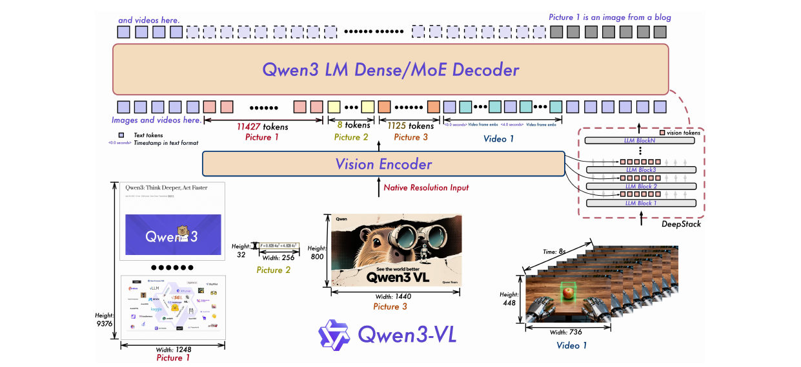
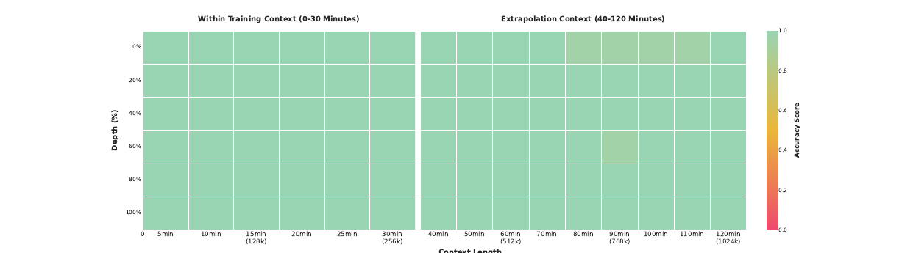
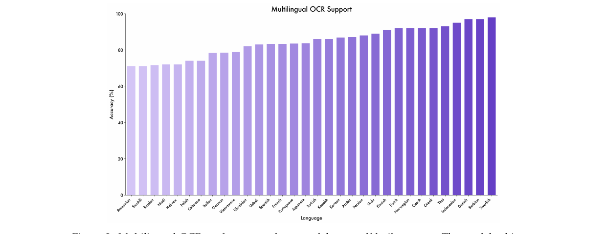

# Qwen3-VL Technical Report

## 📋 메타 정보

| 항목 | 내용 |
|---|---|
| **논문 제목** | Qwen3-VL Technical Report |
| **저자** | Qwen Team (Alibaba) — 핵심 기여자 80명+, 총 130명+ |
| **공개일** | 2025-11-26 (v1) / 2025-11-27 (v2), 42쪽 |
| **분야** | Vision-Language Model (VLM), 롱컨텍스트 멀티모달, 멀티모달 에이전트 |
| **논문 링크** | [arXiv abstract](https://arxiv.org/abs/2511.21631) · [PDF](https://arxiv.org/pdf/2511.21631) |
| **코드/모델** | [GitHub](https://github.com/QwenLM/Qwen3-VL) · [HuggingFace](https://huggingface.co/Qwen) · [ModelScope](https://modelscope.cn/organization/qwen) · **Apache 2.0 전면 공개** |
| **사용한 외부 재료** | SigLIP-2 (비전 인코더 초기화) · Qwen3 시리즈 (LLM 백본) · Qwen3-Coder (코드 코퍼스) · Qwen2.5-VL-32B/72B (데이터 라벨링·리워드 모델·심판) · Grounding DINO (그라운딩 자동 라벨) · PixMo (포인팅 데이터) · Omni3D (3D 좌표계 통일) |
| **문서 성격** | ⚠️ **가설 검증 논문이 아니라 릴리스 레시피 공개 문서**. 42쪽 중 실질 ablation은 2개뿐 |

---

## 📖 주요 용어 사전 (Glossary)

### 위치 인코딩
- **RoPE (Rotary Position Embedding)**: 토큰 위치를 회전 각도로 바꿔 어텐션에 주입하는 방식. 임베딩 차원의 **앞쪽은 빠르게 회전(고주파 = 짧은 거리 구분)**, 뒤쪽은 느리게 회전(저주파 = 먼 거리 구분)한다. 이 "차원 위치 = 담당 거리 스케일"이라는 성질이 아래 모든 논의의 출발점.
- **MRoPE (Multimodal RoPE)**: Qwen2-VL이 도입. 위치를 시간(t) / 세로(h) / 가로(w) 세 축으로 쪼개 각각 다른 차원 구간에 배정한 것.
- **Interleaved-MRoPE(끼워 넣은 MRoPE)**: 이 논문의 변경. t·h·w를 덩어리로 자르지 않고 **번갈아 배치**해 모든 축이 고주파·저주파를 고루 갖게 한 것.
- **T-RoPE (Time-aligned RoPE)**: Qwen2.5-VL이 쓰던 방식. 시간 position id를 **절대 시각에 직접 묶음**. Qwen3-VL이 폐기한 대상.
- **YaRN**: 학습한 것보다 긴 컨텍스트로 RoPE를 늘려 쓰는 외삽(extrapolation) 기법. 여기선 256K → 1M 확장에 사용.

### 아키텍처
- **머저(merger, vision-language projection)**: 비전 인코더 출력을 LLM이 알아들을 크기·형식으로 바꾸는 다리. 2층 MLP로 **2×2 시각 특징을 토큰 1개로 압축**.
- **DeepStack**: 원조(Meng et al. 2024)는 멀티스케일 이미지 타일 토큰을 쌓는 것. Qwen3-VL 버전은 **ViT의 서로 다른 3개 층에서 특징을 뽑아, LLM 첫 3개 층의 hidden state에 더하는** 방식.
- **네이티브 해상도 입력(native resolution)**: 이미지를 정해진 크기로 리사이즈하지 않고 원본 비율·크기 그대로 넣어 토큰 개수가 가변이 되는 방식.
- **Dense / MoE (Mixture-of-Experts)**: 전자는 모든 파라미터를 매 토큰마다 다 쓰는 구조, 후자는 전문가 일부만 켜는 구조. `235B-A22B` = 총 235B 중 토큰당 **22B만 활성**.

### 학습
- **제곱근 재가중(square-root reweighting)**: 손실을 샘플당(per-sample)이 아니라 **토큰 수의 제곱근으로 정규화한 토큰당(per-token)** 값으로 계산. 텍스트 전용 데이터와 멀티모달 데이터의 기여 균형이 목적.
- **Strong-to-Weak Distillation(강→약 증류)**: 큰 교사 모델 능력을 작은 학생에게 옮기는 것. off-policy(교사 출력 모사) → on-policy(학생이 만든 문장에서 logit KL 정렬) 2단계.
- **SAPO (Soft Adaptive Policy Optimization)**: Qwen 팀의 새 RL 알고리즘(arXiv 2511.20347). **GRPO도 GSPO도 아님.** 정책 갱신을 부드럽고 적응적으로 하는 policy-gradient 계열.
- **콜드스타트(cold start)**: RL을 바로 돌리면 학습이 안 되므로, 먼저 소량 고품질 데이터로 SFT해서 원하는 행동 양식을 심어주는 준비 단계.
- **Instruct / Thinking**: 같은 모델의 두 후학습 변형. 전자는 바로 답하고(non-thinking), 후자는 긴 사고 사슬(CoT)을 먼저 뱉는다.

### 평가·데이터
- **NIAH (Needle-in-a-Haystack, 건초더미 속 바늘)**: 아주 긴 입력 중간에 결정적 단서 하나를 심어놓고 그걸 찾아내는지 보는 롱컨텍스트 테스트. 여기선 긴 비디오 안에 특정 프레임을 심는 방식.
- **9-DoF 3D 박스**: 위치(3) + 크기(3) + 회전(3) = 9자유도 3차원 바운딩 박스. 단안 이미지 한 장에서 이걸 추정하는 게 3D 그라운딩.
- **정규화 좌표계 [0, 1000]**: 그라운딩 좌표를 절대 픽셀이 아니라 0~1000으로 스케일해 출력하는 규약. **Qwen2.5-VL은 절대 픽셀이었음 → 마이그레이션 breaking change.**
- **ODinW-13 / RefCOCO / CountBench**: 각각 오픈보캐뷸러리 객체 검출 / 지시 표현 이해(referring expression) / 개수 세기 벤치마크.
- **pass rate 필터링**: 질의당 여러 응답을 뽑아 정답률을 재고, **전부 틀리면 너무 어려워서 버리고 90% 초과면 너무 쉬워서 버리는** RL 데이터 난이도 조절법.

---

## 🎯 논문 요약 (TL;DR)

**한 줄**: "VLM이 자기 텍스트 백본을 안 잃어버리게 만들면서 256K 멀티모달 컨텍스트를 네이티브로 지원한다"는 목표에 맞춰 Qwen2.5-VL을 **위치인코딩 · 시각토큰 주입 · 비디오 시간표현** 세 군데에서 갈아끼운 2B~235B 시리즈 릴리스 리포트.

**핵심 문제**: (1) 기존 MRoPE의 축별 주파수 배정이 편향돼 긴 비디오가 무너진다. (2) 시각 토큰을 LLM 입력에만 넣으면 세밀한 저수준 정보가 손실된다. (3) 시간을 위치 id에 직접 묶으면 긴 비디오에서 id가 거대·희소해지고 학습 데이터 구축비가 폭증한다. (4) VL 학습을 하면 원래 LLM의 언어 능력이 깎인다.

**해결책**: (1) t·h·w를 번갈아 끼운 Interleaved-MRoPE, (2) ViT 3개 층 → LLM 3개 층에 **더하는** DeepStack(컨텍스트 길이 증가 없음), (3) 위치 인코딩 대신 **그냥 텍스트로 `<3.0 seconds>` 써주기**, (4) 제곱근 재가중 손실 + 텍스트 전용 데이터로만 하는 증류.

**검증**: 문서/OCR·그라운딩·3D·롱컨텍스트에서 GPT-5·Gemini 2.5 Pro·Claude Opus 4.1을 앞섬. 1M 토큰 NIAH 99.5%. **단, 3대 아키텍처 기여 중 2개는 이 리포트 안에 근거 실험이 없음.**

---

## 🔑 핵심 기여 (Contributions)

1. **Interleaved-MRoPE** — MRoPE의 축별 주파수 스펙트럼 편향을 번갈아 배치로 교정 (§아키텍처 1).
2. **DeepStack 통합** — ViT 중간층 특징을 LLM 하위층에 더해, 컨텍스트 길이를 안 늘리면서 세밀한 시각 정보를 보존 (§아키텍처 2). **이 리포트의 유일한 실질 ablation 대상.**
3. **텍스트 기반 시간 정렬** — T-RoPE를 폐기하고 프레임 앞에 타임스탬프를 글자로 씀 (§아키텍처 3).
4. **제곱근 재가중 손실** — 텍스트/멀티모달 목적함수 균형 (§아키텍처 +).
5. **네이티브 256K 사전학습 + 1M 외삽** — 4단계 커리큘럼(8K → 8K → 32K → 262K)으로 컨텍스트를 키움.
6. **2B~235B 전 라인업 Apache 2.0 공개** — dense 4종 + MoE 2종 × Instruct/Thinking.

---

## 🧩 라인업 — 뭘 내놨나

*왜 먼저 보나: 이 리포트의 절반은 "같은 레시피가 2B부터 235B까지 다 통한다"는 주장이라, 크기 스펙트럼이 곧 논지다.*

| 구분 | 모델 |
|---|---|
| Dense | 2B / 4B / 8B / 32B |
| MoE | 30B-A3B (활성 3B) / 235B-A22B (활성 22B) |
| 변형 | 각각 **Instruct**(non-thinking)와 **Thinking** 2종 |

- **비전 인코더**: SigLIP-2 기반을 이어서 학습한 자체 "Qwen3-ViT". 큰 모델엔 **SigLIP2-SO400M(400M)**, 2B/4B엔 **SigLIP2-Large(300M)**. 동적 해상도 대응을 위해 2D-RoPE + CoMP 방식의 절대 위치 임베딩 보간.
- **머저**: 2층 MLP, 2×2 → 토큰 1개 (Qwen2.5-VL과 동일). DeepStack용 전용 머저를 추가로 둠.
- **컨텍스트**: 네이티브 **256K**, YaRN 확장 시 **1M**.

> Figure 1. 좌하단 입력 예시가 "네이티브 해상도"의 의미를 잘 보여준다 — 9376×1248 스크린샷은 **11,427 토큰**, 32×256 띠 이미지는 **8 토큰**, 800×1440 사진은 **1,125 토큰**. 우측 붉은 점선이 DeepStack: ViT 여러 층 → LLM Block 1~3에 각각 주입된다. 비디오 프레임 사이에 `<0.0 seconds>` 같은 **텍스트 타임스탬프**가 끼어 있는 것도 확인 가능.

---

## 🏗 아키텍처 변경 3가지 (+1)

*왜 이 셋인가: 전부 "Qwen2.5-VL이 긴 비디오와 세밀한 문서에서 무너지던 지점"을 직접 겨냥한다.*

### 1️⃣ Interleaved-MRoPE — 주파수 스펙트럼 불균형 수정

기존 MRoPE는 임베딩 차원을 시간(t) / 세로(h) / 가로(w) 덩어리로 **잘라서** 배정했다. 문제는 RoPE에서 앞쪽 차원은 고주파(짧은 거리), 뒤쪽은 저주파(먼 거리)를 담당한다는 점이다. 덩어리로 자르면 t는 앞쪽 고주파만, w는 뒤쪽 저주파만 받는 식으로 **축마다 담당 주파수 대역이 편향**된다. 긴 비디오에서 시간축이 먼 거리를 표현할 저주파를 못 받으면 그대로 성능이 깎인다.

해결은 단순하다. t, h, w를 덩어리가 아니라 **번갈아(interleaved) 배치**해서 모든 축이 고주파와 저주파를 고루 갖게 한다.

> ⚠️ 세 개 중 첫 번째로 내세운 기여인데, **이 리포트 안에 ablation이 없다.** 근거는 인용문헌(Huang et al. 2025, "Revisiting multimodal positional encoding in VLMs")으로 넘긴다.

### 2️⃣ DeepStack — ViT 중간층 특징을 LLM 하위층에 직접 더하기

원조 DeepStack(Meng et al. 2024)은 멀티스케일 이미지 타일 토큰을 쌓는 방식인데, Qwen3-VL은 이걸 **ViT의 서로 다른 3개 층에서 특징을 뽑는** 방식으로 바꿨다. 각 층 특징을 전용 머저로 시각 토큰화한 뒤 **LLM의 첫 3개 층 hidden state에 그냥 더한다.**

핵심 장점은 컨텍스트 길이가 안 늘어난다는 것이다 (토큰을 append하는 게 아니라 add). 저수준 질감부터 고수준 의미까지 다층 정보가 살아남는다.

**Ablation (Table 12 — 이 논문의 유일한 실질 검증)** — 내부 15B-A2B LLM, 200B 토큰 사전학습, post-training 없이 측정:

| | AVG | DocVQA | InfoVQA | ChartQA | AI2D | MMStar | TextVQA |
|---|---|---|---|---|---|---|---|
| Baseline | 74.7 | 89.5 | 71.9 | 81.5 | 81.8 | 55.5 | 80.6 |
| **+DeepStack** | **76.0** | **91.1** | **74.2** | **83.3** | **83.2** | **57.7** | 80.5 |

이득이 **문서/차트/OCR에 몰려** 있다. 세밀한 픽셀 정보가 필요한 작업에 정확히 듣는다는 뜻이고, 메커니즘 설명과 일치한다. 다만 TextVQA는 제자리(80.6 → 80.5).

### 3️⃣ 비디오 시간표현: T-RoPE 폐기 → 텍스트 타임스탬프

Qwen2.5-VL은 위치 id를 절대 시각에 묶었다(T-RoPE). 저자들이 지적한 두 문제:

1. 긴 비디오면 **시간 position id가 거대하고 희소**해져 장기 문맥이 망가짐
2. 다양한 fps로 균일 샘플링한 학습 데이터를 대량 만들어야 해서 **데이터 구축 비용**이 큼

해법은 어이없이 단순하다. 프레임 패치 앞에 그냥 **글자로** `<3.0 seconds>` 를 붙인다. 초 단위와 HMS(시:분:초) 두 형식을 모두 학습시켜 타임코드 표현에 강건해지게 했다. 컨텍스트가 약간 늘지만 시간 그라운딩·dense captioning이 명확히 좋아진다고 주장한다.

> 💡 **이 논문에서 가장 실용적인 교훈.** 위치인코딩을 정교하게 설계하는 것보다 그냥 텍스트로 써주는 게 이겼다. LLM이 이미 숫자를 읽을 줄 아는데 굳이 기하학적 인코딩을 만들 이유가 없었던 것. 역시 ablation은 없다.

### ➕ 손실 함수: per-sample → 제곱근 정규화 per-token

텍스트 전용 데이터와 멀티모달 데이터의 기여도 균형을 맞추기 위해 샘플당 손실이 아니라 **토큰 수의 제곱근으로 정규화한 토큰당 손실**을 쓴다. 초록에서 "square-root reweighting"으로 강조하는데, **본문 설명은 문장 두 줄이 전부다.** 수식도 ablation도 없다.

---

## 🏋️ 학습 파이프라인

### 사전학습 4단계 (Table 1)

*왜 4단계인가: 정렬 → 능력 → 길이 → 극한 길이 순으로, 싼 것부터 비싼 것 순으로 쌓는다.*

| Stage | 목적 | 학습 대상 | 토큰 | 시퀀스 길이 |
|---|---|---|---|---|
| **S0** | Vision-Language 정렬 | **머저만** (ViT·LLM 동결) | 67B | 8,192 |
| **S1** | 멀티모달 사전학습 | 전체 (ViT+머저+LLM) | ~1T | 8,192 |
| **S2** | 롱컨텍스트 | 전체 | ~1T | 32,768 |
| **S3** | 울트라 롱컨텍스트 적응 | 전체 | 100B | **262,144** |

총 **약 2.17T 토큰**. Qwen3 LLM 본체가 36T 토큰인 걸 생각하면, VL 학습은 백본 대비 **6% 규모의 얹기**다. S0에서 ViT와 LLM을 모두 얼리고 머저만 학습하는 건 nanoVLM/PaliGemma 계열의 정석 그대로.

- S0 데이터: 고품질 이미지-캡션 + 시각 지식 + OCR
- S1: VL 데이터 + 텍스트 전용 데이터 혼합(언어 능력 보존 목적), 인터리브 문서·그라운딩·VQA·STEM + 소량 비디오
- S2: 텍스트 전용 비중을 올리고, VL 쪽은 **비디오와 에이전트 지시 따르기**를 대폭 증량
- S3: 장편 비디오 + 장문서에 집중

**인프라**: Alibaba Cloud PAI-Lingjun. Megatron-LM 기반 **TP + PP + CP + EP + ZeRO-1 DP** 하이브리드 병렬, **최대 1만 GPU**. (GPU-시간·FLOPs는 미공개) 배포는 vLLM / SGLang.

### 사전학습 데이터 하이라이트

- **캡션**: 중·영 다국어 웹 이미지-텍스트를, **리캡션 전용으로 미세조정한 Qwen2.5-VL-32B**로 다단계 재작성. 중복 제거는 **원본이 아니라 리캡션 텍스트**에 대해 의미 유사도로 수행(시각 다양성을 죽이지 않으려고). 희소 개념은 시각 임베딩 클러스터링으로 찾아 표적 증강.
- **인터리브 문서**: Qwen 기반 도메인 스코어러로 광고·홍보·클릭베이트 제거. 책 규모 데이터는 Qwen2.5-VL-7B로 파싱해 연속 페이지를 **최대 256K 토큰까지 병합**, 순수 텍스트 구간 제거 + 최소 이미지-텍스트 비율 강제.
- **OCR**: 자체 수집 **3천만 장**(사람 주석 0, OCR 특화 모델 pseudo-label → Qwen2.5-VL 정제) + 다국어 합성 **3천만**. 지원 언어 **10개 → 39개**.
- **문서 파싱**: Common Crawl PDF 300만(10종 문서타입 × 30만) + 내부 400만. 자체 레이아웃 모델이 읽기 순서·박스 예측 → Qwen2.5-VL-72B가 영역별 인식. 포맷 2종: **QwenVL-HTML**(요소별 bbox) / **QwenVL-Markdown**(이미지·표만 위치 표시, 표는 LaTeX).
- **그라운딩**: box + **point** 양쪽 지원. COCO/Objects365/OpenImages/RefCOCO + Grounding DINO·Qwen2.5-VL 3단계 자동 합성. PixMo 포인팅 데이터 활용. **좌표계를 [0, 1000] 정규화로 변경** — Qwen2.5-VL은 절대 픽셀 좌표였다. 해상도·종횡비 변화에 강해지고 후처리가 단순해지는 대신, **기존 파이프라인은 반드시 손봐야 한다.**
- **공간·3D**: "노트북 왼쪽의 컵" 같은 **상대 관계** 표현을 절대 좌표 대신 강제. affordance("잡을 수 있는/누를 수 있는/앉을 수 있는")와 행동 조건부 질의("모니터 뒤 책을 잡으려면 뭘 먼저 치워야 하나?"). 3D는 단안 이미지 → **9-DoF 박스**, Omni3D 좌표계로 통일.
- **코드**: Qwen3-Coder 텍스트 코퍼스 재사용 + **멀티모달 코딩**(UI 스크린샷 → HTML/CSS, 이미지 → SVG, 플로차트·수식 → 코드, StackOverflow 이미지 질문).
- **비디오**: 짧은→긴 캡션 합성으로 타임스탬프 인터리브 스토리 서술 생성 + 객체·행동·인물 수준 시공간 그라운딩. 소스 균형(강의/영화/1인칭) + **길이 적응 샘플링**(fps·최대 프레임 수를 시퀀스 예산에 맞춰 동적 조절).
- **STEM**: 프로그래밍 방식 도형 렌더링으로 만든 **600만 다이어그램 캡션**(교점·모서리·무게중심 포인트 그라운딩 100만 + 지각 VQA 200만), K-12/학부 문제 **6천만+**, 롱 CoT 멀티모달 **1,200만**(룰 + 모델 검증, 코드스위칭·모호답 제거, 어려운 문제만 rejection sampling으로 남김).
- **에이전트**: 데스크톱/모바일/웹 GUI 크로스 플랫폼. 멀티스텝 궤적은 **self-evolving 궤적 생산 프레임워크** + 표적 사람 검수. 함수 호출은 **실제 함수를 구현하지 않고** 이미지 → 질의·함수 정의 → 호출 → 응답을 합성하는 파이프라인으로 대량 생성. 검색 도구 궤적도 포함.

### 후학습 3단계

1. **SFT** — 약 **120만 샘플** (1/3 텍스트 전용, 2/3 이미지·비디오). **32K로 1 epoch → 256K로 1 epoch** 2단계. 후자에선 32K 데이터를 섞어 짜서 롱컨텍스트 커리큘럼 구성(수백 쪽 기술문서, 교재 전체, 최대 2시간 비디오). 품질 필터는 **Query Filtering**(검증 불가·모호·빈약한 질의 제거) + **Response Filtering**(룰 기반 + Qwen2.5-VL 리워드 모델의 다차원 평가) 2단계.
   - Thinking용 **Long-CoT 콜드스타트**는 VL:텍스트 ≈ 1:1. 필터 3종: **난이도 큐레이션**(베이스라인 pass rate 낮은 것만), **멀티모달 필요성 필터**(Qwen3-30B-*nothink*가 **이미지 없이도** 맞히는 문제는 버림 — 진짜 시각이 필요한 문제만 남김), 응답 품질 관리.
2. **Strong-to-Weak Distillation** — off-policy(교사 출력 모사) 후 on-policy(학생 생성 시퀀스에서 logit KL 정렬). 결정적으로 **텍스트 전용 데이터로만** LLM 백본을 증류하는데, 이게 멀티모달 추론까지 같이 올려준다.
3. **RL** — Reasoning RL + General RL.
   - *Reasoning RL*: 235B-A22B 예비 체크포인트로 질의당 16개 응답 샘플링. **전부 틀리면 버리고**, 예비 RL 실험으로 개선 여지 없는 데이터 소스도 제거 → 최종 **3만 질의**. 학습 시에도 **pass rate 90% 초과는 제외**. 태스크별 포맷 프롬프트를 써서 포맷 리워드에 의존하지 않고, **응답 언어가 질문 언어와 다르면 패널티**.
   - *General RL*: 지시 따르기 + 선호 정렬 2축. 특히 SFT에서 각인된 **잘못된 강한 사전지식을 벗겨내는(unlearn) 용도** — 반직관적 개수 세기, 복잡한 시계 읽기처럼 검증 가능한 태스크를 일부러 넣음. 언어 혼용·반복·포맷 오류를 유발하는 프롬프트만 모은 전용 데이터셋으로 고빈도 패널티.
   - 리워드는 **룰 기반 + 모델 기반**(Qwen2.5-VL-72B-Instruct / Qwen3 심판) 하이브리드.
   - 알고리즘은 GRPO/GSPO가 아니라 **SAPO** (Gao et al. 2511.20347) — Qwen 팀 자체 신규 알고리즘.

### Thinking with Images — 도구 쓰는 시각 에이전트

*왜 따로 있나: "이미지를 확대해서 다시 보는" 능력은 일반 SFT로는 안 생기고, 전용 부트스트랩이 필요하다.*

부트스트랩 구조가 영리하다:

1. 콜드스타트 **1만 개**(주로 속성 판별 같은 단순 2턴 시각 QA)로 **Qwen2.5-VL-32B**를 `생각 → 행동 → 피드백 분석 → 답변` 에이전트로 SFT + 멀티턴 도구 통합 RL
2. 그 에이전트로 **12만 개 멀티턴 궤적을 증류 생성** (훨씬 넓은 태스크 범위)
3. 그 데이터(증류 + 합성)로 Qwen3-VL을 같은 콜드스타트 SFT + 도구 통합 RL

리워드 3개:
- **정답 정확도** (Qwen3-32B 심판)
- **멀티턴 추론 품질** (Qwen2.5-VL-72B 심판) — 도구·환경 피드백을 제대로 해석하며 단계적으로 갔는가
- **도구 호출 횟수 리워드** — 실제 호출 수를 Qwen2.5-VL-72B가 태스크 복잡도로 오프라인 추정한 목표치와 비교

> 세 번째가 흥미롭다. 초기 실험에서 모델이 앞 두 리워드를 해킹하려고 **태스크와 무관하게 도구를 딱 1번만 부르는 쪽으로 붕괴**했다고 명시한다. **리워드 해킹 실패담을 솔직히 적어둔 드문 사례.**

---

## 📊 실험 요약

### ✅ 진짜로 강한 것

| 영역 | 수치 | 비교 |
|---|---|---|
| **OCRBench** | 875 (thinking) / **920** (instruct) | GPT-5 810/787, Claude Opus 4.1 764/750, Gemini 2.5 Pro 866/872 |
| **DocVQA / InfoVQA** | 96.5 / **97.1**, 89.5 / 89.2 | Gemini 92.6/94.0, GPT-5 91.5/89.6 |
| **CC-OCR** | 81.5 / **82.2** | Gemini 77.2, GPT-5 68.3 |
| **MMLongBench-Doc** | **57.0 / 56.2** (SOTA) | Gemini 55.6, GPT-5 51.5, Claude 54.5 |
| **RefCOCO-avg** | **92.1** | Gemini 74.6, GPT-5·Claude 측정 불가 |
| **CountBench / ODinW-13** | **93.7** / 48.6 mAP | Gemini 91.0, GPT-5 91.7 / 검출은 비교군 부재 |
| **SUN RGB-D (3D)** | 34.9 / 39.4 | Gemini 29.7 대비 **+5.2 mAP** |
| **MuirBench (멀티이미지)** | **80.1** | Gemini 77.2, GPT-5 77.5, Claude 60.4 |
| **다국어 OCR** | 39개 언어 중 **32개가 70%+** | Qwen2.5-VL은 10개 언어 |

**롱컨텍스트 NIAH** — 1 FPS 균일 샘플, 프레임 해상도를 조절해 시각 토큰 예산 일정 유지:

- 30분 비디오(128K)까지 **100%**
- YaRN으로 1M 토큰(≈2시간)까지 외삽해도 **99.5%**
- → **롱컨텍스트 주장은 실제로 뒷받침된다.** 이 논문에서 가장 견고한 증거.

**다국어 OCR 분포:**

> 스웨덴어·세르비아어·덴마크어가 97~98%로 최상위, 루마니아어·스와힐리어·러시아어·힌디어·히브리어가 71% 부근 하위. **라틴 문자 유럽어에 유리하고 키릴·데바나가리·히브리 문자가 약하다**는 뚜렷한 문자 체계 편향이 보인다.

**도구 사용 효과 (5.6절)**: V\*에서 도구를 붙이면 **일관되게 약 +5점**. 저자들이 "모델 크기를 키우는 것보다 도구 통합이 더 남는 장사"라고 명시하는데, 표를 보면 실제로 그렇다 — **2B가 도구 쓰면 75.9, 8B가 도구 없이 77.5**. 크기를 4배 키운 것과 도구 하나 붙인 것이 맞먹는다.

### ⚠️ 조심해야 할 것

*왜 이 절이 필요한가: 표의 굵은 글씨만 보면 놓치는 조건들이 있고, 그중 일부는 저자들이 본문에 정직하게 적어놨다.*

**① 비디오 평가는 프레임 수가 불공정하다.**
본인들이 5.9절에 적어놨다 — Qwen3-VL은 **2,048프레임**(비디오 토큰 224K 이내), Gemini 2.5 Pro **512**, GPT-5 **256**, **Claude Opus 4.1은 100프레임**. LVBench(63.6/67.7 vs Gemini 73.0)·MLVU 같은 장편 비디오 결과는 이 **최대 20배 격차**를 감안해서 봐야 한다. 명시한 건 정직하지만, 그럼에도 표에는 그냥 굵은 글씨로 들어가 있다.

**② "텍스트 백본을 능가한다"는 주장은 Instruct에만 해당한다.**
Thinking 모델을 자기 텍스트 백본(Qwen3-235B-A22B-Thinking-2507)과 붙이면 (Table 6):

| | Qwen3-VL Thinking | Qwen3 Thinking-2507 | 차이 |
|---|---|---|---|
| GPQA | 77.1 | **81.1** | −4.0 |
| AIME-25 | 89.7 | **92.3** | −2.6 |
| HMMT-25 | 77.4 | **83.9** | **−6.5** |
| LiveCodeBench v6 | 70.1 | **74.1** | −4.0 |
| OJBench | 27.5 | **32.5** | −5.0 |
| MMLU-Pro | 83.8 | **84.4** | −0.6 |

즉 **시각 능력을 얻는 대가로 하드 추론에서 명확한 세금**을 낸다. 초록의 "surpassing comparable text-only backbones in several cases"는 거짓은 아니지만(Instruct는 AIME 74.7 vs 70.3, LiveCodeBench 54.3 vs 51.8로 이김) 상당히 관대한 프레이밍이다. Instruct조차 지식 계열은 밀린다 — MMLU-Pro 81.8 vs 83.0, GPQA 74.3 vs 77.5, SuperGPQA 60.4 vs 62.6, PolyMATH 45.1 vs 50.2.
→ **패턴: 추론·코딩은 VL 학습이 도움이 되고(멀티모달 CoT 데이터 덕), 순수 지식·다국어는 손해다.**

**③ 소형 모델 비교 상대가 낡았다.**
Qwen3-VL-32B를 **Qwen3-32B(2507 아님)**와 비교한다 — AIME 66.2 vs 20.2 같은 압승이 나오는데, 이건 구세대 베이스라인 덕이다. 반면 30B-A3B는 2507을 같이 넣어줬고, 거기선 MMLU-Pro 77.8 vs 78.4로 **진다**. **비교 상대 선택이 일관되지 않다.**

**④ ZeroBench는 전 모델이 붕괴.**
4 / 2 / 3 / 2 / 1 ... 실질적으로 아무도 못 푼다. 겸손해질 필요가 있는 지표.

**⑤ Instruct가 Thinking을 이기는 경우가 흔하다.**
OCRBench 920 > 875, DocVQA 97.1 > 96.5, InfoVQA 89.2(instruct 밑줄), 32B RealWorldQA 79.0 > 78.4. **지각·인식 작업에서 긴 사고는 오히려 방해다.** 실전 배포 시 작업별로 갈라 써야 한다는 신호.

**⑥ GPT-5/Claude 수치 상당수가 자체 측정이 아니다.** 표에서 `*` 표시는 상대 테크니컬 리포트에서 그대로 가져온 값이고, 빈칸(`-`)도 많다.

### 🔬 비전 인코더 Ablation (Table 11) — 일방적이지 않다

CLIP 사전학습 단계 zero-shot + 동일 1.7B Qwen3 LM에 1.5T 토큰으로 붙였을 때의 VLM 성능:

| | ImageNet-1K | ImageNet-S | ImageNet-R | Omni(CLIP) | OCRB | AI2D | RLWDQA | Omni(VLM) |
|---|---|---|---|---|---|---|---|---|
| SigLIP-2 | 84.2 | **76.2** | **96.1** | 36.9 | 77.2 | 74.1 | 58.7 | 50.1 |
| **Qwen3-ViT** | **84.6** | 74.5 | 95.7 | **45.5** | **78.7** | **76.2** | **66.1** | **53.0** |

**분류 순수 성능은 살짝 떨어뜨리고(ImageNet-S −1.7, -R −0.4) 세계지식·OCR·실세계 QA를 크게 얻는** 트레이드오프다. Omni +8.6, RealWorldQA +7.4는 크다. 정직한 표라서 오히려 신뢰가 간다.

---

## 🚨 이 리포트의 가장 큰 약점

*왜 별도 절인가: 성능표만 보면 안 보이지만, 재현하거나 아이디어를 빌리려는 사람에게는 가장 중요한 정보다.*

**42쪽에서 ablation이 딱 2개다** — 비전 인코더(Table 11)와 DeepStack(Table 12). 그것도 DeepStack ablation은 **공개 모델이 아닌 내부 15B-A2B에 200B 토큰**으로 돌린 것이라, 235B 규모에서 여전히 유효한지는 검증되지 않았다.

세 가지 핵심 기여 중 **Interleaved-MRoPE와 텍스트 타임스탬프는 근거 실험이 0개**다. 초록에서 강조한 제곱근 재가중도 마찬가지. "우리가 이렇게 바꿨고 최종 성능이 좋다"는 것뿐이라, **어느 변경이 얼마나 기여했는지 재현하려는 사람은 알 방법이 없다.**

그 외 빠진 것:
- **학습 FLOPs·GPU-시간 없음** (1만 GPU라는 규모만 언급)
- **추론 지연·처리량 수치 없음** — 초록은 "latency–quality trade-offs"를 위해 dense/MoE를 다 냈다고 하는데, 정작 latency 숫자가 한 개도 없다
- RL 학습 커브·SAPO vs GRPO 비교 없음
- 데이터 혼합 비율(VL:텍스트)의 구체 숫자 없음

**다만** 전 라인업이 Apache 2.0으로 공개돼 있어 커뮤니티가 직접 ablation을 돌릴 수 있다는 게 이 리포트의 진짜 가치다.

---

## 🔗 다른 논문들과의 연결

- **[PAPER_Qwen-Image-2.0.md](PAPER_Qwen-Image-2.0.md) / [PAPER_DreamLite.md](PAPER_DreamLite.md) / [PAPER_i1.md](PAPER_i1.md)**: 이들이 텍스트 인코더나 리캡셔너로 쓰는 게 바로 이 Qwen3-VL 계열이다. DreamLite는 **Qwen3-VL-2B**를 얹었고, i1은 Qwen3-VL로 12종 공개 데이터를 재캡션했다. **이 리포트의 39개 언어 OCR과 [0,1000] 정규화 좌표계는 그 다운스트림 생성 모델의 조건 품질에 직결된다.**
- **[PAPER_PaliGemma.md](PAPER_PaliGemma.md) / [PAPER_nanoVLM.md](PAPER_nanoVLM.md) / [PAPER_SmolVLM.md](PAPER_SmolVLM.md)**: 같은 "눈(ViT) + 다리(머저) + 입(LLM)" 3모듈 골격인데, Qwen3-VL의 DeepStack은 **다리를 한 층이 아니라 세 층으로** 놓은 셈이다. SmolVLM이 "인코더는 작게, 압축은 세게"를 소형에서 발견했다면, Qwen3-VL은 2B/4B에만 작은 SigLIP2-Large를 쓰는 것으로 같은 결론을 실무에 반영했다.
- **[PAPER_PaliGemma-2.md](PAPER_PaliGemma-2.md)**: "글자 읽기 = 해상도, 생각하기 = LM 크기"라는 분해 분석과, Qwen3-VL이 네이티브 해상도 + DeepStack으로 OCR을 밀어붙인 선택이 정확히 같은 진단을 공유한다.
- **[PAPER_Florence-2.md](PAPER_Florence-2.md)**: 좌표를 텍스트 토큰으로 표현하는 계보. Qwen3-VL의 [0,1000] 정규화는 Florence-2의 1000-bin 위치 토큰과 사실상 같은 발상이다.
- **[PAPER_Gemma-3.md](PAPER_Gemma-3.md) / [PAPER_Gemma-4.md](PAPER_Gemma-4.md)**: 롱컨텍스트를 **어텐션 구조(local:global, KV 절감)**로 푸는 쪽 vs Qwen3-VL처럼 **커리큘럼(8K→32K→262K) + YaRN 외삽**으로 푸는 쪽의 대비.
- **사전학습 백본 재사용 풍경**: 전형적인 분기 A(동결 → 해동 후 전체 미세조정). S0에서만 얼고 S1부터 ViT까지 전부 푸는 건 PaliGemma의 "인코더 unfreeze가 이롭다" 결론과 같은 노선.

---

## 📌 한 줄 요약 (전체)

**Qwen3-VL은 새 아이디어를 증명하는 논문이 아니라, "위치인코딩은 번갈아 끼우고, 시각 특징은 LLM 하위 3층에 더하고, 비디오 시간은 그냥 글자로 써라"는 세 줄짜리 처방과 2.17T 토큰 4단계 커리큘럼을 Apache 2.0 전 라인업과 함께 공개한 레시피 문서다 — 문서/OCR·그라운딩·1M 롱컨텍스트는 진짜로 최상위지만, 3대 기여 중 2개는 이 42쪽 안에 근거 실험이 없고 비디오 벤치마크는 프레임 수 20배 이점 위에 세워져 있다.**

**받아들일 것**: 텍스트 타임스탬프가 T-RoPE를 이겼다는 것(단순한 게 이긴 사례) · DeepStack이 문서/OCR에 확실히 듣는다는 것 · 도구 통합이 모델 스케일링보다 가성비가 좋다는 것(2B+도구 ≈ 8B) · 1M NIAH 99.5%.

**걸러 볼 것**: 비디오 벤치마크(프레임 20배 이점) · Thinking 모델의 텍스트 능력 주장(실제론 백본 대비 하락) · 소형 모델 비교 베이스라인 선택.

---

## 🧠 관련 메모리

- `paper_qwen3_vl` (본 문서 포인터)
- `paper_qwen_image_2` — Qwen3-VL을 동결 텍스트 인코더로 사용
- `paper_dreamlite` — Qwen3-VL-2B 탑재
- `paper_i1` — Qwen3-VL 재캡션 파이프라인
- `reference_pretrained_backbone_reuse_landscape` — 백본 재사용 분기 분류
