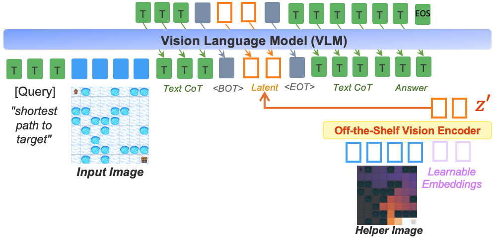
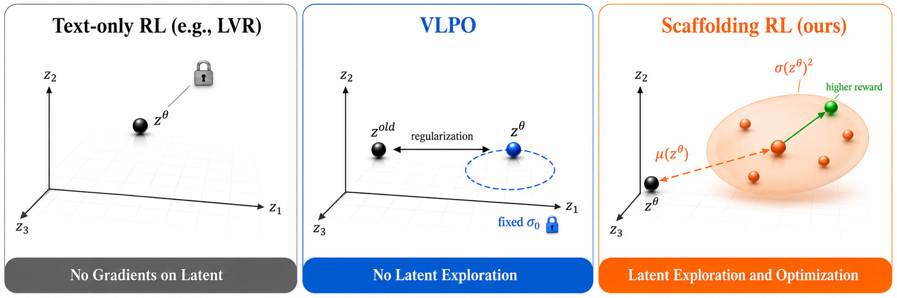
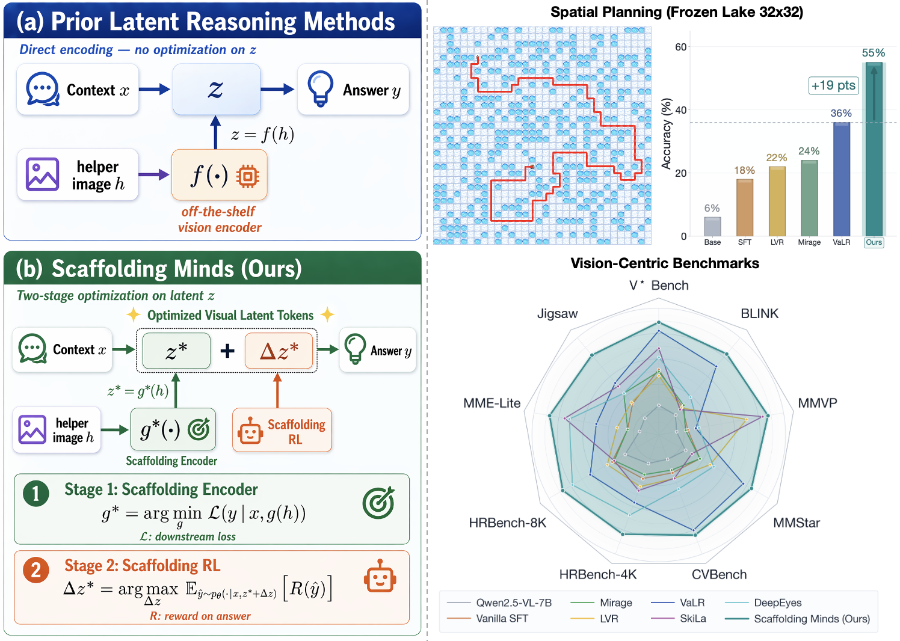
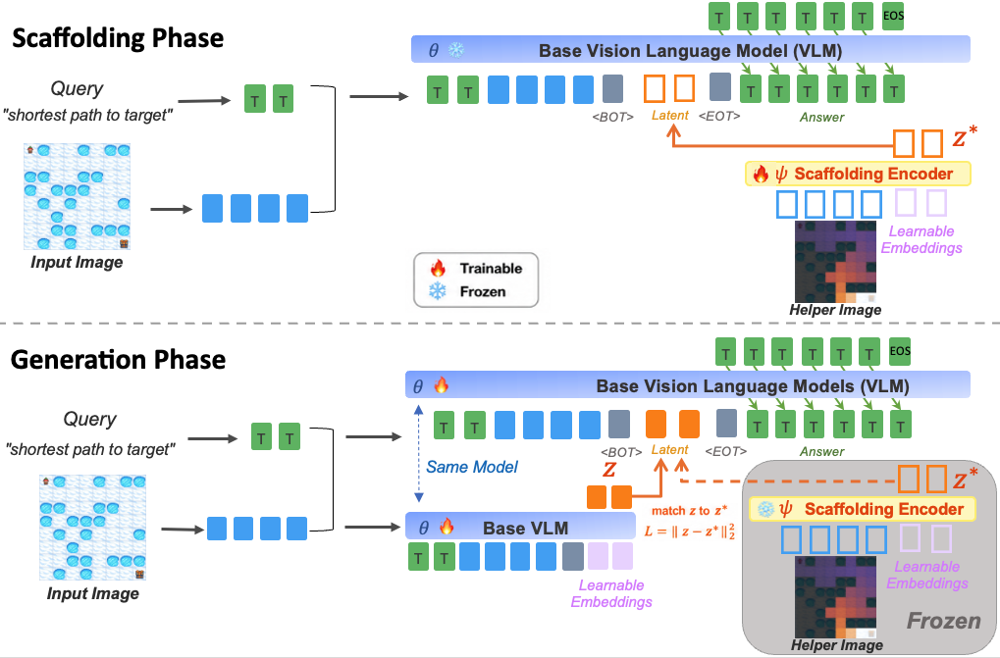
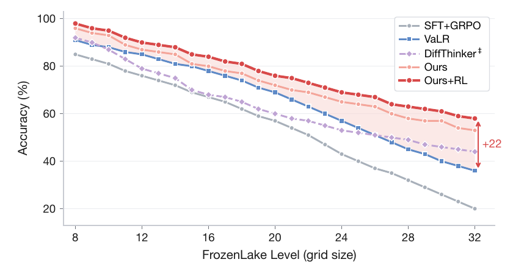
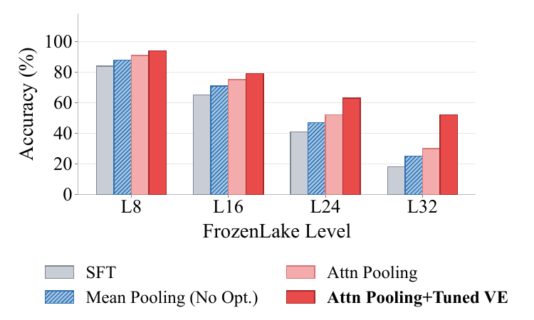
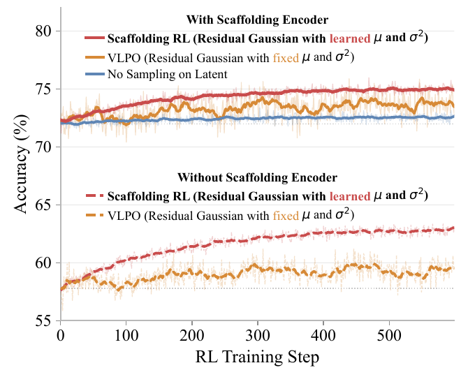

# Scaffolding Minds: Optimizing Latent Visual Target Representations for Multimodal Reasoning

---

## 1️⃣ 메타 정보

| 항목 | 내용 |
|---|---|
| **논문 제목** | Scaffolding Minds: Optimizing Latent Visual Target Representations for Multimodal Reasoning |
| **저자** | Haoqiang Kang, Yinpeng Chen, Luyang Liu, Jesper Sparre Andersen, Abhijit Ogale, Baochen Sun, Lichan Hong, Ed H. Chi |
| **소속** | **Google DeepMind** (+ UC San Diego, 1저자 인턴십) |
| **공개일** | 2026-08-20 (arXiv v1), 22쪽 |
| **분야** | Multimodal reasoning(멀티모달 추론), Latent visual reasoning(잠재 시각 추론), VLM RL |
| **arXiv abstract** | https://arxiv.org/abs/2608.19669 |
| **arXiv PDF** | https://arxiv.org/pdf/2608.19669 |
| **arXiv HTML** | https://arxiv.org/html/2608.19669v1 |
| **코드 / 가중치** | **없음** (논문 안에 링크 0건) |
| **백본** | **Qwen2.5-VL-7B** (Gemma 아님). 부록에서 3B 전체 미세조정, 7B LoRA도 실험 |
| **데이터** | FrozenLake (VSP 벤치마크), Zebra-CoT + 시각 벤치마크 9종 학습 split (§8 ① 참조) |
| **연산량 (자기 보고)** | 8×A100 80GB, Stage 1 약 7시간 + Stage 2 약 3시간 = 약 10시간/설정 |

---

## 2️⃣ 주요 용어 사전 (Glossary)

### 핵심 개념

| 용어 | 쉬운 설명 |
|---|---|
| **latent visual reasoning(잠재 시각 추론)** | VLM이 생각하는 도중에 글자 대신 **연속 벡터 토큰 몇 개**(여기서는 K=4)를 끼워 넣어 "그림으로 생각"하게 하는 방식 |
| **helper image(도움 이미지)** | **학습할 때만** 모델에게 보여주는 "풀이 중간 단계 그림". 예: 미로의 최적 경로 그림, 관심 영역 crop. 추론할 때는 없음 → 상세는 Q3 |
| **privileged information(특권 정보)** | 학습 때만 접근할 수 있는 추가 정보. helper image가 여기에 해당. 이론 틀은 LUPI(Learning Using Privileged Information, Vapnik 2009) |
| **latent target(잠재 목표)** | 모델이 만든 latent 토큰이 따라가야 할 정답 벡터. 기존 방법은 helper image를 **얼린 범용 인코더**에 넣어 만들고, 이 논문은 **전용 인코더를 학습**해서 만듦 |
| **latent token(잠재 토큰)** | 글자 사전에 없는 연속 벡터 토큰. `⟨BOT⟩`(Begin Of Thought)와 `⟨EOT⟩`(End Of Thought) 사이에 들어감 |
| **off-the-shelf vision encoder(기성 시각 인코더)** | SigLIP처럼 자연 이미지로 미리 학습된 범용 인코더를 **얼린 채 그대로** 쓰는 것 |
| **think-with-images(이미지로 생각하기)** | 추론 중에 **실제로** crop·zoom 도구를 부르거나 중간 이미지를 생성하는 계열 (DeepEyes, Thyme, DiffThinker 등). 정확하지만 느림 |

### 구조

| 용어 | 쉬운 설명 |
|---|---|
| **scaffolding encoder(비계 인코더)** | 공사가 끝나면 치우는 임시 발판(비계)처럼 **학습 때만 쓰고 추론 때는 버리는** 인코더. VLM 시각 인코더의 학습 가능한 복사본 + cross-attention pooling |
| **cross-attention pooling(교차 어텐션 풀링)** | 학습 가능한 질의(query) K개가 이미지 토큰 수백 개를 훑어보고 **K개로 요약**하는 모듈. BLIP-2의 Q-Former와 같은 발상 |
| **learnable embeddings(학습 가능한 임베딩)** | 이 논문에 **두 종류**가 있어 헷갈리기 쉬움. ① 인코더 쪽: pooling의 질의 토큰 ② VLM 쪽: helper 없이 latent를 뽑아내기 위해 입력에 붙이는 빈 슬롯 4개 |
| **teacher forcing(교사 강제)** | 학습할 때 모델이 만든 값 대신 **정답 값을 입력에 넣어주는** 방식. 추론 때와 조건이 달라지는 문제가 생김 → Q6 |

### 학습·RL

| 용어 | 쉬운 설명 |
|---|---|
| **SFT (Supervised Fine-Tuning, 지도 미세조정)** | 정답을 보여주며 따라 하게 하는 학습 |
| **GRPO (Group Relative Policy Optimization)** | 문제 하나에 답을 G개 뽑아 **그룹 안에서 상대 비교**로 좋고 나쁨을 정하는 RL. 가치 네트워크(critic)가 필요 없음 (DeepSeekMath) |
| **group-relative advantage(그룹 상대 이점)** | Aᵢ = (rᵢ − 그룹 평균) / 그룹 표준편차. 남들보다 잘한 답은 +, 못한 답은 − |
| **importance ratio(중요도 비율)** | 같은 행동을 새 정책과 옛 정책이 낼 확률의 비 ρ = p_new / p_old. 1에서 멀어지면 정책이 많이 바뀌었다는 뜻 |
| **clipping(잘라내기)** | ρ를 [1−ε, 1+ε] 범위로 잘라 한 번에 너무 크게 바뀌는 걸 막는 PPO/GRPO 장치. 여기서 ε=0.2 |
| **KL penalty(KL 벌점)** | 기준 모델(여기서는 Stage 1 모델)에서 너무 멀어지지 않게 거는 벌점. β_KL=0.001 |
| **VLPO (Visual-Latent Policy Optimization)** | 선행연구 Monet의 RL. latent를 "분산이 고정된 가우시안"으로 취급하지만 **실제로 샘플을 뽑지는 않음** → 거리 벌점(regularization)에 가까움 |
| **residual latent action(잔차 잠재 행동)** | 모델이 만든 latent z_θ에 **더하는 작은 보정값 Δz**. RL이 이걸 뽑아 탐색함 |
| **Gaussian policy(가우시안 정책)** | 행동을 평균 μ와 분산 σ²인 정규분포에서 뽑는 정책. 이 논문은 μ와 σ를 **입력에 따라 바뀌도록 학습** |
| **exploration(탐색)** | 지금 최선이라 믿는 행동 말고 다른 행동도 시도해 보는 것. 연속 latent 공간에서는 노이즈를 섞어야 가능 |
| **RLHF / RLVR** | RLHF = 사람 선호로 학습한 보상 모델을 쓰는 RL. RLVR(RL with Verifiable Rewards) = 정답·규칙으로 채점하는 RL. **이 논문은 RLVR** → Q1 |

### 벤치마크·데이터

| 용어 | 쉬운 설명 |
|---|---|
| **FrozenLake (VSP)** | 얼음판 격자에서 구멍을 피해 목표까지 가는 경로를 Up/Down/Left/Right로 출력하는 공간 계획 과제. 레벨 8~32 = 8×8~32×32 격자 |
| **value function heatmap(가치함수 히트맵)** | 칸마다 "여기서 목표까지 얼마나 유리한가"를 밝기로 칠한 그림. FrozenLake의 기본 helper image → Q3 |
| **V★ / HRBench-4K·8K** | 고해상도 이미지에서 **작은 대상**의 속성·위치를 찾는 벤치마크 |
| **BLINK / MMVP / CV-Bench / MMStar** | 핵심 지각, VLM의 시각적 약점, 2D/3D 이해, 시각 필수 문항을 재는 벤치마크 |
| **MME-RealWorld-Lite / Jigsaw** | 실세계 고해상도 장면 / 조각 퍼즐 공간 추론 |
| **Zebra-CoT** | 추론 과정 중간에 **이미지가 끼어 있는** CoT 데이터셋. 샘플마다 helper image가 딸려 있음 |

---

## 3️⃣ 논문 요약 (TL;DR)

**한 줄**: helper image를 "얼린 범용 인코더 feature"가 아니라 **정답 맞히기에 최적화된 4개 토큰**으로 압축하는 전용 인코더를 학습하고, RL에서는 latent에 **학습된 평균·분산의 가우시안 잔차를 실제로 샘플링**해 탐색하게 만든 latent visual reasoning 방법.

**핵심 문제**: 기존 latent 추론의 2단계 학습(SFT → RL)은 단계마다 약점이 하나씩 있다.
- SFT: latent target이 **추론용이 아닌 범용 인코더**에서 나온다.
- RL: latent를 **탐색하지 않는다** (텍스트만 업데이트하거나 거리 벌점만 준다).

**해결책**:
1. **Scaffolding Encoder**: helper image → 태스크 CE로 학습한 인코더 → 최적화된 목표 z\*
2. **Scaffolding RL**: Δz ~ N(μ(z_θ), σ(z_θ)²)를 뽑아 z_θ + Δz로 롤아웃하고, 뽑힌 행동의 확률비로 GRPO

**검증**: FrozenLake 최강 latent baseline(VaLR) 대비 **+9.5%p**(32×32에서 +19%p), 시각 벤치마크 9종 평균 **+5.2%p**, 추론 지연 +4.6%.

**⚠️ 읽을 때 주의**: 벤치마크 split으로 학습했을 가능성, 산술적으로 나올 수 없는 표준편차, "목표의 질이 핵심"을 스스로 약화시키는 ablation이 있어 **헤드라인 숫자를 그대로 믿기 어렵다** → §8.

---

## 4️⃣ 핵심 기여 (Contributions)

1. **두 약점 진단**: 기존 latent visual reasoning의 SFT 단계(얼린 인코더 target)와 RL 단계(latent 탐색 부재)에서 각각 한계를 짚음.
2. **Scaffolding Encoder**: helper image를 downstream task loss(하위 태스크 손실)로 end-to-end 학습한 인코더로 압축해 **최적화된 latent target**을 만듦. 학습 후 인코더와 helper image는 버림.
3. **Scaffolding RL**: 두 개의 가벼운 MLP 헤드가 **입력에 따라 바뀌는 평균과 분산**을 예측하고, 롤아웃 때 실제로 잔차 latent를 샘플링해 보상으로 최적화.
4. **상보성 입증**: 두 요소를 합쳤을 때 가장 좋고, Stage 1이 약하면 Stage 2만으로는 회복되지 않음을 Fig 2로 제시.

---

## 5️⃣ 문제 제기 — 왜 이 논문이 나왔나

*기존 latent 추론의 표준 파이프라인을 먼저 봐야 이 논문이 어느 두 곳을 고쳤는지 보인다.*



**Fig 3 — 기존 latent 추론**: 입력(질의 + 이미지) → Text CoT → `⟨BOT⟩` **Latent** `⟨EOT⟩` → Text CoT → Answer. latent 자리의 목표 z′는 helper image를 얼린 기성 인코더에 넣어 만든다. (이 그림은 z′가 **입력에 끼워지는 것처럼** 그려져 있어 오해하기 쉽다 → Q6)

### 5.1 기존 흐름 (LVR, Mirage, CoVT, Monet, VaLR 등)

- **SFT**: helper image h → 얼린 인코더 f → 목표 f(h). VLM은 문제(x)만 보고 f(h)를 흉내 내는 latent z를 만들도록 학습.
- **RL**: GRPO로 텍스트만 업데이트하거나, VLPO처럼 latent가 이전 값에서 멀어지지 않게 **정규화만** 함.

### 5.2 저자들이 짚은 두 약점

**① f는 추론용이 아니다.**
자연 이미지로 학습된 범용 인코더라서 추론에 필요 없는 지각 정보는 남기고, 필요한 중간 증거는 강조하지 못한다. 흉내 낼 목표 자체가 어긋나 있다는 뜻.

**② RL이 latent를 탐색하지 않는다.**
텍스트만 쓰는 GRPO(식 1)는 이산 텍스트 토큰에만 확률을 정의하므로 latent는 아예 건드리지 못한다. VLPO(식 2)의 latent 항은 이렇다.

```
r_{i,t}(θ) = exp( −(1 / 2σ₀²) · Σⱼ (z^old_{i,t,j} − z^θ_{i,t,j})² )      σ₀ 고정
```

(즉 "옛 latent에서 얼마나 떨어졌나"에 벌점을 주는 것일 뿐.) 다른 latent를 뽑아서 시도해 보는 과정이 없으니, 보상이 **새로운 latent 경로를 발견할 방법이 없다.**



**Fig 5 — RL 세 패러다임**: 왼쪽 Text-only RL은 latent에 gradient가 없음(자물쇠) / 가운데 VLPO는 z^old와 z^θ 사이 거리 정규화만 하고 σ₀ 고정(탐색 없음) / 오른쪽 Scaffolding RL은 z^θ에서 μ(z^θ)만큼 옮긴 가우시안(분산 σ(z^θ)²)에서 여러 점을 뽑아 **보상이 높은 쪽(초록)**으로 이동.

---

## 6️⃣ 방법 — Scaffolding Minds

*두 약점을 단계별로 하나씩 고치는 구조라, Stage 1(목표 개선)과 Stage 2(탐색 추가)를 따로 보면 이해가 쉽다.*



**Fig 1 — 전체 개요**: (a) 기존 z = f(h), 최적화 없음 → (b) Stage 1에서 g\* = argmin_g L(y | x, g(h))로 인코더를 학습해 z\* = g\*(h)를 만들고, Stage 2에서 Δz\* = argmax_Δz E[R(ŷ)]로 보상 기반 보정을 더한다. 오른쪽은 FrozenLake 32×32 막대(Base 6 / SFT 18 / LVR 22 / Mirage 24 / VaLR 36 / **Ours 55**)와 9종 벤치마크 레이더 차트.



**Fig 4 — SFT 단계의 두 phase**: 위 Scaffolding Phase(VLM 🧊 동결, 인코더 ψ 🔥 학습) / 아래 Generation Phase(VLM θ 🔥 학습, 인코더 🧊 동결, z와 z\*의 L2 매칭).

### 6.1 Stage 1-a: Scaffolding Phase (목표 만들기)

*얼린 범용 인코더 대신 "정답에 필요한 정보만" 담는 목표를 얻기 위해, 인코더 자체를 태스크 손실로 학습한다.*

**비유**: 과외 선생님이 **정답 해설지(helper image)**를 보고 "학생이 이것만 알면 푸는 4줄 요약 노트"를 만드는 단계.

- 인코더 g_ψ = VLM 시각 인코더를 **학습 가능하게 복사**한 것 + cross-attention pooling. 이미지 토큰 수백 개를 **K=4개**로 압축.
- z\* = g_ψ(h) ∈ ℝ^(K×d)를 VLM의 latent 자리에 **직접 끼워 넣음** (입력 x 뒤)
- **VLM은 얼리고** ψ만 답변 토큰 CE로 end-to-end 학습:

```
L_scaffolding(ψ) = CE( y | x, z* )                                         (식 3)
```

(즉 "얼린 VLM이 이 4토큰을 받고 정답을 맞히도록" 인코더만 조정.) 결과적으로 z\*는 **얼린 VLM이 정답을 맞히는 데 딱 필요한 정보**로 채워진다.

### 6.2 Stage 1-b: Generation Phase (학생이 노트를 스스로 쓰게 하기)

*추론 때는 helper image가 없으므로, VLM이 문제만 보고 z\*와 비슷한 latent를 스스로 만들 수 있게 가르쳐야 한다.*

- 이제 인코더를 얼리고 **VLM(θ)을 학습**. VLM은 helper image 없이 x만 보고 z를 만들어야 함.
- latent는 자기회귀(autoregressive)가 아니라 **K개의 learnable embedding을 한 번의 forward로 통과**시켜 만듦 (추론 가속 목적)
- 답변은 x와 z를 조건으로 자기회귀 생성
- 손실:

```
L_generation(θ) = λ_latent · (1/K) · Σₖ ‖zₖ − z*ₖ‖²  +  λ_task · CE( y | x, z )     (식 4)
                   └─ 모범 노트와 비슷하게 ─┘          └─ 자기 노트(z)로 답 맞히기 ─┘
기본값: λ_latent = 1.0, λ_task = 0.5
```

- 두 번째 항이 **z\*가 아니라 자기가 만든 z**를 조건으로 한다는 점이 핵심 (학습–추론 조건 일치) → Q6
- 이 단계가 끝나면 **인코더와 helper image는 버림.** 추론에는 VLM만 사용.

### 6.3 Stage 2: Scaffolding RL

*연속 latent 공간에서 보상이 새 경로를 발견하려면 "다른 latent를 실제로 뽑아 보는" 확률적 정책이 필요하다.*

**① 샘플링 정책** (식 5)

```
z_θ = f_θ(x, c_pre)                    ← Stage 1이 만든 기본 행동 (c_pre: latent 앞의 선택적 텍스트 추론)
Δz  ~ N( μ(z_θ), σ(z_θ)² )             ← 두 MLP 헤드(2층)가 VLM hidden state 위에서 예측
입력 = z_θ + Δz                         ← 원래 z_θ 자리를 대체
초기화: μ 헤드 = 0 (처음엔 z_θ 중심), σ = 0.05에서 시작
```

(저자 주장: μ, σ가 z_θ에 따라 바뀌므로 "prior가 불확실하면 넓게 탐색, 이미 좋으면 안전하게 활용". 이를 확인하는 σ 분석은 없음.)

**② 롤아웃과 확률비** (부록 식 6~7)

```
δ^old_{i,k} ~ N( μ^old_k, (σ^old_k)² ),    a^old_{i,k} = z^old_k + δ^old_{i,k}      (k = 1..K)
y_i ~ π_θold( · | x, a^old_i )

p_ϑ(a^old_i | x) = Πₖ Πⱼ  (1 / √(2π)·σ^ϑ_{k,j}) · exp( −½ · ((a^old_{i,k,j} − z^ϑ_{k,j} − μ^ϑ_{k,j}) / σ^ϑ_{k,j})² ),   ϑ ∈ {θ, θ_old}

ρ^lat_i(θ)    = p_θ(a^old_i | x) / p_θold(a^old_i | x)        ← K×d 차원 블록 전체의 확률비 1개
ρ^text_{i,t}(θ) = π_θ(y_{i,t} | y_{i,<t}, x, a^old_i) / π_θold(…)
```

(즉 **같은 뽑힌 latent**를 새 정책과 옛 정책 가우시안으로 각각 평가한 비율.)

**③ 목적함수** (부록 식 8)

```
L_RL = −(1/G) Σᵢ [ min( ρ^lat_i·Aᵢ,  clip(ρ^lat_i, 1−ε, 1+ε)·Aᵢ )
                   + (1/Tᵢ) Σₜ min( ρ^text_{i,t}·Aᵢ,  clip(ρ^text_{i,t}, 1−ε, 1+ε)·Aᵢ ) ]
       + (β_KL/G) Σᵢ (1/Tᵢ) Σₜ KL( π_θ(·|s_{i,t}) ‖ π_ref(·|s_{i,t}) )

G = 8,  ε = 0.2,  lr = 1e-6,  β_KL = 0.001,  π_ref = Stage 1 모델
f_θ와 두 헤드 모두 학습, z_θ에 stop-gradient 없음
```

**VLPO와의 차이 한 줄**: VLPO는 샘플링 없이 거리 벌점만 주고, Scaffolding RL은 **실제로 뽑아서 뽑힌 행동의 확률비를 최적화**한다. (이 확률비의 수치 안정성 문제 → §8 ⑤)

### 6.4 구현 설정 전체 (부록 C)

*재현하려는 사람이 한 곳에서 찾을 수 있게 흩어진 설정값을 모았다.*

| 항목 | FrozenLake | 시각 벤치마크 9종 |
|---|---|---|
| 백본 | Qwen2.5-VL-7B | 동일 |
| K (latent 토큰 수) | 4 | 4 |
| Scaffolding encoder | VLM 시각 인코더 복사본 + cross-attention pooling | 동일 |
| Stage 1 옵티마이저 | AdamW, latent 생성 lr 2e-5 / 인코더 lr 5e-5, wd 0.01, batch 32, cosine + 5% warmup, BF16 | 동일 (추가 튜닝 없음) |
| Stage 1 epoch | 3 | 2 |
| λ_latent / λ_task | 1.0 / 0.5 | 동일 |
| Stage 2 | GRPO, G=8, ε=0.2, lr 1e-6, β_KL=0.001, μ 헤드 0 초기화, σ=0.05 | 동일 |
| helper image | value iteration(γ=0.85)으로 계산한 가치함수 heatmap | Zebra-CoT에 딸린 helper image |
| 학습 데이터 | 짝수 레벨 8~32, 레벨당 50→650개(50씩 증가), **총 4,550개** | 벤치마크별 공식 train split, 없으면 **공개 문항 70% 학습 / 30% 평가** |
| 평가 | 레벨당 100문제, exact-match(목표 도달 + 구멍 회피) | 각 벤치마크 객관식 정확도 |
| 연산량 | 8×A100, 약 7h + 3h | "FrozenLake와 동일, 약 10h" |

### 6.5 추론 시 흐름

*"helper image 없이 어떻게 latent를 만드나"는 가장 헷갈리는 지점이라 따로 짚는다.*

추론 때는 helper image도 인코더도 없고, VLM이 learnable embedding 4개로 z를 스스로 만든 뒤 그걸 보고 답한다. 단계별로 latent 자리에 무엇이 들어가는지와 Fig 3/4 해석은 **Q6**에 정리. 추론 시 Δz를 샘플링하는지 평균만 쓰는지는 **논문에 적혀 있지 않다.**

---

## 7️⃣ 실험 요약

### 7.1 FrozenLake 공간 계획 (Table 1)

*격자가 커질수록 여러 단계의 공간 계획이 필요해져, 중간 시각 표현의 질이 가장 직접 드러나는 메인 실험.*

13개 레벨로 학습, 대표 4개 레벨 × 100문제로 평가. baseline은 **전부 저자가 같은 설정으로 재학습**.

| 방법 | L8 | L16 | L24 | L32 | 평균 |
|---|---|---|---|---|---|
| SFT | 84 | 65 | 41 | 18 | 52.0 |
| SFT+GRPO | 85 | 67 | 43 | 20 | 53.8 |
| VPRL (이미지 생성) | 88 | 62 | 48 | 35 | 58.3 |
| DiffThinker (이미지 생성) | 92 | 68 | 53 | **44** | 64.3 |
| LVR | 86 | 69 | 45 | 22 | 55.5 |
| Mirage | 87 | 71 | 47 | 24 | 57.3 |
| CoVT | 88 | 73 | 50 | 27 | 59.5 |
| Monet | 89 | 75 | 53 | 31 | 62.0 |
| VaLR (최강 latent) | 91 | 78 | 57 | 36 | 65.5 |
| **Scaffolding Encoder** | 94±0.5 | 79±0.6 | 63±0.6 | 52±0.7 | 72.0±0.4 |
| **+ RL** | **96±0.4** | **82±0.5** | **67±0.6** | **55±0.7** | **75.0±0.3** |

- 본문의 +23.0(vs SFT), **+9.5(vs VaLR)**, +19(L32 vs VaLR), +10.7(vs 이미지 생성)은 **다시 계산해도 전부 맞다.**
- 다만 +19%p는 "latent baseline 중 최강" 기준. L32의 실제 최강은 DiffThinker(44)라 그 대비 **+11%p**.
- ± 값은 산술적으로 불가능한 조합 → §8 ②



**Fig 6 — 레벨별 곡선**: 격자가 커질수록 격차가 벌어진다는 주장. 단 그림 속 격차 표기는 **"+22"**로 본문 +19와 다르다 → §8 ⑥

### 7.2 시각 중심 추론 벤치마크 9종 (Table 2)

*FrozenLake 같은 합성 계획 과제를 넘어 실제 이미지의 세밀한 증거 찾기에도 통하는지 확인하는 일반화 실험.*

(†: 원 체크포인트/코드로 재현, ‡: 저자 재구현, 표시 없음: 원 논문 수치 인용)

| 방법 | V★ | BLINK | MMVP | MMStar | CVB | HRB-4K | HRB-8K | MME | Jig | 평균 |
|---|---|---|---|---|---|---|---|---|---|---|
| GPT-4o | 66.0 | 60.0 | 70.7 | 61.6 | 80.1 | 59.0 | 55.5 | 52.0 | 53.0 | 62.0 |
| Claude 3.7 Sonnet | 72.0 | 56.6 | 64.0 | 65.1 | 80.0 | 68.0 | 64.0 | 49.0 | 52.0 | 63.4 |
| Qwen2.5-VL-7B | 76.2 | 55.7 | 56.0 | 63.9 | 74.5 | 68.6 | 64.9 | 39.7 | 50.4 | 61.1 |
| Vanilla SFT | 81.3 | 57.2 | 58.5 | 66.0 | 77.0 | 70.5 | 66.8 | 42.0 | 52.5 | 63.5 |
| DeepEyes | 83.2† | 59.3† | 61.3† | 67.7† | 80.4† | 75.1 | 72.6 | 53.2 | 54.5† | 67.5 |
| Thyme | 81.9 | 56.1 | 62.4† | 65.9 | 79.8† | 77.0 | 72.0 | 55.2 | 54.8† | 67.2 |
| Mirage | 80.7‡ | 57.4‡ | 57.6‡ | 65.7‡ | 76.3‡ | 69.8‡ | 66.4‡ | 42.3‡ | 53.6‡ | 63.3 |
| CoVT | 78.0 | 56.0 | 58.7 | 68.9† | 80.0 | 72.9 | 69.4 | 51.4† | 52.7† | 65.3 |
| Monet | 83.2 | 57.7† | 60.3† | 68.3† | 79.7† | 71.0 | 68.0 | 55.5 | 54.6† | 66.5 |
| LVR | 81.7 | 56.7† | 71.7 | 67.2† | 78.3† | 71.4† | 67.6† | 44.3† | 52.4† | 65.7 |
| VaLR | 86.8 | 64.7 | 60.3 | 72.3 | 87.6 | 73.2‡ | 69.7‡ | 48.3‡ | 55.7‡ | 68.7 |
| SkiLa | 84.3 | 56.7 | 75.3 | 64.8 | 81.6† | 72.0 | 66.5 | 54.1 | 53.9† | 67.7 |
| **Scaffolding Encoder** | 87.4 | 64.8 | 73.3 | 72.1 | 86.4 | 73.6 | 71.1 | 53.4 | 56.0 | 70.9 |
| **+ RL** | **90.6** | **67.2** | **76.7** | **73.5** | **88.4** | **77.5** | **74.1** | **57.3** | **59.7** | **73.9** |
| Δ vs Qwen2.5-VL-7B | +14.4 | +11.5 | +20.7 | +9.6 | +13.9 | +8.9 | +9.2 | +17.6 | +9.3 | +12.8 |

- **9개 전부 1위**, MMVP는 base 대비 +20.7%p.
- vs SFT +10.4, vs 최강 latent(VaLR) **+5.2**는 계산이 맞다. vs think-with-images는 본문 +6.2지만 **실제 계산은 +6.4**.
- 이 표 전체의 비교 가능성 문제(학습 데이터 split) → §8 ①

### 7.3 핵심 기여 ablation (Fig 7, Fig 2)

*두 기여(목표 최적화, latent 탐색) 각각이 성능을 얼마나 만드는지 분리해 보는 실험.*



**Fig 7 — Stage 1 목표 ablation** (RL 없음, 7B)

| 설정 | 무엇이 다른가 | L8 | L16 | L24 | L32 | 평균 |
|---|---|---|---|---|---|---|
| SFT | latent 없음 | 84 | 65 | 41 | 18 | 52.0 |
| Mean Pooling (No Opt.) | 이전 연구 방식: 얼린 인코더 feature 평균 + L2 회귀 | ≈88 | ≈71 | ≈47 | ≈25 | ≈57.7 |
| Attn Pooling | cross-attention pooling + task loss, 인코더 동결 | ≈91 | ≈75 | ≈52 | ≈30 | ≈62.0 (+4.3) |
| **Attn Pooling + Tuned VE** | 인코더까지 task loss로 학습 | 94 | 79 | 63 | 52 | **72.0 (+10.0)** |

저자 결론: "목적함수 교체(+4.3)보다 **목표 최적화(+10.0)**가 대부분의 이득을 만든다." (막대 수치는 그림 판독값. "한 번에 한 요소만 바꿨다"는 서술의 문제 → §8 ③)



**Fig 2 — Stage 2 RL 비교** (평균 L8~L32, 600 스텝)

| Stage 1 | RL 방법 | 시작 → 끝 | 이득 |
|---|---|---|---|
| **Scaffolding Encoder** | No Sampling on Latent (텍스트만 GRPO) | 72 → ≈72.6 | +0.6, 곧 정체 |
| | VLPO (고정 μ, σ²) | 72 → ≈73.8 | +1.8, 출렁임 |
| | **Scaffolding RL (학습 μ, σ²)** | 72 → **75.0** | **+3.0, 가장 안정** |
| 얼린 인코더 (이전 연구식) | VLPO | ≈57.7 → ≈59.5 | +1.8 |
| | Scaffolding RL | ≈57.7 → ≈62.9 | **+5.2** |

- 얼린 인코더 위에서 Scaffolding RL의 이득(+5.2)이 더 크지만(개선 여지가 커서), 최종 ≈63은 **인코더 있는 쪽의 가장 약한 RL(≈72.6)보다도 낮다.**
- 저자 결론: "RL은 Stage 1이 세운 목표를 다듬을 뿐, 약한 Stage 1을 회복시키지는 못한다."

### 7.4 하이퍼파라미터 ablation (Table 3, 4, 5)

*K, helper image 종류, 손실 가중치라는 세 가지 설계 선택이 결과를 얼마나 흔드는지 확인한다.*

**Table 3 — latent 토큰 수 K** (Stage 1만)

| K | L8 | L16 | L24 | L32 | 평균 |
|---|---|---|---|---|---|
| 1 | 85 | 70 | 54 | 45 | 63.5 |
| 2 | 88 | 74 | 57 | 48 | 66.8 |
| **4** | **94** | **79** | **63** | **52** | **72.0** |
| 8 | 93 | 78 | 61 | 51 | 70.8 |
| 16 | 91 | 76 | 59 | 50 | 69.0 |

저자 해석: 너무 적으면 다단계 계획을 못 담고, 너무 많으면 generation phase가 맞춰야 할 중복이 늘어난다.

**Table 4 — helper image 종류 × 인코더** (Stage 1만)

| helper image | 인코더 | L8 | L16 | L24 | L32 | 평균 |
|---|---|---|---|---|---|---|
| 빨간 화살표 overlay (sparse, 희소) | 얼린 기성 | 85 | 67 | 52 | 40 | 61.0 |
| | Scaffolding | 92 | 76 | 58 | 46 | 68.0 (+7.0) |
| 가치함수 heatmap (dense, 조밀) | 얼린 기성 | 85 | 66 | 50 | 39 | **60.0** |
| | Scaffolding | 94 | 79 | 63 | 52 | **72.0 (+12.0)** |

얼린 인코더에서는 heatmap이 오히려 낮고, 학습 인코더에서는 순서가 뒤집힌다. 해석과 helper image 설명 → **Q3**. (얼린 인코더 행 60.0이 Fig 7·Table 1과 맞지 않는 문제 → §8 ⑥)

**Table 5 — Generation Phase 손실 가중치** (Stage 1만)

| λ_latent | λ_task | L8 | L16 | L24 | L32 | 평균 |
|---|---|---|---|---|---|---|
| 1.0 | 0.0 (흉내만) | 88 | 72 | 54 | 45 | 64.8 |
| 0.0 (CE만, **helper 미사용**) | 1.0 | 90 | 75 | 56 | 47 | **67.0** |
| **1.0** | **0.5** | **94** | **79** | **63** | **52** | **72.0** |
| 1.0 | 1.0 | 92 | 77 | 60 | 51 | 70.0 |
| 0.5 | 1.0 | 93 | 78 | 62 | 52 | 71.3 |

해석은 두 방향에서 중요하다: λ_latent=0이 모든 baseline을 넘는다는 점 → **§8 ③**, λ_task=0이 최저라는 점 → **Q6**.

### 7.5 모델 크기와 LoRA (부록 Table 6)

*이득이 7B 전체 미세조정에만 해당하는 게 아닌지 확인하는 실험.*

| 방법 | 3B 전체 FT: L8 | L16 | L24 | L32 | 평균 | 7B LoRA r=32: L8 | L16 | L24 | L32 | 평균 |
|---|---|---|---|---|---|---|---|---|---|---|
| SFT | 75 | 60 | 38 | 14 | 46.8 | 70 | 52 | 32 | 13 | 41.8 |
| SFT+GRPO | 76.5 | 62 | 40 | 16 | 48.6 | 71 | 54 | 34 | 14 | 43.3 |
| LVR | 78 | 63 | 41 | 18 | 50.0 | 73 | 56 | 36 | 16 | 45.3 |
| Mirage | 79 | 65 | 43 | 20 | 51.8 | 74 | 58 | 38 | 18 | 47.0 |
| VaLR | 83 | 71 | 51 | 28 | 58.3 | 80 | 65 | 44 | 24 | 53.3 |
| Scaffolding Encoder | 86 | 73 | 56 | 30 | 61.3 | 84 | 64 | 48 | 32 | 57.0 |
| + RL | 88 | 76 | 60 | 32 | 63.8 | 82 | 67 | 51 | 35 | 58.8 |

- 3B: vs SFT +17.0, vs VaLR +5.5 (계산 일치). LoRA: vs LoRA SFT +17.0.
- LoRA에서는 L8에서 RL이 오히려 **84 → 82로 하락**.

### 7.6 추론 지연 (부록 Table 7)

*latent 방식의 실용적 장점인 "이미지를 실제로 만들지 않아 빠르다"를 수치로 확인한다.*

| 방법 | K | 지연 (ms, A100 1장, BF16) | base 대비 |
|---|---|---|---|
| Qwen2.5-VL-7B | — | 260 | — |
| Mirage / LVR / VaLR / SkiLa | 4 | 266 / 267 / 268 / 269 | +2.3~3.5% |
| CoVT / Monet | 8 | 274 / 276 | +5.4 / +6.2% |
| **Scaffolding Encoder+RL** | 4 | **272** | **+4.6%** |
| DeepEyes / Thyme (도구 호출) | — | ≈540 / ≈680 | +108 / +162% |
| VPRL / DiffThinker / MVoT (이미지 생성) | — | ≈820 / ≈910 / ≈980 | +215~277% |

---

## 8️⃣ 급소 — 비판적으로 봐야 할 점 (심각한 순서)

*코드가 공개되지 않아 논문 숫자만으로 판단해야 하므로, 표 내부 산술과 서술 간 정합성을 직접 검산했다.*

### ① 벤치마크 테스트셋으로 학습했을 가능성 (가장 심각)

부록 C.2 원문: *"9개 벤치마크를 모두 커버하는 데이터로 학습. 공식 train split이 있으면 그걸 쓰고, **없으면(특히 MMVP) 공개 문항의 30%를 테스트로 떼고 70%로 학습**."*

- 제가 아는 한 V★, MMVP, MMStar, CV-Bench, HRBench, MME-RealWorld-Lite 같은 벤치마크는 **평가 전용**이고 공식 train split이 사실상 없다. 그러니 대부분 "70%로 학습, 30%로 평가"를 했을 가능성이 크다.
- 예를 들어 MMVP는 300문항이니 **90문항짜리 자체 subset에서 잰 점수**가 된다. 그런데 표 안의 baseline 숫자 상당수는 원 논문에서 **전체 벤치마크로 잰 값을 그대로 옮긴 것**이다(표시 없는 칸). 서로 다른 시험지를 본 셈이라 비교 자체가 성립하지 않는다.
- 가장 큰 이득(MMVP +20.7)이 정확히 이 조건에 해당하는 벤치마크에서 나왔다.
- 게다가 바로 다음 문단은 *"각 Zebra-CoT 샘플에 이미 helper image가 있어 그걸 사용"*이라고 쓴다. 벤치마크 문항에는 Zebra-CoT helper image가 없으니 **데이터 설명이 서로 모순**이다. 본문이 "자세한 구축 과정"을 안내한 Appendix A.1은 **존재하지 않는다**(Appendix A는 Limitation).

### ② 표준편차가 산술적으로 나올 수 없는 값

조건은 레벨당 테스트 100문제, 3 seed 평균이다(E.2와 Table 6에 명시).

- 한 seed의 정확도는 1%p 단위이고, 3 seed 평균이 **정수로 떨어지려면** 세 값의 편차 조합이 (0,0,0), (−1,0,1), (−1,−1,2), … 중 하나여야 한다.
- 이 조합들로 나올 수 있는 ± 값을 직접 전수 계산하면:

| 규약 | 가능한 값 (0 제외, 작은 순) |
|---|---|
| 모표준편차 | 0.82, 1.41 … |
| 표본표준편차 | 1.00, 1.73 … |
| 표준오차(표본) | 0.58, 1.00 … |
| 표준오차(모) | 0.47, 0.82 … |

- 그런데 Table 1에는 **±0.4와 ±0.7**이 있다. 네 규약 어디에서도 나올 수 없는 값이다. ±0.5와 ±0.6도 서로 다른 규약에서만 나온다.
- 추가로 Table 1과 Table 6의 per-level 평균 **24칸이 전부 정확한 정수**다. 3 seed 합이 3의 배수일 확률은 칸마다 약 1/3이라, 우연이라면 (1/3)²⁴ 수준이다.
- 결론: 표에 적힌 조건이 사실이라면 **이 ±는 실제 3-seed 실행에서 계산된 값으로 보기 어렵다.**

### ③ 핵심 주장("목표의 질이 지배적")을 스스로 약하게 만드는 Table 5

- λ_latent = 0이면 z\*와 맞추는 항이 사라진다. 즉 **helper image 정보를 전혀 쓰지 않고** "latent 토큰 4개 + 답변 CE"만 남는다. 이 설정의 점수가 **67.0**이다.
- 이 값은 Table 1의 모든 이전 latent 방법(VaLR 65.5, LVR 55.5)과 이미지 생성 방법(64.3)보다 **높다**.
- 따라서 baseline 대비 이득 대부분은 scaffolding target이 아니라 **병렬 latent 구조나 저자 재구현 baseline이 약한 것**에서 왔을 수 있다. target이 추가로 기여한 몫은 72.0 − 67.0 = **5.0%p**다.
- Fig 7에서 "한 번에 한 요소만 바꿨다"고 했지만, Mean Pooling → Attn Pooling 단계에서는 **pooling 방식과 목적함수 두 개가 동시에 바뀐다.**

### ④ FrozenLake의 helper image는 사실상 "정답 해설지"

- 기본 helper는 value iteration으로 계산한 **가치함수 heatmap**이다(부록 D.1 코드). 여기서 높은 칸을 따라가면 최적 경로가 그대로 나온다.
- scaffolding encoder는 얼린 VLM이 정답을 맞히도록 이걸 4토큰으로 압축하니, z\*가 **"정답 경로 압축 코드"**가 될 가능성이 높다. 그러면 Stage 1은 "시각적으로 생각하기"라기보다 **특권 정보 증류**(LUPI, 저자도 인용)에 가깝다.
- z\*에 무엇이 들어 있는지 확인하는 **probing, 시각화, 해석 실험이 0건**이라 "visual reasoning"이라는 이름을 뒷받침할 증거가 없다.

### ⑤ RL 확률비가 수치적으로 버티는지 의문 (계산 기반 추정)

- Qwen2.5-VL-7B의 hidden 차원은 3584라서 latent 블록은 K×d = **14,336차원**이다. ρ^lat은 이 **14,336개 가우시안 확률의 곱의 비율**이다.
- 평균이 차원마다 Δm만큼 움직이면 log 비율의 흔들림은 대략 √14336 × Δm/σ ≈ 120 × Δm/0.05다. clip 범위(log로 약 ±0.2) 안에 머물려면 **Δm ≲ 0.00008**이어야 한다.
- σ가 1%만 바뀌어도 log 비율에 14,336 × 0.01 ≈ **143**이 더해진다. 게다가 부록은 "z_θ에 stop-grad 없음"이라고 하니, 백본 업데이트가 z_θ를 조금만 흔들어도 대부분의 샘플이 clip되거나, A<0 쪽에서 비율이 폭주할 조건이다.
- 차원별 평균이나 log 비율 정규화 같은 **보고되지 않은 처리가 있어야** 돌아갈 식이다. 추론할 때 Δz를 샘플링하는지 평균만 쓰는지도 적혀 있지 않다.
- 학습된 σ가 정말 "불확실하면 넓게 탐색"하는지 보여주는 분석도 없다.

### ⑥ 문서 안의 불일치 모음

| # | 위치 | 불일치 내용 |
|---|---|---|
| 1 | 부록 C.1 ↔ E.3 | latent 생성이 C.1은 "**VLM 전체 가중치** 재사용", E.3은 "시각 인코더 + **앞 6개 layer**만 재사용". 본문은 "한 번의 forward"인데 Fig 4는 두 번 통과처럼 그려짐 |
| 2 | Fig 6 ↔ Table 1 · Fig 1 | 그림 속 L32 격차 표기가 **"+22"**, 본문·캡션·Fig 1은 **+19**. 그림에서 **baseline 곡선(SFT+GRPO, VaLR, DiffThinker)은 표와 ±1 이내로 일치**하는데, **자기 곡선만** 표보다 높음: Ours+RL ≈98/84/69/58 (표 96/82/67/55), Ours ≈96/80/65/53 (표 94/79/63/52) |
| 3 | Table 1 · Fig 7 · Table 4 | 같은 "이전 연구식 얼린 인코더 + heatmap" 설정의 숫자가 셋: LVR 55.5 / L32 22, Fig 7 Mean Pooling ≈57.7 / L32 ≈25, Table 4 × **60.0 / L32 39**. 특히 Table 4의 39는 Fig 7에서 task loss까지 쓴 Attn Pooling(≈30)보다 높음 |
| 4 | Fig 3 ↔ §2 본문 | 그림은 helper latent z′가 **입력에 끼워지는 것처럼**, 본문은 VLM이 만든 latent를 **목표에 맞춘다**고 서술 → Q6 |
| 5 | §4.2 본문 | "think-with-images 대비 +6.2%" → 실제 73.9 − 67.5 = **6.4** |
| 6 | §4.2 본문 | "가장 작은 이득은 HRBench-4K(+8.9)와 Jigsaw(+9.3)" → HRBench-8K(**+9.2**)가 Jigsaw보다 작음 |
| 7 | §4.2 · 부록 C.1 | "자세한 데이터 구축은 Appendix A.1", "레벨별 전체 결과는 Appendix E" → **둘 다 존재하지 않음** |
| 8 | 부록 C.1 · C.2 | FrozenLake(4,550개 × 3 epoch)와 벤치마크 혼합 데이터(2 epoch)가 둘 다 "8×A100, 약 10시간". 데이터 규모가 다를 텐데 같은 숫자 |
| 9 | §2 | RL 단락이 "(Figure 2)"를 참조하지만 Fig 2는 결과 곡선. 본문의 "Figure 1b/1a"는 그림에 a/b 구분이 좌우 패널로만 존재 |

### 총평

**좋은 점**
- "흉내 낼 목표를 얼린 인코더에서 받지 말고 태스크 손실로 직접 학습하자"는 발상이 깔끔하다. 로보틱스의 특권 교사 → 학생 증류를 VLM latent 추론에 옮긴 형태로, 직관적이고 구현이 단순하다.
- Table 4의 "비자연 helper image일수록 학습 인코더 이득이 크다"는 관찰은 이 아이디어가 왜 필요한지 잘 보여준다.
- 추론 비용 +4.6%라는 실용성.

**한계**
- 벤치마크 split 오염 의혹(①), 산술적으로 불가능한 ±(②), λ_latent=0만으로 baseline을 넘는 결과(③)가 겹쳐 **"+5.2%p, +9.5%p"를 방법의 순수 효과로 받아들이기 어렵다.**
- RL 부분은 식만 있고 수치 안정화 처리가 빠져 있어, 코드 없이 재현하기 어렵다.

---

## 9️⃣ 💬 Q&A

### Q1. RL 학습셋에는 인간 선호도가 들어간 학습셋이 있어야 하지 않나?

**아니다. 모든 RL에 인간 선호도 데이터가 필요한 건 아니다.**

RL에 꼭 필요한 건 **"답이 좋은지 나쁜지 점수(보상)를 매길 방법"** 하나다. 그 점수를 어디서 얻느냐에 따라 세 갈래로 나뉜다.

| 방식 | 보상 출처 | 인간 선호 데이터 필요? | 예 |
|---|---|---|---|
| **RLHF** | 사람이 "A가 B보다 낫다"고 고른 데이터로 **보상 모델**을 학습하고, 그 모델이 점수를 매김 | **필요** | ChatGPT 초기 정렬, 이미지 생성 미학 RL |
| **DPO류** | 선호쌍(좋은 답, 나쁜 답)으로 바로 학습 | **필요** | LongCat-Image의 DPO 단계 |
| **RLVR** (검증 가능한 보상) | **정답과 비교하거나 규칙으로 채점** | **불필요** | DeepSeekMath/R1의 GRPO, **이 논문** |

"인간 선호도가 들어간 학습셋"은 첫 번째(RLHF) 경우에만 해당한다.

**이 논문의 경우: 정답 채점형**

- **FrozenLake**
  - 모델이 경로(위/아래/왼쪽/오른쪽 나열)를 출력하면, 목표에 도달하고 구멍을 하나도 밟지 않았는지 **프로그램이 자동 채점**한다.
  - 성공하면 보상 1, 구멍을 지나면 0 (논문: "paths through holes → zero reward", exact-match).
  - 사람의 판단이 들어갈 자리가 없다.
- **시각 벤치마크 9종**
  - 모두 객관식이라 **정답 보기와 일치하는지**만 보면 된다.
  - 논문에는 "task reward"라고만 적혀 있고 보상 식이 따로 명시되어 있지 않아서, 정답 일치 채점이라는 건 추정이다.

**GRPO가 선호 데이터 없이 돌아가는 원리**

1. 문제 하나에 답을 **8개(G=8)** 뽑는다. 이 논문에서는 latent에 노이즈 Δz를 섞기 때문에 답이 매번 달라진다.
2. 각 답을 채점한다. 예: [1, 0, 0, 1, 1, 0, 0, 0]
3. **그룹 안에서 상대 비교**한다: Aᵢ = (rᵢ − 그룹 평균) / 그룹 표준편차
   - 맞힌 답은 A > 0이 되어 그 답(과 그때 뽑힌 latent)이 나올 확률을 올리고, 틀린 답은 A < 0이 되어 확률을 내린다.
4. 결국 "같은 문제에서 **남들보다 잘한 시도**"를 강화하는 구조라, 필요한 건 **문제 + 정답(또는 채점기)**뿐이다.

한 가지 부작용: 8개가 **전부 맞거나 전부 틀리면** 모든 A가 0이 되어 학습 신호가 사라진다. 그래서 RLVR에서는 "너무 쉽지도 어렵지도 않은 문제"를 고르는 게 중요하다.

**그럼 인간 선호가 꼭 필요한 경우는?** 정답이 없는 태스크다.
- **Qwen-Image-2.0-RL, LongCat-Image**: "이 이미지가 더 예쁜가, 지시를 더 잘 따랐나"는 프로그램으로 채점할 수 없다. 그래서 사람 선호로 학습한 **보상 모델**이 필요하다.
- **이 논문, DeepSeek-R1류 추론 모델**: 정답이 명확하니 채점기만 있으면 된다.

**참고: 이 논문의 RL 데이터**는 **따로 명시되어 있지 않다**. 문맥상 Stage 1과 같은 학습셋(FrozenLake 4,550개, 정답 포함)을 재사용한 것으로 보인다. 그래서 "RL 데이터를 새로 구축했다"는 부담도 없는 설계다.

### Q2. RL과 상관없이, 이 방법은 일반적인 VLM 이미지-텍스트 페어만 있으면 되나?

**아니다. 일반 이미지-텍스트 페어만으로는 안 된다.**

일반 VLM 데이터(이미지 + 캡션, 또는 이미지 + 질문 + 답)에 더해, **"helper image(중간 힌트 그림)"가 샘플마다 짝지어져 있어야** 한다. 이 방법의 핵심 재료이고, 저자들도 Limitation(부록 A)에서 가장 큰 제약으로 인정한다.

> *"기존 latent 추론 방법처럼 우리 방법도 학습 시 helper image가 있어야 한다. helper image가 없거나 비싼 환경으로 확장하는 방법은 열린 문제다."*

**단계별로 필요한 데이터**

| 단계 | 필요한 것 | helper image 필요? |
|---|---|---|
| Stage 1-a Scaffolding | 입력 이미지 + 질문(x), **helper image(h)**, 정답(y) | **필요** (h를 z\*로 압축하는 단계라서) |
| Stage 1-b Generation | x, y, 그리고 h로 만든 z\* | **필요** (z\*가 목표값이라서) |
| Stage 2 RL | x + **채점 가능한 정답** | 불필요 |

- **SFT 단계는 (이미지, 질문, helper image, 정답) 네 가지 한 세트**가 필요하다.
- **RL 단계는 helper image 없이 "정답이 확실한 문제"만** 있으면 된다 (Q1의 정답 채점형 보상).

**일반 캡션 페어가 안 되는 이유 두 가지**

1. **helper image가 없다.** 이 방법에서 latent 토큰 4개가 따라가야 할 목표 z\*가 바로 helper image에서 나온다. 재료가 없으면 목표를 만들 수 없다.
2. **정답 채점이 안 된다.** "강아지가 공원에서 뛴다" 같은 캡션은 맞다/틀리다를 판정하기 어려워서 RL 보상도 만들기 힘들다.

**논문은 helper image를 어디서 구했나**

- **FrozenLake: 공짜로 계산**
  - 격자 지도를 알면 value iteration으로 **가치함수 heatmap을 프로그램이 자동 생성**한다(부록 D.1 코드).
  - 시뮬레이터가 있는 합성 태스크라서 가능한 일이다.
- **시각 벤치마크: 기존 데이터셋 재사용**
  - **Zebra-CoT**(중간 이미지가 포함된 추론 데이터셋)에 들어 있던 helper image를 그대로 썼다고 한다.
  - 종류는 관심 영역 crop, 공간 관계를 강조한 그림 등.
  - 다만 §8 ①에서 말했듯, 같은 부록이 "벤치마크 문항 70%로 학습"이라고도 적어서 **실제로 어떤 데이터를 썼는지는 모순**이다.

**새 도메인에 적용하려면** helper image를 만들 수단이 있어야 한다.
- **bbox가 있는 grounding/검출 데이터**: 박스 영역을 crop해서 helper로 사용 (Visual CoT 같은 데이터셋)
- **시뮬레이터나 규칙이 있는 태스크**: 미로, 퍼즐, 차트처럼 FrozenLake 방식으로 자동 생성
- **도구 호출**: crop, zoom, 선 긋기 등으로 합성
- 순수 캡션 데이터(LAION류)에서 자동으로 뽑는 방법은 **논문도 future work로 남겼다.**

**흥미로운 반전**: Table 5를 다시 보면 **λ_latent = 0**(helper image를 전혀 안 쓰는 설정)에서도 FrozenLake 67.0으로 모든 이전 latent 방법을 넘었다. "helper image 없이 latent 토큰 4개 + 답변 CE만으로도 상당 부분 된다"는 뜻이다. helper image가 없는 환경이라면 오히려 이 축소판을 먼저 시도해 볼 만하다. 다만 이건 논문이 주장하는 방법이 아니라 ablation에서 드러난 부산물이고, 벤치마크 쪽에서는 검증되지 않았다.

### Q3. helper image란?

**학습할 때만 모델에게 보여주는 "풀이 중간 단계 그림"**이다. 시험 볼 때(추론)는 주지 않는다.

**비유**: 기하 문제집의 **해설지에 그려진 보조선 그림**.
- 문제지(입력 이미지)에는 삼각형만 있다.
- 해설지(helper image)에는 "여기에 보조선을 그으면 풀린다"는 그림이 있다.
- 공부할 때는 해설지를 보면서 "이런 선을 머릿속에 그리면 되는구나"를 익힌다.
- 시험장에서는 해설지 없이 **머릿속으로 그 보조선을 떠올려야** 한다.

이 논문을 포함한 latent 추론 계열이 하려는 게 바로 이것이다. 모델이 helper image를 **머릿속(latent 토큰 4개)으로 떠올리도록** 가르친다.

**입력 이미지와의 차이**

| | 입력 이미지 | Helper image |
|---|---|---|
| 언제 쓰나 | 학습과 추론 모두 | **학습 때만** |
| 내용 | 문제 그대로 | 정답에 이르는 **중간 증거나 힌트** |
| 역할 | 모델이 보는 것 | 모델이 **상상해야 할 목표** |

학술 용어로는 **privileged information(특권 정보)**이라고 한다.

**예시 1: 시각 벤치마크 (관심 영역 crop)**

질문: "테이블 위 컵은 무슨 색이야?" (4K 고해상도 사진이라 컵이 아주 작게 보임)
- **입력 이미지**: 방 전체 사진
- **Helper image**: **컵 부분만 잘라 확대한 사진**
- **학습 목표**: 확대 사진을 실제로 받지 않고도, 모델이 "컵을 확대해서 본 것 같은" 내부 표현을 스스로 만들게 함

DeepEyes 같은 "think with images" 방법은 **추론할 때 실제로 crop 도구를 호출**한다. 그래서 느리다(+108%). latent 방법은 그 crop을 **머릿속으로 내재화**하니 빠르다(+4.6%).

**예시 2: FrozenLake (논문이 비교한 두 종류)**

문제: 얼음판 격자에서 시작점부터 목표까지 구멍을 피해 가는 경로 쓰기

- **① 빨간 화살표 overlay (sparse, 희소)**
  - 원래 격자 위에 **최적 경로를 빨간 선으로 그린 그림**
  - 정답 경로만 딱 보여줌
- **② 가치함수 heatmap (dense, 조밀) ← 논문 기본값**
  - 칸마다 "여기 서 있으면 목표까지 얼마나 유리한가"를 **밝기로 칠한 그림**
  - 목표 칸 = 1(가장 밝음), 구멍 = 0(검정)
  - 나머지 칸은 대략 0.85^(목표까지 남은 걸음 수)라서, 목표에 가까울수록 밝아짐
  - **어느 칸에서 출발하든 더 밝은 옆 칸으로만 가면 최적 경로**가 됨

**Table 4 결과(§7.4)가 흥미로운 이유**
- **얼린 범용 인코더**: heatmap(60.0) < 화살표(61.0). 자연 사진으로 학습한 인코더라 이상한 색칠 그림을 잘 못 읽음
- **학습된 scaffolding 인코더**: heatmap(**72.0**) > 화살표(68.0). 인코더를 태스크에 맞게 학습시키니 정보가 더 풍부한 heatmap을 제대로 활용함

이 결과가 이 논문의 핵심 동기, 즉 "목표를 만드는 인코더도 학습해야 한다"를 가장 잘 보여준다.

**주의할 점**: §8 ④에서 짚었듯, FrozenLake의 heatmap은 **사실상 정답을 통째로 담은 그림**이다. "힌트"라기보다 "해설지 전체"에 가깝다. 그래서 모델이 배우는 게 "시각적으로 생각하는 법"인지, "정답을 4토큰으로 압축한 암호"인지는 논문이 검증하지 않았다.

### Q4. helper image는 구성하기 어렵지 않나?

**맞다. 이 방법의 가장 큰 진입장벽이다.** 다만 **도메인에 따라 난이도가 크게 다르다.** 쉬운 곳은 거의 공짜로 만들 수 있고, 어려운 곳은 무엇을 그려야 할지 정의하는 것부터 막힌다.

**도메인별 난이도**

| 난이도 | 도메인 | 이유 |
|---|---|---|
| **쉬움** | 미로, 퍼즐, 게임, 합성 차트 | 프로그램이 풀이 과정을 알고 있어서 **자동 생성** (FrozenLake가 여기) |
| **중간** | 검출 데이터, 문서 OCR, 차트 QA | **bbox나 레이아웃 라벨이 이미 있음**. 해당 영역을 crop만 하면 됨 |
| **어려움** | 일반 사진의 상식 추론, 다단계 관계 추론 | "중간 단계를 어떤 그림으로 표현할지"부터 모호함 |

**현실적인 구성 방법 4가지**

**① 기존 라벨을 재활용 (가장 저렴)**
- bbox → **crop**
- segmentation mask → **해당 영역만 강조한 그림**
- 문서 layout box → **표나 문단 영역 crop**

문서 파싱 쪽이라면 layout 라벨이 대부분 있어서 **비교적 쉬운 편**이다.

**② 자동 파이프라인으로 가짜 helper 만들기**
1. LLM이 질문에서 핵심 대상을 뽑음 ("테이블 위 컵" → "cup")
2. grounding 모델(Grounding DINO, SAM 등)로 위치를 찾음
3. crop해서 helper로 사용

**주의**: 검출이 틀리면 **틀린 목표를 학습**하게 된다. 이 방식이 효과가 있는지는 이 논문에서 검증되지 않았다.

**③ 공개 데이터셋 사용**
- **Zebra-CoT**: 중간 이미지가 포함된 추론 데이터 (논문이 사용, 약 18만 개)
- **Visual CoT**: 질문마다 근거 영역 bbox가 붙은 데이터 (논문이 인용, 약 40만 개 규모)

이미 만들어진 걸 쓰면 구축 부담은 없지만, **내 도메인과 맞는지**는 따로 확인해야 한다.

**④ helper image 없이 가기 (Table 5의 힌트)**
- **λ_latent = 0**, 즉 latent 토큰 4개 + 답변 CE만 쓴 설정도 FrozenLake **67.0**으로 모든 이전 방법을 넘었다.
- helper image로 얻는 추가 이득은 **+5.0%p**(→ 72.0) 정도였다.
- 그러니 **먼저 helper 없이 latent 토큰만 붙여 보고**, 효과가 확인되면 그때 helper 구축에 투자하는 순서가 합리적이다.

**정리**
- **합성 태스크나 라벨이 있는 도메인**: 해볼 만하다. 구축 비용이 낮다.
- **일반 도메인**: 구축 비용 대비 이득(FrozenLake 기준 +5%p)이 확실하지 않다. 벤치마크 쪽 수치는 §8 ①의 데이터 오염 문제 때문에 믿기 어렵다.
- 그래서 **④로 시작해서 ①이나 ③으로 확장**하는 걸 추천한다.

### Q5. VLM-OCR에 적용한다면? 가능성 있나?

**결론: 조건부로 가능성 있다.**

- **글자를 그대로 옮겨 적는 "읽기"**: 기대가 낮다.
- **표 구조, 필드 찾기, 읽기 순서 같은 "구조 파악"**: 시도해 볼 만하다.
- Q4에서 걱정한 **helper image 구성 문제는 OCR에서는 오히려 쉬운 편**이다.

([DESIGN_DocParser-Scratch.md](DESIGN_DocParser-Scratch.md) 설계를 기준으로 판단)

**1. 좋은 소식: OCR은 helper image가 거의 공짜다**

일반 사진 도메인에서 helper 구축이 어려운 이유는 "중간 단계를 그림으로 뭘 그려야 하나"가 모호해서였다. 문서는 설계 문서 §4의 **렌더링 합성**([L208](DESIGN_DocParser-Scratch.md#L208))과 **digital-born PDF**([L220](DESIGN_DocParser-Scratch.md#L220)) 덕분에 사정이 다르다. **정답이 먼저 있고 이미지는 거기서 렌더링한 결과**이므로, helper도 같은 소스에서 원하는 모양으로 얼마든지 렌더링할 수 있다.

| 과제 | helper image 예시 | 만드는 방법 |
|---|---|---|
| 표 인식 | **셀 경계선, 병합 셀을 색칠한 표** | HTML 표 정답에서 렌더링할 때 선만 추가 |
| KIE (필드 추출) | **해당 필드 영역을 강조한 페이지나 crop** | PDF 텍스트 레이어의 좌표 |
| 읽기 순서 | **영역 번호와 화살표를 그린 페이지** | 레이아웃 정답의 순서 |
| 차트 | **데이터 점과 격자선을 강조한 차트** | 차트를 그릴 때 쓴 원본 데이터 |
| 도장 (곡선 글자) | **원형 글자를 펼친 이미지** | 극좌표 변환 |
| 흐린 스캔 | **왜곡 전 깨끗한 렌더** | 합성 파이프라인에서 왜곡 전 원본 |

FrozenLake의 value heatmap처럼 **프로그램이 자동으로 생성할 수 있는 도메인**이라는 뜻이다.

**2. 나쁜 소식: 순수 텍스트 인식에는 효과가 작을 것이다**

- **① "확대해서 보기"를 설계가 이미 명시적으로 하고 있다**
  - 이 논문 계열의 대표적인 helper가 "관심 영역 crop"이다. 모델이 확대해서 본 것처럼 상상하게 만드는 것.
  - 그런데 설계 §2.1의 2패스 구조([L58](DESIGN_DocParser-Scratch.md#L58))는 **원본 해상도로 실제로 crop**한다. 상상할 필요 없이 진짜로 확대해서 본다.
- **② 읽기는 추론이 아니라 해상도 문제다**
  - PaliGemma 2의 분석대로 "글자 읽기는 해상도, 생각하기는 LLM 크기"가 좌우한다.
  - latent 추론은 **"생각하기"를 보강하는 기술**이라 병목이 맞지 않는다.
- **③ 4토큰 병목**
  - 페이지 하나에 출력 토큰이 수천 개다. latent 4개에 **글자 내용 자체**를 담는 건 무리이고, 담을 수 있는 건 **구조 요약** 정도다.
  - 게다가 디코더는 이미 모든 시각 토큰에 직접 attention하고 있다.

**3. 과제별 가능성**

| 과제 | 가능성 | 이유 |
|---|---|---|
| **KIE (전체 페이지 + 스키마)** | **높음** | 설계상 crop 없이 전체 페이지를 본다([L152](DESIGN_DocParser-Scratch.md#L152)). "큰 이미지에서 작은 증거 찾기"라서 이 논문의 V★ 시나리오와 구조가 똑같다 |
| **복잡한 표 구조** (병합 셀) | **중간~높음** | 행과 열 구조를 먼저 그려 보고 OTSL을 출력하는 방식이 "중간 시각 단계"라는 개념에 잘 맞는다 |
| **읽기 순서** (다단 배치, 복잡한 레이아웃) | 중간 | 레이아웃 패스는 축소 이미지에 3×3 merge를 쓰니 정보가 부족한 곳을 latent가 보완할 여지가 있다 |
| 차트 | 중간 | 막대나 점과 축 눈금을 맞추는 공간 대응 문제 |
| 도장, 곡선 글자 | 낮음~중간 | 펼치는 변환이 기하학적이라 latent로 흉내 내기 어려울 수 있다 |
| **일반 텍스트 인식** | **낮음** | 위 2의 이유 ①②③ |
| 흐린 스캔 복원 | 낮음 | 깨끗한 원본 내용을 4토큰에 담을 수 없다 |

**4. 설계 문서에 넣는다면**

- **위치: Stage E와 F 사이에 "E′" 단계 추가**
  - scaffolding phase에는 **helper를 읽을 줄 아는, 이미 학습된 VLM**(얼린 상태)이 필요하다. 그래서 Stage A~C 초기에는 넣을 수 없다.
  - E′-1: SigLIP2 복사본 + cross-attention pooling을 CE로 학습 (본체는 동결)
  - E′-2: 본체가 z\*를 흉내 내도록 학습 (λ_latent 1.0, λ_task 0.5)
  - F: 기존 GRPO(Valid × Struct × Sim)에 latent 샘플링 추가
- **비용**
  - 학습: 인코더 복사본 약 413M은 **학습할 때만 쓰고 버린다.**
  - 추론: 토큰 4개 추가뿐. 출력이 수천 토큰이니 사실상 0에 가깝다.
- **RL 주의점 (§8 ⑤)**
  - Qwen3-0.6B는 hidden 차원이 1024라서 K×d = **4,096차원**. Qwen2.5-VL-7B의 14,336차원보다는 낫지만, log 비율이 여전히 약 64 × Δm/σ로 흔들린다.
  - 긴 출력에서 latent가 흔들리면 **degeneration**(같은 말 반복)으로 이어질 수 있다. 설계의 Valid 곱셈 관문이 0점 처리해 주긴 하지만, 그만큼 학습 신호가 줄어든다.
  - 그래서 F 단계에서는 **latent 샘플링 없이 텍스트만 GRPO**하는 대조군을 반드시 둔다.

**5. 추천 실험 순서 (싸게 확인하기)**

- **대상**: 병합 셀이 많은 **합성 표** (렌더링으로 무한 생성 가능)
- **지표**: TEDS-structure. 내용은 빼고 구조만 평가해서 "읽기"와 분리한다.

| 단계 | 설정 | 확인할 것 |
|---|---|---|
| **A** | 기존 모델 (Stage E 체크포인트) | 기준선 |
| **B** | + latent 4토큰, **helper 없이** CE만 (Table 5의 λ_latent=0) | latent 자리 자체가 도움이 되나 |
| **C** | + 셀 경계 helper로 scaffolding | helper가 추가로 도움이 되나 |
| **D** | C + latent 샘플링 GRPO | RL이 추가로 도움이 되나 |

- **B가 A보다 복잡한 표에서 안 나으면 중단한다.** 이 논문 자체의 증거가 약하기 때문에(§8 ①②③), 가장 싼 B부터 확인하는 게 안전하다.
- 표에서 효과가 확인되면 **KIE**(helper = 필드 강조)로 넓힌다.

**한 줄**: OCR은 helper image를 공짜로 만들 수 있는 드문 도메인이라 **실험 진입장벽은 낮다.** 다만 이득은 "읽기"가 아니라 **표 구조와 KIE 같은 구조 추론**에서만 기대할 수 있고, 논문 수치가 불안정하니 **helper 없는 B 실험부터** 해 보는 걸 권한다.

### Q6. Fig 3을 보면 helper image latent를 입력 토큰에 넣는데, 추론 때는 못 넣지 않나?

**맞다. 추론할 때는 helper image를 넣을 수 없다.** 그래서 **"넣는 것"과 "목표로만 쓰는 것"을 단계별로 나눠 둔 것**이 이 계열 방법의 핵심이다. Fig 3은 이 구분을 한 장에 뭉쳐 그려서 헷갈리기 쉽다.

**Fig 3을 오해하기 쉬운 이유**

Fig 3(§5)에서는 helper image → 인코더 → z′가 **주황 화살표를 따라 VLM 입력의 Latent 자리로 들어가는 것처럼** 그려져 있다. 그런데 본문(2장 SFT stage)은 이렇게 설명한다.

> *"VLM이 **스스로 만든** latent를 이 목표에 **맞추도록** 학습한다. 그래서 추론 시 helper image가 필요 없다."*

즉 그림은 "입력에 끼운다"처럼 보이고, 글은 "목표값으로 비교한다"고 말한다. **그림이 학습 신호의 방향을 부정확하게 표현한 것**이다. Fig 4(§6)를 봐야 정확하게 보인다.

**단계마다 latent 자리에 무엇이 들어가나**

| 단계 | ⟨BOT⟩와 ⟨EOT⟩ 사이에 들어가는 것 | helper image의 역할 |
|---|---|---|
| **Scaffolding Phase** (학습, Fig 4 위) | **z\* = 인코더(helper image)** ← 실제로 입력에 넣음 | **입력** |
| **Generation Phase** (학습, Fig 4 아래) | **z = VLM이 스스로 만든 것** | **정답지**: z와 z\*의 L2 비교에만 사용 |
| **RL** (학습) | z_θ + Δz (스스로 만든 것 + 노이즈) | 사용 안 함 |
| **추론** | **z_θ (스스로 만든 것)** | **없음** |

helper image가 **입력으로 들어가는 건 Scaffolding Phase 한 번뿐**이고, 이 단계의 목적은 목표 z\*를 **만드는 것**이다. 이때 학습되는 건 인코더(ψ)뿐이고 VLM은 얼려 둔다.

**추론 때 실제로 일어나는 일 (Fig 4 아래 "Same Model")**

1. **1번째 통과**: [질문 + 입력 이미지 + ⟨BOT⟩ + **학습 가능한 임베딩 4개**(보라색)] → VLM → 그 4자리의 출력이 **z**
2. **2번째 통과**: [질문 + 입력 이미지 + ⟨BOT⟩ + **z** + ⟨EOT⟩] → 답을 자기회귀로 생성

helper image는 어디에도 등장하지 않는다. 보라색 "학습 가능한 임베딩"은 **helper 없이도 latent를 뽑아내기 위한 빈 질문 슬롯** 역할이다.

참고로 Fig 3에서 helper image 옆에 붙은 보라색 임베딩은 다른 것이다. 인코더 쪽 **cross-attention pooling의 query**(수백 토큰을 4개로 압축하는 용도)다. 같은 색이라 헷갈린다.

**비유**
- **Scaffolding Phase**: 선생님이 해설지를 보고 **모범 요약 노트(z\*)**를 만든다. 학생(VLM)은 그 노트를 책상에 올려놓고 풀 수 있는지만 확인하고, 학생 머리는 건드리지 않는다.
- **Generation Phase**: 노트를 치운다. 학생이 **문제만 보고 자기 노트(z)를 먼저 쓰고**, 그 노트를 보며 답을 쓴다. 선생님은 ① 학생 노트가 모범 노트와 얼마나 비슷한지(L2), ② 자기 노트로 답을 맞혔는지(CE) 두 가지로 채점한다.
- **시험(추론)**: 자기가 쓴 노트만 있다.

**이 구분이 중요하다는 증거: Table 5**

Generation Phase 손실은 두 항이다: λ_latent · ‖z − z\*‖² + λ_task · CE(y | x, **z**)

두 번째 항에서 **z\*가 아니라 자기가 만든 z로 답을 맞히게** 한다는 점이 핵심이다. 학습 조건과 시험 조건을 맞춰 주는 장치다.

| 설정 | 의미 | FrozenLake |
|---|---|---|
| λ_task = 0 (흉내만) | 노트 베끼기만 연습하고, 자기 노트로 푸는 연습은 안 함 | **64.8** (최저) |
| λ_latent = 0 (CE만) | 모범 노트 없이 자기 노트로 푸는 연습만 | 67.0 |
| 둘 다 (기본) | | **72.0** |

**흉내만 낸 경우가 가장 낮다.** z가 z\*와 조금만 달라도 답이 무너지기 때문에, "자기 z로 답하기"를 따로 학습해야 한다는 뜻이다. **"추론 때는 못 넣는다"는 간극**을 이 항이 메우고 있다.

**남는 모호함**
- 본문은 latent 생성이 "한 번의 forward"라고 하는데, Fig 4는 **두 번 통과**처럼 그려져 있다.
- 부록 C.1은 "VLM 전체 가중치 재사용", E.3은 "**앞 6개 layer만** 재사용"이라고 해서 서로 충돌한다.
- 그래서 1번째 통과가 전체 모델인지 앞 6층만인지는 **논문만으로는 확정할 수 없다.** 코드가 공개되지 않아 확인할 방법도 없다.

---

## 🔟 한 줄 요약 (전체)

**Scaffolding Minds = helper image를 "얼린 범용 인코더 feature"가 아니라 태스크 손실로 최적화한 4토큰 목표(z\*)로 압축하고(Stage 1), RL에서는 학습된 평균·분산의 가우시안 잔차를 latent에 실제로 샘플링해 탐색하게 만든(Stage 2) latent visual reasoning 방법.** 발상은 특권 교사 → 학생 증류를 VLM latent 추론에 옮긴 것으로 깔끔하고, 추론 비용도 +4.6%로 낮다. 그러나 벤치마크 문항 70/30 split 학습, 산술적으로 나올 수 없는 표준편차, **helper image 없이도(λ_latent=0) 모든 baseline을 넘는 ablation**, 자기 곡선만 표보다 높게 그려진 Fig 6이 겹쳐 **헤드라인 수치(+9.5%p / +5.2%p)는 방법의 순수 효과로 받아들이기 어렵고**, 코드도 없어 RL 부분의 재현성은 낮다.

---

## 1️⃣1️⃣ 관련 메모리 / 문서 링크

**백본·계보**
- [[PAPER_Qwen2.5-VL.md]] — 이 논문의 백본 (Qwen2.5-VL-7B, hidden 3584)
- [[PAPER_BLIP-2.md]] — Q-Former의 learnable query 32개 병목 = scaffolding encoder의 cross-attention pooling과 같은 발상
- [[PAPER_REPA.md]] — 얼린 DINOv2 feature를 목표로 정렬하는 대표 사례. 이 논문은 "얼린 feature 목표는 최적이 아니다"라는 반대 방향 주장
- [[PAPER_Astra-Looped-Transformers.md]] — 텍스트 쪽 latent reasoning(루프 구조) 계보

**RL 보상 설계 대비 (Q1)**
- [[PAPER_Qwen-Image-2.0-RL.md]] — 정답이 없는 이미지 생성 RL: 선호 기반 보상 모델이 필요한 사례
- [[PAPER_LongCat-Image.md]] — DPO/GRPO/MPO 3단 RLHF

**VLM-OCR 적용 검토 (Q5)**
- [DESIGN_DocParser-Scratch.md](DESIGN_DocParser-Scratch.md) — 문서 파싱 VLM scratch 설계. E′ 단계 삽입 위치, helper 렌더링 소스
- [[PAPER_PaliGemma-2.md]] — "글자 읽기 = 해상도, 생각하기 = LLM 크기" 분해
- [[PAPER_MinerU2.5.md]] — 2패스(layout → 원본 crop) 구조: helper crop을 추론 때 명시적으로 수행하는 대안
- [[PAPER_PaddleOCR-VL-1.6.md]] — Valid × Struct × Sim 보상 설계
