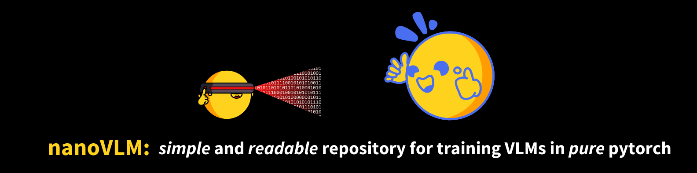
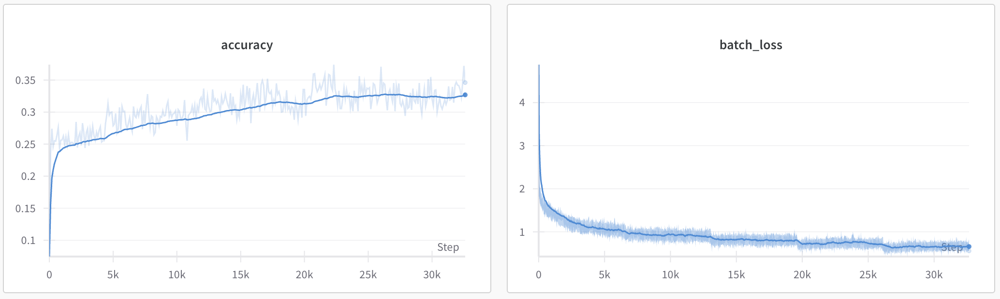
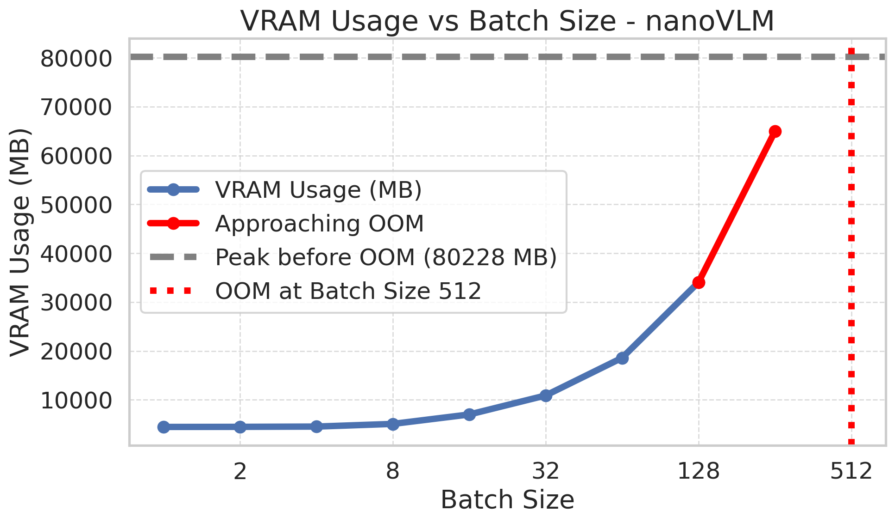

# nanoVLM — VLM(비전-언어 모델)을 순수 파이토치 750줄로 벌거벗긴 교육용 저장소



---

## 📌 메타 정보

| 항목 | 내용 |
|---|---|
| **제목** | nanoVLM: A Lightweight Vision Language Model Toolkit |
| **저자** | Luis Wiedmann, Aritra Roy Gosthipaty, Andrés Marafioti (Hugging Face) |
| **공개** | 2025년 (블로그 튜토리얼 + GitHub 저장소, 지속 업데이트 중) |
| **분야** | Vision-Language Model(비전-언어 모델, 이미지 이해), 교육용 레퍼런스 구현 |
| **블로그** | https://huggingface.co/blog/nanovlm |
| **코드** | https://github.com/huggingface/nanoVLM |
| **학습된 모델** | lusxvr/nanoVLM-222M (구버전), lusxvr/nanoVLM-450M (신버전) |
| **사용 외부 모델** | 눈=`google/siglip2-base-patch16-512` (SigLIP2), 입=`HuggingFaceTB/SmolLM2-360M-Instruct` (블로그 초판은 SigLIP-224 + SmolLM2-135M) |
| **사용 데이터** | FineVision (신버전), the_cauldron 약 1.7M 샘플 (블로그 초판) |
| **성격** | ⚠️ SOTA 모델이 **아님**. nanoGPT의 멀티모달 판 — "구조를 코드로 완전히 이해시키는 것"이 목적 |

> ⚠️ **문서-코드 버전 주의**: 블로그(222M)와 현재 저장소 기본 config(SigLIP2-512 + SmolLM2-360M)가 다르다. 저장소는 2025-06-04, 2025-09-09에 큰 변경(임베딩 결합 방식 리팩터링, 이미지 분할, 멀티노드)을 겪었다. 가장 단순하게 시작하려면 v0.1 릴리스(222M)를 쓰는 것이 헷갈리지 않는다. 이 문서는 **현재 저장소 코드**를 1차 기준으로, 블로그 초판 수치는 병기한다.

---

## 📖 주요 용어 사전 (Glossary)

*처음 보는 사람이 본문에서 헤매지 않도록, 반복 등장하는 용어를 먼저 모아둔다.*

### 아키텍처 3덩어리
- **Vision Encoder(비전 인코더, 눈)**: 이미지를 받아 시각 특징 벡터로 바꾸는 부분. 여기선 SigLIP2라는 ViT(Vision Transformer)를 씀.
- **Language Model(언어 모델, 입, LM)**: 텍스트를 생성하는 부분. 여기선 SmolLM2라는 Llama 계열 소형 LLM을 씀.
- **Modality Projector(모달리티 프로젝터, 다리, MP)**: 눈이 뽑은 시각 특징을 입이 알아듣는 형식으로 바꿔주는 다리. **거의 유일하게 새로 학습되는 부품.**

### 핵심 개념
- **backbone(백본)**: 이미 대규모로 학습돼 있는 밑바탕 모델. 여기선 SigLIP2와 SmolLM2가 백본. 처음부터 학습하지 않고 가져다 씀.
- **pixel shuffle(픽셀 셔플)**: 인접한 여러 패치를 하나로 접어서 **토큰 개수를 줄이는** 기법. 공간(spatial) 정보를 채널(channel) 방향으로 옮겨 담아 정보 손실 없이 시퀀스 길이만 줄임.
- **image token / placeholder(이미지 토큰 / 자리표시자)**: 텍스트 문장 안에 미리 심어두는 `<|image|>` 특수 토큰. 나중에 실제 이미지 임베딩으로 통째로 덮어씀.
- **modality(모달리티)**: 데이터의 종류(이미지냐 텍스트냐). VLM은 두 modality를 한 시퀀스로 섞는 게 핵심 과제.
- **RoPE(회전 위치 임베딩, Rotary Position Embedding)**: 토큰 위치를 각도 회전으로 알려주는 방식. 학습 파라미터가 없음.
- **GQA(그룹 쿼리 어텐션, Grouped Query Attention)**: Query 헤드는 많이, Key/Value 헤드는 적게 둬서 메모리(KV 캐시)를 아끼는 어텐션.
- **KV cache(키-값 캐시)**: 문장을 한 토큰씩 생성할 때, 이미 계산한 Key/Value를 저장해두고 재사용하는 것. 생성 속도를 크게 높임.
- **image splitting(이미지 분할)**: 큰 이미지를 타일로 쪼개 각각 처리해 고해상도 디테일을 살리는 기법 (SmolVLM 방식).

### 학습/평가 용어
- **frozen / finetune(동결 / 미세조정)**: 가중치를 안 건드리면 frozen(동결), 작은 학습률로 살짝 건드리면 finetune(미세조정).
- **cross-entropy loss(교차 엔트로피 손실)**: 다음 토큰을 얼마나 잘 맞혔는지 재는 표준 언어모델 손실.
- **MMStar**: VLM의 종합 시각 이해 능력을 재는 벤치마크. 초판 nanoVLM-222M은 여기서 35.3% 기록.
- **lmms-eval**: 여러 VLM 벤치마크(mmstar, ocrbench, docvqa 등)를 한 번에 돌려주는 평가 툴킷.

---

## 🎯 논문 요약 (TL;DR)

**한 줄**: 이미 잘하는 눈(SigLIP2)과 입(SmolLM2)을 가져다가, 그 둘을 잇는 다리(Modality Projector) 한 장만 새로 학습해서, 이미지를 텍스트 토큰인 척 언어 모델에 밀어넣는 VLM을 순수 파이토치 750줄로 구현한 교육용 저장소.

**핵심 문제**: VLM 내부가 어떻게 돌아가는지 이해하려면, `transformers.Trainer`·`accelerate`·`deepspeed` 같은 마법 상자에 가려 잘 안 보인다. 또 큰 하드웨어가 있어야 실험할 수 있다는 진입 장벽이 있다.

**해결책**:
1. 세 덩어리(눈/다리/입)를 표준 코드로 직접 재구현하고, 사전학습 가중치만 손으로 이식.
2. pixel shuffle로 이미지 토큰을 16배 줄여(1024개→64개) 계산 부담을 낮춤.
3. 자리표시자 토큰 치환이라는 가장 단순한 방식으로 이미지·텍스트를 한 시퀀스에 섞음.
4. 무료 Colab에서도 돌아갈 만큼 가볍게(배치 1이면 VRAM 4.5GB).

**검증**: SigLIP-224 + SmolLM2-135M 조합(222M)을 H100 1장으로 약 6시간, the_cauldron 약 1.7M 샘플 학습 → MMStar 35.3%. SOTA는 아니지만 "제대로 도는 VLM"임을 최소 자원으로 보임.

---

## 🏆 핵심 기여 (Contributions)

1. **VLM 전체 파이프라인을 ~750줄로 압축** — 모델 정의(눈~150줄, 입~250줄, 다리~50줄, VLM~100줄) + 학습 루프(~200줄)가 전부 순수 파이토치.
2. **"재구현 + 가중치 이식" 패턴 시연** — 라이브러리에 의존하지 않고, 허깅페이스 SigLIP/SmolLM2 가중치를 손으로 옮겨 담는 법을 보여줌(분리된 q/k/v를 합친 qkv로 concat하는 것까지).
3. **pixel shuffle로 토큰 압축** — 정보 손실 없이 시각 토큰을 16배 줄여 소형 하드웨어에서 학습 가능.
4. **자리표시자 치환 기반 멀티모달 결합** — 한 배치에 이미지 2장 샘플과 0장 샘플이 섞여도 처리되는 마스크 방식.
5. **낮은 하드웨어 문턱** — 무료 Colab 대응, VRAM 사용량을 배치별로 실측 제공.
6. **Hub 통합 + 재현성** — `from_pretrained`/`push_to_hub`, lmms-eval 통합, 학습 중 자동 벤치마크.

---

## 🧩 주요 알고리즘 설명

전체 흐름: **이미지 → [눈] SigLIP2 → [다리] pixel shuffle + Linear → 텍스트 속 `<|image|>` 자리에 삽입 → [입] SmolLM2 → 텍스트 생성.**

파일 구성: `models/vision_transformer.py`(눈), `models/language_model.py`(입), `models/modality_projector.py`(다리), `models/vision_language_model.py`(셋을 묶는 곳).

### 1. Vision Encoder — SigLIP2 직접 재구현

*왜 직접 짜나?* 라이브러리를 그냥 쓰면 내부가 블랙박스가 되니, 표준 ViT를 교과서처럼 다시 쓰고 **사전학습 가중치만 그 재구현에 이식**한다. `vision_transformer.py`.

- 이미지를 16×16 패치로 자르는 걸 **Conv2d 한 방**으로 처리 (`kernel_size = stride = patch_size = 16`). 512×512 이미지면 (512/16)² = **1024개 패치 토큰**.
- 위치 임베딩은 학습형(`nn.Parameter`), CLS 토큰은 안 씀(SigLIP 방식, `cls_flag=False`).
- 어텐션은 **양방향**(`is_causal=False`) — 이미지는 전체를 동시에 보므로.
- 마지막에 평균 풀링 없이 **모든 패치 토큰을 그대로 반환**(코드 라인 166에 평균풀링이 주석 처리됨).

**가중치 이식의 묘미**: 허깅페이스 SigLIP은 q/k/v projection이 3개로 분리돼 있는데, nanoVLM은 하나의 `qkv_proj`로 합쳐놨다. `from_pretrained`에서 세 텐서를 `torch.cat`으로 이어 붙여 직접 복사한다(라인 234~247). 라이브러리 없이 가중치를 옮기는 법의 좋은 예.

### 2. Modality Projector — 저장소에서 가장 영리한 ~45줄

*왜 필요한가?* 시각 토큰 1024개를 그대로 언어 모델에 넣으면 시퀀스가 너무 길어 계산이 폭발하고, 시각 차원(768)과 언어 차원(960)도 안 맞는다. **토큰 압축 + 차원 정합**을 한 번에 해결한다. `modality_projector.py`.

**(1) Pixel Shuffle — 토큰을 16배 줄이기 (공간을 채널로 접기)**

핵심 아이디어: 인접한 4×4=16개 패치를 하나로 합치되, **정보를 버리지 않고 채널 방향으로 쌓는다**(`mp_pixel_shuffle_factor=4`).

```python
def pixel_shuffle(self, x):           # x: [B, 1024, 768]
    bsz, seq, embed_dim = x.size()
    seq_root = int(seq**0.5)          # 32 (32×32 격자)
    height = width = seq_root
    x = x.view(bsz, height, width, embed_dim)          # [B, 32, 32, 768]
    h_out = height // self.scale_factor                # 8
    w_out = width  // self.scale_factor                # 8
    x = x.reshape(bsz, h_out, 4, w_out, 4, embed_dim)  # 4×4 블록으로 쪼갬
    x = x.permute(0, 1, 3, 2, 4, 5).contiguous()       # 블록 안 16패치를 뒤로 모음
    x = x.reshape(bsz, h_out*w_out, embed_dim*16)      # [B, 64, 12288]
    return x
```
(즉 32×32 격자를 8×8=64칸으로 줄이고, 각 칸에 원래 16개 패치의 768차원을 이어 붙여 12288차원으로 부풀린 것)

- 토큰 개수: 1024 → **64** (16배 감소, `mp_image_token_length=64`)
- 각 토큰 차원: 768 → 768×16 = 12288 (채널로 부풀림)

**(2) Linear 한 장 — 차원 맞추기**

부풀린 12288을 언어 모델 차원 960으로 투영. 이 **Linear 하나(bias 없음)가 거의 유일하게 새로 학습되는 부품**이다.
```python
self.proj = nn.Linear(768*16, 960, bias=False)   # 12288 → 960
def forward(self, x):
    return self.proj(self.pixel_shuffle(x))
```

### 3. Language Model — Llama식 SmolLM2 재구현

*왜 다시 짜나?* 여기도 표준 Llama 구조를 교과서처럼 재구현해, 이 파일 하나가 "현대 LLM 해부도" 역할을 하게 한다. `language_model.py`. 현대 LLM의 표준 부품이 모두 들어 있다:

- **RMSNorm(RMS 정규화)**: LayerNorm보다 가벼움(평균 빼기를 생략, 제곱평균제곱근으로만 스케일).
- **RoPE(회전 위치 임베딩)**: 위치를 각도 회전으로 주입, 학습 파라미터 없음. 시퀀스가 최대 길이를 넘으면 주파수를 동적으로 스케일링(라인 87~92).
- **GQA(그룹 쿼리 어텐션)**: Query 헤드 15개 : Key/Value 헤드 5개 (3:1 그룹). KV 캐시 메모리를 아낌.
- **SwiGLU MLP**: gate/up/down 3개 projection에 SiLU 게이팅.
- **weight tying(가중치 공유)**: 토큰 임베딩과 출력 헤드가 같은 행렬(`lm_tie_weights=True`).

**교육적으로 잘 만든 스위치 — `lm_use_tokens`**: 언어 모델을 단독으로 쓸 땐 토큰↔로짓 모드, VLM 백본으로 쓸 땐 임베딩↔임베딩 모드로 동작. 이미지 임베딩을 텍스트와 섞으려면 후자가 필요하다.

**어휘 확장(vocabulary extension)**: 원래 SmolLM2 어휘에 없는 `<|image|>` 등 특수 토큰 66개(`extra_token_amount=66`)를 추가해야 하는데, 기존 임베딩은 그대로 복사하고 새 토큰 자리만 랜덤 초기화한다(라인 626~637). 이 66개에는 이미지 분할용 위치 토큰 `<row_1_col_1>`~`<row_8_col_8>`(8×8=64개)이 포함된다.

### 4. 세 덩어리를 어떻게 합치나 — 자리표시자 치환

*왜 이 방식인가?* "이미지와 텍스트를 어떻게 한 시퀀스로 섞느냐"가 모든 VLM의 핵심 질문이고, nanoVLM의 답은 **가장 단순한 자리표시자(placeholder) 치환**이다. `vision_language_model.py` 라인 36~49.

1. 입력 텍스트에 `<|image|>` 토큰을 **이미지당 64개** 미리 심는다.
2. 텍스트 전체를 임베딩한다(이때 `<|image|>`도 일단 평범한 토큰 임베딩이 됨).
3. 이미지를 눈+다리에 통과시켜 64개 임베딩을 얻는다.
4. `<|image|>` 자리의 임베딩을 **실제 이미지 임베딩으로 통째로 덮어쓴다.**

```python
def _replace_img_tokens_with_embd(self, input_ids, token_embd, image_embd):
    updated = token_embd.clone()
    mask = (input_ids == self.tokenizer.image_token_id)   # <|image|> 위치들
    updated[mask] = image_embd.view(-1, image_embd.size(-1)).to(updated.dtype)
    return updated
```
(즉 텍스트 임베딩 시퀀스에서 이미지 자리만 골라, 실제 이미지 임베딩으로 한 번에 갈아끼움)

이렇게 하면 언어 모델은 "이미지냐 텍스트냐" 구분 없이 **그냥 임베딩 시퀀스 하나**를 처리한다. 마스크 방식이라 한 배치에 이미지 개수가 제각각(2장/0장)이어도 처리된다 — 이것이 2025-06-04 리팩터링의 핵심.

**손실 계산**: 정답 토큰에만 손실을 건다. `labels`에서 이미지 토큰과 질문 부분은 -100으로 마스킹되어 cross-entropy에서 무시된다(라인 78). 즉 "답을 맞히는 것"만 학습.

**생성(generate)**: 표준 2단계. prefill(이미지+프롬프트 한 번에) → decode(KV 캐시 쓰며 한 토큰씩). EOS 이후 토큰을 잘라내는 후처리도 벡터화돼 있다(라인 159~181).

### 5. 이미지 분할 — 고해상도 대응 (2025-09 추가)

*왜 필요한가?* 512로 리사이즈하면 작은 글씨·디테일이 뭉개진다. 그래서 SmolVLM 방식으로 **큰 이미지를 타일로 쪼개** 각 타일을 512로 처리한다. `data/processors.py`.

- 원본을 축소한 "글로벌 이미지" 1장 + 잘게 나눈 타일들을 함께 넣는다(`GlobalAndSplitImages`).
- config에 `<row_i_col_j>` 위치 토큰이 최대 8×8=64개 정의된 이유가 이것. 각 타일이 격자 어디에 있는지 언어 모델에 알려준다(`get_image_string`).
- 이미지 하나가 여러 타일로 늘어나 시퀀스가 길어지므로 `lm_max_length`가 4096까지 커졌다.

이 기능은 FineVision 데이터셋 릴리스의 ablation을 위해 추가됐다.

---

## 🔬 실험 요약

### 학습 레시피 (핵심 하이퍼파라미터)

*왜 이 설정인가? — 새 부품(다리)은 크게, 사전학습된 백본은 살짝만 건드려 지식을 보존하는 게 핵심 철학.*

| 항목 | 값 | 이유 |
|---|---|---|
| 학습률 (프로젝터, `lr_mp`) | 0.00512 | 새로 초기화된 다리라 **크게** |
| 학습률 (백본 2개) | 5e-5 | 사전학습 지식 보존하려 **작게** |
| 옵티마이저 | AdamW | |
| 스케줄 | cosine decay + 3% warmup (Karpathy식) | |
| 정밀도 | bf16 autocast | |
| 배치 | 2 × grad_accum 8 = 유효 16 | 단일 GPU 가정 |
| 최대 스텝 | 40,000 | |
| 데이터 | FineVision (블로그 초판은 the_cauldron 약 1.7M) | |
| 평가 | 500스텝마다 val loss, lmms-eval 병렬 잡 | |

**동결 대신 "다 함께 조금씩"**: 두 백본을 얼리지 않되 아주 작은 학습률로만 건드린다. 완전 동결보다 정렬이 쉽다는 판단(라인 306~324 주석). 학습률을 0으로 주면 해당 부품이 자동으로 얼려진다.

### 성능 & 하드웨어 (블로그 초판 222M 기준)

| 항목 | 값 |
|---|---|
| 구성 | SigLIP-B/16-224-85M + SmolLM2-135M = **222M** |
| 학습 | H100 1장, 약 **6시간**, the_cauldron 약 1.7M 샘플 |
| MMStar | **35.3%** (SOTA 아님, 교육용) |



### VRAM 사용량 (222M, H100, 시퀀스 길이 128 기준)

*왜 싣나? — "내 GPU로 배치 얼마까지 되나"를 바로 판단하게 하려고 실측 제공.*

| 배치 | Peak VRAM | 배치 | Peak VRAM |
|---|---|---|---|
| 1 | 4.45 GB | 32 | 12.07 GB |
| 4 | 4.53 GB | 64 | 21.00 GB |
| 8 | 5.37 GB | 128 | 38.83 GB |
| 16 | 7.60 GB | 256 | 74.56 GB |

- 배치 1이면 **약 4.5GB**로 학습 시작 가능 → 무료 Colab 대응.
- 약 8GB면 배치 16까지.



---

## 💬 Q&A

### Q1. "222M인데 블로그와 현재 코드가 다르다"는 게 정확히 무슨 뜻?

nanoVLM은 논문이 아니라 **지속 업데이트되는 저장소 + 튜토리얼**이라 시점마다 기본 구성이 다르다.

| | 블로그 초판 | 현재 저장소 기본값 |
|---|---|---|
| 눈 | SigLIP-B/16-**224** (85M) | SigLIP2-B/16-**512** |
| 입 | SmolLM2-**135M** | SmolLM2-**360M**-Instruct |
| 결합 방식 | 구 파이프라인 | 마스크 치환 (2025-06 리팩터링) |
| 이미지 분할 | 없음 | 있음 (2025-09) |
| 데이터 | the_cauldron 1.7M | FineVision |
| 대표 모델 | lusxvr/nanoVLM-222M | lusxvr/nanoVLM-450M |

**처음 배우는 사람은 v0.1 릴리스(222M)로 시작**하는 게 가장 헷갈리지 않는다. README도 "9월 이후 노트북·메모리 측정 스크립트는 아마 안 돌아간다"고 경고한다.

### Q2. pixel shuffle이 왜 "정보 손실 없이" 토큰을 줄인다는 건가?

보통 토큰을 줄이면(예: 풀링·다운샘플) 정보를 **버린다**. 하지만 pixel shuffle은 버리지 않고 **위치만 옮긴다.**

- 16개 패치(각 768차원)를 없애는 게 아니라, 한 칸에 **채널로 이어 붙여** 12288차원으로 만든다.
- 총 정보량(원소 개수)은 1024×768 = 64×12288로 **완전히 동일**하다.
- 이후 Linear가 이 12288을 960으로 압축하며 "무엇을 남길지"를 학습으로 정한다.

즉 토큰 축(계산이 제곱으로 비싼 축)은 줄이고, 채널 축(선형으로 싼 축)으로 정보를 넘긴 뒤, 압축은 학습 가능한 Linear에 맡기는 영리한 분업이다.

### Q3. 자리표시자 치환 방식의 장점이 뭔가? (다른 방식 대비)

*이 질문 자체가 "왜"라 도입부 면제.*

- **언어 모델을 안 건드려도 됨**: 이미지가 이미 임베딩 형태로 자리에 들어가 있으니, LM은 "그냥 임베딩 시퀀스"만 처리. 특별한 cross-attention 모듈을 새로 달 필요가 없다.
- **가변 이미지 개수 대응**: 마스크로 위치를 찾아 한 번에 덮어쓰므로, 배치 안에서 샘플마다 이미지 0장/1장/2장이 섞여도 동작한다.
- **단순함**: 코드가 4줄. 초보자가 "이미지가 어떻게 텍스트와 섞이나"를 즉시 이해할 수 있다.

트레이드오프: 이미지 토큰 개수(64)를 미리 고정해야 하고, LM 시퀀스 안에 이미지가 통째로 자리를 차지하므로 이미지가 많아지면 시퀀스가 길어진다.

### Q4. 이 저장소는 이미지 **생성** 모델과 무슨 관계인가?

내(사용자)가 정리해 온 논문 대부분은 이미지 **생성**(diffusion/flow) 쪽이고, nanoVLM은 이미지 **이해**(VLM) 쪽이라 방향이 반대다. 하지만 겹치는 급소가 있다: **"시각 토큰을 어떻게 LLM에 주입하나."**

메모리의 통합 멀티모달 논문들([[paper_hidream_o1_image]], [[paper_sensenova_u1]], [[paper_tuna_2]])이 반복해서 다루는 그 질문의 **가장 벌거벗은 baseline**이 nanoVLM이다. 특히:
- **[[paper_tuna_2]] (TUNA-2)**: raw RGB를 Conv 한 줄로 LLM에 직접 주입 (인코더 0개).
- **nanoVLM**: SigLIP 인코더 + pixel shuffle 다리로 주입.
- **[[paper_paligemma]] (PaliGemma)**: SigLIP + linear projection (pixel shuffle 없음).

세 방식을 대조하면 "인코더를 쓰는 쪽 vs 안 쓰는 쪽", "토큰 압축을 하는 쪽 vs 안 하는 쪽"의 설계 트레이드오프가 선명해진다.

### Q5. 왜 `transformers.Trainer`·`accelerate`를 일부러 거부하나?

기여 가이드에 "Trainer·accelerate·deepspeed 의존성을 추가하는 PR은 받지 않는다"고 못박아 뒀다. 이유는 **교육 목적**이다. 이 라이브러리들은 학습 루프·분산처리·혼합정밀도를 자동으로 처리해 편하지만, 그만큼 내부를 가려 "무슨 일이 일어나는지" 안 보이게 한다. nanoVLM은 gradient accumulation·DDP·bf16 autocast·cosine 스케줄을 전부 손으로 써서 보여준다(`train.py` ~200줄). "마법을 걷어내는 것"이 목적이므로 마법을 다시 넣는 건 취지에 반한다.

---

## ✅ 한 줄 요약 (전체)

**nanoVLM = 이미 잘하는 눈(SigLIP2)과 입(SmolLM2)을 가져다 다리(Modality Projector) 한 장만 새로 학습하고, 이미지를 pixel shuffle로 64토큰으로 접어 `<|image|>` 자리표시자에 통째로 갈아끼워 언어 모델에 먹이는, 순수 파이토치 750줄짜리 VLM 교육용 baseline** — SOTA는 아니지만 "VLM이 안에서 어떻게 도는가"를 코드로 완전히 이해시키는 최고의 교재.

---

## 🔗 관련 메모리 링크

- [[paper_tuna_2]] — 인코더 0개 native VLM (raw RGB Conv 주입). nanoVLM의 "인코더 있음"과 대척점.
- [[paper_paligemma]] — SigLIP + linear projection VLM. pixel shuffle 없는 nanoVLM 사촌.
- [[paper_paligemma_2]] — 크기 vs 해상도 분해 분석 (글자 읽기=해상도, 사고=LM 크기).
- [[paper_smolvlm]] — nanoVLM이 이미지 분할 방식을 빌려온 소형 VLM. SmolLM2도 같은 계보.
- [[paper_hidream_o1_image]] [[paper_sensenova_u1]] — 통합 멀티모달에서 "시각 토큰 LLM 주입" 문제를 다루는 논문들.
- [[reference_pretrained_backbone_reuse_landscape]] — 사전학습 백본 재사용 패러다임 (nanoVLM은 "눈+입 동결급 재사용" 전형).
